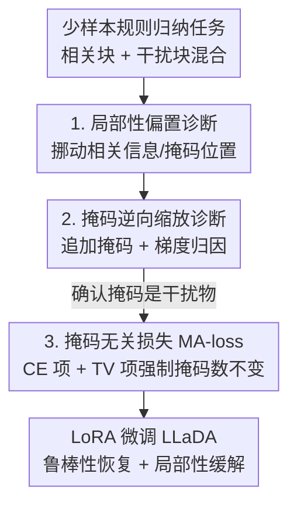

# Masks Can Be Distracting: On Context Comprehension in Diffusion Language Models

**会议**: ICML2026  
**arXiv**: [2511.21338](https://arxiv.org/abs/2511.21338)  
**代码**: 待确认  
**领域**: LLM / NLP（扩散语言模型）  
**关键词**: 掩码扩散语言模型, 上下文理解, 局部性偏置, 逆向缩放, 掩码无关微调

## 一句话总结
这篇论文系统揭示了掩码扩散语言模型（MDLM）两个被忽视的缺陷——和自回归模型一样存在强局部性偏置、以及"为并行生成而追加的掩码 token 会像干扰物一样拖垮上下文理解"，并提出一个掩码无关（mask-agnostic）微调损失，强制模型预测对掩码数量保持不变，从而显著恢复鲁棒性。

## 研究背景与动机

**领域现状**：掩码扩散语言模型（MDLM，如 LLaDA、Dream）被视为自回归语言模型（ARLM）的有力替代品。它用去噪目标在整条序列上并行预测被掩码的 token，配合双向注意力，理论上应该能更"全局"地利用上下文，而不像 GPT 那样被强制左到右生成。它最吸引人的卖点之一就是并行解码带来的推理加速。

**现有痛点**：尽管训练目标更全局，但没人系统检验过 MDLM 推理时到底怎么用上下文。两个直觉上"应该没问题"的地方其实有问题：一是它是否真的摆脱了 ARLM 那种"重视近处、忽略远处"的位置偏置；二是并行生成必须在输入末尾追加一大堆掩码 token（每个掩码占一个待生成位置），这些掩码被默认当成"中性占位符"，但它们对上下文处理的影响从没被量化过。

**核心矛盾**：掩码 token 在 MDLM 里身兼两职——训练时通过随机掩码构造去噪目标，推理时用来划定要预测的区间。作者发现，这个"既当训练信号又当生成脚手架"的设计，让掩码远不是无害的占位符：它们会抢走模型的注意力，把本该用于理解上下文的算力消耗掉。

**本文目标**：拆成三个子问题——(1) MDLM 是否存在位置/局部性偏置？(2) 追加掩码到底如何影响上下文理解，机制是什么？(3) 能否在不增加推理开销的前提下修复这种脆弱性？

**切入角度**：作者放弃了传统的"大海捞针"信息检索任务（这些任务太简单，且需要远超 MDLM 训练上下文长度才能暴露偏置），转而设计一套**少样本规则归纳任务**——给若干例子让模型从中推断抽象规则（如"三个词里选形容词"），答案刻意压缩成单个 token，这样可以用准确率做干净评估，还能做梯度归因、预测熵等细粒度分析，且全程不超出模型训练上下文长度。

**核心 idea**：先用受控实验证明"掩码是干扰物"这一现象（局部性偏置 + 掩码逆向缩放），再用一个掩码无关损失把"对掩码数量不变性"直接写进微调目标来修复它，顺带证明这种脆弱性是训练产物而非架构硬伤。

## 方法详解

这篇论文的"方法"由两部分组成：一套用来**诊断**问题的实验探针，和一个用来**修复**问题的微调损失。整体逻辑是先观测、再归因、最后纠正。

### 整体框架

实验平台是一套 16 个少样本规则归纳任务（8 个"选相关词"任务 + 2 个基于数字的干扰任务的组合，每个 1000 个测试点），通过把"相关示例块"和"干扰示例块"在 prompt 里随机或按位置混合，来精确操纵相关信息的位置和上下文难度。被测对象是两组配对模型：从零用掩码扩散损失训练的 LLaDA-8B（对比同架构 ARLM 的 Llama3-8B），以及从 ARLM 权重初始化的 Dream-7B（对比其初始化来源 Qwen2.5-7B），全部用贪婪解码。诊断分三步走：先测**位置敏感性**（局部性偏置），再测**追加掩码的破坏效应**（逆向缩放 + 梯度归因），最后用**掩码无关微调**去纠正，并验证脆弱性确实来自掩码。

### 关键设计

**1. 局部性偏置诊断：MDLM 也"近视"，且偏向掩码所在位置**

针对的痛点是：人们以为去噪目标加双向注意力能让 MDLM 均匀利用上下文。作者固定 10 个相关示例成一块、40 个干扰示例，只挪动相关块的位置来测准确率。结果是 MDLM（LLaDA、Dream）准确率随相关信息远离测试问题**单调下降**——这是强烈的 recency（近因）偏置，且不像 ARLM 那样呈现两端高的 U 形（没有明显 primacy 偏置，符合"primacy 主要源于因果注意力掩码"的已有解释）。

进一步把测试问题（连同被掩码的答案）也在 prompt 里移动，作者发现真正决定性能的不是"靠近右端"而是"**靠近掩码 token**"：相关信息离被掩码的问题越近表现越好，与绝对位置无关。所以"近因偏置"本质是更广义的"局部性偏置"。作者把根源归到掩码扩散损失的 $1/p$ 加权（$p$ 是掩码概率）：该权重让训练更偏重"只掩少量 token"的情形，而这些情形下靠近处上下文就够预测了，等价于把模型推向"依赖近处"。梯度归因（对预测答案 token 的 logit 关于输入 embedding 求 L2 范数）进一步证实：所有模型都呈现 U 形归因，但 MDLM（尤其 base 版）梯度分布比 ARLM 更均匀，说明全局利用上下文的潜力存在但没被发挥。

**2. 掩码逆向缩放诊断：追加的掩码是"干扰物"，且越长上下文越糟**

这是全文最反直觉的发现。作者原本假设"多加掩码会让模型更全局"，于是在 prompt 后追加不同数量的掩码 token（第一个掩码对应答案，单步解码后只评估这第一个掩码、忽略其余，以隔离多步解码的混淆因素）。结果却相反——准确率随掩码数**单调下降**：LLaDA-Base/Instruct 在贪婪解码下分别掉约 23、27 个百分点；从 ARLM 初始化的 Dream 更鲁棒，但加约 20 个掩码时仍掉 6–8 个百分点。在贪婪解码下还能掉点，说明掩码不是单纯增大熵，而是**把模型分布的众数推向了错误答案**。

作者做了三重归因来坐实"掩码就是干扰物"：(a) 随干扰示例增多（有效上下文变长），LLaDA 的掉点更严重，且"最受益于更多上下文的任务也最易被掩码毁掉"，说明掩码损害的正是长上下文理解；(b) 梯度归因显示追加掩码拿到的归一化梯度远高于任何非掩码 token（见下表），模型被掩码不成比例地牵着走；(c) 把追加掩码换成中性的重复 token（重复 " ."）做对照，LLaDA 几乎不掉点（最多掉 3/10 个百分点 vs 掩码的 23/27），证明破坏来自**掩码本身**而非"重复同一 token 的分布外现象"。此外，推理时迭代 unmask（40 步、按高置信度选择要揭开的 token）能基本恢复被掩码吃掉的准确率，但代价是多趟解码延迟。

**3. 掩码无关损失（MA-loss）：把"对掩码数量不变"直接写进微调目标**

前面证明脆弱性来自掩码，但 unmask 修复要靠多步解码、不适合低延迟场景。作者于是提出掩码无关损失，目标是让预测**对追加掩码数量不变**。做法是：对一个 prompt–answer 对，先按 Bernoulli($p$) 给答案加噪得到 $\tilde{\bm{a}}$，再随机取两个不同的追加掩码长度 $l_1, l_2$，构造两份只在"末尾追加掩码数量"上不同的输入 $\bm{x}_1, \bm{x}_2$。损失含两项：

$$\mathcal{L}_{CE}=-\frac{1}{2pn_m}\sum_{i=1,2}\sum_{j\in\mathcal{A}}\mathbb{1}\{x_i^j=m\}\log p_\theta(x^j|\bm{x}_i),\quad \mathcal{L}_{TV}=\frac{p}{n_m}\sum_{j\in\mathcal{A}}\mathbb{1}\{x_1^j=m\}\,TV\big(p_\theta(x^j|\bm{x}_1),p_\theta(x^j|\bm{x}_2)\big)$$

最终 $\mathcal{L}_{MA}=\alpha\mathcal{L}_{CE}+\beta\mathcal{L}_{TV}$。CE 项是标准交叉熵、保证无论追加多少掩码答案都对（按 $1/p$ 缩放，沿用掩码扩散目标）；TV 项是核心创新——用总变差距离**显式强制两种掩码配置下答案 token 的预测分布一致**（按 $p$ 缩放，使得即便答案里几乎没有未掩码 token 时分布仍对齐）；两项都除以掩码数 $n_m$ 做逐 token 归一化以适配不同答案长度。其中 $\mathcal{A}$ 是答案部分的 token 下标集合。直观上，TV 项就是在教模型"忽略末尾那串掩码"，单靠 CE 项做不到这点（消融证明）。

### 损失函数 / 训练策略
用 LoRA 适配器微调 LLaDA-Base/Instruct，在 OpenOrca 指令微调数据子集上约 1.2k 步梯度下降。刻意选用与 ICL 评估任务**不匹配**的 OpenOrca，是为了让微调引起的是模型全局性的改变、而非过拟合到 ICL 任务结构。消融模型把 $\beta=0$（只留 CE 项）以验证 TV 项的必要性。

## 实验关键数据

### 主实验

梯度归因（追加 50 个掩码，归一化梯度，± 为标准差）：掩码 token 拿到的梯度远高于任何非掩码 token，说明模型被掩码不成比例地牵引。

| 模型 | 掩码 token | 非掩码(最后50) | 非掩码(全部) |
|------|-----------|---------------|--------------|
| Dream-Base | 0.282 ± 0.040 | 0.012 ± 0.007 | 0.005 ± 0.003 |
| Dream-Instruct | 0.144 ± 0.031 | 0.030 ± 0.005 | 0.018 ± 0.002 |
| LLaDA-Base | 0.234 ± 0.021 | 0.005 ± 0.002 | 0.005 ± 0.002 |
| LLaDA-Instruct | 0.220 ± 0.031 | 0.057 ± 0.014 | 0.017 ± 0.003 |

注意"最后 50 个非掩码 token"（紧贴掩码左侧）梯度高于一般非掩码 token，再次印证近因/局部性偏置。

### 消融实验

| 配置 | 现象 | 说明 |
|------|------|------|
| 追加掩码（LLaDA-Base/Instruct） | 准确率掉约 23 / 27 pp | 掩码作为干扰物，贪婪解码下众数移向错误答案 |
| 追加"重复点号"代替掩码 | 仅掉约 3 / 10 pp | 破坏来自掩码本身，而非重复 token 的分布外现象 |
| 推理时迭代 unmask（40 步，高置信度） | 基本恢复准确率 | 有效但需多趟解码、增加延迟 |
| MA-loss 完整（CE + TV） | 显著恢复鲁棒性、降低局部性偏置 | 仅需极少解码步即可，适合低延迟 |
| MA-loss 仅 CE（$\beta=0$） | 无明显效果 | TV 项是把"掩码不变性"写进目标的关键 |

### 关键发现
- **掩码逆向缩放是 MDLM 特有的"掩码税"**：并行解码必须追加大量掩码，而掩码本身就会损害上下文理解——这是独立于"少步解码忽略 token 间依赖"之外的第二个性能退化来源。
- **从零训练 vs 从 ARLM 初始化差异明显**：LLaDA（从零用掩码扩散损失训）对掩码极敏感，Dream（从 Qwen2.5 初始化）鲁棒得多，暗示掩码对架构的"整合程度"决定了脆弱性。有趣的是 Dream 在梯度上仍被掩码强烈影响，却没反映到性能上，说明梯度归因不能完全解释行为。
- **脆弱性是训练产物而非架构硬伤**：MA-loss 能纠正它，证明只要在训练里强制掩码不变性就能修复，且不损害语言建模能力（附录验证）。
- **评估启示**：MDLM 评测必须显式报告所用掩码数量，并把"掩码敏感性分析"纳入标准评估流程（尤其长上下文任务），否则结果不可复现、不可比。

## 亮点与洞察
- **"掩码税"概念点破了 MDLM 加速的隐性代价**：大家只盯着"少步解码丢依赖"，作者指出追加掩码本身就在解码开始前先损害了上下文理解，这对设计快速采样器是关键约束。
- **干净的诊断设计**：用单 token 答案加少样本规则归纳，避开了生成式困惑度等模糊指标，使准确率、梯度归因、熵分析都能干净进行——这套"可控探针"方法可迁移到其他位置偏置/上下文研究。
- **TV 项的巧思**：与其事后多步 unmask 救场，不如训练时用总变差距离直接逼两种掩码配置的输出分布一致，把"不变性"做成可学的归纳偏置，几乎零额外推理开销。
- **"对照重复点号"消融是教科书级别的归因**：一句话排除了"分布外重复 token"的替代解释，把锅精确扣在掩码头上。

## 局限与展望
- 作者承认只分析了开源 MDLM，而这些模型的预训练细节（确切数据、掩码调度）未完全公开，难以区分"模型特有怪癖"与"MDLM 普遍性质"；更干净的结论需要训练流程完全透明的受控对比。
- 自己发现的局限：评估全靠自建的少样本规则归纳任务（虽附录补了 HotPotQA/GSM8k/多维分类），任务答案为单 token、上下文较短，掩码税在真实长文本生成中的量级仍需更贴近部署的验证；MA-loss 只在 LLaDA 系上验证，对 Dream 这类已较鲁棒模型增益有限。
- 改进思路：作者建议研究均匀扩散模型（不显式用掩码、把噪声更均匀地撒在输入上），看局部性/掩码敏感性是扩散范式固有还是掩码变体特有；并深入分析掩码扩散目标的加权方案与噪声调度，从训练动力学层面解释局部性来源。

## 相关工作与启发
- **vs 自回归模型的位置偏置研究（Liu 2023 "lost-in-the-middle" 等）**：他们在 ARLM 上记录 U 形（primacy + recency）偏置并归因于因果注意力掩码与训练数据；本文把这套分析迁移到 MDLM，发现 MDLM 是单调下降的纯局部性偏置（无 primacy），并定位到掩码扩散损失的 $1/p$ 加权，区别在于偏置根源不同。
- **vs MDLM 的 "AR-ness" 研究（Shansan 2025）**：他们研究 MDLM 在**解码顺序**上偏左到右；本文研究的是 MDLM 在**处理上下文**时的 AR 式倾向，关注点正交。
- **vs 推理时 unmask / 自适应并行解码**：unmask 能恢复准确率但要多步解码增加延迟；本文 MA-loss 用训练时不变性换来"极少步即鲁棒"，更适合低延迟与蒸馏管线。

## 评分
- 新颖性: ⭐⭐⭐⭐⭐ 首次系统揭示 MDLM 的局部性偏置 + 掩码逆向缩放（"掩码税"），并给出训练侧修复，视角新颖。
- 实验充分度: ⭐⭐⭐⭐ 多模型配对、梯度归因、多重对照消融扎实，但任务偏合成、上下文较短，长文本部署规模待验。
- 写作质量: ⭐⭐⭐⭐⭐ 现象—归因—修复逻辑清晰，"掩码税"与评估指南总结到位。
- 价值: ⭐⭐⭐⭐⭐ 直接影响 MDLM 的训练、评估与并行解码部署，评估指南有可操作性。

<!-- RELATED:START -->

## 相关论文

- [\[ICML 2026\] SPA-Cache: Singular Proxies for Adaptive Caching in Diffusion Language Models](spa-cache_singular_proxies_for_adaptive_caching_in_diffusion_language_models.md)
- [\[ICML 2026\] Reasoning on the Manifold: Bidirectional Consistency for Self-Verification in Diffusion Language Models](reasoning_on_the_manifold_bidirectional_consistency_for_self-verification_in_dif.md)
- [\[ACL 2025\] Uncertainty Unveiled: Can Exposure to More In-context Examples Mitigate Uncertainty for Large Language Models?](../../ACL2025/llm_nlp/uncertainty_unveiled_can_exposure_to_more_in-context_examples_mitigate_uncertain.md)
- [\[ACL 2026\] Unlocking the Potential of Diffusion Language Models through Template Infilling](../../ACL2026/llm_nlp/unlocking_the_potential_of_diffusion_language_models_through_template_infilling.md)
- [\[ICLR 2026\] Toward Safer Diffusion Language Models: Discovery and Mitigation of Priming Vulnerabilities](../../ICLR2026/llm_nlp/toward_safer_diffusion_language_models_discovery_and_mitigation_of_priming_vulne.md)

<!-- RELATED:END -->
