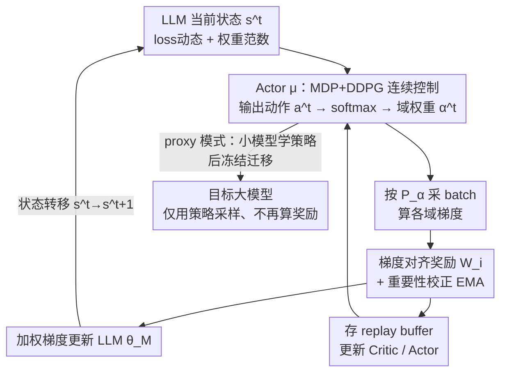

# AC-ODM: Actor–Critic Online Data Mixing for Sample-Efficient LLM Pretraining

**会议**: ICML2026  
**arXiv**: [2505.23878](https://arxiv.org/abs/2505.23878)  
**代码**: https://github.com/DANG-ai/AC-ODM  
**领域**: LLM 预训练 / 数据混合 / 强化学习  
**关键词**: 数据混合, 在线域权重, Actor-Critic, 梯度对齐, 样本效率

## 一句话总结
AC-ODM 把"预训练数据域权重怎么动态调"建模成一个强化学习的连续控制问题，用 DDPG 的 Actor-Critic 在训练过程中实时感知模型状态、输出各域采样权重，并用"域间梯度对齐度"当奖励——理论上证明这等价于最大化梯度的建设性干涉（有效下降步长），在 Pythia-1B 上比强基线少用约 66% 步数就达到最优困惑度，MMLU 相对提升 27.5%、HumanEval pass@1 翻到 2.23 倍，而每步墙钟仅增 0.4%、显存仅增 2%。

## 研究背景与动机
**领域现状**：预训练语料的域配比（GitHub 占多少、Wikipedia 占多少……）对 LLM 的样本效率、收敛速度和下游精度影响极大，甚至盖过单纯堆数据量。主流做法分两类：**静态混合**（DoReMi、DoGE、RegMix、CHAMELEON 等，训练前用小代理模型或启发式 leverage score 离线定好一组全局权重）和**动态混合**（ODM、PiKE 等，训练中按当前状态实时调权重）。

**现有痛点**：静态权重无法适应模型在漫长预训练里**不断变化的学习动态**，常常次优；而现有动态方法又卡在一个三难权衡里——精巧的选择算法（如估计梯度冲突的 PiKE）运行时开销高，轻量启发式又难适配多样化的训练管线（如"从零端到端训练、域会动态出现"vs"固定预备好的语料"两种场景）。

**核心矛盾**：现有动态混合**缺一个统一框架同时兼顾计算效率、样本效率和结构灵活性**——要么省算力但不够灵活/有效，要么有效但每步开销大。

**本文目标**：(1) 给数据混合一个有优化几何依据、而非纯启发式的理论基础；(2) 让动态调权重的每步开销可忽略；(3) 一套机制同时覆盖"固定语料"和"从零无先验"两种管线。

**切入角度**：把整个 LLM 预训练过程看成一个**环境**，域权重就是一个**智能体的连续动作**——既然状态（loss 动态、权重范数）和动作（域权重）都连续，自然落到 DDPG 这类确定性策略梯度框架。

**核心 idea**：用一个参数化策略（Actor）在线最大化"域间梯度的建设性干涉"，并从理论上证明这个奖励是 Gram 矩阵交互能量的线性代理，从而把"调数据配比"变成"显式优化有效下降步长"。

## 方法详解

### 整体框架
AC-ODM 把数据混合写成一个马尔可夫决策过程（MDP）并用 DDPG 求解。在第 $t$ 步：Actor $\mu_{\theta_A}$ 观测当前 LLM 的状态 $s^t$（迭代数、各域已采样本数、各域 loss 向量及其步间差、选定层的权重 $L_2$ 范数与更新幅度），输出动作 $a^t$，经 softmax 映射成概率单纯形上的域权重 $\boldsymbol{\alpha}^t$；按 $P_{\boldsymbol{\alpha}^t}=\sum_i \alpha_i^t\cdot\mathrm{UNIF}(D_i)$ 采一个 batch；计算各域梯度与"梯度对齐向量" $W^t$，用加权梯度更新 LLM 参数 $\theta_M$，并把 $W^t$ 当奖励 $r^t$；把转移元组 $(s^t,a^t,r^t,s^{t+1})$ 存进 replay buffer，再从中采样更新 Critic 和 Actor。整条回路是一个闭环：模型状态 → 策略调权重 → 采样训练 → 梯度对齐反馈 → 更新策略，显式地把优化推向"梯度互相增强"的方向。

### 关键设计

**1. 把在线数据混合建模为 MDP + DDPG 连续控制：状态与动作怎么设计**

数据配比是连续量、且要随训练动态调整，天然是连续控制问题，所以作者用 DDPG。状态 $s^t$ 必须紧凑又能反映训练动态，因此聚合了可观测信号：

$$s^t=(n,\ t,\ \ell(\theta_M,B),\ \Delta\ell(\theta_M,B),\ \|\omega\|_2,\ \|\Delta\omega\|_2),$$

其中 $n$ 是各域已采样本数、$\ell$ 是各域 loss 向量、$\Delta\ell$ 是步间差、$\|\omega\|_2$ 与 $\|\Delta\omega\|_2$ 是选定层权重范数及其更新幅度。动作 $a^t\in\mathbb{R}^K$ 过 softmax 得到合法的单纯形权重 $\boldsymbol{\alpha}^{t+1}$。相比 ODM 的多臂老虎机或 PiKE 的离散冲突估计，DDPG 直接在连续动作空间里学一个确定性策略，避免了离散化损失，也让"权重平滑随状态漂移"成为可能。为省算力，状态里的权重范数只在部分层（首层 + 所有偶数层）上算，几乎不损保真度。

**2. 梯度对齐奖励 $W_i$ + 重要性校正 EMA：用"建设性干涉"当奖励并防策略坍缩**

高效预训练要的不是"当前 loss 最低的域"，而是"既降自身 loss、又能加速其它域学习的域"。作者据此把域 $i$ 的奖励定义为它的梯度与其余语料聚合梯度的内积：

$$W_i\triangleq\big\langle \nabla\ell_i(\theta_M),\ \textstyle\sum_{j\neq i}\nabla\ell_j(\theta_M)\big\rangle.$$

内积为正说明该域更新方向与其它域一致（建设性干涉），为负说明冲突。为稳定训练，最终奖励用一个**重要性校正的指数滑动平均**：

$$\hat r_i^t=\xi\,\hat r_i^{t-1}+(1-\xi)\frac{W_i^t}{P_{\alpha_i}^{t-1}},$$

除以采样概率 $P_{\alpha_i}^{t-1}$ 是关键——它防止策略坍缩到"只采本来就高频的域"这种平凡解（高频域内积绝对值天然大，不校正就会自我强化）。这一奖励设计是 AC-ODM 区别于 PiKE 的核心：PiKE 是**减少**梯度冲突，AC-ODM 是**显式最大化**建设性干涉，后者直接对应更高效的下降方向。

**3. 优化几何视角的理论保证：奖励是 Gram 矩阵交互能量的线性代理**

作者给奖励一个不同于 DoGE（把梯度对齐当泛化损失的统计预测器）的全新依据：直接落到优化几何上。设梯度矩阵 $\mathbf{G}^t$ 的列是各域梯度，有效更新方向是 $\mathbf{g}_{total}^t=\mathbf{G}^t\boldsymbol{\alpha}^t$，其平方范数用经验 Gram 矩阵 $\mathbf{H}^t=(\mathbf{G}^t)^\top\mathbf{G}^t$ 展开：

$$\|\mathbf{g}_{total}^t\|^2=(\boldsymbol{\alpha}^t)^\top\mathbf{H}^t\boldsymbol{\alpha}^t=\underbrace{\textstyle\sum_i(\alpha_i^t)^2 H_{ii}^t}_{\text{自身幅度}}+\underbrace{\textstyle\sum_{i\neq j}\alpha_i^t\alpha_j^t H_{ij}^t}_{\text{交互能量}}.$$

一阶优化的收敛由更新向量的幅度主导，而交互能量项由 $\mathbf{H}^t$ 的非对角元 $H_{ij}=\langle\mathbf{g}_i,\mathbf{g}_j\rangle$ 决定（正=对齐，负=冲突）。直接最大化这个二次型代价高，但 AC-ODM 的奖励 $r_i=\langle\mathbf{g}_i,\sum_{j\neq i}\mathbf{g}_j\rangle$ 恰好是 $\mathbf{H}^t$ 非对角元的行和（相当于对 $\alpha_{j\neq i}$ 假设均匀先验）。于是策略优化的目标 $J(\boldsymbol{\alpha})=\sum\alpha_i r_i$ 就成了交互能量的**线性代理**——给高 $r_i$ 的域分配更多概率质量，等于把优化轨迹推向谱相干最大的区域，让采样梯度互相增强、放大有效步长 $\|\mathbf{g}_{total}^t\|$。这条理论把"为什么这个奖励有效"讲清楚了，而不是纯经验调出来的。

**4. Proxy / Non-Proxy 两种运行模式：一套机制覆盖两类管线**

为兼顾灵活性，AC-ODM 给出两种模式。**Non-Proxy（端到端）**：Actor、Critic 与目标 LLM 从零联合训练，适合"无先验、域可能动态出现"的直接预训练，每步开销可忽略（<0.5% 墙钟）。**Proxy（策略迁移）**：先在一个小代理模型上学好策略，再冻结 Actor、去掉奖励计算，迁移去指导大目标模型采样（见 Algorithm 2）——适合"固定语料、追求最终下游性能"的标准管线，因为把策略学习与目标训练解耦，避免了大模型早期探索噪声，实测泛化最强。两种模式不是竞争而是互补的工作点：语料在线变化就用 Non-Proxy，配比固定且目标模型昂贵就用 Proxy（一次性策略学习成本摊在小模型上）。

### 损失函数 / 训练策略
每步更新三组参数。**LLM**：$\theta_M^{t+1}=\theta_M^t-\eta^t\sum_i\alpha_i^t\nabla\ell_i(\theta_M^t)$（按域权重重加权梯度）。**Critic**：以 TD 目标 $y_k=r_k+\gamma Q_{\bar\theta_C}(s_k',\mu_{\bar\theta_A}(s_k'))$ 最小化均方误差 $L=\frac1N\sum_k(y_k-Q_{\theta_C}(s_k,a_k))^2$。**Actor**：沿确定性策略梯度 $\nabla_{\theta_A}J\approx\frac1N\sum_k\nabla_{\theta_A}\mu_{\theta_A}(s_k)\nabla_a Q_{\theta_C}(s_k,a)|_{a=\mu(s_k)}$ 上升，并维护目标网络做软更新 $\bar\theta\leftarrow\tau\theta+(1-\tau)\bar\theta$ 以稳训练。训练用 The Pile（22 域 825GB）与 SlimPajama（7 域），Pythia-1B 跑 41,667 步 ≈ 500 亿 token，前 833 步热身时用 The Pile 域权重加 $N(0,0.02)$ 高斯噪声替代策略输出以保探索。

## 实验关键数据

### 主实验：下游任务

| 方法 | MMLU 0-shot | MMLU 5-shot | HumanEval pass@1 |
|------|-------------|-------------|-------------------|
| TPW（原始启发式） | 0.207 | 0.275 | 0.141 |
| DoGE-10k | 0.223 | 0.281 | 0.157 |
| CHAMELEON（静态） | 0.221 | 0.283 | 0.148 |
| ODM（动态老虎机） | 0.235 | 0.284 | 0.325 |
| PiKE（减梯度冲突） | 0.248 | 0.304 | 0.522 |
| AC-ODM（non-proxy） | 0.251 | 0.299 | 0.603 |
| **AC-ODM-410M（proxy）** | **0.300** | **0.352** | **0.726** |

在 The Pile 上，proxy 模式的 AC-ODM-410M 比最强基线 ODM 在 0-shot/5-shot MMLU 上相对提升 **27.5%/23.9%**，HumanEval pass@1 达 ODM 的 **2.23 倍**；相对 PiKE 也有 +5.1% 的 0-shot MMLU 和 +39% 相对的 HumanEval 提升。收敛上，AC-ODM-410M 用比 ODM 少约 **66%** 的步数即达其最优困惑度，41,667 步处困惑度比 TPW/ODM/AC-ODM 分别低 20.7%/16.4%/13.1%；SlimPajama 上同样比 ODM 少 65% 步数。

### 计算开销与端到端加速

| 方法 | AC 参数 | 每步时间(s) | 收敛步数 | 端到端加速 |
|------|---------|-------------|----------|------------|
| ODM | 0 | 2.47 | 41,667 | 1.00× |
| PiKE | 0 | 2.53 | 31,250 | 1.30× |
| AC-ODM（non-proxy） | 17M | 2.48 | 28,356 | 1.46× |
| AC-ODM(160M proxy)→1B | 17M | — | 12,500 | 2.08× |
| AC-ODM(410M proxy)→1B | 17M | — | 12,010 | 1.47× |

Non-proxy AC-ODM 每步仅比 ODM 慢 0.4%（2.48 vs 2.47s），却把总步数砍 31.95%，端到端 1.46× 加速，超过 PiKE 的 1.30×；显存仅增约 2%。Proxy 模式把策略学习成本摊在小模型上，目标 1B 只需 ODM 步数的 28.82%。

### 关键发现
- **奖励设计贡献最大**：把奖励从"减冲突"换成"最大化建设性干涉 + 重要性校正"，是优于 PiKE 的根因；除以采样概率防止了"只采高频域"的坍缩。
- **域粒度敏感**：把 The Pile 的 22 域并成 11/5 域后困惑度单调变差（22域 13.43 → 5域更高），因为相关域合并后正负梯度交互在组内相互抵消、奖励判别力下降——AC-ODM 在"细分且彼此区分明显"的语料上收益最大，这也解释了为何 The Pile 上提升大于 7 域的 SlimPajama。
- **域重加权是机制而非任务捷径**：HumanEval 大涨时，域权重轨迹显示 StackExchange 和若干高质量通用域上调、而 GitHub 反被下调——说明增益来自更好的全局优化与可迁移推理信号，而非简单堆码数据。
- **跨架构泛化**：在 LLaMA-style 0.9B 上重复实验，proxy 模式仍把达到同一困惑度的步数减约 65%（相对 TPW），方向一致，只是边际更小（更强的稠密解码器留给数据混合的优化余量更少）。

## 亮点与洞察
- 把"数据配比"和"优化几何"用 Gram 矩阵交互能量串起来，给了一个可证明的奖励依据，而不是又一个调参启发式——这是它最扎实的地方。
- 奖励里"除以采样概率"这一招很巧：一行公式就堵住了"自我强化高频域"的退化路径，这个 trick 可迁移到任何"按权重采样 + 用采样信号当奖励"的在线选择问题。
- Proxy/Non-Proxy 双模式把"灵活性"做成了产品级设计：固定语料追性能就迁移小模型策略、在线变语料就端到端，两个工作点互补而非二选一。
- 17M 的 Actor-Critic 换来 1.46×~2.08× 端到端加速、每步仅增 0.4% 墙钟，性价比极高，对大规模预训练几乎零侵入。

## 局限与展望
- **依赖有意义的域划分**：作者自己证明粒度太粗就退化，意味着用前得先有一套"风格/知识/监督信号都足够区分"的域 taxonomy，否则奖励判别力不足。
- **奖励只看一阶梯度对齐**：建设性干涉是局部、贪心的一步代理，未必对应长程最优课程；理论保证是"边际有效步长"而非全局收敛最优。
- **状态/奖励计算仍需采子集近似**：权重范数只取部分层、奖励只用 12/14/16 层的末端 FFN（5000 万参数）来近似，虽省算力但保真度依赖这一选择，换架构需重调。
- **改进思路**：把奖励从一阶交互能量扩到考虑二阶/课程的多步信号，或让 Actor 同时输出域粒度的自适应合并，缓解对人工域划分的依赖。

## 相关工作与启发
- **vs DoReMi / CHAMELEON（静态）**：他们离线用代理模型或 leverage score 定一组全局权重，无法适应训练动态；AC-ODM 在线随状态调权重，实验上静态法被动态法稳定超越。
- **vs DoGE**：DoGE 也用梯度对齐，但把它当成"泛化损失的统计预测器"；AC-ODM 给出优化几何依据，证明对齐奖励是交互能量的线性代理、直接最大化有效下降步长——动机层面不同。
- **vs ODM**：ODM 用多臂老虎机做动态混合；AC-ODM 换成 DDPG 连续控制 + 梯度对齐奖励，收敛更快、下游更强（HumanEval 2.23×）。
- **vs PiKE**：PiKE **减少**梯度冲突且每步开销更高（2.53s）；AC-ODM **最大化**建设性干涉、每步几乎零增（2.48s），17/22 域困惑度更优。

## 评分
- 新颖性: ⭐⭐⭐⭐ 把数据混合转成 DDPG 连续控制，并用 Gram 矩阵交互能量给奖励一个可证明的优化几何依据，视角新。
- 实验充分度: ⭐⭐⭐⭐ 覆盖 The Pile/SlimPajama 两语料、Pythia 与 LLaMA 两架构、收敛/下游/开销/域粒度多维度，较完整（部分细节在附录）。
- 写作质量: ⭐⭐⭐⭐ 理论与工程衔接清楚，图 2 闭环 + Proposition 1 把"为什么有效"讲透。
- 价值: ⭐⭐⭐⭐ 每步仅增 0.4% 墙钟换 1.46×~2.08× 端到端加速、近零侵入，对大规模预训练有直接实用价值。

<!-- RELATED:START -->

## 相关论文

- [\[ICML 2026\] Explaining Data Mixing Scaling Laws](explaining_data_mixing_scaling_laws.md)
- [\[ICLR 2026\] Beyond URLs: Metadata Diversity and Position for Efficient LLM Pretraining](../../ICLR2026/llm_pretraining/beyond_urls_metadata_diversity_and_position_for_efficient_llm_pretraining.md)
- [\[ICML 2025\] Chameleon: A Flexible Data-mixing Framework for Language Model Pretraining and Finetuning](../../ICML2025/llm_pretraining/chameleon_a_flexible_data-mixing_framework_for_language_model_pretraining_and_fi.md)
- [\[ICML 2026\] POET-X: Memory-efficient LLM Training by Scaling Orthogonal Transformation](poet-x_memory-efficient_llm_training_by_scaling_orthogonal_transformation.md)
- [\[ICLR 2026\] Beyond Length: Quantifying Long-Range Information for Long-Context LLM Pretraining Data](../../ICLR2026/llm_pretraining/beyond_length_quantifying_long-range_information_for_long-context_llm_pretrainin.md)

<!-- RELATED:END -->
