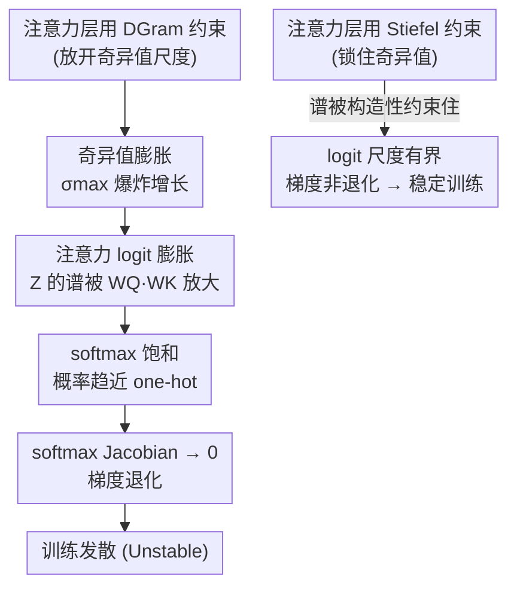

# Different Layers, Different Manifolds: Module-Wise Weight-Space Geometry in Transformer Optimization

**会议**: ICML2026（Workshop on Weight-Space Symmetries）  
**arXiv**: [2606.13276](https://arxiv.org/abs/2606.13276)  
**代码**: https://github.com/kiratoyoshihara/module-wise-manifold-muon  
**领域**: LLM预训练 / 优化器几何  
**关键词**: Manifold Muon、Stiefel 流形、DGram 约束、奇异值膨胀、softmax 饱和

## 一句话总结
这篇 workshop 论文在 GPT-2 small 预训练中系统比较了「按模块分配流形约束」的几种方案，发现把强谱约束（Stiefel）放在注意力层、把弱约束（DGram）放在 MLP 层效果最好，而只要给注意力层用 DGram 训练就会发散——并给出了「奇异值膨胀 → logit 膨胀 → softmax 饱和 → 梯度退化」这条失稳机制解释。

## 研究背景与动机

**领域现状**：近年的 Muon 优化器不再把每个参数当成独立标量来更新，而是对隐藏层的权重矩阵做「矩阵归一化更新」，从而控制更新的几何结构。Manifold Muon 进一步把这一思路推进到「让权重矩阵在优化过程中始终待在某个结构化矩阵流形上」，例如 Stiefel 流形（列正交）。

**现有痛点**：以往做正交/流形约束训练时，通常对网络里所有被约束的权重矩阵**一视同仁地套同一族约束**（要么都正交、要么都 Stiefel）。但 Transformer 里注意力层和 MLP 层的计算角色完全不同——注意力的权重要先两两相乘再过 softmax，MLP 的权重只是逐坐标过一个 GELU。用同一种几何去约束它们，未必合适。

**核心矛盾**：弱一些的约束（如 DGram）保留了部分结构、却放开了「列范数 / 奇异值的尺度自由度」。这种尺度自由在某些模块里可能有益（多一点表达自由），在另一些模块里却可能有害（被 softmax 这种全局竞争机制放大成灾难）。一刀切的约束分配无法兼顾。

**本文目标**：回答一个很基础但没人系统验证过的问题——**Transformer 的不同模块类型，是否偏好不同的权重空间几何？** 具体到注意力 vs MLP，该不该用同一种流形约束？

**切入角度**：作者不提新优化器，而是把 Manifold Muon 当工具，在严格共享超参的前提下，把「注意力/MLP 各自用 Stiefel 还是 DGram」的组合全部跑一遍，用验证 loss 和训练稳定性来读出偏好；再从谱（奇异值）和 softmax Jacobian 角度解释为什么会这样。

**核心 idea**：流形约束应当**按模块定制（module-specific）而非统一施加**——注意力层需要 Stiefel 的强谱控制，MLP 层则能受益于 DGram 的弱尺度自由。

## 方法详解

### 整体框架

本文不是提出新方法，而是设计了一组**受控对照实验 + 机制分析**。被研究的载体是 Manifold Muon：它在每步更新后，把被约束的权重矩阵投影回指定的矩阵流形。作者把约束分成两族——**Stiefel**（强谱约束，$W^{\top}W=I$，列正交，奇异值被锁住）和 **DGram**（弱约束，$\operatorname{Off}(W^{\top}W)=0$，只要求 Gram 矩阵对角，但不固定对角元，因而允许奇异值变大）。

然后把 Transformer 里被约束的权重矩阵分成「注意力组」和「MLP/FFN 组」两类，给每类独立选 Stiefel 或 DGram，得到 5 种分配方案：Unconstrained（不约束）、All-Stiefel（都用 Stiefel）、All-DGram（都用 DGram）、**Hetero**（注意力 Stiefel + MLP DGram）、**Hetero-Inv**（注意力 DGram + MLP Stiefel）。五者在**同一套模型架构、数据、训练计划、优化器超参**下训练 GPT-2 small（约 124M，nanoGPT 风格，OpenWebText），唯一变量就是流形分配，从而把「几何分配」的影响干净地隔离出来。

实验读出一个非常清晰的非对称结论后，作者用一条因果链解释为什么「DGram 放注意力」必然出事：

### 关键设计

**1. Stiefel 与 DGram：一强一弱的两种谱约束**

这是全文的「原材料」。Stiefel 约束要求 $W^{\top}W=I$，即列正交归一，直接把矩阵的全部奇异值锁在 1，提供**强谱控制**；代价是表达自由度小。DGram 是弱化版，只要求 Gram 矩阵的非对角元为零——$(W^{\top}W)_{ij}=0,\ i\neq j$——保留了列与列之间的正交结构，但**不固定列范数**，于是奇异值可以自由变大，多出一份「尺度自由度」。作者要论证的正是：这份尺度自由度在不同模块里的后果天差地别，所以它们才需要不同的几何。

**2. 模块异质分配（Hetero）：注意力上 Stiefel、MLP 上 DGram**

本文最核心的发现就是 Hetero 这一配置。把注意力权重约束在 Stiefel、把 MLP/FFN 权重约束在 DGram，在所有测试配置里拿到**最低的稳定验证 loss（3.3544）**，既优于完全不约束（3.3855），也优于统一的 All-Stiefel（3.3679）。背后的直觉是：注意力天然需要被「管住尺度」，而 MLP 反而能从弱约束的额外自由里得益。这条结论直接否定了「一种流形约束包打天下」的默认做法——**Transformer 优化应当按模块分配几何**。需要注意作者自己也强调，Hetero 与 All-Stiefel 之间只有约 0.013 的 loss 差距，应谨慎解读、需更多随机种子与更大规模验证；真正稳的结论是下面的定性失稳模式。

**3. 失稳机制：DGram 注意力的奇异值膨胀 → softmax 饱和 → 梯度退化**

这是论文最硬核的部分，也是「为什么注意力非 Stiefel 不可」的解释。注意力 pre-softmax logit 为 $Z=\frac{XW_QW_K^{\top}X^{\top}}{\sqrt{d}}$，其尺度直接受 $W_Q,W_K$ 谱范数控制：$\|Z\|_2\le \frac{\|X\|_2^2\,\|W_Q\|_2\,\|W_K\|_2}{\sqrt{d}}$。DGram 允许奇异值无限增长，于是 logit 被放大；而 logit 一大，softmax 就进入饱和区——若最大 logit 领先其余一个间隔 $\Delta$，则 $1-p_1\le (T-1)e^{-\Delta}$，概率指数级逼近 one-hot，其 Jacobian $J_{\text{softmax}}=\operatorname{diag}(p)-pp^{\top}$ 的 Frobenius 范数趋于 0，**梯度退化**，训练失稳。作者把这层对比形式化为两条命题：**Prop 4.1**——Stiefel 注意力在有界输入下梯度非退化，存在与权重无关的常数 $c(T,d,R)>0$ 使 $\|J_{\text{softmax}}(z)\|_F\ge c$；**Prop 4.2**——DGram 注意力存在可行的 $W_Q,W_K$ 使奇异值任意增大，从而对某些有界输入、对任意 $\varepsilon>0$ 都能产生 $\|J_{\text{softmax}}(z)\|_F<\varepsilon$ 的退化方向。实验上的 $\sigma_{\max}$ 爆炸曲线（All-DGram 与 Hetero-Inv）与这条理论完全吻合。作者诚实地标注：这是「合理机制解释」而非「DGram 注意力在所有优化器设置下都必然不稳」的完整证明。

**4. 为什么 MLP 能容忍 DGram 而注意力不能**

同样的尺度自由度，放进 MLP 却安然无恙，关键在非线性结构不同。MLP 块是 $\operatorname{MLP}(x)=W_{\text{out}}\,\phi(W_{\text{in}}x)$，GELU 逐坐标作用，每个坐标的导数由自己决定，**不存在 softmax 那种把所有 token 分数耦合进同一个归一化概率单纯形的全局竞争**——某一坐标被放大或饱和，不会逼着整个模块塌成近 one-hot 路由。再加上 Transformer 块里的 LayerNorm 与残差连接能在进入下一块前部分吸收激活尺度的变化，于是 DGram 在 MLP 上「奇异值会涨但训练不崩」（Hetero 实测如此）。这条解释把「注意力需要谱控制、MLP 可放开尺度」从经验现象升级成了有结构依据的原理。

## 实验关键数据

### 主实验

GPT-2 small（124M）在 OpenWebText 上预训练，五种流形分配共享全部超参，只比验证 loss 与是否稳定（Unst. = 在统一超参下发散）。

| 分配方案 | 注意力约束 | MLP 约束 | 验证 loss / 结果 |
|----------|-----------|----------|------------------|
| Unconstrained | 无 | 无 | 3.3855 |
| All-Stiefel | Stiefel | Stiefel | 3.3679 |
| All-DGram | DGram | DGram | **Unstable** |
| **Hetero** | **Stiefel** | **DGram** | **3.3544（最佳稳定）** |
| Hetero-Inv | DGram | Stiefel | **Unstable** |

### 谱演化分析

| 配置 | 注意力 $\sigma_{\max}$ | MLP $\sigma_{\max}$ | 训练结果 |
|------|------------------------|---------------------|----------|
| Stiefel 注意力（All-Stiefel / Hetero） | 有界（构造性锁住） | Hetero 下 DGram MLP 谱会增长 | 稳定 |
| DGram 注意力（All-DGram / Hetero-Inv） | 爆炸增长至极大值 | — | 发散 |

### 关键发现
- **「DGram 放注意力」是失稳的充分条件**：All-DGram 与 Hetero-Inv 这两个唯一把 DGram 给注意力的配置全部发散，且发散前都伴随注意力 $\sigma_{\max}$ 爆炸——定性结论比 0.013 的 loss 优势稳健得多。
- **MLP 能消化 DGram 的尺度自由**：Hetero 下 MLP 权重谱范数照样增长，但因为没有 softmax 全局竞争 + 有 LayerNorm/残差兜底，训练不崩反而最优。
- **Hetero vs All-Stiefel 的 loss 差距很小（3.3544 vs 3.3679）**：作者明确提醒该差距应谨慎解读，需更多种子与更大规模复现；真正可靠的是失稳模式的一致性。

## 亮点与洞察
- **把「按模块分配几何」当成一个独立设计轴**：以往流形约束总是一刀切，本文第一次系统证明注意力和 MLP 偏好不同几何，给优化器设计开了一个新维度。
- **失稳机制讲到了「为什么」而非只报现象**：从奇异值膨胀一路推到 softmax Jacobian 趋零，配两条命题，把「DGram 注意力为什么崩」讲成了可分析的链条，可迁移到其他「权重谱 → 注意力 logit → softmax 行为」的稳定性研究。
- **诚实克制的写作**：反复强调 loss 差距小、机制非完整证明、规模有限，避免把 workshop 规模的结论吹成普适定律——这种 caveat 意识本身值得借鉴。

## 局限与展望
- **规模与样本极有限**：只在 GPT-2 small + OpenWebText 上、少量训练 run，结论能否放大到大模型存疑。
- **共享超参是双刃剑**：它隔离了几何变量，但也无法排除「DGram 注意力换个学习率/加显式尺度控制/对 DGram 权重加 weight decay 就能稳住」的可能；因此「DGram 注意力必崩」只在该统一设置下成立。
- **机制分析非完整证明**：未直接测训练全程的 logit 尺度、注意力熵、梯度流；作者把这些以及「自动为各模块/架构/规模分配流形约束」列为未来方向。

## 相关工作与启发
- **vs Muon / Manifold Muon（Jordan 2024 / Bernstein 2025）**：它们提出矩阵归一化更新与流形约束优化器，本文不提新优化器，而是研究「同一个 Manifold Muon 下，约束该怎么按模块分配」。
- **vs 统一正交/Stiefel 约束训练（Huang 2018 等）**：以往对所有权重套同族约束，本文证明这种统一做法对 Transformer 不够，注意力与 MLP 需区别对待。
- **vs DGram / Gram-space Manifold Muon（Keigwin 2025）**：本文借用 DGram 这一弱约束，但揭示了它「在 MLP 有益、在注意力致命」的模块依赖性。

## 评分
- 新颖性: ⭐⭐⭐⭐ 「按模块分配流形几何」的视角新颖，且给出了清晰机制解释。
- 实验充分度: ⭐⭐ 仅 GPT-2 small、少量 run、单一数据集，作者亦自承规模有限。
- 写作质量: ⭐⭐⭐⭐ 逻辑干净、caveat 诚实、机制讲透。
- 价值: ⭐⭐⭐⭐ 为优化器几何设计开了「模块定制」这一实用维度，值得在更大规模上验证。

<!-- RELATED:START -->

## 相关论文

- [\[ICML 2026\] On the Expressive Power of Permutation-Equivariant Weight-Space Networks](on_the_expressive_power_of_permutation-equivariant_weight-space_networks.md)
- [\[NeurIPS 2025\] Predict Training Data Quality via Its Geometry in Metric Space](../../NeurIPS2025/llm_pretraining/predict_training_data_quality_via_its_geometry_in_metric_space.md)
- [\[AAAI 2026\] PrefixGPT: Prefix Adder Optimization by a Generative Pre-trained Transformer](../../AAAI2026/llm_pretraining/prefixgpt_prefix_adder_optimization_by_a_generative_pre-trained_transformer.md)
- [\[ICML 2026\] Inverse Depth Scaling From Most Layers Being Similar](inverse_depth_scaling_from_most_layers_being_similar.md)
- [\[ICML 2026\] Names Don't Matter: Symbol-Invariant Transformer for Open-Vocabulary Learning](names_dont_matter_symbol-invariant_transformer_for_open-vocabulary_learning.md)

<!-- RELATED:END -->
