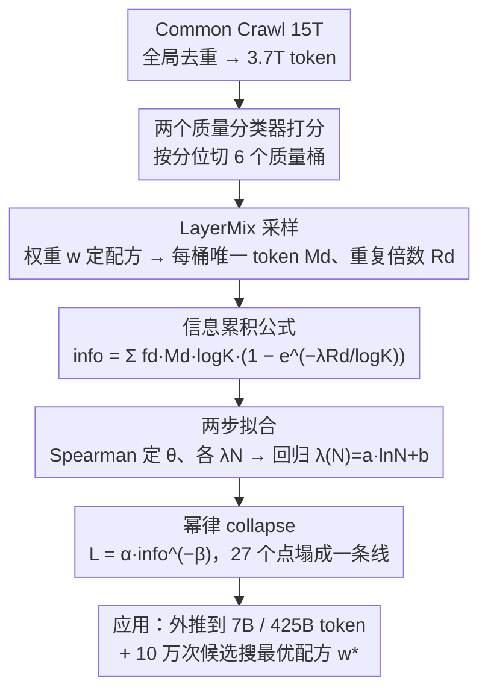

# InfoLaw: Information Scaling Laws for Large Language Models with Quality-Weighted Mixture Data and Repetition

**会议**: ICML 2026  
**arXiv**: [2605.02364](https://arxiv.org/abs/2605.02364)  
**代码**: 无  
**领域**: LLM 预训练 / Scaling Law / 数据配方  
**关键词**: scaling law, 数据质量, 数据重复, 数据配方, 信息量

## 一句话总结
作者提出 InfoLaw：把"预训练"重新定义为"按桶累积信息"的过程，每桶信息量等于"质量密度 $f_d$ × 唯一 token 数 $M_d$ × $\log K$"再乘上一个随重复次数 $R_d$ 指数衰减的因子，最终把验证损失写成 $L = \alpha\cdot\text{info}^{-\beta}$，能在 252M-1.2B 拟合后外推到 7B / 425B token，平均误差 0.15%、最大 0.96%，并直接用来搜索最优数据配方。

## 研究背景与动机

**领域现状**：Chinchilla 系 scaling law 把 loss 写成 $L = E + A/N^\alpha + B/D^\beta$，在数据充裕情形下能精准外推。但实践里 overtraining 已成主流（LLaMA / Qwen 系列），高质量 token 不够用必须重复或混合低质量。

**现有痛点**：(i) 标准 scaling law 在重复设定下系统性低估大模型 loss（Fig 1：用 252M-1.2B 拟合的 power-law 在 2.5B 上就明显跑偏）；(ii) 不同 mixture 配方（高质多+少样、低质少+多样）会落在不同曲线上，无法跨配方比较；(iii) 想找最优配方只能做小规模 grid search，但小规模和大规模的最优配方还不一致——这就把数据配方决策卡在了"不能预测就只能盲烧 GPU"。

**核心矛盾**：质量越高单次价值越高、但有限 token 必须重复，重复又带来递减回报；compute 这一个轴已经无法同时刻画"质量 × 重复 × 规模"三个变量。

**本文目标**：建一个数据感知的 scaling law，能跨 (mixture 配方, model size, training token, overtrain 比) 四个维度外推 loss，并能不跑额外实验就搜出最优数据配方。

**切入角度**：换轴！既然 compute $C$ 不够刻画这种情况，那就构造一个新的"effective data signal"——把训练看成"信息累积"，让不同 mixture 在同一信息量下产生同一 loss，整组实验点自然 collapse 到同一条幂律线上。

**核心 idea**：信息量 = ($f_d M_d \log K$) × (1 − $e^{-\lambda(N) R_d/\log K}$)，前一项是数据中"潜在信息"，后一项是"被模型学到的比例"，把所有 mixture × scale × repetition 实验在 $L$-info 平面上统一到一条幂律 $L = \alpha\cdot\text{info}^{-\beta}$ 上。

## 方法详解

### 整体框架
InfoLaw 想回答一个被 compute 单轴卡死的问题：当高质量 token 不够、必须靠重复和混合低质数据时，loss 到底由什么决定。它的做法是把预训练重新看成"按质量桶累积信息"，先从 Common Crawl 全局去重得到 3.7T token、用两个质量分类器打分切成 6 个质量桶，再用 LayerMix 采样把每次训练的"质量分布 + 重复程度"参数化成一组权重 $w$，然后构造一个能把所有 mixture×scale×repetition 实验塌到同一条幂律线上的信息量公式 $\text{info}$，最后只用 9 个 252M-1.2B 小模型（27 个 run）拟合出全部参数，就能外推到 7B / 425B token 并直接搜出最优数据配方。

### 关键设计

**1. LayerMix 采样：把"质量 × 重复"拆成 6 个可独立估计的桶**

传统 scaling law 默认 token 不重复、也不分质量，于是质量和重复这两件事的贡献被搅在 $D$ 一个变量里分不开。LayerMix 的破法是先按质量分位把语料切成 6 个桶，源池占比固定为 $B=[0.05, 0.15, 0.20, 0.20, 0.20, 0.20]$，再用一组权重 $w=[w_0,\ldots,w_5]$（约束 $w_d\geq w_{d+1}$ 且和为 1，强制高质量桶优先）控制训练集的配方。给定总量 $K$ 后第 $d$ 桶要装 $K_d = w_d K$ 个 token，但源里可用的唯一 token 只有 $M_d = \min(K_d, B_d S)$ 个，于是平均重复倍数 $R_d = K_d / M_d$——配额没超过源池时 $R_d=1$、超了就 $>1$。这样一来数据配方变成一个 6 维参数空间，每个维度的 $(w_d, R_d)$ 都能单独估它对最终 loss 的边际贡献，这正是后面能把 loss 拆成"加性信息"的前提。

**2. 信息累积公式：质量密度 × 指数衰减 × 对数归一化**

有了 6 桶，还得回答"读一段数据到底能换来多少有效信息"，并让这个量同时吃进质量、重复、模型容量和训练规模。作者从单文档建模起步：第 $t$ 次读同一文档的信息增益按一阶指数衰减 $I_{i\_\text{part}}(t, \lambda(N)) = I_i\cdot\lambda(N)e^{-\lambda(N)t}$，积分得读 $T$ 次后的累计信息 $I_{i,\text{total}}(T) = I_i(1-e^{-\lambda(N)T})$，这一项天然刻画了"重复的边际收益递减"。但只有这项无法跨数量级泛化，于是补上一个 $\log K$ 归一化（实证发现去掉它就跨不了规模），得 $I_{i,\text{total}} = I_i\log K(1-e^{-\lambda(N)T/\log K})$。把六个桶相加就是总信息量

$$\text{info}(w, K, S, f, \lambda(N)) = \sum_d f_d M_d \log K\cdot\big(1 - e^{-\lambda(N) R_d/\log K}\big)$$

其中 $f_d = e^{-\theta d}$ 是单调递减的质量密度（桶越差信息密度越低），$\lambda(N) = a\ln N + b$ 是由模型容量决定的"学习率"。这个写法的妙处是把"数据潜力"和"学习能力"解耦——$f_d M_d\log K$ 是数据里的潜在信息，$(1-e^{-\lambda(N)R_d/\log K})$ 是被这个尺寸的模型实际榨出来的比例，两者一乘就自然给出"小模型早饱和、大模型能多吃信息"的图像。最终验证损失就拟合成一条幂律 $L = \alpha\cdot\text{info}^{-\beta}$。

**3. 两步拟合 $f_d$ 与 $\lambda(N)$：先选单调度量、再定外推形式**

参数虽然只有四组（$\theta, \lambda(N), \alpha, \beta$），但要在 27 个实验点上既不过拟合又能外推到未见 $N$，拟合方式得讲究。第一步把 $f_d = e^{-\theta d}$ 的 $\theta$ 和每个模型的 $\lambda_N$ 当离散变量，从参数空间采 10 万组 $(\theta, \{\lambda_N\})$，用 Spearman 秩相关 $\rho_s(L, \text{info})$ 当拟合度量挑最优组——选 Spearman 而不是 MSE，是因为它只看单调一致、对绝对尺度不敏感，正好契合"info 单调对应 loss"这个语义，得到 $\theta^*=0.922$。第二步把每个模型拟出的 $\lambda_N^*$ 当数据点回归 $\lambda(N)=a\ln N+b$，得 $a^*=0.140, b^*=0.018$；选对数形式是因为它在外推区间单调饱和，吻合"更大模型学习率边际增长但不发散"的直觉。对 $f_d, \lambda(N)$ 强制参数形式而不是查表，就是为了让外推到 1.5B-7B 仍然可控。loss-info 幂律最终拟合到 $\alpha=3.7373, \beta=0.0441$。

### 损失函数 / 训练策略
所有 27 个 fit 实验固定 overtrain 比 $m=3.6$、Transformer + SwiGLU + RoPE、250k 词表、bf16；外推实验里 $m'=25$ 用 1.2B/640B token 验证。用拟合好的 InfoLaw + 100k 次 mixture 候选采样直接选最优 $w$（不需再训）。

## 实验关键数据

### 主实验

| 评估场景 | 配置 | 平均/最大绝对误差 |
|---------|------|--------------------|
| 未见 LayerMix (MLQ/MHQ) ×252M-1.2B | 在范围内 mixture | 完美 collapse 到曲线 |
| 1.5B-2.5B × MQ/LQ/HQ | 模型外推 | 平均 0.15% / 最大 0.96% |
| 7B × MLQ/MHQ × 300B token | 同时未见 mixture + scale | 平均 0.15% / 最大 0.96% |
| 25× overtrain (1.2B, 640B token) | 跨 overtrain 域 | 拟合曲线近乎平行只是截距偏移 |
| 2.5B 最优配方搜索 | $w^*=[0.50, 0.49, 0.01, 0, 0, 0]$ | 击败 4 个 baseline |

### 消融实验

| 设置 | 关键指标 | 说明 |
|------|---------|------|
| 无 $\log K$ 归一化 | 无法跨规模 | 验证 $\log K$ 是必需项（Appendix B） |
| $\lambda(N)$ 用 power-law / exp | 外推差 | log 函数最贴合 |
| 传统 scaling law $L(C)$ | 大模型系统低估 | Fig 1 中 7B 上明显跑偏 |
| 1.2B + 25 个随机 mixture | Pearson 0.76 | InfoLaw 能排序未见配方 |

### 关键发现
- **小模型 / 小 token 喜欢质量，大模型 / 大 token 喜欢多样**：表 2 给出 7B 在 300B token 下最优 $w_0=0.548$、$w_1=0.444$；到 1000B token 时 $w_0$ 降到 0.395、$w_2$ 升到 0.214。这反向证伪了"高质量永远越多越好"的朴素直觉。
- **重复的边际收益指数衰减**：HQ 配方下 top 5% 桶重复 16×，MQ 下重复 10×；前期两者 loss 接近，后期 HQ 收敛更慢，正好对应 $1-e^{-\lambda R/\log K}$ 在 $R$ 大时饱和。
- **info collapse 是核心实证**：原本散乱的 27 个点（不同 $w, N, K$）在 $L$-info 图上塌成一条直线（Fig 3f），是 InfoLaw 成立的最直观证据。
- **overtrain 只改截距不改斜率**：$m=3.6$ 和 $m'=25$ 两条曲线在 log-log 平面近乎平行，意味着 InfoLaw 不用对每个 overtrain 比重新拟合 $\beta$。

## 亮点与洞察
- **换 x 轴的思想很优雅**：当 compute $C$ 这一个轴解释力不够时，与其加更多项，不如换一个能容纳"质量 × 重复"的合成轴——info。和 Chinchilla 那种"加 N 和 D 两项"的做法相比，InfoLaw 更"数据为本"。
- **$\log K$ 归一化是关键 hack**：作者在附录里实证了无它无法跨规模泛化，提示 scaling law 设计时除了模型尺寸还要考虑"数据规模本身对学习率"的稀释。
- **小模型当配方搜索器**：把 252M-1.2B 当成"实验平台"+ 100k 次廉价 mixture 候选采样，能给 7B 直接挑配方，是数据高效"先验调度"的范式。
- **一个公式回答两个问题**：既能预测大模型 loss，又能挑数据配方；前者是"诊断"，后者是"决策"，把 scaling law 用法从被动延伸到主动。

## 局限与展望
- 拟合数据只覆盖 252M-1.2B 三个 mixture，未在 MoE、长上下文、code/math 专门子集上验证。
- 质量分桶依赖两个外部分类器的平均，分类器本身的偏差会传到 $f_d$ 上，没做敏感性分析。
- $\lambda(N) = a\ln N + b$ 在 N 极大时是否仍单调饱和，论文只用 7B 验证，再上一个量级（>100B）外推风险未知。
- 仅以验证 perplexity / 五任务平均作为 loss，对"事实知识量""推理深度"等高层能力是否仍单调与 info 对应未知。
- 还未考虑 curriculum 顺序（先难后易 vs. 随机），LayerMix 默认随机打包。

## 相关工作与启发
- **vs Chinchilla (Hoffmann 2022)**：Chinchilla 假设数据无限只算 $N$ 和 $D$ 两项；InfoLaw 把 $D$ 拆成"质量 × 重复 × 桶占比"，在数据受限时更准确。
- **vs Muennighoff 2023 (数据约束下重复 scaling law)**：他们引入 $R_{\text{D}}^*$ 重复有效系数描述单源重复，InfoLaw 把它扩展到多桶混合，并加入了质量密度 $f_d$。
- **vs RegMix (Liu 2024)**：RegMix 用小代理模型回归挑配方，要训很多个代理；InfoLaw 用一条 info-loss 幂律，搜索时不用再训。
- **vs DataComp-LM / FineWeb (Penedo, Li)**：他们提供高质量数据池但没说怎么"按比例混"；InfoLaw 给了一个原则化的配方选择器，可以无缝接在 DataComp 之后。

## 评分
- 新颖性: ⭐⭐⭐⭐ "info 为坐标" 是个清新的视角，公式构造和物理直觉（重复递减 + 对数归一化）契合度高。
- 实验充分度: ⭐⭐⭐⭐ 27 个 fit + 1.5B-7B 多尺度外推 + 25× overtrain + 配方搜索验证，覆盖密度算预训练 paper 里很高的；遗憾是只在普通 dense Transformer 上，没碰 MoE。
- 写作质量: ⭐⭐⭐⭐ Fig 1 用 loss-C 直接揭示问题，Fig 3 用 info collapse 直观证明结论，公式推导清晰；附录补全归一化项消融。
- 价值: ⭐⭐⭐⭐ 给实际预训练团队提供了一个"小规模拟合 → 大规模选配方"的工具，节省 GPU 投入潜力巨大，行业落地价值很高。

<!-- RELATED:START -->

## 相关论文

- [\[ICML 2026\] Explaining Data Mixing Scaling Laws](explaining_data_mixing_scaling_laws.md)
- [\[ICML 2026\] Dropout Universality: Scaling Laws and Optimal Scheduling at the Edge-of-Chaos](dropout_universality_scaling_laws_and_optimal_scheduling_at_the_edge-of-chaos.md)
- [\[ICML 2026\] On Training Large Language Models for Long-Horizon Tasks: An Empirical Study of Horizon Length](on_training_large_language_models_for_long-horizon_tasks_an_empirical_study_of_h.md)
- [\[ICML 2026\] Predicting Large Model Test Losses with a Noisy Quadratic System](predicting_large_model_test_losses_with_a_noisy_quadratic_system.md)
- [\[ACL 2025\] DavIR: Data Selection via Implicit Reward for Large Language Models](../../ACL2025/llm_pretraining/davir_data_selection_via_implicit_reward_for_large_language_models.md)

<!-- RELATED:END -->
