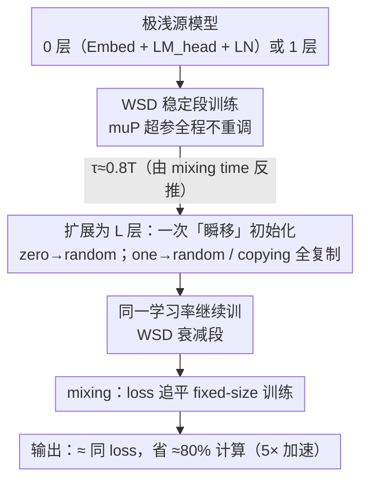

# Scaling Depth Capacity via Zero/One-Layer Model Expansion

**会议**: ICML 2026  
**arXiv**: [2511.04981](https://arxiv.org/abs/2511.04981)  
**代码**: 无  
**领域**: LLM预训练 / 高效训练 / 模型扩展  
**关键词**: progressive training, 深度扩展, zero/one-layer, WSD schedule, muP

## 一句话总结
本文提出"零层/一层渐进式训练"——先训一个几乎没有 Transformer 层的极浅模型，再在训练后期（≈80% iterations）一次性把深度扩展到目标层数，配合 WSD 学习率和 muP 超参传递，可在 GPT2/LLAMA3/DeepSeekV3 上节省约 80% 计算（≈5× 加速）且最终 loss 几乎不掉。

## 研究背景与动机
**领域现状**：训练大模型代价惊人（LLAMA-4 训练 >7M GPU 小时），主流加速思路之一是 **progressive training / model expansion**：先训一个小的"教师/源模型"，然后某个时刻 $t=\tau$ 把模型扩展到大尺寸继续训练。其计算量近似为 $6B(\tau N_{\text{small}} + (T-\tau) N_{\text{large}})$，比固定大尺寸训练的 $6BTN_{\text{large}}$ 显著更小，前提是 $\tau$ 接近 $T$ 且 $N_{\text{small}} \ll N_{\text{large}}$。

**现有痛点**：现有方法把深度扩展限制在 2-4×、源模型层数仍要十几层，因此节省的计算只有 ≈30-45%（grown vs target 的对比口径），而且大多数工作只在 BERT/ViT 等分类模型上验证，在生成式 LLM 上只能拿到 1.4-2× 加速。更糟的是，多阶段扩展（如 0→2→12）虽然形式上更"渐进"，却没有展示出能跨越扩展点的 *mixing*（loss 追平）行为。

**核心矛盾**：现有方法在两个维度上都没推到极限——一是没人敢真用 0/1 层这种极浅源模型（太极端，不知道能不能学到东西迁移给大模型）；二是 *function-preserving* 初始化（如 zero-init 子层）与 *feature learning* 是冲突的：zero 让 loss 不跳变，但梯度死了、新层学不动；同时学习率调度（cosine 默认在后期已衰减到几乎为 0）也使得"晚扩展"根本来不及收敛。

**本文目标**：（1）把源模型推到极端的 0 或 1 层；（2）把扩展时刻 $\tau$ 推到 0.8T；（3）保证扩展前后超参不用换；（4）给一套覆盖 dense/MoE、MHA/GQA/MLA、cosine/WSD 的统一recipe，并配上凸优化收敛证明解释为什么这套东西 work。

**切入角度**：把"深度扩展"重新建模为大模型训练的一个**初始化问题**——把大模型 $\mathbf{W}_t = [\mathbf{w}_t, \mathbf{x}_t]$ 拆成"小模型部分 + 新增层部分"，则渐进式训练等价于先对 $\mathbf{x}$ 做投影梯度下降（mask 到 0）+ 一次到良好初始化的"瞬移"+ 之后正常 SGD。在这个统一视角下，初始化策略和学习率调度都能用 convex+Lipschitz loss 的收敛界推出来。

**核心 idea**：零/一层 progressive training + WSD schedule + muP 超参传递 = 在"loss-compute Pareto 前沿"上把现有工作整体往左下推一大截。

## 方法详解

### 整体框架
全套 pipeline 简洁到一句话能讲完：先训练一个 0 层（只有 Embedding + LM_head + 最终 LayerNorm、*完全没有* Transformer 层）或 1 层的极浅模型，在 WSD schedule 的*稳定阶段*选一个时刻 $\tau \approx 0.8T$ 把模型一次性扩展到目标深度 $L$ 层（zero-layer 只能 random init 新层，one-layer 既可 random 也可 copying，例如 $\mathbf{w}\to[\mathbf{w},\mathbf{w},\mathbf{w}]$），扩展后**沿用同一个学习率**继续训到底。难点不在流程，而在三件互相牵制的事：怎么证明这套东西不会掉 loss、扩展前后凭什么不用重调超参、扩展时机为什么能晚到 80%——下面三个设计分别回答它们。同一套 recipe 在 GPT2 / LLAMA3 / Qwen3 / Mixtral / DeepSeekV3 / ResNet 上原样跑通，覆盖 weight-tying、dense/MoE、MHA/GQA/MLA、绝对/旋转位置编码、LayerNorm/RMSNorm、GeLU/SwiGLU 各种变种。

### 关键设计

**1. 把"深度扩展"重述成大模型的初始化问题，用一个收敛 bound 统管所有选择**

前面提到的核心矛盾是：初始化策略和学习率调度看起来都是各调各的工程旋钮，没人能说清它们该往哪拧。本文的破局点是换一个代数视角——把扩展后大模型的参数 $\mathbf{W}_t=[\mathbf{w}_t,\mathbf{x}_t]$ 拆成"复用的小模型部分 $\mathbf{w}$ + 新增层部分 $\mathbf{x}$"，并设最优解 $\mathbf{W}^*=[\mathbf{w}^*,\mathbf{x}^*]$。于是整个渐进式训练等价于：扩展前对 $\mathbf{x}$ 做投影梯度下降（把新层 mask 成 0）、扩展瞬间把 $\mathbf{x}$ 一次"瞬移"到某个初始化、之后正常 SGD。在 convex + $G$-Lipschitz loss 假设下，把这两段 SGD 的 loss 上界与 fixed-size 训练的上界相减、telescoping 一通，就得到二者 gap 的显式表达式：

$$\text{gap} = \frac{\sum_{t=1}^{\tau}\eta_t}{\sum_{t=1}^{T}\eta_t}\big(L(\mathbf{w}^*)-L(\mathbf{W}^*)\big) + \frac{\|\mathbf{x}_\tau-\mathbf{x}^*\|^2-\|\mathbf{x}_0-\mathbf{x}^*\|^2}{2\sum_{t=1}^{T}\eta_t}.$$

这个 bound 直接把两个工程选择翻译成了数学方向。第二项管初始化：它要求把 $\mathbf{x}_\tau$（瞬移起点）放得比 $\mathbf{x}_0$ 离最优 $\mathbf{x}^*$ 更近——random 初始化让这项 $=0$、copying 让它 $<0$，于是"复制小模型的层"天然占便宜。第一项管学习率调度：$\frac{\sum_{t\le\tau}\eta_t}{\sum_t\eta_t}$ 必须小（因为小模型最优 $L(\mathbf{w}^*)$ 通常劣于大模型 $L(\mathbf{W}^*)$，这个比值是它的权重），意味着扩展前学习率不能太大、扩展后又不能衰减太狠——这正好就是 WSD（warmup-stable-decay）的形状。换句话说，初始化用 copying、调度用 WSD，不是试出来的，是从同一个 bound 里推出来的。

**2. muP-scaled 初始化让 0/1 层小模型与目标深模型共用一组超参，扩展瞬间不重调**

渐进训练在工程上最烦的，就是"小模型调好的学习率、weight decay 到了大模型可能全废"。本文用 muP 把超参的最优值在 model size 维度上拉成常数来根治这点：要求每层激活的 element-wise scale 对齐，即 $\|\mathbf{A}_l\|_2/\sqrt{n_l} \sim \|\mathbf{A}_{l+1}\|_2/\sqrt{n_{l+1}}$，落到线性层就是 spectral scaling 条件 $\|\mathbf{W}_l\|_* \sim \sqrt{n_{l+1}/n_l}$。优化器配 Muon-NSGD（2D 张量用 Muon、其余张量用归一化 SGD，全局共享一个学习率，weight decay=0.01），新增层无论用 random Gaussian 还是 copying 都满足 muP，所以扩展瞬间不需要碰任何超参。但这里和设计 1 推出的 bound 有个张力需要拍板：zero 和 copying_zero（把某些子层置零）虽然能做到 function-preserving（loss 不跳尖峰），却会让新层梯度死掉、彻底学不动，破坏 feature learning。论文用 Table 1 把四类初始化的三角权衡摊开——copying/random 满足 feature learning 与 trainability 但*不* function-preserving（扩展点会有个 loss 尖峰），zero 系列 function-preserving 但堵死学习——并明确选边站：trainability + feature learning 优先于 function-preserving，宁可让 loss 跳一下也要保证新层真的能学。

**3. WSD + 单阶段晚扩展，并用"mixing time"反推扩展时刻 $\tau$**

设计 1 的 bound 解释了 WSD 为什么好，这一点把它落到具体的 $\tau$ 取值上。关键概念是 mixing time $t_{\text{mix}}$：从扩展点往后多久，渐进训练的 loss 会重新追平 fixed-size 训练，即满足 $L(\mathbf{W}_{\tau+t_{\text{mix}}}^{\text{progressive}}) \approx L(\mathbf{W}_{\tau+t_{\text{mix}}}^{\text{fixed-size}})$。实验里 cosine 下 $t_{\text{mix}}(\tau)$ 对 $\tau$ 极度敏感（GPT 上 $\tau\ge 0.5T$ 就再也追不上），而 WSD 下几乎不敏感（$\tau\ge 0.8T$ 仍能追平）——这跟 bound 里 $\eta_t$ 在 stable 段保持常数完全对得上。落地方案是 2% warmup + 长 stable 段 + 10% decay，先用一组提前停止的小规模 run 测出 $t_{\text{mix}}$，再从总长里减掉它得到 $\tau \approx 0.8T$（GPT 124M 实验中 $\tau=480k/528k$）。这套视角还顺手证伪了多阶段的必要性：基于 mixing 行为，$0\to 2\to 12$ 可以拆成 $0\to 2$ 与 $2\to 12$ 两段，最终 FLOPs 跟单做 $2\to 12$ 几乎一样、反而比直接 $0\to 12$ 更差，所以**单阶段就够最优**。之所以以往工作没看到 mixing、转而堆 multi-stage，是因为他们用 cosine + "grown-vs-target"的对比口径（论文 Section 5.1 直接点名这是个"perspective"问题）；把视角切回"完整训练过程"+ WSD，mix 行为立刻浮现，single-stage 晚扩展自然成了最优解。

### 损失函数 / 训练策略
- 数据：OpenWebText，序列长度 1024，基于 nanoGPT codebase。
- 优化器：Muon-NSGD（主），AdamW 与 SGD 作为补充，weight decay=0.01，不做 gradient clipping。
- 学习率调度：cosine 与 WSD（warmup-stable-decay），衰减到 0；warmup 占 2%。
- token-per-param：LLAMA3 设 50，DeepSeekV3（MoE）设 100。
- 扩展时刻：$\tau \approx 0.8T$（GPT2 124M 用 480k/528k iterations）。

## 实验关键数据

### 主实验
（以 GPT2 在 OpenWebText 上 WSD schedule 为例；"FLOPs ratio" 为相对 fixed-size 训练的计算占比，越低越快。）

| 设置 | 源模型 | 目标模型 | FLOPs ratio | val loss 差距 |
|------|--------|---------|-------------|---------------|
| Fixed-size | — | 12-layer 124M | 100% | 基线 |
| Zero-layer progressive | 0-layer 39M | 12-layer 124M | ≈20% | <0.5% |
| One-layer progressive | 1-layer 46M | 12-layer 124M | ≈20% | <0.5% |
| Fixed-size | — | 60-layer 7B | 100% | 基线 |
| Zero-layer progressive | 0-layer 0.15B | 60-layer 7B | ≈20% | <0.2% |
| One-layer progressive | 1-layer 0.27B | 60-layer 7B | ≈20% | <0.2% |

scaling law 视角：在 LLAMA3 (dense, 0.25B–2B) 与 DeepSeekV3 (MoE, 0.2B–0.5B active) 上，progressive 训练的 scaling exponent 始终优于 fixed-size，整体计算效率提升 3–5×，**且随模型变大优势放大**。

### 消融实验

| 消融维度 | 关键发现 |
|----------|---------|
| 初始化（copying vs random vs zero / copying_zero） | random/copying 都可、且 copying 略优；zero 类初始化破坏 feature learning，新层学不动 |
| 多层扩展顺序（copying_last / _stack / _inter） | copying_last 明显更差；_stack 与 _inter 几乎不可分辨——"复制全部层"是关键 |
| schedule（cosine vs WSD） | WSD 下 $\tau$ 可推到 0.8T 仍能 mix；cosine 下 GPT 在 $\tau\ge 0.5T$、ResNet 在 $\tau\ge 0.7T$ 就追不上 |
| 多阶段（0→2→12 vs 0→12） | 多阶段没有额外收益，FLOPs 与 2→12 接近，劣于直接 0→12 |
| 源模型层数（0/1/2/4/6/8） | loss-compute Pareto 上 0/1 层几乎独占前沿；≥2 层都偏右上方 |

### 关键发现
- **"mixing" 是这套方法的灵魂**：扩展点处的 loss 尖峰看着惨烈，但只要 $\tau + t_{\text{mix}} \le T$，最终 loss 会与 fixed-size 训练几乎重合——这一现象在以往的"grown vs target"对比视角下被系统性掩盖了，本文把视角切回"完整训练"才看出来。
- **mixing time 几乎与小模型大小无关**：从 1-layer 还是 6-layer 扩展，最晚可扩展时刻都在 $\tau/T \approx 0.6$ 附近，但 6-layer 源模型本身已经很贵，所以"越浅的源越优"。
- **WSD vs cosine 的对比有强理论解释**：理论 gap 公式中第一项 $\frac{\sum_{t\le\tau}\eta_t}{\sum_t\eta_t}$ 要小，cosine 在尾段衰减把这个比值推大，WSD 的 stable 段则让它保持小且对 $\tau$ 鲁棒。
- **MoE 上行为一致**：DeepSeekV3、Mixtral 同样呈现 mixing，且本文路线与 upcycling（把小 dense 升到大 MoE 但不加深）正交。

## 亮点与洞察
- **"渐进=初始化"的视角切换**很优雅：把 progressive training 重新表述为大模型的初始化问题 + 一次瞬移，立刻把"初始化策略"和"学习率调度"两件事放进同一个收敛 bound 里推出方向，而不是各自调参。
- **敢把源模型推到 0 层**是这篇真正"压舱"的胆识——0-layer 模型几乎只有 embedding，但在 WSD + muP 加持下足以学到一组好的"瞬移起点"，把扩展时机推到 80% iterations。这种"小到不能再小"的扫荡式 ablation 值得迁移到其他渐进训练场景（宽度扩展、专家数扩展等）。
- **多阶段 = 单阶段的级联**：通过 mixing behavior 把多阶段拆成多个单阶段，发现没有额外好处，反过来证伪了一大票 multi-stage stacking 工作的复杂性。
- **"由小规模 run 反推 $\tau$" 的工程套路**很实用：跑一个 fixed-size + 一个 $\tau=\text{warmup-end}$ 的 progressive，记录什么时候 mix，就能得到 $t_{\text{mix}}$，从而把目标 run 的 $\tau$ 设在 $T - t_{\text{mix}}$。

## 局限性 / 可改进方向
- 收敛理论建立在 convex + Lipschitz 设定上，作者明确承认 deep learning 是非凸的，理论只是"训练动力学相似"层面的指导。
- 实验主要在 OpenWebText + ImageNet 上，最大 dense LLM 是 7B、MoE active 是 0.5B，离前沿 100B+ 规模仍有差距，"越大越占便宜"的趋势能否外推到 100B+ 待验证。
- 只研究了**深度**扩展。宽度、专家数等其他维度的"0-width" 极端是否也成立？作者在结论里提到"同时 scale up width and depth" 是 future work。
- 与 upcycling 路线（dense→MoE 不加深）正交，但没有给出"先零层 progressive 再 upcycling"的组合实验。
- 扩展时刻 $\tau$ 仍需一组 small-scale calibration run 决定，没有给出 closed-form 计算公式。
- 缺乏对 fine-tuning / 后训练（SFT、RLHF）阶段 loss 与下游 benchmark 的评估，只给出 validation loss / scaling law。

## 相关工作与启发
- **vs function-preserving 路线（Net2Net, bert2BERT, LEMON, MSG 等）**：他们追求扩展瞬间 loss 不跳变（function-preserving），代价是 trainability 或 feature learning 受损；本文反过来牺牲 function-preserving、换取 trainability + feature learning，最终 loss 反而更低。
- **vs gradual stacking / multi-stage 路线（gong2019efficient, shen2022staged, du2024stacking 等）**：他们把扩展拆成 3–4 个阶段，最深 2–4× 扩展、节省 ≈30-45% 计算；本文 single-stage 直接 60× 扩展、节省 ≈80% 计算，并解释了为什么 multi-stage 没有额外收益（mixing 行为）。
- **vs 与 muP / WSD 的关系**：本文不发明新的 muP 或新的 WSD，而是把这两个"已知技术"组合到 progressive training 场景中，并给出收敛理论解释，属于"理论+实证双向打通"的工作。
- **vs upcycling MoE（he2024upcycling 等）**：upcycling 是把 dense 模型作为初始化复制到 MoE 专家，scale 的是"专家数/参数总量"而非深度；本文 scale 的是深度，两条路线正交。

## 评分
- 新颖性: ⭐⭐⭐⭐⭐ 把源模型推到 0/1 层、把扩展时刻推到 0.8T、把初始化与学习率调度统一进同一收敛 bound，三个轴都打到了前人没碰过的极限。
- 实验充分度: ⭐⭐⭐⭐⭐ 跨 5 种 LLM 架构 + ResNet、覆盖 dense/MoE、cosine/WSD、150 组扫描 ($\tau$, 源模型大小, 目标层数) Pareto 曲线，且给出 7B 规模验证。
- 写作质量: ⭐⭐⭐⭐ 理论与实验交织清晰，"perspective matters" 一节直接回应了文献误读，逻辑链非常硬；唯一遗憾是部分图表叙述略密。
- 价值: ⭐⭐⭐⭐⭐ 提供了开箱即用的训练 recipe，5× 加速且 loss 几乎不掉，对工业界大模型预训练有直接经济价值。

<!-- RELATED:START -->

## 相关论文

- [\[ICML 2026\] Inverse Depth Scaling From Most Layers Being Similar](inverse_depth_scaling_from_most_layers_being_similar.md)
- [\[ACL 2025\] Training Dynamics Underlying Language Model Scaling Laws: Loss Deceleration and Zero-Sum Learning](../../ACL2025/llm_pretraining/training_dynamics_underlying_language_model_scaling_laws_loss_deceleration_and_z.md)
- [\[ICML 2026\] Dropout Universality: Scaling Laws and Optimal Scheduling at the Edge-of-Chaos](dropout_universality_scaling_laws_and_optimal_scheduling_at_the_edge-of-chaos.md)
- [\[ICML 2026\] Predicting Large Model Test Losses with a Noisy Quadratic System](predicting_large_model_test_losses_with_a_noisy_quadratic_system.md)
- [\[NeurIPS 2025\] Gemstones: A Model Suite for Multi-Faceted Scaling Laws](../../NeurIPS2025/llm_pretraining/gemstones_a_model_suite_for_multi-faceted_scaling_laws.md)

<!-- RELATED:END -->
