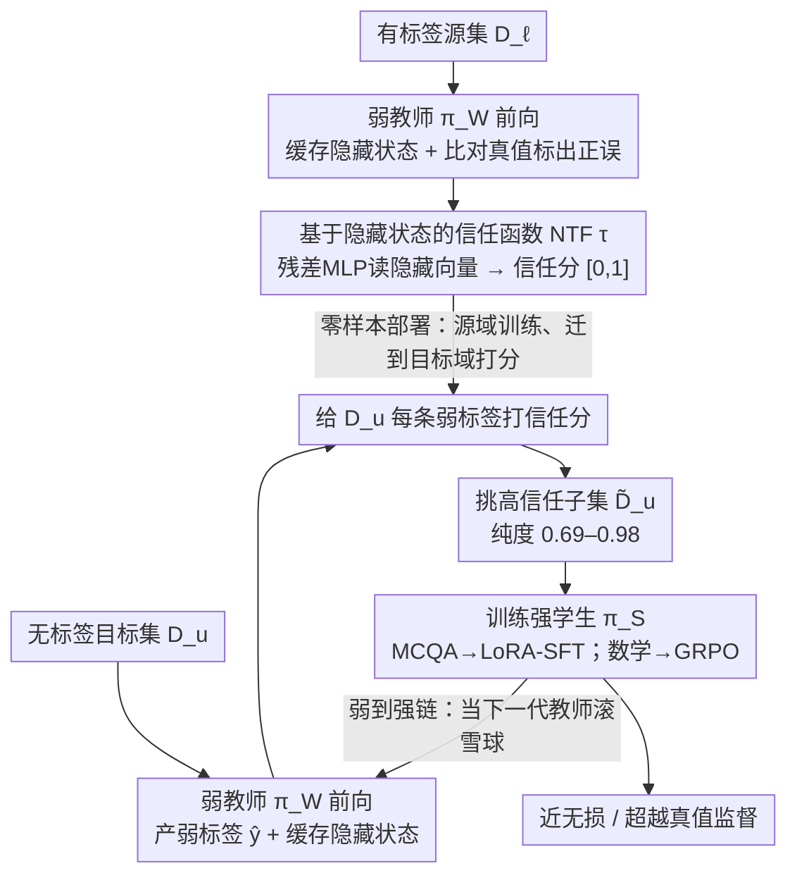

# Trust Functions: Near-Lossless Weak-to-Strong Generalization by Learning When to Trust the Weak Teacher

**会议**: ICML 2026  
**arXiv**: [2606.01000](https://arxiv.org/abs/2606.01000)  
**代码**: 论文中提及（Code / Website 链接）  
**领域**: 对齐RLHF / 弱监督学习 / 数据选择  
**关键词**: 弱到强泛化, 信任函数, 数据筛选, 教师隐藏状态, 超对齐

## 一句话总结
本文把"弱到强泛化（Weak-to-Strong Generalization）"重新框架成一个**数据选择**问题，提出"信任函数（Trust Function）"用一个轻量 MLP 读取教师模型最后一层隐藏状态、预测弱标签是否可靠，然后只挑高信任样本去训练强学生，从而在多任务上实现近无损甚至超越 ground-truth 的监督效果，并可迭代成"弱到强链"放大收益。

## 研究背景与动机
**领域现状**：随着 LLM 在复杂任务上逼近甚至超过人类水平，传统"人类提供可靠监督"的假设崩塌，超对齐（Superalignment）转向用一个弱教师 $\pi_{\mathcal{W}}$ 去训练更强的学生 $\pi_{\mathcal{S}}$。Burns 等人的开创性工作显示弱监督可以让学生超过教师，但始终留有一段无法弥合的差距（与 GT 监督相比）。

**现有痛点**：弱教师产出的伪标签包含两类系统性错误——(i) 错误标签会沿着数据几何结构被强模型继承下来；(ii) 任务相关方向若不在弱教师表征空间里则无法被传递。结果是弱监督在分布漂移下经常带来不稳定甚至退化，难以闭合到 GT 水平。

**核心矛盾**：现有"选数据"的尝试普遍用 **输出层启发式**——例如熵、多模型一致性、自我评估——这些信号本身在复杂任务上就标定差（confident error 高分、correct-but-uncertain 低分），在分布漂移下尤其脆弱。问题的根本在于：**输出层信号不足以判断弱标签的可靠性**。

**本文目标**：在固定架构和训练算法前提下，找出弱标注池中"真正能让学生变强"的子集，并把"如何判断标签可靠"这一问题统一形式化。

**切入角度**：作者注意到先前工作（Kadavath et al. 2022; Kuhn et al. 2023）发现**中间表征本身**就编码了"答案是否正确"的可分信号，只是被解码层抹平了。因此应该回到隐藏状态去训练一个判别器，而不是去信解码后的概率。

**核心 idea**：用一个小 MLP $\tau$ 直接从弱教师的隐藏状态预测"这条弱标签到底对不对"，只用高信任样本做 SFT/GRPO，再把训出来的学生当作下一轮的教师，叠成"弱到强链"。

## 方法详解

### 整体框架
框架叫 **Learning to Trust (L2T)**，核心是把"弱到强"里那道难闭合的差距归结为：弱教师的伪标签里混着可信和不可信两类，只要能把可信的那部分挑出来单独喂给强学生，就能逼近甚至超过真值监督。它需要两份数据——一份有标签的源集 $\mathcal{D}_{\ell}=\{(x_i,y_i)\}$ 和一份无标签的目标集 $\mathcal{D}_u=\{x_j\}$，二者不必同分布。先让弱教师 $\pi_{\mathcal{W}}$ 在 $\mathcal{D}_u$ 上前向产出弱标签 $\hat{y}=\pi_{\mathcal{W}}(x)$ 并顺手缓存隐藏状态；再在 $\mathcal{D}_{\ell}$ 上用"弱预测对不对"训出一个信任判别器 $\tau$；然后让 $\tau$ 给 $\mathcal{D}_u$ 每条样本打分、挑出高信任子集 $\tilde{\mathcal{D}}_u$；最后只用这个子集上的弱标签去 SFT 或 GRPO 训练强学生 $\pi_{\mathcal{S}}$——全程不碰 $\mathcal{D}_u$ 的真值。链式版本再把训好的学生当作下一代教师重跑一遍，把收益滚大。

### 关键设计

**1. 基于隐藏状态的 Neural Trust Function（NTF）：到隐藏空间里判断弱标签的对错，绕开失准的输出层置信度**

前面的核心矛盾是：输出层 confidence 在难题上系统性失准（confident-but-wrong），所以靠熵、一致性这类解码后信号选数据并不靠谱。NTF 的做法是把判别器搬回隐藏空间——它读弱教师最后一层、最终生成 token 的隐藏向量 $g_{\pi_{\mathcal{W}}}(x,\hat{y})\in\mathbb{R}^d$（这个 token 经 attention 已聚合了 prefix 与中间推理），映射成一个 $[0,1]$ 的信任分 $\tau(\cdot)$，估计"这条弱标签为真"的概率。$\tau$ 本身是个残差 MLP：堆叠 RMSNorm-SwiGLU 块（带 Dropout + stochastic depth），末端接 RMSNorm + 线性头出 logit，再 sigmoid 转概率，训练用类重加权 BCE 抗标签不平衡。它的监督信号全自动构造——在源集 $\mathcal{D}_{\ell}$ 上比对"弱预测 vs 真值"（MCQA/数学用 exact match，象棋用 best-move 匹配），匹配上就是正例。之所以这条路实用，是因为中间层早就编码了"我大概答没答对"的可分信号（Kadavath et al. 2022 等的观察），把判别器放在这里能避开 confident-but-wrong 陷阱；而且整条管线的算力几乎全在弱教师前向（生成弱标签时反正要跑），$\tau$ 是个小 MLP，训练和打分近乎零开销——总成本 $C_{\text{total}}=O\big(\bar{C}_{\text{teacher}}(|\mathcal{D}_{\ell}|+|\mathcal{D}_u|)+C_{\text{NTF}}(e|\mathcal{D}_{\ell}|+|\mathcal{D}_u|)\big)$ 实际被教师项主导。

**2. In-domain 分布漂移下的零样本部署：让信任函数在有标签的源域学一次，直接迁到无标签的目标域打分**

现实里标签分布极不均衡——MMLU/MATH 这类大标注集随手可得，而 AIME 之类的目标域几乎没有可用标签，要求"目标域也得有标签"就把方法卡死了。L2T 因此放宽这条假设：$\tau$ 只在源分布上训练，部署时对任务接口相同、数据分布不同的目标域做零样本打分。为了把话说清楚，作者把泛化场景显式分成三档——ID（同 benchmark 的 held-out）、OOD$_{\text{dist}}$（同任务接口、不同数据分布，如 MMLU $\to$ ARC-Easy）、OOD$_{\text{domain}}$（连任务接口都换，如 MCQA $\to$ 象棋）——文中所有"零样本迁移"默认指 OOD$_{\text{dist}}$。Table 1 显示 NTF 在 ID 与 OOD$_{\text{dist}}$ 上 AUC 达 0.83–0.92、纯度 0.69–0.98，说明信任信号确实能跨数据分布迁移；而 OOD$_{\text{domain}}$ 会退化这一点也被如实标出，算是对方法边界的诚实交代。

**3. Weak-to-Strong Chain（弱到强链）：把训好的学生当下一代教师，不加新组件就把收益滚大**

单代 L2T 已经能逼近真值监督，但学生规模继续放大时仍有空间，链式结构正是不引入任何新组件地把这点空间吃掉。机制上它像滚雪球（论文称 snowballing）：每一代学生因为只吃高纯度弱标签，自身在目标域上的准确率单调升高；当它转身充当下一代教师时，产出的弱标签纯度也跟着水涨船高，于是即便沿用同一个 $\tau$ 打分，可用样本量和平均准确率都会扩大。具体就是把 L2T 训出的 $\pi_{\mathcal{S}}^{(1)}$ 当作 $\pi_{\mathcal{W}}^{(2)}$，再走一遍同样的 NTF 筛选去训更大的 $\pi_{\mathcal{S}}^{(2)}$，逐代迭代（Figure 1 右下给出累积增益曲线）。因为每代都复用同一套 L2T 协议，规模化起来很顺。

### 损失函数 / 训练策略
NTF 用类重加权 BCE + AdamW（带 weight decay）训练，评估指标是 AUC / ECE / Brier / Purity（top-trust 子集里真正正确的比例）。强学生这边按任务分两路：MCQA 用 LoRA-SFT 在 top-$n$ 高信任样本上拟合弱标签，数学推理用 GRPO 在高信任 rollout 上做 RL。衡量"相对真值训练恢复了多少"的指标定义为 $\text{Recovery}=\frac{\text{Baseline}-\text{Base}}{\text{GT}-\text{Base}}\times 100\%$。

## 实验关键数据

### 主实验
World Knowledge（5 个 MCQA benchmark 平均准确率，括号内为 Recovery%）：

| 教师 $\to$ 学生 | Naive | I-Confidence | ICL+I-Conf | Reward Model | **NTF（本文）** | Ground Truth |
|---|---|---|---|---|---|---|
| OLMo2-1B $\to$ OLMo2-7B | 69.3 (48.3) | 69.2 (47.1) | 72.0 (79.3) | 68.8 (42.5) | **73.7 (98.9)** | 73.8 |
| OLMo2-1B $\to$ OLMo2-13B | 74.7 (12.2) | 75.1 (17.6) | 77.9 (55.4) | 78.4 (62.2) | **80.9 (95.9)** | 81.2 |
| Qwen3-0.6B $\to$ Qwen3-1.7B | 74.0 (86.0) | 74.3 (91.2) | 74.4 (93.0) | 71.7 (45.6) | **75.0 (103.5)** | 74.8 |
| Qwen3-0.6B $\to$ Qwen3-14B | 86.0 (86.8) | 85.7 (82.9) | 86.5 (93.4) | 86.1 (88.2) | **87.1 (101.3)** | 87.0 |

8 个 setting 中 NTF 与 GT 在 5 个上统计无差异（near-lossless），1 个上显著优于 GT（super-recovery），始终强于所有 baseline。

### 消融实验
NTF 在不同领域上的标定指标（Table 1，World Knowledge 与 Strategy Games 用 Qwen3-0.6B，Quantitative Reasoning 用 Qwen3-1.7B / Gemma3-1B）：

| 领域 | AUC ↑ | ECE ↓ | Brier ↓ | Purity ↑ |
|---|---|---|---|---|
| World Knowledge | 0.92 | 0.03 | 0.07 | 0.98 |
| Quantitative Reasoning (Omni) | 0.83 | 0.11 | 0.13 | 0.69 |
| Quantitative Reasoning (MATH) | 0.84 | 0.14 | 0.17 | 0.95 |
| Strategy Games | 0.91 | 0.02 | 0.11 | 0.95 |

### 关键发现
- 收益来源不是简单"过滤掉错标签"：作者归因到三条机制——保留了诱导 easy-first 隐式课程的样本；有时还能"修正"GT 中本来就次优的标签（在 MATH 等任务上观察到）；筛后样本的梯度方向更对齐。
- NTF 对极弱教师依然有效：Qwen3-1.7B 在 AIME 上裸 acc <5%，但配 NTF 后仍能实现近无损 GT 恢复，说明信任函数本身在低纯度池里也能抓住稀有可靠样本。
- OOD$_{\text{domain}}$（任务接口都换）会显著退化，说明"信任"与任务接口/输出空间是耦合的，跨接口迁移仍是开放问题。

## 亮点与洞察
- **重定义问题**：把弱到强泛化从"如何设计 loss/算法"转向"如何挑数据"，并提出 trust function 这个保护伞概念把熵、agreement、自我评估、reward model 等已有做法都装进同一框架，便于横向比较。
- **几乎零额外算力**：NTF 只是一个小 MLP，输入是 anyway 都要算的隐藏状态；相比依赖外部 reward model 的 baseline，部署成本低且效果更好，是非常实用的工程优势。
- **链式放大**：链式弱到强等于免费把数据筛选当成迭代式自训练，类似"自我对弈式"地把弱监督慢慢提纯，给超对齐场景提供了一种可持续的 bootstrap 路径。

## 局限与展望
- 仍依赖一份源域标签：虽然不需要目标域 GT，但需要"任务接口相同的有标签源域"——极端 superalignment（连源域都没有可靠标签）下并不直接可用。
- 跨接口（OOD$_{\text{domain}}$）失效：信任函数与任务接口紧耦合，迁到完全不同的任务（如 MCQA $\to$ 数学）会退化，未来或需共享接口表征或多接口联合训练。
- 评估限于中等规模模型（OLMo2 / Qwen3 1B–14B），最大学生 14B，是否在 70B+ 级别仍保持 near-lossless 还需进一步验证。
- 链式增益的上界与稳定性：论文展示了 snowballing，但缺少崩溃点分析——多少代以后链式会失稳？

## 相关工作与启发
- **vs Burns et al. 2023（开创性 W2S）**: 后者关注训练目标本身（如 confidence loss）；本文不动 loss/架构，只在数据侧筛选，但闭合到 GT 的速度更快。
- **vs Internal/Verbalized Confidence**: 同样想衡量教师可靠度，但只用输出层信号；本文证明隐藏层 + 小判别器在难题上系统性更稳定，且能跨 benchmark 零样本迁移。
- **vs Reward Model 过滤**: RM 是通用判别器，但泛 reward 信号与"弱标签是否对"并不一一对应；NTF 直接对"correctness"建模，更贴合 W2S 场景。
- **vs 自训练 / pseudo-labeling**: 经典自训练用模型自身置信度过滤伪标签；这里换成"另一个针对教师隐藏态训出来的小判别器"，迁移到 W2S 场景。

## 评分
- 新颖性: ⭐⭐⭐⭐ 把 W2S 框成数据选择问题、并把隐藏状态判别器作为统一形式化，是值得关注的视角转换。
- 实验充分度: ⭐⭐⭐⭐⭐ 三大领域、两族模型、多尺度（1B–14B）、显著性检验、多种 baseline，覆盖较全面。
- 写作质量: ⭐⭐⭐⭐ 形式化清晰、generalization regime 划分严谨；少量实验细节挪到 Appendix 增加阅读跳转。
- 价值: ⭐⭐⭐⭐⭐ 提供了近无损弱到强的工程级方案，对超对齐研究有直接落地意义。

<!-- RELATED:START -->

## 相关论文

- [\[ICML 2025\] When Can In-Context Learning Generalize Out of Task Distribution?](../../ICML2025/llm_pretraining/when_can_in-context_learning_generalize_out_of_task_distribution.md)
- [\[ICML 2026\] Data Difficulty and the Generalization--Extrapolation Tradeoff in LLM Fine-Tuning](data_difficulty_and_the_generalization--extrapolation_tradeoff_in_llm_fine-tunin.md)
- [\[ICLR 2026\] Lossless Vocabulary Reduction for Auto-Regressive Language Models](../../ICLR2026/llm_pretraining/lossless_vocabulary_reduction_for_auto-regressive_language_models.md)
- [\[ICML 2026\] Tuning the Implicit Regularizer of Masked Diffusion Language Models: Enhancing Generalization via Insights from k-Parity](tuning_the_implicit_regularizer_of_masked_diffusion_language_models_enhancing_ge.md)
- [\[ICML 2025\] Towards Robust Influence Functions with Flat Validation Minima](../../ICML2025/llm_pretraining/towards_robust_influence_functions_with_flat_validation_minima.md)

<!-- RELATED:END -->
