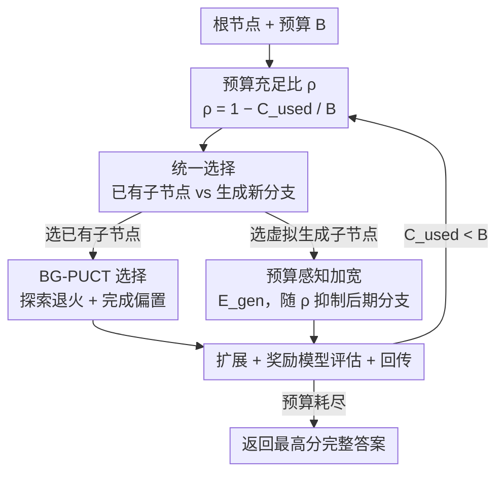

# Aligning Tree-Search Policies with Fixed Token Budgets in Test-Time Scaling of LLMs

**会议**: ICML2026  
**arXiv**: [2602.09574](https://arxiv.org/abs/2602.09574)  
**代码**: https://github.com/Sora-Miyamoto/bg-mcts  
**领域**: LLM推理 / 测试时扩展 / 树搜索解码  
**关键词**: 测试时扩展, 树搜索, MCTS, 固定 token 预算, 推理效率

## 一句话总结
针对部署时"每条 query 给定固定 token 预算"的现实约束，本文提出 Budget-Guided MCTS（BG-MCTS），用"预算充足比 ρ"作为统一调度信号，让树搜索从早期广撒网、随预算耗尽逐渐转向深挖与补全答案，在数学/物理推理基准上稳定超过对预算"无感知"的树搜索基线。

## 研究背景与动机
**领域现状**：测试时扩展（Test-Time Scaling）是在不改模型参数的前提下、靠多花推理算力换答案质量的主流手段。它大致分三类：并行采样后聚合（如 best-of-N、多数投票）、基于上一次生成的序贯精修、以及两者结合的混合方法。混合方法常落到**树搜索解码**上——把部分生成结果展开成一棵树，从根开始反复"选择—扩展—评估—回传"，把最有希望的分支继续展开，算力越多探索越广，答案往往越好。

**现有痛点**：真实部署里，每条 query 的推理预算是**固定且因产品/场景而异**的（论文用"整次搜索生成的输出 token 总数"$C_{\mathrm{used}}$ 来度量，要求 $C_{\mathrm{used}}\le B$）。但绝大多数树搜索策略对预算"无感知"：要么用固定的迭代次数、分支因子、搜索宽度/深度等超参，要么只把预算当成一个"到点就停"的终止条件。

**核心矛盾**：预算与策略脱节会导致两种典型翻车——**后期过度分支**（late over-branching），在预算快耗尽时还在开新分支，结果没 token 去精修和验证就被强制停了；或**过早停止**（premature termination），把预算白白剩下一截没用完。已有的早停变体（如 LiteSearch）只解决"什么时候该停以省 token"，并没有定义一个"随剩余预算下降、把搜索从分支逐步切换到精修"的**预算条件化策略**。

**本文目标**：设计一个把每一步搜索决策都显式条件在"剩余预算"上的树搜索算法，让同样的 token 预算产出更可靠的答案。

**切入角度**：作者的观察是——好的搜索应该"先想宽、再收尾收得稳"（wide-to-deep）：预算充足时多探索避免过早押注，预算见底时集中精修少数有希望的候选并尽快补全答案。关键是要有一个能贯穿全程、平滑控制这种切换的标量信号。

**核心 idea**：引入**预算充足比** $\rho=1-C_{\mathrm{used}}/B$ 作为唯一调度变量，同时改造 MCTS 的**选择**与**加宽**两处决策，使整棵搜索随 $\rho$ 从 1 降到 0 自动完成"广探索→深精修"的过渡。

## 方法详解

### 整体框架
BG-MCTS 建立在标准 PUCT 风格的 MCTS 之上（选择 → 扩展 → 评估 → 回传循环），输入是问题根节点 $p_0$、token 预算 $B$、叶节点扩展宽度 $k$，输出是搜索过程中找到的"得分最高且含完整答案"的节点。它的全部改动都挂在一个标量上：每轮循环开头先算 $\rho=1-C_{\mathrm{used}}/B$（$\rho\simeq1$ 早期预算充足，$\rho\simeq0$ 晚期预算见底），然后让这一轮的两类决策都条件在 $\rho$ 上——**选哪个已有子节点往下走**（用 BG-PUCT 打分）和**要不要给当前节点开新分支**（用生成分数 $E_{\mathrm{gen}}$ 与已有子节点竞争）。两者都随 $\rho$ 下降而退火，于是搜索自然地从"广探索"滑向"深精修与补全"。

### 关键设计

**1. 预算充足比 ρ：把固定预算变成贯穿全程的调度信号**

痛点是预算只被当"停止开关"，搜索过程中对"还剩多少"毫无感知。BG-MCTS 用累计输出 token 数 $C_{\mathrm{used}}$ 与总预算 $B$ 定义一个归一化比值

$$\rho = 1 - \frac{C_{\mathrm{used}}}{B} \in [0,1],$$

并把它作为后续所有搜索决策的**条件变量**。它的妙处在于提供了一个平滑、单调下降的"剩余预算刻度"：$\rho\simeq1$ 时算法行为接近标准 PUCT（既不人为拔高探索、也不过早压制它），$\rho$ 越小则越偏向利用与补全。所有改动都乘/加在这个 $\rho$ 上，使"wide-to-deep"不是硬编码的阶段切换，而是随预算消耗连续滑动的退火过程。

**2. BG-PUCT 选择：随 ρ 退火探索 + 注入"完成偏置"**

标准 PUCT 的选择分数 $\mathrm{PUCT}(p,s)=\frac{W(s)}{m_s}+cP(s\mid p)\sqrt{\frac{\ln m_p}{m_s}}$ 与预算无关。BG-MCTS 把它改成预算条件化的 BG-PUCT：

$$\mathrm{BG\text{-}PUCT}(p,s,\rho)=\frac{\tilde{W}(s,\rho)}{m_s}+\rho\,cP(s\mid p)\sqrt{\frac{\ln m_p}{m_s}}.$$

两处改动：探索项被乘上 $\rho$，预算越少探索奖励被压得越狠；利用项里的累计值换成"深度偏置修正"过的 $\tilde{W}(s,\rho)=\sum_{x\in\mathcal{T}(s)}\tilde{Q}(x,\rho)$，其中

$$\tilde{Q}(x,\rho)=Q(x)+\underbrace{\kappa(1-\rho)\frac{d(x)}{\hat{d}_{\mathrm{ans}}}}_{\text{completion bias}}.$$

这里 $d(x)$ 是节点深度，$\hat{d}_{\mathrm{ans}}$ 是"答案通常在多深处完成"的运行估计（用已含完整答案节点的平均深度，没答案则用当前最大扩展深度），$\kappa\ge0$ 是系数。完成偏置被 $(1-\rho)$ 缩放——早期几乎为零、不干扰探索，预算见底时变强，把选择推向"更深、更接近补全"的节点。对已含完整答案的节点该项置零，因为它们质量由最终答案评估直接决定，不该再被利用项放大。这样选择就实现了"早期照常探索、晚期偏向深挖精修"。

**3. 预算感知加宽：用"虚拟生成子节点"让开新分支成为一等公民并随 ρ 抑制**

光改选择还堵不住一种典型翻车：**太晚才开新分支**，新分支没剩余 token 去精修就废了。很多解码器用动态加宽（dynamic widening）允许中途从中间节点生成更多子节点，但在固定预算末期这很浪费。BG-MCTS 把"加宽"本身也变成预算感知的决策：给每个非终止节点 $p$ 增设一个**虚拟生成子节点** $s_{\mathrm{gen}}(p)$，可选集合扩成 $\mathcal{S}(p)=\mathcal{S}_{\mathrm{std}}(p)\cup\{s_{\mathrm{gen}}(p)\}$——若它被选中，不展开虚拟节点本身，而是从 $p$ 采一个新的标准子节点加进去。于是"开新分支"与"深挖已有子节点"在同一个 argmax 里直接竞争。生成分数为

$$E_{\mathrm{gen}}(p,\rho)=\underbrace{\mu(p)}_{\text{value level}}+\lambda\,\rho\,\underbrace{\sigma^2(p)}_{\text{uncertainty}},$$

$\mu(p),\sigma^2(p)$ 是 $p$ 现有子节点 $Q$ 值的均值与方差：均值项鼓励"从有希望的节点加宽"，方差项鼓励"在子节点分歧大时加宽"，而**整个不确定项被乘上 $\rho$**——早期加宽动机强、后期随预算见底被压制，从而劝退"从浅层节点晚期开分支"，把早期探索转化为精修与补全。统一选择规则即 $s^\star\in\arg\max_{s\in\mathcal{S}(p)}\mathrm{Score}(p,s,\rho)$，标准子节点用 BG-PUCT 打分、虚拟节点用 $E_{\mathrm{gen}}$；选到虚拟节点就加宽，否则下探。当 $\mathcal{S}_{\mathrm{std}}(p)=\varnothing$ 时默认加宽。

### 损失函数 / 训练策略
BG-MCTS 是**纯推理期**算法，不训练任何参数。节点扩展用两种生成单元：full generation（生成到 stop token 或上下文上限）与 sequential generation（在 "\nStep" 步边界处截断）；对已含答案的节点续接 "But wait, let me think about the problem again." 再恢复搜索。每个新节点由奖励模型 GenPRM-7B 打标量分 $Q(x)$（输入为问题 + 根到该节点的推理步序列）。默认超参：叶扩展 $k=2$、探索常数 $c=\sqrt{2}$、完成偏置系数 $\kappa=1$、加宽系数 $\lambda=1$。

## 实验关键数据

### 主实验
在 MATH500（Lv.5）与 AIME24/25 上，固定预算 $B\in\{10\text{K},20\text{K},30\text{K}\}$，三个开源模型，取三次平均（下表为各预算的 `.avg`）。奖励模型 GenPRM-7B，正确性用 LightEval 评估。

| 模型 | 基准 | Greedy | Repeated | MCTS | BG-MCTS |
|------|------|--------|----------|------|---------|
| Llama-3.1-8B-Instruct | MATH500 Lv.5 | .224 | .427 | .390 | **.434** |
| Llama-3.1-8B-Instruct | AIME24/25 | .033 | .048 | .067 | **.087** |
| Qwen2.5-7B-Instruct | MATH500 Lv.5 | .493 | .666 | .645 | **.691** |
| Qwen2.5-7B-Instruct | AIME24/25 | .100 | .167 | .163 | **.176** |
| Qwen3-32B | MATH500 Lv.5 | .731 | .765 | .758 | **.798** |
| Qwen3-32B | AIME24/25 | .267 | .285 | .278 | **.311** |

跨模型、基准、预算，BG-MCTS 总体最强：它在接近预算耗尽时达到峰值（与 wide-to-deep 设计一致），且"含答案树的比例"随预算消耗持续上升，印证了后期向补全倾斜。值得注意的两个基线趋势：AB-MCTS-M 在本文小预算/标量奖励的固定预算设定下反而不如简单的 Repeated Sampling（它原本是在更丰富反馈、更大算力下最有效）；LiteSearch 能可靠省 token 但常过早停止，留着预算没花完、最终准确率偏低。物理推理基准 UGPhysics（Qwen2.5-7B 与 Qwen3-32B）上趋势一致，作为数学之外的补充验证。

### 消融实验
在 MATH500 Lv.5 上逐一关闭三个组件（两次平均）。"探索退火"= Eq.3 的 $\rho$ 乘子，"利用塑形"= Eq.5 的完成偏置，"加宽退火"= Eq.6 的 $\rho$ 乘子。

| 配置（探索退火/利用塑形/加宽退火） | Llama 10K/20K/30K | Qwen2.5 10K/20K/30K |
|------|------|------|
| 全关（≈MCTS 基线） | .333 / .406 / .430 | .619 / .657 / .659 |
| 仅探索退火 | .377 / .478 / .418 | .649 / .653 / .679 |
| 仅利用塑形 | .340 / .418 / .425 | .646 / .664 / .660 |
| 仅加宽退火 | .310 / .392 / .433 | .642 / .526 / .664 |
| Full BG-MCTS（三者全开） | **.393 / .465 / .443** | **.662 / .699 / .711** |

### 关键发现
- **三组件互补、缺一不可**：去掉任意一个都整体掉点，没有任一消融变体能在所有预算上稳定追平完整方法——说明探索退火、完成偏置、加宽退火各自解决固定预算搜索的不同侧面。
- **越是小模型/难基准，预算对齐越值钱**：Llama 在 AIME 上 BG-MCTS 把准确率从 MCTS 的 .067 拉到 .087（相对 +30%），提升幅度比强模型更明显。
- **横向对比需带 caveat**：不同模型、不同基准难度与预算不可直接比大小，应在同一行内（同模型同基准）看 BG-MCTS 对各基线的相对优势。

## 亮点与洞察
- **一个标量 $\rho$ 串起两处决策**：用 $1-C_{\mathrm{used}}/B$ 这一个量同时退火"探索项"和"加宽动机"、并加权"完成偏置"，把抽象的 wide-to-deep 直觉落成可平滑控制的退火，工程上极简、可即插进任何 PUCT 风格 MCTS。
- **"虚拟生成子节点"把加宽变成可竞争的一等动作**：相比另设固定加宽超参，让"开新分支"与"下探已有子节点"在同一个 argmax 里凭分数竞争，既自然又能随预算被压制——这个抽象很优雅，可迁移到任何需要"动态决定要不要扩展候选集"的搜索/规划任务。
- **完成偏置用运行估计 $\hat{d}_{\mathrm{ans}}$ 自适应深度**：不写死"答案在第几层完成"，而是边搜边用已答节点平均深度估计，规避了对任务无关的硬超参依赖。

## 局限与展望
- **依赖一个像样的奖励模型**：节点评估全靠 GenPRM-7B 这类 PRM 打分，奖励噪声大或缺奖励模型的场景下 wide-to-deep 的收益可能打折，论文未深入讨论奖励质量的敏感性。
- **超参 $\kappa,\lambda$ 与退火形式固定**：完成偏置/加宽系数都设为 1、退火都用线性 $\rho$，是否存在更优的退火曲线（如非线性、随任务难度自适应）未充分探索。
- **预算度量单一**：只用"输出 token 总数"度量成本，没把奖励模型前向、并行带来的墙钟时间纳入预算，部署中真实成本可能与 token 数不完全对齐。

## 相关工作与启发
- **vs 标准 MCTS / PUCT**：标准 PUCT 选择分数只依赖树统计与先验，预算仅作停止条件；BG-MCTS 把 $\rho$ 注入探索项与利用项，使同一框架在不同预算下行为不同。
- **vs AB-MCTS-M（Inoue et al., 2025）**：AB-MCTS-M 靠动态加宽适配"在哪扩展"，但加宽与预算无关、末期易浪费；BG-MCTS 让加宽本身预算感知，固定小预算下显著更稳。
- **vs LiteSearch（Wang et al., 2024a）**：LiteSearch 聚焦"何时停以省 token"，是早停思路；BG-MCTS 是"预算条件化策略"，不止于停，而是把预算下降映射成从分支到精修的连续切换，避免过早停留下未用预算。

## 评分
- 新颖性: ⭐⭐⭐⭐ 把"固定预算"从停止条件升级为贯穿选择与加宽的调度信号，角度清晰且少见。
- 实验充分度: ⭐⭐⭐⭐ 三模型 × 三预算 × 数学+物理基准 + 三组件消融，覆盖到位；奖励模型敏感性可再补。
- 写作质量: ⭐⭐⭐⭐ 动机—机制—公式衔接顺，wide-to-deep 主线贯穿全文。
- 价值: ⭐⭐⭐⭐ 即插即用、零训练，对"预算受限部署 LLM 推理"有直接落地意义。

<!-- RELATED:START -->

## 相关论文

- [\[ICML 2026\] Prism: Efficient Test-Time Scaling via Hierarchical Search and Self-Verification for Discrete Diffusion Language Models](prism_efficient_test-time_scaling_via_hierarchical_search_and_self-verification_.md)
- [\[ICLR 2026\] Plan and Budget: Effective and Efficient Test-Time Scaling on Reasoning LLMs](../../ICLR2026/llm_reasoning/plan_and_budget_effective_and_efficient_test-time_scaling_on_reasoning_large_lan.md)
- [\[NeurIPS 2025\] SolverLLM: Leveraging Test-Time Scaling for Optimization Problem via LLM-Guided Search](../../NeurIPS2025/llm_reasoning/solverllm_leveraging_test-time_scaling_for_optimization_problem_via_llm-guided_s.md)
- [\[ICML 2026\] Lookahead Sample Reward Guidance for Test-Time Scaling of Diffusion Models](lookahead_sample_reward_guidance_for_test-time_scaling_of_diffusion_models.md)
- [\[ICML 2026\] ETS: Energy-Guided Test-Time Scaling for Training-Free RL Alignment](ets_energy-guided_test-time_scaling_for_training-free_rl_alignment.md)

<!-- RELATED:END -->
