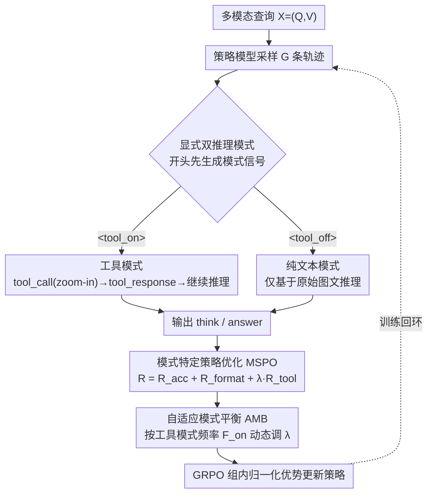

# Are Tools Always Beneficial? Learning to Invoke Tools Adaptively for Dual-Mode Multimodal LLM Reasoning

**会议**: ICML2026  
**arXiv**: [2605.19852](https://arxiv.org/abs/2605.19852)  
**代码**: https://github.com/MQinghe/AutoTool  
**领域**: 多模态VLM  
**关键词**: 自适应工具调用, 多模态推理, 强化学习, 视觉定位, 模式平衡  

## 一句话总结
AutoTool 用强化学习让多模态大模型先判断“这题是否真的需要 zoom-in 工具”，再在工具辅助推理和纯文本推理之间自适应切换，从而在高分辨率感知、定位、幻觉检测和推理任务上同时提升准确率与效率。

## 研究背景与动机
**领域现状**：多模态大模型已经可以通过 CoT 把复杂问题拆成中间推理步骤，但很多方法仍沿用 LLM 的文本中心范式，视觉信息往往只在输入端被编码一次。为了让模型在推理过程中重新查看局部视觉证据，近期的 MCoT 和 “Thinking with Images” 方法开始引入外部工具，例如搜索、分割、OCR、深度估计或图像 zoom-in。

**现有痛点**：工具确实能帮助模型处理细粒度目标、局部属性和高分辨率图像，但现有工具增强 MLLM 往往默认“会用工具就是好事”。DeepEyes、OpenThinkIMG 等方法更强调如何调用工具和如何生成正确答案，却没有显式建模“是否需要调用工具”。这会带来两个直接问题：第一，简单问题也进入多轮工具交互，训练和推理成本升高；第二，错误或多余的局部裁剪可能把模型注意力带偏，反而制造幻觉。

**核心矛盾**：工具调用的收益高度依赖问题类型。若问题要求检查小物体、细粒度属性或局部区域，zoom-in 能提供额外证据；若问题依赖全局布局、空间关系或图像中目标已经清晰，工具调用不仅边际收益很小，还可能丢掉必要的上下文。因此，关键不只是学会“怎么用工具”，而是学会“何时不用工具”。

**本文目标**：作者希望训练一个双模式多模态推理模型：面对每个图文问题，模型先选择工具辅助模式或纯文本模式；选择工具模式时要正确定位并利用 zoom-in 观察；选择纯文本模式时要避免无意义调用，并仍然给出准确答案。

**切入角度**：论文没有依赖额外构造的 SFT 冷启动数据，而是把模式选择、格式遵循、答案正确性和工具有效性统一放进 GRPO 强化学习框架。这样可以让模型在训练中同时探索两种推理路径，再通过奖励约束逐步学会何时偏向哪一种。

**核心 idea**：用显式的 `<tool_on>` / `<tool_off>` 双模式控制令牌、模式特定奖励和自适应模式平衡，让 MLLM 把工具调用从固定流程变成按题目特征触发的策略选择。

## 方法详解

### 整体框架
AutoTool 的关键变化不是换一个更强的视觉工具，而是重写工具调用的决策机制。输入是多模态查询 $X=(Q,V)$，$Q$ 是文本问题、$V$ 是图像，模型在回答前先生成一个模式信号：选 `<tool_on>` 时，后续推理可以发出 `<tool_call>`，执行 zoom-in 后把裁剪观察 `<tool_response>` 接回上下文继续推理；选 `<tool_off>` 时，模型直接在原始图文上下文里完成内部推理并作答。训练以 Qwen2.5-VL-7B 为基础策略，用 GRPO 对每个问题采样一组候选轨迹，每条轨迹除了最终答案，还携带模式选择、格式是否合规、是否调用工具、工具调用是否带来正确答案这些过程信息；奖励函数把这些信号分开计算，再用组内相对优势更新策略。推理阶段沿用训练提示，模型可以自动选择模式，也可以由用户通过提示或特殊 token 手动指定。

### 关键设计

**1. 显式双推理模式：把"用不用工具"提升为第一个决策**

现有工具增强 MLLM 往往把工具调用当成默认流程，简单问题也被拉进工具链，这正是冗余交互和上下文污染的源头。AutoTool 让模型在每个问题开头先生成 `<tool_on>` 或 `<tool_off>`：前者允许调用 zoom-in 并利用返回的局部观察，后者要求只基于原始图文上下文作答。把模式显式化的好处是奖励函数能直接知道当前轨迹属于哪一种策略，从而对两条路径分别约束——这比隐式地让模型随时决定是否调用工具清楚得多，也让模型有机会在全局理解题、局部细节题、幻觉检测题之间学出不同的偏好。

**2. 模式特定策略优化 MSPO：把"工具有用"定义成"工具帮你答对"**

如果只奖励最终答案，模型可能在错误定位后靠语言先验蒙对；如果只奖励工具调用，模型又会无脑地频繁调用。MSPO 的做法是把工具奖励绑死到答案正确性上，并随模式切换取不同规则。总奖励写作 $R=R_{acc}+R_{format}+\lambda^{mode}_{tool}R_{tool}$：$R_{acc}$ 结合规则与 Qwen2.5-72B-Instruct 奖励模型判断答案是否语义等价，$R_{format}$ 检查 `<think>`/`<answer>` 等格式，$R_{tool}$ 则因模式而异——在 `<tool_on>` 下，正确调用工具且答对给 $1$、调用后答错给 $-0.5$、其余给 $0$；在 `<tool_off>` 下，只有不调用工具且答对才给 $1$。这套设计没有发明复杂的工具质量评估器，却用一个负号的惩罚就堵住了"定位错但答案碰巧对"的奖励漏洞，从奖励层面同时压住了无效调用和侥幸蒙对。

**3. 自适应模式平衡 AMB：先逼出探索，再放手自适应**

基础模型天然偏向纯文本推理，因为纯文本更容易拿到格式和答案奖励，放任不管的话 `<tool_on>` 会因探索不足而被边缘化、还没学会就被淘汰。AMB 在每个 batch 的 $N\times G$ 条 rollout 上统计两种模式出现次数，算出工具模式频率 $F_{on}=N_{on}/(N_{on}+N_{off})$：当工具模式偏多时下调工具模式的奖励系数、上调纯文本系数，偏少时反向调整，由动态的 $\lambda^{mode}_{tool}$ 实现。关键在于这个约束只用在训练过程而非推理：前中期它维持约 50% 的双模式探索压力，让两条路径都被充分训练；训练最后约 20 步移除约束，模型才按数据集特征自由收敛到合适的模式比例，从而既不被固定比例束缚、也不至于探索坍缩。

### 损失函数 / 训练策略
优化器层面用 GRPO：给定问题 $X$，旧策略采样 $G$ 条输出 $o_i$，每条得奖励 $r_i$，再用组内均值和标准差归一化为优势 $\hat{A}_i=(r_i-\mathrm{mean}(r))/\mathrm{std}(r)$；目标函数采用 PPO 式 clipped ratio，clipping 参数 $\epsilon=0.2$，不额外加 KL 正则。训练数据沿用 DeepEyes 设置，含 V* 的细粒度样本、ArxivQA 的图表数据和 ThinkLite-VL 的推理数据。基础模型 Qwen2.5-VL-7B 训练 80 iterations，8 张 H200 做策略训练、另 2 张 H200 部署 Qwen2.5-72B-Instruct 奖励模型；每 batch 256 样本拆成 4 个 PPO mini-batch，每个 query 生成 16 条 rollout，初始工具奖励系数 $\lambda^{base}_{tool}=1.2$，学习率 $1\times10^{-6}$，最大响应长度 20,480 tokens。

## 实验关键数据

### 主实验
论文从四类任务验证 AutoTool：高分辨率感知、视觉定位、幻觉检测和多模态推理。评测数据包括 HRbench-4K/8K、V*、RefCOCO 系列、ReasonSeg、POPE、MathVista、MathVerse、MathVision、WeMath、DynaMath 和 LogicVista。下面保留最能体现主结论的指标。

| 任务/数据集 | 指标 | AutoTool | Qwen2.5-VL-7B | DeepEyes | 主要结论 |
|--------|------|------|------|------|------|
| HRbench-4K | Overall acc | 76.9 | 69.6 | 74.9 | 比基座高 7.3 点，也超过固定工具方法 |
| HRbench-8K | Overall acc | 74.0 | 63.0 | 71.5 | 高分辨率场景收益更明显 |
| V* | Overall acc | 90.1 | 69.1 | 87.4 | 比基座高 21.0 点，接近并超过多数 grounding 推理模型 |
| RefCOCO test | IoU@0.5 acc | 88.5 | 84.7 | 86.0 | 工具模式能更准确定位目标区域 |
| ReasonSeg val | IoU@0.5 acc | 63.0 | 59.5 | 61.5 | 在复杂指代表达和分割式定位上仍有增益 |
| POPE Overall | Acc | 88.9 | 87.2 | 86.0 | 自适应工具调用降低无效局部证据带来的幻觉 |
| MathVista testmini | Acc | 72.8 | 70.6 | 71.6 | 保持一般多模态推理能力，而非只优化感知题 |

### 消融实验
消融表明，单纯让模型永远用工具并不是最优；双模式、错误工具调用惩罚和后期自由探索叠加后效果最好。

| 配置 | HRbench-4K Overall | HRbench-8K Overall | V* Overall | 说明 |
|------|------|------|------|------|
| 纯文本 GRPO | 73.6 | 70.2 | 85.3 | 只强化内部推理，已经比原始基座好 |
| 始终 Tool on | 74.9 | 71.5 | 87.4 | 固定 zoom-in 有帮助，但会引入无效调用 |
| Tool on + Tool off | 75.3 | 72.4 | 88.5 | 双模式缓解错误工具调用影响 |
| 加入 MSPO penalty | 75.8 | 73.3 | 89.0 | 工具调用后答错会被惩罚，定位更谨慎 |
| 加入后期自由探索 | 76.8 | 73.2 | 89.5 | 移除固定比例约束后，策略更适配题目 |
| 完整 AutoTool | 76.9 | 74.0 | 90.1 | 三个核心组件组合达到最好总体表现 |

### 效率与超参数分析

| 分析项 | 设置/对比 | 结果 | 解释 |
|------|------|------|------|
| 训练时间 | DeepEyes vs AutoTool | 44.9 h vs 35.8 h，减少 20.3% | 避免所有样本都走工具链，训练 rollout 更短 |
| V* Direct 推理 | DeepEyes vs AutoTool | 2.23 min vs 1.68 min，提速 24.7% | 简单样本跳过 zoom-in |
| HRbench-8K 推理 | DeepEyes vs AutoTool | 53.45 min vs 33.08 min，提速 38.1% | 高分辨率中只对有必要的问题调用工具 |
| POPE Random 推理 | DeepEyes vs AutoTool | 13.07 min vs 7.20 min，提速 44.9% | POPE 图像目标较大，纯文本模式占比更高 |
| AMB 移除时机 | step 0 / 50 / 60 / 70 / 80 | step 60 的 V* Overall 为 90.1，最好 | 太早释放会偏向 `<tool_off>`，太晚释放会过度约束策略 |
| $\lambda^{base}_{tool}$ | 0.0 到 5.0 | 1.2 附近稳定，0.5 到 3.0 较鲁棒 | 极端值会导致奖励失衡或模式坍缩 |

### 关键发现
- 工具调用对高分辨率、细粒度和定位任务最有价值，但对 POPE 这类目标较大、判断是否存在的任务，频繁 zoom-in 的收益较低。
- 错误工具调用惩罚并不是只为了省时间，它还修正了“定位错但答案碰巧对”的奖励漏洞，使工具模式更关注真正有效的视觉证据。
- AMB 的价值在于训练过程而非推理过程：训练早中期保持约 50% 双模式探索，后期放开后模型会自然根据数据集特征调整模式比例。

## 亮点与洞察
- 论文把工具使用从“能力问题”改写成“决策问题”。这点很重要，因为 MLLM 工具链越来越复杂时，最大成本往往不在单个工具，而在不必要工具带来的多轮延迟和上下文污染。
- MSPO 的奖励设计很克制：它没有发明复杂的工具质量评估器，而是把过程正确性绑定到最终答案正确性上。这样既能奖励有效工具调用，也能惩罚“为了调用而调用”。
- AMB 体现了强化学习训练中的探索工程经验。模型早期会选择容易拿分的模式，如果没有外力平衡，另一个模式还没学会就被边缘化；但如果平衡约束一直存在，又会妨碍后期自适应。
- 这篇工作的思路可以迁移到更广义的 agent 系统：搜索、代码执行、数据库查询、OCR、分割工具都不应该默认开启，而应先学习一个成本敏感的调用门控策略。

## 局限与展望
- 当前工具主要是 zoom-in，适合局部视觉检查和定位问题。若扩展到 OCR、检索、分割、深度估计或多工具组合，模式空间会从二选一变成多工具调度，MSPO 和 AMB 需要重新设计。
- 奖励中的答案正确性部分依赖规则和 Qwen2.5-72B-Instruct 奖励模型。对于开放式长答案、细粒度解释或多解问题，奖励模型偏差可能影响模式选择。
- 实验集中在已有视觉问答、定位、幻觉和推理 benchmark 上，尚未充分展示真实交互场景中的长链工具使用，例如多轮视觉搜索、跨页面操作或动态环境观察。
- 论文强调效率提升，但主要报告时间指标；未来可以进一步分析显存、token 消耗、工具执行失败率，以及不同硬件和工具实现下的成本收益曲线。
- 双模式 token 是一个清晰设计，但也可能让模型把复杂决策压缩到开头一次选择。更细的策略可以允许模型先纯文本推理，发现证据不足时再延迟调用工具。

## 相关工作与启发
- **vs DeepEyes**: DeepEyes 通过 GRPO 学习视觉 grounding 式工具推理，但更偏向所有问题都使用 zoom-in。AutoTool 保留工具模式的优势，同时加入 `<tool_off>` 和错误工具调用惩罚，解决冗余调用与错误定位问题。
- **vs OpenThinkIMG / Thinking with Images**: 这些方法强调在推理过程中引入图像操作或视觉状态，证明多模态中间证据有价值。AutoTool 的区别在于不把视觉操作视为默认步骤，而是让模型学习何时需要中间视觉证据。
- **vs 纯文本 CoT / GRPO 推理增强**: 纯文本强化学习能提升一般推理，但对高分辨率局部证据不够敏感。AutoTool 在保留纯文本路径的同时，为局部视觉问题提供工具路径，形成互补。
- **启发**: 对多模态 agent 来说，工具越多越需要“调用门控”。一个实用方向是把 AutoTool 的二元模式扩展成成本感知策略：先估计任务需要的证据类型，再选择最便宜且足够可靠的工具组合。

## 评分
- 新颖性: ⭐⭐⭐⭐☆ 把工具调用必要性显式纳入 RL 目标，问题意识清楚，机制也足够简洁。
- 实验充分度: ⭐⭐⭐⭐☆ 覆盖感知、定位、幻觉和推理任务，并有消融、效率、超参数分析；真实多工具场景仍可加强。
- 写作质量: ⭐⭐⭐⭐☆ 动机和方法链条清晰，图表支撑充分，但部分公式与表格在缓存文本中略显密集。
- 价值: ⭐⭐⭐⭐⭐ 对工具增强 MLLM 和多模态 agent 都有直接启发，尤其适合指导成本敏感的工具调用训练。

<!-- RELATED:START -->

## 相关论文

- [\[NeurIPS 2025\] SRPO: Enhancing Multimodal LLM Reasoning via Reflection-Aware Reinforcement Learning](../../NeurIPS2025/llm_reasoning/srpo_enhancing_multimodal_llm_reasoning_via_reflection-aware_reinforcement_learn.md)
- [\[ICML 2026\] Chain-of-Thought Reasoning in the Wild Is Not Always Faithful](chain-of-thought_reasoning_in_the_wild_is_not_always_faithful.md)
- [\[ICLR 2026\] Adaptive Social Learning via Mode Policy Optimization for Language Agents](../../ICLR2026/llm_reasoning/adaptive_social_learning_via_mode_policy_optimization_for_language_agents.md)
- [\[ICML 2026\] PowerFlow: Unlocking the Dual Nature of LLMs via Principled Distribution Matching](powerflow_unlocking_the_dual_nature_of_llms_via_principled_distribution_matching.md)
- [\[ACL 2026\] TemplateRL: Structured Template-Guided Reinforcement Learning for LLM Reasoning](../../ACL2026/llm_reasoning/templaterl_structured_template-guided_reinforcement_learning_for_llm_reasoning.md)

<!-- RELATED:END -->
