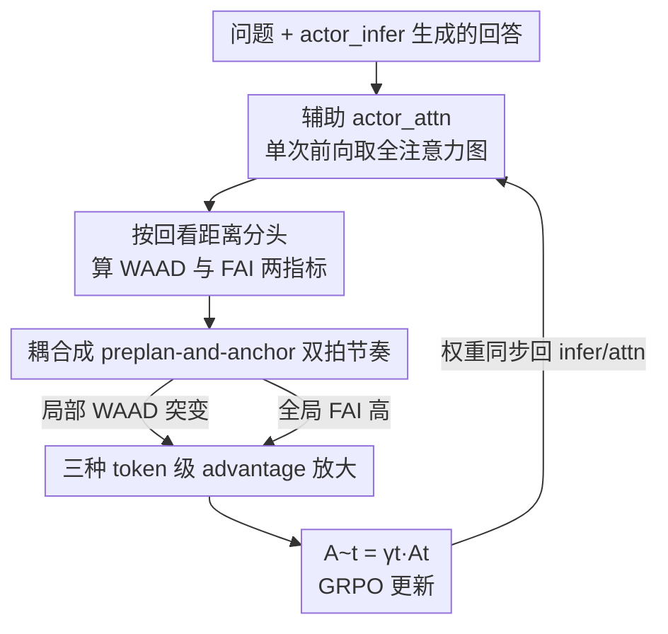

# Attention Illuminates LLM Reasoning: The Preplan-and-Anchor Rhythm Enables Fine-Grained Policy Optimization

**会议**: ICML2026  
**arXiv**: [2510.13554](https://arxiv.org/abs/2510.13554)  
**代码**: 待确认  
**领域**: LLM推理 / 强化学习  
**关键词**: RLVR, 信用分配, 注意力分析, GRPO, token级优势  

## 一句话总结
作者用注意力动力学给推理过程"显影"——发现模型在生成时存在一个"先铺垫(preplan)、后定锚(anchor)"的两拍节奏，并把刻画这个节奏的两个内部指标(WAAD/FAI)直接转成 RL 里的 token 级优势放大系数，让 GRPO 把信用集中打在真正决定下游推理走向的关键 token 上，在 Countdown、QA 和多个数学推理基准上稳定提点。

## 研究背景与动机
**领域现状**：当下用 RLVR(可验证奖励强化学习)训练大推理模型已经是主流——GRPO/PPO 拿一个自动判对错的奖励去优化模型，逼它先吐一长串思维链再给答案。

**现有痛点**：奖励是序列级的(一整条回答只有一个 0/1 对错),而主流做法是把这个序列级奖励/优势**均匀摊到每一个 token** 上。这就抹平了"决定整条推理走向的关键节点"和"只是把局部话术补全的废话 token"之间的差别，信用分配很粗糙，数据效率和可解释性都受限。

**核心矛盾**：模型"看起来怎么推理"和"我们怎么优化它"之间存在错配。模型内部其实把某些位置当成结构上决定性的枢纽，但优化时却一视同仁。

**本文目标**：找到一种**模型自己认可**的、能标出"哪些 token 关键"的内部信号，并把它无侵入地塞进现有 RLVR 流程做细粒度信用分配。

**切入角度**：作者不去外部启发式地猜哪些 token 重要(如高熵 token),而是直接拆模型的**注意力图**——从两个互补视角看：向后看(一个 token 生成时多依赖近邻 vs 远处上下文)、向前看(一个 token 对后续 token 的下游影响有多大)。

**核心 idea**：注意力动力学揭示出一个稳定的"preplan-and-anchor"两拍节奏;把刻画它的 WAAD 与 FAI 两个指标转成 token 级优势的放大权重,就能把 RL 的学习火力对准模型自己标记的关键节点。

## 方法详解

### 整体框架
方法分两半。前半是**诊断**:对一段已生成的"问题+回答"序列做一次额外前向，取注意力图，按每个注意力头的"平均回看距离"把头分成局部组和全局组，再从中算出两个 token 级指标——WAAD(局部回看多远)和 FAI(被未来多少注意力回访),并论证这两者耦合成一个"先铺垫后定锚"的两拍节奏。后半是**干预**:在 RL 训练循环里，用这些注意力信号给每个 token 的优势 $A_t$ 乘上一个数据相关的放大系数 $\gamma_t$，把信用重新分配到 preplan 与 anchor token 上,而整套东西嫁接在 GRPO 之上、几乎不增加额外算力。

### 关键设计

**1. 用注意力跨度把头分成局部/全局两组，定义 WAAD 与 FAI 两个 token 级指标**

均匀摊优势的根因是缺一把"哪些 token 关键"的内部尺子，作者先造这把尺子。对每个注意力头 $(l,h)$，定义它在回答位置上的注意力加权平均回看距离 $d^{(l,h)}=\frac{1}{|\mathcal{R}|}\sum_{t\in\mathcal{R}}\sum_{s\le t}\mathbf{A}^{(l,h)}_{t,s}(t-s)$，这是一个凸组合，恰好就是该头生成时平均往回看多远。按 $d^{(l,h)}$ 排序，取最低/最高分位(如各 30%)当局部头集 $\mathcal{H}_{\text{loc}}$ 与全局头集 $\mathcal{H}_{\text{glob}}$。可视化两组的聚合注意力图能看到两种规律:局部头沿对角线呈"锯齿状",在一个短语块内注意力高度局部、到新块开头突然往回探;全局头则把注意力集中砸在稀疏的几个 token 上。

据此提炼两个指标:**WAAD(Windowed Average Attention Distance)** 在一个截断窗口内度量 token 往回看多远——值低表示块内顺滑续写(波谷),值高(波峰)表示在块边界要调用长程上下文;**FAI(Future Attention Influence)** 度量一个 token 在受控范围内被后续位置平均回访的注意力——高 FAI 的 token 就是被反复回看的"语义锚",对应关键定义、中间结果、决策点这些逻辑路标。作者还做了反事实验证:在高 FAI 位置强行换 top-k 候选 token 再续写，与原轨迹的 Jaccard 相似度仅 0.534，明显低于低 FAI 位置的 0.631，且 87.14% 的试验里高 FAI 扰动改变更大——证明 FAI 锚是因果上左右推理走向的位置，不是表面措辞。

**2. 把两个指标耦合成"preplan-and-anchor"双拍节奏**

单看一个指标信息不全,作者分析两者联合动力学,发现三条稳健耦合(都用 70 题量化、对比打乱位置的随机基线):① WAAD 波峰处 token 熵更高(局部线索不够、模型不确定时才往回探,平均熵 0.2386→0.3608,+51.97%);② 全局头识别的锚与已有文献的"receiver head"高度一致(FAI 峰共现率 22.41%→60.84%,+171.49%);③ FAI 峰**紧跟或恰好落在** WAAD 峰之后(36.87%→52.53%,+42.47%)。这三条收敛成一个两拍节奏:**Preplan**——逼近语义边界时 WAAD 飙升、调远程上下文起草一个铺垫(introductory)token;**Anchor**——同位或紧随其后吐出一个高 FAI 的锚 token,被未来反复回访以稳定后续推理。关键洞察是:锚 token 本身常被它前面的铺垫 token 局部主导(低 WAAD),自身没多少探索空间,所以优化时应该把锚和它的铺垫**一起考虑**,而非只盯着锚那一个位置。

**3. 用辅助 actor_attn 模型在 RL 训练中无侵入地取全注意力图**

工程上有个坑:vLLM、Megatron 这些训练/推理引擎为省显存用 flash attention,执行时根本不保留完整注意力矩阵,actor_infer 和 actor_train 都拿不到注意力图。作者的解法是引入第三个实例 **actor_attn**(标准 Transformer 实现、保留全注意力)。每当 actor_infer 生成完一条回答,就把"问题+回答"拼成一条序列、对 actor_attn 做**一次**额外前向,只从网络中间三分之一($\lfloor L/3\rfloor$ 到 $\lfloor 2L/3\rfloor$)等距取 5 层注意力图当代表。生成一条回答本需上千次前向,而这里只多一次前向、并行算几乎无额外延迟。每次 actor_train 更新后,权重同步给 actor_infer 和 actor_attn 三方保持一致。

**4. 三种基于节奏的 token 级 advantage 放大策略**

有了节奏信号,就把它接到优势上:把 PPO/GRPO 的 token 优势 $A_t$ 换成 $\tilde{A}_t=\gamma_t A_t$,$\gamma_t$ 是注意力派生的放大系数(放大因子 $\gamma_{\text{amp}}=1.5$,信号 detach 不回传梯度、对正负优势都生效)。三种实例化对应节奏的不同侧面:

(1) **局部块信用**:用相邻 WAAD 差 $\Delta_t=|\text{WAAD}_t-\text{WAAD}_{t+1}|$ 选出块边界(peak-valley 跳变)的 preplan token,取 top-$q$ 分位 $\mathcal{T}_{\text{loc}}$,对其优势放大 $\gamma_t=1+(\gamma_{\text{amp}}-1)\mathbf{1}\{t\in\mathcal{T}_{\text{loc}}\}$,强化"committing 前先解长程依赖"的规划点。

(2) **全局锚信用**:按 FAI 取 top 分位($q=0.4$)的锚集 $\mathcal{T}_{\text{glob}}$ 放大,让策略学会清晰articulate并保住组织下游推理的核心语义承诺,把可验证信号更快传到关键决策点。

(3) **耦合节奏信用**:结合前两者并做反向分配。当一个高 FAI 锚被局部主导(满足 $\text{WAAD}_t\le\tau_{\text{waad}}$ 且其前 $k$ 个 token 内有 $\max\Delta_u\ge\tau_\Delta$,记 $t\in\mathcal{D}$)时,它自身优化空间有限,于是把放大奖励的一部分 $\alpha$ 回拨给它对应的铺垫 token:$\gamma_t=1+(\gamma_{\text{amp}}-1)\mathbf{1}\{t\in\mathcal{T}_{\text{glob}}\setminus\mathcal{D}\}+(1-\alpha)(\gamma_{\text{amp}}-1)\mathbf{1}\{t\in\mathcal{D}\}+\alpha(\gamma_{\text{amp}}-1)\mathbf{1}\{t\in\mathcal{I}(\mathcal{D})\}$,促成连贯的块级脚手架,而非把信用过拟合到单个位置。

### 损失函数 / 训练策略
基座 Qwen3-4B-Base / 8B-Base,在 GRPO 上嫁接。训练 batch 512、micro-batch 32(每 batch 16 步),学习率 $1\times10^{-6}$,不加 KL 与熵正则,训练温度 $T=1.0$。WAAD 窗口 $W=10$,FAI 视野 $H\in[10,100]$,锚选 top-40%,回拨邻域 $k\in\{1,2,3\}$。4B 用 8 卡跑 500 步,8B 用 16 卡跑 600 步。

## 实验关键数据

### 主实验
基线是 GRPO,以及两个 token 选择对照:Random(随机选 token 放大)、Entropy(放大高熵 token)。

| 数据集 | 指标 | GRPO | +随机 | +高熵 | +局部块 | +全局锚 | +耦合节奏 |
|--------|------|------|------|------|---------|---------|-----------|
| Countdown | acc | 52.6 | 55.0 | 57.7 | 59.9 | 60.4 | **63.1** (+10.5) |
| CrossThink-QA | acc | 48.0 | 47.8 | 48.0 | 50.0 | 49.6 | **50.1** (+2.1) |

数学推理(Qwen3-4B-Base, 1K 长度;AIME 用 avg@16,其余 pass@1):

| 方法 | AIME24 | AIME25 | AMC23 | MATH | Olympiad | Avg. |
|------|--------|--------|-------|------|----------|------|
| GRPO | 8.4 | 5.2 | 55.1 | 74.2 | 42.8 | 37.1 |
| +随机 | 8.7 | 5.5 | 55.2 | 74.4 | 42.0 | 37.1 |
| +高熵 | 8.3 | 4.9 | 55.5 | 74.8 | 42.5 | 37.2 |
| +全局锚 | 9.3 | 5.8 | 57.6 | 75.5 | 43.0 | 38.2 |
| +局部块 | 10.5 | 5.9 | 58.4 | 74.9 | 43.1 | 38.6 |
| +耦合节奏 | **10.7** | **7.8** | 57.4 | **75.8** | **44.1** | **39.2** (+2.1) |

### 节奏耦合的量化分析(消融/机制验证)

| 度量 | 随机基线 | 实测 | 提升 |
|------|---------|------|------|
| WAAD 波峰处平均熵 | 0.2386 | 0.3608 | +51.97% |
| receiver 头与全局头 FAI 峰共现率 | 22.41% | 60.84% | +171.49% |
| FAI 峰跟随/重合 WAAD 峰 | 36.87% | 52.53% | +42.47% |
| 高 FAI 扰动 Jaccard(vs 低 FAI 0.631) | — | 0.534 | 87.14% 试验偏离更大 |

### 关键发现
- **耦合节奏信用最强**:三种策略都比 GRPO 稳定提点,但把锚信用回拨给铺垫 token 的耦合版几乎在所有基准上最好——印证"锚常被局部主导、只奖锚不够"的洞察。
- **随机/高熵选 token 几乎无效**:说明提点不是"挑些 token 放大"这件事本身带来的,而是注意力信号选对了结构性关键节点。
- **训练曲线收敛更快、平台更高**:耦合信用最早起飞;作者还特意用较短上下文(1K)做主分析,因为长程依赖会稀释注意力策略的效果。

## 亮点与洞察
- **把"可解释性分析"直接变成"训练信号"**:多数白盒分析止于描述现象,本文把 WAAD/FAI 这种模型内部信号闭环回 RL 优势,是少见的"分析→训练配方"打通。
- **辅助 actor_attn 的工程解法很实用**:flash attention 拿不到注意力图是个真痛点,用第三实例单次前向取图、几乎零额外延迟,这套 trick 可迁移到任何"想在 RL 里用内部注意力信号"的工作。
- **反向信用分配的思想可迁移**:"关键位置本身没探索空间→把信用回拨给它的前驱铺垫位置"这个块级脚手架视角,对任何序列级到 token 级的信用分配问题都有启发。

## 局限与展望
- 放大因子、分位阈值($q$、$\tau_{\text{waad}}$、$\tau_\Delta$、$k$、$\alpha$)是手调超参,论文未给系统的敏感性扫描,换任务/换模型的可迁移性待验。
- 主分析刻意用 1K 短上下文以"避免长程依赖稀释效应",但真实长 CoT 推理恰恰长程依赖密集,这套节奏信号在长上下文下是否仍清晰、有效,证据偏弱。
- 节奏由 GSM8K 上的 Qwen3-4B-Base 观察得出,跨模型族(非 Qwen)、跨领域(代码/agent)是否同样存在 preplan-and-anchor 节奏,缺少验证。
- 只在 GRPO 上验证;与 PPO(带 critic)或其他 off-policy 偏好优化的兼容性只是声称,未实测。

## 相关工作与启发
- **vs 高熵 forking token 类方法**:它们用预测熵挑"分叉点"做探索,本文实验里高熵选择几乎不提点;区别在于本文的信号来自注意力的**因果下游影响**(FAI),被反事实验证能真正改写推理走向,而高熵只反映表面不确定性。
- **vs receiver head / anchor sentence 等白盒分析**:本文证明自己的全局头集与 receiver head 高度一致(FAI 峰共现 +171%),但更进一步——不止识别锚,还把锚信号接进 RL 做定向信用分配。
- **vs 均匀摊优势的 GRPO/DAPO**:同属 RLVR、完全兼容其工作流,但用 token 级 $\gamma_t$ 把信用集中到结构性关键节点,是对"序列级奖励→均匀分配"这一步的细粒度改造。

## 评分
- 新颖性: ⭐⭐⭐⭐⭐ 把注意力动力学的"双拍节奏"提炼成可训练信号并闭环回 RL,角度新且自洽。
- 实验充分度: ⭐⭐⭐⭐ 覆盖 puzzle/QA/数学多基准 + 双模型规模 + 机制量化,但超参敏感性与长上下文证据偏弱。
- 写作质量: ⭐⭐⭐⭐⭐ 从现象观察到指标定义再到 RL 策略层层递进,反事实验证有说服力。
- 价值: ⭐⭐⭐⭐ 提供一套可复用的"内部信号→信用分配"范式与工程 trick,对 RLVR 社区实用。

<!-- RELATED:START -->

## 相关论文

- [\[CVPR 2026\] APPO: Attention-guided Perception Policy Optimization for Video Reasoning](../../CVPR2026/llm_reasoning/appo_attention-guided_perception_policy_optimization_for_video_reasoning.md)
- [\[ICML 2026\] The Easy, the Hard, and the Learnable: Confidence and Difficulty-Adaptive Policy Optimization for LLM Reasoning](the_easy_the_hard_and_the_learnable_confidence_and_difficulty-adaptive_policy_op.md)
- [\[ICLR 2026\] Slow-Fast Policy Optimization: Reposition-Before-Update for LLM Reasoning](../../ICLR2026/llm_reasoning/slow-fast_policy_optimization_reposition-before-update_for_llm_reasoning.md)
- [\[ACL 2026\] Think Outside the Policy: In-Context Steered Policy Optimization](../../ACL2026/llm_reasoning/think_outside_the_policy_in-context_steered_policy_optimization.md)
- [\[ICLR 2026\] Scaf-GRPO: Scaffolded Group Relative Policy Optimization for Enhancing LLM Reasoning](../../ICLR2026/llm_reasoning/scaf-grpo_scaffolded_group_relative_policy_optimization_for_enhancing_llm_reason.md)

<!-- RELATED:END -->
