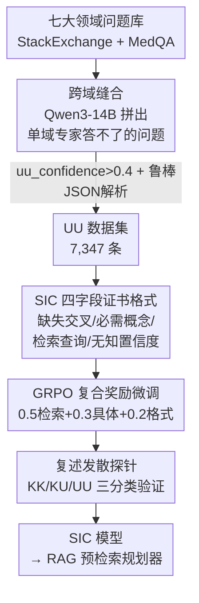

# Calibration of Structured Ignorance Certificates for Diagnosing Unknown Unknowns in Reasoning Models

**会议**: ICML 2026  
**arXiv**: [2606.08571](https://arxiv.org/abs/2606.08571)  
**代码**: 待确认  
**领域**: LLM推理 / 不确定性校准  
**关键词**: 认知不确定性、未知的未知、GRPO、结构化生成、检索规划

## 一句话总结
本文提出 **结构化无知证书（Structured Ignorance Certificate, SIC）**——一种强制模型在遇到超出知识边界的跨域问题时，不再瞎编答案、而是用 JSON 显式说出"缺哪两个领域的交叉知识、需要哪些概念、该去检索什么"的输出格式；通过自动合成的 7,347 条"未知的未知"跨域问题数据集 + GRPO 强化微调，让 14B 模型学会稳定产出这种证书（JSON 合法率 99.46%、概念具体度 0.967）。

## 研究背景与动机

**领域现状**：让大模型可靠部署的前提之一，是它能识别自己知识的边界。现有的不确定性研究大多围绕 **token 级概率校准**（Kadavath 2022）、**口头置信度表达**（"我有 70% 把握"，Xiong 2024）、或 **选择性预测/弃答**（Kamath 2020）展开。

**现有痛点**：这些方法处理的全是 **known unknown（已知的未知）**——模型对问题领域有表示、只是信心不足，于是可以打个低分或选择不答。但它们对真正危险的失败模式无能为力：模型面对 **unknown unknown（未知的未知）**——压根不在训练分布里的跨域问题——会流畅地编出一个错误答案，而不是承认无知。更糟的是，"弃答"类方法即便选择不答，也只给一个拒绝信号，**不提供任何可操作信息**：既不说为什么答不了，也不说怎么才能答。

**核心矛盾**：问题落在模型表示覆盖之外时，模型既没有"自知之明"的信号，下游系统（如 RAG）也拿不到任何能用来补救的结构化线索。无知本身没有被组织成一种可被机器消费的产物。

**本文目标**：把"无知"从一句含糊的搪塞，变成一份 **结构化、可操作、可度量** 的输出——明确指出缺失的领域交叉、需要的概念清单、以及一条能解锁答案的检索查询。

**切入角度**：作者观察到跨域缝合问题（如"用经济学博弈论解释某个生物种群动态"）恰好是 unknown unknown 的天然载体——没有单一领域专家能独立回答。于是可以 ① 自动大规模合成这类问题，② 用一个固定 JSON 模板把"无知的结构"框定下来，③ 用 RL 奖励把"产出高质量证书"训练成一种可学习的能力。

**核心 idea**：用一个带四个字段的 **JSON 证书** 替代"幻觉式作答"，并用 GRPO 以"检索效用 + 概念具体度 + 格式合法"的复合奖励，把这种结构化认知输出直接训练进模型。

## 方法详解

### 整体框架
整条流水线要解决的是"如何让模型在面对答不出的跨域问题时，产出一份机器可用的无知证书"。它分三段串起来：**先造数据**（自动缝合七大领域的跨域问题，得到 UU 数据集）→ **再定格式 + 训练**（用四字段 SIC 模板约束输出，GRPO 复合奖励微调）→ **最后验证**（用一个独立的复述发散探针，从模型隐藏行为上确认输出确实更"认知结构化"）。其中 SIC 模板是中枢：它既是训练时奖励函数的打分对象，也是推理时下游 RAG 直接消费的接口。

### 关键设计

**1. UU 数据集：用跨域缝合自动制造"没人能答"的问题**

要训练模型识别未知的未知，首先得有一大批 unknown unknown 问题，但这类问题恰恰最难收集——它们不存在于任何单领域语料里。作者的做法是 **跨域缝合**：从 StackExchange Preferences 和 MedQA-USMLE 里按关键词切出七个领域桶（物理、生物、工程、CS、经济、医学、法律，桶大小从经济的 284 到多数领域封顶的 2,000），对 $\binom{7}{2}=21$ 个领域对 $(d_a, d_b)$，各采样一对问题 $(q_a, q_b)$，提示 Qwen3-14B 合成一道"真正同时需要两个领域概念才能答"的新问题，并只保留 $\texttt{uu\_confidence}>0.4$ 的样本。为了让合成可规模化，作者配了一个 **多级鲁棒 JSON 解析器**（直接 `json.loads` → 括号配平扫描 → 正则兜底 → 前缀修复），把 7,404 次提示中的 7,347 条救成合法样本，解析成功率 99.3%，仅 53 条硬失败。这一步的价值在于：它把"unknown unknown"从一个抽象的认识论概念，变成了可批量生产、可训练的监督信号。

**2. SIC 四字段证书：把"无知"格式化成下游能直接消费的结构**

SIC 的核心是用一个固定 JSON 模板，强制模型把模糊的搪塞改写成可操作的认知元数据。四个字段各司其职：`missing_intersection`（自然语言描述缺失的概念交叉）、`required_concepts`（从每个领域点名所需概念，用 **证书具体度分数** $\text{CSS}=\min(1.0,\,|C|/4)$ 衡量，即列够 4 个概念就满分）、`retrieval_query`（一条针对性检索串，用 ROUGE-L 对照真值概念拼接打分）、`confidence_of_ignorance`（$[0,1]$ 的无知置信标量）。这套设计的关键不在"让模型说不知道"，而在于把无知 **结构化到可被机器直接使用**：`retrieval_query` 可以当 RAG 的预检索查询，`required_concepts` 可以当检索结果的过滤/重排条件。换句话说，SIC 把模型从"答题者"重新定位成了"检索规划器"。

**3. GRPO 复合奖励：用三项加权把"产出好证书"训成可学习能力**

有了数据和格式，作者用 **GRPO**（Group Relative Policy Optimization，组内相对奖励、无需单独价值网络）微调 Qwen3-14B（4-bit NF4 量化 + LoRA，$r=16$、$\alpha=32$，仅 0.43% 参数可训）。奖励函数把"好证书"拆成三个可度量分量并加权：

$$R(c,r) = 0.5\,r_{\text{retrieval}} + 0.3\,r_{\text{specificity}} + 0.2\,r_{\text{format}}$$

其中 $r_{\text{retrieval}}=\mathrm{ROUGE\text{-}L}(r,\,\texttt{retrieval\_query}(c))$ 衡量检索查询是否切题、$r_{\text{specificity}}=\min(1.0,\,|\texttt{required\_concepts}(c)|/3)$ 衡量是否列够概念、$r_{\text{format}}=\mathbf{1}[\text{valid JSON}]$ 是格式合法的硬门槛（非法 JSON 直接 $R=0$）。0.5/0.3/0.2 的权重体现作者的判断：**检索效用是最关键的可操作属性**。这样训练 500 步（A100 约 9 小时），就把"在知识边界外产出结构化证书"变成了一种被奖励塑形出来的稳定行为，而不是靠提示词临时凑出来的。

**4. 复述发散探针：从行为侧独立验证模型确实更"认知结构化"**

为了证明微调真的改变了模型的认知行为（而不只是学了个 JSON 模板），作者训练了一个 **独立的复述发散探针**。核心假设是：模型对一个问题的内部不确定性，会体现在它对该问题的若干 **复述变体** 回答得有多不一致。具体地，对问题 $q$ 生成 $K-1=4$ 条复述，收集 $K$ 个变体的回答，用 all-MiniLM-L6-v2 算嵌入，从 $K\times K$ 余弦相似度矩阵抽四个标量特征（均值发散 $\bar{\delta}$、最大发散 $\delta_{\max}$、标准差 $\sigma_s$、最小相似度 $s_{\min}$），再用 300 条 MMLU（KK）+ 300 条模板加硬变体（KU）+ 300 条 UU 训一个三分类逻辑回归。它充当外部裁判：如果 SIC 微调后的输出被这个探针判为更偏向 UV 区间，就说明微调确实把模型推向了"自知无知"的行为模式。

### 损失函数 / 训练策略
GRPO 有效 batch size 8、学习率 $2\times10^{-5}$、裁剪 $\epsilon=0.2$、KL 系数 $\beta=0.04$，跑 500 步；LoRA 加在全部 7 个投影矩阵上，64.2M 可训参数（0.43%）。数据生成约 448 GPU·分钟，训练约 9 小时单卡 A100-40GB。

## 实验关键数据

### 主实验
评测在 735 条留出的 UU 问题上进行。SIC 生成质量四项指标几乎触顶——JSON 合法率与概念具体度接近上限，证明格式约束和概念枚举行为被可靠学到；而 SPS（检索查询与开放式真值概念的 ROUGE-L 重叠）偏低，反映的是开放式概念表述天然难以词面匹配，并非模型失败。

| 指标 | 含义 | 值 |
|--------|------|------|
| JSON validity rate | 输出合法 JSON 的比例 | 0.9946 |
| Mean SPS（生产性） | 检索查询 ROUGE-L | 0.1783 |
| Mean CSS（具体度） | 概念枚举充分度 | 0.9667 |
| Mean probe UU prob. | 探针判为 UU 的均值 | 0.3891（>0.333 基线）|

探针三分类结果显示，UU 类最易分离、KK 类最难——因为困难但可答的 MMLU 问题也会引发发散回答，和真正的 UU 重叠：

| 类别 | Precision | Recall | F1 | n |
|------|-----------|--------|------|-----|
| KK（已知-已知） | 0.361 | 0.190 | 0.249 | 300 |
| KU（已知-未知） | 0.466 | 0.530 | 0.496 | 300 |
| UU（未知-未知） | 0.469 | 0.627 | **0.536** | 300 |
| Accuracy | — | — | 0.449 | 900 |

### 消融实验
对照 SIC 微调模型 vs. 基座模型（关掉 LoRA），在 100 条 UU 问题上用 ROUGE-L 对照真值概念打分：

| 配置 | ROUGE-L | Δ | 改善样本占比 | 说明 |
|------|---------|------|------|------|
| Base Qwen3-14B | 0.0421 | — | — | 基座本身已能产出部分相关概念词 |
| SIC-Tuned | 0.0436 | +0.0015 | 27.0% | 相对提升 3.6%，正向 delta（峰值 +0.025）比负向更陡 |

### 关键发现
- **格式与具体度几乎被完美学到**（99.46% / 0.967），说明 GRPO 把"硬约束"类目标训得很稳；CSS 在 $|C|\ge 4$ 时饱和，意味着模型习惯性每张证书列 ≥4 个概念。
- **SPS 低是任务固有难度**，不是失败：检索查询与开放式真值概念的词面重叠本就有限；医学相关领域对的 SPS 一致偏低，因为临床术语高度专一、难以被 ROUGE-L 匹配。
- **微调收益不对称**：正向改善（最高 +0.025）比回退更陡、更广，说明 SIC 微调在多样跨域问题上整体有益，绝对增益虽小（0.0015）但方向稳定。
- **探针准确率 44.9%** 高于 33.3% 随机基线但仍有限，瓶颈在 KK/KU 边界——困难可答题与未知题的发散特征重叠。

## 亮点与洞察
- **把"无知"产品化**：最"啊哈"的地方是把模型的失败模式（幻觉）反过来当成一种可设计的输出契约——不是堵住幻觉，而是把"我不知道"重塑成下游 RAG 能直接吃的检索规划信号。这把不确定性研究从"打分"推进到了"可操作产物"。
- **跨域缝合是制造 UU 的巧办法**：unknown unknown 数据天然稀缺，用"两个单域问题拼成一个谁都答不了的问题"绕开了这个稀缺性，且 21 个领域对让覆盖系统化。这个数据合成思路可迁移到任何需要"分布外但语义合理"样本的训练场景。
- **复述发散当探针特征**：用"对同一问题的多个复述回答有多不一致"作为认知不确定性的可观测代理，比 token 概率更贴近"行为层"的不确定性，且无需访问 logits，便于黑盒场景迁移。
- **复合奖励把抽象目标拆成可度量分量**：检索效用/具体度/格式三项加权，是把"好证书"这种模糊目标 RL 化的可复用模板。

## 局限与展望
- **探针精度有限**（44.9%）：KK/KU 边界分不开，作者建议引入 token 级熵、隐藏态几何或集成式发散估计来增强特征。
- **数据领域受限**：七个预定义领域桶难以覆盖真实世界全部跨域缺口（如计算生物学、AI 政策等新兴交叉），需扩展领域分类并引入更多样语料（arXiv 交叉列表、维基消歧页）。
- **奖励是词面代理**：GRPO 用 ROUGE-L 对照拼接概念串打分，捕捉不到语义等价；换成嵌入式奖励或人评训练的奖励模型应能更好对齐训练信号与下游效用。
- **单一模型族 + 未端到端验证**：实验只在 Qwen3-14B 上做，未验证跨规模（3B/7B/70B）和跨架构（Llama/Mistral/Gemma）的普适性；SIC 输出接入真实 RAG 管线、在 Natural Questions/TriviaQA 上评下游答案质量仍是未完成的关键一环。

## 相关工作与启发
- **vs 置信度校准（Kadavath 2022 / Xiong 2024 / Kuhn 2023 语义熵）**: 它们在 **可答** 问题上校准置信度（处理 known unknown）；本文反过来，在 **不可答** 的跨域问题上诊断并产出结构化认知元数据，两者互补而非竞争。
- **vs 选择性预测/弃答（Kamath 2020 / Whitehead 2022）**: 弃答只给"不答"信号、无可操作信息；SIC 进一步说清 **为什么** 答不了、**检索什么** 能解锁答案。
- **vs RAG（Lewis 2021 / Guu 2020）**: RAG 在检索后填补知识缺口；SIC 充当 **预检索规划器**，用 `retrieval_query` 提供一条基于显式认知诊断的精准检索串，可前置到 RAG 之前。
- **vs 表示探针（Meng 2023 / Marks & Tegmark 2024）**: 既往线性探针检测事实知识/真实性；本文把该范式扩展到 KK/KU/UU 三分类，并用复述回答发散而非隐藏态作为探针特征。

## 评分
- 新颖性: ⭐⭐⭐⭐ 把"无知"重塑为可操作的结构化证书 + 跨域缝合造 UU 数据，视角新颖
- 实验充分度: ⭐⭐⭐ 指标体系完整且自洽，但单模型族、消融绝对增益小、探针精度有限、未端到端验证 RAG
- 写作质量: ⭐⭐⭐⭐ 动机链条清晰，指标定义给得明确，诚实标注了各项弱点
- 价值: ⭐⭐⭐⭐ 为"模型自知无知 + 可操作弃答"提供了可训练、可度量的范式，对 RAG/可靠部署有直接价值

<!-- RELATED:START -->

## 相关论文

- [\[ACL 2026\] Calibration-Aware Policy Optimization for Reasoning LLMs](../../ACL2026/llm_reasoning/calibration-aware_policy_optimization_for_reasoning_llms.md)
- [\[ICML 2026\] FloorplanQA: A Benchmark for Spatial Reasoning in LLMs Using Structured Representations](floorplanqa_a_benchmark_for_spatial_reasoning_in_llms_using_structured_represent.md)
- [\[ICML 2026\] Diagnosing Multi-step Reasoning Failures in Black-box LLMs via Stepwise Confidence Attribution](diagnosing_multi-step_reasoning_failures_in_black-box_llms_via_stepwise_confiden.md)
- [\[ICML 2026\] From LLM-Generated Conjectures to Lean Formalizations: Automated Polynomial Inequality Proving via Sum-of-Squares Certificates](from_llm-generated_conjectures_to_lean_formalizations_automated_polynomial_inequ.md)
- [\[ICML 2026\] SmartThinker: Progressive Chain-of-Thought Length Calibration for Efficient Large Language Model Reasoning](smartthinker_progressive_chain-of-thought_length_calibration_for_efficient_large.md)

<!-- RELATED:END -->
