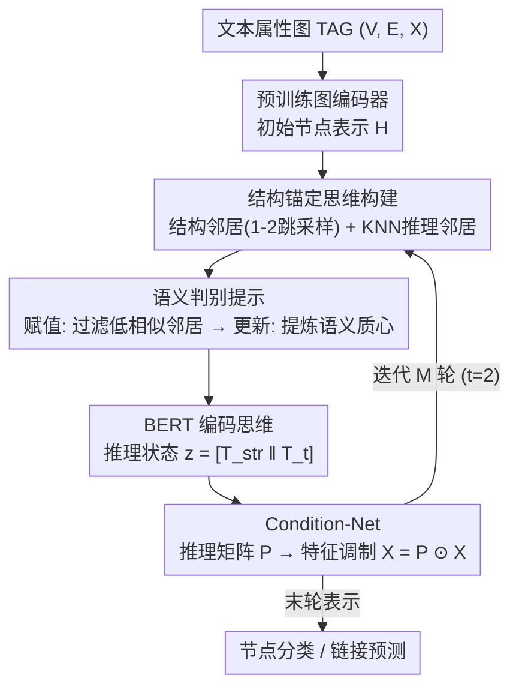

# Clustering as Reasoning: A $k$-Means Interpretation of Chain-of-Thought Graph Learning

**会议**: ICML 2026  
**arXiv**: [2605.24867](https://arxiv.org/abs/2605.24867)  
**代码**: https://github.com/Uncnbb/KCoT  
**领域**: LLM推理  
**关键词**: Chain-of-Thought, 图学习, $k$-means聚类, 文本属性图, 语义-结构对齐  

## 一句话总结
本文揭示 Transformer 自注意力与 $k$-means 聚类的数学等价性，据此设计 KCoT 框架，将 CoT 推理显式拆解为"赋值-更新"两步语义过滤提示，并用 Condition-Net 动态融合拓扑先验与演化思维表示，在节点分类和链接预测上持续超越 SOTA。

## 研究背景与动机

**领域现状**：Chain-of-Thought (CoT) 提示已被广泛用于增强 LLM 在文本属性图 (TAG) 上的推理能力。已有方法包括将图拓扑翻译为自然语言提示（HetGCoT）、在潜空间模拟推理步骤（GCoT）、用显式推理轨迹微调 LLM（GraphInstruct），以及多 Agent 工具链扩展到工业规模图（GraphChain）。

**现有痛点**：现有图 CoT 范式存在两个根本缺陷。第一，**架构松耦合**——LLM 与 GNN 被分割为独立的处理阶段，LLM 仅充当语义解析器/生成器，语义推理与结构传播彼此隔离，无法实现逐步的语义-拓扑交互。第二，**可解释性不足**——现有 CoT 以"黑箱"方式运行，缺乏关于自然语言推理如何驱动节点表示优化的几何可解释性，无法将生成的"思维"与图学习目标对应到明确的数学优化目标。

**核心矛盾**：GNN 的消息传递依赖结构邻域，而 LLM 的语义推理基于表示相似性，两种视角之间存在语义-结构错位 (semantic–structural misalignment)。如果不显式对齐二者，消息传播会聚合语义不一致的邻居，导致表示模糊和类别混淆。

**本文目标**：(1) 为 CoT 推理提供有理论根据的几何可解释性；(2) 设计统一框架实现逐步语义-拓扑交互。

**切入角度**：作者从一个关键理论发现出发——Transformer 自注意力层存在一种参数化，使其在功能上等价于 $k$-means 的赋值-更新步骤。这意味着 CoT 推理本质上就是迭代聚类，每一步思维都在更新语义质心。

**核心 idea**：用 $k$-means 的赋值-更新框架重构 CoT 提示设计，让 LLM 充当语义过滤器（赋值）和语义质心提炼器（更新），同时通过 Condition-Net 将拓扑先验注入演化的推理状态。

## 方法详解

### 整体框架
KCoT 把"在文本属性图 $\mathcal{G}=(\mathcal{V},\mathcal{E},\mathcal{X})$ 上做推理"重新理解成"迭代 $k$-means 聚类"：每一轮都先让 LLM 把语义不一致的邻居过滤掉、再把保留邻居抽象成新的"语义质心"，然后用这段思维去调制节点特征喂给下一轮。具体地，预训练图编码器先拿到初始节点表示；之后每一轮先用**结构锚定思维构建**取两路邻居（结构采样 + KNN 语义邻居），交给**语义判别提示**模拟 $k$-means 的赋值-更新生成思维文本，再经 BERT 编码成推理状态、由 **Condition-Net** 翻成推理矩阵调制节点特征；如此迭代 $M$ 轮（实测 $t=2$ 最优），末轮表示直接用于节点分类或链接预测。

### 关键设计

**1. 结构锚定思维构建：拓扑先验 + 演化语义双通道**

只用图上的固定边，碰到稀疏或噪声连接的节点就没足够邻居可聚；只用语义 KNN 邻居，又会把拓扑约束整个丢掉。KCoT 在每轮 $t$ 同时取两类邻居：结构邻居 $\mathcal{N}_i^{\text{str}}$ 从 1-hop、2-hop 里随机采样 $K$ 个，保住显式几何先验；推理诱导邻居 $\mathcal{N}_i^{(t)}$ 对当前表示 $\mathbf{H}^{(t)}$ 做 KNN 取 $K$ 个语义最近邻，捕捉随推理演化的语义动态。两路邻居各自过一遍语义判别提示、再用 BERT 编码成 $T^{\text{str}}$ 和 $T^{(t)}$，拼成推理状态 $z^{(t)} = [T^{\text{str}} \| T^{(t)}]$。这样语义推理始终被结构先验拽着，不会飘成纯语义聚类——消融显示去掉任一通道都掉点，去 KNN 邻居（语义动态）比去结构邻居掉得更狠。

**2. 语义判别提示：用 LLM 的判别能力替换 $k$-means 的刚性距离**

拿到两路候选邻居后，怎么决定谁该聚进来、又怎么把它们抽象成新质心？传统 $k$-means 靠欧氏距离 $\|x_i - \mu_j\|^2$ 判断样本归哪个簇，但 TAG 上文本之间的"距离"是主观且上下文依赖的，直接套欧氏度量会把语义不相关的邻居也聚进来。KCoT 干脆把赋值-更新两步翻译成两段 CoT 提示交给 LLM：**赋值步**提示 LLM "识别共享方面、丢弃低相似度节点"，相当于用语义判别替代距离阈值，把跟目标节点不一致的邻居筛掉；**更新步**提示 LLM 对筛后邻居"用一段简洁密集的段落陈述推导洞察"，把这堆邻居的语义方差压缩成一个新的语义质心，整体写作 $\mathcal{T}_i \leftarrow \operatorname{Prompt}(\mathbf{T}_i, \mathbf{N}_i)$。之所以有效，是因为论文实测 LLM 提炼语义质心的能力强于刚性数学距离——消融里移除这个提示掉幅最大（Cora 链接预测从 88.45% 跌到 83.47%），说明 LLM 真正需要的是显式算法引导，而不只是当个文本编码器。

**3. Condition-Net：把语言思维翻成调制节点特征的推理矩阵**

思维是自然语言、节点特征是图表示，两者空间不通，需要一座桥把语义注回特征。Condition-Net 充当超网络 (hypernetwork)：吃推理状态 $z^{(t)}$，过一个轻量 MLP 吐出推理矩阵 $\mathbf{P}^{(t)} = \text{CondNet}(z^{(t)}; \phi)$，再以逐元素乘积调制原始特征 $\mathbf{X}_{t+1} = \mathbf{P}^{(t)} \odot \mathbf{X}$ 作为下一轮图编码器的输入，末轮输出即"答案矩阵"直接拿去预测。用超网络而非把思维直接拼进特征，是为了在固定拓扑连接与演化思维之间动态权衡，把语言语义空间和图表示空间的模态鸿沟补上。

### 训练策略
预训练用对比学习框架（链接预测作为 pretext task），下游微调按任务选交叉熵（节点分类）或二元交叉熵（链接预测）。推理迭代中图编码器参数冻结，只优化 Condition-Net 的 $\phi$；思维每 100 个 epoch 更新一次，推理步数固定 $t=2$、邻居数 $K=5$。

## 实验关键数据

### 主实验（Single Focus 协议）

| 数据集 | 任务 | KCoT | LLAGA-HO | GraphGPT | GCN | 提升 (vs LLAGA-HO) |
|--------|------|------|----------|----------|-----|-------------------|
| Arxiv | 节点分类 | **79.25** | 76.66 | 75.11 | 73.72 | +2.59 |
| Products | 节点分类 | **86.39** | 84.67 | 84.15 | 80.75 | +1.72 |
| Cora | 节点分类 | **90.63** | 89.22 | 88.45 | 88.93 | +1.41 |
| Pubmed | 节点分类 | **95.87** | 95.03 | 94.23 | 92.96 | +0.84 |
| Cora | 链接预测 | **88.45** | 86.82 | 80.19 | 81.59 | +1.63 |
| Products | 链接预测 | **96.70** | 95.56 | 94.32 | 93.95 | +1.14 |

所有改进均通过 $t$-test 验证（$p < 0.01$）。在 Task Expert 和 Classification Expert 协议下同样保持全面领先。

### 消融实验

| 配置 | Cora (NC) | Products (NC) | Cora (LP) | Products (LP) | 说明 |
|------|-----------|---------------|-----------|----------------|------|
| KCoT (完整) | **90.63** | **86.39** | **88.45** | **96.70** | 完整模型 |
| w/o $\mathcal{N}^{\text{str}}$ | 89.84 | 85.12 | 87.68 | 96.03 | 去掉结构邻居，掉 0.8-1.3% |
| w/o $\mathcal{N}^{(t)}$ | 89.02 | 84.17 | 85.32 | 94.47 | 去掉 KNN 邻居，掉 1.6-3.1% |
| w/o Prompt | 87.97 | 82.35 | 83.47 | 92.05 | 去掉语义判别提示，掉最多（2.7-5.0%） |
| w/o CoT ($t=1$) | 89.12 | 82.47 | 82.65 | 94.21 | 单步推理，掉 1.5-5.8% |

### 关键发现
- **语义判别提示是最关键组件**：移除后所有任务下降最大（Cora 链接预测从 88.45% 降至 83.47%），证明 LLM 需要显式的算法引导而非仅作为文本编码器
- **迭代 CoT 优于单步推理**：$t=2$ 是最优推理步数，$t>2$ 反而因过平滑和噪声过拟合而下降，这与 $k$-means 过度迭代拉向离群点的行为一致
- **LLM 骨干可替换**：Vicuna-7B、Llama2-7B、ChatGPT-4.1 nano 均有效，其中 ChatGPT-4.1 nano 在 Cora 节点分类达 91.04%，表明更强骨干可进一步提升性能
- **t-SNE 可视化**验证了 CoT 迭代确实逐步形成更清晰的类别聚类，与 $k$-means 的质心更新动力学一致

## 亮点与洞察
- **Transformer-$k$-means 等价性**是本文最核心的理论贡献：证明自注意力层存在参数化使其精确等价于软 $k$-means 的赋值-更新步骤（$\epsilon=0$），这为 CoT 提供了首个几何可解释性框架，巧妙之处在于不修改输入表示、仅通过权重和偏置构造即可实现
- **语义-结构错位收缩定理**（Theorem 4.4）证明 CoT 迭代使错位指标 $\Delta_t$ 以几何级数收敛（$\Delta_{t+1} \leq \rho \Delta_t + \varepsilon$），这将 CoT 从"更聪明的推理"重新定位为"迭代对齐机制"，理论视角很新颖
- **双通道邻居设计**可迁移到其他图-文本多模态任务：结构采样保留拓扑约束 + KNN 搜索捕获语义动态，这种"固定先验 + 演化状态"的融合思路在多模态对齐中具有通用价值

## 局限与展望
- 推理步数 $t$ 受限于 GNN 过平滑问题，$t>2$ 时性能下降，限制了更深层次的推理链条
- 每轮思维需调用 LLM 生成文本 + BERT 编码，时间复杂度中 $|\mathcal{V}| \cdot C_{\text{LLM}}$ 项在大规模图上代价高昂（Products 有 245 万节点）
- 实验仅覆盖引文网络和电商两个领域，缺乏社交网络、知识图谱等异构图场景的验证
- Condition-Net 的逐元素乘积调制（$\mathbf{P}^{(t)} \odot \mathbf{X}$）表达能力可能不如注意力机制，可探索更灵活的特征调制方式
- 可结合图的 over-squashing 问题，设计自适应推理步数策略，让不同节点根据局部结构复杂度决定推理深度

## 相关工作与启发
- **LLAGA** (Chen et al., 2024a)：基于投影器的图-LLM 对齐方案，KCoT 的基线和实验设置均继承自此工作
- **GraphGPT** (Tang et al., 2024)：用 CoT 对齐文本与结构数据，但缺乏可解释性，KCoT 的理论框架填补了这一空白
- **GCoT** (Yu et al., 2025b)：在潜空间模拟推理步骤，但仅针对无文本图；KCoT 直接在文本属性图上操作
- 启发方向：将 $k$-means 可解释性框架推广到其他 Transformer 应用（如 VLM 的视觉 token 选择），用聚类视角设计更高效的 token pruning 策略

<!-- RELATED:START -->

## 相关论文

- [\[ICLR 2026\] Verifying Chain-of-Thought Reasoning via Its Computational Graph](../../ICLR2026/llm_reasoning/verifying_chain-of-thought_reasoning_via_its_computational_graph.md)
- [\[ICML 2026\] The Expressive Power of Low Precision Softmax Transformers with (Summarized) Chain-of-Thought](the_expressive_power_of_low_precision_softmax_transformers_with_summarized_chain.md)
- [\[ICML 2026\] How Far Ahead Do LLMs Plan? Uncovering the Latent Horizon in Chain-of-Thought Reasoning](how_far_ahead_do_llms_plan_uncovering_the_latent_horizon_in_chain-of-thought_rea.md)
- [\[ICML 2026\] A Formal Comparison Between Chain of Thought and Latent Thought](a_formal_comparison_between_chain_of_thought_and_latent_thought.md)
- [\[ICLR 2026\] DAG-Math: Graph-of-Thought Guided Mathematical Reasoning in LLMs](../../ICLR2026/llm_reasoning/dag-math_graph-of-thought_guided_mathematical_reasoning_in_llms.md)

<!-- RELATED:END -->
