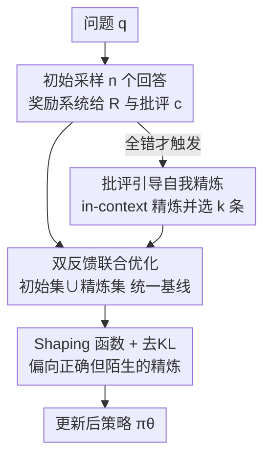

# Critique-GRPO: Advancing LLM Reasoning with Natural Language and Numerical Feedback

**会议**: ICML2026  
**arXiv**: [2506.03106](https://arxiv.org/abs/2506.03106)  
**代码**: https://github.com/zhangxy-2019/critique-GRPO  
**领域**: LLM推理 / 强化学习  
**关键词**: 强化学习, GRPO, 自然语言反馈, 自我精炼, 推理

## 一句话总结
作者先指出"纯数值奖励 RL"有三个硬伤（性能平台、自发反思无效、顽固失败），再把**自然语言批评（critique）**接进在线 RL：模型既学初始回答、又学"按批评做的自我精炼"，并用一个 shaping 函数偏向"正确但陌生"的精炼、抑制错误精炼，从而在八个推理基准上把 Pass@1 平均提升约 +15.0~21.6%（Qwen 系列）。

## 研究背景与动机

**领域现状**：用数值奖励做在线 RL（R1-Zero 范式）已成为提升 LLM 推理的主力——模型在标量奖励下试错，效果显著。

**现有痛点**：作者实测发现纯数值反馈有三个根本限制：（i）**性能平台**——训练步数到位后停滞，把训练 prompt 从 4k 扩到 32k（8 倍）也不再涨；（ii）**自发自我反思无效**——R1 式"Aha moment"（验证、回溯、反向链）很少真的把题做对；（iii）**顽固失败**——即便最好的 RL 模型，仍有约 29% 的训练题 Pass@4=0 怎么练都不会。根因在于：**标量奖励天生缺乏表达力，说不清一个回答"为什么错、该怎么改"**。

**核心矛盾**：密集中间奖励（PRM）能靠细粒度信用分配缓解平台和顽固失败，但仍救不了"无效反思"；而自然语言反馈（NLF，文本批评）虽有表达力，现有方法却多用 SFT 去**模仿静态、预先收集的批评**——离线、无法主动探索与实时适应。**把有表达力的批评接进在线 RL 回路**这件事还没人做。

**本文目标**：回答——能否把 critique 接进在线 RL，让 LLM 同时从自然语言反馈和数值反馈中学习？

**切入角度**：作者先做了一个关键观察实验——给已经"平台化"的 RL 模型喂自然语言批评，它居然能改对之前 Pass@4=0 的顽固错题（CoT 批评成功精炼 55.37% 的顽固失败题）。这说明批评带来的"言语信用分配"能让模型通过 in-context learning 触达**标准试错探索够不到的高质量精炼轨迹**。

**核心 idea**：提出 **Critique-GRPO**——在 GRPO 上加一条"批评引导的自我精炼"支路，让策略同时在"初始回答 + 精炼回答"上优化，把两阶段的探索收益都内化进策略。

## 方法详解

### 整体框架
Critique-GRPO 建在 GRPO 之上，一轮训练分三步串起来。**Step 1 初始采样**：对每个问题 $q$ 从旧策略采 $n$ 个初始回答，奖励系统给出标量奖励 $R^{(i)}$ 与批评 $c^{(i)}$（规则型给指示性批评、模型型给 CoT 批评）。**Step 2 批评引导精炼**：只在"$n$ 个初始回答全错"时才触发精炼，把"问题-回答-批评"三元组喂回模型做 in-context 自我精炼，得到精炼回答并打分，再选 $k$ 条（优先正确的）。**Step 3 在线策略优化**：把初始集与精炼集**合在一起**算优势、用统一基线，并对精炼回答套一个 shaping 函数偏向"低概率但正确"的 token，去掉 KL 惩罚以允许大幅更新。

### 关键设计

**1. 双反馈联合优化：把"按批评精炼"接进在线 RL，而不是离线模仿**

直接针对"纯数值奖励三大限制 + 现有 NLF 只会 SFT 模仿静态批评"。Critique-GRPO 的目标是初始回答项与精炼回答项之和：

$$\mathcal{J}_{\text{Critique-GRPO}}(\theta)=\mathcal{J}_{\text{init}}(\theta)+\mathcal{J}_{\text{refi}}(\theta)$$

其中 $\mathcal{J}_{\text{init}}$ 就是标准 GRPO——对每个 $q$ 采 $n$ 个回答、用组内均值/标准差归一化算优势 $\hat A^{(i)}=\frac{R^{(i)}-\text{mean}(\{R\})}{\text{std}(\{R\})}$，做带 clip 的重要性采样更新；$\mathcal{J}_{\text{refi}}$ 则是在批评引导的精炼回答上同样做 GRPO 式更新。和"用 SFT 模仿批评"的根本区别是：精炼是**在线、自我生成**的高质量轨迹，保留了主动探索，又把自然语言反馈的诊断信息注入了梯度。作者还用 Transfer Eluder Dimension 框架（Proposition 4.1）论证批评的样本效率：纯奖励下搜索空间的 Eluder 维度随步数 $L$ 指数级 $O(|\mathcal{S}|^L)$；若批评能定位首个错误步，问题分解成 $L$ 个独立子问题降到线性 $O(|\mathcal{S}|L)$，若还给出纠正建议则降到与搜索空间无关的 $O(L)$。

**2. 选择性触发精炼 + 优先初始回答：堵住"分布漂移导致的熵爆炸"**

精炼回答来自 in-context learning，分布和策略当前输出差很远，全量塞进训练会引发熵爆炸与性能退化。本设计用两个闸门控制注入量：其一，**只在初始 $n$ 个回答里零正确时才启动精炼**（Step 2），既省算力又只在"模型自己搞不定"时才借批评之力；其二，从精炼集里只**采 $k$ 条子集**（$k<n$，优先正确解，无正确则随机），与初始集拼成最终训练组 $\{y^{(i)}\}_{i=1}^n\cup\{y_{\text{refined}}^{(i')}\}_{i'=1}^k$。换句话说，训练以初始回答为主、精炼回答为辅地"少量、精准"注入，防止策略被陌生的精炼分布带偏。

**3. Shaping 函数：让"正确但陌生"的精炼 token 学得进去**

精炼回答虽对，但很多 token 在当前策略 $\pi_\theta$ 下概率很低，按标准重要性比率它们权重小、学不动。本设计对精炼回答改用 shaping 后的策略比率：

$$\rho_t^{(i')}(\theta)=\frac{\pi_\theta(y_{\text{refined},t}^{(i')}\mid q,y_{\text{refined},<t}^{(i')})}{\pi_\theta(y_{\text{refined},t}^{(i')}\mid q,y_{\text{refined},<t}^{(i')})+\gamma},\quad 0<\gamma<1$$

$\gamma$ 项的作用是给"当前低概率"的 token 反而**加大**梯度权重，把那些有效但陌生的精炼内容拉进策略；同时去掉 KL 惩罚以允许朝精炼方向做大步更新。初始回答仍用标准重要性比率 $r_t^{(i)}$，二者优势 $\hat A$ 用**初始集∪精炼集的统一组均值**做基线 $\hat A^{(i/i')}=R^{(i/i')}-\text{mean}(\{R^{(i)}\}\cup\{R_{\text{refined}}^{(i')}\})$，保证两路在同一参照系下比较，避免基线错位带来的偏置梯度。

### 损失函数 / 训练策略
总目标 $\mathcal{J}_{\text{init}}+\mathcal{J}_{\text{refi}}$（式 2-4）。沿用 Dr.GRPO 的做法去掉长度归一化 $1/|y^{(i)}|$ 与奖励标准差以避免偏置梯度；精炼路用 shaping 比率 $\rho$ 且去 KL。奖励系统支持规则型（字符串匹配 GT，二值奖励 + 构造带/不带 GT 的指示性批评）与模型型（奖励模型生成 CoT 批评，批评的二值正确性反推标量奖励）。

## 实验关键数据

### 主实验
五个模型、八个推理任务（数学 ID + 科学/通用 OOD）。下表节选 Qwen2.5-7B-Base 上的 Pass@1（Avg 为八任务平均）：

| 方法 | 监督信号 | MATH500 | AIME24 | GPQA-Diamond | MMLU-Pro | Avg. |
|------|---------|---------|--------|--------------|----------|------|
| Qwen2.5-7B-Base | — | 60.80 | 13.30 | 28.79 | 46.24 | 32.04 |
| + SFT | 专家示范 | 61.60 | 6.70 | 30.30 | 51.49 | 33.04 |
| + Critique FT | 仅语言FB | 66.00 | 13.30 | 28.79 | 44.46 | 34.76 |
| + R1-GRPO | 数值FB | 74.00 | 16.70 | 33.33 | 51.81 | 41.18 |
| + R1-Dr.GRPO | 数值FB | 78.40 | 13.30 | 38.89 | 52.83 | 42.66 |
| **+ Critique-GRPO (Indicative)** | 数值+语言 | 76.00 | 13.30 | 37.88 | 55.97 | 44.62 |
| **+ Critique-GRPO (w/ GT)** | 数值+语言 | 76.80 | **62.50**(AMC23) | 38.89 | 54.88 | 45.30 |
| **+ Critique-GRPO (CoT Critique)** | 数值+语言 | 77.80 | **20.00** | 37.88 | 55.28 | **47.08** |

关键读法：CoT 批评版 Avg 达 47.08，比最强数值基线 R1-Dr.GRPO（42.66）高 **+4.42**，比 base（32.04）高约 +15；AIME24 上 CoT 批评把 Pass@1 推到 20.00（数值基线仅 13.3~16.7）。论文报告 Qwen 系列平均提升 +15.0~21.6%、Llama-3.2-3B-Instruct +7.3%，且自我批评（self-critique）在 AIME 2024 上较 GRPO +16.7%。

### 消融实验（批评类型分析，Qwen2.5-7B-Base 顽固失败子集）

| 批评类型 | % 有效批评 | % 有效精炼 | % 顽固题被精炼成功 |
|---------|-----------|-----------|------------------|
| Indicative Critique | 100.00 | 2.09 | 7.05 |
| Indicative w/ GT | 100.00 | 1.98 | 6.88 |
| CoT Critique | 60.06 | **36.47** | **55.37** |

### 关键发现
- **CoT 批评贡献最大**：它给出"逐步评估"，有效精炼率 36.47%、成功精炼 55.37% 的顽固失败题，远超只给二值/答案的指示性批评（~2%、~7%）——富信息的批评才是关键。
- **刻意批评 > 自发反思**：三种批评都能改对之前 Pass@4=0 的题，证明"被点出错处"比模型自发的 Aha moment 有效得多。
- **去 KL + shaping 是稳定注入精炼的前提**：否则精炼分布漂移会引发熵爆炸；只在全错时触发、只采子集进一步控制注入量。

## 亮点与洞察
- **"批评接进在线 RL"补上了 NLF 的缺口**：以往 NLF 只会 SFT 模仿静态批评，这里让批评在线驱动自我精炼并回灌策略，把"为什么错/怎么改"的诊断信息真正变成梯度。
- **理论与现象呼应**：Proposition 4.1 用 Eluder 维度把"批评能指数级缩小搜索空间"说清，正好解释了"平台化模型靠批评救回顽固错题"的实验现象。
- **shaping 函数可迁移**："给当前低概率但正确的 token 加权"这一招，对任何"想从陌生但高质量轨迹（专家/精炼/蒸馏）里学"的 off-policy 场景都通用。

## 局限与展望
- **精炼只在"全错"时触发**：对"部分对"的中等难度题不注入批评，可能漏掉提升空间；触发条件偏粗。
- **依赖批评质量**：CoT 批评由奖励模型生成，其有效批评率仅 60%，批评本身错了会把精炼带偏；规则型指示性批评则信息太稀薄（成功率 ~7%）。
- **去 KL 的稳定性风险**：为大步更新去掉 KL，靠选择性触发 + shaping 维稳，超参（$\gamma$、$k$）敏感性未充分暴露。
- **改进思路**：让触发条件随题目难度自适应、对批评本身做置信度过滤、或引入批评-策略协同训练。

## 相关工作与启发
- **vs R1-GRPO / Dr.GRPO（纯数值在线 RL）**：它们只有标量奖励、受三大限制困扰；本文加一条语言反馈支路，平均 Pass@1 更高且能救顽固失败题。
- **vs Critique-FT / Refinement-FT（离线 SFT 模仿批评）**：它们离线模仿静态批评、无主动探索；本文在线自我精炼并回灌策略，泛化更稳。
- **vs RAFT / RL+专家示范**：后者依赖精挑的高质量示范数据；本文用模型/规则自动产的批评，免去专家示范依赖。
- **vs 密集过程奖励 PRM**：PRM 改善信用分配但救不了"无效反思"；自然语言批评直接告诉模型错在哪、怎么改，补上这一短板。

## 评分
- 新颖性: ⭐⭐⭐⭐⭐ 首次把表达性批评接进在线 RL 回路，配 Eluder 维度理论解释
- 实验充分度: ⭐⭐⭐⭐⭐ 5 模型 × 8 任务 + 批评类型/自我批评消融，覆盖充分
- 写作质量: ⭐⭐⭐⭐ 三大限制→观察实验→方法逻辑顺，公式清晰
- 价值: ⭐⭐⭐⭐⭐ 给"RL 提升 LLM 推理"指出可落地的语言反馈方向，代码开源

<!-- RELATED:START -->

## 相关论文

- [\[ICML 2026\] Reward Modeling from Natural Language Human Feedback](reward_modeling_from_natural_language_human_feedback.md)
- [\[ICML 2026\] The Role of Feedback Alignment in Self-Distillation](the_role_of_feedback_alignment_in_self-distillation.md)
- [\[ICML 2026\] GRPO is Secretly a Process Reward Model](grpo_is_secretly_a_process_reward_model.md)
- [\[AAAI 2026\] In-Token Rationality Optimization: Towards Accurate and Concise LLM Reasoning via Self-Feedback](../../AAAI2026/llm_reasoning/in-token_rationality_optimization_towards_accurate_and_concise_llm_reasoning_via.md)
- [\[ACL 2026\] Discovering a Shared Logical Subspace: Steering LLM Logical Reasoning via Alignment of Natural-Language and Symbolic Views](../../ACL2026/llm_reasoning/discovering_a_shared_logical_subspace_steering_llm_logical_reasoning_via_alignme.md)

<!-- RELATED:END -->
