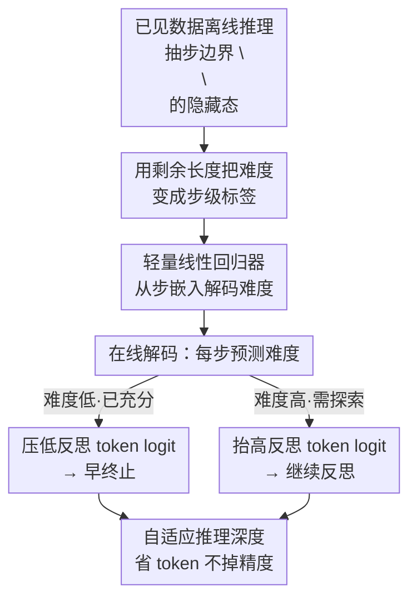

# DyCon: Dynamic Reasoning Control via Evolving Difficulty Modeling

**会议**: ICML2026  
**arXiv**: [2606.07108](https://arxiv.org/abs/2606.07108)  
**代码**: https://github.com/yu-lin-li/DyCon  
**领域**: LLM推理 / 高效推理  
**关键词**: 过度思考, 难度建模, 步级表征, logit 干预, 免训练

## 一句话总结
DyCon 发现"题目难度"在推理过程中是动态变化的、且被线性编码在大推理模型每一步的隐藏表征里，于是用一个轻量线性回归器在线估计每步难度，再据此实时调整"反思类 token"的 logit，让简单题早点收敛、难题继续探索，从而在不掉精度的前提下大幅压缩冗余推理 token——整个过程免训练、不改模型参数。

## 研究背景与动机
**领域现状**：大推理模型（LRM，如 DeepSeek-R1、QwQ、Qwen3-Thinking）靠"反复反思—探索—执行"的长链思维（CoT）在数学、代码等难题上拿到了很高的准确率。

**现有痛点**：这些模型缺乏对"什么时候该停"的精确控制，于是在简单题、甚至已经做对的题上仍然反复反思，产生大量冗余步骤，即"过度思考"（overthinking）。冗余不仅拉长推理轨迹、增加部署成本，还会引入额外幻觉。

**核心矛盾**：要治过度思考，本质是"在探索充分时及时终止"，但现有方法对"是否充分"的判断都是**静态**的。一类（TrimR、FlashThink）靠外部模型评估推理是否足够，但对所有输入用一把尺子，忽略了题目本身的难度差异；一类（DEER 等）靠手工设计的确定性指标和经验阈值，依赖人类先验、跨难度泛化差；还有一类用 SFT/RL 训模型隐式判断难度，但对数据量/质量敏感、易模式坍塌。所有这些都把"题目难度"当成推理开始前就固定的一个标量。

**本文目标**：能不能**显式、细粒度地**建模"动态演化的难度"，从而自适应地决定在每一步是该终止还是继续——简单题省算力，难题保留充分探索。

**切入角度**：作者做了两个关键观察。其一（图 2a），对 MATH-500 的 level-5 难题，每步让模型自评难度（1=几乎做完 / 2=尚有不确定 / 3=缺关键洞见），跨四个模型族都能看到难度随推理推进**持续下降**——说明难度不是静态的，而是随有效推理逐步降低、随跑偏而升高。其二（图 2b），用"剩余推理长度"当难度代理去拟合一个线性回归器，从步嵌入预测归一化难度，在留出测试集上 $R^2$ 很高——说明难度信息**线性地编码**在 LRM 的步级隐藏表征里。

**核心 idea**：既然每步的难度已经躺在模型自己的隐藏表征里，就用一个轻量线性探针把它读出来，再用读出的难度去实时拨动"反思 token"的概率，实现免训练的动态推理深度控制。

## 方法详解

### 整体框架
DyCon 把"控制推理长度"拆成离线、在线两段。**离线段（显式建模演化难度）**：在一批已见数据上跑推理，在每个步边界（`<think>` 与 `</think>` 之间以 `\n\n` 分隔的步）抽出步嵌入，并记录该步到推理结束的"剩余长度"作为难度标签；把剩余长度做对数变换 + 归一化得到有界的难度目标，拟合一个线性回归器当难度估计器。**在线段（难度感知的动态推理控制）**：解码时，每到一个步边界就用这个回归器从当前步嵌入预测难度，再据此干预"反思相关 token"（如 wait、however、alternatively 这类触发再思考的词）的 logit——难度低就压低它们的概率以加速收敛，难度高就抬高它们的概率以鼓励继续探索。整条链路不动 LRM 的参数 $\theta$，只额外挂一个线性头。

### 关键设计

**1. 用"剩余长度"把动态难度变成可测的步级标签**

要建模"每一步的难度"，第一个障碍是难度没有现成标注。作者沿用"难题需要更长推理"的直觉，但把它从"整条轨迹长度"细化到**步级代理**：对第 $s$ 个步边界，定义其难度代理为剩余长度 $r_s := t_{\text{end}} - t_s$，其中 $t_s$ 是第 $s$ 个步边界（`\n\n`）的 token 下标、$t_{\text{end}}$ 是 `</think>` 的下标。直觉上 $r_s$ 越大说明后面还要推很久、当前更难；越小说明快收敛了。配套地，把第 $s$ 步在第 $\ell$ 层的步嵌入定义为该步边界处的隐藏态 $\mathbf{e}^{(\ell)}_s := \mathbf{h}^{(\ell)}_{t_s}$——因为因果注意力掩码让步边界处的隐藏态天然汇聚了前面所有步的上下文，所以它能代表"到此为止"的推理状态。这一步的巧妙之处在于：它把"难度"这个抽象量锚定到一个**无需人工标注、推理结束后即可回填**的客观量（剩余长度），从而把动态难度建模变成一个可监督的回归问题。

**2. 轻量线性回归器解码隐藏表征里的难度**

有了步嵌入和剩余长度标签，怎么把"难度知识"取出来？由于观察二表明二者近似线性相关，DyCon 不去微调模型，而是在一个小规模已见集（论文用 MATH 训练集采样的 600 条样本）上，把剩余长度做对数变换并归一化成有界目标，再拟合一个**线性回归器**当难度估计器。线性的好处有三：拟合所需样本极少、推理时一次矩阵乘即得难度（几乎零额外开销）、且不触碰 $\theta$ 因而不会损伤模型原有能力。这与"用 SFT/RL 训模型隐式判难度"的路线形成鲜明对比——后者数据敏感、易坍塌，而 DyCon 把难度判断外置成一个可解释、可复用的线性探针，本质上是在"解码模型本就拥有的潜在知识"，而不是"教模型新东西"。

**3. 难度驱动的反思 token logit 干预**

读出难度后如何转化为对推理长度的控制？过度思考的直接表现是模型不断生成"反思类关键词"去触发再探索，于是 DyCon 在每个步边界**直接干预这些反思 token 的 logit**：若估计难度低（说明推理已充分），就降低反思 token 的 logit、使其概率下降，推理更快收敛终止；若估计难度高（说明还需探索），就抬高反思 token 的 logit、鼓励更深的反思。这是一个**双向、随难度连续变化**的干预，而非"一刀切提前停"——这正是它相对 Nothinking、ThinkPilot 这类激进剪枝法的关键区别：那些方法对所有题统一砍反思，简单题省了 token 但难题精度暴跌；DyCon 因为每步都看实时难度，能在同一条轨迹内"先放手探索、后果断收尾"，把省 token 和保精度同时拿到。

### 损失函数 / 训练策略
DyCon 不引入任何对 LRM 的训练或微调，唯一需要"拟合"的就是那个线性难度回归器，目标是最小化预测难度与（对数归一化后的）剩余长度标签之间的回归误差；干预强度由少量超参（反思 token 集合、logit 调整幅度）控制，整体免训练、即插即用。

## 实验关键数据

实验覆盖 4 个 4B–32B 的模型（DeepSeek-R1-Distill-Qwen-7B、Qwen3-4B-Thinking-2507、QwQ-32B 等）和 12 个 benchmark（数学推理、通用问答、代码）。核心结论：在几乎不掉甚至略涨准确率的同时，大幅减少 token 消耗。

### 主实验
下表为 DeepSeek-R1-Distill-Qwen-7B 上 DyCon（Ours）vs 原始 Baseline，指标为 Pass@1 / 平均 token 数（#Tok）。

| Benchmark | Baseline Pass@1 | Ours Pass@1 | ΔPass@1 | Δ#Tok |
|-----------|-----------------|-------------|---------|-------|
| MATH-500 | 92.0 | 92.0 | +0.0 | **−18.7%** |
| AIME24 | 50.0 | 53.3 | +3.3 | −16.2% |
| AIME25 | 36.7 | 36.7 | +0.0 | −18.6% |
| GSM8K | 90.6 | 91.1 | +0.5 | −27.5% |
| AMC23 | 87.5 | 90.0 | +2.5 | −38.6% |
| MMLU$_\text{algebra}$ | 90.0 | 91.0 | +1.0 | **−37.7%** |

可以看到越简单的题（GSM8K、AMC23、MMLU-algebra）省得越多（−27% 到 −39%），符合"简单题被过度思考最严重、压缩空间最大"的直觉；难题（AIME）则在小幅省 token 的同时甚至涨了精度。

### 消融实验（与其它高效推理法对比，DeepSeek-R1-Distill-Qwen-7B，AIME24）

| 方法 | Pass@1 ↑ | #Tok ↓ | 说明 |
|------|----------|--------|------|
| Baseline | 50.0 | 13008 | 不做控制 |
| Nothinking | 16.7 | 4222 | 激进砍反思，token 省但精度崩 |
| ThinkPilot | 13.3 | 1229 | token 极省但精度崩 |
| DEER | 49.2 | 9839 | 手工确定性指标，精度略降 |
| NoWait | 40.0 | 7281 | 抑制等待词，精度明显降 |
| Manifold Steering | 53.3 | 8457 | 表征引导，精度持平 |
| **Ours (DyCon)** | **53.3** | 10906 | 省 token 且精度反升 |

### 关键发现
- **静态/激进剪枝是有代价的**：Nothinking、ThinkPilot 把 token 砍到 4222/1229，但 AIME24 精度从 50.0 暴跌到 16.7/13.3——证明"统一砍反思"对难题是灾难。DyCon 用实时难度做双向调节，反而把精度从 50.0 提到 53.3，验证了"动态、按题施策"的必要性。
- **难度确实线性可解码**：观察二中线性回归器在留出集上 $R^2$ 很高，是整套方法成立的地基；正因为线性可解码，估计器才能做到几乎零开销。
- **省 token 幅度与题目难度负相关**：简单数据集（GSM8K/AMC23/MMLU-algebra）省 27%–39%，难数据集（AIME）省 16%–19%，说明节省主要来自"砍掉简单题上的冗余反思"，而非牺牲难题探索。

## 亮点与洞察
- **把"难度"从静态标量升级为动态轨迹**：以往工作只在推理开始前给一个难度分，DyCon 第一个实证并利用了"难度在推理中持续演化"这一事实，这是整篇的认知增量。
- **"潜在知识解码"而非"教模型"**：用线性探针读出模型已有的难度信息，免训练、不伤原能力、可解释，比 SFT/RL 路线轻得多也稳得多。这个"轻量线性头解码隐藏态里的某种量，再回灌去控制解码"的范式，可迁移到控制生成长度、风格、置信度等其它行为。
- **干预点选得准**：直接作用在"反思类 token"的 logit 上，正中过度思考的发生机制，而不是泛泛地缩短输出。

## 局限与展望
- **依赖"步边界"和"反思 token"的可定义性**：方法把 `\n\n` 当步边界、把若干关键词当反思触发词，这在数学/代码 CoT 上清晰，但在没有明显分步结构或反思词表的任务（开放式写作、对话）上如何界定步与干预目标尚不清楚。
- **剩余长度作为难度代理的循环性**：用"剩余长度"当难度标签、再去控制长度，存在一定自指——若模型本身就爱拖长，标签也会偏长。论文用对数归一化和跨模型 $R^2$ 验证缓解了这点，但代理的偏差边界值得进一步分析。
- **缓存全文未给出干预公式细节**：本地缓存的方法节缺少 3.3 的具体 logit 调整公式与超参（调整幅度、反思 token 集合的选取），上述机制描述以图 3 与"Our Solution"段为准，⚠️ 具体公式以原文为准。
- 干预幅度等超参对"省 token vs 保精度"权衡的敏感性，正文未充分展开。

## 相关工作与启发
- **vs DEER / FlashThink（确定性/外部判停）**：它们用手工指标或外部模型判断"是否够"，对所有输入一把尺子、依赖经验阈值；DyCon 用模型自身表征逐步估计难度，自适应且不需外部模型。
- **vs Nothinking / ThinkPilot（激进剪枝）**：它们统一抑制反思，token 省得多但难题精度崩；DyCon 双向调节，难题反而能涨精度。
- **vs 静态难度估计（Sheng/Zhao 等）**：它们在推理前用初始问题或 `<think>` token 给一个样本级静态难度；DyCon 做到样本间 + 推理内双重动态。
- **vs SFT/RL 训练判停**：那条路数据敏感、易坍塌；DyCon 免训练、用线性探针解码潜在知识，更轻更稳。

## 评分
- 新颖性: ⭐⭐⭐⭐⭐ "难度动态演化 + 线性可解码"是有洞察力的新观察，并被干净地转化为方法。
- 实验充分度: ⭐⭐⭐⭐ 4 模型 ×12 benchmark、对比多条高效推理基线，覆盖广；干预公式细节在缓存中缺失略影响可复现判断。
- 写作质量: ⭐⭐⭐⭐ 观察—动机—方法的逻辑链清晰，图 2/图 3 支撑有力。
- 价值: ⭐⭐⭐⭐⭐ 免训练、即插即用、显著省 token 不掉精度，对 LRM 实际部署很实用。

<!-- RELATED:START -->

## 相关论文

- [\[ICLR 2026\] EvolProver: Advancing Automated Theorem Proving by Evolving Formalized Problems via Symmetry and Difficulty](../../ICLR2026/llm_reasoning/evolprover_advancing_automated_theorem_proving_by_evolving_formalized_problems_v.md)
- [\[ACL 2025\] Dynamic and Generalizable Process Reward Modeling (DG-PRM)](../../ACL2025/llm_reasoning/dgprm_dynamic_process_reward.md)
- [\[ICML 2026\] Conformal Thinking: Risk Control for Reasoning on a Compute Budget](conformal_thinking_risk_control_for_reasoning_on_a_compute_budget.md)
- [\[ICML 2026\] On the Generalization Gap in Self-Evolving Language Model Reasoning](on_the_generalization_gap_in_self-evolving_language_model_reasoning.md)
- [\[ICML 2026\] Modeling Hierarchical Thinking in Large Reasoning Models](modeling_hierarchical_thinking_in_large_reasoning_models.md)

<!-- RELATED:END -->
