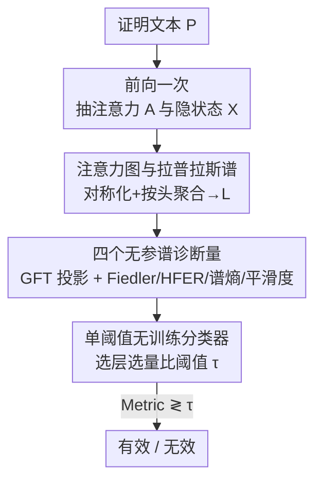

# Geometry of Reason: Spectral Signatures of Valid Mathematical Reasoning

**会议**: ICML2026  
**arXiv**: [2601.00791](https://arxiv.org/abs/2601.00791)  
**代码**: https://github.com/vcnoel/geometry-of-reason  
**领域**: LLM推理 / 机制可解释性  
**关键词**: 谱图论, 注意力图, 推理验证, 无训练探针, 归纳头

## 一句话总结
把 Transformer 每个注意力矩阵当成 token 加权图，提取 Fiedler 值、HFER、谱熵、平滑度四个无参谱诊断量，发现"有效数学推理"会在注意力谱上留下可测量的指纹（Cohen's $d$ 最高 3.30），从而**不需要任何训练**就能以 85–96% 的准确率判断一段证明是真推理还是模式匹配。

## 研究背景与动机

**领域现状**：判断 LLM 输出的证明"是不是真在推理"，目前主要靠两条路。一是**基于输出的形式化验证**——把生成的证明丢给 Lean/Coq/Isabelle 这类证明助手去编译，能过编译就算对；二是**学习式验证**——在模型内部表示或输出特征上训练一个分类器（过程奖励模型、真值探针、幻觉探针等）来预测对错。

**现有痛点**：编译式验证把"逻辑有效"和"语法可接受"混为一谈——一段逻辑完全正确的证明可能因为超时、缺 import、版本不兼容、格式问题被 Lean 拒绝；反过来，有微妙语义错误的证明也可能钻类型检查的空子蒙混过关。学习式验证则需要**大量标注数据**，跨架构泛化差，而且容易学到虚假相关（spurious correlation）而非"有效推理"的本质属性。

**核心矛盾**：我们想要的是一个能反映**逻辑连贯性本身**、不依赖编译器、不需要标注、还能跨架构通用的信号——但现有两条路都做不到，它们要么测的是编译器的脾气，要么测的是某个数据集上学到的捷径。

**切入角度**：作者从谱图论和神经流形几何出发，提出一个假设——自注意力本身就在 token 上诱导出一个**动态加权图**（边权就是注意力分数），而这个图的谱性质（拉普拉斯的特征值/特征向量）编码了信息如何在 token 间路由的全局结构。既然有效推理需要把前提、中间步骤、结论"连贯地"组织起来，那它应该让注意力图更平滑、连通性更好；无效推理则会表现出谱不规则性。

**核心 idea**：用"注意力图的谱几何"代替"训练好的探针"来判断推理有效性——零参数、零训练、零采样，只看注意力矩阵的形状。

## 方法详解

### 整体框架

整篇方法是一条**无参数前向流水线**：输入一段证明文本，让 Transformer 跑一次前向，同时抽出每层每个头的注意力矩阵 $\bm{A}^{(\ell,h)}$ 和隐状态 $\bm{X}^{(\ell)}$；把注意力矩阵对称化、按注意力质量加权聚合成每层一张图，构造图拉普拉斯 $\bm{L}^{(\ell)}$；用图傅里叶变换（GFT）把隐状态投影到拉普拉斯的特征基上；在每层算出四个谱诊断量；最后在某一层选一个诊断量，用**单个阈值**判定有效/无效。整条链路没有任何需要训练的参数，唯一的"参数"就是那个阈值 $\tau$。

### 关键设计

**1. 把注意力矩阵当作 token 加权图，并取其拉普拉斯谱**

针对"现有方法要么测编译器、要么测学到的捷径"这个痛点，作者的第一步是给注意力一个**结构化的几何对象**。对第 $\ell$ 层第 $h$ 个头的后 softmax 注意力矩阵 $\bm{A}^{(\ell,h)}$（每行和为 1），先对称化得到无向图权重 $\bm{W}^{(\ell,h)}=\frac{1}{2}(\bm{A}^{(\ell,h)}+(\bm{A}^{(\ell,h)})^\top)$，再按"注意力质量"权重 $\alpha_h^{(\ell)}$ 把多个头聚合成每层一张图 $\bar{\bm{W}}^{(\ell)}$，最后取组合拉普拉斯

$$\bm{L}^{(\ell)}=\bar{\bm{D}}^{(\ell)}-\bar{\bm{W}}^{(\ell)},\qquad \bm{L}^{(\ell)}=\bm{U}^{(\ell)}\bm{\Lambda}^{(\ell)}(\bm{U}^{(\ell)})^\top$$

其中 $\bar{\bm{D}}^{(\ell)}$ 是度矩阵，特征值满足 $0=\lambda_1\le\lambda_2\le\cdots\le\lambda_N$。拉普拉斯是半正定的，它的特征向量给出一组"图上的频率基"——低频对应在图上缓慢变化的模式，高频对应相邻 token 间的剧烈跳变。这一步的价值在于：它把"注意力路由信息的方式"翻译成了一个有谱分解的几何量，后面所有诊断都从这个谱里读出来，全程不需要学任何东西。

**2. 四个无参谱诊断量：从图-信号交互里读出推理质量**

有了拉普拉斯，还需要把隐状态 $\bm{X}^{(\ell)}$ 当作"定义在图节点上的信号"，用 GFT 投影到特征基 $\hat{\bm{X}}^{(\ell)}=(\bm{U}^{(\ell)})^\top\bm{X}^{(\ell)}$，再提取四个互补的诊断量。**HFER（高频能量比）**衡量信号能量落在高频模式的比例，$\mathrm{HFER}^{(\ell)}(K)=\frac{\sum_{m=K+1}^{N}\|\hat{\bm{X}}_{m,\cdot}\|_2^2}{\sum_{m=1}^{N}\|\hat{\bm{X}}_{m,\cdot}\|_2^2}$，$K$ 取中位特征值下标——HFER 越低说明能量集中在平滑的低频模式。**谱熵** $\mathrm{SE}=-\sum_m p_m\log p_m$（$p_m$ 是第 $m$ 个模式的归一化能量）刻画能量在多少个模式上铺开。**Fiedler 值** $\lambda_2$（第二小特征值，即代数连通度）衡量图整体连通性，越大说明信息流越高效。**平滑度** $\text{Smooth}^{(\ell)}=1-\mathcal{E}^{(\ell)}/\mathcal{E}_{\max}^{(\ell)}$ 由 Dirichlet 能量 $\mathcal{E}^{(\ell)}=\mathrm{Tr}((\bm{X}^{(\ell)})^\top\bm{L}^{(\ell)}\bm{X}^{(\ell)})$ 归一化而来，接近 1 表示强连边的 token 表示相近。直觉上，有效证明的隐状态在注意力图上变化平缓（高平滑、低 HFER、高连通），无效推理则谱上更"毛糙"。为什么有效？因为这四个量**只依赖图结构和隐状态的几何**，不依赖任何输出统计或标签，所以测的是推理的结构性属性，而非数据集捷径。

**3. 单阈值、无训练的分类器（外加少量样本校准）**

针对学习式探针"要海量标注、跨架构不泛化"的痛点，作者把分类器做到极简：在某个选定层 $\ell^*$ 取某个诊断量，与一个阈值比较即可，$\hat{y}=\mathbf{1}[\text{Metric}^{(\ell^*)}\lessgtr\tau]$。整个分类器**只有一个参数** $\tau$。具体哪个量、哪一层、方向、阈值，可以在一个很小的留出集（约 50 个样本）上校准；为消除选择偏差，作者还用嵌套交叉验证（5 折外 / 4 折内）连"选哪个量、哪一层"一起放进内折选，杜绝泄漏。这样设计的好处是：效应量 $d\ge2.09$ 本身与阈值无关，校准只是把"温度计"对准目标分布的刻度，因此校准准确率（89–95%）和嵌套 CV 准确率（82.8–85.9%）之间的差距反映的是**校准成本**而非过拟合——这也是它敢叫"无训练"的底气。

### 损失函数 / 训练策略

本方法**没有训练目标也没有可学习参数**，唯一需要在小留出集上定标的是分类阈值 $\tau$（以及"选哪个诊断量 / 哪一层"这组离散选择）。这正是它区别于过程奖励模型、真值探针的根本特征：零梯度、零采样、零标注训练。

## 实验关键数据

### 主实验

在 MiniF2F（488 道形式化数学题，Lean 形式化）上评测 7 个指令微调模型、覆盖 4 个架构家族、参数量跨 16 倍。原始 454 个定理-证明对（154 个人写有效 + 300 个模型生成无效），经标签校正后约 187–205 有效 / 249–267 无效（约 43%/57%）。多数类基线准确率约 57%。

| 模型 | 家族 | 最佳诊断量 | Cohen's $d$ | 准确率 |
|------|------|-----------|------|--------|
| Llama-3.2-1B | Meta | Fiedler (L0) | 3.02 | 93.4% |
| Llama-3.2-3B | Meta | HFER (L11) | 2.97 | 94.9% |
| Llama-3.1-8B | Meta | HFER (L30) | 3.00 | 94.1% |
| Qwen2.5-0.5B | Alibaba | 谱熵 (L0) | 2.93 | 93.2% |
| Qwen2.5-7B | Alibaba | HFER (L26) | 2.43 | 89.9% |
| Phi-3.5-mini | Microsoft | 平滑度 (L25) | 3.30 | 93.4% |
| Mistral-7B† | Mistral | 平滑度 (L26) | 2.09 | 85.9% |

全部 7 个模型 $p_{\text{MW}}<10^{-47}$、$p_t<10^{-75}$（Qwen-0.5B 达 $p_t=1.43\times10^{-116}$），效应量是机器学习分类任务常见值的 3–4 倍。†Mistral-7B 用滑动窗口注意力（SWA），判别特征从 HFER 转为平滑度（$d=2.09$, $p<10^{-48}$）——说明**注意力设计决定了哪个谱通道承载推理质量**。

### 消融实验

| 配置 | 关键指标 | 说明 |
|------|---------|------|
| 多数类基线 | ~57% | 永远猜"无效" |
| 单阈值谱分类器 | 最高 95.6% | 比随机高 +39 个百分点 |
| 阈值 ±10% 扰动 | 准确率变化 <2.5% | 对阈值不敏感 |
| 阈值 ±20% 扰动 | 降低 <5% | 鲁棒 |
| 按难度分层 | IMO/Putnam 100%（n=12）, AMC/AIME 93% | 越难谱指纹越明显 |
| 按证明长度分层 | 各五分位 87–100% | 没把长度当捷径 |

### 关键发现
- **Platonic validity（柏拉图式有效性）**：谱信号追踪的是**逻辑连贯性**而非编译器接受度——那些因超时、缺 import 被 Lean 拒绝但逻辑正确的证明，会被谱方法正确归为"有效"。人工审计（$\kappa=0.82$, $n=51$）确认了这一区分。这是本文最"啊哈"的洞察：谱方法看到的是编译器看不到的"真有效"。
- **架构决定论**：判别特征随注意力机制变化——全局注意力下 HFER 主导，SWA 下转为平滑度。HFER 与谱熵平均相关 $r=-0.97$ 几乎冗余，但 Fiedler 值基本独立（与 HFER 仅 $r=-0.29$）；在 Llama-3.1-8B 第 8 层，HFER 达 $d=2.39$ 而谱熵塌到 $d=0.08$，置信区间不重叠，证明 HFER 隔离的是图结构特征、独立于输出统计。
- **泛化到自然语言**：在 MATH 非形式化思维链上信号衰减但仍显著（$d=0.78$, $p<10^{-3}$），最佳量从 HFER 转为 Fiedler，暗示自然语言有效性更依赖全局连通性。
- **因果消融**确认谱指纹可溯源到归纳头（induction-head）电路。

### 下游应用：证明搜索重排

把 HFER 当零样本重排器用于 Best-of-16 证明搜索（Llama-3.1-8B, MiniF2F）：

| 重排器 | Pass@1 | AUC-ROC |
|--------|--------|---------|
| Random | 22.4% | – |
| Token Entropy | 30.4% | 0.971 |
| Log-Prob | 29.8% | 0.979 |
| HFER（本文） | 34.2% | 0.962 |
| Ensemble ($Z_{\text{LP}}-Z_{\text{HFER}}$) | 37.1% | 0.988 |

HFER 的 AUC 虽略低于 log-prob，但 Pass@1 反而更高——因为 log-prob 对"自信的幻觉"（流畅但结构不连贯的证明）视而不见，而 HFER 恰好惩罚这类情况。在 Phi-3.5-mini（$d=3.30$）上 HFER 相对 log-prob 提升 +6.6%，在 Llama-3.1-8B（$d=3.00$）上 +4.4%。仅用 50 个校准样本，HFER 就达到全监督探针上界（91.8%±2.4%）98% 的 AUC，而后者需要数百万标签。

## 亮点与洞察
- **把"推理对不对"变成一个谱图问题**：最巧妙之处是不去训探针、不去跑编译器，而是直接读注意力图的谱形状，零参数零标签就拿到 $d>3$ 的判别力——这把可解释性从"找特定电路"推进到"看全局几何"。
- **Platonic validity 提供了编译器之外的第二意见**：当形式化系统因技术原因误杀一段逻辑正确的证明时，谱方法能把它捞回来，这对自动定理证明的反馈回路很有价值。
- **架构-特征映射可迁移**：HFER↔全局注意力、平滑度↔SWA 这种对应关系提示，换到新模型时不必重训，只要知道它的注意力类型就大致知道该看哪个谱通道，再用约 50 个样本校阈值即可。

## 局限与展望
- **跨模型阈值不能直接搬**：不同模型的诊断量数值尺度不同，原始阈值迁移会掉到约 50%；现象（方向、判别层）通用，但每换一个模型仍需约 50 个标注样本重新校准。
- **自然语言上信号明显衰减**：从形式化的 $d=3.02$ 掉到非形式化思维链的 $d=0.78$，平衡数据上准确率只有 68.4%——对开放式 CoT 的实用性还有距离。
- **依赖能拿到注意力和隐状态**：方法需要白盒访问模型内部，对只给输出的闭源 API 不适用；同时 $O(N^3)$ 的特征分解在超长证明上会成为开销（作者称 $N<1000$ 时可忽略）。

## 相关工作与启发
- **vs 编译式验证（Lean/Coq/Isabelle）**：它们测语法可接受性、会误杀逻辑正确的证明；本文测逻辑连贯性，能识别被编译器技术性拒绝的"真有效"证明（Platonic validity）。
- **vs 学习式探针（真值探针/过程奖励模型/幻觉探针）**：它们要海量标注、跨架构不泛化、可能学到虚假相关；本文零训练、零采样，只用一个阈值，且效应量与阈值无关。
- **vs Attention Graphs 类机制可解释性工作**：前者多在找特定电路（如归纳头）；本文分析注意力的**全局谱几何**，并把它和推理有效性这个下游量直接挂钩，还做了因果消融把谱指纹溯源回归纳头。

## 评分
- 新颖性: ⭐⭐⭐⭐⭐ 把谱图论引入推理验证、提出 Platonic validity 与架构决定论两个新概念，视角很新。
- 实验充分度: ⭐⭐⭐⭐⭐ 7 模型 4 家族、嵌套 CV、难度/长度分层、因果消融、下游重排、自然语言泛化，相当扎实。
- 写作质量: ⭐⭐⭐⭐ 概念清晰、图表丰富，但谱诊断密集，非谱图背景读者门槛偏高。
- 价值: ⭐⭐⭐⭐ 无训练、可即插即用为证明搜索做重排，对定理证明反馈回路有实用价值，唯白盒+阈值校准限制了部署面。

<!-- RELATED:START -->

## 相关论文

- [\[ICML 2026\] Inference-Time Conformal Reasoning with Valid Factuality Control for Large Language Models](inference-time_conformal_reasoning_with_valid_factuality_control_for_large_langu.md)
- [\[ACL 2026\] LLM Reasoning as Trajectories: Step-Specific Representation Geometry and Correctness Signals](../../ACL2026/llm_reasoning/llm_reasoning_as_trajectories_step-specific_representation_geometry_and_correctn.md)
- [\[ICLR 2026\] Native Reasoning Models: Training Language Models to Reason on Unverifiable Data](../../ICLR2026/llm_reasoning/native_reasoning_models_training_language_models_to_reason_on_unverifiable_data.md)
- [\[ACL 2026\] Which Reasoning Trajectories Teach Students to Reason Better? A Simple Metric of Informative Alignment](../../ACL2026/llm_reasoning/which_reasoning_trajectories_teach_students_to_reason_better_a_simple_metric_of_.md)
- [\[ICLR 2026\] Achieving Olympia-Level Geometry Large Language Model Agent via Complexity Boosting Reinforcement Learning](../../ICLR2026/llm_reasoning/achieving_olympia-level_geometry_large_language_model_agent_via_complexity_boost.md)

<!-- RELATED:END -->
