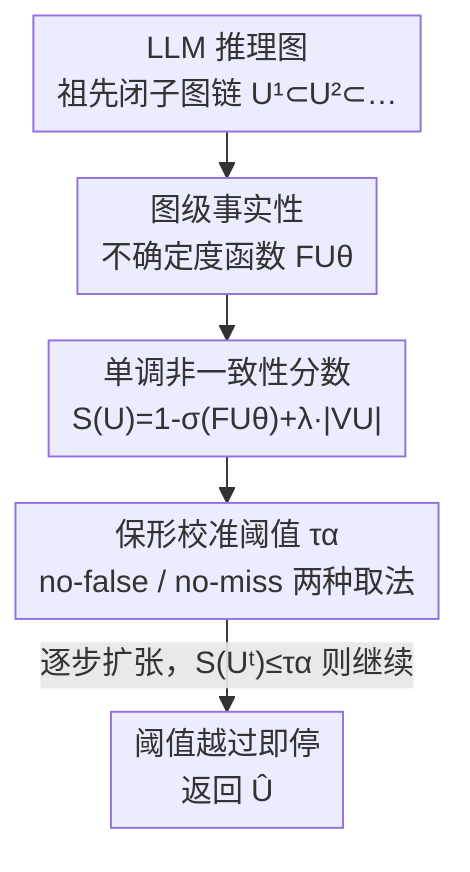

# Inference-Time Conformal Reasoning with Valid Factuality Control for Large Language Models

**会议**: ICML2026  
**arXiv**: [2606.08831](https://arxiv.org/abs/2606.08831)  
**代码**: https://github.com/tinattw/ITCR  
**领域**: LLM推理 / 不确定性量化 / 保形预测  
**关键词**: 保形预测, 推理图, 事实性控制, 推理时干预, 覆盖保证

## 一句话总结
ITCR 把保形预测（conformal prediction）从"生成完再剪枝"的事后做法，改造成"边生成边判停"的推理时机制：它在 LLM 的推理图上学一个图级事实性不确定度函数，并构造一个随子图扩张单调递增的非一致性分数，一旦越过校准好的阈值就立刻停止扩张，从而对"输出里没有错误步骤（no-false）"或"输出包含所有正确步骤（no-miss）"给出 $1-\alpha$ 的有效覆盖保证，下游推理准确率平均提升 18.77%。

## 研究背景与动机
**领域现状**：LLM 做多步推理时，中间结论之间存在依赖关系，可以看成一张隐式有向无环图（DAG）：每个节点是一条 claim，边表示"下游结论依赖上游结论"。一个节点的正确性不是自给自足的，而是条件依赖于它的祖先——上游一旦出错，所有下游 claim 都被连带污染。

**现有痛点**：要给这种推理的事实性上一道"保险"，最近的工作（rubin2025conformal）把保形预测引入进来，它能在用户指定的置信水平 $1-\alpha$ 下保证"保留下来的 claim 联合一致于真实知识"。但这些方法都是**事后（post-hoc）**的：先让模型把完整的多步回答全部生成出来，再在候选子图上做保形过滤、然后强行补上"祖先闭包"约束（删掉那些祖先被剪掉了的节点）。校准只定义在"已经生成好的内容"上，CP 完全无法干预生成过程本身。

**核心矛盾**：事实性不确定度本质上是**结构性的**——它定义在推理结构上，反映"哪一簇 claim 不可靠"，而不是各节点错误的简单累加。而推理是在祖先依赖下逐步增量生成的，所以"节点级 / 事后"的不确定度估计与"最终图的有效事实性"在结构上是错位的。可靠的控制需要在**推理结构层面、推理时**就做不确定度量化。

**本文目标**：能不能设计一个**推理时（inference-time）**的保形事实性控制，在生成过程中就决定"继续扩张还是停止"，同时仍保住覆盖保证？

**切入角度**：作者注意到，标准保形预测可以用一族"嵌套预测集"来刻画，校准就是选最小的索引达到有效覆盖。如果能让推理图的生成也构成一条"逐步包含的祖先闭子图链"，并让非一致性分数沿这条链单调递增，那么"阈值一旦越过就不可逆"，停止判据就和保形校准对得上了。

**核心 idea**：学一个图级事实性不确定度函数，再用"模型项 + 子图大小惩罚"拼出一个**保证单调（nested）**的非一致性分数，把保形阈值变成生成时的停止信号——用推理时判停代替事后剪枝。

## 方法详解

### 整体框架
ITCR 要解决的是"在 LLM 增量生成推理图的过程中，何时停手才能既保住事实性又不过度惜字"。整条管线分两段：**离线**先在留出数据上学一个图级事实性不确定度函数 $\mathrm{FU}_\theta$、定义非一致性分数 $S(U)$、并按目标覆盖类型把阈值 $\tau_\alpha$ 校准好；**在线**时从根子图出发，逐步扩张当前的祖先闭子图 $U^t$，每扩一步就算一次 $S(U^t)$，只要 $S(U^t)\le\tau_\alpha$ 就接受并继续扩张，一旦越过阈值立即停止，返回最后一个被接受的子图 $\widehat U$。由于分数单调，越过即不可逆，因此**不需要任何回溯或事后剪枝**。

整个事实性目标有两种互补口径：**no-false**（精度向，输出里一个错节点都不能有）要求 $\mathbb{P}(V_{\widehat U}\subseteq\mathcal{T})\ge 1-\alpha$，取满足条件的**极大**祖先闭子图；**no-miss**（召回向，所有正确节点都要被包含）要求 $\mathbb{P}(\mathcal{T}\subseteq V_{\widehat U})\ge 1-\alpha$，取满足条件的**极小**祖先闭子图（$\mathcal{T}$ 是图中事实正确节点的集合）。两者只是校准阈值的取法不同，生成机制完全共用。

### 关键设计

**1. 学习图级事实性不确定度函数：把"哪簇 claim 不可靠"变成可校准的标量**

推理的事实性天生是图级属性——一条 claim 对不对取决于它的祖先在不在、对不对，所以合法输出必须是祖先闭的；这意味着节点级估计单独使不上劲，只能事后剪枝。但又没有一个通用原则能把节点级不确定度"聚合"成结构一致、可被保形校准的图级量。ITCR 的做法是直接从数据**学**这样一个函数 $\mathrm{FU}_\theta:(U,\{\mathrm{fu}(v)\}_{v\in V_U})\mapsto\mathbb{R}_+$，输入是当前子图 $U$ 及其节点级事实性信号 $\mathrm{fu}(v)\in[0,1]$，输出一个反映"该子图发生事实违背"风险的标量。监督信号在子图层面构造：图级事实性是个二元谓词（子图要么整体一致于参考世界、要么不一致），所以学 $\mathrm{FU}_\theta$ 退化成一个二分类问题，其连续输出被解读为用于排序的不确定度分数。$\mathrm{FU}_\theta$ 可以用任何对集合/图置换不变的模型实例化（线性模型、树模型、神经网络皆可）。

关键在于：$\mathrm{FU}_\theta$ 学得好不好**不影响**覆盖保证的有效性——CP 把学到的分数当黑箱，无论它怎么来，覆盖都成立；学习只影响**效率**（保留更大子图 / 更晚停止）。

**2. 单调（nested）非一致性分数：让"阈值越过即不可逆"在生成时成立**

把保形预测的"嵌套集"视角迁移到序列生成有个硬要求：非一致性分数必须在子图包含关系下单调，即对 $U^1\subset U^2\subset\cdots\subset U^{T_G}$ 有 $S(U^1)\le S(U^2)\le\cdots$（Definition 3.1）。否则可能出现 $S(U^t)>\tau$ 但 $S(U^{t+1})<\tau$，停下来就失去意义、校准也失效。而学到的 $\mathrm{FU}_\theta$ 经 sigmoid 后是无约束的，并不保证单调。为此 ITCR 把分数显式构造成

$$S(U)=1-\sigma\big(\mathrm{FU}_\theta(U,\{\mathrm{fu}(v)\}_{v\in V_U})\big)+\lambda|V_U|,$$

其中第一项 $B(U)=1-\sigma(\mathrm{FU}_\theta(\cdot))$ 是模型给的事实性不确定度，第二项 $\lambda|V_U|$（$\lambda\in(0,1)$）是**子图大小惩罚**，它通过构造强制单调——直观上反映"子图越扩，累积的不确定度越大"。覆盖对任意固定 $\lambda$ 都成立，$\lambda$ 只当作效率超参；而单调性对 $\lambda$ 提了一个充分条件（Proposition 3.3）：定义每加一个节点时学习项的最坏非单调波动

$$\kappa(X):=\sup_{U\subset U'\subseteq G_X}\frac{\big(B(U)-B(U')\big)^+}{|V_{U'}|-|V_U|},\quad \kappa:=\sup_{X\sim P_X}\kappa(X),$$

只要 $\lambda\ge\kappa$，大小惩罚就能压住学习项的波动，使 $S(U)$ 在任意祖先闭扩张下递增、阈值越过不可逆。全局 $\kappa$ 不可算，实践中沿校准轨迹考察逐实例的 $\kappa(X)$ 经验分布，用来初始化 $\lambda$ 并权衡"效率-鲁棒性"。

**3. 双目标保形校准：no-false 与 no-miss 各自取阈值**

有了单调分数，校准就回到了标准保形的一维分位数问题，但两种覆盖目标的校准子集不同。**no-false**（Theorem 3.5）等价于控制"含错节点子图"上的假阳率，是单边保形：对每个含错节点的校准输入 $X_i$，取其**极小**且含错的祖先闭子图 $U_i^{\text{nf}}$（即第一个变坏的子图），把阈值 $\tau_\alpha^{\text{nf}}$ 设为分数 $\{S(U_i^{\text{nf}})\}$ 的经验 $\alpha$ 分位数；因为分数单调，接受任何更晚的坏子图就蕴含接受这个最早的坏子图，所以校准在这些分数上就够了。**no-miss**（Theorem 3.7）则相反：对每个校准样本取**包含所有正确节点的极小**祖先闭子图 $U^{\text{nm}}$，把 $\tau_{1-\alpha}^{\text{nm}}$ 设为 $\{S(U^{\text{nm}})\}$ 的 $(1-\alpha)$ 分位数。设计 no-miss 的动机很具体：no-false 太严，遇到真假节点交错的推理图会频繁"完全弃答"（如图 2 中前作在 QA 上有相当一部分样本保留比例塌到 0），no-miss 通过允许少量不确定节点换来更完整的推理输出。两个保证都是 model-agnostic、distribution-free 的，只依赖校准 + 分数单调性，与 $\mathrm{FU}_\theta$ 的精度无关。

### 一个完整示例
以 LLaMA-3.1-8B-Instruct 在 GSM8K 上的一道题为例（论文图 1），置信水平取 85%。原始输出里中间步骤有对（蓝）有错（红）。**事后法**：先把整段推理全部生成完，再用保形阈值过滤掉超阈步骤，然后做第二遍扫描删掉"祖先已缺失"的步骤——要两趟、且做了无用功。**ITCR**：在推理时逐步扩张，每扩一个节点就检查一次分数，分数一旦越过阈值就**当场停止生成**，返回当前的祖先闭子图。两者用同一个置信分数和同一置信水平，输出都保证不含事实错误步骤，但 ITCR 既省掉了"先全生成再回头剪"的浪费，停下来的子图在下游推理任务上也更准。

## 实验关键数据

### 主实验
在 MATH、GSM8K 和世界知识 QA（FELM）三个基准上评估，骨干含 LLaMA 系列；指标是**经验覆盖率**（target $1-\alpha$）与对应**效率**（no-false 下 Eff 是保留节点比例、越高越好；no-miss 下 Eff 是删除节点比例、越高越好）。✓ 表示覆盖在 0.01 容差内达标。结果取 100 次独立运行的均值±标准差。下表节选 $\alpha=0.05$ 的代表性数字：

| 数据集 | 方法 | no-miss 覆盖 | no-miss 效率(%) | no-false 覆盖 | no-false 效率(%) |
|--------|------|------|------|------|------|
| MATH | CPL | ✗ 0.144 | 63.72 | ✗ 0.548 | 37.04 |
| MATH | **ITCR** | ✓ 0.947 | 3.44 | ✓ 0.943 | 21.66 |
| GSM8K | CPL | ✗ 0.169 | 80.35 | ✗ 0.853 | 18.40 |
| GSM8K | **ITCR** | ✓ 0.945 | 2.15 | ✓ 0.953 | 18.06 |
| QA | CPL | ✗ 0.383 | 92.72 | ✓ 0.947 | 7.73 |
| QA | **ITCR** | ✓ 0.957 | 6.25 | ✓ 0.948 | 13.90 |

ITCR 在所有数据集、两种覆盖目标、两个 $\alpha$ 上都**稳定达标**；而事后基线 CPL 的覆盖大面积失守（no-miss 覆盖常低到 0.14~0.38，远未达 0.95）——它那些看似很高的"效率"是建立在覆盖不达标的基础上，按规则不计入比较。下游推理任务上，推理时校准得到的图比事后剪枝的图准确率**平均高 18.77%**。

### 消融实验
作者把学到的 $\mathrm{FU}_\theta$ 替换成对节点级分数的启发式聚合规则，得到 ITCR-MAX / ITCR-SUM / ITCR-AVG 三个变体，用来隔离"图级学习函数"的贡献（$\alpha=0.05$）：

| 配置 | 聚合方式 | 典型表现（GSM8K no-miss 覆盖/效率） | 说明 |
|------|---------|------|------|
| ITCR | 学习的 $\mathrm{FU}_\theta$ | ✓ 0.945 / 2.15 | 覆盖稳达标，效率最优 |
| ITCR-MAX | 取节点分数最大值 | ✗ 0.938 / 6.50 | 单调但覆盖偶尔不达标 |
| ITCR-SUM | 节点分数求和 | ✗ 0.931 / 5.24 | no-false 端常过保守（Eff≈1.0） |
| ITCR-AVG | 节点分数取平均 | ✗ 0.917 / 7.10 | 多处覆盖不达标 |

### 关键发现
- **覆盖与效率要一起看**：启发式变体（尤其 SUM）在 no-false 上能把覆盖顶到 1.000，但效率塌到 ~0%（几乎啥都不留），等于以"完全弃答"换覆盖；只有学习版 $\mathrm{FU}_\theta$ 能在达标的同时保住高效率。
- **学习函数的价值在效率不在有效性**：理论已证覆盖与 $\mathrm{FU}_\theta$ 精度无关，实验里学习版相对启发式聚合的优势确实主要体现在"同等覆盖下保留/删除更精准"。
- **no-miss 解决了 no-false 的塌缩**：前作在 QA 上有相当比例样本保留率为 0（完全弃答），no-miss 通过允许有限不确定节点显著缓解了过度弃答。

## 亮点与洞察
- **把"事后剪枝"翻译成"推理时判停"**：核心机巧是认出"推理图的增量生成 = 一条嵌套子图链"，从而能复用保形预测的嵌套集理论，让停止判据天然带覆盖保证——这是把 CP 从离线搬到在线的关键桥梁。
- **用一个大小惩罚项强行造单调**：$+\lambda|V_U|$ 看似简单，却把"无约束的神经网络分数"改造成"可作停止信号的单调分数"，并给出 $\lambda\ge\kappa$ 的充分条件，把工程 trick 落到了理论上。
- **覆盖有效性与模型质量解耦**：FU 函数当黑箱、只影响效率，这让方法对 $\mathrm{FU}_\theta$ 的实现非常宽容（线性/树/神经网络都行），落地门槛低。
- **可迁移性**：这套"嵌套分数 + 推理时停止"的范式不止用于事实性，凡是"逐步生成 + 想在生成中途按某个风险阈值停手并保住统计保证"的场景（如带约束的逐步检索、agent 逐步取证）都可借鉴。

## 局限与展望
- **依赖可交换性假设**：校准图与测试图需 i.i.d. 同分布、可交换，分布漂移（换领域/换模型）时覆盖保证可能打折。
- **依赖节点级事实性信号 $\mathrm{fu}(v)$ 与子图级标注**：需要 claim 级正确性标注来构造监督和聚合 $\mathcal{T}$，这类标注成本高、且本身可能有噪声。
- **$\lambda$ 的"效率-鲁棒性"权衡靠经验**：全局 $\kappa$ 不可算，只能用 $\kappa(X)$ 经验分布近似初始化 $\lambda$；$\lambda$ 偏大保单调但更保守、偏小更高效但可能破坏单调，调参依赖数据。
- **推理图需可良定义为 DAG**：方法假设推理输出能抽成祖先闭的 DAG，对那些依赖关系模糊、非结构化的自由文本推理，如何稳定抽图是前置难点。

## 相关工作与启发
- **vs CPL (mohri2024language)**：CPL 在单 claim 层面估事实性风险，是节点级 + 推理时的；ITCR 在**图级**学不确定度并显式造单调分数，实验中 CPL 的覆盖大面积失守，说明节点级估计与图级可靠性目标结构错位。
- **vs 事后保形剪枝 (rubin2025conformal)**：前作先全生成、再用保形过滤 + 祖先闭包修复，是"选择问题"；ITCR 把控制提到生成时，是"控制问题"，省掉两趟剪枝且下游更准（+18.77%）。
- **vs 嵌套保形预测 (gupta2022nested)**：ITCR 把标准 CP 的"嵌套集"思想迁移到序列化的子图扩张链，把"最小索引达覆盖"对应成"最早越阈即停"。

## 评分
- 新颖性: ⭐⭐⭐⭐⭐ 把保形预测从事后剪枝改造成推理时判停，并用单调分数给出理论保证，角度新且扎实
- 实验充分度: ⭐⭐⭐⭐ 三数据集双目标双 α + 启发式消融，覆盖/效率两维都报；但骨干与下游任务可再扩
- 写作质量: ⭐⭐⭐⭐ 理论动机清晰、定理与算法对应明确；记号偏密，对非保形背景读者门槛略高
- 价值: ⭐⭐⭐⭐⭐ 给"带统计保证的 LLM 推理事实性控制"提供了可落地的推理时范式，可迁移性强

<!-- RELATED:START -->

## 相关论文

- [\[ICML 2026\] Conformal Thinking: Risk Control for Reasoning on a Compute Budget](conformal_thinking_risk_control_for_reasoning_on_a_compute_budget.md)
- [\[ICML 2026\] Inference Time Optimization with Confidence Dynamics](inference_time_optimization_with_confidence_dynamics.md)
- [\[ICML 2026\] Reasoning Structure of Large Language Models](reasoning_structure_of_large_language_models.md)
- [\[ICML 2026\] Beyond Test-Time Memory: State-Space Optimal Control for LLM Reasoning](beyond_test-time_memory_state-space_optimal_control_for_llm_reasoning.md)
- [\[ICLR 2026\] ATTS: Asynchronous Test-Time Scaling via Conformal Prediction](../../ICLR2026/llm_reasoning/atts_asynchronous_test-time_scaling_via_conformal_prediction.md)

<!-- RELATED:END -->
