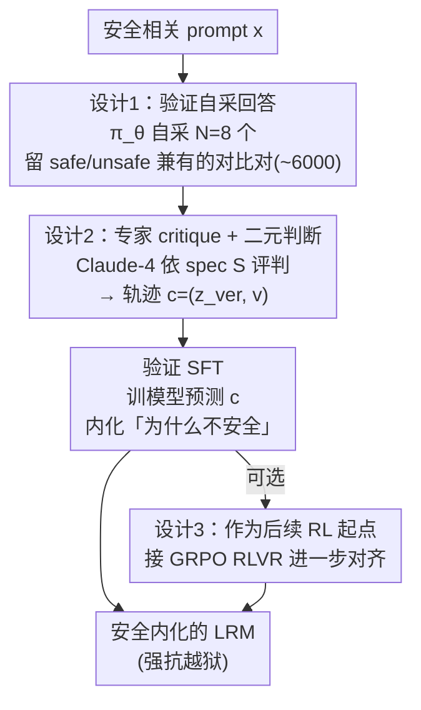

# Internalizing Safety Understanding in Large Reasoning Models via Verification

**会议**: ICML 2026  
**arXiv**: [2605.08930](https://arxiv.org/abs/2605.08930)  
**代码**: https://github.com/AlphaLab-USTC/SInternal (有)  
**领域**: LLM 推理 / 安全对齐  
**关键词**: 安全对齐, 推理模型, 自我验证, 越狱防御, SFT 初始化

## 一句话总结
本文论证「会生成安全答案」≠「懂安全」，提出 SInternal 框架：只训练大型推理模型去 verify 自己生成答案的安全性，由此涌现的内在安全理解大幅压制 jailbreak 攻击（StrongREJECT ASR 从 41% 降到 0.6%）并成为后续 RL 的更好起点。

## 研究背景与动机

**领域现状**：大型推理模型（LRM，如 DeepSeek-R1）的显式 CoT 让最终答案更危险。当前主流对齐范式是 answer-centric：要么 SFT 在专家精选的「安全 trajectory」上、要么 RL 用安全 verifier 给最终答案打分。

**现有痛点**：作者做了个简单实验——让对齐后的 LRM 去判断「这个候选回答对这个 prompt 安不安全」。结果令人不安：经过 SFT + RLVR 的 DeepSeek-R1-Distill-Qwen-7B 在这个 binary 分类任务上 F1 还不如随机猜（如 Figure 2）。也就是说，模型学会了「输出像安全答案」，但并不真懂为什么这是安全的。

**核心矛盾**：当前对齐把「会执行」和「会判断」解耦——把判断责任全外包给 Llama Guard 这类外部 guardrail，生成器只学模仿表面 pattern。这导致对未见 jailbreak 极度脆弱：只要攻击者用 compliant CoT 劫持思维链，就能把模型骗到「这个 prompt 是安全的」然后产出有害答案。

**本文目标**：让模型内化「why 这个答案不安全」的判断能力，而不是只学「how 拒绝」。

**切入角度**：「会判断」是「会执行」的更强先决条件——如果模型真能 verify 一个答案是否违反 safety spec，那它自然知道什么样的答案该被产出。所以把训练目标从「生成安全答案」翻转成「verify 自己生成的答案是否安全」。

**核心 idea**：只用 verification SFT 训练 LRM 评判自己的生成结果，由此涌现的内在 safety understanding 既能压制 jailbreak，又能成为后续 RL 的更稳起点。

## 方法详解

### 整体框架
SInternal 的核心是把训练目标从「生成安全答案」翻转成「verify 自己生成的答案是否安全」。整个流程两步走：先做数据构造——对每个安全相关 prompt $\mathbf{x}$，让初始策略 $\pi_\theta$ 自采 $N=8$ 个回答 $(\mathbf{z}_k,\mathbf{y}_k)$，再用 Claude-4-Sonnet 作为专家依据 safety spec $\mathcal{S}$ 评判每个 $\mathbf{y}_k$，产出含批判性 reasoning 与 binary 判断的 verification trajectory $\mathbf{c}_k=(\mathbf{z}_{{\rm ver},k},\mathbf{v}_k)$；再做 SFT 优化——给定 $(\mathcal{S},\mathbf{x},\mathbf{y})$ 让模型预测 $\mathbf{c}$。可选地，在 SInternal SFT 之上再接一段 GRPO RLVR，进一步把内化的判断力对齐到实际生成行为上。

### 关键设计

**1. 验证 self-generated 而非外部回答：让安全边界贴合模型自身分布**

前面的痛点是 answer-centric 范式让模型只会模仿别人的安全 pattern，对自己常犯的错没有判断力。SInternal 反过来用模型自己采样的回答（包括那些潜在不安全的）当 verification 训练对象：对每个 harmful prompt 采 $N=8$ 个回答，只保留那些同时含安全 + 不安全两类输出的 prompt，从中挑一对对比样本，benign prompt 则保留一条，最终凑成约 6000 条训练集。这样做的关键在于分布对齐——如果拿别的模型的回答来训，verification 学到的是「别人会犯什么错」，和自己的输出分布 mismatch；而让模型 verify 自己常犯的错，等于把安全边界精确校准到它自身的行为分布上。Self-Exp（用自己的轨迹）对 Other-Exp（换成 DS-8B 采样的轨迹）的消融印证了这点：self-generated 在所有基准上始终更优。

**2. 专家 critique + 二元判断双成分轨迹：用「分析 + 判断」逼出显式 reasoning**

单给一个 safe/unsafe 的 binary label 信息量太小，模型只会学到表面 pattern，记不住「为什么不安全」。所以每条 verification trajectory 都由 Claude-4-Sonnet 这个专家产出两部分：先是 critique 推理 $\mathbf{z}_{\rm ver}$ 详细分析候选回答的潜在违反点，再给 binary 判断 $\mathbf{v}$（safe/unsafe）。这两个成分分工明确且都不可或缺——消融显示 critique 主要负责泛化到未见 jailbreak（去掉 critique 后 Fortress ASR 从 19.2% 飙到 46.8%），judgment 主要稳定 in-domain 表现（去掉 judgment 后 StrongREJECT ASR 从 0.6% 涨到 7.3%）。显式 critique 提供了「为什么违反 spec」的推理监督，迫使模型学到背后的 safety 概念而非死记 refusal 模板，这正是它能迁移到 OOD 攻击的根源。

**3. SInternal 作为后续 RL 的初始化：给 GRPO 一个真正「懂」的起点**

标准 SFT 只是把模型推到「看起来安全」的样子，到了 RL 阶段模型没法稳定理解奖励信号；而 SInternal 让模型自带「为什么」的理解，RL 在这个基础上微调更收敛。具体接法是在 SInternal SFT 之后跑 GRPO RLVR：奖励函数对 harmful prompt 用 $r=\mathcal{V}_{\rm safe}$，对 benign prompt 用 $r=\mathcal{V}_{\rm safe}(1-\mathcal{V}_{\rm refuse})$ 同时压制过度拒绝，verifier 用 Qwen3-Guard，优势按 $\hat{A}_i=(r_i-\bar{r})/(\sigma_r+\epsilon)$ 归一。效果上，SInternal 启动的 RL 是唯一能防住 HCoT（最强 LRM-specific 的 CoT-hijack jailbreak）的配置，其它 baseline 的 RL 都失守。

### 损失函数 / 训练策略
Stage 1 是标准 SFT 交叉熵 $\mathcal{L}_{\rm SInternal}=-\mathbb{E}_{(\mathbf{x},\mathbf{y},\mathbf{c})\sim\mathcal{D}_{\rm ver}}\log\pi_\theta(\mathbf{c}|\mathcal{S},\mathbf{x},\mathbf{y})$，约 6000 训练样本，用 LoRA（rank=16, $\alpha=32$）训 2 epoch，lr $2\times10^{-4}$。Stage 2 是 GRPO，rollout batch 64 prompts × $n=8$，actor lr $10^{-6}$，KL 全关，并掺入 3k DAPO 数学题保留推理能力。

## 实验关键数据

### 主实验
3 个 LRM（DS-Qwen-7B / DS-Llama-8B / DS-Qwen-14B）× 9 个基准（3 类安全、1 类 overrefusal、2 类推理），baseline 含 SafeChain 和 STAR-1。

| 配置 | StrongREJECT (ASR↓) | Fortress (ASR↓) | WildJailbreak (ASR↓) | HCoT (ASR↓) | XSTest (CR↑) | AIME (↑) |
|--------|------|------|------|------|------|------|
| DS-14B Base | 41.2 | 52.6 | 44.4 | 100.0 | 95.6 | 86.7 |
| DS-14B + SafeChain SFT | 24.9 | 48.2 | 45.2 | 100.0 | 99.6 | 83.3 |
| DS-14B + STAR-1 SFT | 0.6 | 28.2 | 18.4 | 100.0 | 94.0 | 83.3 |
| **DS-14B + SInternal SFT** | **0.6** | **19.2** | **6.8** | 90.0 | 98.0 | 86.7 |
| DS-14B + STAR-1 + GRPO | 0.0 | 7.8 | 3.6 | 98.0 | 96.0 | 80.0 |
| **DS-14B + SInternal + GRPO** | **0.0** | **5.2** | **0.4** | **62.0** | 99.2 | 80.0 |

### 消融实验

| 配置 | StrongREJECT | Fortress | WildJailbreak | 说明 |
|------|------|------|------|------|
| Full SInternal | 0.6 | 19.2 | 6.8 | 完整版 |
| w/o critique | 2.9 | 46.8 | 22.4 | 去掉推理只留 binary judgment |
| w/o judgment | 7.3 | 18.8 | 7.6 | 去掉 binary 判断只留 critique |
| Self-Exp (DS-7B) | 7.0 | 22.6 | 21.6 | 验证自采轨迹 |
| Other-Exp (DS-7B) | 9.6 | 27.4 | 27.6 | 换成 DS-8B 采样的轨迹 |

### 关键发现
- **验证训练能向生成迁移**：只在 verification 任务上 SFT，竟然在生成任务 ASR 大降——说明「学会 verify」隐含包含「学会生成 safe 答案」的能力。
- **泛化到未见 jailbreak**：SInternal 在 in-domain StrongREJECT 上不一定第一（0.6 vs STAR-1 0.6 平手），但在 OOD 的 Fortress、LRM-specific 的 HCoT/Trotter 一致领先，说明学的是 concept 不是 pattern。
- **proactive verification 涌现**：用 GPT-4o 检测 CoT 里是否自发触发 safety verification，SInternal 触发率 50.4% vs Base 16.0% / STAR-1 28.4%，且触发后 conditional safe 率 99.2%。
- **数据效率高**：仅用 SFT baseline 50% 数据量，SInternal 就达到/超越 baseline 全量水平。
- **保留推理能力**：MATH/AIME 上 SInternal 完全不掉点，证明安全对齐没牺牲 reasoning。

## 亮点与洞察
- 「verification 是 generation 的必要前提」这一概念翻转值得 alignment 社区认真对待，可推广到 helpfulness、honesty 等其它对齐维度。
- 用模型自己的回答构造对比对（safe + unsafe 各一），相当于把 DPO 风格的偏好数据自动化生成，省掉了人工标注。
- critique 主泛化 / judgment 主 in-domain 的分工很有趣——可启发未来安全数据集设计同时含「推理 + 标签」双成分。
- HCoT 这类 CoT-hijack 攻击只有 SInternal+GRPO 防得住，说明「模型真正理解 final behavior 后果」是抵御 CoT 操纵的关键。

## 局限与展望
- 当前 verification 只在 post-generation 做，没扩展到「生成中动态 self-verification」——这是个明显的开放方向。
- verification 能力仍弱于 generation：模型有时能产生安全答案但 verify 时给错判断，gap 没完全闭合。
- 依赖 Claude-4-Sonnet 当 expert 生成 critique，若 expert 本身有偏见，蒸馏可能放大偏见。
- 实验都在 DeepSeek-R1-Distill 系列，未在 o1 / Claude Thinking 等 close-source LRM 验证。
- HCoT 对 14B+GRPO 后仍有 62% ASR，离完全防御还很远。

## 相关工作与启发
- **vs SafeChain (Jiang et al. 2025)**：SafeChain 蒸馏长 CoT 安全推理，仍是 answer-centric；本文证明仅训 verification 就比它泛化更好（Fortress ASR 19.2 vs 48.2）。
- **vs STAR-1 (Wang et al. 2025)**：STAR-1 也用 deliberate reasoning over safety spec，但训练目标是直接生成安全答案；本文翻转成验证目标，性能更稳。
- **vs Llama Guard / Qwen3-Guard 外置 guardrail**：外置 guardrail 把判断职责外包，模型只学 surface 模仿；本文证明把判断能力内化才能根治。

## 评分
- 新颖性: ⭐⭐⭐⭐⭐ 把训练目标从「生成」翻转成「验证」是真正概念级翻转，且实验有力支撑
- 实验充分度: ⭐⭐⭐⭐⭐ 3 模型 × 9 基准 + 自/他采样消融 + critique/judgment 拆分 + spec 替换 + 数据效率，覆盖面非常全
- 写作质量: ⭐⭐⭐⭐ 故事推进清晰，但部分公式排版混乱（reward function 含 align block）
- 价值: ⭐⭐⭐⭐⭐ 给 LRM 安全对齐提供新范式，代码开源，可被 alignment 社区直接复用

<!-- RELATED:START -->

## 相关论文

- [\[ICML 2026\] Are Large Reasoning Models Interruptible?](are_large_reasoning_models_interruptible.md)
- [\[ICLR 2026\] When Reasoning Meets Compression: Understanding the Effects of LLMs Compression on Large Reasoning Models](../../ICLR2026/llm_reasoning/when_reasoning_meets_compression_understanding_the_effects_of_pruning_and_quant.md)
- [\[ICML 2026\] Inducing Overthink: Hierarchical Genetic Algorithm-based DoS Attack on Black-Box Large Language Reasoning Models](inducing_overthink_hierarchical_genetic_algorithm-based_dos_attack_on_black-box_.md)
- [\[ICML 2026\] Prism: Efficient Test-Time Scaling via Hierarchical Search and Self-Verification for Discrete Diffusion Language Models](prism_efficient_test-time_scaling_via_hierarchical_search_and_self-verification_.md)
- [\[NeurIPS 2025\] Topology of Reasoning: Understanding Large Reasoning Models through Reasoning Graph Properties](../../NeurIPS2025/llm_reasoning/topology_of_reasoning_understanding_large_reasoning_models_through_reasoning_gra.md)

<!-- RELATED:END -->
