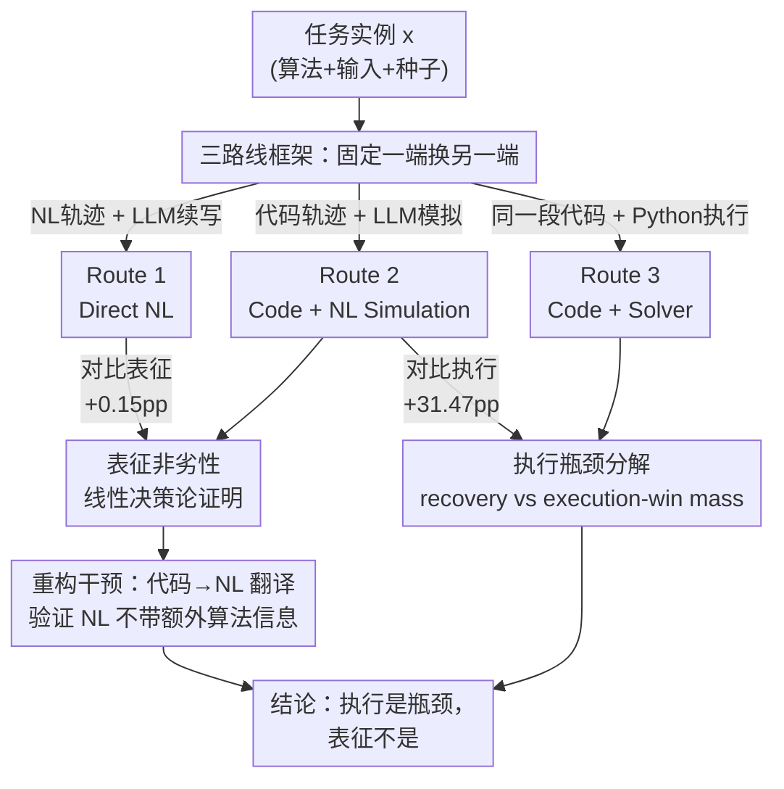

# Is Code Better Than Language for Algorithmic Reasoning?

**会议**: ICML2026  
**arXiv**: [2606.15589](https://arxiv.org/abs/2606.15589)  
**代码**: https://github.com/TerryTong-Git/ToolProj  
**领域**: LLM推理 / 神经符号 / 工具使用  
**关键词**: 算法推理, 工具使用, 代码生成, 决策论, 表征 vs 执行

## 一句话总结
作者用一个"三条路线"框架把工具增强 LLM 的两个被混淆的因素——推理表征（代码 vs 自然语言）和执行机制（LLM 模拟 vs 真实解释器）——干净地拆开，发现在 40 个可验证算法任务上，代码本身几乎不带来增益（+0.15pp），真正把准确率从 17% 抬到 49% 的是"可靠的外部执行"（+31.47pp），并用一个线性决策论模型证明了"代码表征不劣于自然语言"。

## 研究背景与动机
**领域现状**：很多 agentic 系统会把问题翻译成可执行代码、交给外部求解器跑（如 PAL、Faithful CoT），在逻辑和算法类复杂推理任务上常常显著超过端到端的自然语言（NL）链式思维。直觉上大家把这归功于"代码这种结构化表征更适合推理"。

**现有痛点**：这个对比其实是**病态的**。NL 路线和代码路线学的是两个不同的对象——NL 路线产出自然语言轨迹、由 LLM 自己续写出答案；代码路线产出程序、由 Python 运行时执行。两条路线**同时改变了两个变量**：中间表征（散文 vs 程序）和执行器（LLM 的一次前向 vs 确定性解释器）。所以观察到的性能差，到底来自"代码这个表征"还是"外部执行这件事"，根本分不清。

**核心矛盾**：缺一条"公共的中间路线"，就无法把表征和执行解耦。

**本文目标**：拆成两个可单独检验的子问题——(1) 把执行器固定成 LLM，只换表征（NL vs 代码），表征本身是不是瓶颈？(2) 把代码轨迹固定，只换执行器（LLM 模拟 vs Python），执行是不是瓶颈？

**切入角度**：作者构造一个**中间干预（intermediate intervention）**：让模型先写出可执行代码，但**不真跑**，而是让 LLM 在上下文里"假装自己是解释器"把这段代码模拟执行出答案。这样代码表征和 NL 表征就能在"同一个 LLM 执行器"下公平对比。

**核心 idea**：用"代码 + LLM 模拟执行"这条 Route 2 作桥梁，把表征效应和执行效应分离，从而判定到底是哪个因素在起作用。

## 方法详解

### 整体框架
作者把任意推理流水线建模成**两阶段随机过程**：轨迹生成器 $E:\mathcal{X}\to\Delta(\mathcal{Z})$ 把任务实例 $x$ 映成一条中间轨迹 $z$（NL 链式思维或一段程序），执行器 $\rho:\mathcal{X}\times\mathcal{Z}\to\Delta(\mathcal{Y})$ 再把轨迹消化成最终答案 $y$。评测用 0–1 损失 $\ell(y,x)=\mathbf{1}\{y\neq Y^*(x)\}$，所有任务答案唯一、可外部验证。

在这个 $(E,\rho)$ 抽象下，三条路线只是不同的组合：

整套实验的关键是"**一次只动一个阶段**"：比 Route 1 vs Route 2 时固定 LLM 执行器、只换表征；比 Route 2 vs Route 3 时固定代码轨迹、只换执行器。所有路线都用结构化 JSON 输出强约束采样，提示词被刻意控制得尽量一致（Route 2 只比 Route 1 多了"生成代码并模拟"的指令）。

### 关键设计

**1. 三路线框架：用 Route 2 当桥梁解耦表征与执行**

直接比"NL 端到端"和"代码 + 求解器"会同时混入表征和执行两个变量，这是全文要解决的根本病灶。作者的做法是插入一条中间路线 Route 2——代码作为轨迹模态，但执行仍留在模型内部：LLM 生成 `solution()` 程序后，**在自然语言里逐步模拟这段代码的执行**而非真跑。于是三条路线构成两组受控对比：Route 1（NL 轨迹 $Z_{NL}$ + 同一 LLM 执行）和 Route 2（代码轨迹 $Z_{Code}$ + 同一 LLM 模拟）**只差表征**；Route 2 和 Route 3（同一段 $Z_{Code}$ + Python 运行时 $\rho_{Exec}(y\mid x,z)=\mathbf{1}\{y=\mathrm{Exec}(x,z)\}$）**只差执行器**。这种"固定一端、只动另一端"的设计，正是因果干预里把混淆因子拆开的标准手法，让"代码到底好在哪"第一次变得可回答。

**2. 表征非劣性：线性决策论证明代码不比自然语言差**

要论证"表征不是瓶颈"，光有实验数字不够稳，作者补了一个可证明的线性模型。把每条路线的输入拆成 $S_r=(B,U_r)$：$B$ 是决定答案的**核心充分统计量**（递推式、边界条件、最终查询），$U_r$ 是**与答案无关的表面变化**（变量名、措辞、排版）。关键假设 4.1 把自然语言写成"代码侧噪声加额外释义噪声"：$U_N=U_C+\eta_N$，且各噪声在给定核心后均值为零、不偷偷携带答案信息（引理 4.1.1 保证 $\mathbb{E}[U_r\mid B]=0$、$\mathbb{E}[U_C\eta_N^\top\mid B]=0$）。

由此得到噪声协方差的 Loewner 序 $\Sigma_{U,C}\preceq\Sigma_{U,N}$（命题 4.2：$\Sigma_{U,N}-\Sigma_{U,C}=\mathbb{E}[\eta_N\eta_N^\top]\succeq 0$，交叉项消失）。代入线性假设类的平方损失，风险分解为 $R_r(h_{a,v})=R_{\text{core}}(a)+v^\top\Sigma_{U,r}v$，核心项与路线无关，于是

$$\sup_{h\in\mathcal{H}_{\rm lin}}\{R_C(h)-R_N(h)\}=\sup_{h}\,v^\top(\Sigma_{U,C}-\Sigma_{U,N})v\le 0.$$

直觉就是：自然语言的"额外废话"只是更多噪声维度，在有限样本下还会按 $\sigma^2\frac{p}{n-p-1}$ 增加拟合误差，但它**不是新的答案信息来源**。所以表征层面，代码至多与 NL 打平、不会更差——表征不可能是 Route 1 拖后腿的原因。

**3. 重构干预：把代码翻译回自然语言，验证 NL 不带额外算法信息**

线性证明在非线性、高维的真实 LLM 下会失效，作者用一个"重构实验"把结论搬到实证层面。对每个实例给目标模型三种输入：(1) Baseline 只给问题 $x$；(2) Native 给 $x\,\|\,z_{NL}$（原生 NL 轨迹）；(3) Translated 给 $x\,\|\,\hat z_{NL}$（把对应代码用固定变换翻译成的 NL 轨迹）。若 NL 真的携带代码没有的算法信息，应当看到 $\mathrm{Acc}(x\|\hat z_{NL})<\mathrm{Acc}(x\|z_{NL})$。结果是两者置信区间高度重叠、无法拒绝相等假设（拼接轨迹相比纯问题 baseline 都显著涨点，说明模型确实在用轨迹）。这等于说：从代码翻译出来的 NL 和原生 NL 在下游功能上几乎一样，NL 链式思维并没有引入超出代码之外的算法策略。这条干预是把"代码是充分的决策信息"这个假设直接拿去证伪而没证伪成功。

**4. 执行瓶颈分解：用 recovery / execution-win mass 定位真正的增益来源**

排除表征后，剩下的 31pp 差距落在执行器上。作者定义"代码正确事件" $C=\{g(X,Z_C)=Y^*(X)\}$，并把 Route 2 与 Route 3 的胜负拆成两块**互补质量**：**recovery mass**（Route 2 成功而 Route 3 失败的占比 = 1.61%，即 LLM 模拟反而救回了代码本身跑错的情形）和 **execution-win mass**（Route 3 成功而 Route 2 失败 = 33.08%，即代码正确但 LLM 模拟算错）。两者悬殊说明：一旦代码写对，LLM 自己"心算"执行极不可靠，而把执行交给确定性解释器才是 31pp 增益的真正来源。再叠加难度扫描（用 $\tau$ 控制算术位数 / DP 表维度 / 整数规划约束矩阵维度），随着任务变难，语言类路线快速退化、Route 3 始终保持高位，进一步坐实"执行是瓶颈"。

### 损失函数 / 训练策略
本文不训练模型，全部是推理期评测。统计上用 McNemar 配对检验比较路线、用 cluster bootstrap 估 95% 置信区间、用 Holm–Bonferroni 控制族错误率，并拟合带 logit 链接的广义线性混合效应模型（GLMM）$\mathrm{logit}(p_i)=\alpha+\beta_{\text{route}_i}+\gamma\tau_i+\delta_{\text{route}_i}\tau_i+u_{\text{inst}}+u_{\text{seed}}$ 来刻画难度与路线的交互。

## 实验关键数据

### 主实验
评测集：40 个任务，取自 CLRS-30、NP-Hard-Eval 和一套自建细粒度套件，共 1,113 个唯一实例、3 个种子、6 个模型，合计 20,034 次配对评测。任务涵盖算术、动态规划、图算法、字符串、几何、排序、NP 难优化。

| 路线 | 表征 / 执行 | 准确率 | 与上一路线配对差 | 95% CI |
|------|-------------|--------|------------------|--------|
| Route 1 | NL 轨迹 + LLM 续写 | 17.21% | — | — |
| Route 2 | 代码轨迹 + LLM 模拟 | 17.37% | +0.15pp（vs R1） | [−0.30, +0.61] |
| Route 3 | 代码轨迹 + Python 执行 | 48.84% | +31.47pp（vs R2） | [+29.20, +33.71] |

Route 1 vs Route 2 的 McNemar $p=0.39$，不显著——表征换成代码几乎不带来增益；Route 3 则压倒性领先。

### 消融 / 分析实验

| 分析 | 关键指标 | 含义 |
|------|---------|------|
| Route 2 vs Route 3：recovery mass | 1.61% | LLM 模拟成功、Python 失败（代码本身错）的极小占比 |
| Route 2 vs Route 3：execution-win mass | 33.08% | 代码正确、但 LLM 模拟算错的大占比 → 执行不可靠 |
| 重构干预（Translated vs Native NL） | CI 重叠、无法拒绝相等 | 代码翻译出的 NL 与原生 NL 下游功能一致 |
| 难度扫描（$\tau$ 增大） | Route 3 始终高位、语言路线退化 | 任务越难，执行优势越明显 |

### 关键发现
- **表征不是瓶颈**：把 NL 换成代码（Route 1→2）几乎零增益（+0.15pp），且代码翻回 NL 不掉点，线性理论也证明代码风险非劣。
- **执行才是瓶颈**：31pp 增益几乎全部来自把执行交给确定性解释器；LLM"心算"代码极不可靠（execution-win mass 33% vs recovery mass 1.6%）。
- **难度越大、执行优势越大**：语言类路线随任务变难快速退化，外部执行则稳健外推。

## 亮点与洞察
- **中间干预这一手非常漂亮**：用"代码 + LLM 模拟"这条本来没人用的 Route 2，把一个长期被混为一谈的对比拆成两组单变量受控实验，方法论价值高于具体数字。
- **理论与实验互为印证**：线性决策论给出"代码表征非劣"的可证明边界，重构干预再在真实 LLM 上验证同一结论，论证链条比单纯刷 benchmark 扎实得多。
- **对 agent 设计的直接启示**：与其追求"更结构化的提示/表征"，不如把能外部验证的子任务尽量 offload 给确定性工具——增益来自可靠执行，而非让模型"用代码的口吻思考"。
- **recovery / execution-win mass 这种互补质量分解**可迁移到任何"生成器 + 执行器"两阶段系统，用来定位失败到底出在生成还是执行。

## 局限与展望
- **结论限定在可验证的算法任务**：答案唯一、可外部跑通是前提；对开放式、无确定性求解器的推理（如常识、规划、写作）是否成立未知。
- **"代码模拟"依赖提示**：作者也承认翻译/模拟结果对提示词很敏感，Route 2 的"忠实模拟"程度难以完全保证。
- **线性理论的假设较强**：把 NL 建模成"代码噪声 + 额外释义噪声"是理想化，真实分布里 NL 是否真不携带额外算法信息只能靠实证近似。
- **可改进**：把框架推广到"部分可执行"任务（代码只能解决子步骤）、或量化"什么样的任务最该外包给求解器"，会更有指导意义。

## 相关工作与启发
- **vs PAL / Faithful CoT（代码 + 求解器）**：它们直接比 Route 1 vs Route 3 并把增益归给"代码表征 + 执行"的整体，本文用 Route 2 拆开，指出增益几乎全来自执行而非代码表征。
- **vs 标准 NL 链式思维（CoT）**：本文证明在算法任务上，NL CoT 相对代码并不引入新的算法策略；表征换汤不换药，关键在能否可靠执行。
- **vs 软件自然性（naturalness of software）研究**：借用了"代码是语法更受限、规律更强的统计对象"这一观点来支撑"代码噪声协方差更小"的假设。

## 评分
- 新颖性: ⭐⭐⭐⭐⭐ 用中间干预把表征与执行干净解耦，问题设定本身就很巧
- 实验充分度: ⭐⭐⭐⭐ 6 模型 40 任务 2 万次配对评测 + 严谨统计，但限于可验证算法任务
- 写作质量: ⭐⭐⭐⭐⭐ 理论与实验环环相扣，论证链条清晰
- 价值: ⭐⭐⭐⭐⭐ 给"工具增益从哪来"一个可证伪的答案，对 agent / 工具使用设计有直接指导

<!-- RELATED:START -->

## 相关论文

- [\[ACL 2025\] Self-Correction is More than Refinement: A Learning Framework for Visual and Language Reasoning Tasks](../../ACL2025/llm_reasoning/self-correction_is_more_than_refinement_a_learning_framework_for_visual_and_lang.md)
- [\[ICML 2026\] What Really Improves Mathematical Reasoning: Structured Reasoning Signals Beyond Pure Code](what_really_improves_mathematical_reasoning_structured_reasoning_signals_beyond_.md)
- [\[ICML 2026\] When the Chain of Thought Knows Better: Failure Modes in Multi-Turn Reasoning Models](when_the_chain_of_thought_knows_better_failure_modes_in_multi-turn_reasoning_mod.md)
- [\[NeurIPS 2025\] Many LLMs Are More Utilitarian Than One](../../NeurIPS2025/llm_reasoning/many_llms_are_more_utilitarian_than_one.md)
- [\[ICML 2025\] DyCodeEval: Dynamic Benchmarking of Reasoning Capabilities in Code Large Language Models Under Data Contamination](../../ICML2025/llm_reasoning/dynamic_benchmarking_of_reasoning_capabilities_in_code_large_language_models_und.md)

<!-- RELATED:END -->
