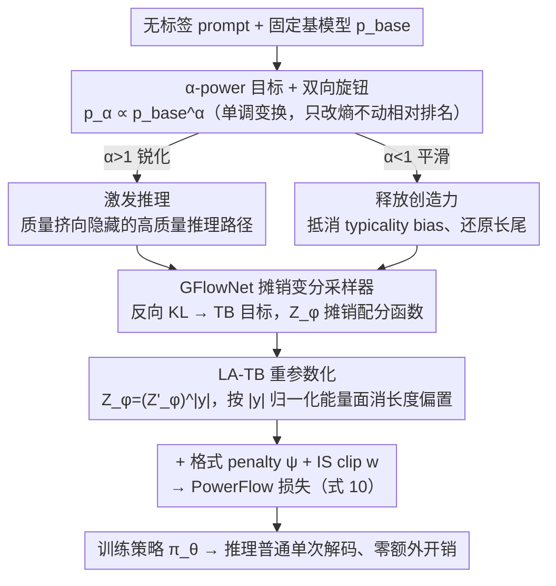

# PowerFlow: Unlocking the Dual Nature of LLMs via Principled Distribution Matching

**会议**: ICML 2026  
**arXiv**: [2603.18363](https://arxiv.org/abs/2603.18363)  
**代码**: https://github.com/Chenruishuo/PowerFlow (有)  
**领域**: LLM推理 / 无监督微调 / 分布匹配  
**关键词**: RLIF, GFlowNet, α-power 分布, 长度偏置, 创造性

## 一句话总结
本文把无监督 LLM 微调重新表述为"匹配基模型 $\alpha$-power 分布"的问题，用 GFlowNet 的 Trajectory-Balance 目标作为摊销采样器，并通过长度感知的 LA-TB 重参数化消除自回归生成中的结构性长度偏置；同一个旋钮 $\alpha$ 控制方向——$\alpha>1$ 锐化分布激发推理（媲美或超过有监督 GRPO），$\alpha<1$ 平滑分布释放对齐模型被压制的创造力，在 Pareto 前沿上同时拉高质量与多样性。

## 研究背景与动机
**领域现状**：当前从 LLM 中"挖潜"主要靠两类做法。一类是 RLVR（DeepSeek-R1、GRPO）用可验证奖励驱动后训练；另一类是 RLIF（Intuitor、EMPO、TTRL）用内部信号（自一致性、token 熵、多数投票）作为内在奖励，号称无需外部标签即可激发推理。

**现有痛点**：RLIF 的奖励都是手工启发式拼出来的，缺乏统一理论目标，因此训练中频繁出现病态行为：长度坍缩或长度爆炸（Intuitor、majority voting 都被报告过）、模式坍塌、过度自信、majority-voting reward hacking。研究者只能事后"打补丁"，而无法事先解释为什么该这么设奖励。

**核心矛盾**：最近一系列工作把 RL post-training 的收益归结为"分布锐化"——把概率质量重新集中到基模型已有的好路径上。换言之，RLIF 本质上是在隐式地锐化分布，但既有方法没有一个明确的"我要把分布变成什么形状"的目标，于是奖励里所有的偏置（包括对长度的偏置）都会被无脑放大。同时，对已经对齐过的模型，过度锐化又会扼杀创造力——这是 typicality bias 的另一面。

**本文目标**：找到一个**有原则的目标分布**，让锐化或平滑都能由一个可控参数指挥；再设计一个能直接优化这个目标、并且不被长度偏置毒化的训练算法。

**切入角度**：作者选 $\alpha$-power（escort）分布作为目标：$p_\alpha(y|q) \propto p_{\text{base}}(y|q)^\alpha$。这个分布在统计力学里非常经典，关键性质是**单调变换**——它会改变熵，但严格保留基模型的相对概率排名和多模态结构。$\alpha>1$ 把质量挤向高概率模式（推理），$\alpha<1$ 把质量推向长尾（创造）。这恰好对应 LLM 的"双重属性"。

**核心 idea**：用 GFlowNet 把"匹配 $\alpha$-power 分布"摊销成一个 on-policy 训练目标；再把 GFlowNet 标准的 prompt-级配分函数 $Z_\phi(q)$ 重参数化为 token-级的 $(Z'_\phi(q))^{|y|}$，让梯度在不同长度的轨迹上保持尺度不变，从而真正消除长度偏置。

## 方法详解

### 整体框架
PowerFlow 把无监督微调形式化成"让策略去匹配基模型的 $\alpha$-power 分布"这一个目标，然后用 GFlowNet 把它变成一个能直接优化、又不被长度偏置毒化的训练损失。给定一个无标签 prompt 数据集 $\mathcal{D}$、一个固定的基模型 $p_{\text{base}}$、一个用户指定的 $\alpha$，它训练出策略 $\pi_\theta$，使其分布近似 $p_{\text{base}}^\alpha$ 的长度归一化版本。整条链路是：先把目标写成"对 $\alpha$-power 分布做反向 KL 最小化"，再用 Trajectory-Balance 目标把里面不可解的配分函数摊销成一个可学习模块 $Z_\phi$，最后用 LA-TB 重参数化把长度偏置彻底消掉、并配一个格式 penalty 保证 instruction-following。推理时就是普通单次解码、零额外开销，这点比 PowerSampling 那种推理期跑 MCMC 的方案省得多。

### 关键设计

**1. $\alpha$-power 目标 + 双向旋钮：用一个标量同时管"激发推理"和"释放创造力"**

RLIF 此前的奖励全是手工拼的——想激发推理设一种、想要多样性设另一种，彼此割裂还没有理论保证。PowerFlow 把两件事收进同一个目标分布 $p_\alpha(y|q) = p_{\text{base}}(y|q)^\alpha / Z(q,\alpha)$。幂运算是单调变换，所以它只改熵、不动基模型的相对概率排名和多模态结构，这正是相对 RLHF/GRPO 这类外部奖励方法的关键差别（后者会把质量"漂"出基模型的支撑集）。$\alpha>1$ 时分布被锐化，配合"verification-generation asymmetry"假设（验证比生成容易、模型存在 hidden knowledge），质量被推向隐藏的正确路径；$\alpha<1$ 时分布被平滑，而一个被 RLHF 对齐过的模型相当于已经处在 reference 模型的 $\alpha>1$ power 分布上，再 flatten 一下恰好抵消 typicality bias、把被埋掉的长尾创造路径还原出来。论文进一步证明（Theorem F.1）经验上 work 的 majority-voting RLIF 其实就是 $\alpha$-power 在 $\alpha \to \infty$ 的极限，于是 PowerFlow 成了它的广义形式。

**2. GFlowNet 作为摊销变分采样器：把分布匹配变成一个能算的 on-policy 目标**

直接最小化反向 KL 会撞上配分函数 $Z(q)$ 不可解的墙。把 KL 展开成 $\mathbb{D}_{\text{KL}}(\pi_\theta \| p_{\text{target}}) = \mathbb{E}_{y\sim\pi_\theta}[\log \pi_\theta(y|q) / \tilde{p}_{\text{target}}(y|q)] + \log Z(q)$ 后，末项与 $\theta$ 无关，于是真正要优化的只剩前半截。Zimmermann et al. (2023) 已证明 GFlowNet 的 Trajectory-Balance 损失就是这个 KL 的变分代理；而 LLM 自回归生成天然是树状 DAG，反向策略退化为 $P_B \equiv 1$，TB 损失因此简化成 $\mathcal{L}_{\text{TB}} = (\log Z_\phi(q) + \sum_t \log \pi_\theta(y_t|y_{<t},q) - \log \tilde{p}_{\text{target}}(y|q))^2$。它的梯度恰好等于 $2\nabla_\theta \mathbb{D}_{\text{KL}}(P_F \| p_{\text{target}})$，所以最小化它就是在做严格的分布匹配。和 PPO/GRPO 那种 policy-gradient + KL-penalty 不同，GFlowNet 不需要奖励模型就能精确匹配任意未归一化密度，而那个可学习的 $Z_\phi$ 把配分函数估计摊销掉、大幅压低了梯度方差。

**3. Length-Aware TB 重参数化（LA-TB）：把长度偏置从配分函数里连根拔掉**

自回归 log-prob 跟序列长度近似线性，所以任何 prompt 级的标量配分函数都会让能量随长度漂移——锐化时模型挑短路径走、短序列坍缩，平滑时模型灌重复 token 把平均能量拉低、长度爆炸。LA-TB 的做法是把配分函数本身改成长度感知形式 $Z_\phi(q,y) = (Z'_\phi(q))^{|y|}$，再把整个 log-mismatch 除以 $|y|$，得到 $\mathcal{L}_{\text{LA-TB}} = (\log Z'_\phi(q) + \tfrac{1}{|y|}\log(\pi_\theta(y|q)/\tilde{p}_{\text{target}}(y|q)))^2$。它的收敛点是 $\pi^*(y|q) \propto \tilde{p}_{\text{target}}(y|q) \cdot e^{-\lambda_q |y|}$，正好是对长度的一维指数 tilt。论文给了两条保证：Prop 3.2 说 LA-TB 是在给定期望长度约束下 $\tilde{p}_{\text{target}}$ 的 I-projection，即所有长度校准分布里离理想目标 KL 最近的那个；Prop 3.3 说全局 KL 失真只有 $\tfrac{1}{2}\lambda_q^2 \text{Var}_{\tilde{p}_{\text{target}}}(|y|) + O(|\lambda_q|^3)$，是 $\lambda_q$ 的二阶小量。再叠上格式 penalty $\psi(y)$（缺 \boxed{} 罚 -0.5）和 PPO 风格的 importance ratio clipping 就构成完整目标。效果上，trajectory 级 TB/RL 直接训几步就长度坍缩、token 级简单平均又会被重复 token 钻空子先升后崩，唯独 LA-TB 既消了长度偏置又不破坏语义——在 Qwen2.5-Math-1.5B 上测得 pair-wise 反演率仅 0.09，即 91% 的 $\alpha$-power 排序被保留。

### 损失函数 / 训练策略
最终目标见公式 (10)：

$$\mathcal{L}_{\text{PowerFlow}} = w \cdot \left(\log Z'_\phi(q) + \tfrac{1}{|y|}\log\pi_\theta(y|q) - \alpha\left[\tfrac{1}{|y|}\log p_{\text{base}}(y|q) + \psi(y)\right]\right)^2$$

其中 $w$ 是 detach 的 clipped IS ratio（off-policy 兼容）。推理任务默认 $\alpha=4$（base 模型）或 $\alpha=2$（instruct 模型，因为已经被对齐锐化过），创造性任务用 $\alpha=0.5$。训练数据：18k NuminaMath-CoT queries（推理）/ 300 个 prompt（创造性，来自 PoemHunter、BookMIA、Reddit r/DadJokes）。Recipe 沿用 EMPO，便于和 EMPO 公平比较。

## 实验关键数据

### 主实验
在多种 model size × 多种 benchmark 上对比 RLIF 基线和有监督 GRPO（数字为 avg@16，单位 %）：

| 模型 | 方法 | MATH500 | AIME25 | AMC23 | Average |
|------|------|---------|--------|-------|---------|
| Qwen2.5-1.5B | Intuitor | 47.4 | 0.8 | 22.3 | 18.95 |
| Qwen2.5-1.5B | **PowerFlow** | **49.3** | **1.5** | **23.8** | **19.85** |
| Qwen2.5-1.5B | GRPO (sup) | 45.4 | 0.4 | 21.9 | 18.13 |
| Qwen2.5-Math-1.5B | EMPO | 69.9 | 4.6 | 46.2 | 32.45 |
| Qwen2.5-Math-1.5B | **PowerFlow** | **70.9** | **10.0** | **53.3** | **34.30** |
| Qwen2.5-Math-1.5B | GRPO (sup) | 71.4 | 6.7 | 49.5 | 32.75 |
| Qwen2.5-Math-7B | EMPO | 79.3 | 12.3 | 60.2 | 40.88 |
| Qwen2.5-Math-7B | **PowerFlow** | 78.1 | **14.4** | **63.4** | **42.17** |
| Qwen2.5-Math-7B | GRPO (sup) | 78.4 | 12.9 | 63.4 | 42.38 |

PowerFlow 在 Qwen2.5-1.5B、Qwen2.5-Math-1.5B、Llama-3.2-3B-Instruct 三种配置上**超过了有监督 GRPO**（差距 > 1σ），在 Qwen2.5-Math-7B 上打平。

### 消融 / 训练稳定性分析
Figure 3 比较了 4 种"消除长度偏置"策略的训练曲线：

| 配置 | 行为 | 说明 |
|------|------|------|
| TB-traj / RL-traj | 立刻长度坍缩 | 直接匹配 trajectory 级 $\alpha$-power，模型挑短路径走 |
| TB-token / RL-token | 先涨后崩 | 平均 token log-prob 启发式，模型用重复 token 钻空子 |
| **LA-TB / PowerFlow** | **持续稳定上升** | 长度归一化能量面 + 单调收敛 |

创造性任务（Figure 5）：PowerFlow ($\alpha=0.5$) 是所有方法里**唯一同时提升 quality 和 semantic diversity** 的方法；High-temp 提升多样性但掉质量；VS-Standard 在 ≤7B 模型上反而掉质量。

### 关键发现
- LA-TB 是**长度偏置的根治方案**：直接做 trajectory 匹配几步就崩，加 token 级平均能短暂 work 但终将被 reward hacking 掉，只有把配分函数本身改成长度感知才能稳。
- PowerFlow 不仅打平 GRPO，**还保留了更高的解题路径多样性**：AIME24/25 上 PowerFlow diversity score 4.05，高于 GRPO 3.93 和 EMPO 3.80。无监督锐化反而比有监督奖励微调更不"模式坍塌"。
- 对 instruct 模型用 $\alpha=2$ 而非 $\alpha=4$ 更优——说明对齐过程本身已经把模型锐化了一轮，再叠加同样幅度反而过头。这给"对齐 = 隐式 $\alpha>1$ 锐化"假说提供了直接经验证据。

## 亮点与洞察
- **把 RLIF 的所有奖励看成同一个 $\alpha$-power 目标的近似**，是一个非常优雅的理论统一：majority voting 是 $\alpha \to \infty$ 极限，token 熵/自一致性都是对幂分布的不同近似。这把一堆看起来八竿子打不着的方法收进同一个理论框架。
- **长度偏置 = 自回归 log-prob 与长度近似线性**，所以任何 prompt 级标量配分函数都注定打不过梯度方差；用 $(Z'_\phi)^{|y|}$ 显式地把维度配上长度，这个 trick 简单到让人怀疑为什么这么晚才有人做。可以迁移到任何 GFlowNet × 自回归生成的场景，比如分子串、代码生成。
- **同一个机制同时解释"为什么锐化能涨推理"和"为什么对齐杀创造力"**——前者是把质量推到 hidden good modes，后者是把质量推过头压坏了长尾。$\alpha$ 旋钮把这两件事变成连续谱。
- **无监督方法打过有监督 GRPO** 是一个很强的信号：现在 RL post-training 的收益主要来自"重塑分布形状"而不是"灌输新知识"，这对未来"少标注、多形状工程"路线很有启发。

## 局限与展望
- 作者承认 $\alpha$ 当前是手调（base 用 4，instruct 用 2，creative 用 0.5），不同模型的最优 $\alpha$ 应跟其 intrinsic entropy 相关，自动 schedule 留给 future work。
- LA-TB 的目标分布严格说不是 $\alpha$-power 本身，而是一个 length-tilt 后的版本；论文证明 KL 偏离是 $O(\lambda_q^2)$ 二阶小量，但极端长度差距大的任务可能不够。
- 实验里 RLIF 基线（Intuitor、EMPO、TTRL）用的是官方 checkpoint，没在统一配方下重训，公平性略受影响（作者在 Appendix G 解释是算力问题）。
- Impact statement 提到的风险很实在：$\alpha<1$ 可能复活被 RLHF 抹掉的不安全长尾，部署需要叠加 safety guardrail。
- 改进思路：把 $\alpha$ 做成 per-prompt 自适应（按当前 prompt 的 entropy 自动调）；探索非幂的目标分布族（如温度退火 schedule、多 mode 重加权）；与 RLVR 混合，把可验证奖励叠加在 $\alpha$-power 之上。

## 相关工作与启发
- **vs Intuitor / EMPO / TTRL**: 这些都是手工设计内在奖励的 RLIF；PowerFlow 把它们解释成对同一个 $\alpha$-power 目标的隐式近似，并提供严格优化目标。在所有规模上 PowerFlow 平均更优。
- **vs PowerSampling (Karan & Du, 2025)**: 同样目标分布，但用 MCMC 在推理时采样，推理成本巨大；PowerFlow 把成本摊销到训练里，推理是普通单次解码。
- **vs GRPO**: GRPO 需要可验证奖励（answer 检查），PowerFlow 完全无监督；推理任务上 PowerFlow 在多数配置追平甚至反超 GRPO，且解题路径更多样。
- **vs Verbalized Sampling (Zhang et al. 2025b)**: VS 通过 prompt 工程激发多样性，依赖强 instruction-following；PowerFlow 直接动分布，对小模型也有效。
- **vs 标准 GFlowNet (Malkin et al. 2022)**: 标准 GFlowNet 在 LLM 上必然遭遇长度偏置；LA-TB 是把 GFlowNet 真正用上 LLM 的关键工程化贡献。

## 评分
- 新颖性: ⭐⭐⭐⭐⭐ 把 RLIF 统一为 $\alpha$-power 分布匹配 + LA-TB 长度重参数化，是非常干净的理论叙事
- 实验充分度: ⭐⭐⭐⭐ 覆盖 4 个模型族 × 6 个推理 benchmark + 创造性任务，但缺自适应 $\alpha$ 的探索
- 写作质量: ⭐⭐⭐⭐⭐ 故事讲得极清楚，从 RLIF 现状一路推到 $\alpha$-power 再到 LA-TB，每步都有 motivation
- 价值: ⭐⭐⭐⭐⭐ "无监督做赢有监督 GRPO" 是当前 RL post-training 思想转向（形状工程 > 知识灌注）的强力证据，框架易于复用

<!-- RELATED:START -->

## 相关论文

- [\[NeurIPS 2025\] Is Chain-of-Thought Reasoning of LLMs a Mirage? A Data Distribution Lens](../../NeurIPS2025/llm_reasoning/is_chain-of-thought_reasoning_of_llms_a_mirage_a_data_distribution_lens.md)
- [\[ICLR 2026\] String Seed of Thought: Prompting LLMs for Distribution-Faithful and Diverse Generation](../../ICLR2026/llm_reasoning/string_seed_of_thought_prompting_llms_for_distribution-faithful_and_diverse_gene.md)
- [\[ICML 2026\] Are Tools Always Beneficial? Learning to Invoke Tools Adaptively for Dual-Mode Multimodal LLM Reasoning](are_tools_always_beneficial_learning_to_invoke_tools_adaptively_for_dual-mode_mu.md)
- [\[ICML 2026\] Evaluating Relational Reasoning in LLMs with REL](evaluating_relational_reasoning_in_llms_with_rel.md)
- [\[ICML 2026\] Select to Think: Unlocking SLM Potential with Local Sufficiency](select_to_think_unlocking_slm_potential_with_local_sufficiency.md)

<!-- RELATED:END -->
