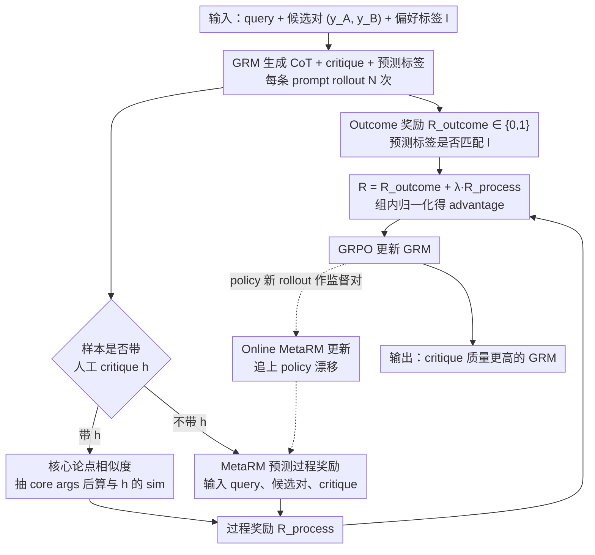

# Reward Modeling from Natural Language Human Feedback

**会议**: ICML 2026  
**arXiv**: [2601.07349](https://arxiv.org/abs/2601.07349)  
**代码**: 未公开  
**领域**: LLM 对齐 / 奖励建模 / RLHF  
**关键词**: 生成式奖励模型 (GRM)、过程奖励、自然语言反馈、MetaRM、GRPO

## 一句话总结
本文指出在二元偏好奖励上训练的 generative reward model (GRM) 严重存在"猜对偏好但 critique 错误"的 outcome-process 不一致（20-30%、最高 44%），并提出 RM-NLHF：把模型 critique 与人工 critique 的核心论点相似度作为额外过程奖励，并用 MetaRM 自动预测过程奖励、在线随策略更新，从而在多个 benchmark 上稳定超过 outcome-only GRPO 训练的 SOTA GRM。

## 研究背景与动机

**领域现状**：生成式奖励模型 (GRM) 因为能输出 critique + preference label，比传统 scalar RM 更鲁棒、可解释，是当前 LLM 对齐与 RLHF 的主流。训练上以 RLVR + GRPO 为主：让模型对一对回答生成 reasoning + critique，最后给出 A/B label，binary 奖励 $R_{\text{outcome}}\in\{0,1\}$ 来自 label 是否匹配 ground truth。

**现有痛点**：作者在 MATH-500（数学，大解空间）和 HelpSteer3（pairwise 奖励，二元解空间）上做对照实验。数学任务上 outcome 对 ⇒ process 几乎也对，几乎无不一致；而 pairwise rewarding 上，RM-R1-DeepSeek-Distilled-Qwen-7B 有 44.24% 的"outcome 对 / critique 错"率，gemini-2.5-pro 26.1%，claude-3.7-sonnet 33.6%。这种"猜对 label 不靠正确 critique"的现象注入大量伪奖励，让 RL 收敛到生成 wrong critique 的 policy。

**核心矛盾**：解空间大小决定了 outcome 监督的可靠性。数学题答案空间巨大（"答案 42"几乎必然走对推理），而二元偏好任务解空间只有 {A, B}，瞎猜也有 50% 命中率，outcome 信号噪声极大。但二元判定形式无法像数学那样被改写成 fill-in-the-blank 扩大解空间。

**本文目标**：在不改 pairwise 任务结构的前提下，给 GRM 补一份可信的 process 奖励，让 critique 质量直接进入训练 loop；同时解决"人工 critique 数据稀缺"的可扩展性瓶颈。

**切入角度**：人类对一对回答给出的自然语言反馈（critique）天然就是 process supervision——模型 critique 与人工 critique 的核心论点重合度，恰好就是 critique 是否合理的最直接代理；此外可以再训一个 MetaRM 让人工 critique 数据"长出"伪 critique 数据。

**核心 idea**：用 "GRM critique 与人工 critique 在核心论点上的相似度" 作为过程奖励，与 outcome 奖励叠加进入 GRPO；再用 MetaRM 把这个奖励信号从少量人工数据外推到无标注数据，并在 RL 训练中在线更新 MetaRM 以追上 policy 漂移。

## 方法详解

### 整体框架
RM-NLHF 想给二元偏好任务上的 GRM 补一份"critique 到底对不对"的过程奖励，又不想被人工 critique 数据稀缺卡死。基线仍是 GRPO：query $q$ 配一对候选 $y_A, y_B$ 和偏好标签 $l\in\{A,B\}$，GRM $\pi_\theta$ 生成 CoT + critique + 预测 $\hat l$，每条 prompt rollout $N$ 次得到 outcome 奖励 $R_{\text{outcome}}^i$ 后组内归一化成 advantage $\hat A_i$。在此之上接一路 process 奖励：带人工 critique $h$ 的数据直接算模型 critique $\hat c$ 与 $h$ 的核心论点相似度，没有 $h$ 的数据交给一个辅助模型 MetaRM 预测，而 MetaRM 又在训练全程随 policy 在线更新，使最终 advantage 由 outcome 与 process 两路奖励共同决定。

### 关键设计

**1. 核心论点相似度（Similarity w/ Core HC）：把"critique 合不合理"压成一个能机算的数值奖励**

outcome-only 监督在二元任务上根本不可靠（瞎猜也有 50% 命中），所以必须显式衡量 critique 质量，但最直白的"让 LLM 直接判 $\hat c$ 对不对"会受 judge bias 和表达风格干扰，"逐条比对全部论点"又容易被 nitpicky 的挑刺式 critique 拉低分数。作者的做法是先用一个外部强 LLM（gemini-2.5-pro）从人工 critique $h$ 和模型 critique $\hat c$ 里分别抽出 core arguments（剔掉细枝末节），再算两者核心论点的相似度作为过程奖励 $R_{\text{process}}=\text{sim}(\text{core}(h), \text{core}(\hat c))$，并尝试 F1/Recall/Precision 三种变体。在 49 样本人工标注子集上对照，只用 Core HC 相似度最贴近人工 label——它既保留了语义级判断，又把 nitpicky 噪声筛掉；而且它输出的是单个数值，天然兼容 RLVR 的 verifier 框架，可以直接和 $R_{\text{outcome}}$ 加权进入 GRPO 的 advantage 归一化，不用改 loss。

**2. MetaRM：用少量人工 critique 把过程监督外推到全量数据**

人工 critique 标注极贵（连 HelpSteer3 也只有部分样本带 critique），而 UltraFeedback、HelpSteer 系列等主流 preference 数据集大多只有 outcome label，光靠几万条带 critique 的数据训，规模上根本干不过 outcome-only RL。为此作者训一个辅助模型 MetaRM，输入 $(q, y_A, y_B, \hat c)$，输出对该 critique 的过程奖励估计；它在带人工 critique 的子集上训练，拟合"$\hat c$ 与 $h$ 的 core similarity"，推理时直接给无 critique 的数据打分。等于把"critique 评估能力"蒸馏进一个轻量模型，让仅有 outcome label 的大盘数据也能获得过程监督。

**3. Online MetaRM：让奖励模型随 GRM 同步演化，堵住 reward hacking**

经典 RLHF 的老毛病是奖励模型一旦遇上 policy 漂移后的新分布就失效，static MetaRM 同样会被 reward hacking。作者把训练改成 GRM 与 MetaRM 交替更新：GRM 走一步 GRPO → 当前 policy 在新一批 prompt 上 rollout 出一批 $\hat c$ → 在带 critique 子集上用这些 $\hat c$ 与 ground-truth $h$ 组成监督对、给 MetaRM 更新一步 → 再回到 GRM。这样 MetaRM 始终盯着当前 policy 的真实输出分布，规避 Goodhart 问题；实验里 online MetaRM 能逼近"全人工 critique 监督"的上限，同时把标注需求压到很低。

### 损失函数 / 训练策略
基础是 GRPO（公式 1-3）：组内归一化的 advantage $\hat A_i=(R_i-\bar R)/\sigma$，policy 用 clipped policy gradient + KL 正则更新。RM-NLHF 把奖励替换为 $R = R_{\text{outcome}} + \lambda \cdot R_{\text{process}}$，process 奖励来自 Core HC similarity 或 MetaRM 预测。Online MetaRM 用 MSE 或排序 loss 监督，每 $k$ 个 GRPO 步骤更新一次。MetaRM 与 GRM 共享 backbone 但加独立 head（论文给出对比，全独立模型也可行但更贵）。

## 实验关键数据

### 主实验
在 HelpSteer3、RewardBench、PandaLM 等多个 benchmark 上对比，base GRM 包括 RM-R1 系列、Qwen 自研 GRM、闭源 gemini/claude。

| 训练范式 | Critique 质量 (核心论点 F1) | Outcome 准确率 | 备注 |
|----------|----------------------------|----------------|------|
| Outcome-only GRPO (SOTA baseline) | 较低 | 高但 outcome-process 不一致 20–44% | 主流做法 |
| RM-NLHF + 全人工 critique | 最高 | 显著提升 | 上限对照 |
| RM-NLHF + Offline MetaRM | 接近全人工 critique | 显著高于 outcome-only | 节省标注 |
| **RM-NLHF + Online MetaRM** | 最接近全人工 critique 上限 | 显著高于 outcome-only | 实用最优 |

### 消融实验（过程奖励选型，49 样本人工标注子集）

| 过程奖励方案 | 与人工 label 准确率 |
|--------------|---------------------|
| LLM-as-a-Meta-Judge (直接判) | 较低 |
| Similarity w/ All HC (F1) | 中等 |
| Similarity w/ All HC (Recall) | 中等偏低 |
| Similarity w/ All HC (Precision) | 中等 |
| **Similarity w/ Core HC** | 最高 |

### 关键发现
- 数学任务 outcome ⇒ process 几乎 100% 对应；pairwise 任务上即便 SOTA GRM 也有 20–44% outcome-process 不一致，说明 outcome-only 监督在二元任务上根本性不可靠。
- "Core HC similarity" 一致显著优于 "All HC" 和 "LLM 直接判"——说明去掉 nitpicky critique 是 process reward 设计的关键。
- Online MetaRM 在大幅减少人工 critique 标注的前提下，效果接近全人工 critique 监督；offline MetaRM 因分布漂移性能稍差。
- 即便 outcome 准确率提升不大，critique 质量大幅提升 → GRM 在下游 RLHF 中作为 reward provider 时收益更显著，因为下游 policy 接收的是 critique 信号而不仅是 label。

## 亮点与洞察
- **outcome-process 不一致的清晰诊断**：把"为什么 GRM 容易猜"这件事用解空间大小这个简洁理论框架解释——大解空间任务 outcome 自带 process verification，小解空间任务必须显式补 process supervision。
- **"Core argument similarity" 作为 process reward**：避免对 nitpicky critique 过度敏感，是 critique-based reward 设计的关键洞察，可直接被复用到 LLM judge、QA 评估等。
- **Online MetaRM 解 reward model 漂移**：把 RLHF 经典 Goodhart 问题落到一个具体可执行的工程协议（policy update → MetaRM update 交替），思路非常 actionable。
- **极少量人工 critique 即可**：用 49 样本验证 proxy 选型 + 用部分子集训 MetaRM，是 cost-efficient alignment 的典范设计。

## 局限与展望
- 过程奖励的"似然 = 正确"假设并不严格成立：与人工 critique 写法风格高度相关的模型可能拿到虚高奖励。
- Core HC 抽取依赖外部强 LLM（gemini-2.5-pro），引入额外成本和潜在偏见；自蒸馏成 MetaRM 后偏见可能放大。
- 在线 MetaRM 增加训练复杂度（双模型交替）和 wall-clock 成本，未给出具体训练效率分析。
- 仅在 pairwise rewarding 任务上验证；listwise、scalar reward 任务上未检验是否仍存在解空间偏差。
- 缺乏与 verifier-based RL（如 RM-R1 family 的更新版本）严格对照下的 critique 真实质量人评。

## 相关工作与启发
- **vs outcome-only GRPO GRM (RM-R1、Wang 2025c)**：作者直接以这些 SOTA 为 baseline，并定量揭示其 critique 失效率，给出 dual-reward 的修复方案。
- **vs PRM (Process Reward Model) 在数学推理上的工作**：PRM 给 stepwise 奖励，本文给 critique-level 奖励；两者共享"过程监督优于纯结果监督"的中心思想。
- **vs RLAIF / Constitutional AI**：用 AI 自评代替人工反馈，但本文先用人工 critique 做 ground truth，再蒸馏到 MetaRM，可解释性与可控性都更强。
- **跨任务启发**：MetaRM 在线更新这一招可推广到任何"奖励模型在 RL 训练中失效"的场景（agent reward shaping、code RM、video generation RM）。

## 评分
- 新颖性: ⭐⭐⭐⭐ "解空间大小决定 outcome 监督质量"框架 + Core HC similarity + Online MetaRM 三个组件都有原创性，但单个组件分别已有先例（PRM、AI feedback、online reward model）。
- 实验充分度: ⭐⭐⭐⭐ 多 benchmark + 多 proxy 对照 + critique quality 分析；缺人评，且 49 样本子集略小。
- 写作质量: ⭐⭐⭐⭐ 问题动机（图 1/2）直观，公式与 contribution 清晰；术语略密。
- 价值: ⭐⭐⭐⭐ 给 GRM 训练补上一直缺失的过程监督，方法可直接迁移到现有 RLHF/RLAIF 流水线，对 reward modeling 社区影响明显。

<!-- RELATED:START -->

## 相关论文

- [\[ICML 2026\] Critique-GRPO: Advancing LLM Reasoning with Natural Language and Numerical Feedback](critique-grpo_advancing_llm_reasoning_with_natural_language_and_numerical_feedba.md)
- [\[ICML 2026\] GRPO is Secretly a Process Reward Model](grpo_is_secretly_a_process_reward_model.md)
- [\[ACL 2026\] C2: Scalable Rubric-Augmented Reward Modeling from Binary Preferences](../../ACL2026/llm_reasoning/c2_scalable_rubric-augmented_reward_modeling_from_binary_preferences.md)
- [\[ICML 2026\] Prioritize the Process, Not Just the Outcome: Rewarding Latent Thought Trajectories Improves Reasoning in Looped Language Models](prioritize_the_process_not_just_the_outcome_rewarding_latent_thought_trajectorie.md)
- [\[ACL 2026\] Efficient Process Reward Modeling via Contrastive Mutual Information](../../ACL2026/llm_reasoning/efficient_process_reward_modeling_via_contrastive_mutual_information.md)

<!-- RELATED:END -->
