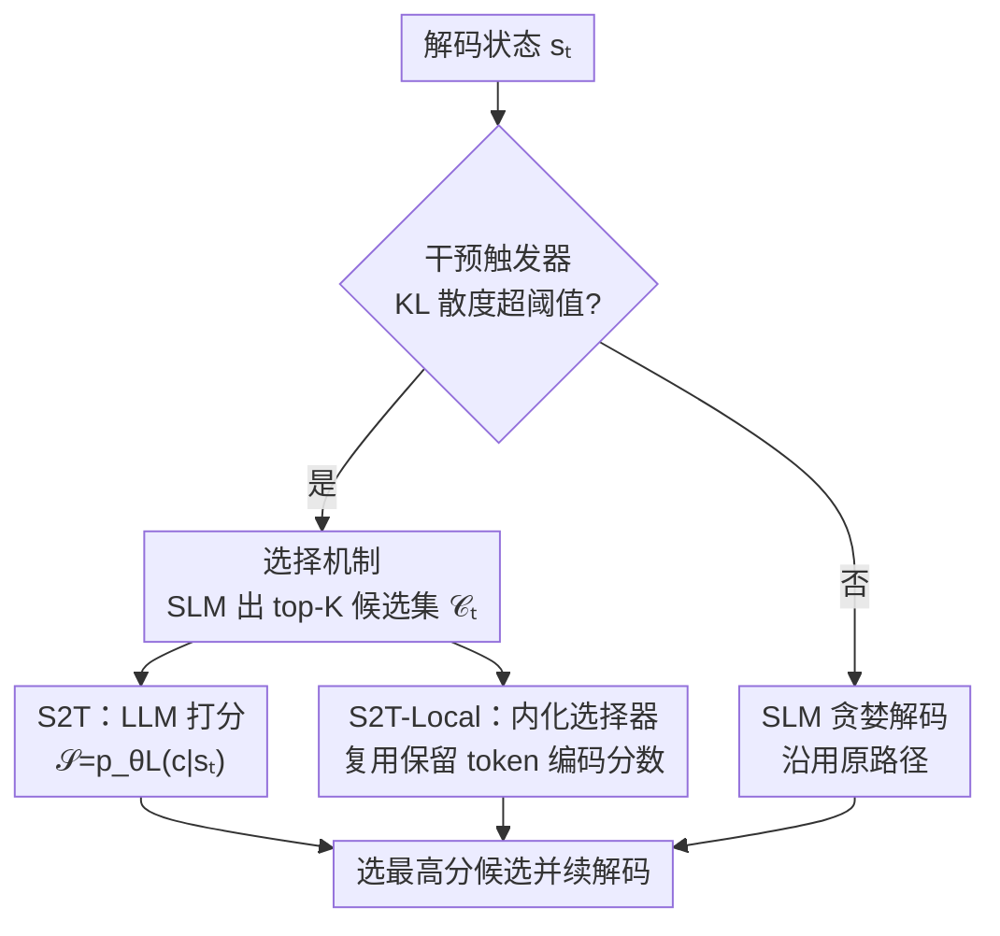

# Select to Think: Unlocking SLM Potential with Local Sufficiency

**会议**: ICML 2026  
**arXiv**: [2604.26940](https://arxiv.org/abs/2604.26940)  
**代码**: https://github.com/YeRona/Select-to-Think  
**领域**: LLM 推理 / 小模型推理增强  
**关键词**: 小语言模型, 协作推理, 局部充分性, 候选重排, 蒸馏

## 一句话总结
这篇论文发现小模型（SLM）在推理"分歧点"上其实**已经把大模型偏好的那个 token 装进了自己的 top-K 候选集里**（1.5B 的 top-8 命中 32B 教师选择达 95%），只是被贪婪解码漏掉了；于是把大模型的角色从"开放式生成"改写成"在 SLM 候选里做选择"，再把这套选择逻辑蒸馏进 SLM 自身，让 1.5B 单轨解码就把 Math 平均分相对提升 24.1%，逼平 8 路自一致性而只花 1/8 的算力。

## 研究背景与动机
**领域现状**：大模型推理强但推理成本高，于是大家转向小模型；但 SLM 在多步推理上常常掉队。主流补救有两条路——**协作推理**（推理时在分歧点调用 LLM 接管几个 token）和**标准蒸馏**（让 SLM 去匹配 LLM 的输出分布）。

**现有痛点**：两条路各有死穴。协作推理即便干预很稀疏，每次纠错都得发一次**同步 LLM 调用**，带巨大的 prefill 开销，延迟和成本下不来；标准蒸馏则被**容量鸿沟**卡住——逼一个小模型去匹配教师在整个开放词表上的分布，等于强迫它去模仿那些与自身先验冲突的概率峰，结果是脆弱的模仿而非稳健的决策规则。

**核心矛盾**：错误其实是**高度局部化**的——少数关键 token 就能让轨迹不可逆地偏离最优路径。既然问题局部，干预也该局部；但无论"局部生成接管"还是"全词表分布匹配"，都仍然把 LLM 的角色定义成**生成**，于是要么付调用代价、要么撞容量墙。

**本文目标**：能不能既不付推理时 LLM 调用、又绕开容量鸿沟，把 SLM 的推理潜力释放出来？

**切入角度**：作者提出并验证一个关键观察——**局部充分性（local sufficiency）**：在分歧点上，LLM 偏好的 token 往往**就在 SLM 的 top-K 下一 token 候选里**，哪怕它没能成为 SLM 的 top-1。实测 1.5B SLM 的 top-8 候选以 95% 命中率包住 32B 教师的选择，连 0.5B 都有 83%。这意味着失败不是"没有正确候选"，而是"无法在已有候选里把它排到第一"。

**核心 idea**：把 LLM 的指导从"开放式生成"**改写成"在 SLM 提案里选择"**——监督信号从高维分布匹配坍缩成离散候选排序，远好蒸馏；再把这套选择逻辑内化进 SLM，得到一个**无需推理时 LLM** 的本地变体 S2T-Local。

## 方法详解

### 整体框架
S2T（Select to Think）的核心是用"在 SLM 候选上做离散选择"替换"开放式生成"。一次解码分三步走：先用一个触发器判断当前是不是"关键步"（分歧大不大），只有关键步才进入选择流程；关键步上，SLM 先吐出自己的 top-K 候选集 $\mathcal{C}_t$，再用一个打分函数 $\mathcal{S}(c;s_t)$ 在这 K 个候选里挑最高分的那个，即 $\hat{y}_t=\arg\max_{c\in\mathcal{C}_t}\mathcal{S}(c;s_t)$。打分函数有两种实例化：**S2T**（协作版，让 LLM 用条件概率 $\mathcal{S}(c;s_t)=p_{\theta_L}(c\mid s_t)$ 给 SLM 候选打分）和 **S2T-Local**（本地版，把打分逻辑蒸馏进 SLM，彻底去掉推理时 LLM）。这个统一形式还能优雅地退化——非关键步 $g_t=0$ 时候选集坍缩成单 token，强制走 SLM 原路径，等同标准解码。

### 关键设计

**1. 局部充分性：失败不在缺候选，而在排不对序**

这是全文的地基观察，也回答了核心矛盾。作者用 KL 散度衡量 SLM 与 LLM 在某步的分歧，在分歧最大的那些步上统计"LLM 偏好的 token 落在 SLM top-K 里的概率"（Hit@K）。结果是 Hit@1 仅 30%，但 Hit@8 飙到 95%（0.5B 也有 83%），且跨 Llama-3 / Gemma-2 / Phi-3 等架构稳定成立。结论是：SLM 其实保有匹配 LLM 推理的底层能力，只是被贪婪解码的次优性**掩盖**了——正确候选就在手边，只是没被排到第一。这把问题从"生成能力不足"重新定义为"在有限候选里的排序/优先级问题"，于是后面所有方法都只需解决"怎么把对的候选选出来"。

**2. 选择机制：把 LLM 从"生成者"降格为"打分者"，蒸馏目标随之坍缩**

针对的痛点是协作推理的调用代价和标准蒸馏的容量鸿沟。S2T 把搜索空间约束在 SLM 自己的 top-K 提案上，LLM 不再开放式生成，只对这 K 个候选给条件概率 $p_{\theta_L}(c\mid s_t)$ 当分数。这样做有两重好处：其一，决策空间从整个词表压到 K 个候选，选择始终落在学生的局部支撑内；其二，监督信号从"高维分布匹配"变成"离散候选排序"，天然好蒸馏。作者还在分析里把误差拆成两源——命中失败 $\delta_{\text{hit}}=\mathbb{I}[y^\star\notin\mathcal{C}_t]$ 和选择失败 $\delta_{\text{sel}}=\mathbb{I}[y^\star\in\mathcal{C}_t,\,f_\theta\neq y^\star]$，并证明累积误差在二者间权衡：增大 K 降低 $\delta_{\text{hit}}$（搜索覆盖更广）但抬高 $\delta_{\text{sel}}$（候选更多更难判别），实验显示 K=8 是覆盖与判别难度的甜点。

**3. S2T-Local：用保留 token 编码偏好分，把选择器塞进 SLM 且不污染语言能力**

S2T 仍需推理时 LLM 打分，为彻底去掉它，作者把选择逻辑内化进 SLM。难点是"直接做概率对齐会扭曲 SLM 的原生分布"——于是改造 ZIP（Zero-overhead Inference-time Prediction）框架，把一组**保留 token** $\mathcal{R}\subset\mathcal{V}$ 的 logits 拿来编码偏好分数，这些 token 从生成分布里被 mask 掉、不参与正常文本生成。对每个候选 $c$，构造拼接状态 $s_t^c=(x,y_{<t}\oplus c)$ 前向一遍，读出保留 token 的分布并用预设 bin 值向量 $\mathbf{v}$ 算出分数 $\mathcal{S}_{local}(c;s_t)=\mathbf{v}^\top\mathrm{softmax}(z_{\theta_S}(s_t^c)[\mathcal{R}])$；K 个候选可 batch 进一次并行前向。这一设计把"选择信号"和"标准词表统计"彻底隔离开——保留 token 学着扛判别信号，普通 token 继续当连贯的语言模型，相当于给 SLM 装了个"内在 critic"。

### 损失函数 / 训练策略
训练目标联合一个选择损失和一个稳定性正则：$\mathcal{L}(\theta_S)=\mathcal{L}_{\mathrm{sel}}+\beta\cdot\mathcal{L}_{\mathrm{reg}}$。

选择项 $\mathcal{L}_{\mathrm{sel}}$ 是一个温度为 $T$ 的交叉熵，把教师标注的最优候选 $c^\star$（候选集中 LLM likelihood 最高者）与其他候选拉开判别 margin：

$$\mathcal{L}_{\mathrm{sel}}=-\log\frac{\exp(\mathcal{S}_{\text{local}}(c^\star;s_t)/T)}{\sum_{c'\in\mathcal{C}_t}\exp(\mathcal{S}_{\text{local}}(c';s_t)/T)}$$

稳定性正则 $\mathcal{L}_{\mathrm{reg}}$ 在标准文本词表 $\mathcal{V}_{\text{text}}=\mathcal{V}\setminus\mathcal{R}$ 上算微调模型与冻结基座的 KL，防止微调扭曲通用语言能力。数据由 SLM rollout 收集：取 KL 散度 top-$\tau=10\%$ 的解码步、每步 K=16 候选、由教师标注，共约 2k 轨迹，**只在 MATH 训练集上训**、其余 benchmark 全留作 OOD。优化用 LoRA（注意力 + MLP），额外解冻保留 token 的 lm_head embedding，1.5B 仅 74.3M 可训练参数（<6%）。

## 实验关键数据

### 主实验
模型用 Qwen2.5-Instruct（0.5B/1.5B 学生配 32B 教师），默认 K=8、干预预算 $\tau=1\%$，3 个种子。核心结论：单轨 S2T-Local 逼平 8 路自一致性（Maj@8），而只花约 1/8 算力。

| 规模 | 指标 | Greedy | Distil | Maj@8 | TaH | S2T-Local |
|------|------|------|------|------|------|------|
| 1.5B | Math Avg. | 36.9 | 40.2 | 43.7 | 39.7 | **45.8** |
| 1.5B | GSM8k | 72.1 | 79.1 | 81.4 | 78.4 | **86.6** |
| 1.5B | MATH500 | 54.4 | 60.4 | 64.1 | 60.9 | **67.5** |
| 1.5B | HumanEval | 42.7 | 48.1 | – | 43.6 | **56.9** |
| 1.5B | MMLU-Pro | 22.9 | 27.9 | 28.6 | 21.9 | **33.6** |
| 0.5B | Math Avg. | 20.2 | 21.7 | 28.0 | 23.4 | **29.2** |

1.5B 的 Math Avg. 从 36.9 → 45.8（**相对 +24.1%**），0.5B 从 20.2 → 29.2（**相对 +44.6%**，小模型增益更大）；且 MATH-训练的 checkpoint 直接迁到 HumanEval、MMLU-Pro 等 OOD 域仍稳定涨点，说明学到的是可迁移的推理偏好而非领域 trick。

### 消融与分析

| 分析 | 关键数据 | 说明 |
|------|---------|------|
| 局部充分性（Hit 率） | Hit@1=30% → Hit@8=95%（0.5B 83%） | 正确候选几乎总在 top-8 内，贪婪漏掉 |
| 候选数 K 扫描 | K=8 后饱和 | 覆盖与判别难度的甜点，再大边际递减 |
| 干预率 τ 扫描 | K=8 固定时 hit 率稳定、准确率随 τ↑ | 更频繁干预提升精度，命中不变 |
| 选择器对齐（S2T-Local） | Agree@1=67~71%，Spearman ρ≈0.63 | 内化选择器与 LLM 高度一致 |
| 效率 | 延迟较协作方法降约 75% | 维持标准 SLM 推理速度 |
| Takeover 对照 | 同触发/预算但 LLM 生成接管 | 隔离"选择 vs 生成"，验证选择已足够 |

### 关键发现
- **选择比生成便宜得多也够用**：在协作设置里 S2T（K≥8）就追平了让 LLM 开放式生成的基线，证明"判别式选择"足以恢复 LLM 推理，无需昂贵的生成。
- **增益来自挖出被低估的候选**："救援"区集中在 $p_{\theta_L}$ 高、$p_{\theta_S}$ 低的左上角——方法专挑那些"教师力挺、学生却严重低估"的 token，把它们从候选里捞回来。
- **小模型受益更大**：0.5B 的相对增益（44.6%）反而高于 1.5B（24.1%），暗示容量越小、"被掩盖的潜力"越多。

## 亮点与洞察
- **重新定义问题最值钱**：把"SLM 推理弱"从"生成能力不足"重述为"在已有候选里排不对序"，这个视角转换直接把蒸馏目标从高维分布匹配坍缩成离散排序，绕开了容量鸿沟——这是全文最"啊哈"的地方。
- **ZIP 保留 token 的复用很巧**：用被 mask 的保留 token logits 编码偏好分，让"选择信号"和"文本生成"互不干扰，相当于零额外输出开销地给 SLM 装了个内在 critic，这个 trick 可迁移到任何"想让模型附带输出一个标量评分又不污染生成"的场景。
- **误差分解给了清晰的设计指南**：$\delta_{\text{hit}}$ vs $\delta_{\text{sel}}$ 的权衡解释了"为什么 K=8 最好"，把超参选择从调参玄学变成有理论支撑的取舍。

## 局限与展望
- **依赖一个好的触发器**：方法把"何时干预"largely 交给 KL 散度 oracle 触发并蒸馏成轻量预测头，作者承认触发模块与选择机制正交、细节放到附录；触发器若判失准，关键步漏触发会直接拖累效果。
- **教师标注成本前移**：虽然推理时无 LLM，但训练数据需教师对每步 K 候选打 likelihood，这部分离线开销在更大词表/更长轨迹上仍不便宜。
- **增益集中在 K=8 饱和区**：K>8 后边际递减，意味着"局部充分性"有天花板——若 LLM 偏好 token 偶尔落在 top-8 之外（5% 情形），选择机制无能为力，只能靠扩大 K 但又抬高选择难度。

## 相关工作与启发
- **vs R2R / SpecReason 等协作推理**：它们仍以"LLM 生成"为干预原语，需同步教师调用、向 SLM 轨迹注入外部 token；S2T 把干预原语换成"在 SLM 候选里选择"，S2T-Local 更彻底去掉推理时 LLM。
- **vs 标准蒸馏 / TSD-KD / RLKD**：那些即便做选择性监督，仍绑在"匹配 LLM 全词表分布"的生成范式上；本文把监督信号降到离散候选排序，从根上回避容量鸿沟。
- **vs 测试时计算扩展（Self-Consistency / ToT / Think-at-Hard）**：那些靠多采样或显式搜索堆算力，S2T-Local 用单轨 + 局部选择就追平 Maj@8，把"测试时计算"从"多跑几条"压成"每步选得更准"。

## 评分
- 新颖性: ⭐⭐⭐⭐⭐ "局部充分性"观察 + 把生成改写成选择，视角转换干净有力
- 实验充分度: ⭐⭐⭐⭐⭐ 两规模六 benchmark + OOD + 误差分解 + 效率/对齐分析齐全
- 写作质量: ⭐⭐⭐⭐ 逻辑链与公式推导清晰，图表略密但论证扎实
- 价值: ⭐⭐⭐⭐⭐ 给小模型推理增强提供低成本、可蒸馏的新范式，实用性强

<!-- RELATED:START -->

## 相关论文

- [\[ICML 2026\] SuCo: Sufficiency-guided Continuous Adaptive Reasoning](suco_sufficiency-guided_continuous_adaptive_reasoning.md)
- [\[ICML 2026\] PowerFlow: Unlocking the Dual Nature of LLMs via Principled Distribution Matching](powerflow_unlocking_the_dual_nature_of_llms_via_principled_distribution_matching.md)
- [\[ACL 2026\] SHAPE: Stage-aware Hierarchical Advantage via Potential Estimation for LLM Reasoning](../../ACL2026/llm_reasoning/shape_stage-aware_hierarchical_advantage_via_potential_estimation_for_llm_reason.md)
- [\[ACL 2026\] When Is Thinking Enough? Early Exit via Sufficiency Assessment for Efficient Reasoning](../../ACL2026/llm_reasoning/when_is_thinking_enough_early_exit_via_sufficiency_assessment_for_efficient_reas.md)
- [\[ACL 2026\] Think Outside the Policy: In-Context Steered Policy Optimization](../../ACL2026/llm_reasoning/think_outside_the_policy_in-context_steered_policy_optimization.md)

<!-- RELATED:END -->
