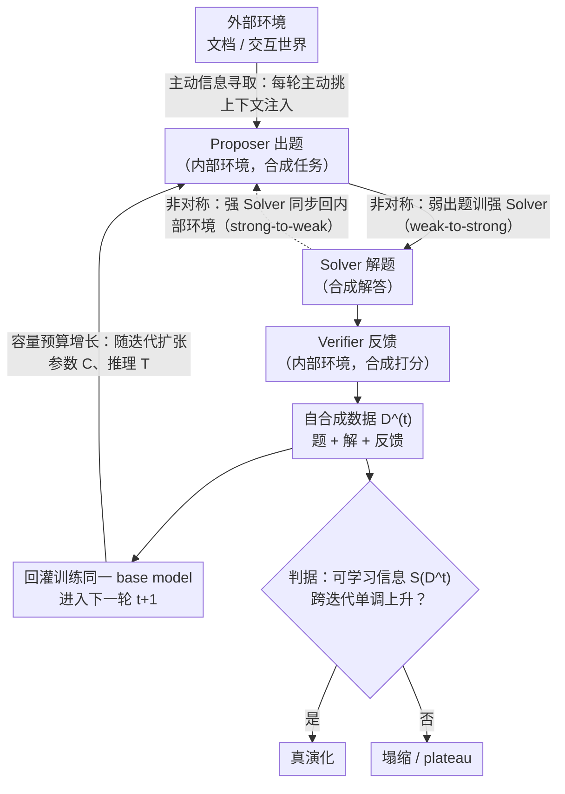

# Self-Play Only Evolves When Self-Synthetic Pipeline Ensures Learnable Information Gain

**会议**: ICML 2026 (Position Paper)  
**arXiv**: [2603.02218](https://arxiv.org/abs/2603.02218)  
**代码**: 无  
**领域**: LLM 推理 / 自演化 / 自博弈 / 信息论  
**关键词**: 自演化 LLM、三元角色 (Proposer/Solver/Verifier)、可学习信息、epiplexity、自合成数据流水线

## 一句话总结
作者主张当下的"LLM 自博弈"之所以在几轮内就崩溃，根本原因是自合成数据没有提供可学习信息增益；他们用有界 MDL/epiplexity 把"可学习信息"形式化，并提出三个系统级设计——非对称协同演化、容量预算增长、主动信息寻取——共同保证三角色 (Proposer-Solver-Verifier) 自演化循环中可学习信息单调上升。

## 研究背景与动机

**领域现状**：LLM 自演化系统通常让同一个模型同时扮演 Proposer (出题)、Solver (解题)、Verifier (打分) 三个角色，通过多奖励强化学习闭环训练，无需外部标注。代表性工作包括 Absolute Zero、R-Zero、Dr. Zero、SPIN、Self-Rewarding、URPO、Cooper 等。

**现有痛点**：这些系统普遍"早期猛涨、几轮后塌陷"——Proposer 退化生成平凡题 ($f(x)=x$)、Solver 性能见顶后下滑、必须定期注入 ground truth 才能不进入"自我幻觉"状态。即便加上精细的奖励设计 (例如让通过率维持 50%)，多奖励 RL 仍然不稳定。

**核心矛盾**：现有方法把自演化等同于"自博弈 RL"，只关心 reward 是否单调上升，但 reward 可以被 hack、可以靠死记硬背预训练知识达成、可以靠重复采样同构问题刷分——**任务级指标涨了，但每轮新合成数据里"可学习的结构"并没有增加**。一旦可学习信息饱和，模型就停止真正学习。

**本文目标**：(1) 给出一个能区分"假象进步"和"真演化"的度量；(2) 找出保证可学习信息跨迭代单调增长的系统级条件；(3) 把现有 self-play / triadic-loop / curriculum 等做法统一到同一分析框架下并指出各自的失败模式。

**切入角度**：作者借鉴 Finzi et al. (2026) 的 epiplexity 概念——在有界观察者 (固定参数预算 $C$ 与推理预算 $T$) 下，把 MDL 拆成"可学习结构 $S_{C,T}(X)$"与"残余熵 $H_{C,T}(X)$"两部分。同一份数据对弱观察者可能是噪声、对强观察者却是结构，因此"可学习信息"是**相对量**，必须随观察者预算共同设计。

**核心 idea**：自演化不是 RL 游戏，而是**自合成数据流水线**；只有让 $S_{C,T}(D^{(t)})$ 跨迭代 $t$ 单调上升，循环才不会塌缩——这要求生成端 (非对称)、接收端 (容量)、原料端 (外部信息) 三个齿轮同时转。

## 方法详解

本文是 position paper，不给具体训练算法，而是回答一个判据性问题：一个 self-play 循环到底"在不在真演化"。作者的答案分三层——先用有界信息论度量把"可学习信息"量化，再给出保证它跨迭代单调上升的三个系统级设计原则，最后用诊断实验验证现有 loop 达不到这个条件。

### 整体框架

整个循环被抽象成"单一信息源 + 多向合成"的流水线 (Figure 1)：同一 LLM 的预训练权重是唯一的信息源，它沿三个合成方向 (出题 / 解题 / 反馈) 产出数据流 $X_d$，再回灌训练自身。判断它是否真在演化，看的不是 reward 是否上涨，而是迭代序列 $\{S_{C^{(t)},T^{(t)}}(D^{(t)})\}_t$ 是否单调上升。

这里的 $S$ 来自一个有界 MDL 优化器：在固定参数预算 $C$、推理预算 $T$ 框定的观察者族 $\mathcal{P}_{C,T}$ 内求最优编码 $P^{\star}=\arg\min_{P}\{|P|+\mathbb{E}[\log 1/P(X)]\}$，再把它拆成两块——$S_{C,T}(X):=|P^{\star}|$ 是 **epiplexity (可学习结构)**，$H_{C,T}(X):=\mathbb{E}[\log 1/P^{\star}(X)]$ 是**有界熵 (学不动的残余噪声)**。关键在于这是个相对量：同一份数据对弱观察者可能纯是噪声、对强观察者却是可学结构，所以"复杂度"必须随观察者预算一起谈。这个拆分天然画出一个 "Goldilocks 区"——数据既不能太简单 (低 $S$ 低 $H$)、也不能太难 (低 $S$ 高 $H$)，得落在"复杂到非平凡、又结构化到可学"的中间地带，循环才有东西可学。

下面三个关键设计正是作用在这条循环的不同环节上：非对称协同演化管"生成端"、容量预算增长管"接收端"、主动信息寻取管"原料端"，三个齿轮同时转才能让 $S_{C,T}(D^{(t)})$ 跨迭代单调上升。

### 关键设计

**1. 非对称协同演化 (Asymmetric Co-evolution)：把"验题比解题易"做成可持续的能力阶梯**

现有 RL 只完成了 weak-to-strong 的上半场——用弱 Proposer/Verifier 把 Solver 练强，但 Solver 一旦变强，Proposer/Verifier 不跟进，任务流相对当前观察者就退化成"低结构"，循环塌向平凡题。本设计补上反向闭环：先 weak-to-strong (弱出题方训出强 Solver)，再 strong-to-weak (把更强的 Solver 同步回内部环境去刷新 Proposer/Verifier)，让两端轮流抬升。它之所以有空间这么做，是因为三个角色虽共享同一权重源，但沿不同合成方向 $d(P,S,V)$ 产生的 $X_d$ 在有界观察者下 $S_{C,T}(X_d)$ 并不相同；以单向置换 (one-way permutation) 为极限例子可证 $H_{\text{poly}}(X|Y)-H_{\text{poly}}(Y|X)\ge c\log n$，即正向出题与反向解题之间存在 $\Omega(\log n)$ bit 的难度间隔，训练做的事正是把这段残余不确定性转化成可复用结构。落到实操有三招：(i) 按非对称 gap 从小到大组织合成方向 (语法纠错 → 数学证明 → 医疗诊断这种 inverse gap)；(ii) 对 Proposer 用反向翻译 (Magicoder、MathGenie、InverseCoder) 从更强 Solver 的数据里重新提取题目；(iii) 对 Verifier 尝试 verifier-free RL，让它和 Solver 共享同一套信念。

**2. 容量预算增长 (Capacity Growth)：让观察者预算随迭代膨胀，永远跟得上新暴露的结构**

前一个设计能不断造出更有结构的数据，但接收端如果不长，照样白搭——固定 $(C,T)$ 时 $S_{C,T}(X)$ 是有上界的，观察者一旦顶满，再多结构也"看不见"。实证里这表现为两种 mismatch：固定参数预算 $C^{(t)}$ 会让训练 loss 早早饱和，逼着 Proposer 退化到当前模型类轻松能解的方向；固定推理预算 $T^{(t)}$ 则把"推理被截断"误判成"知识不足"。所以要让 $C^{(t)}$ 和 $T^{(t)}$ 随迭代一起扩张。理论支撑很直接：只要观察者族单调嵌套 $\mathcal{P}_{C_1,T_1}\subseteq\mathcal{P}_{C_2,T_2}$，就有 $\mathrm{MDL}_{C_2,T_2}(X)\le\mathrm{MDL}_{C_1,T_1}(X)$，扩容等于直接把"可学/不可学"的边界往外推。沿参数轴可走角色非对称缩放 (小 Proposer/Verifier 喂大 Solver) 或跨迭代加层加专家 (Net2Net、Stacking、MoE 激活子集增长)；沿推理轴可走 adaptive reasoning token 或 Mixture-of-Recursions 这类动态深度。

**3. 主动信息寻取 (Proactive Information Seeking)：给闭环开一个外部进料口，突破预训练权重的天花板**

前两个齿轮都在系统内部转，但纯 zero-data 系统的可学习信息终究被预训练权重封顶；而被动地挂个固定外部语料只会退化成对该语料的微调，挂个固定 RAG 又会初期超出 Solver 预算、后期沦为例行公事——这三种 regime 都是"反应式"地消费信息，源头不扩张。本设计让 Proposer+Verifier 每轮主动挑一份外部上下文 $d^{(t)}$，并把它当 conditioning context (而不是训练标签) 注入条件流 $(Y^{(t)}\mid d^{(t)})$。对应的度量是条件有界 MDL $\mathrm{MDL}(Y\mid d):=\min_{P}\{|P|+\mathbb{E}[\log 1/P(Y\mid d)]\}$，其中 $S_{C,T}(Y\mid d)$ 就是"条件可学习信息"。具体也是三招：(i) Proposer 从 Solver 失败、Verifier 分歧里生成 query，检索到 $d$ 后合成"必须显式用到 $d$"的任务 (引用支撑、多文档综合、矛盾检测)；(ii) 把同一份 $d$ 转成多种难度的合成方向并按 curriculum 调度 (早期 grounding、后期 inverse/组合)；(iii) 让检索器/重排器/记忆也用自合成信号 (Verifier relevance) 一起演化。

### 损失函数 / 训练策略

度量端用**前向编码 (Prequential Coding)** 来实际估计 epiplexity (Algorithm 1)：把数据集切成训练/验证，第一遍流式过 $\mathcal{D}_{\text{train}}$ 时累计在线损失 $\mathcal{L}_{\text{online}}=\sum_i -\log P_{\theta_i}(Z_i)$，每个 epoch 末算两项——模型 cost $S=(\mathcal{L}_{\text{online}}-\mathcal{L}_{\text{train}})/\ln 2$、数据 cost $(\mathcal{L}_{\text{val}}/\ln 2)/N_{\text{val}}$，取 MDL 最小那个 epoch 对应的 $S^{\star}$ 当作可学习信息的估计。直觉上这个量等于"模型为学会这批数据付出的累计 online regret"。三个设计原则本身不绑定任何具体损失函数；作者把对应的工程手段 (反向翻译、verifier-free RL、参数堆叠、自适应推理深度、retrieval co-evolution) 统一列在各节的 Practice 段，留给后续工作 plug-in。

## 实验关键数据

实验是**诊断性**的，不追求 SOTA，目的是用上面的 epiplexity 度量验证两件事：(1) 不同合成方向/Proposer/Solver 容量组合下可学习信息确有显著差异；(2) 当前 self-play loop 在多轮迭代后可学习信息**不会单调上升**。任务沿用 Absolute Zero (Zhao et al., 2025a) 的代码三类问题——abduction (给程序和输出推输入)、deduction (给程序和输入推输出)、induction (给输入输出推程序)。

### 主实验 (Experiment 1：单轮 epiplexity 分布)

| 变量轴 | 取值 | 观察到的 epiplexity 趋势 | 结论 |
|--------|------|----------------|------|
| Proposer 容量 | Qwen2.5 7B → Qwen2.5 14B → Qwen3 4B | 单调上升 | 更强 Proposer 生成的数据含更多可学习信息 |
| Solver 容量 | 从小到大 | **先升后降** | 与 Finzi et al. (2026) 的 emergence 现象一致：固定算力下小模型被迫学结构，过阈值后转向死记 |
| 合成方向 | abduction / deduction / induction | induction ≫ abduction ≈ deduction | 不同合成方向带可学习信息差异显著，单纯堆 Proposer 容量不一定增益 |

### 消融实验 (Experiment 2：多轮 self-play 中的 epiplexity 轨迹)

| 配置 | epiplexity 跨迭代行为 | 行为层观察 |
|------|-----------------------|------------|
| 多奖励 RL self-play (无显式闭环机制) | **剧烈震荡**，不单调上升 | Solver 能力下滑、Proposer 生成的问题模式塌缩 |
| (隐含对照) 若加入三大设计 | 作者主张可恢复单调增长 | 留待社区验证 |

### 关键发现
- **Proposer 强 ≠ 数据好**：当 Solver 容量超过某阈值，"更强 Proposer 提供更多可学习信息"会被"Solver 退化为记忆"抵消——这直接给出 Capacity Growth 必须沿 Proposer/Solver/Verifier **同时**扩张的实证依据。
- **方向比数量更要紧**：induction 的可学习信息显著高于 abduction/deduction，证明"加 token、加题目"远不如"换合成方向"——这正是 Asymmetric Co-evolution 关心的 gap 维度。
- **多奖励 RL 不够**：固定 (C,T) + 多奖励 self-play 会让 epiplexity 跨迭代剧烈震荡而非单调升，与现有工作 (R-Zero、Dr. Zero) 早期见顶的现象吻合，从信息论侧解释了为何 reward shaping 单独不够。

## 亮点与洞察
- 把"自演化是否真在演化"翻译成一个可计算的量 $S_{C,T}(D^{(t)})$，从此 reward 上涨与 information gain 不再混为一谈——这是把模糊的"模型崩溃 / 塌缩"现象转成可监控指标的关键一步。
- 用单向置换的 $\Omega(\log n)$ 难度间隔做"非对称"的极限例证，把直觉性的"验题比解题易"升格为可被引用的下界，迁移到任何"forward 简单、inverse 难"的任务设计 (creative writing 中"给约束 vs. 写满足约束的实例" 同样适用)。
- "Goldilocks Zone (高 $S$、适中 $H$)"是个 trick 性的概念，可直接做 curriculum 调度信号：每轮算一下 (S, H) 二维位置，超 H 就降难度，低 S 就换合成方向，比单纯按 pass-rate 调度更可解释。
- 三个原则相互嵌合的叙事 (Asymmetry 是发电机、Capacity 是接收器、Information Seeking 是开放进料口) 很容易迁移：把任何 self-play / agentic 系统拆到这三个角色上做诊断，能快速定位停滞原因。

## 局限与展望
- 作者承认 epiplexity 度量来自非常新的工作 (Finzi et al., 2026)，社区尚未广泛验证，prequential coding 的估计在大模型上算力开销不小。
- 三大设计目前只在 easy-to-verify 域 (代码、数学) 容易闭环；hard-to-verify 域 (开放问答、医疗) 的 inverse gap 怎么测、怎么训仍是开放问题。
- 实验仅做了小规模 Qwen 系列 + 代码三类任务的诊断，没有在加上三大设计后跑一组对照来证明"加了就单调升"——这其实是 position paper 最大的空缺，结论强烈依赖未来工作回填。
- 可学习信息是宏观度量，不一定与下游任务准确率正相关——可能学到大量"数据内禀结构但与任务无关"的可学结构，作者建议两类指标并用。
- 主动信息寻取的关键瓶颈是"知道自己不知道"，这本身是开放研究问题 (Yin et al., 2023)，没有现成解。

## 相关工作与启发
- **vs Self-Training (STaR / ReST / Rejection-Sampling)**：他们靠固定 verifier 过滤合成数据，本文指出这类系统在初始分布耗尽后必然饱和——对应本文"缺乏 Information Seeking"诊断。
- **vs Solver-Verifier 协同 (Self-Rewarding / SPIN / URPO / Cooper)**：他们让 Solver 与 Verifier 共同迭代，但缺乏 strong-to-weak 同步保证 Verifier 跟上 Solver，且任务分布从不扩张——对应"缺乏 Asymmetric Co-evolution 的反向闭环"。
- **vs Proposer-Solver 自博弈 (Absolute Zero / R-Zero / Dr. Zero / Self-Questioning)**：他们快速涨后崩溃的根因被本文归到"Proposer 漂向 trivial 或 unsolvable"，且只动两个角色没有 Verifier 跟随——对应"非对称未做成阶梯"。
- **vs 三元闭环 (SPELL / SPICE / Socratic-Zero / GenEnv)**：最接近本文框架，但仍报告早期 plateau；本文指出他们没有给出"何时算真演化"的统一判据——epiplexity 正是补这个缺口。
- **vs 课程学习 / 协同演化 / "Scaling is All You Need"**：作者在 Alternative Views 一节逐条反驳——三者都是必要但不充分，必须叠加可学习信息这一显式约束。

## 评分
- 新颖性: ⭐⭐⭐⭐⭐ 把 self-play 崩溃归因到"可学习信息不增"，并搬来 epiplexity 形式化，属于第一次把信息论判据正式塞进 self-evolving LLM 设计准则。
- 实验充分度: ⭐⭐⭐ 仅有两组小规模诊断实验，缺少"加上三大设计后单调上升"的正面验证，是 position paper 的合理但明显短板。
- 写作质量: ⭐⭐⭐⭐⭐ 框架→度量→三原则→失败模式→现存工作映射的结构非常清晰，每节都有 "Design / Information Perspective / Gaps / Practice" 四段固定模板，便于工程上对号入座。
- 价值: ⭐⭐⭐⭐⭐ 给整个 self-evolving LLM / agentic RL 社区提供了统一的诊断词汇与设计准则，未来几年这条路线的论文很可能会反复引用其三原则与 epiplexity 监控范式。

<!-- RELATED:START -->

## 相关论文

- [\[ACL 2026\] Stratagem: Learning Transferable Reasoning via Trajectory-Modulated Game Self-Play](../../ACL2026/llm_reasoning/stratagem_learning_transferable_reasoning_via_trajectory-modulated_game_self-pla.md)
- [\[ACL 2026\] Self-Consistency from Only Two Samples: CoT-PoT Ensembling for Efficient LLM Reasoning](../../ACL2026/llm_reasoning/self-consistency_from_only_two_samples_cot-pot_ensembling_for_efficient_llm_reas.md)
- [\[ICML 2026\] On the Generalization Gap in Self-Evolving Language Model Reasoning](on_the_generalization_gap_in_self-evolving_language_model_reasoning.md)
- [\[ICML 2026\] The Role of Feedback Alignment in Self-Distillation](the_role_of_feedback_alignment_in_self-distillation.md)
- [\[ICML 2026\] An Information-Theoretic Criterion for Efficient Data Synthesis](an_information-theoretic_criterion_for_efficient_data_synthesis.md)

<!-- RELATED:END -->
