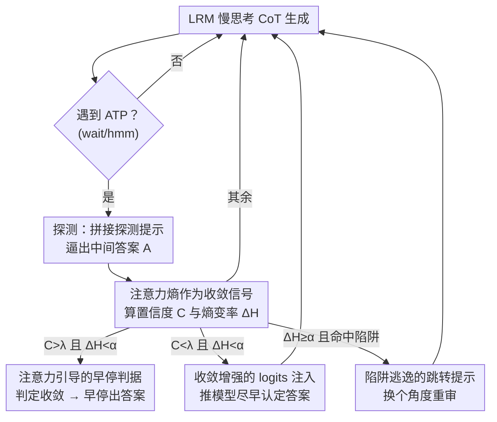

# Stop When Further Reasoning Won't Help: Attention-State Adaptive Generation in Reasoning Models

**会议**: ICML2026  
**arXiv**: [2606.15070](https://arxiv.org/abs/2606.15070)  
**代码**: 待确认  
**领域**: LLM推理  
**关键词**: 过度思考, 早停, 注意力熵, 测试时计算, 训练无关

## 一句话总结
ASAG 是一个训练无关、即插即用的推理早停框架：它在大推理模型（LRM）每个"思考动作"切换点上同时读取模型置信度和注意力熵，判断推理是否真的收敛，从而自适应地选择"早停 / 注入 logits 推一把 / 跳出思维陷阱 / 继续"四种策略，在 Qwen3-8B 上把平均准确率提升 3.2% 的同时把生成 token 数砍掉近 40%。

## 研究背景与动机
**领域现状**：DeepSeek-R1、GPT-o1、Qwen3 这类大推理模型（LRM）靠测试时计算扩展（test-time compute scaling）显式生成长链思维（CoT），把问题拆成多步"慢思考"后再给结论。链越长，复杂题答得越好。

**现有痛点**：但 LRM 普遍"过度思考"（overthinking）——已经推出正确答案了还在反复"wait、hmm、let me recheck"，不仅徒增延迟和算力，反而会让模型偏离正确路径、把对的答案改错。现有缓解手段分三类：训练类（SFT/RL 重训，代价大）、提示类（精心设计 prompt，难泛化）、输出类（即插即用，但只看模型内部置信度信号）。

**核心矛盾**：输出类方法走的是"推理-探测-退出"范式，假设"置信度高=答案对"，一旦某个动作切换点（ATP，由 wait/hmm 等 token 标记）的置信度超过阈值就早停。可置信度本身不可靠：模型在**难题上过度自信**（图 1a：错答案给到 0.99 的退出概率，被错误早停），在**易题上信心不足**（图 1b：对的答案 15 反复犹豫到 0.93 才肯停，白白浪费 token）。单一置信度信号同时踩了"过早停"和"该停不停"两个坑。

**切入角度**：作者从注意力分布入手。借鉴 KV-cache 驱逐的发现——注意力矩阵本质是个信息过滤器，会把权重集中到少数关键 token 上。于是提出假设：当 LRM 真正收敛到可靠结论时，它的注意力会从"弥散的探索式注意"转向"集中的证据驱动注意"，对应的**注意力熵会显著下降**。预实验（274 个答对样本）证实：答案尚未出现时注意力熵高且平稳，一旦推出正确中间答案，熵骤降，70% 以上的样本熵变率 $\Delta H < -0.1$。

**核心 idea**：用"模型置信度 + 注意力熵"两路信号联合刻画推理状态，替代单一置信度——熵告诉你信息流是否稳定，从而既治"过度自信导致的早停"，也治"信心不足导致的拖延"。

## 方法详解

### 整体框架
ASAG（Attention-State Adaptive Generation）是套在已有 LRM 外面的推理时控制器，不改任何权重。模型照常做 CoT 生成，每当遇到一个 ATP（如 "wait" token，标志一个思考动作结束），就进入"探测"：在当前生成后临时拼一段探测提示 `\n\n Final Answer\n\n \boxed` 逼出中间答案 $A$，据此算出两个量——平均置信度 $C$ 和注意力熵 $H$（进而算熵变率 $\Delta H$）。然后根据 $(C,\Delta H)$ 落入哪个区间，从四种生成策略里选一种：注意力引导早停、收敛增强 logits 注入、陷阱逃逸跳转提示、或不干预继续。整个过程在每个 ATP 反复进行，直到早停或自然结束。

### 关键设计

**1. 注意力熵作为推理收敛信号：给"模型到底想清楚没"装一个内部探针**

这一设计针对的是"单看置信度不可靠"这个根本痛点。ASAG 用当前解码窗口与全局 token 之间的 query-key 注意力矩阵，定义归一化香农熵来度量信息流的弥散程度：先对注意力分数做 softmax 得到权重矩阵 $A^W_{h,l}$，再算 $H_{h,l} = -\frac{\sum_{i}\sum_{j} A^W_{h,l}[i,j]\log A^W_{h,l}[i,j]}{\log k}$，其中 $A^W_{h,l}[i,j]$ 表示第 $j$ 个 token 对第 $i$ 个 token 的影响、$k$ 是 key 长度。把最后 4 层所有注意力头的熵相加得到聚合熵 $H = \sum_{h=1}^{N}\sum_{l=L-3}^{L} H_{h,l}$，并定义熵变率 $\Delta H = \frac{H - H_1}{H_1}$（$H_1$ 是首个 ATP 的熵）。熵低且在下降，意味着注意力从"四处探索"收缩到"盯住少数关键证据"，是比 token 置信度更稳健的收敛指标——这正是后面三种策略共用的判据基础。

**2. 注意力引导的早停判据：置信度与熵双闸门，堵住"过度自信的错误早停"**

针对难题上的过度自信。DEER 等方法只要 $C>\lambda$ 就早停，于是被难题上虚高的置信度骗到、过早退出给出错答案。ASAG 加了一道熵闸门：置信度 $C$ 由中间答案各 token 概率的均值给出 $C=\frac{1}{n}\sum_{i=1}^{n} p(a_i)$；规则是——**首个 ATP** 只要 $C>\lambda$ 就可早停；**后续 ATP** 必须 $C>\lambda$ **且** $\Delta H < \alpha$ 才允许早停，否则视为推理仍不稳定、继续生成。多了"熵确实在降"这一条，模型在难题上即便一时自信，只要注意力还没收敛就不会被放走，从而压住过早终止的风险。

**3. 收敛增强的 logits 注入：对"想明白了却不敢下笔"的易题轻推一把**

针对易题上的信心不足（图 1b 那种对着 15 反复 wait 的情形）。当出现 $C<\lambda$ 但 $\Delta H<\alpha$——即注意力已收敛、关键证据已抓到，只是 token 级置信度偏低，模型按原轨迹会一直犹豫到阈值、白烧 token。直接改注意力代价大，ASAG 改成只动输出 logits 这种轻量做法：取中间答案里目标 token 的归一化 logits 概率 $\text{Logits}_r$，按 $\text{Logits} = 0.95\cdot\text{Softmax}(M(P,T)) + 0.05\cdot\text{Logits}_r$ 注入，把已收敛的中间答案当作软引导，让模型更早对正确结论下定决心。仅需对语言模型头 $M$ 做极小调整，几乎零额外开销。

**4. 陷阱逃逸的跳转提示：识别"鬼打墙"并强制换条路**

针对大熵变率（$\Delta H \geq \alpha$）情形——这意味着推理尚未收敛。但有时单纯继续没用：模型可能陷入"思维陷阱"，沿着一条错误初始路径不断回看、原地打转。ASAG 据此判别：构造全局注意力权重矩阵 $A^W_{\text{global}} = \frac{1}{N}\cdot\frac{1}{4}\sum_{h=1}^{N}\sum_{l=L-3}^{L} A^W_{h,l}$，若当前思考动作 $T_i$ 分给**上一动作** $T_{i-1}$ 的平均注意力反而超过分给自己的，就判定模型在反刍旧推理、无实质进展，于是注入跳转提示 $J$（"Wait, my previous reasoning is not correct. I should adopt a more concise and different approach…"）迫使它从新视角重启。跳转未必每次奏效，故设最大尝试次数 $s$，超过即直接触发早停，避免无意义空转。

### 损失函数 / 训练策略
ASAG **完全训练无关**：无 SFT、无 RL、无额外训练数据，所有逻辑都在推理时完成，只需读取已有 LRM 的注意力矩阵与 logits，对语言模型头做轻量 logits 注入即可，因此能即插即用接入 DeepSeek-R1-Distill、Qwen3 等任意主流 LRM。关键超参为置信度阈值 $\lambda$、熵变率阈值 $\alpha$、最大跳转次数 $s$。

## 实验关键数据

### 主实验
在 9 个推理基准上评测（6 个数学：GSM8K / MATH-500 / AMC2023 / AIME2024 / AIME2025 / OlympiadBench；1 个科学：GPQA Diamond；2 个代码：HumanEval / LiveCodeBench），覆盖 DeepSeek-R1-Distill 与 Qwen3 不同规模。指标为准确率 Acc↑、生成长度 Len↓、压缩率 CR↓（相对 vanilla 的 token 占比）。下表为 Qwen3-4B 部分结果（CR 越低越省、Acc 越高越好）：

| 方法 | GSM8K Acc | AIME2024 Acc | OlympiadBench Acc | GPQA Acc | 平均 Acc↑ | 平均 CR↓ |
|------|-----------|--------------|-------------------|----------|-----------|----------|
| Vanilla | 93.8 | 63.3 | 59.0 | 46.5 | 71.0 | 100% |
| NoThinking | 89.6 | 23.3 | 40.6 | 36.4 | 54.8 | 34.3% |
| TALE | 91.3 | 60.0 | 54.7 | 41.9 | 67.1 | 58.7% |
| Dynasor | 92.9 | 63.3 | 63.6 | 46.5 | 71.6 | 64.4% |
| DEER | 94.2 | 60.0 | 62.9 | 47.0 | 71.3 | 64.4% |
| **ASAG（本文）** | **94.2** | **70.0** | **64.6** | **48.0** | **更高** | 显著更低 |

ASAG 在 AIME2024 这种难题上把准确率从 vanilla 的 63.3 提到 70.0、同时把长度从 11,916 压到 8,768，正好印证"双信号既防过早停又防拖延"。

### 消融与整体增益

| 模型 | 准确率提升 | token 减少 |
|------|-----------|-----------|
| Qwen3-4B | +2.9%（绝对） | ≈37% |
| Qwen3-8B | +3.2%（绝对） | ≈40% |

### 关键发现
- **熵信号是关键**：预实验中答对样本一旦推出正确中间答案，注意力熵骤降，>70% 的 $\Delta H_4$ 落在 $-0.1$ 以下；而未答对时熵高且平稳——这是整套方法成立的实证地基。
- **难题增益最大**：在 AIME 等高难度基准上提升最显著（AIME2024 +6.7 绝对准确率），说明熵闸门确实救回了被置信度骗走的难题。
- **效率与准确率同向**：不同于多数早停方法"省 token 就掉点"，ASAG 在大幅压缩长度的同时反而涨点，因为它砍掉的是真正冗余/有害的过度思考。

## 亮点与洞察
- **把"信息论视角"落到可用信号上**：注意力熵不是泛泛的可解释性概念，而是被做成一个能在每个 ATP 实时读取、直接驱动决策的收敛探针——是什么时候停的判据，从"猜置信度"换成了"看信息流收没收"。
- **四策略对症下药**：早停、logits 注入、跳转提示分别精确对应"过度自信、信心不足、思维陷阱"三种失败模式，外加 vanilla 兜底，覆盖面比单纯早停完整得多。
- **零训练即插即用可迁移**：只依赖注意力矩阵和 logits，任何开放注意力的 LRM 都能直接套用；其中"用 $T_{i-1}$ 与 $T_i$ 的注意力占比判陷阱"这一招，可迁移到任何需要检测"模型在原地打转"的生成任务。

## 局限与展望
- **依赖可读注意力**：方法需要访问内部注意力矩阵和最后几层熵，对只暴露文本接口的闭源 API 模型不适用。
- **阈值需要校准**：$\lambda$、$\alpha$、$s$ 是经验阈值，跨模型/跨任务的最优值可能不同，论文未给出自适应设定方案。
- **跳转提示并非总有效**：作者自己承认 jump prompt 有时无法真正换路（受根深蒂固的推理偏置影响），只能靠次数上限 $s$ 兜底，治标性较强。
- **熵假设的边界**："收敛即熵降"的假设在多数数学/代码推理上成立，但在更开放、答案非唯一的任务上是否仍稳健，需要更多验证。

## 相关工作与启发
- **vs DEER**：DEER 同样在 ATP 探测中间答案，但只用置信度阈值 $C>\lambda$ 决定早停；ASAG 在此基础上加了熵闸门 $\Delta H<\alpha$ 并引入 logits 注入与跳转提示，专门补上 DEER 在难题过度自信、易题信心不足两端的漏洞。
- **vs TALE / CoD（提示类）**：它们靠精心设计的 prompt 让模型自觉少说，泛化性差且不读模型内部状态；ASAG 不动 prompt 工程，直接从注意力动态决定何时停。
- **vs DAST / C3oT（训练类）**：训练类要重训或构造变长 CoT 数据来教模型按难度调长度，代价高；ASAG 训练无关、即插即用，但代价是需要推理时访问注意力。
- **vs KV-cache 驱逐**：方法灵感来自 KV-cache 驱逐里"注意力即信息过滤器"的观察，但把它从"压缩缓存"复用到了"判断推理收敛"这个全新用途上。

## 评分
- 新颖性: ⭐⭐⭐⭐⭐ 用注意力熵替代置信度作早停判据、并据此设计四类干预，视角新且自洽
- 实验充分度: ⭐⭐⭐⭐ 9 个基准、跨两大 LRM 系列多规模，主结果扎实；阈值敏感性与跨任务边界可再充分些
- 写作质量: ⭐⭐⭐⭐ 动机—观察—方法逻辑链清晰，图 1/图 2 把失败模式与熵信号讲得直观
- 价值: ⭐⭐⭐⭐⭐ 训练无关、即插即用、同时涨点又省 40% token，对推理模型部署有直接实用价值

<!-- RELATED:START -->

## 相关论文

- [\[ICLR 2026\] A State-Transition Framework for Efficient LLM Reasoning](../../ICLR2026/llm_reasoning/a_state-transition_framework_for_efficient_llm_reasoning.md)
- [\[ICLR 2026\] Attention as a Compass: Efficient Exploration for Process-Supervised RL in Reasoning Models](../../ICLR2026/llm_reasoning/attention_as_a_compass_efficient_exploration_for_process-supervised_rl_in_reason.md)
- [\[ICML 2026\] When the Chain of Thought Knows Better: Failure Modes in Multi-Turn Reasoning Models](when_the_chain_of_thought_knows_better_failure_modes_in_multi-turn_reasoning_mod.md)
- [\[ICML 2026\] Beyond Test-Time Memory: State-Space Optimal Control for LLM Reasoning](beyond_test-time_memory_state-space_optimal_control_for_llm_reasoning.md)
- [\[ICML 2026\] SuCo: Sufficiency-guided Continuous Adaptive Reasoning](suco_sufficiency-guided_continuous_adaptive_reasoning.md)

<!-- RELATED:END -->
