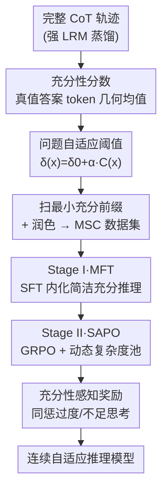

# SuCo: Sufficiency-guided Continuous Adaptive Reasoning

**会议**: ICML2026  
**arXiv**: [2606.17687](https://arxiv.org/abs/2606.17687)  
**代码**: 待确认  
**领域**: LLM推理  
**关键词**: 自适应推理, 思维链效率, 最小充分CoT, 强化学习, 过度思考

## 一句话总结
SuCo 提出"最小充分思维链（MSC）"——能产出正确答案的最短 CoT 前缀，并据此设计两阶段训练（MSC 对齐微调 MFT + 充分性感知策略优化 SAPO），让大推理模型在一个**连续谱**上自主调节推理长度，在数学/代码/科学多基准上同时拿到更高准确率与更少推理 token（7B 平均准确率 +2.7、推理长度从 5239 降到 1267）。

## 研究背景与动机
**领域现状**：DeepSeek-R1、o1、Qwen3 这类大推理模型（LRM）靠显式生成思维链（CoT）在难题上大幅领先。但它们对**任何**问题——哪怕"1+1"——都倾向写一长串推理，造成严重的计算与延迟浪费，在实时编码助手、边缘设备等场景难以落地。

**现有痛点**：现有自适应推理模型（ALRM）想按难度调推理量，但几乎都是**离散**控制：要么用户手动开关（Qwen3 的 think on/off）或选预设档（GPT-OSS 多档策略），要么靠外部分类器/领域标签（AdaCoT、LHRM）二选一。它们的共同毛病是——**没有一个有原则的"推理到底够不够"的判据**，只能在有限个手工模式里硬切。

**核心矛盾**：理想的自适应推理需要同时满足"推理长度随难度伸缩 + 无需人工干预 + 用最少推理拿到最优表现"。但这里有个反直觉的张力：test-time scaling 律说"推理越多越好"，那"少推理反而更好"可能吗？离散模式既答不了这个问题，也没法在问题级别精细标定推理深度。

**本文目标**：找到一个可量化的"推理充分性"判据，并据此训出能在连续谱上自主控制推理量的模型。

**切入角度**：作者定义并实测了**最小充分 CoT（MSC）**——一条 CoT 轨迹中"足以产出正确答案的最短前缀"。在 MATH 五个难度档上，MSC 不仅大幅减少 token，准确率还**一致高于**完整 CoT。这说明盲目堆推理是反效果的，恰到好处地"在充分点截断"反而更好。

**核心 idea**：用"模型对真值答案的置信度"定义充分性分数，找到每题的最小充分前缀作为监督目标；再用两阶段训练（先 SFT 内化简洁推理、后 RL 学会自主分配），把"何时该停"变成模型可连续调控的能力，而非外挂的离散开关。

## 方法详解

### 整体框架
SuCo 的核心是一个可计算的充分性判据，外加围绕它的两阶段训练。给定问题 $x$、真值答案 $y^*$，一条 CoT 轨迹 $z$ 的**推理充分性**定义为模型对真值答案各 token 概率的几何均值：

$$\mathcal{S}_\theta(z\mid x,y^*) := \Big(\prod_{i=1}^{\|y^*\|}\pi_\theta(y^*_i\mid x,z,y^*_{<i})\Big)^{1/\|y^*\|}$$

用几何均值而非联合概率，是因为后者随答案变长指数衰减、对长序列脆弱。当 $\mathcal{S}_\theta(z\mid x,y^*)\ge\delta$ 时称该轨迹 $\delta$-充分；**MSC** 就是满足充分性的**最短句级前缀** $z_{<t^*}$（句子是原子推理步，避免碎片化截断破坏逻辑）。

整条 pipeline：先用强 LRM 生成完整 CoT → 按每题自适应阈值 $\delta(x)$ 扫出最小充分前缀、再润色成 MSC 数据集 → **Stage I（MFT）** 用 SFT 把"简洁但充分"的推理内化进模型 → **Stage II（SAPO）** 用带动态复杂度池和充分性奖励的 RL，让模型在推理时自己决定该写多长。

### 关键设计

**1. 充分性分数与 MSC：给"推理够不够"一个可计算的判据**

以往离散方法说不清"推理多少算够"，SuCo 用模型自身对真值答案的置信度来量化：充分性分数 $\mathcal{S}_\theta$（上式几何均值）越高，说明当前推理前缀越能支撑出正确答案。MSC 即满足 $\mathcal{S}_\theta\ge\delta$ 的最短句级前缀，形式上要求**充分性**（$\mathcal{S}_\theta(z_{<t^*})\ge\delta$）与**最小性**（更短的前缀都 $<\delta$）。论文实测一个有意思的现象：一旦越过充分阈值，再继续"等一等/自我验证"，充分性反而**急剧下滑**——多写的推理不仅无益，甚至会动摇模型已有的正确判断。这正是"少推理反而更准"的微观证据，也把训练目标从"写得长"扭转为"写到充分即止"。

**2. 问题自适应阈值：让"充分"的标准随难度自动伸缩**

固定阈值 $\delta$ 对所有题一刀切：简单题用高 $\delta$ 会保留没必要的推理，难题用低 $\delta$ 又会过早砍掉关键步。SuCo 改用随难度变化的阈值 $\delta(x)=\delta_0+\alpha\cdot\mathcal{C}(x)$，其中 $\delta_0$ 是基准、$\alpha$ 控制对复杂度的敏感度、$\mathcal{C}(x)\in[0,1]$ 是问题复杂度。复杂度用**推理长度的百分位秩**估计：$\mathcal{C}(x_i)=\frac1N\sum_j \mathbb{1}[\|z_j\|\le\|z_i\|]$——以推理长度作为难度代理（Fig.1 实证支持），百分位形式对离群值鲁棒、且在 $[0,1]$ 上均匀分布，保证阈值缩放稳定。这样难题给更高的充分性门槛（多留推理）、简单题给更低门槛（早停），MSC 分布在难度上更具区分度。论文取 $\delta_0=0.5$、$\alpha=0.4$，于是 $\delta(x)\in[0.5,0.9]$。

**3. Stage I — MSC 对齐微调（MFT）：用 SFT 先把简洁充分的推理习惯灌进去**

光有判据还需把它变成模型行为。MFT 先从源数据用强 LRM 生成完整 CoT，按 Algorithm 1 给每题算自适应阈值、扫出最小充分前缀 $z^{raw}$；若前缀短于 $L_{min}=5$ 句则判定该题"无需显式推理"、置空（让模型对简单题直接答）；否则用一个 refine 模型把原始截断润色成逻辑连贯的 $z^{MSC}$（自然导出答案、去冗余、保持风格）。最终数据格式为 `<think> z^MSC </think> ŷ`，其中 think 段可为空。训练就是对该数据集做负对数似然的 SFT：$\mathcal{L}_{MFT}=-\mathbb{E}[\log\pi_\theta(z^{MSC}\mid x)+\log\pi_\theta(\hat y\mid x,z^{MSC})]$。这一步让模型先学会"该简则简、该停则停"的基本盘，为后续 RL 提供良好初始化。

**4. Stage II — 充分性感知策略优化（SAPO）：用 RL 学会推理时自主分配，并解决分布漂移**

SFT 只是模仿静态的 MSC，真正"自主调度"要靠 RL。SAPO 基于 GRPO（每题采 $K=8$ 条轨迹做组内优势估计）。这里有个关键难点：随着策略更新，推理长度分布会漂移，MFT 阶段离线算的复杂度/阈值很快失效，而每步全量重算又太贵。SuCo 维护一个**动态复杂度池** $\mathcal{P}=\{\|z_i^{avg}\|\}$ 在线跟踪每题的演化推理长度，用 EMA 更新：$\|z_i^{avg}\|\leftarrow(1-\eta)\|z_i^{avg}\|+\eta\cdot\frac1K\sum_k\|z_i^{(k)}\|$（$\eta=0.1$），再据此实时重算 $\mathcal{C}(x)$ 与 $\delta(x)$，让充分性目标始终对齐当前策略行为、几乎不增成本。奖励为 $\mathcal{R}=\mathcal{R}_{cor}+\mathcal{R}_{format}+\beta\mathcal{R}_{suff}$，其中**充分性奖励同时惩罚两种偏差**：

$$\mathcal{R}_{suff}=\underbrace{-\lambda_{over}\mathbb{1}[L_z>t^*+\epsilon]}_{\text{过度思考}}-\underbrace{\mathbb{1}[y\ne y^*]\cdot\lambda_{under}\mathbb{1}[L_z<t^*]}_{\text{不足思考}}$$

即超过最小充分点 $t^*$（留容差 $\epsilon=2$ 句）要扣分以压过度思考；而推理不足只在**答错时**才扣（答对的短推理不罚，鼓励该短就短）。这种"双向惩罚 + 容差"的设计，让模型既不啰嗦也不偷懒，把推理量稳稳收敛到充分点附近。

### 损失函数 / 训练策略
两阶段：MFT 用 SFT（3 epoch、lr $1\times10^{-4}$）；SAPO 用 GRPO（lr $1\times10^{-6}$、batch 128、micro-batch 8、$K=8$ rollout、$\beta=1.0$、$\lambda_{over}=\lambda_{under}=0.5$、$\epsilon=2$ 句）。数据来自 Llama-Nemotron、Mixture-of-Thoughts、OpenR1-Math-220k、OpenCodeReasoning、s1K-1.1 五个源，构造 MSC 并经 Qwen3-Next-80B 质检后得 270,011 条高质量样本；全部 MSC 用于 Stage I，子集用于 Stage II。训练于 8×H100。

## 实验关键数据

### 主实验
在数学（GSM8K / MATH500 / AMC23 / AIME25）、代码（MBPP / LiveCodeBench-V6）、科学（MMLU-STEM / GPQA-D）八个基准上，于 1.5B 与 7B 两个规模评测，同时报告准确率与响应长度。

| 方法 (Qwen2.5-7B) | 平均准确率 ↑ | 平均长度(tokens) ↓ |
|------|------|------|
| DeepSeek-R1-Distill | 63.2 | 5,239 |
| AdaCoT | 66.2 | 3,419 |
| AdaptThink | 66.6 | 3,400 |
| S-GRPO | 69.4 | 2,478 |
| LHRMs | 68.6 | 1,891 |
| **SuCo (Ours)** | **72.1** | **1,267** |

| 方法 (Qwen2.5-1.5B) | 平均准确率 ↑ | 平均长度(tokens) ↓ |
|------|------|------|
| DeepSeek-R1-Distill | 45.2 | 5,736 |
| LHRMs | 50.5 | 2,055 |
| **SuCo (Ours)** | **53.1** | **1,483** |

SuCo 在两个规模上都做到**准确率与效率双赢**：7B 上平均准确率比最强基线 S-GRPO 高 2.7、比蒸馏基线高 8.9，同时推理长度比蒸馏基线压缩约 **4.1×**（5239→1267），也明显短于次优的 LHRMs（1891）。

### 消融与分析

| 维度 | 现象 | 说明 |
|------|------|------|
| MSC vs 完整 CoT（Fig.1） | MATH 五档难度上 MSC token 更少、准确率更高 | 验证"少推理反而更准"，是全文立论根基 |
| 越过充分点继续推理（Fig.2） | 充分性分数急剧下滑 | 过度推理会动摇正确判断，支撑双向惩罚设计 |
| 几何均值 vs 联合概率（附录 A.4） | 几何均值对长答案更稳健 | 解释充分性分数为何用几何均值 |
| 固定阈值 → 问题自适应阈值 | MSC 分布在难度上更有区分度 | 难题留更多推理、简单题早停 |

### 关键发现
- **"充分即止"普遍成立**：在所有难度档上，截到最小充分前缀都不输于（甚至优于）完整 CoT，说明冗余推理是 LRM 的系统性浪费。
- **动态复杂度池是 RL 能稳的关键**：不在线跟踪长度漂移，离线阈值会迅速过时、奖励信号失真；EMA 跟踪几乎零成本地保持目标对齐。
- **难题上提升更醒目**：在 AIME25、GPQA-D 这类硬基准上 SuCo 仍稳定领先（7B AIME25 61.7 vs S-GRPO 58.3），说明压缩推理并未牺牲难题能力。

## 亮点与洞察
- **把"够不够"变成可微调的连续量**：用模型对真值答案的置信度定义充分性，绕开了"靠外部分类器/手工档位"的离散范式，是从"开关"到"旋钮"的范式转变。
- **百分位复杂度代理很轻巧**：直接拿推理长度的百分位秩当难度，免去额外的难度标注模型，且天然均匀分布、对离群鲁棒——一个可直接迁移到其他自适应训练的小 trick。
- **不足思考只在答错时罚**：这个不对称惩罚很关键，避免了"为了凑长度而强行加推理"，让"简单题敢于短"成为被奖励的行为。
- **动态复杂度池**：把 RL 训练中的分布漂移问题用 EMA 池优雅解决，可复用到任何"监督目标依赖于策略当前行为统计"的在线训练场景。

## 局限与展望
- **充分性依赖真值答案**：$\mathcal{S}_\theta$ 的计算需要 $y^*$，因此该判据只能用于训练期构造数据/奖励，推理时模型是"内化"了这种习惯而非在线判断充分性，迁移到无标注新分布的效果有待观察。
- **复杂度≈推理长度的假设**：用长度百分位当难度代理虽实用，但长推理未必等于难题（也可能是模型啰嗦），这个代理在某些域可能失真。
- **两阶段成本**：需要先蒸馏完整 CoT、再 SFT、再 RL，且 MSC 构造与质检都依赖一个 80B 大模型，pipeline 偏重。
- **改进方向**：能否设计无需真值的在线充分性估计，或把 MSC 判据直接做成可在推理时自评的信号，进一步去掉对标注的依赖。

## 相关工作与启发
- **vs AdaCoT / LHRM（二值/标签触发）**：它们靠外部模型或领域标签决定"开不开 CoT"，是粗粒度二选一；SuCo 用充分性判据在连续谱上精细标定深度。
- **vs Qwen3 / GPT-OSS / ThinkDial（预设档位）**：靠 system prompt 选有限个手工模式；SuCo 让模型自主、无人工干预地连续调节。
- **vs S-GRPO / ThinkPrune（RL 剪短推理）**：同样用 RL 压长度，但 SuCo 的奖励锚在"最小充分点"这一有原则的目标上，且双向惩罚 + 动态复杂度池，效率—准确率权衡更优（7B 上准确率反超 S-GRPO 2.7 同时更短）。
- **vs test-time scaling 的"越多越好"**：SuCo 用 MSC 实证给出反例——在充分点截断既省 token 又更准，与"过度思考"和"test-time scaling 的海市蜃楼"等分析互为印证。

## 评分
- 新颖性: ⭐⭐⭐⭐⭐ 提出可计算的"最小充分 CoT"判据，把自适应推理从离散模式推进到连续谱控制
- 实验充分度: ⭐⭐⭐⭐⭐ 覆盖数学/代码/科学八基准、两个规模，准确率与长度双指标，含关键分析图
- 写作质量: ⭐⭐⭐⭐⭐ 立论清晰（先实证 MSC 再建框架），公式与算法完整
- 价值: ⭐⭐⭐⭐⭐ 同时提准确率与省 token，对 LRM 高效部署有直接意义

<!-- RELATED:START -->

## 相关论文

- [\[AAAI 2026\] LLMs for Game Theory: Entropy-Guided In-Context Learning and Adaptive CoT Reasoning](../../AAAI2026/llm_reasoning/llms_for_game_theory_entropy-guided_in-context_learning_and_adaptive_cot_reasoni.md)
- [\[ICML 2026\] Select to Think: Unlocking SLM Potential with Local Sufficiency](select_to_think_unlocking_slm_potential_with_local_sufficiency.md)
- [\[ICLR 2026\] Continuous Chain of Thought Enables Parallel Exploration and Reasoning](../../ICLR2026/llm_reasoning/continuous_chain_of_thought_enables_parallel_exploration_and_reasoning.md)
- [\[ACL 2026\] When Is Thinking Enough? Early Exit via Sufficiency Assessment for Efficient Reasoning](../../ACL2026/llm_reasoning/when_is_thinking_enough_early_exit_via_sufficiency_assessment_for_efficient_reas.md)
- [\[ICML 2026\] The Easy, the Hard, and the Learnable: Confidence and Difficulty-Adaptive Policy Optimization for LLM Reasoning](the_easy_the_hard_and_the_learnable_confidence_and_difficulty-adaptive_policy_op.md)

<!-- RELATED:END -->
