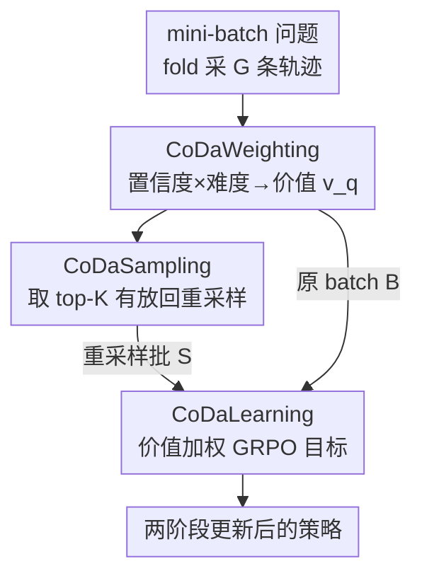

# The Easy, the Hard, and the Learnable: Confidence and Difficulty-Adaptive Policy Optimization for LLM Reasoning

**会议**: ICML2026  
**arXiv**: [2606.07950](https://arxiv.org/abs/2606.07950)  
**代码**: https://github.com/tmlr-group/CoDaPO  
**领域**: LLM推理  
**关键词**: GRPO、可验证奖励RL、计算分配、难度自适应、置信度

## 一句话总结
本文先把 GRPO 训练动态拆开看，发现它对简单/困难/可学习问题一视同仁导致算力错配，进而提出 CoDaPO——用每题的"置信度×难度"算一个有界价值，既给梯度更新加权又对高价值题重采样，在固定算力下把更新集中到"可学习带"，12 个推理基准上稳定超过 GRPO 等方法。

## 研究背景与动机
**领域现状**：在数学、代码这类有可验证奖励的推理任务上，用 RL 后训练 LLM 已成主流。PPO 需要额外的价值网络，开销大，于是 GRPO 这类去 critic 的方法流行起来——它对每题采样一组轨迹、把组内奖励标准化当优势，再配 PPO 式的裁剪目标。

**现有痛点**：GRPO 用**均匀采样 + 近均匀加权**对待所有问题。但一道题一旦被"做出来了"，再更新主要是在锐化分布、把置信度往上推，对正确率几乎没贡献；而真正的难题受限于"发现"——一组只采 8 条轨迹，连一条正确轨迹都难得碰到，正向强化几乎不发生。两头都在浪费算力。

**核心矛盾**：作者通过追踪 token 对数概率、组归一化优势和由此产生的 token 级更新权重，揭示了 GRPO 训练中三个反复出现的动态：(1) **置信度膨胀**——正确和错误轨迹的置信度都往 100% 挤，校准崩坏；(2) **优势收缩**——组内正确率升高时正优势趋近 0、稀有失败拿到越来越大的负优势；(3) **分层收敛**——简单题迅速饱和、梯度消失，难题始终被发现瓶颈卡住、改善缓慢。

作者把这三者归因于 GRPO 的两个结构特征:**非对称裁剪**(保留向上漂移、却截断足够负的更新)和**二值奖励下的组归一化**(正确率趋近 1 时正向信号被削弱)。结论是:一次更新的效用高度不均匀,既取决于题目难度,也取决于模型当前水平。

**核心 idea**:既然更新效用不均匀,就别再均匀对待——用每题的置信度和难度算一个**有界价值** $v_q$,把它同时用于"给更新加权"和"对高价值题重采样",在固定算力预算内把计算集中到"可学习带"(中等难度、有正确轨迹可学的题)。

## 方法详解

### 整体框架
CoDaPO 是一个**数据中心、模型自适应**的框架,直接插进标准 RL 目标里,不改 RL 的理论天花板,只改"把算力花在哪"。每个训练步分三步走:先用 fold 对 mini-batch 每题采一组轨迹,**CoDaWeighting** 据此给每题算一个标量价值 $v_q$;**CoDaSampling** 按价值选出 top-K 题、有放回地重采样成一个等大的"高价值批";**CoDaLearning** 用价值加权的 GRPO 目标,先在原 batch 上走一步(保覆盖),再在重采样批上走一步(集中算力)。关键约束是**固定预算重分配**:一半算力花在原 mini-batch,一半花在重采样批,而非加预算。

### 关键设计

**1. CoDaWeighting:用置信度×难度定位"可学习带"**

针对"均匀加权浪费算力"这个痛点,本设计给每题一个有界价值,刻画它"还值不值得继续优化"。它从一组轨迹里读两个免费信号:**群体置信度** $c_q$(平均 token 似然的指数,衡量模型是否走在一条连贯路径上)和**难度** $d_q$(组错误率):

$$c_q = \exp\left[\frac{1}{G}\sum_{i=1}^{G}\frac{1}{|o_i|}\sum_{t=1}^{|o_i|}\log f_\theta(o_{i,t}\mid q, o_{i,<t})\right],\quad d_q = 1 - \frac{1}{G}\sum_{i=1}^{G} r_i.$$

价值由两个可分离函数相乘 $v_q = V_c(c_q)\,V_d(d_q)$。作者选**线性** $V_c(x)=x$(鼓励对模型已有把握的题做更大更新)和**U 形**(实为倒 U/抛物线)$V_d(x)=1-4(x-1/2)^2$,于是

$$v_q = c_q\left(1 - 4(d_q - 1/2)^2\right).$$

这是一个"可学习带先验":$d_q\approx 0$(已解决,更新只会膨胀置信度)或 $d_q\approx 1$(发现受限,梯度被裁剪的负样本主导)时 $v_q\approx 0$,而在 $d_q\approx 1/2$ 处取峰——这里正确轨迹出现得足够频繁、能给出可操作的学习信号。比起"做什么都一样权重",它精准地把无用更新压下去。

**2. CoDaSampling:对高价值题重采样,提高难题"发现"概率**

针对"难题被发现瓶颈卡住"这个痛点,本设计按价值排序、留 top-K 题,再**有放回**地从中采样、每题重复 $B/K$ 次,凑成一个等大批 $S$,然后对这些题重新跑 rollout。直觉在概率上:设每条轨迹成功率 $\pi(q)$,一组 $G$ 条至少见到一条正确的概率是 $1-(1-\pi(q))^G$;若重复 $m$ 次、每次抽新组,则变成 $1-(1-\pi(q))^{Gm}$。当 $\pi(q)$ 很小时,重复采样显著抬高"至少观测到一条正确轨迹"的概率,从而更可靠地触发后续的"正优势放大"阶段——这正是缓解分层收敛、给难题更多发现机会的关键。

**3. CoDaLearning:价值加权的两阶段 GRPO 更新**

本设计把价值真正注入梯度。它最大化一个**价值加权的 GRPO 目标**:在标准裁剪 surrogate 外面乘上题级因子 $v^{(j)}$,

$$J_{\text{CoDaPO}} = \sum_{j=1}^{B}\frac{1}{\sum_i |o_i^{(j)}|}\sum_{i,t}\min\!\Big(\rho_{i,t}^{(j)}\hat{A}_i^{(j)},\,\text{clip}(\rho_{i,t}^{(j)}, 1{-}\epsilon, 1{+}\epsilon)\hat{A}_i^{(j)}\Big)\,v^{(j)}.$$

同一目标先作用于原 batch、再作用于重采样批 $S$。等价地看,token 级有效权重变成 $w_{i,t}^{(j)} = v^{(j)}\,\mathbb{1}_{\text{unclipped}}\,\rho_{i,t}^{(j)}\hat{A}_i^{(j)}$:CoDaPO 不动裁剪的非对称性,而是用有界的题级因子重塑梯度方向。配套两处工程改动(沿用 DAPO/GPG):**token 级微平均**(用 $\frac{1}{\sum_i|o_i|}\sum_{i,t}$ 取代逐轨迹平均,消除对长轨迹的隐性长度惩罚)和**去掉 KL 正则**(鼓励探索、省掉一次 fref 前向)。一个优雅之处是"优势收缩"从瓶颈变成特征:$\bar r\uparrow 1$ 时 $\hat A^{(+)}\downarrow 0$ 且 $d_q\downarrow 0$,$\hat A$ 和 $v_q$ 一起缩小,简单题梯度自然退火,算力留给难题。

### 损失函数 / 训练策略
价值 $v_q$ 和优势 $\hat A_i$ 都做 stop-gradient(不回传组统计量)。固定预算:50% 算力生成/学习原 mini-batch,50% 用于重采样批 $S$;CoDaPO 引入的额外训练步计入总步数,保证与基线公平比较。

## 实验关键数据

### 主实验
后训练 Llama-3.2-1B-Instruct、Qwen2.5-Math-1.5B、Qwen2.5-Math-7B(均在 MATH 上训练,4×A100,batch=16,每题 8 条 rollout),在 7 个数学基准上评测(每题采 32 次 @ 温度 0.6 取均值):

| 模型 | 方法 | MATH500 | OlympiadBench | AIME2025 | 7 基准均值 |
|------|------|---------|---------------|----------|-----------|
| Qwen2.5-Math-1.5B | Base | 30.63 | 18.78 | 2.50 | 16.55 |
| Qwen2.5-Math-1.5B | GRPO | 70.31 | 32.18 | 8.00 | 39.08 |
| Qwen2.5-Math-1.5B | GPG | 69.89 | 32.72 | 8.03 | 39.77 |
| Qwen2.5-Math-1.5B | **CoDaPO** | **71.54** | **36.16** | **12.35** | **41.30** |
| Qwen2.5-Math-7B | GRPO | 72.18 | 37.35 | 11.07 | 44.58 |
| Qwen2.5-Math-7B | **CoDaPO** | **74.39** | **37.98** | 11.46 | **46.67** |

CoDaPO 在 1.5B 上把均值从 GRPO 的 39.08% 提到 41.30%(相对 +5.68%),OOD 的 OlympiadBench 涨幅尤其明显(32.18→36.16)。在 Llama-3.2-1B 上同样取得全方法最佳,说明不依赖特定骨干。

### 消融实验
逐步叠加三个组件(同一基模型、同一训练预算):

| 配置 | MATH500 | AIME2024 | AIME2025 | 均值 |
|------|---------|----------|----------|------|
| +GRPO | 70.31 | 13.02 | 8.00 | 30.44 |
| +CoDaWeighting | 71.09 | 13.90 | 9.59 | 31.53 |
| +CoDaSampling(完整) | 71.54 | 14.47 | 12.35 | 32.79 |

### 关键发现
- **价值加权先起作用,重采样补刀难题**:只加 CoDaWeighting 就把均值 30.44→31.53(压无用更新);再开 CoDaSampling 升到 32.79,而且增益最集中在最难的 AIME2025(8.00→9.59→12.35),印证"重采样专门救发现受限的难题"。
- **跨域泛化**:仅在 MATH 上训练,却在 MMLU、GPQA、HumanEval 上全面超 GRPO(均值 32.64→39.96,HumanEval 34.76→50.61),说明改善的是可迁移的推理行为。
- **测试时扩展**:AIME25 上 Pass@K 各 K 值全面优于 GRPO,小样本区(Pass@1)相对增益最高达 10 个点,Pass@128 达 53.33%,样本效率更好。

## 亮点与洞察
- **先诊断再开方**:论文最有价值的是前半段对 GRPO 动态的数学拆解(非对称裁剪→置信度膨胀,组归一化→优势收缩,有限采样→分层收敛),CoDaPO 的每个组件都能对应到要解的具体病灶,不是拍脑袋调权重。
- **倒 U 难度先验很巧**:$1-4(d-1/2)^2$ 自动把"已解决"和"做不出来"两端压到 0、峰值落在中等难度,一行公式实现了"可学习带"的算力聚焦,可直接迁到任何带组采样的 RL 目标里。
- **把优势收缩当朋友**:别的工作想方设法对抗优势趋零,本文反过来让 $v_q$ 和 $\hat A^{(+)}$ 一起衰减,实现简单题的隐式退火——视角转换很漂亮。

## 局限与展望
- **发现概率分析建在独立性假设上**:$1-(1-\pi)^{Gm}$ 假设组内 rollout 独立,作者自承这是乐观估计——组内相关会让多条轨迹以相似方式失败,真实发现概率更低,因此重采样的收益可能被高估。
- **只验证数学/单一训练集**:训练集仅 MATH,模型最大到 7B;倒 U 的 $V_d$ 和线性 $V_c$ 是经验选择,更大模型或非数学领域是否仍最优、top-K 与重复次数 $K$ 怎么调,文中没给敏感性分析。
- **固定 50/50 预算劈分**:原批与重采样批各占一半是写死的,这个比例随训练阶段(早期难题多 vs 后期都饱和)是否该动态调整值得探索。

## 相关工作与启发
- **vs GRPO**:GRPO 均匀采样+均匀加权,CoDaPO 在同一目标外乘题级价值 $v_q$ 并重采样高价值题,本质是"算力分配"的改进而非"per-sample 目标"的改进,二者正交可叠加。
- **vs DAPO / GPG**:DAPO/GPG 主要在 token 级目标(如解耦裁剪、去长度偏置)上改进,CoDaPO 借用了它们的 token 微平均+去 KL,但核心创新在**问题级**的难度/置信度自适应分配,是不同维度的优化。
- **vs Dr. GRPO**:Dr. GRPO 修正优势归一化偏差,CoDaPO 不改归一化结构,而是接受优势收缩、把它转成简单题退火信号。

## 评分
- 新颖性: ⭐⭐⭐⭐ 诊断驱动的算力分配视角清晰,倒 U 价值函数简洁可迁移
- 实验充分度: ⭐⭐⭐⭐ 三骨干、12 基准、跨域+测试时扩展+逐组件消融,较完整;但缺超参敏感性
- 写作质量: ⭐⭐⭐⭐⭐ 从动态分析到方法推导逻辑链严密,公式与直觉配合好
- 价值: ⭐⭐⭐⭐ 即插即用、固定预算下稳定提升,对做可验证奖励 RL 的人实用

<!-- RELATED:START -->

## 相关论文

- [\[ACL 2026\] Adapt to Thrive! Adaptive Power-Mean Policy Optimization for Improved LLM Reasoning](../../ACL2026/llm_reasoning/adapt_to_thrive_adaptive_power-mean_policy_optimization_for_improved_llm_reasoni.md)
- [\[ICML 2026\] Inference Time Optimization with Confidence Dynamics](inference_time_optimization_with_confidence_dynamics.md)
- [\[ICLR 2026\] Adaptive Social Learning via Mode Policy Optimization for Language Agents](../../ICLR2026/llm_reasoning/adaptive_social_learning_via_mode_policy_optimization_for_language_agents.md)
- [\[ICML 2026\] Attention Illuminates LLM Reasoning: The Preplan-and-Anchor Rhythm Enables Fine-Grained Policy Optimization](attention_illuminates_llm_reasoning_the_preplan-and-anchor_rhythm_enables_fine-g.md)
- [\[ICLR 2026\] Temperature as a Meta-Policy: Adaptive Temperature in LLM Reinforcement Learning](../../ICLR2026/llm_reasoning/temperature_as_a_meta-policy_adaptive_temperature_in_llm_reinforcement_learning.md)

<!-- RELATED:END -->
