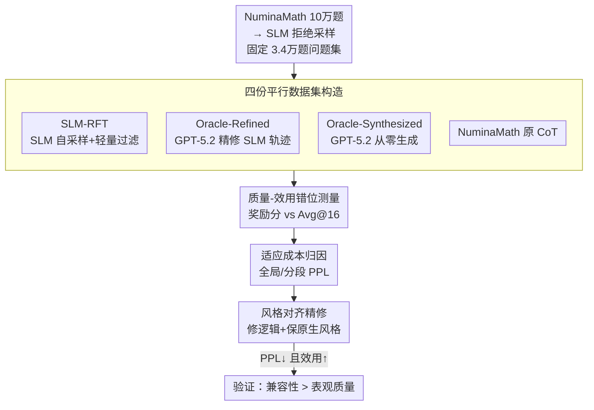

# The Quality-Utility Paradox: Why High-Reward Data Impairs Small Model Mathematical Reasoning

**会议**: ICML2026  
**arXiv**: [2606.16152](https://arxiv.org/abs/2606.16152)  
**代码**: https://github.com/Dracoqhl/Quality-Utility-Paradox  
**领域**: LLM推理 / 知识蒸馏  
**关键词**: 小模型蒸馏, 奖励模型, 分布漂移, 拒绝采样, 数学推理

## 一句话总结
本文揭示了小语言模型（SLM）数学推理蒸馏中的「质量-效用悖论」：被强 Oracle 精修、奖励模型打分更高的训练数据，下游微调效果反而不如 SLM 自己采样生成的低分数据，原因是 Oracle 精修在修复逻辑的同时把推理轨迹推离了 SLM 的原生分布、抬高了学习者的适应成本；作者用「风格对齐精修」把逻辑修复和风格漂移解耦，重新拿回了下游收益。

## 研究背景与动机

**领域现状**：训练小语言模型做数学推理，主流套路是从更强的模型蒸馏——一个「合成 Oracle」（如 GPT-5.2）生成或精修推理轨迹（reasoning trace），然后用标准 SFT 让 SLM 去模仿。实践中大家普遍用**奖励模型分数**（reward model score）当数据质量的代理：一条轨迹在强评估器眼里越严谨，就默认它对学生 SLM 的监督价值越高。

**现有痛点**：这个「奖励分数 = 数据质量 = 下游效用」的链条对 SLM 数学推理并不成立。作者观察到一个反直觉现象：被 Oracle 精修过的数据奖励分数明显更高，但下游微调出来的模型却**持续输给** SLM 自己采样、靠拒绝采样筛出来的轨迹。这个现象在 Qwen2.5、LLaMA-3、DeepSeek 三个模型家族上一致出现。

**核心矛盾**：问题不在于 Oracle 的逻辑修复本身有害，而在于 Oracle 精修把两件事**耦合**在了一起——它一边改善了轨迹的表观逻辑质量，一边把轨迹推离了目标模型的原生推理分布。当这种分布漂移抬高的「适应成本」超过逻辑改善带来的收益时，更高的表观质量就不再等于更高的下游效用。换句话说，研究焦点要从「数据绝对质量」转向「学习者与数据的兼容性」（learner-data compatibility）。

**本文目标**：（1）干净地证明悖论存在并排除混淆因素（问题难度、训练目标、模型规模、超参）；（2）找出 Oracle 精修到底改变了什么、为什么会伤害 SLM；（3）给出一个能验证机制的干预手段。

**切入角度**：在一个受控实验设定下——固定问题集，唯一变量是「Oracle 是否重写了 SLM 自己的轨迹」——把「逻辑改善」与「偏离原生分布」这两个效应隔离开。作者发现 GPT-5.2 精修后会出现可见的 **Syntactic Compaction（句法压缩）**：稠密的符号表达替代了 SLM 松散的自然语言脚手架（空格 token、口语化分隔符等）。

**核心 idea**：用困惑度（PPL）量化「适应成本」，再用 **Style-Aligned Refinement（风格对齐精修）**——让 Oracle 修逻辑但强制模仿 SLM 原生语言风格——把逻辑修复从风格漂移里解耦出来，证明 Oracle 的改善只有在以「学习者可消化的表征」交付时才有用。

## 方法详解

### 整体框架
本文不是提一个新算法，而是一套**受控对照实验 + 机制归因 + 验证性干预**的研究框架。核心是在同一个固定问题集上构造四份平行数据集，使它们只在「逻辑修复与表征形式如何耦合」上有差异，然后用「表观质量（奖励分）」对照「实际效用（下游准确率）」，最后用困惑度把效用差异归因到适应成本，并用风格对齐干预闭环验证。

整条管线是：从 NuminaMath CoT 采 10 万道题 → 用 Qwen2.5-Math-1.5B 做拒绝采样微调（RFT, $N=8$, $T=1.0$）得到约 3.4 万道「SLM 可解」的题，构成所有数据集**共享**的问题集 → 在这个问题集上派生四条数据流 → 分别 SFT/DFT 微调 → 在多个数学 benchmark 上测 Avg@16 → 对比奖励分与准确率的排序错位 → PPL 归因 → 风格对齐干预。

### 关键设计

**1. 共享问题集 + 四份平行数据流：把「问题难度」从混淆项里彻底剔除**

要证明「数据表征本身」会影响效用，最大的干扰是不同数据集题目难度不同。作者先用目标 SLM（Qwen2.5-Math-1.5B）对 NuminaMath 的 10 万题做拒绝采样（每题采 $N=8$ 条、温度 $T=1.0$，每道可解题保留一条正确解），筛出约 3.4 万道**这个 SLM 解得动**的题，作为四份数据集**共享的固定问题集**。在此之上派生四条流：① **SLM-RFT**——SLM 自己生成的正确解，仅做轻量保守过滤剥掉零碎生成噪声、保留原生逻辑与表达风格；② **Oracle-Refined**——把 SLM-RFT 喂给 GPT-5.2 做「最小干预」式定点修复（修语法错、修不连贯过渡）；③ **Oracle-Synthesized**——GPT-5.2 从零直接生成解；④ **NuminaMath Subset**——反查原数据集的 ground-truth CoT。四份数据题目完全一致，任何下游差异都只能归因于「解是怎么写的」。

**2. 表观质量 vs 实际效用的双轴测量：让悖论「可被看见」**

作者刻意把两个维度分开报告。**表观质量（Perceived Quality）**用奖励模型打分（主评估器 Qwen2.5-Math-72B-Reward，外加 Skywork、Nemotron 两个跨模型验证）；**实际效用（Actual Downstream Utility）**用微调后在 MATH500、AIME24、AMC23、Minerva、OlympiadBench 上的 **Avg@16** 准确率（每题采 16 条零样本 CoT 求均值）。为排除「悖论只是某个训练目标的产物」，两套训练范式都跑：标准 SFT（最小化 $\mathcal{L}_{\text{SFT}}(\theta)=\mathbb{E}_{(x,y^*)\sim\mathcal{D}}[-\log\pi_\theta(y^*\mid x)]$）和抗过拟合的 DFT（按模型置信度下调低置信 token 权重，$\mathcal{L}_{\text{DFT}}(\theta)=\mathbb{E}[-\text{sg}(\pi_\theta(y^*\mid x))\log\pi_\theta(y^*\mid x)]$，其中 $\text{sg}$ 为停梯度）。结果是奖励分排序（Oracle-Synthesized > NuminaMath > Oracle-Refined > SLM-RFT）与效用排序几乎反着来——这就是悖论的实证骨架。

**3. 困惑度归因：把「效用差」翻译成「目标模型的适应成本」**

光看准确率只知道「谁好谁坏」，作者进一步用**全局困惑度（Global PPL）**作为分布兼容性的代理——它衡量一条训练轨迹在目标 SLM 下有多「可预测」，因此反映模仿这条轨迹的适应负担。再补一个**分段困惑度**：把每条推理轨迹按长度切成四等份 $Q_1\sim Q_4$（$Q_1$ 约为起始段、$Q_4$ 为收尾段）做细粒度验证。关键发现是 PPL 与下游准确率呈**单调负相关**：SLM-RFT 的 PPL 最低（1.52）、准确率最高（37.06），Oracle-Synthesized 的 PPL 最高（2.69）、准确率最低（30.02），且这个层级在所有四个分段里稳定成立。token 级归因还显示，在 $Q_1$ 起始段，SLM-RFT 的损失主要来自自然语言起手词（'To'、'the'），而 Oracle-Refined 被句法符号（'\\('）主导——意味着 SLM 在还没开始真正推理前，就先要去适配 Oracle 特有的表达约束。

**4. 风格对齐精修（Style-Aligned Refinement）：解耦逻辑修复与风格漂移的闭环验证**

如果适应成本真来自「Oracle 特有风格」而非逻辑修复本身，那只要让 Oracle 修逻辑但模仿 SLM 原生风格，就该既保住修复收益、又降低适应成本。作者据此设计干预：用 prompt 指示 Oracle（主用 Qwen2.5-Math-72B-Instruct，另测 GPT-5.2）在改正逻辑错误的同时**严格沿用 SLM 的原生语言风格**，优先保证分布兼容性。结果干净地闭环：Style-Aligned (Qwen) 的全局 PPL 降到 **1.46**，甚至低于 SLM-RFT 原生的 1.52（因为它过滤了 SLM 自采样的偶发噪声、却没引入陌生表达），而奖励分却最低（1.37，连 SLM-RFT 的 1.47 都不如）——这恰恰证明**奖励模型会系统性低估「表达虽不正式但对目标 SLM 高度可学」的原生分布轨迹**。下游 Avg@16 则冲到 39.12，反超标准 Oracle-Refined（34.06）和 SLM-RFT（37.06）。GPT-5.2 版本虽然对齐没那么彻底，也在大部分训练过程中稳压标准 Oracle-Refined，作为互补佐证。

### 损失函数 / 训练策略
训练沿用 DFT 协议：学习率 5e-5、batch size 256、单 epoch；SFT 为对照基线。拒绝采样用 $N=8$、$T=1.0$。评测统一 Avg@16（$T=1.0$、最大 4096 token、零样本 CoT）。

## 实验关键数据

### 主实验：质量-效用错位（DFT 下 Avg@16）

| 数据集 | 奖励分(均值) | SFT 总均值 | DFT 总均值 |
|--------|----------|-----------|-----------|
| Oracle-Synthesized | **1.88**(最高) | 23.26 | 30.02 |
| NuminaMath Subset | 1.78 | 16.72 | 31.28 |
| Oracle-Refined | 1.70 | 19.60 | 34.06 |
| SLM-RFT | **1.47**(最低) | 22.74 | **37.06**(最高) |

奖励分排序与下游效用排序几乎完全反向：奖励分最低的 SLM-RFT 反而下游最强。这是悖论的核心证据，且 SFT 下同样可见。

### 机制分析：困惑度、语义保留与效用

| 数据集 | 全局 PPL↓ | 奖励分↑ | 语义保留分↑ | Avg@16↑ |
|--------|---------|--------|-----------|--------|
| Style-Aligned (Qwen) | **1.46** | 1.37 | **4.77** | **39.12** |
| SLM-RFT | 1.52 | 1.47 | — | 37.06 |
| Style-Aligned (GPT-5.2) | 1.78 | 1.81 | 4.07 | 38.21 |
| Oracle-Refined | 1.85 | 1.70 | 4.26 | 34.06 |
| Oracle-Synthesized | 2.69 | 1.88 | 3.91 | 30.02 |

语义保留分（越高越贴近 SLM-RFT 原始轨迹）与奖励分**反向移动**：最贴近原生轨迹的 Style-Aligned (Qwen) 奖励分最低，但 PPL 最低、效用最高。

### 关键发现
- **PPL 与下游准确率单调负相关，且在 $Q_1\sim Q_4$ 全分段稳定**：适应成本是效用的核心驱动量，而非局部某段的伪相关。
- **超参不敏感**：在 2e-5/5e-5 × BS 128/256 的网格搜索下，SLM-RFT 在所有配置都最优（如 5e-5/128 时 39.36 vs Oracle-Refined 33.96 vs Oracle-Synthesized 30.32），排除单一超参导致悖论的可能。
- **Syntactic Compaction 是 Oracle 特有偏置**：精修后无空格反斜杠 '\\' 频率涨 3.6% 成主导 token，原生脚手架（空格反斜杠、' ='、' the'）被压制；但作者强调这是该 Oracle 在该设定下的表达偏置，不是所有 Oracle 的普适失效模式。
- **风格对齐能让 PPL 低于 SLM-RFT 自身**：因为它在修逻辑时顺手过滤了自采样的偶发噪声，却不引入陌生表达——说明「最优学习数据」未必是模型自己的原始输出。

## 亮点与洞察
- **把「数据质量」从绝对量重新定义为「学习者-数据兼容性」的相对量**，这是认知层面的转变：奖励模型分数只衡量「在强评估器眼里好不好」，而下游效用取决于「目标小模型好不好学」，两者会系统性背离。
- **用困惑度当「适应成本」的可量化代理**很巧妙——它把抽象的「分布漂移」落到一个可测、可分段、可做 token 级归因的标量上，使悖论从「现象观察」升级为「机制解释」。
- **风格对齐精修是一次干净的因果验证**：通过只改风格、不改逻辑修复，证明伤害来自风格漂移而非修复本身，这种「解耦-干预-复原」的实验设计可迁移到任何「强教师数据为何伤害弱学生」的研究。
- 对工程实践的直接启示：**为 SLM 选蒸馏数据时，奖励分不该是唯一甚至主要标准**，应联合考虑学习者分布兼容性——可以是 PPL 过滤、学习者感知的数据筛选，或显式建模目标模型兼容性的奖励模型。

## 局限与展望
- 作者承认证据局限在 **SLM 规模 + 数学推理** 范畴；更大模型、非数学领域、混合任务指令微调是否同样存在该 trade-off 仍是开放问题。
- Style-Aligned Refinement 目前只是**基于 prompt 的机制验证手段**，离实用尚远；落地可能需要自动风格迁移、学习者感知的数据过滤，或显式考虑目标分布兼容性的奖励模型。
- 自己发现：「语义保留分」和「PPL」都依赖 LLM-as-Judge 或目标模型自身，存在评估器偏置；作者也指出部分工作（如 OpenMathInstruct-2）在不同设定下结论相反，调和分析放在附录，说明结论的成立条件较窄。

## 相关工作与启发
- **vs 标准知识蒸馏 / RFT**：传统做法默认「更强教师 / 更高奖励数据 = 更好学生」，本文用受控实验反驳了这一单调假设，与 Li et al. (2025)（小模型未必受益于长轨迹/强教师）、Bansal et al. (2025)（同算力下弱生成器可能更优）一脉相承。
- **vs On-Policy Distillation（OPD）**：OPD 通过让学生生成轨迹、教师在学生真实访问状态上给密集监督来缓解分布失配；本文从「数据构造」侧给出互补解释——拒绝采样的好处不只是质量过滤，更在于它采自学生分布、天然产生「伪 on-policy」的可学信号。
- **vs 合成数据 + 拒绝采样**：以往强调高奖励、多样性筛选；本文指出从目标 SLM 自身分布筛出的轨迹可以跑赢更高奖励的 Oracle 变体，提示拒绝采样的增益部分来自「学习者兼容分布」而非单纯质量。

## 评分
- 新颖性: ⭐⭐⭐⭐⭐ 把「数据质量」重构为「学习者兼容性」，反直觉且机制讲透
- 实验充分度: ⭐⭐⭐⭐ 跨模型族/规模/超参/双训练范式验证扎实，但局限于 SLM+数学
- 写作质量: ⭐⭐⭐⭐⭐ 现象→归因→干预闭环清晰，论证层层递进
- 价值: ⭐⭐⭐⭐⭐ 直接挑战「用奖励分选蒸馏数据」的主流实践，工程指导性强

<!-- RELATED:START -->

## 相关论文

- [\[ICLR 2026\] Why is Your Language Model a Poor Implicit Reward Model?](../../ICLR2026/llm_reasoning/why_is_your_language_model_a_poor_implicit_reward_model.md)
- [\[ICML 2026\] GRPO is Secretly a Process Reward Model](grpo_is_secretly_a_process_reward_model.md)
- [\[ACL 2025\] An Efficient and Precise Training Data Construction Framework for Process-Supervised Reward Model in Mathematical Reasoning](../../ACL2025/llm_reasoning/an_efficient_and_precise_training_data_construction_framework_for_process-superv.md)
- [\[NeurIPS 2025\] Unlocking Multimodal Mathematical Reasoning via Process Reward Model](../../NeurIPS2025/llm_reasoning/unlocking_multimodal_mathematical_reasoning_via_process_reward_model.md)
- [\[ICLR 2026\] Predicting LLM Reasoning Performance with Small Proxy Model](../../ICLR2026/llm_reasoning/predicting_llm_reasoning_performance_with_small_proxy_model.md)

<!-- RELATED:END -->
