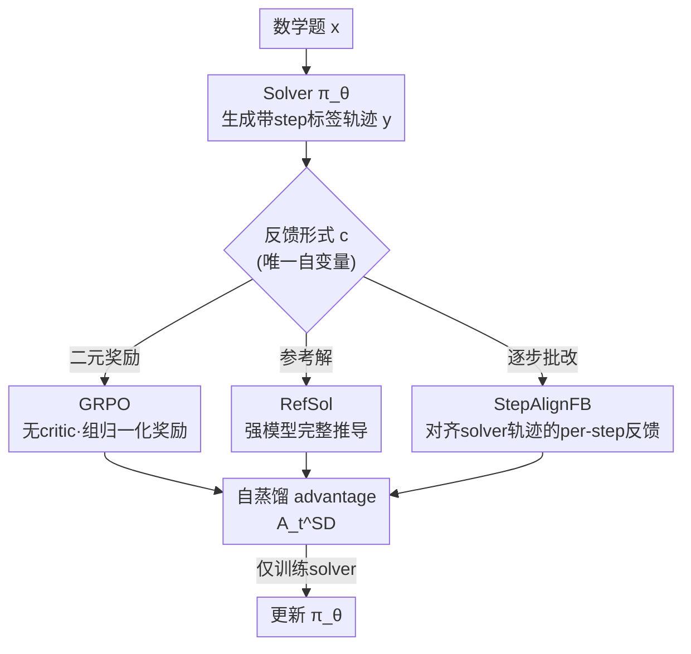

# The Role of Feedback Alignment in Self-Distillation

**会议**: ICML2026  
**arXiv**: [2606.11173](https://arxiv.org/abs/2606.11173)  
**代码**: 待确认  
**领域**: LLM推理 / 自蒸馏  
**关键词**: 自蒸馏, 反馈对齐, 过程监督, GRPO, 数学推理

## 一句话总结
本文系统研究了「自蒸馏」中上下文（context）的设计问题：在 solver–critic 框架下对比三种反馈形式后发现，与 solver 自身推理轨迹**逐步对齐**的批改式反馈（StepAlignFB）远胜二元奖励（GRPO，+16.11 分）和参考解（RefSol，+5.27 分 Avg@12），因为它只把蒸馏信号集中在 solver 真正出错的 token 上、放过已经正确的步骤，从而隐式实现了过程级监督（PRM 式信号）而无需训练奖励模型。

## 研究背景与动机

**领域现状**：提升 LLM 推理目前有两条主线。一条是 **RLVR（可验证奖励强化学习）**，以 GRPO 为代表，每条 rollout 只给一个标量奖励（最终答案对不对），不告诉模型推理过程哪一步错了，credit assignment 很困难。另一条是**蒸馏**，能给出 token 级的密集监督，但需要访问强教师的 logits——而强教师常常藏在 API 后面拿不到，或大规模迁移成本过高。

**现有痛点**：**自蒸馏（self-distillation）**同时绕开了这两个限制：同一个模型扮演两个角色——只看问题 $x$ 的 student，和额外看到上下文 $c$（执行轨迹、参考解、其他模型的反馈等）的 self-teacher——训练时最小化两个分布的散度，把「在上下文中涌现的能力」蒸馏进无上下文的策略里。但所有已有工作都把上下文 $c$ 当作**固定选择**，没人研究「上下文怎么设计会改变模型学到什么」。

**核心矛盾**：自蒸馏学到的东西完全取决于 self-teacher 收到什么上下文（见 per-token advantage 公式 $A_t^{\text{SD}}$，它直接由上下文对 next-token 预测的改变量决定），但当上下文是「另一个模型的反馈」时，从业者其实**有能力设计它的结构**——这个设计空间一直被忽略。一个完整正确的参考解看似是强信号，但在自蒸馏里它会**弥散到 solver 的整条 rollout**：因为另一种推导即便在正确步骤上，措辞和路径也和 solver 不同，于是模型被迫在每个 token（包括本来正确的步骤）都改变行为。

**本文目标**：在数学推理的 solver–critic 设定下，回答「什么形式的反馈能产生最有效的 self-teacher」。

**切入角度**：把「反馈形式」当作唯一自变量，固定 solver、损失、散度、所有超参，对比三种上下文，再用 per-token advantage 分析揭示机制。

**核心 idea**：反馈与 solver 推理轨迹的**结构对齐**（structural alignment）比反馈本身的「质量」更重要——逐步对齐的批改能把蒸馏信号精准压在出错 token 上，从而把自蒸馏天然带有的过程级信号进一步放大成 PRM 式的隐式过程监督。

## 方法详解

### 整体框架
本文是一个**对照研究**，框架本身就是经典自蒸馏的 solver–critic 训练回路，真正的贡献是其中「反馈形式」这一个旋钮的三种取值对比。流程是：对每道数学题 $x$，可训练的 solver $\pi_\theta$ 生成带 step 标签的推理轨迹 $y=\langle\text{step}_1\rangle\ldots\langle\text{step}_N\rangle\langle\text{answer}\rangle$；一个冻结的 critic $\pi_{\text{critic}}$ 根据 $x$ 和 solver 的回答产出反馈 $f$；然后用自蒸馏（Eq. 3）以 $f$ 作为上下文 $c$ 训练 solver——只有 solver 被训练，critic 全程冻结。

自蒸馏的损失是最小化 student（只看 $x$）和 self-teacher（看 $x+c$）的 per-token 散度：

$$\mathcal{L}_{\text{SD}}=\mathbb{E}_{y\sim\pi_\theta(\cdot\mid x)}\left[D\big(\pi_\theta(y\mid x)\,\big\|\,\text{sg}[\pi_\theta(y\mid x,c)]\big)\right]$$

其梯度形式等价于 $-\mathcal{J}_{\text{GRPO}}$，但 per-token advantage 变成：

$$A_t^{\text{SD}}(\hat{y}_t)=\log\pi_\theta(\hat{y}_t\mid x,c,y_{<t})-\log\pi_\theta(\hat{y}_t\mid x,y_{<t})$$

它量化「上下文把模型的 next-token 预测推了多少」。与 GRPO 那个在整条 rollout 内**恒定**的 advantage（$A_{i,t}=A_i^{\text{GRPO}}$）不同，$A_t^{\text{SD}}$ 在每个 token 位置都在变，天然带来密集的 credit assignment。本文的全部洞察都建立在「上下文 $c$ 的形式如何塑造这个 per-token advantage」之上。

### 关键设计

**1. 三种反馈形式的受控对比：把「反馈结构」隔离为唯一自变量**

为了干净地回答「什么反馈最有效」，作者固定 solver（Qwen3-1.7B）、损失（forward KL 散度）、所有超参，只改 self-teacher 看到的上下文 $c$，对比三个条件。**GRPO**：标准 RLVR 基线，solver 每题生成 $G=8$ 条 rollout，每条按二元奖励打分、做组归一化（$A_i^{\text{GRPO}}=(r_i-\bar{r})/\sigma(r)$），无 critic、无自蒸馏。**RefSol**：把一个更强模型产出的完整 CoT 参考解作为上下文，对应 zhao2026opsd 的设定。**StepAlignFB**：critic 同时收到 solver 的带 step 标签回答和数据集参考解，产出**逐步**反馈——提示它把正确步骤逐字照抄、只修改错误或不完整的步骤，并尽量贴近 solver 的推理轨迹。这种「单变量」设计让任何效果差异都只能归因于反馈结构本身。

**2. 逐字照抄正确步骤：用 in-context copying 锐化 advantage 估计**

StepAlignFB 一个看似细枝末节、实则关键的设计是**要求 critic 对正确步骤逐字照抄**而非改写。作者观察到逐字照抄会激活模型的 in-context copying 行为（induction head 机制），这会**锐化 advantage 估计、尤其是对正确步骤的估计**。直觉是：当 self-teacher 的上下文里原封不动地含有 solver 的正确步骤时，$\pi_\theta(\hat{y}_t\mid x,c,y_{<t})$ 在这些 token 上会被强烈强化，使 $A_t^{\text{SD}}$ 在正确 token 上明确为正、在错误 token 上为负，从而得到干净的正负分离信号。相比之下，若让 critic 自由复述正确步骤，措辞差异会污染这些位置的 advantage。

**3. 反馈对齐而非反馈质量：让信号集中在出错 token，避免弥散**

这是全文的核心机制。RefSol 提供的是一条**完整正确**的推导，信息质量很高，但它在 surface form 上几乎必然与 solver 的轨迹不同——即便在 solver 本来就对的步骤上，措辞、变量命名、推导路径都不一样。结果自蒸馏 advantage 在整条 rollout 上**弥散**，模型被迫在每个 token（包括正确步骤）都改变行为，反而压制了本来正确的轨迹。StepAlignFB 因为针对 solver 的真实轨迹做逐步批改，把分布偏移**集中在出错相邻的 token**上、放过正确步骤——per-token advantage 分析显示它的行为「像一个过程奖励模型（PRM）」：强化正确步骤、抑制错误步骤。换言之，自蒸馏本身已经通过 token 级 advantage 提供了一种过程级信号，StepAlignFB 只是把这个信号**精准放大到出错处**。这套隐式过程监督达到了 PRM 的效果，却**无需训练奖励模型、也无需收集 per-step 标量标注**。

### 损失函数 / 训练策略
散度用 forward KL；自蒸馏实验组 size $G=1$、GRPO 用 $G=8$；温度 $T=1.1$、最大 2048 token，全程 on-policy 采样。沿用 zhao2026opsd 的 Thinking-Mode-Off student / Thinking-Mode-On teacher 配对，teacher 固定为初始（无 LoRA）基策略（在 teacher 前向时关掉 adapter，不另加载 teacher checkpoint）。LoRA（$r=64$, $\alpha=128$）训练全部 attention/MLP 投影，AdamW、学习率 $5\times10^{-6}$、有效 batch 32、bf16，4×H100。StepAlignFB 的 critique 由冻结的 Qwen/QwQ-32B 贪心解码（$T=0$）每条 rollout 生成一次，剥掉 `<think>` 推理痕迹只拼接结构化批改输出，靠 vLLM 自动前缀缓存抵消长 prompt 开销。数据是从 OpenMathReasoning 按难度和格式筛出的 312 题（30 测、282 训），保留对 1.7B 而言较难（Avg@16 < 5/16）但 critic 可解的题，训练至多 7 epoch。

## 实验关键数据

### 主实验：三种反馈各指标最优值（OpenMathReasoning 30 题测试集，n=12）

| 方法 | Pass@12 | Maj@12 | Avg@12 | 平均答案长度 |
|------|---------|--------|--------|------------|
| GRPO | 76.67 (s=40) | 26.67 (s=50) | 19.72 (s=30) | **1681.49** (s=50) |
| RefSol | 86.67 (s=60) | 43.33 (s=60) | 30.56 (s=40) | 1935.83 |
| StepAlignFB | **90.00** (s=60) | **56.67** (s=50) | **35.83** (s=50) | 1996.07 |

s 为达到该指标最优的训练步。每个 (方法, 指标) 取所有 checkpoint 中的最优值（因不同方法在不同步达峰，逐指标独立选 checkpoint）。

### 关键差距分解

| 对比 | Pass@12 | Maj@12 | Avg@12 |
|------|---------|--------|--------|
| StepAlignFB − RefSol | +2.33 | **+13.33** | +5.27 |
| StepAlignFB − GRPO | — | — | **+16.11** |

### 关键发现
- **StepAlignFB 全面领先**：尽管从没见过 ground-truth 推导，它在所有聚合式准确率指标上都超过 RefSol，Avg@12 +5.27、Maj@12 +13.33。Majority-Vote 的大幅领先尤其说明它的策略把概率**更尖锐地集中**在正确答案上（而非仅仅覆盖到），这正是最受益于测试时聚合的 regime。
- **机制是 token 级 credit assignment**：per-token advantage 分析显示 StepAlignFB 的自蒸馏信号「像 PRM」——强化 solver 轨迹中的正确步骤、抑制错误步骤；而 RefSol 连完全正确的 solver 轨迹也一起压制，信号弥散。
- **自蒸馏整体压制 GRPO**：除答案长度外（GRPO token 效率更高），RefSol 和 StepAlignFB 在整个训练过程中准确率都高于 GRPO，最终 Avg@12 差距约 8 分。注意自蒸馏在**等算力**下每步消耗的 prompt 数是 GRPO 的 $1/8$（$G=1$ vs $G=8$），但都训 7 epoch，排除了数据曝光量的混淆。
- **需要早停 + 逐 checkpoint 选择**：5–6 epoch 即达峰，固定的 end-of-run 评测会系统性低估自蒸馏的天花板，因此必须在留出验证集上逐 checkpoint 选优才公平。

## 亮点与洞察
- **「反馈对齐 ≥ 反馈质量」是一个反直觉但很硬的结论**：一条完整正确的参考解信息量更大，却因为 surface form 偏离 solver 轨迹而在自蒸馏里弥散；逐步对齐的批改即便信息量更少，却因结构对齐而把信号精准压在错处——这把研究者对「好反馈」的认知从「内容对不对」推向「结构贴不贴」。
- **用 per-token advantage $A_t^{\text{SD}}$ 把抽象的「信号弥散 vs 集中」可视化**很巧妙，直接证明 StepAlignFB 在做隐式过程监督，给出了「为什么有效」的机制证据而非只报点数。
- **「逐字照抄正确步骤激活 induction head 锐化 advantage」**是一个可复用的 trick：在任何需要让自蒸馏 teacher 上下文保留 student 正确部分的场景，都可借照抄来稳定 credit assignment。
- 工程价值：**无需训练 PRM、无需 per-step 标注**就拿到过程级监督，对缺乏标注预算、又拿不到强教师 logits 的团队很友好。

## 局限与展望
- **规模与数据极小**：只在 Qwen3-1.7B、312 题 OpenMathReasoning 子集上验证，且是 ICML 2026 RLxF workshop 论文，结论的普适性需更大模型/更大数据集验证。
- **依赖一个强 critic（QwQ-32B）能解题**：数据筛选要求 critic 自身可解，否则 RefSol 和 StepAlignFB 会退化成同一设定；这限制了在 critic 也搞不定的真·难题上的适用性。
- 自己发现：逐 checkpoint 选最优值的报告方式虽然作者论证合理（不同方法不同步达峰），但天然偏乐观，跨方法比较时需留意 s 步不同带来的可比性 caveat；GRPO 的 token 效率优势（答案更短）在某些部署场景可能比准确率更重要。

## 相关工作与启发
- **vs GRPO / RLVR**：RLVR 每条 rollout 只有一个标量奖励、credit assignment 困难；本文用自蒸馏的 token 级 advantage 提供密集监督，Avg@12 领先 16.11 分，且在等算力下用 $1/8$ 的 prompt 数。
- **vs 标准蒸馏 / On-Policy Distillation**：传统蒸馏需要强教师 logits（API 后常拿不到）；自蒸馏用同一模型双角色绕开这一限制。本文相对 OPD 的增量在于：首次系统研究「上下文/反馈形式的设计」如何改变学到的东西，而非把上下文当固定选择。
- **vs RefSol（zhao2026opsd）**：RefSol 用完整参考解作上下文，本文证明这会让信号弥散、压制正确步骤；StepAlignFB 用对齐 solver 轨迹的逐步批改替代，在所有聚合准确率指标上更优。
- **vs PRM（Lightman et al., Uesato et al.）**：PRM 需要训练奖励模型并收集 per-step 标注；StepAlignFB 用反馈对齐隐式复现了 PRM 的 token 级定位效果，免去了这些成本。

## 评分
- 新颖性: ⭐⭐⭐⭐ 首次把「自蒸馏上下文设计」当研究对象，反馈对齐 > 反馈质量的结论清晰
- 实验充分度: ⭐⭐⭐ 机制分析扎实，但模型(1.7B)与数据(312题)规模偏小，是 workshop 论文
- 写作质量: ⭐⭐⭐⭐⭐ 问题动机锐利，per-token advantage 机制讲得透
- 价值: ⭐⭐⭐⭐ 给「无 PRM/无强教师 logits」团队一条拿到过程监督的实用路径

<!-- RELATED:START -->

## 相关论文

- [\[AAAI 2026\] In-Token Rationality Optimization: Towards Accurate and Concise LLM Reasoning via Self-Feedback](../../AAAI2026/llm_reasoning/in-token_rationality_optimization_towards_accurate_and_concise_llm_reasoning_via.md)
- [\[ICML 2026\] Prompt Injection as Role Confusion](prompt_injection_as_role_confusion.md)
- [\[ICML 2026\] Reward Modeling from Natural Language Human Feedback](reward_modeling_from_natural_language_human_feedback.md)
- [\[ICML 2026\] Critique-GRPO: Advancing LLM Reasoning with Natural Language and Numerical Feedback](critique-grpo_advancing_llm_reasoning_with_natural_language_and_numerical_feedba.md)
- [\[ACL 2025\] Revisiting Self-Consistency from Dynamic Distributional Alignment Perspective on Answer Aggregation](../../ACL2025/llm_reasoning/revisiting_self-consistency_from_dynamic_distributional_alignment_perspective_on.md)

<!-- RELATED:END -->
