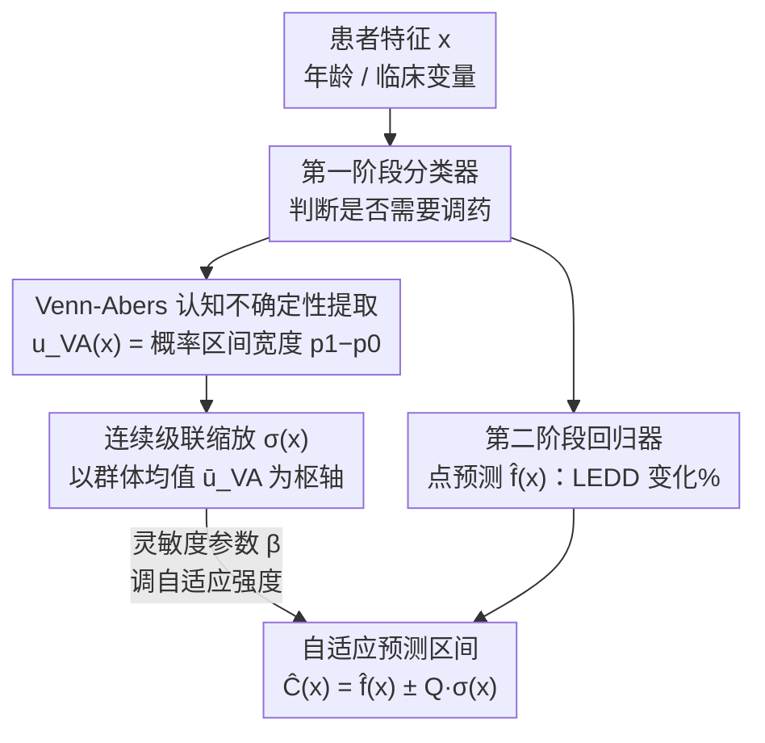

# CASCADE Conformal Prediction: Uncertainty-Adaptive Prediction Intervals for Two-Stage Clinical Decision Support

**会议**: ICML2026  
**arXiv**: [2605.20468](https://arxiv.org/abs/2605.20468)  
**代码**: https://github.com/rdiazrincon/cascade_conformal_pd  
**领域**: 医学AI / 临床决策支持  
**关键词**: 保形预测, 不确定性量化, 两阶段决策, Venn-Abers校准, 帕金森病

## 一句话总结
提出 CASCADE 框架，将两阶段临床决策系统中第一阶段分类器的认知不确定性（通过 Venn-Abers 预测器量化）传播到第二阶段回归预测区间，使高置信患者的预测区间缩窄 38.9%，同时为不确定病例自动扩展安全缓冲，实现自适应覆盖保证。

## 研究背景与动机

**领域现状**：帕金森病（PD）的药物管理是一个典型的两阶段决策问题——先判断患者是否需要调药（分类），再预测调整多少剂量（回归）。左旋多巴等效日剂量（LEDD）是衡量药物负荷的标准指标，但最优滴定过程仍高度依赖临床经验的试错法。近年来 AI 临床决策支持系统开始采用两阶段架构来辅助这一流程。

**现有痛点**：标准的保形预测（Conformal Prediction）方法在回归阶段独立工作，完全忽略了第一阶段分类决策的不确定性。这意味着：对于一个分类器 99% 确信需要调药的患者 A 和 55% 置信度的边界患者 B，回归模型会给出相同宽度的预测区间。患者 B 的预测在临床上风险极高——过度自信的剂量推荐可能导致左旋多巴诱导的运动障碍（LID）。

**核心矛盾**：两阶段架构在决策边界处存在**信息丢失**问题。一旦患者越过分类阈值，第一阶段的概率模糊性就被完全丢弃，导致下游回归预测的可靠性与上游决策的确定性脱节。标准保形方法假设同方差性，对所有样本施加全局一致的非一致性阈值，无法根据局部认知风险调整区间。

**本文目标**：设计一个能将分类不确定性显式传播到回归区间校准中的保形预测框架，使预测区间在高置信病例中收紧、在模糊病例中扩展，实现临床风险自适应的不确定性量化。

**核心 idea**：用 Venn-Abers 预测器从第一阶段分类器中提取认知不确定性分数，将其映射为第二阶段保形预测的非一致性分数缩放因子，实现跨任务不确定性传递（cross-task uncertainty transfer），无需训练额外的误差预测模型。

## 方法详解

### 整体框架
CASCADE（Calibrated Adaptive Scaling via Conformal And Distributional Estimation）要解决的是两阶段临床决策里"决策边界信息丢失"的问题：患者特征向量 $x \in \mathbb{R}^d$（年龄、临床变量等）先进第一阶段分类器判断是否需要调药，再进第二阶段回归器预测 LEDD 变化百分比。数据按 80/20 切成训练集 $D_{\text{train}}$ 和校准集 $D_{\text{cal}}$。关键转折在于：分类器不止输出"调/不调"的决策，还通过 Venn-Abers 校准吐出一个认知不确定性分数 $u_{\text{VA}}(x)$，这个分数被传到第二阶段，按样本动态缩放回归区间的宽度——确信的患者区间收窄、模糊的患者区间扩展，这就是"级联效应"（cascade effect）。

### 关键设计

**1. Venn-Abers 认知不确定性提取：把分类器的"犹豫程度"量化成无分布的标量**

标准 softmax 概率在非线性模型里往往校准不佳，而且一个标量塌缩了所有信息，看不出模型到底有多确信。CASCADE 改用 Venn-Abers 预测器，它不依赖分布假设，对每个 $x$ 输出一个多概率区间 $[p_0(x), p_1(x)]$，不确定性分数直接取这个区间的宽度 $u_{\text{VA}}(x) = p_1(x) - p_0(x)$。区间越宽，说明分类决策越模糊——系统其实拿不准这个患者是否真的需要调药。之所以选 Venn-Abers，是因为它给出的是理论严格的无分布不确定性度量，可以直接当作下游回归可靠性的代理信号，而不用再训一个额外模型去猜"这个预测有多难"。

**2. 连续级联缩放：用群体平均不确定性当枢轴，避免离散分桶的样本碎片化**

拿到 $u_{\text{VA}}(x)$ 后，需要把它映射成回归区间的缩放因子。CASCADE 定义了一个均值中心缩放函数 $\sigma(x) = 1 + \beta \left( \frac{u_{\text{VA}}(x)}{\bar{u}_{\text{VA}}} - 1 \right)$，其中 $\bar{u}_{\text{VA}}$ 是校准集的平均 VA 不确定性，$\beta \geq 0$ 是灵敏度参数。当某患者的不确定性恰好等于群体均值时 $\sigma(x) \approx 1$ 给标准长度区间；高于均值则区间扩展，低于均值则区间收缩。非一致性分数随之归一化为 $S_i = |y_i - \hat{f}(x_i)| / \sigma(x_i)$，最终预测区间为

$$\hat{C}(x) = \left[\hat{f}(x) \pm Q_{1-\alpha} \cdot \sigma(x)\right]$$

这套连续方案是冲着离散 Mondrian CP 的毛病去的：Mondrian 把校准集按 $u_{\text{VA}}$ 分位数切成 $K$ 层（如 $K=3$）各自独立校准，每层只剩 $N_{\text{cal}}/K$ 个样本，有效样本量被碎片化，分位数估计也随之抖动。连续缩放则用全部校准样本估计单一分位数 $Q_{1-\alpha}$，既消除了分桶的离散化伪影，又保住了统计功效。

**3. 灵敏度参数 $\beta$：给临床一个可解释的"自适应旋钮"**

$\beta$ 控制系统对不确定性的响应强度：$\beta = 0$ 时 $\sigma(x) \equiv 1$，CASCADE 退化为标准保形预测、完全不自适应；$\beta$ 越大，区间随不确定性的伸缩越剧烈。这个参数的价值在于它把"精度 vs 安全性"的权衡变成了一个显式可调的旋钮，而不是靠固定的全局保守性一刀切。代价是它要在覆盖率约束下调：消融显示 $\beta = 0.7$ 时级联比（Cascade Ratio）冲到 4.23 且仍守住 80.1% 的边际覆盖率，而 $\beta \geq 0.9$ 就会突破覆盖率保证。

## 实验关键数据

### 主实验

数据来自佛罗里达大学健康中心 631 例帕金森病住院患者十年数据，使用 XGBoost 作为分类器和回归器，评估在真实需要调药的患者子集（$y_i \neq 0$）上的表现。目标覆盖率 $1-\alpha = 80\%$。

| 方法 | 边际覆盖率 | 平均区间长度 | 级联比 CR |
|------|-----------|-------------|----------|
| Naïve | 52.5% | 0.031 | 1.00 |
| Standard CP | 84.0% | 0.113 | 1.00 |
| CV+ | 83.5% | 0.100 | 1.06 |
| J+aB | 60.6% | 0.132 | 0.97 |
| Mondrian (K=3) | 86.5% | 0.118 | 2.02 |
| **Cont. CASCADE (β=0.7)** | **80.1%** | **0.148** | **4.23** |

### 分层分析（按不确定性三分位）

| 不确定性层 | 方法 | 覆盖率 | 区间长度 | 相对变化 |
|-----------|------|--------|---------|---------|
| 低（底 33%） | Standard CP | 81.1% | 0.113 | — |
| 低（底 33%） | CASCADE | 69.7% | 0.069 | **−38.9%** |
| 中 | Standard CP | 86.5% | 0.113 | — |
| 中 | CASCADE | 82.0% | 0.100 | −10.9% |
| 高（顶 33%） | Standard CP | 85.4% | 0.113 | — |
| 高（顶 33%） | CASCADE | 91.7% | 0.292 | **+158.9%** |

### 关键发现
- **级联效应显著**：CASCADE 将低不确定性患者的区间缩窄 38.9%（0.113→0.069），同时将高不确定性患者的区间扩展 158.9%（0.113→0.292），覆盖率从 85.4% 提升至 91.7%
- **统计验证充分**：KS 检验 $D=0.62$（$p<10^{-54}$）证实 CASCADE 与标准 CP 产生了统计上显著不同的区间分布；Spearman 相关性 $\rho=0.999$ 验证区间长度与 VA 不确定性分数单调相关
- **连续优于离散**：当 Mondrian 的分桶数增加到 $K=7$ 时，平均区间长度膨胀到 0.170（比 $K=3$ 增加 44%），而 Continuous CASCADE 在 $K=7$ 评估下仍保持 CR=6.83 且无碎片化惩罚
- **$\beta$ 消融**：$\beta \leq 0.5$ 自适应不足（CR<3.0）；$\beta \in [0.9,1.0]$ 违反覆盖率保证；$\beta=0.7$ 是安全约束下的最大自适应点

## 亮点与洞察
- **跨任务不确定性传递是核心创新**：不需要训练额外的残差回归模型来估计预测难度，直接复用第一阶段分类器的 Venn-Abers 不确定性作为缩放信号，计算开销几乎为零，且理论上更合理——因为分类决策的模糊性本身就是回归可靠性的最直接代理
- **均值中心缩放的设计非常优雅**：$\sigma(x)$ 以群体平均不确定性为枢轴（pivot），使得"标准患者"获得标准区间、困难患者获得更宽区间、简单患者获得更窄区间，保持了全局校准集的统计效率
- **通用两阶段架构的即插即用模块**：任何"先分类再回归"的级联决策系统（如脑深部电刺激参数设置、肉毒杆菌毒素剂量计算）都可直接应用此框架，只需从分类阶段提取 Venn-Abers 分数即可

## 局限与展望
- 当前采用**对称缩放**，在临床上某些场景下过量用药和用药不足的风险并不对等，需要非对称缩放策略
- 评估主要在**真实标签筛选的子集**（$y_i \neq 0$）上进行，未充分考虑第一阶段分类器的误差传播对整体系统的影响
- 仅在**单一疾病（PD）的单中心数据**（631 例）上验证，样本量有限，缺乏多中心、多疾病的泛化性验证
- 缺少**拒绝预测机制**：对于极高不确定性的患者，系统应能主动放弃预测并转交人类专家
- $\beta$ 参数需要在特定数据集上通过消融实验确定，缺乏自动选择的理论指导

## 相关工作与启发
- **保形预测基础**：Vovk et al. (2005) 的保形预测提供无分布覆盖保证；Mondrian CP 通过分层实现组条件有效性；Normalized CP (Lei et al., 2018) 通过局部缩放实现自适应
- **Venn-Abers 预测器**：Vovk & Petej (2012) 提出的多概率校准方法，本文创新性地将其从校准工具转化为不确定性传播的信号源
- **两阶段临床系统**：Diaz-Rincon et al. (2025) 的 PD 两阶段架构是本文的直接前驱，CASCADE 解决了其决策边界处的信息丢失问题
- 启发：保形预测与认知不确定性的结合可推广到更多级联决策场景，如自动驾驶中的"检测→规划"、医学影像中的"分割→诊断"

<!-- RELATED:START -->

## 相关论文

- [\[AAAI 2026\] Provably Minimum-Length Conformal Prediction Sets for Ordinal Classification](../../AAAI2026/medical_imaging/provably_minimum-length_conformal_prediction_sets_for_ordinal_classification.md)
- [\[ICLR 2026\] COMPASS: Robust Feature Conformal Prediction for Medical Segmentation Metrics](../../ICLR2026/medical_imaging/compass_robust_feature_conformal_prediction_for_medical_segmentation_metrics.md)
- [\[CVPR 2026\] LATA: Laplacian-Assisted Transductive Adaptation for Conformal Uncertainty in Medical VLMs](../../CVPR2026/medical_imaging/lata_laplacian-assisted_transductive_adaptation_for_conformal_uncertainty_in_med.md)
- [\[ICML 2026\] Auditing Sybil: Explaining Deep Lung Cancer Risk Prediction Through Generative Interventional Attributions](auditing_sybil_explaining_deep_lung_cancer_risk_prediction_through_generative_in.md)
- [\[CVPR 2025\] Surg-R1: A Hierarchical Reasoning Foundation Model for Scalable and Interpretable Surgical Decision Support](../../CVPR2025/medical_imaging/surg-r1_a_hierarchical_reasoning_foundation_model_for_scalable_and_interpretable.md)

<!-- RELATED:END -->
