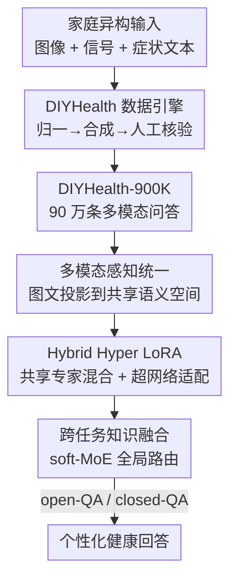

# DIYHealth Suite: Dataset, Model, and Benchmark for Health Management at Home

**会议**: ICML 2026  
**arXiv**: [2606.07542](https://arxiv.org/abs/2606.07542)  
**代码**: 待确认  
**领域**: 医学图像 / AI for Healthcare  
**关键词**: 家庭健康管理, 多模态数据集, 参数高效微调, MoE-LoRA, 超网络

## 一句话总结
针对"在家自己管健康"（Diagnosis-It-Yourself）这一被现有医疗大模型忽视的场景，本文一口气交付了数据集（DIYHealth-900K，90 万条多模态家庭健康问答）、模型（DIYHealthGPT，核心是新提出的 H2LoRA 参数高效微调机制）、基准（DIYHealthBench，首个覆盖 11 项家庭健康任务的评测），在通用与医疗专用基线上都取得 SOTA。

## 研究背景与动机

**领域现状**：医疗基础模型（LLaVA-Med、HuatuoGPT-Vision、MedGemma 等）近两年发展迅猛，能做放射报告生成、医学影像解读、临床问答。但它们几乎全部是"临床中心"的——依赖医院级设备采集的高质量数据和专家标注，服务对象是医院里的专业医护。

**现有痛点**：随着可穿戴设备、手机、家用传感器普及，医疗正在向"居家自诊自管"迁移，但这个场景下临床模型水土不服。一是**数据异构且质量低**：家里用消费级设备和自述输入，信号噪声大、格式杂乱，而且没有标准化的大规模家庭健康数据集，模型无从训起；二是**需要个性化适配**：医院里"群体级"模型够用，但居家管理面对的是每个人差异巨大、还会随时间漂移的个人健康基线；三是**任务太散没有统一标尺**：从日常监测到慢病风险评估再到个性化建议，跨度极大，却没有统一基准能横向比较模型在这些任务上的表现。

**核心矛盾**：临床数据的"高质量、标准化、群体化"假设，与家庭场景的"低质量、异构、强个性化"现实之间存在根本错配，导致现有医疗大模型无法直接迁移到居家健康管理。

**本文目标**：拆成三个可落地的子问题——怎么造出一份可靠的家庭健康多模态数据？怎么让一个基础模型既能跨任务共享知识、又能对个体做实例级适配？怎么定义一套能公平评测家庭健康 AI 的基准？

**切入角度**：作者认为这三件事必须配套交付才有意义——光有模型没数据训不动，有模型有数据没基准评不出。于是用一个"数据引擎 + 自适应模型 + 统一基准"的生态来一揽子解决。

**核心 idea**：用一套带人工核验的 LLM 数据合成引擎造数据，用"共享低秩专家混合 + 超网络驱动适配"的 H2LoRA 同时拿下跨任务共享和实例级个性化，再用首个家庭健康基准做统一评测。

## 方法详解

### 整体框架
DIYHealth Suite 是一个三件套生态：**输入**是家庭场景下的异构信号（手机拍的食物/皮肤/口腔图、可穿戴采的心率睡眠、自述症状文本），**输出**是面向居家健康管理的开放式建议（open-QA）与结构化决策（closed-QA）。中间经过三个核心组件串联：先用 **DIYHealth 数据引擎**把脏乱的家庭数据合成、归一、人工核验成 90 万条高质量多模态问答（DIYHealth-900K）；再用 **DIYHealthGPT** 把图文统一编码后送入冻结的 LLM 主干，靠 **H2LoRA** 这套自适应微调机制做领域 + 个体适配；最后用 **DIYHealthBench** 在 11 项任务上多维度评测。

模型侧（DIYHealthGPT）本身又是一条多阶段流水线：多模态感知统一 → H2LoRA 任务级适配（含跨任务融合）→ 四阶段渐进训练。下图给出从原始家庭数据到最终个性化回答的整体流向：

### 关键设计

**1. DIYHealth 数据引擎：用 LLM 合成 + 人工核验把脏乱家庭数据变成可训的统一语料**

家庭数据最大的问题是异构、低质、且没有现成大规模标注集。作者没有为每个任务孤立地造数据，而是设计了一个模块耦合的合成引擎，强制跨任务的语义一致性和场景真实性，由四个组件构成：**语言与信号归一器**先把医学缩写、术语、信号预处理标准化，建立共享语义和统计基底；**提示与模板库**编码任务目标、模态约束、用户视角，同时支持纯文本 QA 与视觉问答（VQA）、开放与封闭格式、第一/第三人称叙述；**语义 QA 合成器**用 Claude 3 Haiku 在共享 schema 下批量生成 QA 对，保证不同任务/模态遵循一致的临床语义而非各自为政；**人在回路验证器**让专家对生成结果多轮独立评审，重点核查家庭场景可用性、语义正确性、医学一致性，形成质量控制闭环。最终整合 3 家机构私有数据 + Kaggle/PhysioNet/Figshare 等 20 个公开源，覆盖人口统计、体征、化验、医疗对话、问卷等多种类型，归到三大任务族（个性化健康管理、慢病风险评估、日常健康监测）共 11 项任务。

**2. 多模态感知统一：把家庭场景的图和文映射进同一语义空间**

居家健康信号天然是图文混合的（食物图、皮肤图、症状描述）。给定图像 $\mathcal{I}\in\mathbb{R}^{H\times W\times 3}$，用预训练视觉编码器得到 patch 级表示 $\mathcal{V}=\mathcal{E}_v(\mathcal{I})\in\mathbb{R}^{L_v\times d_v}$；文本经 tokenizer 与 embedding 层得到 $\mathcal{U}=\mathcal{E}_t(\mathcal{T})\in\mathbb{R}^{L_t\times d}$。关键是一个可学习投影 $\mathcal{P}_v:\mathbb{R}^{d_v}\to\mathbb{R}^{d}$ 把视觉嵌入对齐到语言空间，再拼接成统一表示 $\mathcal{Z}=[\mathcal{P}_v(\mathcal{V});\mathcal{U}]\in\mathbb{R}^{(L_v+L_t)\times d}$。这就构成一个"异构→同构"接口 $\Phi:(\mathcal{I},\mathcal{T})\mapsto\mathcal{Z}$，让 LLM 主干能在统一语义空间里对家庭图文信号做下游推理，是后续所有适配的输入基础。

**3. H2LoRA：用共享低秩专家混合 + 超网络偏移，同时拿下跨任务共享与实例级个性化**

这是全文的技术核心，针对传统 LoRA 的两难——给每个任务单独配 adapter 会切断跨任务知识共享，而完全共享一个 adapter 又抹掉了任务细粒度差异。H2LoRA 用两个互补机制破局。其一是**共享低秩专家混合**：把主干权重 $\Theta\in\mathbb{R}^{d_{out}\times d_{in}}$ 增广为一个跨专家共享的低秩投影 $\mathbf{A}^t$（作为锚点促进子空间对齐）加上 $K$ 个专家矩阵 $\{\mathbf{B}^t_1,\dots,\mathbf{B}^t_K\}$；借鉴 MoE，由路由层据任务嵌入生成专家权重 $\mathcal{W}^t\in\mathbb{R}^K$（softmax 归一），沿秩维扩展为 $\hat{\mathcal{W}}^t=K\mathcal{W}^t/r\otimes\mathbf{1}_r$，再得任务自适应投影 $\mathbf{B}^t=\hat{\mathcal{W}}^t\odot\text{Concat}(\mathbf{B}^t_1,\dots,\mathbf{B}^t_K)$，在"全共享"与"全隔离"之间取得既高效又有表达力的折中。其二是**超 LoRA 适配**：为捕捉患者间的个体差异，给 $\mathbf{A}^t$ 和 $\mathbf{B}^t_k$ 都配上由超网络按实例动态生成的偏移 $\Delta\mathbf{A}^t=\mathcal{H}_A(\mathcal{Z})$、$\Delta\mathbf{B}^t_k=\mathcal{H}_B(\mathcal{Z})$，任务级输出为 $\mathcal{O}^t_{H^2LoRA}=\mathcal{Z}\mathbf{A}^t\mathbf{B}^t+\mathcal{Z}\Delta\mathbf{A}^t\Delta\mathbf{B}^t$。由于超网络以 $\mathcal{Z}$ 为条件，适配从"粗粒度任务级"细化到"实例感知"，真正契合家庭场景的个体异质性。这正是它区别于 MoELoRA（只强调特征级专家多样、缺跨任务协同）和 HyperLoRA（直接生成任务 LoRA 权重、优化困难且难共享参数）的地方。

**4. 跨任务知识融合：用全局 soft-MoE 路由挖掘家庭健康任务间的强相关**

家庭健康任务彼此高度相关——饮食直接影响糖尿病和肥胖风险、早期症状识别又为后续用药推荐和建议生成提供上下文。作者引入一个全局 soft-MoE 路由 $\mathcal{R}$，把每个任务的 H2LoRA 块当作一个专家，据共享嵌入 $\mathcal{Z}$ 分配混合权重 $\beta=(\beta^1,\dots,\beta^N)=\mathcal{R}(\mathcal{Z})$（$\beta^t\geq 0,\sum_t\beta^t=1$），最终更新 $\mathcal{O}_{H^2LoRA}=\mathcal{Z}\Theta+\sum_{t=1}^N\beta^t\mathcal{O}^t_{H^2LoRA}$。这样在严格参数预算下，任务内由共享 $\mathbf{A}^t$ 学共性、专家 $\mathbf{B}^t_k$ 抓任务特异、超网络偏移做实例调制，任务间再由全局路由按上下文整合关联，实现"效率—特异—个性化"三者兼顾。

### 损失函数 / 训练策略
四阶段渐进训练：**阶段 1 跨模态对齐**，用 PubMedVision 与 LLaVA-558k 单训投影器 $\mathcal{P}_v$；**阶段 2 医学域适配**，联合微调 $\mathcal{P}_v$ 与主干，在 DIYHealth-900K 的 11 项任务上每任务均匀采 10% 子集做 SFT，注入医学知识同时降过拟合；**阶段 3 任务专家训练**，逐任务训练专属 H2LoRA 块（冻结其余参数），随后用 hard-MoE 层（一次只激活一个专家）在全多任务集上联合优化；**阶段 4 跨任务知识迁移**，把 hard-MoE 换成全局 soft-MoE 路由 $\mathcal{R}$ 再微调，打通任务间相关性。

## 实验关键数据

### 主实验
评测在 DIYHealthBench 上进行：从 DIYHealth-900K 测试集导出，共 12,167 个样本，每任务随机采 1%（小数据集至少 1,000 例）以保证统计可靠，并在任务族、模态、疾病类别间做平衡。closed-QA 用准确率（ACC）+ 马修斯相关系数（MCC）；open-QA 用内容级指标 F1-RadGraph、F1-BioBERT 衡量医学语义保真度，加语言级 BLEU、ROUGE-L 衡量流畅度与文本重合。共比 18+ 个基线（通用 + 医疗专用），11 项任务做 open-QA、10 项做 closed-QA（用药推荐天然多标签更适合 open-QA）。

| closed-QA 平均 (10 任务) | ACC | MCC | 说明 |
|--------|------|------|------|
| InstructBLIP-7B | 14.35 | 8.54 | 通用模型，家庭任务几乎失效 |
| Llama 3.2-11B | 47.42 | 33.12 | 通用模型 |
| Yi-VL-6B | 59.46 | 46.08 | 通用模型 |
| InternVL3-8B | 68.79 | 59.59 | 较强通用基线 |
| **DIYHealthGPT** | **SOTA** | **SOTA** | 在通用与医疗专用基线上均最优（详见原文 Table 1） |

> ⚠️ 论文正文报告 DIYHealthGPT 在 closed-QA 与 open-QA 两种设置、11 项家庭健康任务上一致超越所有通用与医疗专用基线；上表平均列为可读到的基线数值，DIYHealthGPT 具体逐任务数值以原文 Table 1 为准。

### 消融实验

| 配置 | 作用 | 预期影响 |
|------|------|---------|
| Full (H2LoRA + 跨任务融合) | 完整模型 | 最优 |
| w/o 共享低秩专家混合 | 退化为普通任务隔离/全共享 LoRA | 跨任务共享或任务特异性受损 |
| w/o 超网络偏移 | 去掉实例级 $\Delta\mathbf{A},\Delta\mathbf{B}$ | 失去个性化，掉在个体差异大的任务 |
| w/o 跨任务 soft-MoE 路由 | 任务间不再协同 | 强相关任务（饮食↔糖尿病/肥胖）表现下降 |

> ⚠️ 消融的具体掉点幅度以原文为准，此处按方法设计给出定性预期。

### 关键发现
- 通用 LVLM（如 InstructBLIP）在家庭健康任务上几乎失效（closed-QA 平均 ACC 仅 14），印证家庭场景与通用图文任务分布差异巨大、必须专门适配。
- H2LoRA 的两个机制各司其职：共享专家混合负责跨任务知识共享，超网络偏移负责实例级个性化——两者缺一都会在"任务多样 + 个体异质"的家庭场景掉点。
- 把任务间相关性显式建模（soft-MoE 全局路由）能进一步提升，说明家庭健康任务不是孤立的，联合建模有增益。

## 亮点与洞察
- **"数据-模型-基准"配套交付**：不是单点贡献，而是把一个新场景（居家自管健康）所需的三块拼图一次补齐，对后续研究是可直接复用的地基。
- **H2LoRA 的双层设计很巧**：共享低秩锚点 $\mathbf{A}^t$ + MoE 专家 $\mathbf{B}^t$ 解决"任务级"的共享与特异，超网络偏移再叠一层"实例级"个性化，把 LoRA 从"任务自适应"推进到"实例自适应"，这套思路可迁移到任何需要强个性化的多任务 PEFT 场景。
- **人在回路的数据引擎**：用 LLM 合成大规模数据、再用多轮专家核验兜底医学正确性，是低成本造高质量医疗语料的可复用范式。

## 局限与展望
- 数据虽经人工核验，但核心仍是 LLM（Claude 3 Haiku）合成，合成数据与真实居家分布的差距、以及生成器自身偏差能否被完全过滤，仍需真实世界验证。
- 个性化依赖超网络对实例嵌入 $\mathcal{Z}$ 的条件生成，当个体信号极端稀疏或异常时，实例级适配是否稳健、会不会给出有风险的健康建议，论文未深入安全性评估。
- 11 项任务虽覆盖三大族，但居家健康的长尾场景（罕见病、急症识别）尚未触及；作为家庭自诊系统，误诊的临床后果远比通用 QA 严重，落地需配套免责与转诊机制。

## 相关工作与启发
- **vs 临床医疗大模型（LLaVA-Med / MedGemma / HuatuoGPT-Vision）**：它们做医院级临床任务、依赖高质量标注；本文转向消费级、自述、强个性化的家庭场景，并自带数据引擎补上数据缺口。
- **vs MoELoRA**：MoELoRA 强调特征级专家多样性但缺跨任务协同；H2LoRA 用共享锚点 + 全局 soft-MoE 显式建模任务间相关。
- **vs HyperLoRA**：HyperLoRA 直接用超网络生成整套任务 LoRA 权重，优化困难且难共享参数；H2LoRA 只用超网络生成"偏移量" $\Delta$ 叠加在共享/专家结构上，既保留参数共享又获得实例级个性化。

## 评分
- 新颖性: ⭐⭐⭐⭐⭐ 同时贡献新场景数据集、新 PEFT 机制（H2LoRA）、首个家庭健康基准
- 实验充分度: ⭐⭐⭐⭐⭐ 18+ 基线、11 任务、open/closed-QA 双设置、多维指标
- 写作质量: ⭐⭐⭐⭐ 方法层次清晰，但 H2LoRA 部分公式密集、个别符号需对照原文
- 价值: ⭐⭐⭐⭐⭐ 为"居家健康管理 AI"这一高需求新方向奠定数据、模型、评测三重基础

<!-- RELATED:START -->

## 相关论文

- [\[ICML 2026\] Seizure-Semiology-Suite (S³): A Clinically Multimodal Dataset, Benchmark, and Models for Seizure Semiology Understanding](seizure-semiology-suite_s3_a_clinically_multimodal_dataset_benchmark_and_models_.md)
- [\[ICML 2026\] Marrying Generative Model of Healthcare Events with Digital Twin of Social Determinants of Health for Disease Reasoning](marrying_generative_model_of_healthcare_events_with_digital_twin_of_social_deter.md)
- [\[AAAI 2026\] Personalization of Large Foundation Models for Health Interventions](../../AAAI2026/medical_imaging/personalization_of_large_foundation_models_for_health_interventions.md)
- [\[CVPR 2026\] LEMON: A Large Endoscopic MONocular Dataset and Foundation Model for Perception in Surgical Settings](../../CVPR2026/medical_imaging/lemon_a_large_endoscopic_monocular_dataset_and_foundation_model_for_perception_in.md)
- [\[CVPR 2025\] Interactive Medical Image Segmentation: A Benchmark Dataset and Baseline](../../CVPR2025/medical_imaging/interactive_medical_image_segmentation_a_benchmark_dataset_and_baseline.md)

<!-- RELATED:END -->
