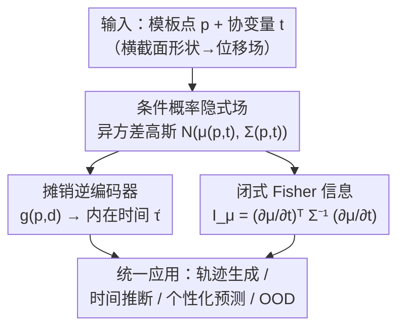

# PRISM: A 3D Probabilistic Neural Representation for Interpretable Shape Modeling

**会议**: ICML 2026  
**arXiv**: [2602.11467](https://arxiv.org/abs/2602.11467)  
**代码**: https://github.com/uncbiag/PRISM  
**领域**: 医学图像 / 统计形状建模 / 不确定性量化  
**关键词**: 隐式神经表示、统计形状分析、Fisher 信息、异方差高斯场、异常检测

## 一句话总结
PRISM 把隐式神经表示与不确定性感知的统计形状分析打通——用一个条件异方差高斯场建模解剖结构随协变量（如年龄）演化的均值轨迹与空间异质变异，并推导出闭式的 Fisher 信息度量来解析地量化「内在发育时间」的局部不确定性，在合成与儿童气道临床数据上同时支持形状演化、个性化预测与异常检测。

## 研究背景与动机
**领域现状**：统计形状建模（SSM）要刻画解剖几何随连续协变量（如年龄 $t$）变化的分布 $p(\mathcal{Y}\mid t)$。临床上不仅要知道「平均形状怎么长」，更要知道「同一年龄下个体间差异有多大」——而且这种差异是**空间异质（heteroscedastic）**的：有些区域变异极大、有些区域几乎不变。量化这种空间变化的不确定性，是区分「发育保守区」和「自然多样区」、做稳健异常检测与个性化评估的前提。

**现有痛点**：把严格的不确定性量化（UQ）塞进协变量感知的形状建模一直很难，已有方法各有硬伤。一类是 NAISR 这种神经隐式方法，能做高保真的条件生成，但它是**确定性**的——只给形变的点估计，不给置信度或群体方差。另一类是经典统计图谱（LDDMM/Deformetrica），它们显式建模形状变异，但变异是定义在**参数空间**里的（如初始动量、时间平移的分布）；要把这种不确定性传播到图像/解剖空间，必须把速度场沿非线性形变积分，导致「解剖上逐点的偶然不确定性」在解析上不可解，只能靠蒙特卡洛重采样这种重计算来近似。

**核心矛盾**：高保真生成（神经隐式）与可解析的逐点不确定性（统计图谱）之间存在鸿沟——前者丢了方差，后者把方差锁在参数空间、传不到解剖上。临床真正需要的恰是后者：空间局部化、协变量条件化的群体变异（偏偶然不确定性），用来把生理变异与病理区分开。

**本文目标**：构建一个理论扎实、闭式、能把内在生物模糊性直接映射到解剖空间的框架，同时支持形状演化、个体发育时间推断、个性化预测与异常检测。

**切入角度**：作者把神经隐式表示与信息几何结合——既保留隐式场的高保真与分辨率无关，又借 Fisher 信息把不确定性解析地算出来。关键观察是：在隐式表示里，$\partial\mu/\partial t$ 可由自动微分得到、$\Sigma^{-1}$ 一次前向即得，于是 Fisher 信息有闭式、无需采样。

**核心 idea**：把形状演化建成一个连续的异方差高斯场，再用闭式 Fisher 信息度量在任意空间位置解析地量化「内在发育时间」的不确定性。

## 方法详解

### 整体框架
PRISM 把每个观测形状 $\mathcal{Y}_i$ 表示为相对一个共享模板 $\mathcal{T}$ 的位移场 $\phi_i:\Omega\to\mathbb{R}^3$，对模板点 $\boldsymbol{p}$ 给出位移 $\boldsymbol{d}=\phi_i(\boldsymbol{p})$，观测位置即 $\boldsymbol{y}=\boldsymbol{p}+\boldsymbol{d}$。由于 $\boldsymbol{y}=\boldsymbol{p}+\boldsymbol{d}$ 只是确定性平移、协方差不变（$\Sigma_{\boldsymbol{y}}=\Sigma_{\boldsymbol{d}}$），可直接建模位移分布 $p(\boldsymbol{d}\mid\boldsymbol{p},t)=\mathcal{N}(\mu(\boldsymbol{p},t),\Sigma(\boldsymbol{p},t))$。整条管线分三块：先用坐标网络学条件形状分布（均值轨迹 + 协方差），再训一个摊销逆编码器把局部形变反推成「内在发育时间」$\hat\tau$，最后用闭式 Fisher 信息把时间不确定性算出来，三者一起支撑下游的轨迹生成、时间推断、个性化预测和异常检测。

这里有个核心概念区分：**时序时间 $t$**（如实际年龄）与**内在时间 $\tau$**（真实发育阶段）——同龄个体可能发育超前或滞后，处在演化轨迹的不同位置；PRISM 要量化的正是 $p(\tau\mid\boldsymbol{p},t)$ 这个时间变异分布。

### 关键设计

**1. 条件概率隐式场：协变量驱动项 + 协变量无关残差，解耦训练均值与方差**

针对「神经隐式方法只给确定性点估计」这个痛点，PRISM 把位移建成连续的异方差高斯场 $\boldsymbol{d}\mid\boldsymbol{p},t\sim\mathcal{N}(\mu(\boldsymbol{p},t),\Sigma(\boldsymbol{p},t))$，均值与协方差都由坐标网络输出。架构上，$\mu$ 和协方差的 Cholesky 因子 $\boldsymbol{L}$ 都写成「协变量驱动项 + 协变量无关残差」：$\mu(\boldsymbol{p},t)=[f_\mu(\boldsymbol{p},t)-f_\mu(\boldsymbol{p},0)]+h_\mu(\boldsymbol{p})$，$\boldsymbol{L}$ 同理。这个 $f(\boldsymbol{p},t)-f(\boldsymbol{p},0)$ 的减法构造保证驱动项在 $t=0$ 时消失，于是 $\mu(\boldsymbol{p},0)=h_\mu(\boldsymbol{p})$，从而把「随协变量变化的部分」与「与协变量无关的个体属性」做了**可辨识性**分离。协方差用 Cholesky 参数化 $\Sigma=\boldsymbol{L}\boldsymbol{L}^\top$（3D 每点 6 个自由参数），对角元过 softplus 加小常数 $\epsilon$ 保证对称正定，无需显式约束即可稳定优化 NLL。

训练上有个关键细节：直接用高斯 NLL（式 5）联合优化 $\mu$ 和 $\Sigma$ 会让方差加权的梯度把均值估计拉偏。PRISM 因此**解耦梯度**——用 $\mathcal{L}_\mu=\tfrac1M\sum_j\|\boldsymbol{d}_j-\mu_j\|_1$（$\ell_1$ 抗离群）训 $\mu$，用 $\mathcal{L}_\Sigma=\mathcal{L}_{\text{NLL}}$ 训 $\Sigma$ 且计算时固定 $\mu$。再配两阶段课程：第一阶段冻结协方差头只训 $\mu$（$T_{\text{warm}}=10$），第二阶段两支联合训练。

**2. 闭式 Fisher 信息：把时间不确定性解析地算出来，只保留均值项 $I_\mu$**

这是全文的理论核心，针对「逐点不确定性在解析上不可解、得靠蒙特卡洛」的痛点。作者从估计理论出发：score 函数 $U(\boldsymbol{d};\boldsymbol{p},t)=\partial_t\log p(\boldsymbol{d}\mid\boldsymbol{p},t)$ 衡量对数似然对时间的敏感度，Fisher 信息 $I(\boldsymbol{p},t)=\mathbb{E}[U^2]$ 衡量一次位移观测携带多少关于时间的信息。在「群体平均内在时间等于时序时间」假设下，$\tau$ 是 $t$ 的无偏估计，Cramér-Rao 不等式给出时间估计精度的下界——Fisher 信息越高（形状随时间变化越明显）越能精确定位，越低（形状模糊）则不确定性不可消除。

对异方差高斯模型，Fisher 信息有闭式且分解成两项：

$$I_{\text{full}}(\boldsymbol{p},t)=\underbrace{\Big(\tfrac{\partial\mu}{\partial t}\Big)^\top\Sigma^{-1}\Big(\tfrac{\partial\mu}{\partial t}\Big)}_{I_\mu}+\underbrace{\tfrac12\mathrm{tr}\Big(\big(\Sigma^{-1}\tfrac{\partial\Sigma}{\partial t}\big)^2\Big)}_{I_\Sigma}.$$

由信息几何里「均值与协方差参数在 Fisher-Rao 度量下正交」的经典结论，两项统计独立、回答不同问题：$I_\mu$ 衡量「沿均值轨迹定位个体」的精度（正是本文要的时间变异），$I_\Sigma$ 衡量「群体结构变异如何随时间变化」（与目标正交）。作者因此**只保留 $I_\mu$**：$I(\boldsymbol{p},t)=(\partial\mu/\partial t)^\top\Sigma^{-1}(\partial\mu/\partial t)$。它完全解析——$\partial\mu/\partial t$ 由自动微分给出、$\Sigma^{-1}$ 一次前向即得，没有采样方差，可在解剖上密集查询、一次算完，这是相对蒙特卡洛传播的根本优势。

**3. 摊销逆编码器：单次前向反推内在时间，免去测试期优化**

要从观测形变反推个体内在时间 $\hat\tau$，本是个 MLE 问题 $\hat\tau_{\text{MLE}}=\arg\max_\tau\log p(\boldsymbol{d}\mid\boldsymbol{p},\tau)$，但对每个受试者迭代求解代价高昂（基线 A-SDF/NAISR 正是靠这种测试期优化 TTO）。PRISM 改用**摊销推断**：训一个逆编码器 $g(\boldsymbol{p},\boldsymbol{d})\to\tau$。训练数据由已学好的前向模型 $f$ 合成——均匀采样 $(\boldsymbol{p},\tau)$、查询 $\boldsymbol{d}=\mu(\boldsymbol{p},\tau)$ 得到三元组，再用 $\mathcal{L}_{\text{inv}}=\tfrac1M\sum_j|g(\boldsymbol{p}_j,\boldsymbol{d}_j)-\tau_j|$ 做监督。测试时每个模板-位移对一次前向即得局部内在时间，生成解剖上的密集时间图，无需任何迭代优化，因此比基线快一个数量级。

**4. 统一应用框架：Fisher 加权时间聚合、z-score 个性化预测、局部 OOD 评分**

上述三件组件支撑起一套统一的形状分析应用，把不确定性真正用起来。**内在时间聚合**：未知 $t$ 时取算术均值 $\bar\tau=\tfrac1{|\mathcal{T}|}\sum_{\boldsymbol{p}}g(\boldsymbol{p},\boldsymbol{d})$；已知 $t$ 时用 Fisher 信息加权 $\bar\tau=\tfrac{\sum_{\boldsymbol{p}}I(\boldsymbol{p},t)g(\boldsymbol{p},\boldsymbol{d})}{\sum_{\boldsymbol{p}}I(\boldsymbol{p},t)}$，让时间可辨别性高的区域权重更大。**个性化纵向预测**：假设受试者的时间 z-score $z_\tau=\tfrac{\tau_0-t_0}{\sigma_\tau(t_0)}$ 保持不变，外推得 $\tau_1=t_1+z_\tau\sigma_\tau(t_1)$，未来位置 $\boldsymbol{y}_1=\boldsymbol{p}+\mu(\boldsymbol{p},\tau_1)$，从而在保留「超前/滞后」发育阶段的同时做个性化预测。**OOD 检测**：在儿童气道狭窄上，病理收缩表现为「比同一解剖其余部分发育更年轻」的区域，于是用局部内在时间相对解剖中位数、再按局部不确定性归一化打分 $\text{Score}_{\text{OOD}}=\min_{\boldsymbol{p}}\big[\tfrac{\hat\tau_{\boldsymbol{p}}-\tilde\tau}{\sigma_\tau(\boldsymbol{p},t)}-\tfrac{\hat\tau_{\boldsymbol{p}^*}-\tilde\tau}{\sigma_\tau(\boldsymbol{p}^*,t)}\big]$，强负值即标记出落后于解剖整体的病理区——无需异常标注。

## 实验关键数据

### 主实验
在 4 个数据集上评估，复杂度递增：Starman (G)（全局时间不确定性）、Starman (L)（手臂/腿不同发育轨迹的空间变化不确定性）、ANNY（参数化人体模型，0–20 岁）、儿童气道（358 例 CT / 264 受试者，外加 31 例声门下狭窄作为 OOD）。基线为 A-SDF 与 NAISR（均用逐形状隐编码、不建模不确定性）。

| 任务 | 数据集 | 指标 | A-SDF | NAISR | PRISM |
|------|------|------|------|------|------|
| 均值轨迹重建 | 气道 | CD↓ | 0.114 | 0.072 | **0.064** |
| 均值轨迹重建 | 气道 | HD↓ | 10.508 | 10.075 | **9.614** |
| 全局内在时间 | Starman(G) | MAE↓ | 0.016 | 0.019 | **0.005** |
| 全局内在时间 | Starman(G) | 推断时间/例(s)↓ | 4.005 | 7.892 | **0.040** |
| 个性化形状预测 | Starman(G) | CD↓ | 0.165 | 0.130 | **0.072** |
| 个性化形状预测 | Starman(L) | CD↓ | 0.467 | 0.595 | **0.099** |

均值重建上 PRISM 在气道（小数据）取得最低误差、在 Starman/ANNY 与最优持平；作者归因于「解耦对应关系与重建」让优化目标更简单（NAISR 要联合学两者）。全局内在时间上摊销 PRISM 精度持平甚至超过基线、却快一个数量级（0.040s vs 4–8s）。在 Starman (L) 的局部内在时间上，PRISM 是**唯一适用**的方法（基线只能估单一全局时间），手臂/腿 $r$ 均达 1.000、MAE 低至 0.004–0.008。个性化预测上 PRISM 全面领先——A-SDF 因无几何先验在训练范围外急剧退化，模板形变类方法（NAISR/PRISM）则保持有界。

### 消融实验
OOD 检测（儿童气道）与 Fisher 信息项选择的消融：

| 任务/配置 | 关键指标 | 数值 | 说明 |
|------|------|------|------|
| OOD · A-SDF (Global) | AUC↑ | 0.270 | 全局时间，几乎无判别力 |
| OOD · NAISR (Global) | AUC↑ | 0.605 | 全局基线 |
| OOD · PRISM (Global) | AUC↑ | 0.502 | 全局打分反而不如 NAISR |
| OOD · PRISM (Local) | AUC↑ | **0.875** | 局部打分大幅领先（Acc 0.857）|
| Fisher · 用 $I_\mu$ | 不确定带 | 贴合真值 | 准确刻画时间变异 |
| Fisher · 用 $I_{\text{full}}$ | 不确定带 | 系统性低估 | $I_\Sigma$ 收紧了界但偏离目标 |

### 关键发现
- OOD 检测里 PRISM (Global) 反而不如 NAISR，但 PRISM (Local) 拿到最佳——说明气道发育在个体、解剖位置、时间上都异质，单一全局速率刻画不了；局部估计在受试者自身解剖内找偏差，避开了个体间混杂。
- Fisher 信息只保留 $I_\mu$ 是对的：在有真值的 Starman (G) 上，$I_\mu$ 导出的不确定带紧贴真值，而 $I_{\text{full}}$ 系统性低估——$I_\Sigma$ 虽收紧 Cramér-Rao 界，却不反映「沿均值轨迹定位个体」这一目标量。
- 软组织区域（如舌根）不确定带更宽，与文献报告的该区域高个体内变异一致，说明学到的空间异质不确定性有临床意义。

## 亮点与洞察
- 闭式 Fisher 信息是最漂亮的一笔：隐式表示天然能用自动微分拿到 $\partial\mu/\partial t$，于是不确定性从「靠蒙特卡洛采样」变成「一次前向 + 自动微分解析算出」，既快又无采样方差，可在解剖上任意分辨率密集查询。
- 把「时序时间 $t$」与「内在时间 $\tau$」明确分开，是临床上很自然却常被忽略的建模视角——同龄个体可发育超前/滞后，PRISM 用 z-score 保持这一阶段做个性化外推，思路可迁移到任何「群体均值 + 个体偏移」的纵向预测。
- 解耦 $\mu/\Sigma$ 梯度（$\ell_1$ 训均值、NLL 固定均值训方差）是个稳健异方差回归的可复用 trick，避开了方差加权梯度把均值拉偏的老问题。
- 「无监督 OOD」靠的是「病理区比自身解剖其余部分发育更年轻」这一生物先验 + 局部不确定性归一化，不需要异常标注，对临床稀缺标注场景很友好。

## 局限与展望
- 作者承认：框架目前只条件化于单个标量协变量（如年龄），扩展到高维协变量空间是必要的未来工作。
- 退行性疾病的长期预测尚未充分探索——随生物年龄增长随机性增加，轨迹预测越来越难；作者计划利用异方差不确定性图做个体化疾病进展预测。
- 自己发现的局限：方法依赖高质量的模板配准与逐点对应（作为前置、非主要贡献），对应质量差会直接影响位移场训练信号；OOD 与个性化预测主要在儿童气道一种解剖上验证，跨解剖泛化仍需更多数据支撑。
- 改进思路：把信息论框架推广到多协变量、引入随生物年龄增长的随机性建模、并验证对应模块退化时的鲁棒性。

## 相关工作与启发
- **vs NAISR**: 同样基于共享模板的协变量条件神经形变，但 NAISR 是确定性的、只给点估计；PRISM 增加异方差协方差与闭式 Fisher 不确定性，且因解耦对应与重建而优化更简单、重建反而更好。
- **vs 经典统计图谱（LDDMM/Deformetrica）**: 它们在切空间/参数空间（初始动量）建模变异，逐点解剖不确定性难以闭式获得、需蒙特卡洛；PRISM 直接在解剖上给可解析、空间异方差的不确定性场。
- **vs A-SDF**: A-SDF 直接把协变量映射到 SDF，无显式对应，数据足够时拟合均值轨迹好，但小数据（气道）过拟合、且训练范围外外推急剧退化。
- **vs 高斯过程可变形模型（GPMM）**: GPMM 的不确定性绑定在核/观测模型上，不自然地条件化于时间/协变量、也不为不完整观测设计；PRISM 的不确定性直接条件化于协变量且支持横截面不完整数据。

## 评分
- 新颖性: ⭐⭐⭐⭐⭐ 首个面向不确定性感知统计形状分析的隐式神经表示，闭式 Fisher 信息度量是实打实的理论贡献。
- 实验充分度: ⭐⭐⭐⭐ 4 数据集多任务覆盖 + 有真值的合成验证 + 消融到位，但临床仅气道一种解剖。
- 写作质量: ⭐⭐⭐⭐⭐ 动机清晰、理论推导与临床任务衔接自然，图表丰富。
- 价值: ⭐⭐⭐⭐⭐ 把可解析的逐点不确定性带进临床形状分析，对发育评估与异常检测有直接应用价值。

<!-- RELATED:START -->

## 相关论文

- [\[NeurIPS 2025\] SynBrain: Enhancing Visual-to-fMRI Synthesis via Probabilistic Representation Learning](../../NeurIPS2025/medical_imaging/synbrain_enhancing_visual-to-fmri_synthesis_via_probabilistic_representation_lea.md)
- [\[CVPR 2026\] Modeling the Brain's Grammar: ROI-Guided fMRI Pretraining for Transferable and Interpretable Vision Decoding](../../CVPR2026/medical_imaging/modeling_the_brains_grammar_roi-guided_fmri_pretraining_for_transferable_and_int.md)
- [\[CVPR 2026\] EchoPOSE: 6D Pose Estimation of Sparse Echocardiograms for Left-Ventricular 3D Shape Reconstruction](../../CVPR2026/medical_imaging/echopose_6d_pose_estimation_of_sparse_echocardiograms_for_left-ventricular_3d_sh.md)
- [\[AAAI 2026\] Unsupervised Motion-Compensated Decomposition for Cardiac MRI Reconstruction via Neural Representation](../../AAAI2026/medical_imaging/unsupervised_motion-compensated_decomposition_for_cardiac_mri_reconstruction_via.md)
- [\[ICCV 2025\] SIC: Similarity-Based Interpretable Image Classification with Neural Networks](../../ICCV2025/medical_imaging/sic_similarity-based_interpretable_image_classification_with_neural_networks.md)

<!-- RELATED:END -->
