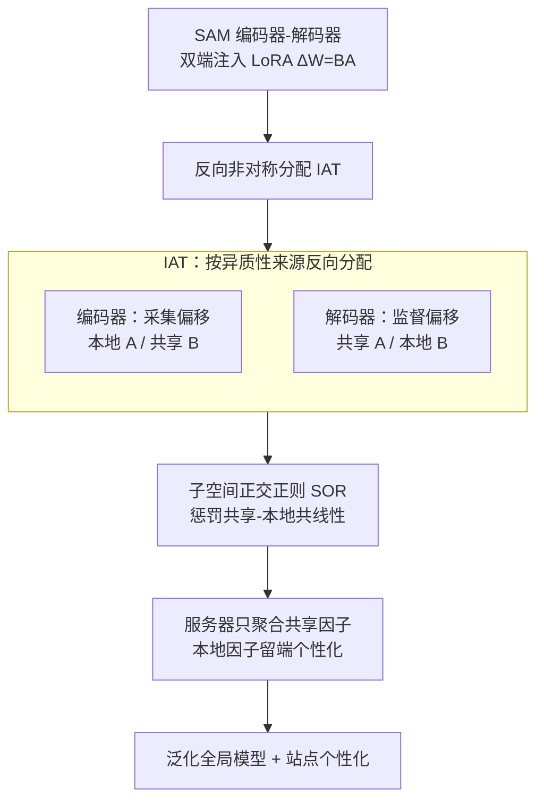

# Shift-Dependent Asymmetry: Orthogonal Inverse Low-Rank Adaptation for Federated Medical Segmentation

**会议**: ICML2026  
**arXiv**: [2606.08687](https://arxiv.org/abs/2606.08687)  
**代码**: 待确认  
**领域**: 医学图像 / 联邦学习 / 参数高效微调  
**关键词**: 联邦学习, LoRA, 医学分割, 编码器-解码器非对称, 子空间正交

## 一句话总结
针对"用联邦 LoRA 微调医学分割大模型时各客户端数据异质"的问题，本文发现编码器和解码器面对的异质性来源根本不同（编码器主要被外观/采集偏移主导、解码器被标注/概念偏移主导），于是提出 IAT 在两个模块上**反向分配** LoRA 的共享/本地因子，再用 SOR 子空间正交正则堵住双线性参数化里"本地更新泄漏进共享方向"的暗道，在组织病理与眼底两类医学分割上稳定超过强联邦 LoRA 基线。

## 研究背景与动机

**领域现状**：医学图像分割需要多中心数据才能鲁棒，但患者隐私让原始影像无法集中。联邦学习（FL）允许各机构不交换原始数据协同训练；为了把 SAM 这类分割基座模型塞进联邦流程，大家普遍用 LoRA 只传低秩因子来省通信。于是"联邦 LoRA"成了主流范式。

**现有痛点**：标准 LoRA 聚合有个固有矛盾——LoRA 是双线性的 $\Delta W=BA$，矩阵乘法非线性，服务器端对分解后的因子各自取平均，**一般无法重构出有效更新的平均**。展开后会多出一个耦合项 $\overline{B}\,\overline{A}=\frac{1}{K}\sum_k[B_kA_k+(B_k-\overline{B})(A_k-\overline{A})]$，其中 $(B_k-\overline{B})(A_k-\overline{A})$ 就是冲突的本地更新带来的干扰，在非 IID 下被放大，污染全局模型。现有联邦 LoRA 的补救是"冻一个因子"或"只共享某个矩阵"，但都对**整个网络用一刀切的统一拆分规则**。

**核心矛盾**：医学分割是编码器-解码器结构，两端面对的异质性来源**结构性地相反**。编码器主要被采集偏移（covariate shift，输入分布 $P(\mathbf{x})$ 变化，如不同扫描设备造成的外观差异）主导；解码器主要被概念偏移（concept shift，条件分布 $P(\mathbf{y}|\mathbf{x})$ 变化，如不同标注标准）主导。统一拆分规则忽略了这种模块角色的差异，把"共享解剖知识"和"站点特异偏差"纠缠在一起。

**本文目标**：(1) 设计一个能区分编码器/解码器角色、按异质性来源分配 LoRA 共享/本地因子的结构感知框架；(2) 在结构分离之后，进一步保证解耦子空间在优化动态上也真正独立、不互相泄漏。

**切入角度**：作者从一个理论问题入手——在协变量偏移 vs 概念偏移两种情形下，"最小化线性代理层的重构误差"分别偏好把哪个因子本地化？Proposition 3.1 给出干净结论：协变量偏移下应共享 $B$、本地化 $A$（对齐客户端特异的输入行空间）；概念偏移下应共享 $A$、本地化 $B$（对齐客户端特异的输出列空间）。

**核心 idea**：用"反向非对称分配（Inverse Asymmetric Tuning）"取代统一拆分——编码器用"本地 $A$ / 共享 $B$"，解码器用"共享 $A$ / 本地 $B$"，让参数角色精准对上各模块的主导异质性来源；再加一个正交正则把双线性耦合造成的泄漏堵死。

## 方法详解

### 整体框架
把分割网络写成 $\mathcal{F}=\mathcal{D}\circ\mathcal{E}$（编码器 $\mathcal{E}$ + 解码器 $\mathcal{D}$），两端都注入 LoRA（消融证明只在编码器加 LoRA 不够，解码器要重建像素级细节也得 adapt）。整套方法是"结构解耦 + 优化解耦"双管齐下：IAT 负责在结构上把 LoRA 因子按模块反向分配（哪个本地、哪个共享），SOR 负责在训练动态上让共享方向与本地漂移保持正交、防止泄漏。服务器只聚合共享因子得到泛化全局模型，本地因子留在客户端做个性化。

### 关键设计

**1. 反向非对称分配 IAT：让编码器和解码器按各自的异质性来源反向决定谁共享谁本地**

痛点是统一拆分规则把编码器（外观异质）和解码器（标注异质）一视同仁。IAT 的依据来自 Proposition 3.1 对线性代理层 $y=(W_0+BA)x$ 重构误差的分析：在协变量偏移（输入子空间旋转 $x_k=R_k x_\text{gen}$）下，最小化误差偏好**共享 $B$、本地 $A_k$**（去对齐客户端特异的输入行空间）；在概念偏移（目标映射旋转 $y_k=T_k y_\text{gen}$）下偏好**共享 $A$、本地 $B_k$**（对齐客户端特异的输出列空间）。落到网络上就是一个反向协议：编码器层 $l\in\mathcal{E}$ 采用 Local-$A$/Shared-$B$——客户端本地优化输入投影 $A_k$ 去滤掉站点特异的成像伪影，服务器只聚合 $B$：$B_{agg}^{(t+1,l)}\leftarrow\sum_k p_k B_k^{(t+1,l)}$；解码器层 $l\in\mathcal{D}$ 则反过来用 Shared-$A$/Local-$B$——聚合 $A$ 维持一致的共享特征子空间 $A_{agg}^{(t+1,l)}\leftarrow\sum_k p_k A_k^{(t+1,l)}$，把输出投影 $B_k$ 留在本地适配各异的标注标准。这种"结构反转"把参数角色显式对齐到每个模块的主导异质性来源，是本文最核心的观察——最优共享偏好不是静态的，而是在编码器与解码器之间**结构性翻转**。

**2. 子空间正交正则 SOR：堵住双线性参数化里本地更新泄漏进共享方向的暗道**

光做结构分离不够。Proposition 3.2 揭示双线性 $\Delta W=BA$ 的优化动态仍纠缠：共享因子 $B$ 的聚合更新可分解为 $B^{(t+1)}=B^{(t)}-\eta\underbrace{\sum_k p_k G_k\overline{A}^\top}_\text{共同漂移}-\eta\underbrace{\sum_k p_k G_k(A_k-\overline{A})^\top}_\text{异质性泄漏}$，最后一项就是本地偏差 $(A_k-\overline{A})$ 污染共享更新的泄漏通道（解码器侧对称成立，交换 $A,B$ 角色）。SOR 的对策是在一个紧凑的 $r\times r$ 代理空间里惩罚"共享更新方向"与"本地漂移方向"的对齐：用带 stop-gradient 的代理 $P_{sh},P_{lo}$（编码器）和 $Q_{sh},Q_{lo}$（解码器），其中本地漂移用回合内私有因子漂移的 EMA 构造，再最小化它们之间归一化 Frobenius 内积的平方 $\mathcal{L}_\text{SOR}^{(k)}=\sum_{l\in\mathcal{E}}\big(\frac{\langle P_{sh},P_{lo}\rangle_F}{\|P_{sh}\|_F\|P_{lo}\|_F+\epsilon}\big)^2+\sum_{l\in\mathcal{D}}(\cdots)^2$。由于 stop-gradient 的安排，SOR 主要给共享因子产生梯度，迫使它们正交于本地漂移演化、同时不约束个性化。妙处是这个软几何约束在 $r\times r$ 的低秩代理空间里算，**不需要任何额外通信**就矫正了梯度流，让共享模型只聚合通用表示、站点特异变化严格隔离。

**3. 带收敛保证的整体目标：在标准非凸联邦分析下证明非对称部分共享不破坏收敛**

每个客户端优化 $\mathcal{L}_\text{total}^{(k)}=\mathcal{L}_\text{seg}+\lambda\mathcal{L}_\text{SOR}^{(k)}$（分割损失 + SOR 正则），服务器按 IAT 协议只聚合共享因子。作者把优化空间显式参数化为 $\Theta:=(\Theta^\text{sh},\{\Theta_k^\text{lo}\}_k)$，在 $L$-光滑、梯度有界、以及一个低秩特有的"非退化 LoRA 因子"假设（$\sigma_\min\geq\delta>0$，保证更新方向是有效下降方向）下，证明（Theorem 3.1）方法达到 $\mathcal{O}(1/\sqrt{T})$ 的收敛率，匹配 FedAvg 在非凸下的标准速率（仅差低阶聚合漂移项）。这条保证的意义在于：把"只共享一半因子、另一半留本地"这种非对称部分共享做进来，理论上并不牺牲收敛性。

### 损失函数 / 训练策略
本地总目标 $\mathcal{L}_\text{total}^{(k)}=\mathcal{L}_\text{seg}+\lambda\mathcal{L}_\text{SOR}^{(k)}$，$\lambda$ 控制正交正则强度。训练跨 $R$ 个通信轮，每轮客户端做 $E$ 步本地 SGD 同时更新共享与本地分量，服务器只聚合 $\Theta^\text{sh}$。SOR 用回合开始时 detach 的参数锚点 $A_{0,k},B_{0,k}$ 与回合内私有因子漂移的 EMA $\delta A_k,\delta B_k$ 构造代理，stop-gradient 保证正则只塑形共享因子。

## 实验关键数据

### 主实验
在组织病理细胞核（Histology nuclei，7 个数据集）与眼底照片（Fundus，4 个数据集）两类医学分割上，与多种强联邦 LoRA / 参数高效 FL 基线比较 Dice。本文（Ours）在两类的平均分上都最优（LoRA Rank=8 下）：

| 数据集组 | 指标(Avg) | 本文 | 次优基线 | 提升 |
|---|---|---|---|---|
| Histology nuclei (7 sets) | Dice Avg | **81.40** | FedSA 80.09 | +1.31 |
| Fundus photography (4 sets) | Dice Avg | **84.52** | FedSA 83.04 | +1.48 |

部分难子集提升尤其明显，例如眼底的 Drishti-GS1：本文 85.43，远超 FedSA 的 80.64 和多数基线（FFA-LoRA 仅 29.07、FedIT 57.74），说明在异质性强、标注差异大的站点上结构感知分配收益更大。Rank=16 下趋势一致（部分统一拆分基线如 FedIT 在某些站点甚至崩到 41.52，反衬其对模块角色不敏感）。

### 消融 / 分析

| 配置 | 关键现象 | 说明 |
|---|---|---|
| 仅 Encoder 加 LoRA | 性能不足 | 分割需解码器重建像素级细节，验证双端注入必要性 |
| 统一拆分（uniform split） | 显著低于反向分配 | 编码器/解码器角色被忽略，共享与本地纠缠 |
| IAT 反向分配（验证"crossover"） | 优于统一基线 | 经验上印证 Prop.3.1 的偏好反转 |
| + SOR | 进一步抑制泄漏 | 在 $r\times r$ 代理空间正交约束，无额外通信 |

### 关键发现
- **最优共享偏好会在编码器与解码器之间反转**，不是静态——这是全文最反直觉、也是方法立足点的发现，经验上的"crossover"模式与 Proposition 3.1 吻合。
- **统一拆分的脆弱性**：FFA-LoRA、FedIT 等在某些异质站点上 Dice 暴跌（个位数到 40 多分），说明一刀切规则在医学分割的非对称异质下不堪一击。
- **SOR 的增益来自堵泄漏而非加表达力**：它只给共享因子加正交约束、不碰个性化，且在低秩代理空间计算、零额外通信。

## 亮点与洞察
- **把"模块角色差异"做成理论判据**：Proposition 3.1 不是泛泛而谈，而是从重构误差直接推出"协变量偏移共享 $B$、概念偏移共享 $A$"，让"反向分配"有了可证明的根据，而非拍脑袋的工程 trick。
- **双线性泄漏的诊断很到位**：把 $B$ 的聚合更新拆成"共同漂移 + 异质性泄漏"两项，精确定位问题来源，再用低秩代理空间的正交正则对症下药——诊断与解法严丝合缝。
- **零额外通信的正则设计可迁移**：在 $r\times r$ 而非全维空间施加正交约束的思路，可推广到任何"共享/本地因子需解耦"的联邦 PEFT 场景。
- **结构感知 > 一刀切**：这个洞察对编码器-解码器结构的任何联邦微调（不止医学分割）都有提示意义——别用为 decoder-only LLM 设计的联邦 LoRA 协议直接套到密集预测任务上。

## 局限与展望
- **理论依赖线性代理 + 强假设**：Prop.3.1 基于线性代理层与"输入旋转/输出旋转"建模异质性，收敛证明还需"非退化 LoRA 因子"假设，真实非线性 SAM 上的近似程度未充分量化。
- **异质性归因偏二分**：把编码器=协变量偏移、解码器=概念偏移当成主导，现实中两种偏移可能在同一模块共存，硬性二分可能在某些数据上不成立。
- **超参 $\lambda$ 敏感性与 rank 选择**：SOR 强度 $\lambda$ 和 LoRA rank 的影响在正文中展示有限，对极端非 IID 或客户端极少时的鲁棒性待考。
- **代码与更大规模未公开验证**：仅在组织病理/眼底两类、有限客户端上测试，3D 体数据、跨模态（CT/MRI）以及更大客户端数下的可扩展性未知。

## 相关工作与启发
- **vs FedSA / 非对称共享 (Guo et al., 2025; Zhang et al., 2023)**：他们也做"只共享某个因子"，但用**全网统一**的拆分规则；本文指出医学分割的编码器/解码器角色相反、应**反向**分配，统一规则恰好在两端各错一半。
- **vs FFA-LoRA（冻结一个因子）**：冻因子是更激进的"静态拆分"，在异质站点上可能严重崩坏（实验里某些子集只剩个位数 Dice）；IAT 让被本地化的因子继续学，保住个性化。
- **vs 标准 FedLoRA / FedIT（朴素聚合）**：朴素平均分解因子会引入 $(B_k-\overline{B})(A_k-\overline{A})$ 耦合项、非 IID 下放大；本文用结构反转 + SOR 同时治"聚合不一致"和"训练泄漏"两层问题。
- **vs 为 LLM 设计的联邦 LoRA 协议**：多数联邦 LoRA 面向 decoder-only LLM；医学分割是编码器-解码器 + 像素级监督，直接套 LLM 协议次优——这正是本文区分模块角色的动机来源。

## 评分
- 新颖性: ⭐⭐⭐⭐ "共享偏好在编解码器间反转"的观察 + 可证明判据，角度新颖
- 实验充分度: ⭐⭐⭐⭐ 两类共 11 个医学分割数据集、多基线、双 rank，覆盖较全
- 写作质量: ⭐⭐⭐⭐ 动机-理论-方法-收敛逻辑闭环，命题与方法对应清晰
- 价值: ⭐⭐⭐⭐ 隐私约束下用大模型做多中心医学分割的实用方案，且零额外通信

<!-- RELATED:START -->

## 相关论文

- [\[CVPR 2026\] Personalized Longitudinal Medical Report Generation via Temporally-Aware Federated Adaptation](../../CVPR2026/medical_imaging/personalized_longitudinal_medical_report_generation_via_temporally-aware_federat.md)
- [\[CVPR 2026\] KLIP: localized distribution shift detection via KL-divergence with diffusion priors in Inverse Problems](../../CVPR2026/medical_imaging/klip_localized_distribution_shift_detection_via_kl-divergence_with_diffusion_pri.md)
- [\[AAAI 2026\] Divide, Conquer and Unite: Hierarchical Style-Recalibrated Prototype Alignment for Federated Medical Segmentation](../../AAAI2026/medical_imaging/divide_conquer_and_unite_hierarchical_style-recalibrated_prototype_alignment_for.md)
- [\[CVPR 2026\] MedFG-VQA: Low-Frequency Memory and Graph Attention for Lightweight Medical VQA](../../CVPR2026/medical_imaging/medfg-vqa_low-frequency_memory_and_graph_attention_for_lightweight_medical_vqa.md)
- [\[CVPR 2026\] MedCLIPSeg: Probabilistic Vision-Language Adaptation for Data-Efficient and Generalizable Medical Image Segmentation](../../CVPR2026/medical_imaging/medclipseg_probabilistic_vision-language_adaptation_for_data-efficient_and_gener.md)

<!-- RELATED:END -->
