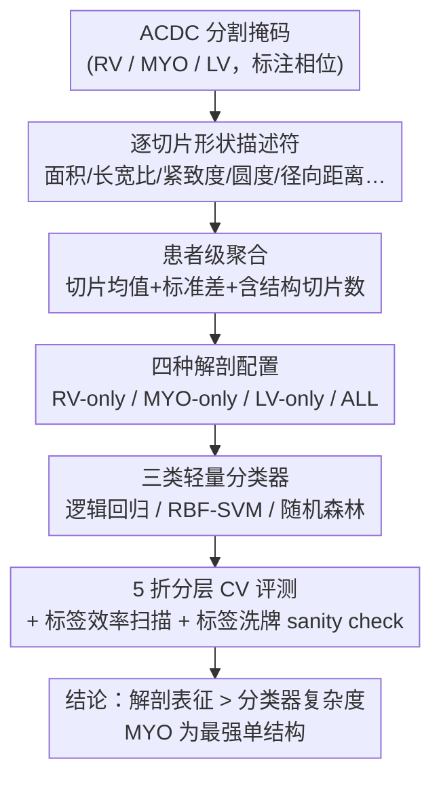

# Which Anatomy Matters Under Limited Labels? A Data-Efficient Anatomy-Aware Benchmark for Cardiac Pathology Prediction

**会议**: ICML 2026  
**arXiv**: [2606.06509](https://arxiv.org/abs/2606.06509)  
**代码**: 待确认  
**领域**: 医学图像 / 心脏 MRI / 低标注基准  
**关键词**: 解剖感知表征、低标注、心脏病理分类、ACDC、特征工程

## 一句话总结
本文在公开 ACDC 心脏 MRI 数据集上构建了一个「低标注 + 受限算力」的解剖感知基准，用分割掩码导出的患者级形状描述符做 5 类心脏病理分类，系统性地证明：在标签稀缺时，**选对解剖表征比堆模型复杂度更重要**——其中心肌（MYO）是单结构里信号最强的，多结构组合整体最佳。

## 研究背景与动机
**领域现状**：在低标注的医学影像场景里，研究者的惯性做法是「上更复杂的模型」来提性能。但在心脏影像这类任务里，病理是通过**解剖学上有意义的结构**（右心室 RV、心肌 MYO、左心室 LV 的形态）表达出来的，而不是任意的图像变化。

**现有痛点**：现实里医学 AI 的瓶颈常常不在模型设计，而在数据准备、标注、部署基础设施——尤其在资源受限的医疗场景（如放射科基础设施有限的地区），算力密集的端到端 pipeline 难以落地。但「到底是模型复杂度不够，还是临床结构没被表征好」一直没有被干净地拆开回答。

**核心矛盾**：性能增益究竟主要来自「更有表达力的模型」还是「更好地表征临床有意义的解剖」？这两个因素在以往工作里是纠缠在一起的——换更强的分类器、换更丰富的表征往往同时发生，没法归因。

**本文目标**：构建一个**可复现的低标注基准**，在受控条件下回答四个递进问题——① 基准在标签稀缺时还有没有判别力；② 哪个解剖结构携带最强预测信号；③ 简单的相位间动态特征是否比静态解剖特征更有用；④ 这些增益能否扛过基本的 sanity check。

**切入角度**：作者把一张代表性短轴心脏 MR 图像**分解成 RV-only、MYO-only、LV-only、ALL-structures 四种结构视图**，把「解剖表征」与「分类器复杂度」当成两个可独立 ablate 的轴，看哪个轴上的方差更大。

**核心 idea**：用一句话概括就是「Representation before complexity」——在低标注结构化医学学习里，先识别并显式表征最有信息量的解剖，比换一个更复杂的分类器更值得。

## 方法详解

### 整体框架
这是一篇**基准/实证研究**而非新模型论文，整条 pipeline 的目的是「在受控变量下隔离出解剖表征的贡献」。流程是：从 ACDC 标注的分割掩码出发 → 对每个解剖结构提取手工形状描述符 → 按患者聚合成患者级特征 → 切成 RV/MYO/LV/ALL 四种解剖配置 → 分别喂给线性/核/树三类轻量分类器 → 在 5 折分层交叉验证下评测，并叠加标签效率扫描、动态特征增强、标签洗牌等 sanity check。整个设计刻意保持「模型轻、特征透明」，这样观测到的性能差异才能干净地归因到「表征选择」而非「模型容量」。

### 关键设计

**1. 解剖感知表征 ablation：把「哪个解剖最重要」做成可控变量**

这是整个基准的核心实验设计。作者对同一张 MRI 切片定义四种结构选择配置：RV-only、MYO-only、LV-only，以及把三者描述符拼接的 ALL-structures。为什么这样切？因为心脏病理（扩张型心肌病 DCM、肥厚型心肌病 HCM、心梗 MINF、正常 NOR、右室异常 RV 这 5 类，每类 20 人共 100 人，类别均衡）的表达高度结构特异——把表征按解剖结构拆开、固定分类器去比，就能直接读出「从 RV-only 换到 MYO-only 的增益」相对「在三类分类器之间切换的增益」哪个更大。结论是前者远大于后者，从而支撑「表征 > 复杂度」的主张。

**2. 分割衍生的手工形状描述符 + 患者级聚合：让特征透明可解释**

为隔离结构特异信号，作者**不走端到端原图学习**，而是从二值分割掩码里抽取一组简单的形状描述符：面积、面积占比、长宽比、主轴统计量、伸长率（elongation）、紧致度（compactness）、圆度（circularity）、范围（extent）、径向距离汇总等。对每个标注帧、每个解剖结构逐切片提取后，再按患者聚合——用跨切片的**均值和标准差**，外加「含该结构的切片数」。这种刻意压扁的特征工程让模型轻、可解释，也让后续「按结构汇总特征重要性」成为可能（用逻辑回归系数绝对值求和，见关键发现）。

**3. 受控评测协议 + sanity check：保证增益是真信号而非泄漏**

为了让结论可信，作者用 5 折分层交叉验证，所有预处理（中位数填补、特征标准化）都**只在训练折内拟合**再应用到验证折，避免信息泄漏；标签分数实验则在每个分数下重复随机子采样、报均值与标准差。最关键的是**标签洗牌对照**：随机打乱标签后平衡准确率从 $0.870\pm0.057$ 掉到 $0.230\pm0.057$（接近 5 类均衡任务的随机水平 0.2），证明观测到的增益来自真实解剖信号，而不是数据集里的泄漏或捷径线索。此外还有标签效率扫描（性能随标签增多平滑提升、始终高于随机基线）和一个端到端 ResNet-18 基线（表现显著差于三个解剖感知基线），共同坐实「低标注下显式解剖表征的价值」。

**4. 静态 vs 动态特征对比：一个被诚实报告的负结果**

作者还问「加入简单的相位间动态信息是否更好」——给完整特征集补上显式的 inter-phase delta（相位差）和 ratio 描述符。结果是**这些动态特征并不比静态多结构表征更好**。作者谨慎解读：可能是 ACDC 病理在静态形态（尤其心肌结构）里已经表达得很强，简单相位差贡献有限；也可能是手工动态描述符太压缩、丢了相位间更丰富的空间形变。结论不应被读成「动态信息无用」，而是「简单低维相位间汇总打不过已经很强的解剖感知静态表征」。

## 实验关键数据

### 主结果（解剖 ablation）
5 类 ACDC 病理预测，5 折交叉验证平衡准确率（固定分类器、比解剖表征）：

| 解剖配置 | 单/多结构 | 相对表现 | 结论 |
|--------|------|------|------|
| RV-only | 单结构 | 最弱 | 右室单独信号有限 |
| LV-only | 单结构 | 中等 | 弱于心肌 |
| **MYO-only** | 单结构 | **单结构最强** | 心肌形态集中了最强单结构信号 |
| **ALL-structures** | 多结构 | **整体最佳** | 三结构拼接全局最优 |

> 关键对比：从 RV-only 换到 MYO-only 的增益，**远大于**在逻辑回归/RBF-SVM/随机森林之间切换（表征固定后）带来的增益——即「表征 > 复杂度」。

### 分析实验（动态特征 + sanity check）

| 配置 | 平衡准确率 | 说明 |
|------|---------|------|
| ALL-structures（静态） | $0.870\pm0.057$ | 强基线 |
| + inter-phase delta/ratio（动态） | 无实质提升 | 简单动态特征不增益 |
| 标签洗牌对照 | $0.230\pm0.057$ | 接近随机 0.2，排除泄漏 |
| 端到端 ResNet-18 | 显著低于三个解剖基线 | 低标注下端到端不占优 |

### 关键发现
- **心肌（MYO）是最强单结构信号**：把逻辑回归系数绝对值按解剖结构分组求和，心肌组最高（Fig. 5），定量印证 ablation 结论——多个 ACDC 病理是通过心肌壁形态而非腔室几何表达的。
- **表征 > 复杂度**：核方法和树模型在强解剖感知表征之上提升有限；选对解剖结构带来的方差远大于换分类器。
- **动态特征是诚实的负结果**：简单相位间汇总没打过静态多结构表征，作者明确提示这不代表动态信息本身无用。

## 亮点与洞察
- **把模糊的方法论问题做成可控实验**：「是模型不够强还是表征不够好」这种常被空谈的问题，被作者用「解剖轴 × 分类器轴」的双 ablation 干净地拆开并给出可复现答案，这种基准设计本身就是贡献。
- **负结果敢报、对照敢做**：动态特征无增益被如实写出并谨慎归因；标签洗牌从 0.87 掉到 0.23 这种强对照，让「真信号而非泄漏」的主张很硬。
- **可迁移的实践原则**：在资源受限医疗场景（作者点名 Global South），与其上更重的端到端模型，不如优先识别并显式表征携带临床信号的解剖结构（这里是心肌）——这个「representation before complexity」原则可迁移到其他低标注结构化医学任务。

## 局限与展望
- 作者承认：仅用单个公开数据集（ACDC，100 人），依赖手工分割衍生描述符而非端到端原图学习，动态只用简单相位间汇总刻画。
- 未来工作：扩展到更多数据集、引入不确定性感知分析、更丰富的时序描述符、跨机构外部验证。
- 自己看：100 人、每类 20 的规模偏小，5 折 CV 的方差天然偏大（标准差 ~0.057 已不小）；「心肌最重要」依赖手工形状描述符的选择，换一组描述符或换病理谱系结论是否稳健仍待验证；端到端 ResNet-18 仅在「代表性切片」上训练，对端到端方法可能不够友好。

## 相关工作与启发
- **vs Isensee / Khened（ACDC 分割+手工特征诊断）**: 前人把分割输出和临床手工特征组合做自动疾病评估，证明解剖描述符能支撑可解释病理预测；本文进一步聚焦「低标注下哪个解剖结构信号最强、相对分类器复杂度有多重要」。
- **vs Zheng et al.（形状+运动可解释分类）**: 他们结合形状与运动特征做可解释分类；本文的动态特征负结果提示「简单相位间汇总」未必能复现运动信息的价值，需更丰富的时序描述符。
- **vs 端到端深度模型路线**: 在低标注 ACDC 上，端到端 ResNet-18 显著弱于解剖感知轻量基线，支撑「显式解剖表征在数据稀缺时更划算」的核心论点。

## 评分
- 新颖性: ⭐⭐⭐ 不提新模型，价值在于把「表征 vs 复杂度」做成可控、可复现的解剖感知基准与清晰结论。
- 实验充分度: ⭐⭐⭐ 含标签效率、解剖 ablation、动态特征、标签洗牌等多维分析，但限于单数据集、100 人小样本。
- 写作质量: ⭐⭐⭐⭐ 问题驱动、结论清晰，负结果与对照都诚实交代。
- 价值: ⭐⭐⭐⭐ 给资源受限医疗 AI 一个可操作原则（优先表征关键解剖），实践指导意义强。

<!-- RELATED:START -->

## 相关论文

- [\[ICLR 2026\] Anatomy-aware Representation Learning for Medical Ultrasound](../../ICLR2026/medical_imaging/anatomy-aware_representation_learning_for_medical_ultrasound.md)
- [\[AAAI 2026\] Vascular Anatomy-aware Self-supervised Pre-training for X-ray Angiogram Analysis](../../AAAI2026/medical_imaging/vascular_anatomy-aware_self-supervised_pre-training_for_x-ray_angiogram_analysis.md)
- [\[CVPR 2026\] RDFace: A Benchmark Dataset for Rare Disease Facial Image Analysis under Extreme Data Scarcity and Phenotype-Aware Synthetic Generation](../../CVPR2026/medical_imaging/rdface_a_benchmark_dataset_for_rare_disease_facial_image_analysis_under_extreme_.md)
- [\[CVPR 2026\] CHIPS: Efficient CLIP Adaptation via Curvature-aware Hybrid Influence-based Data Selection](../../CVPR2026/medical_imaging/chips_efficient_clip_adaptation_via_curvature-aware_hybrid_influence-based_data_.md)
- [\[ECCV 2024\] Chameleon: A Data-Efficient Generalist for Dense Visual Prediction in the Wild](../../ECCV2024/medical_imaging/chameleon_a_data-efficient_generalist_for_dense_visual_prediction_in_the_wild.md)

<!-- RELATED:END -->
