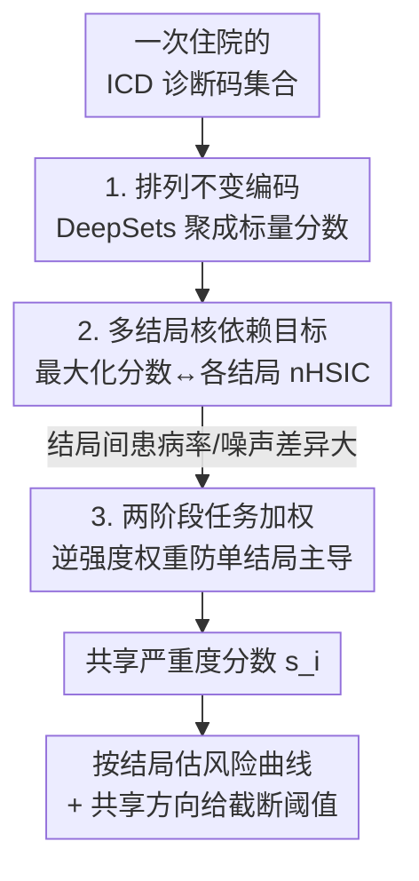

# A Machine-Learned Comorbidity Index

**会议**: ICML2026  
**arXiv**: [2606.17450](https://arxiv.org/abs/2606.17450)  
**代码**: 未公开  
**领域**: 医学NLP / 临床风险建模 / 核依赖学习  
**关键词**: 共病指数, ICD 诊断码, HSIC, 多结局学习, 患者分层  

## 一句话总结
传统共病评分（Charlson、Elixhauser）是为死亡率手工调权的线性规则，换个临床结局就失准；本文用神经网络把一次住院的 ICD 诊断码压成一个标量分数，并通过**最大化该分数与多个临床结局之间的归一化 HSIC（核依赖）**来训练，使这一个分数能在死亡、再入院、住院时长、ICU 转入等多结局上给出一致的严重度排序，在 MIMIC-III/IV 上的依赖性指标显著超过传统指数与多种机器学习基线。

## 研究背景与动机

**领域现状**：临床上做风险调整、患者分层、风险分层时，普遍用「共病指数」把一次住院的诊断信息压缩成一个标量分数。最常用的两个是 Charlson 共病指数（CCI）和 van Walraven 加权的 Elixhauser 指数（ECI）——它们都把诊断码映射成预定义的共病类别指示变量，再用固定权重加权求和。

**现有痛点**：这些手工指数有两个硬伤。其一，它们当初是**为院内死亡率校准**的，权重锁死在死亡这一个结局上，换到 ICU 转入、住院时长、再入院等其它结局就泛化很差；可临床实践却默认「一个病人住院期间的诊断负担应该给出一个跨多结局都通用的严重度排序」，手工指数没有原则性的办法去学这种跨结局一致的排序。其二，它们是**线性、规则式**的，无法刻画风险与共病负担之间的非线性关系——某些诊断组合会放大风险，而在已经很重的基线上再加诊断却边际递减；SAPS II、NEWS 这类评分之所以用 logistic 链接或分数阈值，正是因为风险-严重度关系本身是非线性的。

**核心矛盾**：临床想要的是「一个标量分数」（沿用 CCI/ECI 的单指数易用性），但又希望这个分数同时满足「跨多结局一致排序」和「非线性风险刻画」——手工线性规则两头都做不到。

**本文目标**：作者把它拆成三个问题——(1) 常见住院结局到底在多大程度上**共享**一个底层的住院级严重度排序，使得单个分数能跨结局一致地给住院排序？(2) 若这种排序存在，能否以数据驱动、有原则的方式学到它，同时允许每个结局有自己的非线性严重度-风险曲线？(3) 除了排序，能否学一个**截断阈值**，把高严重度人群跨结局一致地圈出来供干预？

**核心 idea**：用「最大化分数与多结局的核依赖（nHSIC）」替代「为单一死亡率手工调权」，让一个 DeepSets 编码出的标量分数去捕捉多个结局共享的、可非线性的严重度信号，而不被任何单一结局主导。

## 方法详解

### 整体框架
MLCI 的输入是一次住院的变长 ICD 诊断码集合 $X_i$，输出是一个标量严重度分数 $s_i = s_\theta(X_i) \in \mathbb{R}$。整条管线分四步：先把原始 ICD 码规范化并截成前缀 token，用一个排列不变的 DeepSets 编码器把这袋诊断码聚合成一个标量；然后不再像普通分类器那样去最小化某个结局的交叉熵，而是把这个标量分数与每个临床结局之间的**归一化 HSIC（nHSIC）** 当作训练信号去最大化；由于不同结局的患病率、噪声、严重度响应差异很大，作者再用一个两阶段的任务加权防止某个结局把分数带偏；训练完后，对每个结局单独估一条风险曲线，把这个共享分数映射回该结局的具体风险。

### 关键设计

**1. 排列不变的单分数编码器：把一袋诊断码压成一个标量**

诊断码本身是无序的变长集合（一次住院可能有几条到几十条 ICD 码），普通的序列/拼接编码会引入虚假的顺序假象。作者先把每个 ICD 码大写化、去标点空白，取前 $k=4$ 个字符作为前缀 token，只用训练集构词表并加 `<PAD>`/`<UNK>`，最大保留长度 $D_{\max}=256$。编码器 $s_\theta$ 采用 DeepSets 风格：对每个 token 嵌入 $e_j$ 过一个逐元素 MLP $\phi$ 得 $h_j=\phi(e_j)$，再用 masked mean pooling 和 masked max pooling 两种聚合拼接成住院表示，最后过第二个 MLP $\rho$ 得标量 $s_i = \rho(\mathrm{Agg}(\{\phi(e_j)\}))$。mean+max 双聚合既保留整体负担（均值）又保留最重的那条诊断（最大），排列不变性保证分数只依赖「有哪些诊断」而非「诊断的记录顺序」，这正好对上共病指数「单指数」的产品契约。

**2. 多结局归一化 HSIC：用核依赖代替单结局似然**

这是全文的核心。如果像普通临床模型那样对某个结局最小化交叉熵，学到的表示是「任务特定」的，换结局就废了；而且不同结局可能通过未知的非线性曲线依赖严重度，线性相关会漏掉这种依赖。作者改用 HSIC——一种基于核的、能同时捕捉线性与非线性依赖的度量。在一个大小 $n_b$ 的 mini-batch 上，对分数构造 RBF 核 Gram 矩阵 $K_{ij}^{(b)}=k(s_i,s_j)$，对每个任务 $t$ 的标签构造 delta 核 $L_{ij}^{(b,t)}=\mathbb{I}\{y_i^{(t)}=y_j^{(t)}\}$，用中心化矩阵 $H_b=I-\frac{1}{n_b}\mathbf{1}\mathbf{1}^\top$ 居中后，优化归一化判据

$$\widehat{\mathrm{nHSIC}}(s,y^{(t)})=\frac{\langle K_c^{(b)},L_{t,c}^{(b)}\rangle_F}{\max\{\|K_c^{(b)}\|_F,\varepsilon_0\}\,\|L_{t,c}^{(b)}\|_F}.$$

它在配对层面问两个问题：哪些住院在分数上相近（核侧），哪些住院结局标签相同（标签侧）——nHSIC 高就意味着「分数相近的住院往往结局也相似」。归一化（除以两个 Frobenius 范数）让不同结局的依赖值落到可比尺度，从而能跨结局直接相加；用 RBF 核还带来一个副作用：核只依赖分数的成对距离，所以目标对分数符号不变，作者最后用验证集死亡率的 Pearson 相关来定向（若为负就翻号），保证「分数越大死亡风险越高」。

**3. 两阶段任务加权：防止高患病率结局垄断分数**

多结局一起训会出问题：结局在患病率、噪声、严重度响应上差异巨大，朴素地等权相加会被少数几个「好学」的任务主导，学出来的分数其实只对那几个结局好。作者的训练目标是加权和 $\max_\theta \sum_{t=1}^T \alpha_t\,\widehat{\mathrm{nHSIC}}(s_\theta(X),y^{(t)})$，关键在于权重 $\alpha_t$ 怎么定。两阶段做法：阶段一对每个结局单独训一个模型，记录其最优验证 nHSIC $\widehat{h}_t$；阶段二用「稳定化的逆强度权重」

$$\alpha_t \propto \left(\frac{\widehat{h}_{\max}}{\max(\widehat{h}_t,\varepsilon_{\mathrm{wt}})}\right)^{\gamma_{\mathrm{wt}}},\qquad \widehat{h}_{\max}=\max_t \widehat{h}_t,$$

其中 $\gamma_{\mathrm{wt}}\in(0,1)$，再做裁剪和重归一化。直觉是：单独就很好学（$\widehat{h}_t$ 大）的结局给小权重，难学的结局给大权重，把优化资源往弱结局倾斜，从而逼出真正**跨结局共享**的信号而非某个强结局的私货。此外针对缺失标签，多任务训练只用「全结局都观测到」的交集队列 $M_i^\cap=\prod_t M_i^{(t)}=1$，而评测时各结局用各自的有效测试集以保证公平对比。

**4. 共享严重度理论与阈值证书：什么时候单分数能当通用排序**

作者给出有限样本理论刻画「单个学到的分数何时能近似充当跨多结局的共享排序」。设每次住院有一个未观测的潜在严重度 $z_i$，每个结局 $t$ 通过未知（可非线性）的响应曲线 $\Pr\{y_i^{(t)}=1\mid z_i\}=f_t(z_i)$ 依赖它；目标是恢复 $z_i$ 的**排序**而非绝对值，即 $z_i<z_j \Rightarrow s_\theta(X_i)\le s_\theta(X_j)$。理论分三步：先把每个二元结局转成居中标签轮廓 $\ell^{(t)}=Hy^{(t)}$（delta 核下有秩一形式 $L_{t,c}=2\ell^{(t)}\ell^{(t)\top}$）；再把各任务轮廓加权堆叠成矩阵 $\widetilde{W}$，其 $\widetilde{W}^\top\widetilde{W}$ 是一个跨任务的住院-住院标签对齐矩阵；当这个堆叠矩阵**近似秩一**时，说明各结局共享一个主导的住院级方向 $v$，此时多结局目标退化为让分数核矩阵对齐 $v$，并给出一个显式的单调阈值规则——选「居中阶跃向量与 $v$ 最对齐」的那个住院切分作为高严重度截断。这把「能不能用一个分数+一个阈值跨结局分层」从经验做法变成了可检验的条件（堆叠矩阵秩一性的强度即诊断量）。

### 损失函数 / 训练策略
训练目标是加权多任务 nHSIC 的**最大化**（注意是最大化依赖，不是最小化误差）；RBF 带宽 $\sigma$ 用训练分数上的稳定化中位数启发式定；为数值稳定给核范数加下限 $\varepsilon_0$；逆强度权重做裁剪+重归一化。BCE 基线因损失按结局可分解，用任务特定掩码。

## 实验关键数据

数据集为 MIMIC-III（ICD-9）与 MIMIC-IV（ICD-10），评测四个临床结局：院内死亡 MORT、30 天死亡 30M、住院时长 LOS、ICU 转入 ICU。评测指标不是 AUC 而是**分数与结局之间的统计依赖**——距离相关 dCorr（Table 1）和互信息 MI（Table 2），值越大越好，因为论文要论证的是「这个单分数携带了多少与结局相关的信号」。

### 主实验：距离相关（Table 1，数值已按表头 ×10² 缩放）

| 结局（MIMIC-IV） | Charlson | Elixhauser | 最强基线 | MLCI（本文） |
|---|---|---|---|---|
| MORT 院内死亡 | 12.59 | 19.98 | 36.41 (FM) | **54.80** |
| 30M 30天死亡 | 18.44 | 23.87 | 35.82 (FM) | **49.42** |
| LOS 住院时长 | 24.55 | 33.15 | 51.02 (LR) | **51.15** |
| ICU 转入 | 16.09 | 25.98 | 57.23 (LR) | **61.97** |

在 MIMIC-IV 上 MLCI 四个结局全部第一，死亡类结局（MORT/30M）领先幅度最大（如 MORT 从最强基线 36.41 拉到 54.80）。MIMIC-III 上 MORT 39.06、30M 37.39、LOS 49.84 也都领先，但 **ICU 结局 MLCI 仅 18.55，输给 DeepSets 基线的 21.52**——这是一个诚实的失败点，作者未掩盖。

### 对比分析（Table 2：互信息，趋势一致）

| 配置 | 现象 | 说明 |
|---|---|---|
| 传统指数 (CCI/ECI) | 依赖最低 | 死亡校准的固定权重，跨结局失准，MI 普遍最小 |
| 经典 ML (FM/GBT/LR) | 中等偏强 | 能抓部分非线性，是最硬的对手，LOS/ICU 上偶尔逼近或反超 |
| 深度基线 (DeepSets/Set Transformer) | 中等 | 同样排列不变架构，但用单结局似然训练，跨结局信号弱 |
| MLCI | 死亡类结局大幅领先 | nHSIC 多结局目标的增益主要体现在 MORT/30M |

### 关键发现
- **核依赖目标 + 架构两者缺一不可**：DeepSets 基线和 MLCI 用同款排列不变编码器，差别只在训练信号（单结局似然 vs 多结局 nHSIC），而 MLCI 在死亡结局上把 dCorr 从 ~28 拉到 ~55，说明**增益主要来自 nHSIC 多结局目标**而非架构本身。
- **增益结局不均**：MLCI 在死亡类结局（MORT/30M）优势压倒性，但在 ICU、LOS 这类与「严重度」耦合较松、更受运营因素影响的结局上优势收窄，MIMIC-III 的 ICU 甚至落后——印证了「共享严重度轴」假设并非对所有结局都成立。
- **传统指数确实被甩开**：CCI/ECI 在几乎所有列上都是垫底，定量坐实了「死亡校准的线性规则跨结局泛化差」这一动机。

## 亮点与洞察
- **把「学一个临床分数」重述为「最大化核依赖」**：跳出「对某个结局做回归/分类」的惯性，用 nHSIC 直接优化分数与多结局的统计依赖，天然支持非线性且不绑定单一结局——这个视角迁移性很强，凡是「想要一个跨多目标通用的标量摘要」的场景都能借鉴。
- **理论给出可检验的「能不能用单分数」判据**：堆叠标签轮廓矩阵的秩一性，把「多结局是否共享一个严重度轴」变成一个可量化的诊断，而不是拍脑袋假设，且同一个共享方向 $v$ 直接导出干预用的截断阈值。
- **逆强度任务加权是个干净的反主导 trick**：用单任务 nHSIC 强度的倒数当权重，把资源往难学结局倾斜，比朴素等权或手调权重更有原则，可复用到任何多任务依赖最大化的设置。

## 局限与展望
- **共享严重度假设并非普适**：理论建立在「多结局近似共享一个秩一方向」上，ICU/LOS 这类受运营、床位等非严重度因素影响的结局并不完全满足，实验里 MLCI 在 MIMIC-III 的 ICU 上落后正是这一假设破裂的体现。
- **评测停在「依赖性指标」**：论文用 dCorr/MI 论证分数携带的结局相关信号，但没有直接给出临床决策端的 AUC/校准/净收益等指标，单分数的实际分层效用还需进一步落地验证。
- **阈值证书依赖秩一近似**：截断阈值的最优性建立在堆叠矩阵接近秩一时，当多结局明显多向（秩 >1）时，单一阈值能圈出的「跨结局一致高危群」会变弱，作者把这留作诊断量而非保证。
- 仅在 MIMIC 两个数据集、四个结局上验证，跨医院系统、跨编码体系（ICD-9↔ICD-10）的可迁移性未充分考察。

## 相关工作与启发
- **vs Charlson / Elixhauser（手工共病指数）**：它们用预定义类别 + 死亡校准的固定权重做线性求和，本文改为数据驱动学一个非线性、跨多结局对齐的分数，沿用「单标量」契约但摆脱死亡中心化。
- **vs 单结局临床预测模型（LR / GBT / 注意力 over ICD）**：这些优化单结局似然、产生任务特定表示，本文用多结局 nHSIC 学共享表示，目标是「一个分数管多结局」而非「一个模型管一个结局」。
- **vs HSIC 表示学习 / 核对齐**：HSIC 此前多用于自监督、特征选择、生物标志物发现，本文把它当作**临床严重度分数的多结局训练信号**，并配上有限样本的共享排序理论，是核依赖学习在临床分层上的一个具体落地。

## 评分
- 新颖性: ⭐⭐⭐⭐ 把共病评分重述为多结局核依赖最大化并配理论，视角清新
- 实验充分度: ⭐⭐⭐ MIMIC-III/IV 四结局 + 多类基线扎实，但停在依赖性指标、缺临床决策端评测
- 写作质量: ⭐⭐⭐⭐ 动机-方法-理论链条清楚，理论部分推导完整
- 价值: ⭐⭐⭐⭐ 给「跨结局通用的可学共病分数」提供了原则性框架，临床分层有实用前景

<!-- RELATED:START -->

## 相关论文

- [\[ICML 2026\] Exploring Accurate and Transparent Domain Adaptation in Predictive Healthcare via Concept-Grounded Orthogonal Inference](exploring_accurate_and_transparent_domain_adaptation_in_predictive_healthcare_vi.md)
- [\[ICML 2026\] ClinTutor-R1: Advancing Scalable and Robust One-to-Many Alignment in Clinical Socratic Education](clintutor-r1_advancing_scalable_and_robust_one-to-many_alignment_in_clinical_soc.md)
- [\[ICML 2026\] MedCase-Structured: A Text-to-FHIR Dataset for Benchmarking Diagnostic Reasoning in Clinically Realistic EHR Settings](medcase-structured_a_text-to-fhir_dataset_for_benchmarking_diagnostic_reasoning_.md)
- [\[AAAI 2026\] Voices, Faces, and Feelings: Multi-modal Emotion-Cognition Captioning for Mental Health Understanding](../../AAAI2026/medical_nlp/voices_faces_and_feelings_multi-modal_emotion-cognition_captioning_for_mental_he.md)
- [\[ICLR 2026\] MedAgentGym: A Scalable Agentic Training Environment for Code-Centric Reasoning in Biomedical Data Science](../../ICLR2026/medical_nlp/medagentgym_agentic_training_biomedical.md)

<!-- RELATED:END -->
