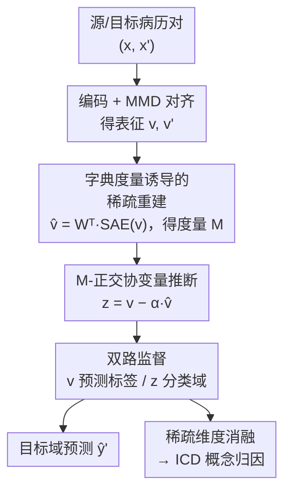

# Exploring Accurate and Transparent Domain Adaptation in Predictive Healthcare via Concept-Grounded Orthogonal Inference

**会议**: ICML2026  
**arXiv**: [2602.12542](https://arxiv.org/abs/2602.12542)  
**代码**: 待确认  
**领域**: 医学NLP / 域适应 / 可解释性  
**关键词**: EHR预测, 域适应, 稀疏自编码器, 正交分解, 概念归因

## 一句话总结
ExtraCare 用一个"字典度量诱导的正交分解"把电子病历（EHR）患者表征拆成「跨域不变的标签信息」和「域特有的协变量残差」，既在两个真实 EHR 数据集上超过现有域适应基线，又能通过稀疏维度消融把每个隐变量映射回具体 ICD 医学概念，告诉临床医生"适应过程中保留了什么、丢掉了什么"。

## 研究背景与动机

**领域现状**：深度学习在 EHR 临床事件预测（如诊断预测、心衰预测）上已有成效，但模型在 A 医院训练、换到 B 医院或换个时间段部署时性能常常大幅下降——这是分布偏移（distribution shift）造成的。域适应（Domain Adaptation, DA）方法因此被引入，主流做法是**特征对齐**：用最大均值差异（MMD）或对抗训练把源域、目标域的特征拉到同一空间，让模型只关注"跨域共享"的成分。

**现有痛点**：临床医生几乎不在常规诊疗里采用这些 DA 方法，根本原因是**不透明**。DA 本质上是一个"在患者表征上做选择"的过程——决定哪些信息保留（不变）、哪些被当作域噪声剔除（协变）。但绝大多数 DA 方法只在隐空间里操作，医生看不懂"被保留的"和"被剔除的"在医学上到底是什么。一旦模型出错，没法验证、没法 debug。

**核心矛盾**：把可解释性接到 DA 上有两个具体障碍。其一，稀疏自编码器（SAE）这类可解释工具通常是**事后（post hoc）** 套上去的——重建目标和训练目标解耦，得到的解释更像是"模型参数的镜像"而非"真实病历的反映"，存在偏置。其二，几乎所有 DA 方法只强调"学到了哪些不变概念"，却**看不到被剔除的域相关信息是什么**——而在临床上，知道"模型忽略了什么"和"模型依赖什么"同样关键（否则适应过程可能悄悄抹掉有意义的亚组模式）。

**本文目标**：做一个既准又透明的临床 DA 框架，要能（1）把患者表征显式拆成不变成分和协变成分，（2）对两者都给监督，（3）把稀疏维度映射回医学概念，并区分某个概念是"驱动标签预测"还是"反映域偏移"。

**切入角度**：作者注意到许多临床预测任务本身就是"代码级预测"（如诊断预测的输出就是标准化 ICD 码），天然适合用 SAE 把隐表征拆成一组对齐医学概念的稀疏因子。于是把 SAE 从"事后解释工具"改造成"训练内嵌的几何先验"，并在它诱导的几何里做正交分解。

**核心 idea**：用一个由 SAE 字典权重诱导的度量 $M=W_\theta^\top W_\theta$ 定义"正交"，把患者表征 $v$ 在这个度量下分解为「沿重建方向的不变部分」+「与之 $M$-正交的域残差 $z$」，再对 $v$ 和 $z$ 分别施加标签监督与域监督——不变与协变的功能分离不靠额外神经模块，而靠几何投影实现。

## 方法详解

### 整体框架

ExtraCare 的输入是一对患者序列 $(x, x')$，分别来自源域 $\mathcal{D}_s$（有标签）和目标域 $\mathcal{D}_t$（无标签）；每个患者 $x_i \in \mathbb{R}^{T\times|\mathcal{C}|}$ 是按就诊次序排列的医学码序列。输出是目标域上的临床事件预测（下一次就诊的诊断码 / 心衰二分类），外加一份"哪些医学概念驱动预测、哪些反映域偏移"的概念级解释。

整条管线分四步串起来：先用编码器 $f_\phi$ 把 $x,x'$ 编成表征 $v,v'$，配标签预测头 $p_\zeta$ 并用 MMD 对齐两域（特征提取与对齐）；再用 SAE $h_\theta$ 把 $v$ 重建为 $\hat v$，同时这个 SAE 的字典权重诱导出一个度量 $M$（对齐特征重建）；接着在 $M$ 度量下把 $v$ 投影到 $\hat v$ 方向，残差 $z = v - \alpha\hat v$ 就是与不变部分 $M$-正交的域协变量（正交协变量推断）；最后对 $z$ 接一个域分类器 $d_\omega$，逼它只承载域信息，而 $v$ 继续只为标签预测服务（域监督与训练）。推断时只走 $f_\phi \to p_\zeta$ 这条主干预测目标域标签；解释时则对稀疏维度做消融、看输出概率变化，把维度归因到 ICD 概念。

### 关键设计

**1. 字典度量诱导的稀疏重建：让解释长在训练里、而不是事后贴上去**

事后 SAE 的偏置来自"重建和训练目标解耦"。ExtraCare 把 SAE 直接嵌进训练：用绑定权重把表征 $v$ 编成稀疏码再重建，$s = h_\theta(v) = \text{ReLU}(W_\theta v)$，$\hat v = W_\theta^\top s$，ReLU 加 L1 稀疏约束让每个维度尽量捕捉一个语义独立、可解释的因子。

关键创新是不用普通欧氏内积衡量重建误差，而是定义一个**字典诱导的潜在度量** $M = W_\theta^\top W_\theta$（对称半正定，构成合法的伪内积），并在这个度量下算重建损失：

$$\mathcal{L}_{\mathrm{rec}} = \|v - \hat v\|_M^2 + \gamma\|s\|_1, \quad \|v-\hat v\|_M^2 = (v-\hat v)^\top M (v-\hat v).$$

之所以要换度量：SAE 字典里不同方向对应的语义因子尺度和相关性不一样，直接用欧氏内积量"相似/正交"会和学到的字典结构不一致。用 $M$ 度量则保证后续的正交分解和重建几何自洽。作者还证了一条引理（Lemma 1，$M$-正交投影稳定性）：当重建误差 $\|v-\hat v\|_M \le \delta$ 时，用 $\hat v$ 当参考方向做的投影对重建误差是稳定的（误差被 $C\|v-\hat v\|_M$ 控住），为下一步分解的可靠性兜底。

**2. M-正交协变量推断：把"域残差"显式构造出来，而不是靠对抗去抹掉**

标签监督 + MMD 只能让 $v$ 接近不变，但 $v$ 里仍残留没被对齐掉的域相关因子。ExtraCare 不像传统解耦那样"用域判别器混淆掉域信息"，而是把域协变量定义成 $v$ 相对重建方向 $\hat v$ 的 $M$-正交残差：

$$\alpha = \frac{\langle v, \hat v\rangle_M}{\|\hat v\|_M^2 + \varepsilon}, \quad z = v - \alpha\hat v.$$

这里 $\alpha$ 衡量 $v$ 在 $M$ 几何下与重建方向的对齐程度，$\varepsilon$ 是数值稳定常数。作者用一条命题（Proposition 1）说明这不是拍脑袋构造：$\alpha$ 恰好是一维 $M$-加权最小二乘 $\arg\min_\alpha(\|v-\alpha\hat v\|_M^2 + \varepsilon\alpha^2)$ 的唯一闭式解，且在 $\varepsilon\to 0$ 时 $z$ 严格满足 $\langle z, \hat v\rangle_M = 0$。也就是说，残差 $z$ 在字典几何下与不变方向正交，这个几何约束逼着下游域分类器只能依赖残差变化来判域——不变与协变的功能分离由投影几何天然保证，不需要再加神经模块。

**3. 残差域监督 + 信息分配论证：逼域信息集中到 $z$、把 $v$ 留给标签**

构造出 $z$ 后，对它接一个域分类器 $d_\omega$，用二元域指示 $\delta\in\{0,1\}$（源域 0、目标域 1）做交叉熵监督：

$$\mathcal{L}_{\mathrm{dcl}} = \mathbb{E}_{P_s}[\ell_{\text{CE}}(\omega; z, 0)] + \mathbb{E}_{P_t}[\ell_{\text{CE}}(\omega; z', 1)].$$

和"对抗混淆"路线相反，这里是**显式地让 $z$ 变得域可分**。作者给了一个直觉性的信息分配刻画（Remark）：若对齐让 $v$ 空间的两域差异很小 $\mathrm{MMD}(P_s^v, P_t^v)\le\eta$，则 $I(\delta; z)\gtrsim 1 - h(e_z)$、$I(\delta; v)\lesssim C\eta^2$（$h$ 为二元熵，$e_z$ 为从 $z$ 预测域的贝叶斯误差）。当对齐使 $\eta\to 0$（$v$ 难以判域）、而 $z$ 上的域分类越来越准（$e_z\to 0$），域信息就被挤到 $z$ 而非 $v$。作者特别注明 $\gtrsim/\lesssim$ 是非正式关系，不是严格上界（⚠️ 以原文为准）。

**4. 三阶段训练 + 稀疏维度消融归因：先稳标签、再装字典、最后分域，解释时反查 ICD**

训练分三阶段渐进：① 只用 $\mathcal{L}_{\mathrm{label}}$（含 MMD 对齐项，见下）更新 $f_\phi, p_\zeta$ 稳住标签预测；② 加上 $M$ 诱导的 SAE，最小化 $\mathcal{L}_{\mathrm{label}} + \lambda_2\mathcal{L}_{\mathrm{rec}}$；③ 再加域分类，最小化 $\mathcal{L}_{\mathrm{label}} + \lambda_2\mathcal{L}_{\mathrm{rec}} + \lambda_3\mathcal{L}_{\mathrm{dcl}}$。其中标签损失本身带了"重缩放的 MMD 正则"：

$$\mathcal{L}_{\mathrm{label}} = \mathbb{E}_{P_s}[\ell_{\text{CE}}(\phi,\zeta; x, y)] + \lambda_1\frac{\text{MMD}(v'_\mu, v_\mu)}{\|\mathrm{sg}(v_\mu)\|_\mathcal{F}^2},$$

分母用停梯度的 $\mathrm{sg}(v_\mu)$ 做尺度归一化。解释阶段沿用 Bricken 等人的做法：对第 $i$ 个患者 top-$k$ 激活的稀疏维度做消融，得到消融后嵌入 $\tilde s^{(i,k)}$，重算所有类别概率、看绝对概率变化 $\Delta\text{prob}^{(i,k)}(c)$，由此把每个非零维度归因到最相关的 ICD 码，并进一步判断它是"驱动标签"还是"反映域偏移"。

### 损失函数 / 训练策略

总损失是三项的加权线性组合 $\mathcal{L}_{\mathrm{label}} + \lambda_2\mathcal{L}_{\mathrm{rec}} + \lambda_3\mathcal{L}_{\mathrm{dcl}}$，按上面三阶段逐步引入。$\lambda_1$ 控对齐正则强度，$\gamma$ 控稀疏强度，$\varepsilon$ 是投影数值稳定项。推断时只走 $f_\phi\to p_\zeta$，目标域样本 $x'$ 直接出预测 $\hat y' = p_\zeta(f_\phi(x'))$，SAE、域分类器、残差推断都不参与前向预测，只在训练和解释时用。

## 实验关键数据

### 主实验

两个真实 EHR 数据集：eICU（187/208 家美国医院 ICU，2014–2015，考察**空间偏移**）和 OCHIN（2,400+ 机构、40+ 州、2012–2023，考察**时间偏移**）。任务为诊断预测（多标签，指标 w-F1 / R@k）和心衰预测（二分类，指标 AUROC / F1）。Oracle 直接在目标域训练（上界），Base 只用源域（下界）。

| 数据集 | 任务 / 指标 | Base(下界) | 之前最好基线 | ExtraCare | Oracle(上界) |
|--------|-------------|-----------|-------------|-----------|-------------|
| eICU | 诊断 w-F1 | 61.09 | 64.34 (RMMD) | **68.61** | 69.72 |
| eICU | 诊断 R@10 | 76.54 | 79.07 (RMMD) | **82.19** | 84.66 |
| eICU | 心衰 AUROC | 84.52 | 89.77 (BUA) | **91.88** | 92.54 |
| OCHIN | 诊断 w-F1 | 63.77 | 71.77 (BUA) | **74.05** | 76.14 |
| OCHIN | 心衰 AUROC | 91.40 | 95.05 (BUA) | **95.48** | 97.22 |
| OCHIN | 心衰 F1 | 74.88 | 83.04 (SSRT) | **85.38** | 86.52 |

ExtraCare 在两类偏移、两个任务上几乎全面领先现有特征对齐 / 解耦 / 自训练基线（DANN、RMMD、RSDA、BUA、RCG、CST、SSRT 等），且与"在目标域直接训练"的 Oracle 上界差距很小——说明换来可解释性几乎没牺牲精度。

### 消融实验

| 配置 | eICU 诊断 w-F1 | OCHIN 心衰 F1 | 说明 |
|------|---------------|--------------|------|
| ExtraCare (Full) | **68.61** | **85.38** | 完整模型 |
| w/o $\mathcal{L}_2\,\&\,\mathcal{L}_3$ | 64.87 | 81.36 | 去掉重建 + 域分类（退回纯对齐）掉得最多 |
| w/o $W, z\,\&\,\mathcal{L}_3$ | 66.73 | 83.92 | 去掉字典几何与残差推断 |
| w/o $M, z_{\perp p}$ | 67.58 | 84.72 | 去掉 $M$ 度量正交投影 |
| w/o $\mathcal{L}_3$ | 66.14 | 83.34 | 仅去域分类监督 |

### 关键发现

- **正交分解 + 域监督是性能主力**：同时去掉重建和域分类（退化成普通 MMD 对齐）时掉点最严重（eICU 诊断 68.61→64.87），说明显式建模"域残差"而非只对齐不变特征确实带来增益。
- **几何度量 $M$ 有用但非最大贡献**：去掉 $M$-正交投影（用普通欧氏正交）只小幅下降（68.61→67.58），说明字典度量主要保障的是解释自洽与稳定性，对纯精度的边际贡献相对温和。
- **概念归因可落地**：通过对 top-3 稀疏维度消融、设 $\Delta\text{prob}>0.05$ 阈值，能把 ICD10-CM 码按"标签影响 / 域敏感"二维分类，区分出"可迁移证据"与"偏移敏感变化"——这正是回答 RQ2/RQ3 的可解释性证据。

## 亮点与洞察
- **把 SAE 从"事后解释"改造成"训练内嵌的几何先验"**：度量 $M=W_\theta^\top W_\theta$ 既定义重建损失又定义正交性，让解释与训练目标耦合，回避了 post-hoc 解释的偏置——这个"用字典权重诱导度量"的思路可迁移到任何想做概念归因的稀疏表征任务。
- **正交残差代替对抗混淆**：传统解耦靠域判别器对抗去抹掉域信息，本文反其道——显式构造 $M$-正交残差 $z$ 并直接监督它去判域，不变/协变分离由闭式投影几何保证，不加额外模块。这种"几何分离 + 双路监督"比对抗训练更稳、更可解释。
- **"看得见被丢掉的东西"**：多数 DA 只告诉你保留了什么，ExtraCare 同时暴露被当作域噪声剔除的 $z$，临床上能据此检查"适应是否抹掉了有意义的亚组模式"，这是对临床信任的实质性补强。

## 局限与展望
- **协变量偏移假设较强**：方法基于"标签条件分布跨域一致、只有协变量偏移"的假设（$\mathbb{E}_{P_s}[y|x] = \mathbb{E}_{P_t}[y|x']$），现实中标签偏移、概念漂移也存在，超出该假设时分解可能失真。
- **信息分配论证是直觉性的**：$I(\delta;z)$、$I(\delta;v)$ 的关系作者明确标注为"非正式关系、非严格上界"，缺乏严格保证（⚠️ 以原文为准）；正交性也只在 $\varepsilon\to 0$ 极限严格成立。
- **解释依赖消融的稳健性**：概念归因靠 top-$k$ 维度消融 + 阈值 0.05，阈值与 $k$ 的选择对归因结论有影响，论文未充分讨论其敏感性。
- **只在两个 EHR 数据集、两类任务上验证**：扩展到影像、多模态或更多临床任务时的可迁移性仍待考察。

## 相关工作与启发
- **vs 域分离网络 DSN / 解耦类 DA（DAL、RCG）**：它们也把特征拆成共享 / 私有子空间并用正交约束，但通常在欧氏几何下、且把私有成分当作要抑制的噪声；本文在字典诱导的 $M$ 几何下做正交，并把私有残差显式监督成域可分，兼顾精度与可审计性。
- **vs 对抗特征对齐（DANN、RMMD、BUA）**：它们靠混淆域判别器学不变特征，是黑盒；ExtraCare 在可比甚至更优的精度下额外给出概念级解释。
- **vs AutoCodeDL / 医学编码可解释工作（Wu et al. 2024、label-wise attention）**：这些把 token 嵌入映射到医学码做事后解释，本文进一步要求"解释适应过程而非只解释最终输出"，把稀疏字典接入 DA 的训练闭环。

## 评分
- 新颖性: ⭐⭐⭐⭐ 把字典诱导度量 + 闭式正交残差用于可解释临床 DA，组合新颖且有理论佐证。
- 实验充分度: ⭐⭐⭐⭐ 两个大规模真实 EHR、空间/时间双偏移、多基线 + 完整消融 + 概念归因案例。
- 写作质量: ⭐⭐⭐⭐ 动机—方法—理论—实验链条清晰，公式与命题完整；部分论证标注为非正式。
- 价值: ⭐⭐⭐⭐ 临床落地刚需"准 + 透明"，思路对可解释表征学习有迁移价值。

<!-- RELATED:START -->

## 相关论文

- [\[ACL 2026\] Language Reconstruction with Brain Predictive Coding from fMRI Data](../../ACL2026/medical_nlp/language_reconstruction_with_brain_predictive_coding_from_fmri_data.md)
- [\[ACL 2026\] Text-Attributed Knowledge Graph Enrichment with Large Language Models for Medical Concept Representation](../../ACL2026/medical_nlp/text-attributed_knowledge_graph_enrichment_with_large_language_models_for_medica.md)
- [\[AAAI 2026\] MIRAGE: Scaling Test-Time Inference with Parallel Graph-Retrieval-Augmented Reasoning Chains](../../AAAI2026/medical_nlp/mirage_scaling_test-time_inference_with_parallel_graph-retrieval-augmented_reaso.md)
- [\[ICLR 2026\] SimpleToM: Exposing the Gap between Explicit ToM Inference and Implicit ToM Application in LLMs](../../ICLR2026/medical_nlp/simpletom_exposing_the_gap_between_explicit_tom_inference_and_implicit_tom_appli.md)
- [\[ICLR 2026\] Can SAEs Reveal and Mitigate Racial Biases of LLMs in Healthcare?](../../ICLR2026/medical_nlp/can_saes_reveal_and_mitigate_racial_biases_of_llms_in_healthcare.md)

<!-- RELATED:END -->
