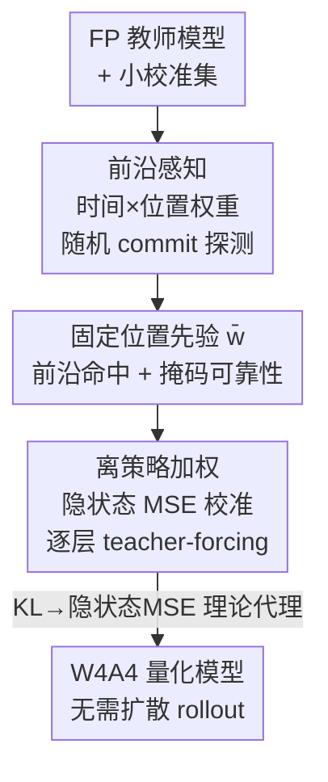

# FAIR-Calib: Frontier-Aware Instability-Reweighted Calibration for Post-Training Quantization of Diffusion Large Language Models

**会议**: ICML2026  
**arXiv**: [2606.06547](https://arxiv.org/abs/2606.06547)  
**代码**: 待确认  
**领域**: 模型压缩 / 量化  
**关键词**: 后训练量化, 扩散语言模型, W4A4, 校准, KL 代理目标

## 一句话总结
针对扩散语言模型（dLLM）"写入即不可改"的脆弱性，FAIR-Calib 先用全精度教师探测出一份"前沿位置先验"，再用这份权重去做逐层加权隐状态 MSE 校准，从而在 W4A4 下专门保护那些一旦被量化误差翻转就会被永久锁死并放大的边界 token，在 LLaDA / Dream 上稳定超过现有量化基线。

## 研究背景与动机
**领域现状**：扩散语言模型（dLLM，如 LLaDA、Dream）把整段回答先初始化为全 `[MASK]`，再用双向注意力多步去噪，每一步把一部分掩码位置"解掩"成具体 token。它是自回归解码之外的一条有前途的路线，但多步全局精炼带来了高昂的推理算力和显存开销，因此后训练量化（PTQ）对落地至关重要。

**现有痛点**：把自回归 LLM 的经典低比特 PTQ（RTN / QuaRot / FlatQuant）直接搬到 dLLM 上，在困难推理任务上掉点明显。作者把这种脆弱性归因于 dLLM 特有的**不可逆写入（commit）**机制：一个 token 一旦被写入就成为后续步骤的条件上下文，再也不能修改——即使模型对该位置的后验信念还在继续演化。

**核心矛盾**：作者揭示了一个根本性错配——**"写入 ≠ 稳定"（commitment ≠ stabilization）**。他们定义稳定滞后 $\delta_{\text{lag}}$ 为"某位置第一次被不可逆写入后，再过多少步它的 top-1 预测才与最终解码 token 保持一致"。即使在全精度下，这个分布也有一条很重的尾巴：相当一部分位置在被写入很久之后，top-1 预测仍在震荡。这些"脆弱写入态"对扰动极其敏感，量化误差很容易在写入前沿翻转一个边界决策，而错误一旦被锁进上下文，就会在后续精炼步里被**逐步放大**，严重拖垮生成质量。更糟的是，标准 PTQ 校准反而会加重这种脆弱性、把尾巴拉得更长。

**本文目标**：在不做昂贵的端到端扩散 rollout 的前提下，让低比特校准**有针对性地**保护这些脆弱的前沿写入位置，而不是对所有位置一视同仁。

**核心 idea**：用"前沿不可逆性 + 掩码阶段可靠性"估一份与位置相关的先验，把它当权重压进逐层隐状态 MSE 校准里——本质是把"哪些位置一旦量化出错代价最大"这一信息，从教师模型里探测出来再迁移到校准目标上。

## 方法详解

### 整体框架
FAIR-Calib 把"误差在哪里被放大"和"校准怎么做"两件事解耦成两个阶段。**阶段一（教师探测）**：跑少量全精度教师 rollout，在随机 commit 策略下统计每个生成位置的脆弱程度，累加成一份固定的位置先验 $\bar{w}$。**阶段二（静态加权校准）**：用 $\bar{w}$ 作权重，对量化模型做标准的逐层 teacher-forcing 校准——喂入完整无掩码的真实 token，对齐量化模型与教师的隐状态，最小化加权 MSE。整套流程不需要在校准时反复 rollout 扩散链，因此既便宜又能优先保护高影响的前沿写入。

之所以阶段一用**随机 commit**而非推理时的真实策略，是因为随机掩码与 dLLM 预训练/SFT 时的腐蚀方式对齐，能给出策略无关、对部分掩码状态覆盖更广的探测，从而让 $\bar{w}$ 反映模型的内在结构性敏感度，可跨语料迁移复用。

### 关键设计

**1. 前沿感知的时间×位置权重：把"哪里最该保护"量化成可迁移先验**

这一设计直接对应"写入≠稳定"的痛点——既然只有被写入的位置才会把错误锁死、且越早写入的位置影响越多后续步骤，那校准就该优先盯着这些位置。作者在教师 rollout 的每一步沿生成区累加两个加性分量：

$$w_i \leftarrow w_i + \lambda_0(t)\,\mathbf{1}\{i \in \widehat{C}_t\} + \lambda_1\,\tilde{c}_{t,i}\,\mathbf{1}\{i \in \mathcal{M}(S_t)\}$$

其中 $\widehat{C}_t$ 是这一步真实采样到的写入前沿，第一项 $\mathbf{1}\{i\in\widehat{C}_t\}$ 是"前沿命中"指示——标记位置 $i$ 在何时被不可逆写入；$\lambda_0(t)$ 采用**早期增强（early-boost）**时间调度，强调早写入的位置（它们影响更多后续精炼步）。第二项里 $\tilde{c}_{t,i}$ 是位置仍处于掩码态时、由教师分布算出的"掩码阶段可靠性/锐度"分数（如 token 概率、负熵或 margin，按行归一化），充当一个可靠性门控：当聚合一份要离策略复用的静态先验时，它会下调那些教师在掩码期间频繁含糊的位置，从而压低有限样本下的估计噪声。权重沿步骤**加性累加**，最后对齐到末尾 $K$（如 $K=256$）的生成窗口并归一化，窗口外给一个很小的 floor 权重以保证逐层校准的数值稳定。

**2. 离策略静态 teacher-forcing 加权隐状态 MSE 校准：用便宜的代理换掉昂贵的 rollout**

如果直接在扩散轨迹上端到端优化校准参数，就得对量化模型把所有步都 rollout 一遍并迭代更新，代价高到不可行，也和标准逐层 PTQ 校准不兼容。作者改用一个离策略代理：不在 commit 策略诱导的在线掩码态上校准，而是**喂入完整观测的真实 token（无掩码）**，逐层对齐量化模型与教师的隐表示。对每一层/块 $\ell$ 按顺序只校准 $\theta_\ell$、冻结其余层：

$$\arg\min_{\theta_\ell}\ \mathbb{E}_{(x,y)\sim\mathcal{D}}\Big[\sum_{i=1}^{N}\bar{w}_i\,\big\|h_{\ell,i}^{q}(x,y;\theta_{\leq\ell}) - h_{\ell,i}^{\star}(x,y)\big\|_2^2\Big]$$

$\theta_{\leq\ell}$ 表示更早的层已校准并冻结。这里 $\bar{w}_i$ 正是阶段一探测出的固定先验，等于把校准的"注意力"集中到脆弱前沿位置上。之所以能把掩码探测得到的先验直接拿到全文校准里用，是因为作者主张"位置脆弱性是模型权重与解码动力学决定的内在结构属性"，因此跨设置复用不损相关性。

**3. 从输出 KL 到加权隐状态 MSE 的理论代理：解释为什么这个加权目标是对的**

为了说明阶段二的加权 MSE 不是拍脑袋，作者证明它是输出层 KL 散度 $\mathrm{KL}(\mu^\star\|\mu^q)$（教师与量化模型最终解码分布之差）的一个有原则的上界代理。推导分三步：先用数据处理不等式把输出 KL 上界到整条解码**轨迹** KL，再按 Markov 链的 KL 链式法则把轨迹 KL 分解成逐步核散度之和（Lemma 4.1–4.2）；接着在模型无关的随机 commit 下证明每一步的核散度**只在被写入位置上**有贡献（Proposition 4.4），从而得到"先对时间求和、再对位置求和"的结构，正好佐证了设计 1 的加性时间×位置累加；最后用 log-sum-exp 的 $1/2$-光滑性把 token 级 KL 上界到平方 logit 误差（$\mathrm{KL}(p\|q)\le\tfrac14\|z'-z\|_2^2$），再借后缀网络的 Lipschitz 性桥接到隐状态 MSE：

$$\mathrm{KL}(\mu^\star\|\mu^q)\ \le\ \frac{L_\ell^2}{4}\sum_{t=1}^{T}\mathbb{E}_{S_t\sim d_t^\star}\mathbb{E}_{C_t}\Big[\sum_{i\in C_t}\big\|h_{\ell,i}^{q}(S_t)-h_{\ell,i}^{\star}(S_t)\big\|_2^2\Big]$$

这条链条同时解释了一个工程问题：为什么直接对隐特征套 softmax-KL 没必要——加权隐状态 MSE 本身就是 KL 一致的代理。（⚠️ 完整证明与"推理时模型相关策略 vs 随机 commit 分析"之间的策略偏移项见原文 Appendix B，以原文为准。）

### 损失函数 / 训练策略
量化沿用 FlatQuant 的可学习仿射展平变换：对每个线性层 $y=Wx$ 引入可逆重参 $\tilde W = UWV^{-1},\ \tilde x = Vx$，先展平权重/激活分布再做均匀对称量化（$z=0$）。阶段二即在此基础上把通用逐层重构损失实例化为上面那条 $\bar w$-加权隐状态 MSE。默认用较短的校准序列长度 1024，探测预算 $N_{\text{probe}}=512$ 即可让 $\bar w$ 估计饱和。

## 实验关键数据

### 主实验
W4A4（权重、激活均 4-bit）下，在 LLaDA / Dream 两大家族、10 个基准（PIQA / BoolQ / WinoGrande / ARC-E/C / HellaSwag / TruthfulQA-MC2 / MMLU / HumanEval / GSM8K）上对比。FAIR-Calib 一致优于 RTN / QuaRot / FlatQuant，且最接近全精度（FP）。

| 模型 | FP | FlatQuant | FAIR-Calib | 距 FP 差距 |
|------|----|-----------|-----------|-----------|
| LLaDA-Base | 62.12 | 59.37 | **61.09** | −1.03 |
| LLaDA-Instruct | 73.81 | 71.38 | **72.40** | −1.41 |
| LLaDA-1.5 | 73.53 | 71.94 | **72.75** | −0.78 |
| Dream-Base | 70.01 | 62.08 | **64.64** | −5.37 |
| Dream-Instruct | 71.01 | 63.98 | **66.66** | −4.35 |

（数值为 10 基准平均准确率 %。Dream 家族量化更难，FAIR-Calib 相对 FlatQuant 的增益也最大，如 Dream-Base 上从 62.08 抬到 64.64。）

### 消融实验
在 Dream-Base 的 10 基准平均上拆开两路信号：

| 配置 | 平均准确率 | 说明 |
|------|-----------|------|
| baseline（均匀 PTQ） | 61.76 | 不加位置先验 |
| 仅前沿命中（frontier-hit only） | 63.12 | 只留写入前沿指示项 $\lambda_0(t)$ |
| 仅掩码可靠性（masked-stage only） | 62.89 | 只留掩码阶段可靠性项 $\lambda_1$ |
| FAIR-Calib（两者结合） | **64.64** | 完整模型 |

### 关键发现
- 两路信号互补：前沿命中负责"挑出下游影响最大的不可逆写入位置"，掩码可靠性负责"在期望意义上下调教师频繁含糊的位置、降低跨语料复用静态先验时的有限样本噪声"，单独用都比均匀基线好，合在一起最好。
- 时间调度很关键：$\lambda_0(t)$ 用 early-boost（强调早写入）最优，late-boost 明显更差——印证"早写入位置影响更多后续步、纠正它们更能抑制不可逆误差放大"的直觉。
- 探测预算适中即可：$N_{\text{probe}}$ 在 512–1024 附近就饱和，说明 $\bar w$ 用很小的探测开销就能估准。
- 机制级验证：FAIR-Calib 显著减少 teacher-forced 写入步翻转、压低 post-commit 失配（含 "mean-disagree" 与 "never-agree" 两类），并抑制由假写入触发的概率-MSE 逐步放大。

## 亮点与洞察
- **把"扩散解码的不可逆性"翻译成可量化的脆弱度信号**：稳定滞后 $\delta_{\text{lag}}$ 和"写入≠稳定"是很干净的诊断框架，直接指出了 dLLM 量化区别于自回归量化的本质难点——错误会被锁死并放大，而不是被后续步冲淡。
- **先验探测与校准解耦、且证明可迁移**：用随机 commit 探测出策略无关的结构先验，再离策略复用到 teacher-forcing 校准，绕开了昂贵的端到端 rollout，是一个很实用的工程-理论结合点。
- **加权隐状态 MSE 有 KL 一致性保证**：从输出 KL 一路下推到"只对被写入位置加权的隐状态 MSE"，让"为什么这样加权"有了原则性解释，可迁移到其他带不可逆决策的生成式压缩场景。

## 局限与展望
- 理论里的精确稀疏分解建立在**模型无关随机 commit**假设上，而真实推理用的是模型相关策略（Dream 熵驱动、LLaDA 置信度驱动），教师与量化模型可能诱导不同的 commit 集，引入额外的策略偏移项（作者放在 Appendix B.1，正文只通过机制级指标间接验证）。
- 评测集中在 W4A4 与 LLaDA/Dream 两家族，更激进比特宽（如 W2/W3）、更多 dLLM 家族、更长生成窗口下的表现还需进一步验证。
- 位置先验默认对齐末尾 $K=256$ 窗口并给窗口外 floor 权重，超长上下文/超长答案时窗口对齐策略可能需要重新设计。

## 相关工作与启发
- **vs FlatQuant / QuaRot / RTN**：这些是为自回归 LLM 设计的低比特联合权重-激活量化（仿射展平、旋转条件化、激活平滑），对所有位置同等对待；FAIR-Calib 复用 FlatQuant 的展平变换作底座，但额外加了一层"前沿感知位置加权"，专门补上"扩散解码不可逆 commit"这个缺口。
- **vs 直接迁移自回归 PTQ**（Lin et al. 2025 的系统性研究）：他们发现 naive 迁移在困难推理任务上掉点明显但未给机制解释；本文把根因定位到脆弱写入态 + 不可逆锁死，并给出针对性校准方案。
- **vs 端到端扩散校准**：直接在扩散轨迹上优化需要反复 rollout，代价不可行；本文用 teacher-forcing 离策略代理 + 静态先验把开销降到标准逐层 PTQ 水平。

## 评分
- 新颖性: ⭐⭐⭐⭐⭐ 首次把"扩散解码不可逆性"系统地转化为量化校准的位置先验，诊断与方法都新。
- 实验充分度: ⭐⭐⭐⭐ 覆盖两大 dLLM 家族 + 10 基准 + 组件/调度/预算消融，但限于 W4A4。
- 写作质量: ⭐⭐⭐⭐⭐ 诊断→方法→理论代理的逻辑链非常完整自洽。
- 价值: ⭐⭐⭐⭐ 为 dLLM 落地量化提供了即插即用、有理论支撑的校准范式。

<!-- RELATED:START -->

## 相关论文

- [\[ICML 2026\] WinQ: Accelerating Quantization-Aware Training of Language Models Around Saddle Points](winq_accelerating_quantization-aware_training_of_language_models_around_saddle_p.md)
- [\[CVPR 2026\] Sampling-Aware Quantization for Diffusion Models](../../CVPR2026/model_compression/sampling-aware_quantization_for_diffusion_models.md)
- [\[ACL 2026\] CadLLM: Improving the Throughput of Diffusion-based LLMs via Training-Free Confidence-Aware Calibration](../../ACL2026/model_compression/improving_the_throughput_of_diffusion-based_large_language_models_via_a_training.md)
- [\[ACL 2025\] EfficientQAT: Efficient Quantization-Aware Training for Large Language Models](../../ACL2025/model_compression/efficientqat.md)
- [\[CVPR 2025\] Q-DiT: Accurate Post-Training Quantization for Diffusion Transformers](../../CVPR2025/model_compression/q-dit_accurate_post-training_quantization_for_diffusion_transformers.md)

<!-- RELATED:END -->
