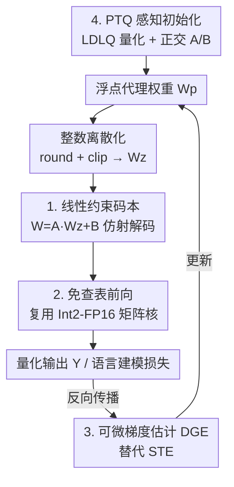

# LC-QAT: Data-Efficient 2-Bit QAT for LLMs via Linear-Constrained Vector Quantization

**会议**: ICML2026  
**arXiv**: [2606.10531](https://arxiv.org/abs/2606.10531)  
**代码**: 待确认  
**领域**: 模型压缩 / LLM 量化  
**关键词**: 2-bit 量化, 向量量化, QAT, 线性约束码本, 数据高效

## 一句话总结
LC-QAT 用一个"共享线性变换 + 离散整数向量"的参数化把向量量化（VQ）的码本查表改写成可微的取整-投影操作，从而让 2-bit VQ 第一次能端到端 QAT，并借助高质量的 PTQ 初始化只用 0.1%–10% 的训练数据就追平甚至超过现有 SOTA 量化方法。

## 研究背景与动机
**领域现状**：把 LLM 压到 1–2 bit 时，量化感知训练（QAT）普遍优于训练后量化（PTQ），因为 QAT 能在训练里调整参数来补偿量化误差。但现有 QAT 几乎都建立在标量量化（SQ）之上——每个权重独立地被量化/反量化成 4 个离散值之一。

**现有痛点**：SQ 在 2-bit 这种极端精度下信息损失极其严重，量化后的初始点离全精度模型很远，必须靠海量训练数据才能"恢复"回来，数据成本高。向量量化（VQ）把一组权重整体映射到共享码本里的某个码字，表达能力远强于 SQ（$d$ 维、每维 4 值时码本含 $4^d$ 个码字），量化后精度高得多。

**核心矛盾**：VQ 的强表达力和"可端到端训练"天然冲突。VQ 量化要做最近邻搜索 $i_g=\arg\min_k \|w_g-c_k\|_2^2$，反量化要查表取 $c_{i_g}$，这两步对码字索引都是**不可微**的，标准反向传播无法更新。现有把 VQ 塞进 QAT 的尝试（如 PV-Tuning）只能用昂贵的坐标下降 / beam search，更新慢且不同步。

**本文目标**：让 2-bit VQ 的权重在标准反向传播下可训练，同时保留 VQ 的高质量初始化优势。

**切入角度**：如果码字不是任意的、而是由一个**共享的仿射变换**作用在离散向量上生成的，那么"选哪个码字"就退化成"选哪个离散向量"，而离散向量可以用取整-截断得到，仿射部分是连续可导的。

**核心 idea**：用线性约束的码本 $c=Az+B$ 替换无约束码本——把离散索引选择变成"取整/截断 + 线性投影"，梯度可以穿过线性映射回传，前向不再需要显式查表。

## 方法详解

### 整体框架
LC-QAT 维护一组浮点的"代理权重" $W_p\in\mathbb{R}^{m\times n}$，但它并不直接表示模型权重，而是经过"离散化 → 仿射解码"两步才得到真正参与计算的有效权重 $\hat{W}$。前向时先把 $W_p$ 取整截断成整数权重 $W_z$，再用一个矩阵内共享的线性约束码本把整数解码成 $\hat{W}$；反向时绕开传统的码本查表，用可微梯度估计器（DGE）让梯度稳定地穿过离散化算子，从而端到端更新 $W_p$。整套流程的整数权重不是随机初始化的，而是来自一次高质量 PTQ，这正是它数据高效的根源。

### 关键设计

**1. 线性约束码本：把"查表选码字"改写成"取整加投影"**

VQ 不可微的根在于最近邻搜索和查表都作用在离散索引上。LC-QAT 让每个码字都由同一个仿射映射生成：$c=Az+B$，其中 $z\in\{0,1,2,3\}^d$ 是离散四元向量，$A\in\mathbb{R}^{d\times d}$、$B\in\mathbb{R}^{d}$ 是矩阵内共享的浮点参数。这样所有码字都落在由 $A,B$ 决定的仿射子空间里，枚举所有 $z$ 隐式得到 $4^d$ 个码字。关键好处是：要确定 $z$ 不再需要最近邻搜索，直接对代理权重取整截断 $W_z=\mathrm{clip}(\mathrm{round}(W_p),0,2^b-1)$ 即可；而 $A,B$ 是连续的，梯度能顺着线性映射回传。和 QuIP#、NestQuant 这类格点 / 嵌套码本方法相比，后者虽然更灵活，但仍依赖查表，而 LC-QAT 的全部码字来自同一个线性变换，因此**免查表**。代价极小：取 $d=4$，$A$ 是 $4\times4$、$B$ 是 $4$ 维，每个权重矩阵只多 20 个参数。

**2. 免查表前向 + 复用整数矩阵核：把额外开销压到可忽略**

把权重按列切成 $G=n/d$ 组后，解码写成 $\hat{W}^T$ 的分块形式 $A W_{z,i}^T+B\mathbf{1}^T$。直接算会引入线性映射的额外开销，作者把输出 $Y=X\hat{W}$ 重排成

$$Y=\sum_{i=1}^{G}(X_iA)W_{z,i}^T+\sum_{i=1}^{G}(X_iB)\mathbf{1}^T$$

这里 $X_iA$ 是浮点激活，而 $W_{z,i}$ 仍是整数矩阵——于是主乘法仍是 Int2×FP16，可以直接复用为标量量化优化好的整数矩阵乘核。反量化的额外计算量是 $O(Nnd)+O(Nn)$，因为组维 $d$ 很小（4 或 8），相对标准 $O(Nnm)$ 几乎可忽略。实测自定义 CUDA 核相比 FP16 基线加速 1.68×，相比 AQLM 量化模型加速 1.43×。

**3. 可微梯度估计 DGE：替代会破坏好初始化的 STE**

离散化 $W_z=\mathrm{clip}(\mathrm{round}(W_p))$ 的导数几乎处处为 0，常规做法是直通估计器（STE）令 $\partial W_z/\partial W_p\approx 1$。但 STE 引入的梯度噪声会在局部极小附近造成显著不稳定。作者的洞察是：SQ 的 2-bit 改动幅度大，反而能把模型推离初始极小，所以 STE 还能用；而 LC-QAT 一开始就在很好的局部极小附近，更容易被 STE 的噪声破坏。于是改用可微梯度估计器 DGE，用平滑函数近似离散化：

$$f(x)=\frac{\delta}{2}\left(1+\mathrm{sign}\left(\frac{2x}{\delta}-1\right)\left|\frac{2x}{\delta}-1\right|^{1/k}\right)$$

其导数为 $f'(x)=\frac{1}{k}\left|\frac{2x}{\delta}-1\right|^{1/k-1}$（$\delta$ 是量化区间，$k$ 控制锐度）。$k$ 越大越逼近硬截断，同时保持平滑可回传的梯度。实现取 $\delta=1$、$k=5$。

**4. PTQ 感知的整数权重初始化：让好的起点真正能用**

标准 SQ 里 $W_p$ 随机或从预训练初始化，$W_z$ 自然是 $W_p$ 的量化结果。LC-QAT 反过来——$W_z$ 来自前置的 PTQ（用 LDLQ 做逐列分组量化并顺序补偿重建误差，并用 Hadamard 变换消异常值），所以必须由 $W_z$ 反推 $W_p$ 的初始值：$W_p=s(W_z-t)$，其中 $s=\dfrac{2a}{2^b-1}$、$t=\dfrac{2^b-1}{2}$、$a=\sqrt{\dfrac{6}{m+n}}$，让 $W_p$ 的统计量对齐 Xavier 初始化（近零均值、层相关方差），既保证推理一致性又稳住训练。码本参数则按 $A=sG$、$B=-sG\mu\mathbf{1}$ 初始化（$G$ 随机正交，$\mu=(2^b-1)/2$，$s=\sqrt{12/(2^{2b}-1)}$），使码本近零均值、单位方差、弱维间相关。损失景观分析显示，LC-QAT 的初始点紧贴 FP16 基线、落在低损盆地且带类似全精度的鞍点结构，而 SQ 初始点远离最优区且附近没有明确局部极小——这解释了它为何更易训、更省数据。

### 损失函数 / 训练策略
训练目标就是标准的语言建模损失，没有额外正则项；创新都在参数化与梯度估计上。训练设置：16×A100，有效批大小 1024 序列，约 1900 步；学习率 Qwen-3-1.7B / LLaMA-3-3B 用 $1\times10^{-4}$、8B 模型用 $3\times10^{-5}$、指令微调用 $1\times10^{-5}$；AdamW + warmup-stable-decay 调度，梯度裁剪阈值 1.0。PTQ 阶段的 Hessian 统计用 RedPajama 的 1024 个样本估计。

## 实验关键数据

### 主实验
评测分两套协议：与 VQ-QAT 比"模型容量"，与 SOTA 的 SQ-QAT 比"数据效率"。下面是 Qwen-3-8B 在 Wikitext-2 困惑度（PPL↓）与六项零样本 QA 平均（Avg↑）上的对比（同等训练数据）：

| 类型 | 方法 | PPL↓ | 平均 QA↑ | 相对 FP16 |
|------|------|------|----------|-----------|
| 全精度 | FP16 | 9.72 | 74.12 | 1.00 |
| SQ-PTQ | GPTQ | 4.68e4 | 37.29 | 0.50 |
| VQ-PTQ | QTIP | 10.39 | 72.04 | 0.97 |
| VQ-PTQ | YAQA | 10.50 | 72.14 | 0.97 |
| VQ-QAT | PV-Tuning | 10.65 | 70.99 | 0.96 |
| VQ-QAT | **LC-QAT** | **10.23** | **72.18** | **0.97** |

在 Qwen-3-1.7B 上同样的趋势：SQ 类（GPTQ PPL 2.80e4 / Avg 36.95）在 2-bit 几乎崩溃，VQ-PTQ 的 YAQA 做到 17.14 / 60.30，而 LC-QAT 作为唯一能端到端训练的 VQ 方法持续领先同等数据下的 PV-Tuning。

### 数据效率

| 对比对象 | 关键结论 |
|----------|----------|
| vs SQ-QAT（ParetoQ 等 SOTA） | 仅用 0.1%–10% 训练数据即匹配或超过 |
| vs VQ-QAT（PV-Tuning） | 同等数据下 PPL 与平均精度均更优，且更新同步、训练更快 |
| vs BitNet 2B4T | BitNet 需 4T token 从头训练，LC-QAT 靠 PTQ 初始化 + 少量微调即可 |

### 关键发现
- 数据效率的根因是 PTQ 初始化质量：损失景观显示 VQ 初始点贴近 FP16，SQ 初始点远离最优区，所以 LC-QAT 起点好、要走的路短。
- 在好初始化下 STE 反而有害，换成 DGE 才能稳定收敛——这是 SQ-QAT 经验不能直接照搬到 VQ-QAT 的关键差异。
- 免查表重排让额外开销几乎为零，自定义核相比 FP16 仍有 1.68× 加速，说明 VQ 的强表达力不必以推理变慢为代价。

## 亮点与洞察
- **把"选码字"翻译成"取整+线性投影"**：用一个共享仿射 $c=Az+B$ 一举消掉最近邻搜索和查表两个不可微环节，是让 VQ 进入端到端 QAT 的关键一招，且每矩阵只多 20 个参数。
- **复用 SQ 的整数核**：通过 $\sum(X_iA)W_{z,i}^T$ 的重排，把线性约束码本的计算映射回成熟的 Int2 矩阵乘，工程上几乎零成本落地。
- **"好初始化要配软梯度"的诊断很有启发**：作者明确解释了为什么 SQ 能用 STE 而 VQ 不能，把方法选择和初始化质量、损失景观联系起来，而不是盲目套用。

## 局限与展望
- 论文聚焦 2-bit 仅权重量化，未涉及激活量化和更低的 1-bit 场景，扩展性待验证。
- 数据效率高度依赖 PTQ（LDLQ + Hadamard）的初始化质量，若 PTQ 退化，端到端阶段的优势可能缩水。
- 线性约束码本相比无约束码本表达力更受限（所有码字共享一个仿射），在某些权重分布上可能不如完全自由的码本，论文未深入讨论这一权衡边界。
- 组维 $d$、锐度 $k$ 等超参的敏感性分析较有限，跨更多模型族的稳健性有待补充。

## 相关工作与启发
- **vs PV-Tuning**：同为 VQ-QAT，但 PV-Tuning 靠坐标下降 / beam search 更新离散索引，慢且不同步；LC-QAT 用线性约束码本实现真正的端到端、同步更新。
- **vs ParetoQ / EfficientQAT（SQ-QAT）**：它们在 2-bit 下信息损失大、依赖海量数据恢复；LC-QAT 借 VQ 的高质量初始化把数据需求降到 0.1%–10%。
- **vs QuIP# / NestQuant（格点/嵌套码本）**：这些方法码字更灵活但仍需查表；LC-QAT 让所有码字来自同一线性变换，换来免查表与可微性。
- **vs BitNet（从头训练）**：BitNet 用 4T token 从零训练低比特模型，LC-QAT 走"PTQ 初始化 + 轻量微调"的低成本路线。

## 评分
- 新颖性: ⭐⭐⭐⭐⭐ 线性约束码本把 VQ 的不可微查表彻底改写成可微算子，让 2-bit VQ 第一次能端到端 QAT
- 实验充分度: ⭐⭐⭐⭐ 覆盖 Qwen-3 / LLaMA-3 多尺度与两套协议，但激活量化、超参敏感性等还可补
- 写作质量: ⭐⭐⭐⭐ 动机—方法—景观分析链条清晰，公式与工程实现交代到位
- 价值: ⭐⭐⭐⭐⭐ 数据效率提升一到三个数量级，对极低比特 LLM 部署很实用
