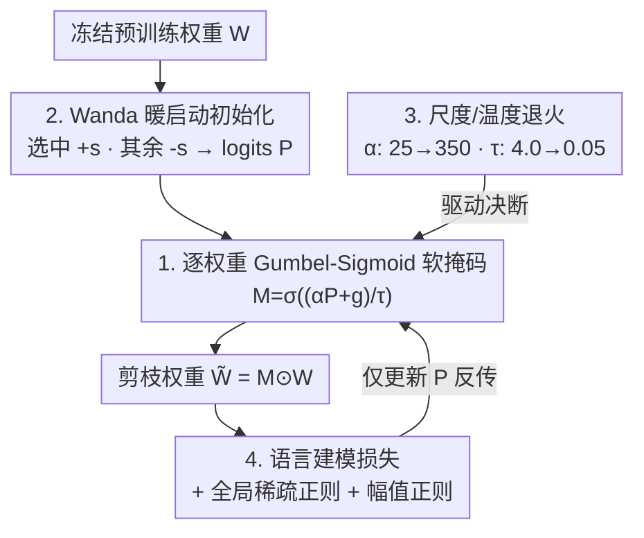

# LEAP: Learnable End-to-End Adaptive Pruning of Large Language Models

**会议**: ICML2026  
**arXiv**: [2605.17289](https://arxiv.org/abs/2605.17289)  
**代码**: [github.com/Paramathic/patch/tree/leap](https://github.com/Paramathic/patch/tree/leap)  
**领域**: 模型压缩 / LLM 剪枝  
**关键词**: 非结构化稀疏, 可学习掩码, Gumbel-Sigmoid, 端到端剪枝, LLM

## 一句话总结
LEAP 把可学习掩码剪枝里"对每个分组的所有合法稀疏模式打一个 logit"的参数化（MaskLLM/PATCH）换成"对每个权重一个 Gumbel-Sigmoid 伯努利门"，绕开非结构化稀疏下组合爆炸的死结，从而第一次把端到端掩码学习搬到非结构化 LLM 剪枝上，在 0.5B–8B 五个模型、50%/60% 稀疏下平均零样本精度比最强逐层基线 ADMM 高 +2.59 分。

## 研究背景与动机
**领域现状**：随着 SpInfer、FlashLLM、MACKO 等核以及晶圆级数据流硬件让非结构化稀疏能在商用 GPU 上真正提速，瓶颈从"怎么执行稀疏"转移到了"怎么以最小精度损失诱导稀疏"。非结构化稀疏比结构化 / 半结构化（如 2:4）保留更高精度，是更值得攻的压缩目标。

**现有痛点**：非结构化 LLM 剪枝的主流（Wanda、SparseGPT、Thanos、ADMM、OPTIMA）都源自 Optimal Brain Surgeon，最小化**逐层**重建误差作为端到端损失的代理。这种代理便宜，但和真正要优化的量不对齐，且局部误差会在深网络里逐层累积、放大，尤其在激进稀疏下精度掉得明显。可学习掩码方法（MaskLLM、PATCH）直接对语言建模损失优化掩码、效果更好，但只适用于半结构化模式。

**核心矛盾**：MaskLLM 给每个分组内的"每一个合法稀疏模式"分配一个 logit，再在这个集合上做 Gumbel-softmax。2:4 稀疏时每组 4 个权重的合法模式只有 $\binom{4}{2}=6$ 个，可行；但要搬到非结构化 50% 稀疏，一行宽 $d=4096$ 的合法掩码数是 $\binom{4096}{2048}\approx10^{1229}$，根本无法存储、更别提索引。这是**组合性的根本障碍**，不是工程量大小的问题——再多算力也救不了。

**本文目标**：找到一个参数量与权重数同阶、与稀疏率无关、且能端到端可微的非结构化掩码参数化。

**切入角度**：放弃"在模式集合上选一个"的范畴分布，改成"每个权重独立地留/剪"的伯努利乘积——参数量退化成 $O(mn)$，正好等于权重数。

**核心 idea**：用逐权重的 Bernoulli-via-Gumbel-Sigmoid 松弛替换 categorical-over-patterns，再配一套轻量稳定化手段（Wanda 初始化、尺度/温度调度、全局稀疏正则、幅值感知项），让非结构化端到端掩码学习在 LLM 规模上可行。

## 方法详解

### 整体框架
LEAP 冻结预训练权重 $W$，只为每个权重矩阵学一个同形状的 logit 矩阵 $P$。前向时把 $P$ 经 Gumbel-Sigmoid 松弛成一个软掩码 $M$、和权重逐元素相乘得到剪枝后权重 $\widetilde{W}=M\odot W$，然后在小规模校准文本上算语言建模损失，再叠加全局稀疏正则和幅值感知正则一起反传——但只更新 $P$，不动 $W$。整个训练靠两条退火调度（尺度 $\alpha$ 升、温度 $\tau$ 降）把软掩码从"广撒网探索"逐步推向接近 $\{0,1\}$ 的"决断"。$P$ 不是冷启动，而是用一次性 Wanda 掩码初始化，让搜索从一个合理的局部起点开始，约 2000 步即可收敛。

### 关键设计

**1. 逐权重 Gumbel-Sigmoid 伯努利门：化解组合爆炸的核心改写**

categorical-over-patterns 的 logit 表大小随每组合法模式数增长，非结构化下是天文数字 $\binom{4096}{2048}$。LEAP 把"在模式集合上选一个"换成"每个权重一个独立伯努利"，参数量从 $O(|\{\text{合法模式}\}|)$ 降到 $O(mn)$——正好等于权重数、且与稀疏率 $\rho$ 无关。具体地，给每个权重矩阵配一个 logit 矩阵 $P\in\mathbb{R}^{m\times n}$，掩码由 Gumbel-Sigmoid 松弛得到：

$$M=\sigma\!\left(\frac{\alpha P+g}{\tau}\right),\qquad g=-\log(-\log(u)),\ u\sim\mathrm{Uniform}(0,1)$$

其中 $\sigma$ 是 sigmoid、$\alpha$ 是尺度、$\tau$ 是温度，$M$ 即 logit 为 $\alpha P_{ij}$、尺度 $\tau$ 的伯努利的连续松弛，最终剪枝权重 $\widetilde{W}=M\odot W$。全程用**软掩码**：LLM 规模下硬采样 + 直通估计器（STE）不稳定，软掩码能让梯度良态，再靠后面的 $\alpha,\tau$ 调度把 $M$ 推向 $\{0,1\}$。这一步是 LEAP 能把端到端掩码学习搬到非结构化的根本原因。

**2. Wanda 暖启动初始化：把搜索从冷启动变成局部微调**

如果 $P$ 从零随机开始，搜索空间太大、训练步数会爆炸。LEAP 用一次性 Wanda 掩码初始化 $P$：被 Wanda（按"权重幅值 × 输入激活范数"打分）选中保留的位置设为 $+s$、其余设为 $-s$（$s>0$ 是初始掩码强度）。这给 sigmoid 松弛一个合理的初始损失，把问题从"全局冷搜索"变成"在一个不错起点附近做局部调整"，因此只需约 2000 步就能收敛——这是 LEAP 轻量的关键。

**3. 尺度/温度退火：从探索到决断的两条调度**

软掩码训练完若还停在 0.5 附近就无法落地成真稀疏。LEAP 用两条调度把 $M$ 逼向二值：尺度 $\alpha$ 从 $\alpha_0$ 升到 $\alpha_T$（如 $25\to350$），放大 $P$ 把 $\sigma$ 往 $\{0,1\}$ 推；温度 $\tau$ 从 $\tau_0$ 降到 $\tau_T$（如 $4.0\to0.05$），让 sigmoid 越来越陡。早期 $\tau$ 大、$\alpha$ 小，掩码软、探索很多候选支撑集；后期 $\tau$ 小、$\alpha$ 大，掩码硬、逐步"承诺"到最终的留/剪决定。

**4. 全局稀疏正则 + 幅值感知稳定化：约束密度又不丢关键权重**

要达到目标密度 $\rho$ 又不退化，LEAP 加两项正则。其一是**全局**稀疏正则（不是逐层）：

$$\mathcal{L}_{\mathrm{sparsity}}=\lambda_1\left|\frac{1}{N}\sum_i\|\widetilde{M}_i\|_1-\rho\right|$$

把所有可剪层的总密度逼近 $\rho$，让各层根据端到端重要性自行调整密度，而不是被硬性平摊。其二是**幅值感知**项 $\mathcal{L}_{\mathrm{weight}}=-\lambda_2\sum_i\|\widetilde{W}_i\|_1$（$\lambda_2\sim10$），偏好保留高幅值权重，稳住掩码学习、避免"保留一堆小权重却丢掉几个关键权重"的退化极小。完整目标是 $\mathcal{L}=\mathcal{L}_{\mathrm{LM}}(\widetilde{W};X)+\mathcal{L}_{\mathrm{sparsity}}+\mathcal{L}_{\mathrm{weight}}$，且只训练 $P$、冻结 $W$。冻结是刻意的范围选择：保住预训练权重的校准、把"掩码"孤立成唯一被学习的对象，也让部署管线简单，并和后续任意微调 / 蒸馏兼容。

### 损失函数 / 训练策略
掩码训练 2000 步、批大小 256、序列长 4096，数据来自 SlimPajama，权重全程冻结。评测在 WikiText2 困惑度（序列长 4096）和六项零样本任务（PIQA、ARC-E、ARC-C、Winogrande、OpenBookQA、MMLU）上做，用 lm-evaluation-harness。

## 实验关键数据

### 主实验
五个模型（Qwen-2.5 0.5B、Gemma-3 1B、LLaMA-3.2 1B/3B、LLaMA-3.1 8B）在 50%/60% 非结构化稀疏下评测。下表为 LLaMA-3.1 8B 的 WikiText2 PPL↓ / 六任务平均精度↑：

| 稀疏率 | 方法 | PPL↓ | 平均精度↑ |
|--------|------|------|-----------|
| 0% | Dense | 5.84 | 63.89 |
| 50% | Wanda | 9.64 | 55.81 |
| 50% | SparseGPT | 9.30 | 57.33 |
| 50% | ADMM（最强逐层） | 9.12 | 57.50 |
| 50% | **LEAP** | **7.66** | **57.71** |
| 60% | ADMM | 14.10 | 50.61 |
| 60% | **LEAP** | **8.82** | **54.47** |

跨 10 个（模型, 稀疏率）配置，LEAP 平均比 ADMM 高 **+2.59** 分，最小增益 +0.21（LLaMA-3.1 8B @50%），最大增益 +5.40（LLaMA-3.2 1B @60%）。

### 消融 / 对比

| 对比对象 | 关键结论 |
|----------|----------|
| vs 逐层代理（Wanda/SparseGPT/Thanos/ADMM） | 直接优化 LM 损失，避免逐层误差累积，全面领先 |
| vs MaskLLM（仅 2:4 半结构化） | 其 logit 表无法扩到非结构化；LEAP 是首个非结构化端到端掩码学习 |
| 稀疏率越高差距越大 | 50% 时 ADMM 接近，60% 时 LEAP 把差距重新拉开到 +3.86（8B） |

### 关键发现
- 增益随稀疏率升高而扩大：50% 时逐层基线尚能逼近，60% 这种激进稀疏下端到端优势才真正显现。
- 全局（而非逐层）稀疏正则让各层按端到端重要性自适应分配密度，是优于逐层方法的来源之一。
- 软掩码 + 退火比硬采样 STE 在 LLM 规模上更稳，是能收敛的前提。

## 亮点与洞察
- **识别并破解"组合性障碍"**：清楚地指出 MaskLLM/PATCH 的 logit 表在非结构化下是 $\binom{4096}{2048}\approx10^{1229}$，无论算力都无解，再给出逐权重伯努利这个自然且可扩展的改写——问题定位本身就很有价值。
- **冻结权重是特性不是妥协**：只学掩码、不动权重，保住校准、简化部署，还能和后续微调/蒸馏正交组合。
- **轻量到可复现**：Wanda 暖启动 + 2000 步小校准流，把端到端掩码学习的成本压到很低，迁移性强。

## 局限与展望
- 论文刻意把范围限定在 50%–60% 稀疏（当前加速核支持的区间），更极端的 ~90% 稀疏（如 ELSA）不在讨论之内。
- 冻结权重虽简化部署，但放弃了权重—掩码联合优化可能带来的额外收益，作者把联合优化列为后续方向。
- 退火调度（$\alpha:25\to350$、$\tau:4.0\to0.05$）等超参是经验设定，对不同模型族的稳健性与敏感性分析有限。
- 与 MaskLLM 的对比因后者只支持 2:4、且任务集需取交集，可比性受一定限制。

## 相关工作与启发
- **vs MaskLLM / PATCH**：同为端到端可学习掩码，但它们用 categorical-over-patterns、只能做半结构化；LEAP 用逐权重伯努利，首次覆盖非结构化。
- **vs Wanda / SparseGPT / ADMM（OBS 逐层）**：它们优化逐层重建代理、误差逐层累积；LEAP 直接对 LM 损失优化，更对齐真正目标。
- **vs $L_0$ 正则 / 连续稀疏化**：同属逐权重连续松弛门控，但 LEAP 专攻 LLM 规模非结构化、用 Wanda 暖启动大幅减少步数、并配全局稀疏 + 幅值稳定化针对冻结权重定制。
- **vs ELSA**：ELSA 用无代理 ADMM 冲极端稀疏（~90%）；LEAP 聚焦加速核真正支持的 50%–60% 区间，目标不同。

## 评分
- 新颖性: ⭐⭐⭐⭐⭐ 把组合爆炸的范畴参数化改成逐权重伯努利，首次让端到端掩码学习进入非结构化 LLM 剪枝
- 实验充分度: ⭐⭐⭐⭐ 五模型双稀疏率覆盖到位，但更极端稀疏与权重—掩码联合未涉及
- 写作质量: ⭐⭐⭐⭐⭐ 把"组合性障碍"讲得极清楚，方法每个组件动机明确
- 价值: ⭐⭐⭐⭐⭐ 顺应非结构化稀疏被硬件加速的趋势，平均 +2.59 分且轻量易复现

<!-- RELATED:START -->

## 相关论文

- [\[ICML 2026\] End-to-End Compression for Tabular Foundation Models](end-to-end_compression_for_tabular_foundation_models.md)
- [\[ICML 2026\] Towards Resource-Efficient LLMs: End-to-End Energy Accounting of Distillation Pipelines](towards_resource-efficient_llms_end-to-end_energy_accounting_of_distillation_pip.md)
- [\[ICML 2025\] GuidedQuant: Large Language Model Quantization via Exploiting End Loss Guidance](../../ICML2025/model_compression/guidedquant_large_language_model_quantization_via_exploiting_end_loss_guidance.md)
- [\[ICML 2026\] Model Merging Scaling Laws in Large Language Models](model_merging_scaling_laws_in_large_language_models.md)
- [\[NeurIPS 2025\] PermLLM: Learnable Channel Permutation for N:M Sparse Large Language Models](../../NeurIPS2025/model_compression/permllm_learnable_channel_permutation_for_nm_sparse_large_language_models.md)

<!-- RELATED:END -->
