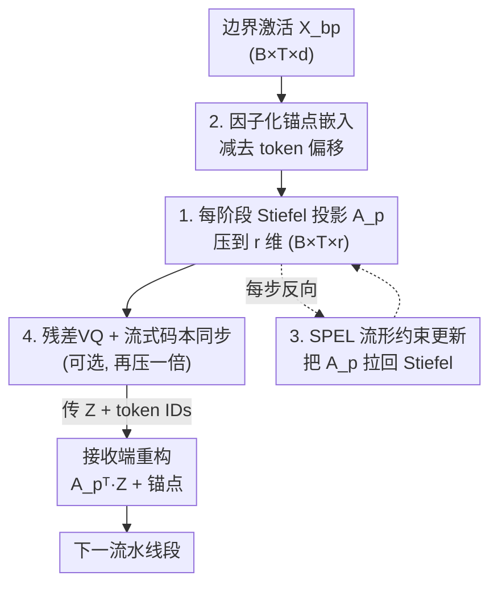

# Learned Subspace Compression for Communication-Efficient Pipeline Parallelism

**会议**: ICML2026  
**arXiv**: [2606.05484](https://arxiv.org/abs/2606.05484)  
**代码**: 待确认  
**领域**: 模型压缩 / 分布式训练  
**关键词**: 流水线并行, 激活压缩, Stiefel 流形, 学习子空间, 向量量化

## 一句话总结
针对低带宽网络下流水线并行训练「跨段激活通信」的瓶颈，本文提出 MAPL：让每个流水线段在 Stiefel 流形上**学习自己的正交投影**来压缩边界激活，配合因子化锚点嵌入剥离 token 偏移、再叠加残差向量量化，在 150M–1B 的 LLaMA 上实现 4–16× 通信压缩、性能仅比未压缩基线掉 1% 左右，远优于固定子空间的 SSN。

## 研究背景与动机
**领域现状**：训练超过单卡显存的大模型时，流水线并行（pipeline parallelism）把模型按层切到不同设备上。但每个 micro-batch 在前向和反向都要在相邻段之间交换**边界激活**（boundary activation），当训练跑在带宽受限的广域网/异构低端硬件上时，这种跨段通信就成了主导开销。

**现有痛点**：自然的做法是压缩激活后再传。已有的 Subspace Networks（SSN）用一个**固定、全局共享**的低秩正交矩阵 $U_r$ 把所有层的激活投到同一个 $r$ 维子空间。问题有三：① 它把全部层强行塞进同一个表示空间，相当于一次侵入式的架构改造；② 为了维持权重落在该子空间，需要改造的 AdamW 优化器加上静态嵌入偏移；③ 在 token 数对齐（token-matched）的公平比较下，性能相对未压缩基线掉得很惨（最多近 14%）。

**核心矛盾**：激活压缩本质上比数据并行里的梯度压缩更难——流水线各段持有互补、不重叠的模型片段，一段压缩后的激活直接喂给下一段，任何传输失真都会沿后续前向层和反向梯度逐段累积、污染学习信号。所以既想压得狠，又不能破坏激活里真正驱动学习的几何结构。

**切入角度**：作者先做了一个关键观察（§3.1）——把 token 嵌入减掉后的**边界残差激活本身就是内禀低秩**的：在 $d=1024$ 的 150M LLaMA 上，rank $\approx 250$ 就能保留 $\ge 99\%$ 的激活能量。这说明低秩结构是训练中**自然涌现**的，根本不需要像 SSN 那样去约束权重。

**核心 idea**：与其给所有层规定一个全局基底，不如让**每个流水线段自己去发现**它最适配任务的压缩子空间——把跨段通信当成一个**可学习的几何投影**，而不是固定的架构约束。难点在于：直接用普通梯度更新会把投影器推离 Stiefel 流形（正交矩阵集合），破坏正交性进而毁掉等距压缩，所以必须用流形约束的优化把投影器牢牢锁在流形上。

## 方法详解

### 整体框架
MAPL（Manifold Aware Projection Learning）在 $P-1$ 个跨段边界上做同样一件事：发送端先从边界激活里**减去 token 相关的锚点偏移**，再用一个**可学习的正交投影器** $A_p \in \mathrm{St}(d,r)$ 把残差投到 $r$ 维（通信量降为 $d/r$），把低维表示 $Z$ 和整数 token ID 一起传过去；接收端用 $A_p^\top$ 重构回全维、再加回锚点偏移。因为 $A_p$ 严格落在 Stiefel 流形上、$A_p^\top$ 是它的精确逆，投影/重构在 $A_p$ 的列空间上是等距的，压缩比恰为 $r/d$。整个投影器随模型权重用 SPEL 优化器联合训练，可选地再叠加一层残差向量量化把压缩比翻倍。

### 关键设计

**1. 每阶段可学习 Stiefel 投影：让每个流水线段学自己的压缩子空间**

SSN 的固定全局基底把所有层挤进同一表示空间，既限制了模型容量又掉点严重。MAPL 反其道而行：在每个边界 $p$ 放一个**独立可学习**的投影器 $A_p$，并强制它落在 Stiefel 流形 $\mathrm{St}(d,r) = \{A \in \mathbb{R}^{d\times r}: A^\top A = I_r\}$ 上。前向压缩与重构为

$$Z_{bp} = \big(X_{bp} - E^{small}_p[\text{tids}]\,P_p\big)A_p, \qquad \hat{X}_{bp} = Z_{bp}A_p^\top + E^{small}_{p+1}[\text{tids}]\,P_{p+1}.$$

正交约束保证 $A_p^\top$ 是 $A_p$ 的精确逆，投影/反投影在列空间上**等距**、压缩比精确为 $r/d$。实证上每段学到的子空间**几何上各不相同**：相邻段主夹角约 $53^\circ$、远端段接近正交（最高 $72^\circ$），对应残差流从词法表示向任务特定表示的逐层迁移。更关键的是，学到的 $A_p$ 比同秩的固定随机正交基保留 **2.2×** 的激活能量（$\sim 80\%$ vs $\sim 36\%$），且投影后 token 对的余弦相似度与原始几乎完全一致（Pearson $r=0.992$）——压缩近乎等距，下游段需要的关系几何被完整保留。

**2. 因子化锚点嵌入：把高秩 token 偏移从投影器里剥出来**

残差流里有一块由 token 频率驱动的偏移，它本身是**高秩**的，如果直接交给低秩投影器去压，会白白耗尽投影器的容量。SSN 用一个静态高秩偏移加上被迫落在权重子空间里的可学习嵌入来处理；MAPL 改用一个可学习偏移，并把它**因子化**为

$$E^{small}_p[\text{ids}]\,P_p, \qquad E^{small}_p \in \mathbb{R}^{V\times r},\quad P_p \in \mathbb{R}^{r\times d},$$

其中 $E^{small}_p$ 是可训练的小嵌入表、$P_p$ 是固定的随机正交矩阵。这样既把参数量压住，又让有效嵌入在每段恢复满秩。最妙的是：重构这块偏移只需要把**整数 token ID** 传过通道（与压缩激活同信道、几乎零成本），接收端各自查本地锚点即可，所以锚点带来的带宽开销可忽略。

**3. SPEL 流形约束优化：每步把投影器拉回 Stiefel 流形**

普通梯度更新会把 $A_p$ 推离 Stiefel 流形，一旦逃逸，模型就开始在目标子空间之外编码特征，性能急剧崩坏（作者发现这种"无流形意识"的朴素学习甚至比固定正交基还差）。MAPL 用 SPEL（Spectral Steepest Descent on the Stiefel Manifold）只靠任务损失更新 $A_p$：先把欧氏梯度 $g_t = \partial L/\partial A_p$ 投到切空间 $g^R_t = g_t - A_p\,\mathrm{sym}(A_p^\top g_t)$，再做重球动量 $m_t = \beta m_{t-1} + (1-\beta)g^R_t$，用 PolarExpress 求谱范数 LMO 方向，最后 retraction 把矩阵收回流形 $A_p \leftarrow \mathrm{PolarExpress}(A_p - \alpha\,d_t)$。它继承一阶流形方法 $O(1/\sqrt{T})$ 的收敛率，且**每一步**都更新 $A_p$（SSN 的 Grassmann 更新约每 500 步才刷一次），让子空间持续跟踪不断演化的激活几何；投影器学习率取参数更新的 $\times 0.1$，每个优化步后把更新后的 $A_p$ 发给下一段，成本相对激活/梯度通信可忽略。

**4. 残差向量量化 + 流式码本同步：在低秩流形上再压一倍**

光投影还不够狠，作者在低秩表示上再叠一层多码本向量量化（MCVQ）：把投影后的 $Z_{bp} \in \mathbb{R}^{B\times T\times r}$ 分成 $G$ 组，用每段码本 $C_p \in \mathbb{R}^{r\times K}$ 做 $R$ 轮**残差量化**逐轮精修。难点是码本本身也要在收发端同步、否则又引入通信。MAPL 利用"VQ 码本在训练中演化很慢"这一经验观察，设计**流式字典更新协议**：把码本切成随机子集，每个 micro-batch 只传 $1/K$ 比例的码，让码本同步开销摊薄到几乎为零、而陈旧性对收敛影响可忽略。由于第 1 个设计保证了投影近乎等距、$\mathbb{R}^r$ 上的码本分布良态，VQ 叠加上去几乎不掉点就把压缩比翻倍。

### 损失函数 / 训练策略
全程只用任务的交叉熵损失作为信号，投影器和模型权重联合训练。优化器采用混合配置：2D 隐层权重矩阵用 Muon（$\eta_\mu=0.02$ 用于 150M/500M，$0.01$ 用于 1B），嵌入/偏置/输出投影用 AdamW（$\eta_{adam}=0.5\eta_\mu$）；投影器学习率为参数更新的 $\times 0.1$。全局 batch 512，上下文 2048，bf16，DCLM 语料按 Chinchilla 最优（每参数 20 token）训练，$P\in\{4,8\}$。

## 实验关键数据

### 主实验
在 LLaMA 150M/500M/1B 上，与未压缩上界、SSN、SSN(AdamW 版) 在等 token 预算下比较验证交叉熵损失与相对退化 $\Delta\%$：

| 规模 | 方法 | 压缩比 | P=4 Loss (Δ%) | P=8 Loss (Δ%) |
|------|------|--------|---------------|---------------|
| 150M | Uncompressed | — | 3.13 | 3.13 |
| 150M | SSN | 4× | 3.39 (+8.37%) | 3.40 (+8.63%) |
| 150M | **MAPL** | 4× | **3.156 (+0.84%)** | **3.165 (+1.11%)** |
| 150M | MAPL+VQ | 8× | 3.165 (+1.11%) | 3.170 (+1.28%) |
| 500M | Uncompressed | — | 2.84 | 2.84 |
| 500M | SSN | 6× | 3.09 (+8.92%) | 3.12 (+9.90%) |
| 500M | **MAPL** | 6× | **2.79 (−1.90%)** | **2.84 (0.00%)** |
| 500M | MAPL+VQ | 12× | 2.92 (+2.75%) | 2.88 (+1.49%) |
| 1B | Uncompressed | — | 2.68 | 2.68 |
| 1B | SSN | 8× | 3.05 (+13.93%) | 3.08 (+15.05%) |
| 1B | **MAPL** | 8× | **2.72 (+1.38%)** | **2.73 (+2.02%)** |
| 1B | MAPL+VQ | 16× | 2.76 (+3.01%) | 2.74 (+2.30%) |

MAPL 在所有规模上把与未压缩的差距压到 $\sim 1\%$，500M·P=4 甚至**反超**未压缩 1.90%；同压缩比下 SSN 最多掉近 14%，SSN(AdamW 版) 在 1B 更是退化高达 26%。叠加 VQ 后压缩比翻倍（最高 16×），退化仅 2–3%。

### 下游零样本评测
在 HellaSwag/PIQA/ARC-Easy/ARC-Challenge 上的平均准确率：

| 规模 | 方法 | P=4 Avg | P=8 Avg |
|------|------|---------|---------|
| 150M | Uncompressed | 37.3 | 37.3 |
| 150M | SSN | 34.9 | 34.7 |
| 150M | **MAPL** | **36.7** | **36.6** |
| 500M | Uncompressed | 42.0 | 42.0 |
| 500M | **MAPL** | **41.8** | **41.6** |

MAPL 在每个规模上都紧贴未压缩基线（150M 仅差 0.6–0.7 点，500M 差 0.2–0.4 点），而 SSN 在 1B 上掉点最多达 8.8 点，说明其全局子空间的权重约束限制了学习容量。MAPL+VQ 在下游任务上退化更明显（150M·P=8 平均 33.0），是 VQ 的代价。

### 关键发现
- **学习 > 固定**：同秩 $r=128$ 下，学到的 Stiefel 投影器在 1500 步内保留 $\sim 80\%$ 残差能量，固定随机正交基只 $\sim 36\%$，有效秩利用率翻倍；这说明压缩本身**主动诱导**了低秩结构。
- **近等距是 VQ 友好的根源**：投影后 token 对余弦相似度与原始 Pearson $r=0.992$，几何关系被保留，使后续向量量化的码本分布良态、几乎不掉点。
- **每段子空间确实各异**：跨非相邻段投影器主夹角达 $72^\circ$，验证了"每段该学自己的子空间"这一核心假设。

## 亮点与洞察
- **把通信压缩重新定义为几何问题**：不是改架构、约束权重，而是把跨段通信看成 Stiefel 流形上的可学习投影——这个视角让压缩"发现"激活已经栖居的潜在子空间，而非"强加"一个。
- **失败模式诊断得很干净**：作者明确指出"流形逃逸"是朴素学习投影的主因，且无流形意识的学习严格劣于不学习，这个反直觉结论为 SPEL 的必要性提供了硬证据。
- **token 偏移与子空间投影解耦**：把高秩 token 偏移用因子化锚点单独吸收、只传整数 ID，避免它耗尽低秩投影器容量——这个"分而治之"思路可迁移到任何"低秩主体 + 高秩稀疏偏移"的压缩场景。
- **流式码本同步**：利用码本演化慢的经验事实把字典同步摊薄，这是把 VQ 引入分布式训练而不引入新通信瓶颈的实用 trick。

## 局限与展望
- 评测最大到 1B 参数、token 预算遵循 Chinchilla 最优，更大规模（10B+）和更长训练下子空间是否仍稳定跟踪、SPEL 每步更新的开销占比如何，论文未充分覆盖。
- MAPL+VQ 在验证损失上几乎免费，但在下游零样本任务上退化明显（150M·P=8 掉到 33.0），说明 16× 这一档的实际可用性要看任务。
- 方法引入了每段额外的投影器参数、锚点表与 SPEL 优化逻辑，工程上是对现有流水线的侵入式改造（虽作者称"易于接入"），真实低带宽集群上的端到端加速比未给出。
- 子空间学习率取 $\times 0.1$ 等关键超参的敏感性分析较少，跨架构（非 LLaMA）泛化性待验证。

## 相关工作与启发
- **vs SSN [42]**：SSN 用固定全局正交基 + 约束权重 + 改造 AdamW + 静态嵌入偏移；MAPL 让每段学自己的 Stiefel 投影、用因子化锚点取代静态偏移、用 SPEL 每步更新。本文证明全局共享子空间在 token 对齐下严重掉点，per-stage 学习全面优于固定，差距达 5%+。
- **vs GaLore 类低秩梯度压缩 [68]**：那条线把随机梯度投到低秩子空间以省优化器状态内存，目标是数据并行下的内存；MAPL 同样利用低秩结构，但目标是流水线并行下的**跨段激活通信**，是互补设置。
- **vs DiLoCo / SparseLoCo 等低带宽数据并行 [12,46]**：它们假设每个加速器能放下完整模型副本、压的是梯度；MAPL 针对模型放不下、必须切段的流水线并行，压的是激活，动态本质不同（SWARM 的"平方-立方律"）。

## 评分
- 新颖性: ⭐⭐⭐⭐⭐ 把跨段通信重构为 Stiefel 流形上的可学习投影，并精准诊断"流形逃逸"失败模式，视角新且自洽
- 实验充分度: ⭐⭐⭐⭐ 150M–1B、P∈{4,8}、多压缩比 + 下游 + 几何验证齐全，但缺更大规模与真实集群端到端加速
- 写作质量: ⭐⭐⭐⭐ 自底向上从观察推导设计、图表清晰，少量笔误不影响理解
- 价值: ⭐⭐⭐⭐ 为低带宽/去中心化大模型训练提供了高压缩低掉点的实用方案，思路可迁移

<!-- RELATED:START -->

## 相关论文

- [\[CVPR 2026\] Otil: Accelerating Diffusion Model Inference via Communication-Efficient Multi-GPU Parallelism](../../CVPR2026/model_compression/otil_accelerating_diffusion_model_inference_via_communication-efficient_multi-gp.md)
- [\[ICML 2026\] Efficient Learned Image Compression without Entropy Coding](efficient_learned_image_compression_without_entropy_coding.md)
- [\[ACL 2026\] Efficient Learned Data Compression via Dual-Stream Feature Decoupling](../../ACL2026/model_compression/efficient_learned_data_compression_via_dual-stream_feature_decoupling.md)
- [\[AAAI 2026\] InfoCom: Kilobyte-Scale Communication-Efficient Collaborative Perception with Information-Aware Feature Compression](../../AAAI2026/model_compression/infocom_kilobyte-scale_communication-efficient_collaborative_perception_with_inf.md)
- [\[ICML 2026\] ReSpinQuant: Efficient Layer-Wise LLM Quantization via Subspace Residual Rotation Approximation](respinquant_efficient_layer-wise_llm_quantization_via_subspace_residual_rotation.md)

<!-- RELATED:END -->
