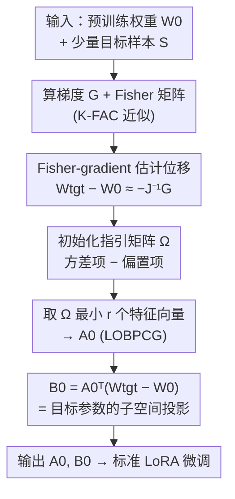

# LoRA-DA: Data-Aware Initialization for Low-Rank Adaptation via Asymptotic Analysis

**会议**: ICML 2026  
**arXiv**: [2510.24561](https://arxiv.org/abs/2510.24561)  
**代码**: https://github.com/zqy0126/LoRA-DA  
**领域**: 模型压缩 / 参数高效微调（PEFT）  
**关键词**: LoRA 初始化, 渐近分析, Fisher 信息, 数据感知, 各向异性

## 一句话总结
LoRA-DA 把"如何初始化 LoRA 的 $A$、$B$ 矩阵"重新表述成一个**最小化微调模型与目标模型参数差距期望**的优化问题，通过渐近分析把目标拆成**方差项 + 偏置项**两部分，用 Fisher 信息既刻画采样随机性又保留参数空间的各向异性，从而给出比"只看一步梯度"更优的初始化，在多个 NLP 基准上稳定超过现有初始化方法。

## 研究背景与动机
**领域现状**：LoRA 已成为大模型参数高效微调的主流做法——冻结预训练权重 $W_0$，只训练一对低秩矩阵 $A\in\mathbb{R}^{d_1\times r}$、$B\in\mathbb{R}^{r\times d_2}$，让权重更新为 $\hat W = W_0 + AB$。标准做法是把 $A$ 随机初始化（Kaiming）、$B$ 置零，保证训练起点等价于原模型。

**现有痛点**：这种"随机 $A$ + 零 $B$"的初始化没有携带任何任务信息，导致训练前期收敛慢、甚至收敛不到更优解。于是出现两类改进：一类是**数据无关**方法（PiSSA、MiLoRA），只对预训练权重做奇异值分解、利用原参数的结构性质；另一类是**数据感知**方法（LoRA-GA、LoRA-One），用一小批目标域样本算梯度、对梯度做 SVD 来构造低秩子空间。

**核心矛盾**：数据感知这条线看似对，但作者指出它"用得太浅"——只依赖一步梯度分解。问题有两个：其一，仅用原始梯度去近似"目标参数与预训练参数的差距 $W_{\mathrm{tgt}}-W_0$"，隐含假设了参数空间各向同性（isotropic），而 Transformer 表示早已被证明是高度**各向异性**的；其二，除了参数差距（偏置），**采样随机性带来的方差**同样贡献训练误差，却被这些方法完全忽略。LoRA-GA / LoRA-One 自己的实验也显示，一步微调的效果不仅次优、甚至明显逊于原版 LoRA。

**本文目标**：给"数据感知 LoRA 初始化"建一个有理论支撑的框架，既考虑偏置又考虑方差，既用数据梯度又尊重各向异性。

**切入角度**：作者从一个干净的优化目标出发——让微调得到的估计量 $\hat W$ 在期望意义下离真实目标参数 $W_{\mathrm{tgt}}$ 最近，即 $\min_A \mathbb{E}\big[\|\hat W - W_{\mathrm{tgt}}\|_F^2\big]$，再借助 MLE 的渐近正态性（asymptotic normality）把这个期望展开成可解的二次优化。

**核心 idea**：把初始化目标的上界**渐近分解为方差项与偏置项**，组成一个"初始化指引矩阵 $\Omega$"，最优 $A_0$ 就是 $\Omega$ 最小若干特征值对应的特征向量；并用 **Fisher-gradient（自然梯度）** 而非原始梯度去估计 $W_{\mathrm{tgt}}-W_0$，把各向异性显式编码进来。

## 方法详解

### 整体框架
LoRA-DA 的输入是预训练权重 $W_0$ 和一**小批**目标域样本 $\mathcal{S}$（默认 256 条，远小于全量 $N$），输出是一对带任务信息的初始化矩阵 $A_0$、$B_0$，之后照常做标准 LoRA 微调。核心一步是：先在 LoRA-FA（冻结 $A$、只训 $B$）这个更易分析的设定下推导最优 $A_0$，再说明结论可直接迁回标准 LoRA。

整条管线是：用小批样本同时算出**梯度 $G$** 和 **Fisher 信息矩阵**（用 K-FAC 近似）；用 Fisher-gradient $-J(W_0)^{-1}G$ 估计目标位移 $W_{\mathrm{tgt}}-W_0$；把"方差项"和"偏置项"组装成初始化指引矩阵 $\Omega$；对 $\Omega$ 取**最小** $r$ 个特征向量得到 $A_0$（用 LOBPCG 迭代求解，避免全特征分解）；最后令 $B_0 = A_0^\top(W_{\mathrm{tgt}}-W_0)$，使得 $W_0+A_0B_0$ 恰好等于目标参数在 LoRA 子空间上的投影。

### 关键设计

**1. 把初始化写成"参数差距期望最小化"并做渐近分解**

这是整套方法的理论地基，直接针对"现有方法缺理论、且忽略方差"的痛点。作者把 LoRA 微调看成一个**约束 MLE**：在 $\{W_0+AB\}$ 这个低秩流形上极大化对数似然。利用 MLE 的渐近正态性 $\sqrt{N}(\hat\theta_{\mathrm{MLE}}-\theta^*)\xrightarrow{d}\mathcal{N}(0, J(\theta^*)^{-1})$，作者把目标 $\mathbb{E}\big[\|\hat W - W_{\mathrm{tgt}}\|_F^2\big]$ 的上界展开成一个以 $A$ 为变量、列正交约束 $A^\top A=I_r$ 的二次优化问题。展开后误差自然分成两块：一块是**方差**（采样随机性，通过 Fisher 信息和样本量 $N$ 体现），一块是**偏置**（目标参数 $W_{\mathrm{tgt}}$ 与 $W_0+A$ 张成的子空间之间的距离）。这就把"凭直觉调初始化"变成了"解一个有闭式结构的优化问题"。

**2. Initialization Guidance Matrix $\Omega$：用一个矩阵同时指挥方差与偏置**

针对"只考虑偏置、不管方差"的痛点，作者把两项合成一个对称矩阵 $\Omega$，最优 $A_0$ 就是它**最小** $r$ 个特征值对应的特征向量（由 2.3 节的 Courant–Fischer 定理保证）。一维情形下

$$\Omega = \underbrace{\frac{J(W_0)^{-1}}{N}}_{\text{方差项}} \underbrace{-\,(W_{\mathrm{tgt}}-W_0)(W_{\mathrm{tgt}}-W_0)^\top}_{\text{偏置项}}.$$

直觉是：偏置项希望 $A$ 对齐"目标位移"方向（这样投影损失小，所以带负号、取最小特征向量等价于沿位移方向），方差项则惩罚那些 Fisher 信息小、采样噪声大的方向。高维标准 LoRA 下 $\Omega$ 推广为对每一列 $i$ 累加 $\sum_i J(W_0)^{-1}_{[i]}/N - (W_{\mathrm{tgt}}-W_0)_{(:,i)}(\cdot)^\top$，其中 $J(W_0)^{-1}_{[i]}$ 是逆 Fisher 矩阵的第 $i$ 个 $d_1\times d_1$ 对角块——作者特意强调 $W$ 各列并不独立，Fisher 必须对整个矩阵定义、再取对角块，不能逐列单独算。

**3. Fisher-gradient 估计目标位移，保留各向异性**

偏置项里出现的 $W_{\mathrm{tgt}}-W_0$ 无法直接得到，必须估计。LoRA-GA / LoRA-One 直接用**负原始梯度** $-G$，等价于假设损失曲面各向同性。LoRA-DA 改用 **Fisher-gradient（自然梯度）**：对目标损失在 $W_0$ 处做二阶展开，一阶最优条件给出 $W_{\mathrm{tgt}}-W_0\approx -H_0^{-1}G$，再把 Hessian $H_0$ 用 Fisher 信息近似（MLE 正则条件下 Fisher 等于负对数似然期望 Hessian），得到

$$W_{\mathrm{tgt}}-W_0 \approx -\,J(W_0)^{-1}G.$$

与原始梯度相比，这个 Fisher 加权形式会**按方向的信息量/不确定性自适应缩放**，从而把参数空间的各向异性吃进估计里。妙处在于：算方差项时已经需要 Fisher 矩阵，这里直接复用，几乎不增成本。作者在 Remark 4.3 中证明：如果把 $\Omega$ 的方差项丢掉、并用原始梯度替换 Fisher-gradient，本方法恰好退化为 $A_0^*=\arg\min_A -\mathrm{tr}(A^\top GG^\top A)$，也就是对梯度做 SVD——正是 LoRA-GA / LoRA-One。换言之，前人方法是 LoRA-DA 的一个**退化特例**，而 LoRA-DA 多补了"方差建模"和"各向异性"两块。

**4. LoRA-DA 算法：K-FAC + LOBPCG 把理论变轻量**

把理论落到可跑的算法需要解决两个开销：估 Fisher 和求特征向量。Fisher 用 **K-FAC** 近似成两个小矩阵（层输入构成的 $Z_{\text{fisher}}$ 与反传梯度构成的 $Y_{\text{fisher}}$）的 Kronecker 积，于是第 $i$ 列的逆 Fisher 块写成 $Z_{\text{fisher}}^{-1}\times[Y_{\text{fisher}}^{-1}]_{(i,i)}$；求 $\Omega$ 最小特征向量用 **LOBPCG** 迭代法，只需在 $d_1\times d_1$ 的 $\Omega$ 上做、迭代次数 $T_{\text{LOBPCG}}$ 是小常数（约 10）。每层成本 $O(T_{\text{LOBPCG}}\,d_1^2\,r)$，而 $d_1$ 不随模型规模增长（模型变大主要是加层/加宽 FFN），所以总特征分解开销只随深度线性增长，初始化几乎不增加显存。

### 一个完整示例：给一层算初始化
以某线性层 $W_0\in\mathbb{R}^{d_1\times d_2}$、秩 $r$ 为例走一遍 Algorithm 1：① 用小批 $\mathcal{S}$ 求平均梯度 $G$；② 求 $Z_{\text{fisher}}=\frac{1}{|\mathcal{S}|}\sum z^j z^{j\top}$、$Y_{\text{fisher}}=\frac{1}{|\mathcal{S}|}\sum \nabla_y\ell\,\nabla_y\ell^\top$；③ 对每列 $i$ 拼出逆 Fisher 块并算位移 $(W_{\mathrm{tgt}}-W_0)_{(:,i)}=-J(W_0)^{-1}_{[i]}G_{(:,i)}$；④ 把方差项与偏置项求和成 $\Omega$，LOBPCG 取最小 $r$ 个特征向量得 $A_0$；⑤ $B_0=A_0^\top(W_{\mathrm{tgt}}-W_0)$。每层独立做，逐层并行即可。

## 实验关键数据

### 主实验
评测在 LLaMA 2-7B / 13B 上，基线为 vanilla LoRA、数据无关的 PiSSA / MiLoRA、数据感知的 LoRA-One；为公平只比"保持原 LoRA 结构"的初始化方法，默认用 256 条样本估统计量。

| 任务 / 模型 | 指标 | LoRA-DA | 之前最好 | 说明 |
|--------|------|---------|----------|------|
| 常识推理 8 项 (7B) | 平均准确率 | **84.3** | 84.0 (MiLoRA) | 8 项里 6 项第一 |
| 数学推理 (7B) | GSM8K / MATH 平均 | **32.1** | 31.1 (LoRA-One) | GSM8K 53.7→55.0，MATH 8.5→9.2 |
| 数学推理 (13B) | GSM8K / MATH 平均 | **39.6** | 38.9 (PiSSA) | 更大模型同样有效 |

### 设定鲁棒性与组件分析

| 配置 | 关键指标 | 结论 |
|------|---------|------|
| 冻结-$A$（LoRA-FA） GSM8K | 41.5 → **49.4** | LoRA-DA 初始化使 LoRA-FA 暴涨 +7.9 |
| 退化形式（丢方差项 + 用原始梯度） | = LoRA-GA / One | 证明前人方法是本文特例 |
| 去掉方差项 | 退回各向同性近似 | 失去对采样噪声方向的惩罚 |
| 用原始梯度替 Fisher-gradient | 忽略各向异性 | 位移估计偏差变大 |

### 关键发现
- **方差建模 + 各向异性是两块独立增量**：Remark 4.3 用解析方式说明，去掉任一块就退回梯度 SVD（即 LoRA-One），因此两者各自贡献清晰可分。
- **冻结-$A$ 设定收益最大**（GSM8K +7.9）：因为 $A$ 不再训练，初始化的好坏被完全锁死，好的 $A_0$ 价值被放大。
- **跨秩、跨模型规模稳定**，且初始化只需 256 条样本、显存几乎无额外开销——理论虽重，落地却轻。

## 亮点与洞察
- **把"调初始化"升级成"解一个有闭式结构的优化问题"**：方差项 + 偏置项的分解既直观又可证，最优解就是 $\Omega$ 的最小特征向量，干净利落。
- **复用 Fisher 一举两得**：同一个 Fisher 矩阵既进方差项、又把原始梯度升级成自然梯度，工程上几乎免费拿到各向异性建模。
- **统一了前人方法的视角**：LoRA-GA / LoRA-One 被解释成"丢掉方差、且各向同性"的退化特例，这种"我比你多两项"的叙事非常有说服力，可迁移到其他基于梯度的子空间构造方法。

## 局限与展望
- **理论建立在若干渐近假设上**：MLE 正则条件、$\|W_{\mathrm{tgt}}-W_0\|_F=O(1/\sqrt{N})$（目标任务离预训练不远）、Hessian≈Fisher，这些在远域迁移或强分布偏移下是否成立存疑。
- **常识推理上的提升较小**（平均 +0.3），主要增益来自数学推理与冻结-$A$ 设定，说明收益与任务/设定强相关。
- **K-FAC 与 Fisher 估计的质量依赖小批样本**，样本过少或过偏时统计量噪声会传导到初始化；作者用 256 条且验证了稳定性，但更极端的低资源场景未充分考察。

## 相关工作与启发
- **vs LoRA-GA / LoRA-One**：它们对一步梯度做 SVD 构造子空间；本文证明这是"丢方差项 + 原始梯度"的退化特例，多补了方差建模与 Fisher-gradient 各向异性，因此更优。
- **vs PiSSA / MiLoRA**：它们数据无关，只用预训练权重的奇异结构；本文是数据感知，用少量目标样本携带任务信息，故能更贴近目标参数。
- **vs LoRA-FA**：本文不仅沿用其"冻结 $A$"以便分析，还给出 $A$ 的最优初始化，使 LoRA-FA 在 GSM8K 上从 41.5 跃到 49.4。

## 评分
- 新颖性: ⭐⭐⭐⭐⭐ 用渐近分析把 LoRA 初始化做成方差+偏置分解，并统一前人方法为退化特例
- 实验充分度: ⭐⭐⭐⭐ 覆盖常识/数学、7B/13B、冻结-$A$ 等多设定，但常识任务增益偏小
- 写作质量: ⭐⭐⭐⭐⭐ 从目标到定理到算法层层递进，Remark 4.3 的退化分析尤其点睛
- 价值: ⭐⭐⭐⭐ 几乎免费的初始化升级，PEFT 场景实用且可迁移到其他梯度子空间方法

<!-- RELATED:START -->

## 相关论文

- [\[ACL 2026\] TLoRA: Task-aware Low Rank Adaptation of Large Language Models](../../ACL2026/model_compression/tlora_task-aware_low_rank_adaptation_of_large_language_models.md)
- [\[ICML 2026\] Energy-Structured Low-Rank Adaptation for Continual Learning](energy-structured_low-rank_adaptation_for_continual_learning.md)
- [\[ACL 2026\] TalkLoRA: Communication-Aware Mixture of Low-Rank Adaptation for Large Language Models](../../ACL2026/model_compression/talklora_communication-aware_mixture_of_low-rank_adaptation_for_large_language_m.md)
- [\[ICML 2026\] ScaLoRA: Optimally Scaled Low-Rank Adaptation for Efficient High-Rank Fine-Tuning](scalora_optimally_scaled_low-rank_adaptation_for_efficient_high-rank_fine-tuning.md)
- [\[ACL 2026\] Not All Directions Matter: Towards Structured and Task-Aware Low-Rank Model Adaptation](../../ACL2026/model_compression/not_all_directions_matter_towards_structured_and_task-aware_low-rank_model_adapt.md)

<!-- RELATED:END -->
