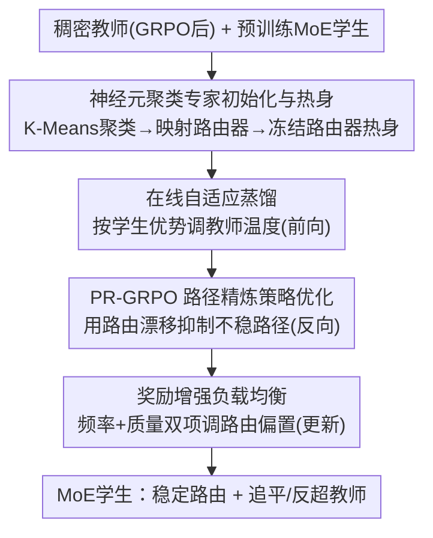

# PADD: Path-Aligned Decompression Distillation for Non-Router Teacher to Guide MoE Student Learning

**会议**: ICML 2026  
**arXiv**: [2606.10369](https://arxiv.org/abs/2606.10369)  
**代码**: 待确认  
**领域**: 模型压缩 / 知识蒸馏 / MoE / 强化学习  
**关键词**: 稠密到MoE蒸馏, 专家路由, 神经元聚类初始化, 在线自适应蒸馏, GRPO

## 一句话总结
PADD 把"用一个没有路由器的稠密教师去指导已预训练的 MoE 学生学会高质量路由"这件事拆成两阶段四步骤的统一流水线——先用教师 FFN 神经元聚类来初始化并热身学生专家，再在一次训练里同时做在线自适应蒸馏、路径精炼的策略优化（PR-GRPO）和奖励增强的负载均衡——在数学推理上让小激活量的 MoE 学生在相同推理成本下追平甚至反超 7B 稠密教师。

## 研究背景与动机
**领域现状**：模型规模继续涨，但稠密模型在固定算力预算下会撞上训练吞吐、推理延迟、显存带宽的瓶颈。MoE（Mixture-of-Experts）用稀疏激活的专家子网把"参数容量"和"每 token 的推理 FLOPs"解耦，能把纠缠的稠密表示"解压"成结构化专家模块，是扩容的主流路线。

**现有痛点**：但高质量模型大多仍是稠密的。从零训 MoE 很贵；MoE→MoE 蒸馏因专家分解和路由策略不兼容而缺乏通用性。更想做的是"稠密教师→MoE 学生"蒸馏（可按领域挑最好的稠密教师、不增加推理成本），可这条路有个根本障碍：**MoE 靠路由决策工作，稠密模型却根本没有显式路由器**。

**核心矛盾**：稠密教师无法提供任何路由监督信号，由此连环触发四个结构性病症——① **路由器冷启动（router cold start）**：新路由器从零学，早期分不清句法 token 和推理 token，导致噪声在专家间随机扩散（logic diffusion）；② **容量鸿沟（capacity gap）**：当 MoE 学生每 token 激活参数远小于稠密教师时，吸收不了细粒度 logits；③ **路径断裂（path rupture）**：离散路由跳变打断思维链连续性、让梯度失稳；④ **专家同质化**：传统负载均衡只管激活频率、不管专家质量，把专家训成千篇一律。常规蒸馏只对齐输出、传不了"内部处理偏好"；已有的 RSPO/StableMoE/R3 等稳路由方法又都假设已有可用的专家结构，没法从稠密教师恢复路径级语义。

**本文目标**：在固定推理预算下，把一个无路由器的稠密教师的隐式模块结构和路由偏好，迁移进一个已预训练、已有路由器的 MoE 学生，并学到稳定的学生路由——注意这与 sparse upcycling（从稠密 checkpoint 新建 MoE）是互补设定，PADD 不重建专家结构，而是恢复并稳定既有结构。

**核心 idea**：用"路径对齐的解压蒸馏"（Path-Aligned Decompression Distillation），一条流水线同时把上述四个病症对症下药——初始化阶段在源头解决冷启动/同质化，训练阶段在前向/反向/更新三处分别解决容量鸿沟、路径断裂、专家质量失衡。

## 方法详解

### 整体框架
PADD 把稠密→MoE 蒸馏组织成**两阶段、四步骤**。初始化阶段（Stage I）：对教师 FFN 神经元做聚类，构造学生各专家应当承担的目标功能结构，并在冻结路由器下做专家热身，让专家在开始学路由前先各就各位。训练阶段（Stage II–IV）在数据子集 $\mathcal{D}_C$ 上**同一次训练**里串行执行：每个训练步采样一条输入，前向传播时做 Stage II（在线自适应蒸馏），反向传播时做 Stage III（PR-GRPO），参数更新时做 Stage IV（奖励增强负载均衡）。数据被划成四个不重叠子集——$\mathcal{D}_A$ 做聚类统计、$\mathcal{D}_B$ 做专家热身、$\mathcal{D}_C$ 做主训练、$\mathcal{D}_D$ 做评测；且热身只用 $\mathcal{D}_B$，避免聚类统计泄漏进专家拟合。训练前还会先对稠密教师跑标准 GRPO，让它学到可被有效蒸馏的任务推理策略。

### 关键设计

**1. 神经元聚类专家初始化与热身：在源头消灭路由器冷启动与专家同质化（Stage I）**

冷启动和同质化的根子是"学生专家一开始没有任何功能分工、路由器无监督从零学"。PADD 的对策是从稠密教师 FFN 里"挖"出隐式模块结构当作初始化蓝图。稠密 FFN 的第一线性层 $W_1$ 每一行 $w_k$ 是一个神经元的权重向量，而这些神经元在相似输入下会协同激活、暗含模块结构。作者对 $w_k$ 做**带基数约束的 K-Means 聚类**，把神经元均匀切成 $N$ 个簇 $C_j$（每簇 $|C_j|=d_{ff}/N$），每簇对应学生的一个专家 $E_{j,\mathrm{S}}$：

$$\min_{C}\sum_{j=1}^{N}\sum_{k\in C_j}\|w_k-\mu_j\|^2,\quad \text{s.t. } |C_j|=\frac{d_{ff}}{N}$$

学生第 $l$ 层对应教师第 $\lfloor l\cdot L_{\mathrm{T}}/L_{\mathrm{S}}\rfloor$ 层（无论谁层数多都有唯一对应）。聚完簇后在 $\mathcal{D}_A$ 上统计每个簇的平均激活 $\bar h_j$，softmax 成目标激活分布 $p_{j,\mathrm{T}}=\mathrm{softmax}(\bar h_j/\xi)$ 作为学生专家的学习靶子。然后把簇质心 $\mu_j$ 映射成路由器线性层权重完成路由器初始化，再在 $\mathcal{D}_B$ 上**冻结路由器、路由固定为均匀分布 $1/N$** 做专家热身，确保每个专家在学分工前都拿到等量训练信号。热身损失为语言建模 + KD + 目标分布对齐三项：$\mathcal{L}_{\text{warmup}}=\mathcal{L}_{\text{LM}}+\alpha\mathcal{L}_{\text{KD}}+\beta\mathcal{L}_{\text{init}}$，其中 $\mathcal{L}_{\text{init}}=\sum_{j=1}^{N}\mathrm{KL}(p_{j,\mathrm{S}}\|p_{j,\mathrm{T}})$ 把学生专家激活拉向教师对应簇。这样专家在训练真正开始前就已经带着"和教师隐式结构对齐的功能差异"，从源头避免了随机初始化导致的噪声扩散。

**2. 在线自适应蒸馏：用学生自己的表现动态调教师温度，跨越容量鸿沟（Stage II）**

固定温度蒸馏跨不了容量鸿沟——7B 教师的细粒度 logits 对 3.3B 激活的学生既可能"喂太猛"也可能"喂错路径"。PADD 在前向传播里让教师监督**沿学生实际路由路径自适应**。对一条输入采 $G$ 个学生回答，用组内相对优势 $A_{i,\mathrm{S}}=(r(x,y_i)-\bar r)/\sigma_r$ 评估当前路径好坏，再据此调教师 logits 的温度：

$$p^{*}_{\mathrm{T}}(y|x)=\mathrm{Softmax}\!\left(\frac{\text{Logits}_{\mathrm{T}}}{\tau\cdot\Phi(A_{i,\mathrm{S}})}\right),\qquad \Phi(A_{i,\mathrm{S}})=1+\tanh(\kappa A_{i,\mathrm{S}})$$

这就是"优势–温度耦合"：当 $A_{i,\mathrm{S}}>0$（路径好）时有效温度降低、监督信号更自信、强化这条路径；当 $A_{i,\mathrm{S}}<0$（路径差）时温度升高、信号更平滑、鼓励探索而非死磕错误专家路径。比起固定温度，它能随学生质量实时调节"喂多硬"，避免学生过拟合到错误路径。

**3. PR-GRPO 路径精炼策略优化：用路由漂移压住离散路由带来的梯度失稳（Stage III）**

学生每个 MoE 层独立用 Top-$K$ 选专家，离散路由在相邻步之间跳变会让策略梯度失稳、打断思维链。PR-GRPO 在反向传播里显式度量这种跳变并据此降权。先算**路由漂移** $\Gamma_{i,t,\mathrm{S}}=\|G_{\theta,\mathrm{S}}(x_t)-G_{\theta_{\text{old}},\mathrm{S}}(x_t)\|_2$（当前 vs. 上一步路由分布之差），再把它塞进重要性比率：

$$\hat\rho_t(\theta)=\frac{\pi_{\theta,\mathrm{S}}(a_t|s_t)}{\pi_{\theta_{\text{old}},\mathrm{S}}(a_t|s_t)}\cdot\exp\!\big(-\lambda\cdot\Gamma_{i,t,\mathrm{S}}\cdot\mathbb{I}(A_{i,\mathrm{S}}<0)\big)$$

只有当路径表现差（$A_{i,\mathrm{S}}<0$）**且**路由漂移大时，指数项才显著缩小重要性比率，从而压制在不稳定路径上的更新；路径本来就好的样本不受惩罚。把这个调整后的比率代入 GRPO 的 min/clip 目标 $\mathcal{J}_{\text{PR-GRPO}}$，就得到一个对"既差又抖"的样本自动降权、对稳定样本照常更新的策略优化，显著提升 MoE 强化学习的稳定性。

**4. 奖励增强负载均衡：把"专家质量"补进负载均衡，遏制同质化（Stage IV）**

传统负载均衡只逼各专家激活频率趋近 $\bar f=1/N$，完全不看专家好坏，结果把专家训得千篇一律。PADD 在参数更新时给路由偏置同时注入"频率"和"质量"两项。对专家 $j$ 跟踪激活频率 $f_{j,\mathrm{S}}$ 和组内相对优势 $A_{j,\mathrm{S}}$，后者用 EMA 平滑（$\text{EMA}(A_{j,\mathrm{S}})_u=\lambda_{\text{ema}}A_{j,\mathrm{S}}+(1-\lambda_{\text{ema}})\text{EMA}(A_{j,\mathrm{S}})_{u-1}$），再更新路由偏置：

$$b_{j,\mathrm{S}}^{(\text{new})}=b_{j,\mathrm{S}}^{(\text{old})}+\eta(f_{j,\mathrm{S}}-\bar f)+\gamma\cdot\text{EMA}(A_{j,\mathrm{S}})_u$$

第一项 $\eta(f_{j,\mathrm{S}}-\bar f)$ 维持流量均衡，第二项 $\gamma\cdot\text{EMA}(A_{j,\mathrm{S}})$ 给高质量专家正向偏置增量、提高其被选概率。偏置在 Softmax 前加到路由器 logits 上、参与 Top-$K$ 选择。这样既不放任少数强专家垄断、也不再机械追求绝对均匀，而是"流量大体均衡 + 好专家优先"，强化长期分工。

### 损失函数 / 训练策略
热身损失 $\mathcal{L}_{\text{warmup}}=\mathcal{L}_{\text{LM}}+\alpha\mathcal{L}_{\text{KD}}+\beta\mathcal{L}_{\text{init}}$（语言建模 + KL 蒸馏 + 目标激活分布对齐）。主训练用 PR-GRPO 目标 $\mathcal{J}_{\text{PR-GRPO}}$，奖励为可验证的规则奖励（RLVR，以精确匹配为主、辅以格式一致性奖励，线性加权后送入组内归一化优势），评测遵循 Dr.GRPO 协议。Stage II–IV 不是三个独立阶段，而是同一训练步里前向/反向/更新三处的三种机制协同。

## 实验关键数据

### 主实验
两组教师–学生对：Qwen 家族（教师 Qwen2.5-Math-7B 稠密 → 学生 Qwen3-30B-A3B，30.5B 总 / 3.3B 激活）、DeepSeek 家族（教师 DeepSeek-Math-7B → 学生 DeepSeek-V2-Lite，16B 总 / 2.4B 激活）。学生都是已预训练的 MoE checkpoint，**不是**由稠密 upcycle 而来。训练数据 DeepScaleR，五个数学 benchmark（AIME24/AMC23/MATH500/Minerva/OlympiadBench）报 Pass@1，均未参与训练。

| 方法 | Qwen 家族 Avg | DeepSeek 家族 Avg | 说明 |
|------|--------------|-------------------|------|
| Teacher (GRPO) | 77.7 | 58.1 | 稠密 7B 教师，参考上界 |
| Base（学生未训） | 72.9 | 37.2 | 预训练 MoE 学生 |
| Dense-GRPO | 53.5 | 45.6 | 同激活规模稠密模型 |
| MoE-Vanilla-GRPO | 71.4 | 46.8 | 只 GRPO、无蒸馏 |
| GSPO | 76.3 | 53.2 | 序列级重要性比率变体 |
| RSPO | 77.2 | 54.3 | 路由漂移加权 |
| Online KD | 73.6 | 46.7 | 在线 KD + GRPO |
| **PADD（本文）** | **80.2** | **55.2** | 四阶段统一流水线 |

关键结论：PADD 在 Qwen 家族 **80.2% 反超 7B 教师的 77.7%**，在 DeepSeek 家族 55.2% 逼近教师 58.1%（差 2.9%），且在 AIME24/AMC23 上小幅超过教师——说明小激活量 MoE 学生能继承专家化知识并保持低推理成本。相对 MoE-Vanilla-GRPO 提升 8.8%/8.4%（证明收益来自四阶段设计而非学生容量本身），相对 Online KD 提升 6.6%/8.5%（主要来自在线自适应蒸馏跨容量鸿沟），相对 RSPO/GSPO 提升约 3.0%/3.9%；而同激活规模的 Dense-GRPO 只有 53.5%/45.6%，远低于 PADD，说明 PADD 让 MoE 学生学会了用更大总容量、相同推理成本换取比同规模稠密更强的表达力。

### 消融实验
逐阶段剔除（Qwen 家族，OlympiadBench 为主受影响 benchmark）：

| 配置 | 关键变化 | 说明 |
|------|---------|------|
| Full PADD | 每个 benchmark 均最高 | 完整四阶段 |
| w/o Stage I | OlympiadBench −10.4，AIME24 −3.9，Minerva −2.8 | 改随机初始化，路由器分不清句法/推理 token，专家分工塌成噪声 |
| w/o Stage II | OlympiadBench −9.9 | 改固定温度蒸馏，跨不过 7B→3.3B 容量鸿沟 |
| w/o Stage III | Minerva −3.8，OlympiadBench −3.9，AIME24 −2.3 | 改标准 GRPO，长 CoT 上路由跳变破坏路径连续性 |
| w/o Stage IV | 三个集 −0.6 ~ −1.5 | 改传统负载均衡，专家质量分化变慢 |

### 关键发现
- **Stage I、II 贡献最大**：去掉任一在 OlympiadBench 上掉约 10 分，说明"结构化初始化 + 跨容量鸿沟的自适应蒸馏"是这套方法的命脉；Stage III 主要在长链推理（Minerva）上稳梯度，Stage IV 贡献较小但持续把流量推向强专家、减缓后期同质化。四阶段构成一个协同闭环。
- **泛化不退化（数学训练→非数学评测）**：在 MMLU-Pro/代码等域外 benchmark 上，PADD 的非数学均分 Qwen 52.0（仅比未训 Base 的 52.2 低 0.2）、DeepSeek 38.5（比 Base 38.9 低 0.4），均为所有方法最高；而 Vanilla-GRPO 掉到 49.3，LiveCodeBench v6 上更比 Base 低 3.5 分——说明 Stage I 初始化和路径级训练在提数学分的同时较好地保住了通用能力。
- **专家–子领域对齐被量化验证**：用 NMI（归一化互信息）和 ESI（专家专门化指数）度量专家与数学子领域的对应，PADD(Stage I) 远高于 Vanilla-GRPO（NMI 0.013±0.003）和 Random-Cluster，证明聚类初始化 + 热身确实诱导出有差异、有分工的专家。

## 亮点与洞察
- **把稠密 FFN 神经元当"隐式专家"挖出来**：最巧的一步是用基数约束 K-Means 把教师 FFN 神经元聚成 $N$ 簇直接当学生专家蓝图——无路由器的稠密教师里其实藏着模块结构，这个"解压"思路可迁移到任何稠密→稀疏的结构迁移。
- **优势–温度耦合**：用学生组内优势 $A_{i,\mathrm{S}}$ 通过 $1+\tanh(\kappa A)$ 反调教师温度，把"该不该强监督"交给学生当前表现决定，是处理容量鸿沟里"信号过猛 vs. 信号过软"两难的优雅做法。
- **路由漂移当稳定器**：PR-GRPO 只惩罚"既差又抖"的样本（$\mathbb{I}(A<0)$ 与 $\Gamma$ 相乘），把 MoE 离散路由的失稳问题转成一个对重要性比率的可微抑制项，思路干净且只在该惩罚时才惩罚。
- **负载均衡补"质量"维度**：把奖励 EMA 加进路由偏置，破解了"传统均衡只管频率→专家同质化"的老问题，对所有训练 MoE 路由的工作都有借鉴价值。

## 局限与展望
- **依赖高质量、领域专门化的稠密教师**：方法效果建立在"小而强的 7B 数学教师能提供清晰模块结构和高质量推理信号"之上；教师本身弱或结构混乱时，聚类初始化的蓝图质量会成为天花板。
- **只在数学推理上充分验证**：主实验集中于数学 benchmark，泛化实验也只是"数学训练→看通用能力保不保得住"，缺少在其它训练域（代码、通用对话）上从头训练的验证。
- **多了不少超参与四阶段流程**：$\alpha,\beta,\xi,\tau,\kappa,\lambda,\eta,\gamma,\lambda_{\text{ema}}$ 等系数较多，四阶段数据划分也需精心安排，工程落地与调参成本不低（敏感性分析在附录）。
- **设定受限**：PADD 要求学生是"已预训练、已有路由器的 MoE"，与从稠密 checkpoint 新建 MoE 的 sparse upcycling 互补但不通用；缺乏现成 MoE 学生时不能直接套用。

## 相关工作与启发
- **vs sparse upcycling / MoEfication**：upcycling 从稠密权重先搭专家结构、再几乎从零训路由；PADD 反过来——不重建结构，而是把无路由器教师的隐式模块和路由偏好迁进已有 MoE 学生并稳住路由，是互补设定。
- **vs RSPO / StableMoE / R3**：它们为"已训好的 MoE"稳路由，假设专家结构已可用，无法从稠密教师恢复路径级语义；PADD 直面"结构从稠密教师迁移"这个更难的源头问题。
- **vs Online KD（固定温度在线蒸馏）**：Online KD 用固定教师温度，跨不过容量鸿沟也保不住通用能力；PADD 的优势–温度耦合按学生路径动态调温，主实验与泛化实验上都更优。
- **vs 经典负载均衡（Shazeer et al.）**：经典做法只控激活频率致专家同质化；PADD 加奖励 EMA 项把"专家质量"纳入路由偏置，强化长期分工。

## 评分
- 新颖性: ⭐⭐⭐⭐⭐ "无路由器稠密教师→MoE 学生"的路径对齐解压蒸馏设定新，四个机制各自对症且能拼成闭环。
- 实验充分度: ⭐⭐⭐⭐ 两家族 + 五数学 benchmark + 逐阶段消融 + 泛化 + NMI/ESI 分析较扎实，但训练域偏窄、超参较多。
- 写作质量: ⭐⭐⭐⭐ 病症→对策映射清晰、公式完整；四阶段命名与缩写偶显繁琐。
- 价值: ⭐⭐⭐⭐⭐ 让小激活 MoE 在同推理成本下追平/反超稠密教师，对低成本扩容很有实用与迁移价值。

<!-- RELATED:START -->

## 相关论文

- [\[ACL 2026\] Find Your Optimal Teacher: Personalized Data Synthesis via Router-Guided Multi-Teacher Distillation](../../ACL2026/model_compression/find_your_optimal_teacher_personalized_data_synthesis_via_router-guided_multi-te.md)
- [\[ECCV 2024\] Adversarially Robust Distillation by Reducing the Student-Teacher Variance Gap](../../ECCV2024/model_compression/adversarially_robust_distillation_by_reducing_the_student-teacher_variance_gap.md)
- [\[CVPR 2026\] Masking Teacher and Reinforcing Student for Distilling Vision-Language Models](../../CVPR2026/model_compression/masking_teacher_and_reinforcing_student_for_distilling_vision-language_models.md)
- [\[CVPR 2026\] Memory-Efficient Transfer Learning with Fading Side Networks via Masked Dual Path Distillation](../../CVPR2026/model_compression/memory_efficient_transfer_learning_with_fading_side_networks.md)
- [\[ICML 2025\] When Data-Free Knowledge Distillation Meets Non-Transferable Teacher: Escaping Out-of-Distribution](../../ICML2025/model_compression/when_data-free_knowledge_distillation_meets_non-transferable_teacher_escaping_ou.md)

<!-- RELATED:END -->
