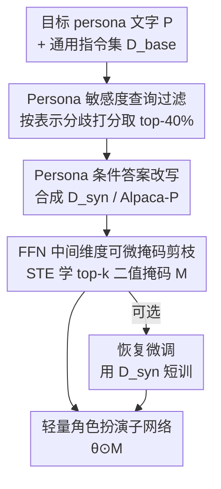

# Persona-Pruner: Sculpting Lightweight Models for Role-Playing

**会议**: ICML 2026  
**arXiv**: [2606.14695](https://arxiv.org/abs/2606.14695)  
**代码**: https://github.com/jsu-kim/Persona-Pruner  
**领域**: 模型压缩 / 角色扮演 LLM  
**关键词**: 结构化剪枝, 角色扮演, FFN 子网络, 可微掩码, 数据合成

## 一句话总结
不给每个角色都配一个完整通用大模型，而是只用一段文字 persona 描述，先合成 persona 专属校准数据、再在 FFN 中间维度上学一个二值掩码，把"承载这个角色身份"的子网络从大模型里"雕刻"出来——50% 稀疏下角色扮演评分相比最强剪枝基线最多回收 93.8% 的性能损失，同时不伤通用能力。

## 研究背景与动机
**领域现状**：角色扮演聊天机器人（游戏 NPC、个性化助手、模拟用户）通常靠给一个通用 LLM 喂 persona prompt、或在角色对话数据上微调、或在隐空间做干预来"扮演"某个角色。每个角色背后跑的都是一个满血通用模型。

**现有痛点**：真正需要角色扮演的场景恰恰是对成本、可扩展性、部署最敏感的——一个游戏生态里成百上千个 NPC 同时在线、实时助手有严格的延迟和资源预算。可一个 persona 的行为其实只占模型能力的一小块，却要激活全部参数，这是"模型能力之宽"和"persona 目标之窄"之间的结构性错配。

**核心矛盾**：能不能找到一个参数子集就足够支撑单个 persona？直接拿现成剪枝方法砍又不行——通用剪枝（SliceGPT、LLM-Pruner、Depth Pruning 等）分不清"冗余知识"和"角色关键特质"，naïve 剪枝会让特定 persona 的角色扮演性能崩盘（50% 稀疏下评分从 83 掉到个位数）。而任务相关剪枝又依赖大量任务数据，对"任意一段 persona 描述"这种高度个性化目标根本拿不到对应语料。

**本文目标**：只给一段自然语言 persona 定义，不要任何角色对话语料，就把通用基座模型压成一个保真的轻量角色扮演 agent。

**切入角度**：作者假设单个角色身份只依赖模型总容量的一小部分，且 persona 行为集中在 FFN（占 LLM 绝大多数参数）里；同时观察到 persona 的影响是**查询相关**的——客观知识类问题谁来答都差不多，只有需要特定视角/语气的问题才会触发该角色独有的激活模式。

**核心 idea**：用"persona 驱动的数据合成 + 可微掩码 FFN 子网络发现"两阶段流程，把剪枝目标直接对齐到目标 persona，识别并保留 persona 关键权重。

## 方法详解

### 整体框架
给定预训练 LLM（参数 $\theta$）和一段文字 persona $P$，模型定义了一个"persona 条件"的问答分布 $p_P(q,a) := p_\theta(a\mid P, q)$。Persona-Pruner 的目标是找一个二值掩码 $\mathbf{M}$，使得子网络 $\theta\odot\mathbf{M}$ 在该角色的扮演上表现好，即最小化负对数似然 $\mathcal{L}(\mathbf{M};\theta) = \mathbb{E}_{(q,a)\sim p_P}[-\log p_{(\theta\odot\mathbf{M})}(a\mid P, q)]$。

整个流程分两个阶段，且全程只需要一段 persona 文字、不需要任何角色对话语料：先从通用指令集里**合成**一份 persona 专属校准数据，再用这份数据**学习**一个挑出 persona 关键 FFN 神经元的掩码，最后可选地用同一份数据做一次短暂的恢复微调。

### 关键设计

**1. Persona 敏感度查询过滤：只挑能"逼出"角色个性的问题**

痛点是：通用指令集里大部分问题对 persona 不敏感（客观事实题），拿它们当校准数据等于浪费信号，学出来的掩码分不清角色特质。作者的依据是"persona 的影响是查询相关的"，并假设这种行为差异会反映在模型内部表示上。具体做法：对查询 $q$，取它在第 $b$ 个 transformer block 最后一个 token 的隐状态 $\mathbf{h}^{(b)}_P(q)\in\mathbb{R}^d$（最后 token 聚合了 prompt 的上下文信息），定义 **Persona-Sensitivity Score** 为目标 persona 与一组随机参考 persona 表示之间的余弦距离，在所有 block 和参考 persona 上取平均：

$$s(q; P_{\text{target}}) = \frac{1}{Br}\sum_{b=1}^{B}\sum_{j=1}^{r}\Big(1-\cos\big(\mathbf{h}^{(b)}_{P_j}(q),\, \mathbf{h}^{(b)}_{P_{\text{target}}}(q)\big)\Big)$$

分数越高说明这个查询在目标 persona 下激活模式越独特。取 top 部分形成过滤子集 $\mathcal{D}_{\text{filtered}}$，阈值 $\tau$ 设成让 $|\mathcal{D}_{\text{filtered}}| = 0.4\times|\mathcal{D}_{\text{base}}|$。论文图 2 显示同样的 Llama-3.2-3B，敏感度过滤后的查询拿到的 LLM-judge 角色扮演分明显高于随机查询。

**2. Persona 条件答案改写与 Alpaca-P 数据集：无角色语料也能造校准集**

光过滤出"对的问题"还不够，原始答案是中性的、没有角色语气。作者用一个强 LLM（全程用 Llama-3.1-70B-Instruct）把每条过滤后的 $(q,a)$ 的答案 $a$ 改写成带目标 persona 语气和说话风格、但**语义保持不变**的 $\tilde a$，得到最终校准集 $\mathcal{D}_{\text{syn}} = \{(q,\tilde a)\}$。这一步彻底绕开了"任意 persona 都拿不到对话语料"的数据瓶颈——只要有通用指令集（Alpaca、Open-Orca）就能造。作者据此合成并开源了 **Personalized-Alpaca（Alpaca-P）**：采样 10 个合成用户 persona，对每个 persona 选高分敏感查询 + 改写答案，再切成不相交的 train/test（train 用于学掩码和恢复微调，test 是训练中没见过的 Alpaca 查询，用来评角色扮演）。

**3. FFN 中间维度可微掩码结构化剪枝：用 STE 学出 persona 关键子网络**

为什么剪 FFN 而不是别的？因为 FFN 占 LLM 参数的绝大多数，且对 FFN 中间维度做**结构化**剪枝后的模型能直接在标准硬件上跑，不需要稀疏算子。FFN 计算为 $\text{FFN}(\mathbf{x}) = \sigma(\mathbf{x}\mathbf{W}_{\text{in}})\mathbf{W}_{\text{out}}$，作者在中间隐状态上加一个二值掩码 $\mathbf{M}\in\{0,1\}^{d_{ff}}$，等价于剪掉 $\mathbf{W}_{\text{in}}$ 的对应列和 $\mathbf{W}_{\text{out}}$ 的对应行：

$$\text{FFN}(\mathbf{x};\mathbf{M}) = \big(\sigma(\mathbf{x}\mathbf{W}_{\text{in}})\odot\mathbf{M}\big)\mathbf{W}_{\text{out}}$$

每层引入一个实值打分向量 $\mathbf{z}\in\mathbb{R}^{d_{ff}}$，前向时按目标稀疏比取 $\mathbf{z}$ 的 top-$k$ 置 1、其余置 0；由于这步不可导，用 **Straight-Through Estimator (STE)** 在反向时近似为恒等 $\frac{\partial\mathbf{M}}{\partial\mathbf{z}}\approx\mathbb{I}$，让梯度直接更新分数。关键是**冻结原始权重 $\theta$，只优化掩码分数**，目标是 $\mathcal{D}_{\text{syn}}$ 上的交叉熵 $\mathcal{L}_{\text{mask}} = \mathbb{E}_{(q,\tilde a)\sim\mathcal{D}_{\text{syn}}}[-\log p_{(\theta\odot\mathbf{M})}(\tilde a\mid P_{\text{target}}, q)]$，且系统指令固定为 $P_{\text{target}}$。这样学出来的子网络是"对该 persona 跨上下文一致有效"的，而不是过拟合到某几条查询。

### 损失函数 / 训练策略
掩码学习阶段冻权重、只训分数向量 $\mathbf{z}$，用 $\mathcal{L}_{\text{mask}}$ 优化。之后是可选的**恢复微调（recovery finetuning）**：在高稀疏（如 50%）下，掩码学习后再用同一份小规模合成数据 $\mathcal{D}_{\text{syn}}$ 短暂地继续优化 $\theta$ 来补性能。实验显示这一步在 50% 稀疏时增益显著，且因为数据量小、训练短，整体仍然轻量。

## 实验关键数据

### 主实验
基座为 Llama-3.2-3B-Instruct / Llama-3.1-8B-Instruct，角色扮演用 RoleBench 和 Alpaca-P（LLM-as-a-judge 0–100 分），通用能力用 OBQA / PIQA（归一化准确率），Persona-Pruner 报 10 个 persona 的平均。Ratio 是被掩码的 FFN 中间维度比例，基线配置成参数削减量持平或更多。

| 基座 / 稀疏 | 方法 | RoleBench (w/o 恢复) | RoleBench (w/ 恢复) | OBQA/PIQA |
|------|------|------|------|------|
| 3B / 0% | 稠密模型 | 83.35 | 83.35 | 0.36 / 0.76 |
| 3B / 25% | LLM-Pruner（最强基线） | 48.43 | 30.00 | 0.35 / 0.72 |
| 3B / 25% | **Persona-Pruner** | **81.20** | **84.26** | 0.36 / 0.71 |
| 3B / 50% | LLM-Pruner | 25.61 | 23.95 | 0.30 / 0.67 |
| 3B / 50% | **Persona-Pruner** | **52.82** | **70.37** | 0.32 / 0.64 |
| 8B / 25% | **Persona-Pruner** | **82.62** | **84.33** | 0.39 / 0.75 |
| 8B / 50% | **Persona-Pruner** | **67.86** | — | — |

在 3B / 25% 无恢复微调下，稠密模型 RoleBench 为 83.35，最强基线 LLM-Pruner 掉到 48.43（性能损失 34.92），而 Persona-Pruner 仅 81.20（损失 2.15）——相当于把损失回收了 $(34.92-2.15)/34.92 \approx 93.8\%$，正是摘要里那个数字。加恢复微调后 3B/25% 的 84.26 甚至**超过**了稠密模型。

### 消融 / 对比分析

| 配置 | 现象 | 说明 |
|------|------|------|
| naïve 剪枝（各 SOTA 基线） | 50% 稀疏 RoleBench 跌到 1~25 | 分不清冗余知识 vs 角色特质 |
| 无敏感度过滤（随机查询） | 角色扮演 LLM-judge 分更低（图 2） | 校准数据信号弱 |
| 无恢复微调 | 高稀疏（50%）仍可用但有差距 | 50%/3B 52.82 → 微调后 70.37 |
| 通用基准（OBQA/PIQA） | Persona-Pruner 与基线相当 | 定向剪枝没伤通用推理 |

### 关键发现
- 最强增益来自"过滤 + 改写"造出的高信号校准集 + 只剪 FFN 中间维度：基线在 50% 稀疏几乎崩盘，Persona-Pruner 仍保住大半角色扮演能力。
- 恢复微调在高稀疏时是性价比很高的补救，小数据短训就能把 50% 稀疏拉回到接近 25% 的水平。
- 定向剪枝"挑角色特质、留通用知识"的目标确实达成——OBQA/PIQA 基本不掉，说明压缩没有牺牲基础推理。

## 亮点与洞察
- **用表示分歧定义"persona 敏感查询"**：把"哪些问题能逼出角色个性"量化成跨 block、跨参考 persona 的平均余弦距离，是个很可复用的数据筛选信号——任何"任务/风格特定"的剪枝或微调都能借这个思路造高信号校准集。
- **只用一段文字就完成专属压缩**：彻底摆脱角色对话语料依赖，对"千人千面"的个性化部署（每个用户一个 persona）极其友好。
- **结构化剪 FFN + STE top-k 掩码**：剪出来的是能直接上标准硬件、无需稀疏算子的真·轻量模型，工程落地门槛低；冻权重只学掩码也让训练很省。
- **"雕刻"隐喻名副其实**：剪枝从"砍冗余"变成"保留身份"，把压缩目标和下游目标（角色保真）直接对齐，是任务相关剪枝的一个干净范式。

## 局限与展望
- 评测主要靠 LLM-as-a-judge 分数，角色扮演的长程一致性、多轮交互质量未必被这个标量完全覆盖。
- 只剪 FFN 中间维度，没动注意力头/深度/隐维，进一步压缩空间和多维度联合剪枝的收益尚未探索。
- 改写依赖一个强教师（Llama-3.1-70B），合成数据质量受教师能力和改写 prompt 影响；persona 之间若有冲突或高度重叠时子网络是否仍可分离，文中未深究。
- 每个 persona 学一套掩码，海量 NPC 场景下掩码存储/切换的系统开销值得进一步量化。

## 相关工作与启发
- **vs 通用剪枝（SliceGPT / LLM-Pruner / Depth Pruning / Adapt-Pruner）**：它们目标是保住广义能力、对单 persona 角色扮演无差别砍，导致高稀疏崩盘；本文把剪枝目标对齐到 persona，专保角色关键子网络。
- **vs 任务相关剪枝**：传统任务剪枝靠大量任务数据找任务相关参数，本文用合成数据把"任务"换成"一段 persona 文字"，解决了个性化目标拿不到语料的问题。
- **vs 角色扮演微调 / 隐空间干预（Shao et al.、Chen et al.）**：它们仍跑满血模型、目标是提质不是省算力；本文首次把"轻量化"作为角色扮演的一等约束，给出"每个 persona 不必占一个通用模型"的解法。

## 评分
- 新颖性: ⭐⭐⭐⭐⭐ 把剪枝目标对齐到一段 persona 文字、并定义表示分歧式敏感查询过滤，角度很新
- 实验充分度: ⭐⭐⭐⭐ 两个基座 × 两个稀疏度 × 角色/通用双维度对比扎实，多轮交互评测略缺
- 写作质量: ⭐⭐⭐⭐⭐ "雕刻子网络"的故事线清晰，公式与动机咬合
- 价值: ⭐⭐⭐⭐⭐ 直击大规模多 persona 部署的成本痛点，工程落地友好

<!-- RELATED:START -->

## 相关论文

- [\[ICML 2026\] Hard Labels In! Rethinking the Role of Hard Labels in Mitigating Local Semantic Drift](hard_labels_in_rethinking_the_role_of_hard_labels_in_mitigating_local_semantic_d.md)
- [\[ICML 2025\] WildChat-50m: A Deep Dive Into the Role of Synthetic Data in Post-Training](../../ICML2025/model_compression/wildchat-50m_a_deep_dive_into_the_role_of_synthetic_data_in_post-training.md)
- [\[ICLR 2026\] LightMem: Lightweight and Efficient Memory-Augmented Generation](../../ICLR2026/model_compression/lightmem_lightweight_and_efficient_memory-augmented_generation.md)
- [\[AAAI 2026\] Lightweight Optimal-Transport Harmonization on Edge Devices](../../AAAI2026/model_compression/lightweight_optimal-transport_harmonization_on_edge_devices.md)
- [\[ACL 2026\] ArcLight: A Lightweight LLM Inference Architecture for Many-Core CPUs](../../ACL2026/model_compression/arclight_a_lightweight_llm_inference_architecture_for_many-core_cpus.md)

<!-- RELATED:END -->
