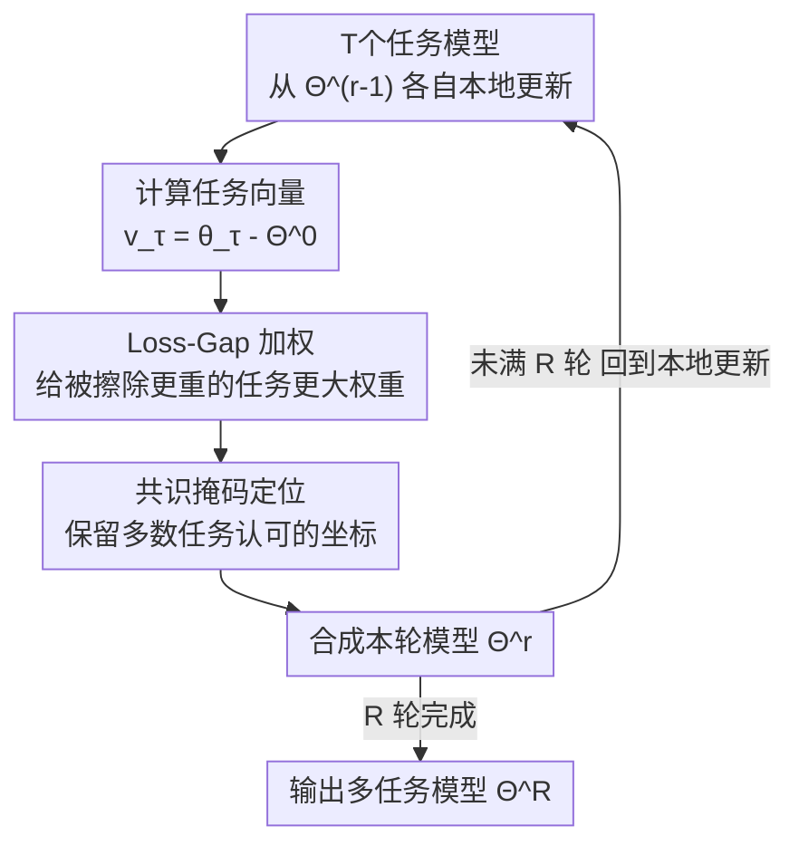

# Post-Hoc Merging is Not Enough: Many-Shot Model Merging with Loss-Gap Balancing

**会议**: ICML 2026  
**arXiv**: [2606.16501](https://arxiv.org/abs/2606.16501)  
**代码**: [项目主页 METIS](https://imkyungjin.github.io/METIS/)  
**领域**: 模型压缩 / 模型合并 / 多任务 LLM  
**关键词**: 模型合并, 多轮合并, 任务干扰, loss-gap 加权, 共识掩码

## 一句话总结
本文指出主流模型合并都是"训练完只合一次"的 post-hoc 合并、易因任务干扰造成信息擦除，转而提出**多轮（many-shot）迭代合并**框架，并在其上设计 METIS——用任务级 loss-gap 加权补偿被擦除的任务、用共识掩码定位兼容更新，从而在保住单任务知识的同时显著提升多任务能力，尤其救回了"最差任务"。

## 研究背景与动机
**领域现状**：把多个任务专属（task-specialized）模型合并成一个多任务 LLM，已是一种实用的后训练范式。由于直接联合多任务训练在现代 LLM 上代价高昂，模型合并通过复用各自独立优化好的任务模型，提供了一条可扩展的替代路径。主流做法（Task Arithmetic、TIES、DARE、ConsensusTA 等）都围绕"如何操纵任务向量（缩放/剪枝/掩码）来减少干扰"展开。

**现有痛点**：这些方法几乎都是 **post-hoc 合并**——任务模型**完全训练好之后只合并一次**。这种一次性聚合会引入**突兀的跨任务干扰**，导致**信息擦除（information erasure）**：某些任务的知识被其他任务的更新覆盖掉，最终拖累多任务表现。其根因常被归为 **model drift**——各任务的更新把模型推向参数空间里各自的任务最优区，朴素聚合就会互相覆盖。

**核心矛盾**：从优化与分布式学习的视角看，drift 本可通过**频繁的参数聚合**来缓解（把各模型约束在共享的参数邻域内、限制任务间发散）；但 post-hoc 范式恰恰相反——它只在最后聚合一次，等于把所有 drift 累积到一刻爆发。

**本文目标**：在不擦除单任务知识的前提下，通过模型合并提升 LLM 的多任务能力。

**切入角度**：与其训练完才合一次，不如**把合并拆成一连串增量步骤**。many-shot 合并通过逐步引入跨任务交互，更贴合优化的迭代本质，缓解一次性聚合带来的突兀参数漂移。作者先用一组实验（Figure 1）证明：**仅仅**把 Task Arithmetic / DARE / TIES / ConsensusTA 从 post-hoc 换成 many-shot，多任务表现就**一致提升**——说明迭代聚合本身就是有效合并的关键因素。

**核心 idea**：但 many-shot 只是"逐步引入交互"，并没显式控制**异构任务更新该如何被整合**。于是在 many-shot 框架之上提出 **METIS**（Mitigating Erasure from Task Interference for Stable many-shot merging）：用 **loss-gap 加权**动态补偿被擦除的任务 + **共识掩码**定位可兼容的参数更新，让迭代合并稳定且保住各任务贡献。

## 方法详解

### 整体框架
METIS 把合并从"一锤子买卖"改造成一个 $R$ 轮的迭代循环。每一轮里，$T$ 个任务模型都从**上一轮的合并模型** $\Theta^{r-1}$ 出发做一步本地更新得到 $\theta_\tau^{r}$，算出任务向量 $\boldsymbol v_\tau^{r}=\theta_\tau^{r}-\Theta^{0}$；然后不是简单平均，而是先按每个任务"上一轮被擦除多严重"算 loss-gap 加权，再用共识掩码挑出"多数任务都认可"的坐标，最后合成本轮的新模型 $\Theta^{r}$ 喂给下一轮。整个 pipeline 如下：

### 关键设计

**1. 多轮（many-shot）合并：把一次性聚合拆成迭代，从根上压住 model drift**

post-hoc 的病根是"把所有 drift 累积到最后一刻一次性聚合"。many-shot 把合并改成 $R$ 轮迭代：所有模型从同一预训练初始化 $\Theta^{0}$ 出发，第 $r$ 轮各任务做本地更新 $\theta_\tau^{r}\leftarrow\Theta^{r-1}-\eta\nabla\mathcal L_\tau(\Theta^{r-1})$，算任务向量 $\boldsymbol v_\tau^{r}=\theta_\tau^{r}-\Theta^{0}$，再用合并算子 $\Theta^{r}=\mathcal M(\boldsymbol v_1^r,\dots,\boldsymbol v_T^r)$ 聚合，$R$ 轮后所有模型收敛到同一个 $\Theta^{R}$。关键在于：每轮本地更新都是从**上一轮合并模型** $\Theta^{r-1}$ 出发（而非各自独立训到底），这把各任务约束在共享参数邻域里、逐步引入跨任务交互，避免了突兀漂移。作者用 **Theorem 3.2** 给出理论支撑：在每个任务损失 $L$-smooth 且学习率 $\eta\le 1/L$ 下，当 $\Delta(\mathcal E,R)+\tfrac{L}{2}\Delta(\xi,R)\le 0$ 时，many-shot 合并模型的多任务损失不高于 post-hoc，即 $\mathcal E(\Theta^{R})-\mathcal E(\bar\Theta^{R})\le 0$（多任务损失定义为各任务损失均值 $\mathcal E(\Theta^{r})=\tfrac1T\sum_\tau\mathcal L_\tau(\Theta^{r})$）。

**2. Loss-Gap-aware 加权：让"上一轮被擦得最狠"的任务在本轮拿到更大话语权**

many-shot 解决了"何时合"，但没解决"异构更新该按什么比例合"。作者的洞察是：在迭代框架里，某任务这一轮被擦除的信息，可以在后续轮次通过给它更大权重补回来。为此定义**任务级 loss-gap** $\mathcal G(\tau,r)=\mathcal L_\tau(\Theta^{r-1})-\mathcal L_\tau(\theta_\tau^{r})$——它衡量"上一轮合并模型 $\Theta^{r-1}$ 对任务 $\tau$ 的拟合，比该任务本地适配后的 $\theta_\tau^{r}$ 差多少"。gap 越大，说明该任务被擦除越严重、本轮该给更大权重。据此用 softmax 得到加权系数并合成加权任务向量：

$$\mathbb V^{r}=\sum_{\tau=1}^{T}\underbrace{\frac{\exp(\mathcal G(\tau,r)/\lambda)}{\sum_{j=1}^{T}\exp(\mathcal G(j,r)/\lambda)}}_{\alpha_\tau^{r}}\,\boldsymbol v_\tau^{r}$$

其中 $\lambda\in\mathbb R^{+}$ 控制重加权的锐度。被严重擦除的任务拿到更大的 $\alpha_\tau^{r}$、在本轮聚合里贡献更强，已被合并模型很好捕获的任务则权重更小。值得注意的是，这种加权**只在 many-shot 框架里可行**——因为计算 $\mathcal G(\tau,r)$ 必须访问上一轮的合并模型 $\Theta^{r-1}$，post-hoc 根本拿不到。**Theorem 4.2** 进一步证明：在标准的有界干扰条件下，loss-gap 加权聚合 $\Theta^{\dagger}$ 的最差任务期望损失不高于均值聚合 $\Theta^{\circ}$，即 $\mathbb E[\mathcal L_{\check\tau}(\Theta^{\dagger})]\le\mathbb E[\mathcal L_{\check\tau}(\Theta^{\circ})]$——这正解释了 METIS 为何能显著救回"最差任务"。

**3. 共识掩码（consensus-based masking）：只保留多数任务都认可的坐标，做参数定位**

光加权还不够——加权任务向量 $\mathbb V^{r}$ 里仍可能有被其他任务冲突贡献"压制"的坐标。作者沿用 ConsensusTA 思路加一层定位。先给每个任务算**任务专属掩码**：第 $i$ 维只有当该任务的加权更新足够强于其余合并更新时才激活，$m_{\tau,i}^{r}=\mathbb I\big(\alpha_\tau^{r}|v_{\tau,i}^{r}|\ge\delta\,|v_i^{r}-\alpha_\tau^{r}v_{\tau,i}^{r}|\big)$，即只保留"任务 $\tau$ 的贡献没被其他任务冲突贡献主导"的坐标。再聚合成**共识掩码**：第 $i$ 维当且仅当至少 $k$ 个任务都同意接受时才置 1，$\bar m_i^{r}=\mathbb I\big(\sum_{\tau=1}^{T}m_{\tau,i}^{r}\ge k\big)$。最终用共识掩码做逐元素门控得到本轮合并参数 $\Theta^{r}\leftarrow\Theta^{0}+\beta^{r}(\bar{\boldsymbol m}^{r}\odot\mathbb V^{r})$，其中 $\beta^{r}\in\mathbb R^{+}$ 是控制整体更新幅度的缩放因子。这一层把"加权"和"定位"解耦——加权决定每个任务贡献多少，掩码决定哪些坐标值得保留，两者协同才能在保住单任务知识的同时减少干扰。

### 损失函数 / 训练策略
METIS 不引入新的训练损失，仍用各任务自己的损失 $\mathcal L_\tau$ 做本地更新；它改的是**合并算子**本身。完整流程见 Algorithm 1：每轮对每个任务做本地更新→算任务向量→算 loss-gap，再统一算 loss-gap 权重 $\alpha_\tau^{r}$、合成 $\mathbb V^{r}$、算任务掩码与共识掩码、门控合并得 $\Theta^{r}$，迭代 $R$ 轮。实验中固定 $R=5$，并刻意**对齐 post-hoc 与 many-shot 的本地更新总步数**以保证公平比较。关键超参为重加权锐度 $\lambda$、掩码阈值 $\delta$、共识门限 $k$、缩放 $\beta^{r}$。

## 实验关键数据

### 实验设置
四类任务：指令跟随（TULU-3 Persona）、数学推理（DART-Math / NuminaMathTIR）、多语言理解（Aya）、安全（WildGuardMix + WildJailbreak），各采样 1,000 条微调。四个基座：Gemma-2-2B、Llama-3.2-3B、Llama-3.1-8B、Qwen-3-4B，$R=5$。遵循 MergeBench 协议评测：指令跟随用 IFEval、数学用 GSM8K（8-shot CoT 精确匹配）、多语言用 M-MMLU/M-ARC/M-HellaSwag、安全用 XSTest，报告归一化性能。

### 主结果：many-shot 普遍优于 post-hoc（Llama-3.2-3B，多任务损失↓ / 性能↑）
仅把范式从 post-hoc 换成 many-shot，所有 baseline 的多任务损失一致下降、性能一致上升：

| 方法 | 多任务损失 post-hoc→many-shot | 归一化性能 post-hoc→many-shot |
|------|------------------------------|------------------------------|
| Task Arithmetic | 2.97 → 2.00 | 0.706 → 0.857 |
| DARE | 1.93 → 1.67 | 0.807 → 0.914 |
| TIES | 1.81 → 1.66 | 0.883 → 0.938 |
| ConsensusTA | 1.83 → 1.49 | 0.942 → 0.945 |

### METIS vs baselines（各基座类别级归一化性能平均）
METIS 在所有基座上取得最佳平均，且在 Llama-3.2-3B 上平均突破 1.0：

| 基座 | 最佳 post-hoc baseline | 最佳 many-shot baseline | METIS (Ours) |
|------|----------------------|------------------------|--------------|
| Gemma-2-2B | ConsensusTA 0.752 | ConsensusTA 0.791 | **0.800** |
| Llama-3.2-3B | ConsensusTA 0.942 | ConsensusTA 0.945 | **1.015** |

以 Llama-3.2-3B 为例，METIS 各类别归一化分为指令 0.917 / 数学 0.872 / 多语言 1.018 / 安全 1.245，均衡性明显好于把某一类做高、另一类做低的 baseline（如 post-hoc TIES 数学 0.897 但指令仅 0.375）。

### 关键发现
- **迭代本身就是大头**：从 post-hoc 换 many-shot 这一步，就能让所有 baseline 一致提升——说明"何时合并"比"用哪种合并算子"更关键，这是论文最反直觉也最实用的结论。
- **METIS 的增量来自加权 + 掩码**：在 many-shot 已经拉高的基线上，loss-gap 加权 + 共识掩码进一步把最佳 many-shot baseline 再推高（如 Llama-3.2-3B 0.945→1.015）。
- **最大价值在"救最差任务"**：与 Theorem 4.2 一致，METIS 对最差任务的提升尤其显著，说明它真正缓解了信息擦除、而非靠牺牲弱任务去堆平均分。
- **跨基座稳健**：从 2B 到 8B、跨 Gemma/Llama/Qwen 多个模型族都成立。

## 亮点与洞察
- **把"合并范式"本身当成可优化对象**：以往工作都在"任务向量怎么操纵"上卷，本文换了个维度——质疑"只合一次"这件事，证明把合并改成迭代过程就能普惠所有方法。这种"退一步质疑底层假设"的思路很值得借鉴。
- **loss-gap 是个优雅的"擦除探测器"**：用 $\mathcal G(\tau,r)=\mathcal L_\tau(\Theta^{r-1})-\mathcal L_\tau(\theta_\tau^{r})$ 量化"某任务被合并模型擦除多严重"，再用 softmax 自动把权重倾斜给受害任务——指标定义清晰、可直接计算，且巧妙利用了 many-shot 才有的"上一轮合并模型"这个抓手。
- **加权与定位解耦**：把"每个任务贡献多少"（loss-gap 加权）和"哪些坐标值得留"（共识掩码）拆成正交两层，是个干净的设计，两层可分别调试。
- **理论与实验对得上**：Theorem 3.2（many-shot 降多任务损失）和 Theorem 4.2（加权降最差任务损失）分别对应"平均提升"和"救最差任务"两个实验现象，理论不是摆设。

## 局限与展望
- **额外计算开销**：many-shot 要做 $R$ 轮本地更新 + 合并，每轮还要在每个任务上算 loss 以求 loss-gap，比 post-hoc"只合一次"贵不少；论文靠"对齐总更新步数"做公平比较，但实际迭代调度成本未充分讨论。
- **超参敏感性**：引入了 $\lambda$（重加权锐度）、$\delta$（掩码阈值）、$k$（共识门限）、$\beta^{r}$ 等多个超参，论文按验证集选取，但对这些超参的敏感性分析（尤其 $\lambda$ 和 $k$）在正文中着墨不多。
- **理论条件的可验证性**：Theorem 3.2 依赖 $\Delta(\mathcal E,R)+\tfrac{L}{2}\Delta(\xi,R)\le 0$，作者称其"易满足"并在附录给经验证据，但这是一个事后条件，能否先验保证存疑。
- **任务/规模范围**：只测了 4 类任务、最大 8B，更大模型（70B+）和更多异构任务下的擦除程度与 METIS 收益是否仍成立，待验证。

## 相关工作与启发
- **vs Task Arithmetic**：TA 用单一缩放系数控制任务向量幅度、超参搜索简单；但它是 post-hoc 的，仍受突兀干扰之苦。METIS 在 many-shot 框架下用逐任务自适应的 loss-gap 权重替代了单一全局系数。
- **vs TIES**：TIES 用"剪小幅参数→选主导符号→只合对齐权重"的三步管线减干扰；METIS 的共识掩码思想与之相近，但额外叠加了 loss-gap 加权和多轮迭代。
- **vs DARE**：DARE 用 Bernoulli 掩码随机丢弃任务向量再缩放；METIS 的掩码不是随机的，而是基于"是否被其他任务冲突主导"的确定性判据 + 跨任务共识。
- **vs ConsensusTA**：METIS 的共识掩码直接建立在 ConsensusTA 之上；区别在于 METIS 把它放进 many-shot 迭代、并叠加 loss-gap 加权——实验里 METIS 一致超过 many-shot 版 ConsensusTA。
- **vs 联邦/分布式学习**：作者明确把 many-shot 合并类比为联邦学习里的多轮参数聚合（频繁聚合约束发散），这个跨领域类比为"为什么迭代合并更优"提供了优化视角的解释。

## 评分
- 新颖性: ⭐⭐⭐⭐ "质疑 post-hoc 假设 + loss-gap 加权"角度新颖，但共识掩码沿用 ConsensusTA
- 实验充分度: ⭐⭐⭐⭐ 4 基座 × 4 任务 + 理论支撑 + 救最差任务验证，较充分；规模和超参敏感性可再补
- 写作质量: ⭐⭐⭐⭐ 动机推导清晰、理论与实验对应工整，符号略密集
- 价值: ⭐⭐⭐⭐ "迭代合并普惠所有方法"是个实用且可立即复用的结论，对多任务 LLM 构建有现实意义

<!-- RELATED:START -->

## 相关论文

- [\[ICML 2026\] Saliency-Aware Model Merging](saliency-aware_model_merging.md)
- [\[AAAI 2026\] Do Not Merge My Model! Safeguarding Open-Source LLMs Against Unauthorized Model Merging](../../AAAI2026/model_compression/do_not_merge_my_model_safeguarding_open-source_llms_against_unauthorized_model_m.md)
- [\[ICML 2026\] Model Merging Scaling Laws in Large Language Models](model_merging_scaling_laws_in_large_language_models.md)
- [\[ICML 2026\] When Shared Knowledge Hurts: Spectral Over-Accumulation in Model Merging](when_shared_knowledge_hurts_spectral_over-accumulation_in_model_merging.md)
- [\[ICCV 2025\] FREE-Merging: Fourier Transform for Efficient Model Merging](../../ICCV2025/model_compression/free-merging_fourier_transform_for_efficient_model_merging.md)

<!-- RELATED:END -->
