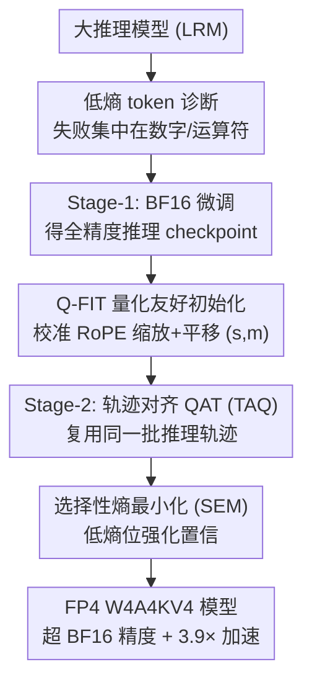

# ReQAT: Achieving Full-Precision Reasoning Accuracy with 4-bit Floating-Point Quantization-Aware Training

**会议**: ICML2026  
**arXiv**: [2606.15682](https://arxiv.org/abs/2606.15682)  
**代码**: https://github.com/aiha-lab/ReQAT  
**领域**: 模型压缩 / 量化  
**关键词**: FP4 量化, 推理模型, QAT, KV cache, 低熵 token

## 一句话总结
这篇论文发现大推理模型 FP4 量化失败集中在「低熵 token」（数字、运算符这类确定性符号承诺）上，于是提出 ReQAT——用三件套（轨迹对齐 QAT + 选择性熵最小化 + KV cache 量化友好初始化）专攻这些 token，在 W4A4KV4 全量化下不仅追平、甚至**超过** BF16 微调精度，同时拿到最高 3.9× 吞吐加速。

## 研究背景与动机
**领域现状**：大推理模型（LRM）靠长链思维（CoT）解数学/逻辑题，但推理时要生成上万 token、反复加载权重、KV cache 随序列线性膨胀，部署成本极高。业界正转向微缩 FP4（MXFP4、NVFP4，用 E2M1 布局），Blackwell B200 的 FP4 算力约是 FP16 的 4×，还原生支持把权重、激活、KV cache 全压到 4-bit 的 W4A4KV4。

**现有痛点**：把 LRM 压到 W4A4KV4 会**严重掉精度**。标准 PTQ 在蒸馏推理模型上掉得很惨；QAT 虽被当作恢复手段，却即便加大微调 token 预算也追不平 BF16 基线。一旦 KV cache 也量化，通道级离群值加上 RoPE 的旋转结构带来逐层畸变，固定的平滑/平移策略压根适应不了来回震荡的 token 统计。

**核心矛盾**：现有 PTQ/QAT 把所有 token 一视同仁地优化，但推理失败其实不是均匀分布的——它高度集中在少数关键 token 上，通用 QAT 的梯度被海量普通 token 稀释，没真正修到病灶。

**本文目标**：在同等训练预算下，让 FP4（尤其最狠的 W4A4KV4）的推理精度恢复到、乃至超过 BF16 全精度微调，同时享受 FP4 的吞吐红利。

**切入角度**：作者先做诊断——按 token 熵分组分析量化噪声的影响。低熵 token 多是数字和符号运算符（模型本来很确信），高熵 token 是连接词/转折词（本来就不确定）。

**核心 idea**：FP4 失败的根源是**低熵 token 的采样误差被放大**：量化让本该被采中的 top-1 token 概率被压低、其它 token 概率抬高（top-1 排名没变但尾部质量变大），导致偶发的符号错误（错一个数字/运算符）级联成整条推理崩盘。对症下药，把训练火力对准低熵 token。

## 方法详解

### 整体框架
ReQAT 是一个「先诊断、再三件套对症」的 FP4 训练框架。诊断阶段证明了量化失败由低熵 token 的采样误差主导（往低熵 token 注入 logit 噪声会大幅掉精度，往高熵 token 注入几乎无影响）。基于此，训练流水线是：先做 Stage-1 BF16 微调拿到全精度推理 checkpoint，再用 Q-FIT 校准 RoPE 相关的 KV cache 量化变换参数 $(s,m)$ 做好初始化，最后在与 Stage-1 **同一批推理轨迹**的子集上做带 SEM 损失的 Stage-2 QAT，得到 FP4 模型。

### 关键设计

**1. 低熵 token 诊断：把 FP4 失败精确定位到「符号承诺」**

这是全文的奠基观察。LRM 里约 80% 是低熵 token（确信的数字、运算符），约 20% 是高熵 token（话语标记、连接词）。论文用两步实验证明病灶在低熵端：① **熵感知混合精度解码**——逐 token 按熵把预测路由到 BF16 或 FP4，发现把低熵预测交给 BF16 能恢复大部分被量化丢掉的精度，而只把高熵预测交给 BF16 几乎没用；② **logit 噪声注入**——给 logits 加乘性高斯噪声 $\sigma Z\odot\eta$（$\eta\sim\mathcal{N}(0,I)$），只扰动熵最低 25% 的 token 会大幅掉 AIME 精度，只扰动最高 25% 影响很小。机制上，论文定义**尾部质量** $M=1-P(x_{\text{top1}})$ 和**尾部质量比** $\rho=(M_{\text{FP4}}+\epsilon)/(M_{\text{BF16}}+\epsilon)$：低熵 token 的 top-1 错配率接近零（排名没翻），但 $\rho$ 显著 >1——意味着虽然 argmax 没变，采到非 top-1 替代 token 的概率被量化抬高了，偶发的符号错误会级联成整段推理失败。

**2. TAQ 轨迹对齐 QAT：让量化更新反复砸在同一批低熵决策上**

普通 QAT 从 base 模型直接训，梯度主要改动的是高熵 bin，低熵 bin 几乎不动——刚好没修到病灶。TAQ 改成两阶段：Stage-1 在数据集 $\mathcal{D}_{\text{FT}}$ 上做 BF16 微调，Stage-2 QAT 在它的**子集** $\mathcal{D}_{\text{TAQ}}\subseteq\mathcal{D}_{\text{FT}}$ 上做，且用的是**完全相同的推理轨迹**。这样量化感知更新会反复作用在同一批低熵 token 决策上。论文用「熵变化」指标验证：单纯 FT 或单纯 QAT 都只改高熵 bin，而 FT+QAT 随 Stage-2 推进会让低熵 bin 出现熵变化——关键是这个效应**只在轨迹对齐时出现**，换不同轨迹做 Stage-2 就消失，证明「复用同一轨迹」才是起效原因，而非单纯多训了。实践中 70M token 的 $\mathcal{D}_{\text{TAQ}}$ 预算就够追平 BF16 微调。

**3. SEM 选择性熵最小化：只在低熵位强化置信**

光把训练打在低熵 token 上还不够，还得主动「锐化」这些位置的置信度，把被量化抬起来的尾部质量重新压回去。SEM 在标准 SFT 损失上加一个**选择性**熵最小化项：

$$\mathcal{L}_{\text{SEM}}=\mathcal{L}_{\text{SFT}}+\lambda\cdot\frac{1}{T}\sum_{t=1}^{T}w_t H_t$$

其中 $H_t$ 是第 $t$ 步预测熵，$\lambda$ 控制锐化强度，$w_t$ 决定在哪些位置生效。关键是 $w_t$ 用**软加权**而非硬二值 mask（避免阈值附近的 token 被过度惩罚）：

$$w_t=\max\!\left(0,\ 1-\frac{H_t-H_{\min}}{\tau-H_{\min}+\epsilon}\right)$$

$H_{\min}$ 是 minibatch 内最小熵，$\tau$ 取每个 minibatch 熵值的 75 分位。已经接近确定（如数字「4」）的 token 拿到更大的 $w_t$、被更强地锐化。SEM 与以往「全局均匀」的熵正则不同，它**按 token 级熵选择性施加**；消融显示软加权比硬 mask 更有效。

**4. Q-FIT 量化友好初始化：联合校准 RoPE 缩放与平移，专治 KV cache**

W4A4KV4 比 W4A4 多了 KV cache 量化的坎：RoPE 配对通道内可能有**不对称离群**（单一共享缩放压不住），而 post-RoPE 的 key 幅值又会随 token 来回震荡（固定平移在长序列上次优）。先前方法要么只缩放、要么只平移，单用都不够。Q-FIT 在 Stage-2 QAT 前**联合**校准 pre-RoPE 通道缩放和 post-RoPE 通道平移：

$$\tilde{Q}=\mathcal{R}(Q^{\text{pre}}\odot s),\qquad \tilde{K}=\mathcal{R}(K^{\text{pre}}\oslash s)-m$$

缩放向量 $s$ 折进投影权重、零推理开销，平移向量 $m$ 校准后固定、推理时做减法。两者各用一个标量 $(\alpha_s,\alpha_m)\in[0,1]$ 参数化：$s=s_0^{\alpha_s}$（$\alpha_s=0$ 关闭缩放），$m$ 初始化为校准集上 post-RoPE key 的通道均值再乘 $\alpha_m$，最后通过最小化 BF16 与 KV4 注意力输出距离来选 $(\alpha_s,\alpha_m)$。这让 Q-FIT 能**逐层自适应**：通道不对称且 token 变化小时关缩放、主用平移；幅值强震荡时关平移、改用配对缩放。MXFP4 配置下额外加块级旋转（被当作 Q-FIT 的特例），NVFP4 则不需要；KV cache 用 E1M2 FP4 格式（训练损失更低）。

### 损失函数 / 训练策略
基础是 token 级负对数似然 $\mathcal{L}_{\text{SFT}}=-\mathbb{E}_{(X,Y)}[\frac{1}{T}\sum_t \log P_\theta(y_t\mid y_{<t},X)]$，SEM 在其上叠加选择性熵项。总微调预算拆成 BF16 FT 与固定 70M-token 的 Stage-2 QAT，且各方法预算对齐以保证公平比较。ReQAT 有三档变体：T（仅 TAQ）、TQ（TAQ+Q-FIT）、TQS（全套带 SEM，默认即指 TQS）。

## 实验关键数据

### 主实验：R1-Qwen-14B 上 AIME 精度（BF16 基线 56.83）
ReQAT 在三种 FP4 部署设置下都把精度推过 BF16 全精度微调（FT 最佳约 65.46），尤其在最难的 W4A4KV4。

| 设置 | 方法 | AIME（最佳预算） | 说明 |
|------|------|-----------------|------|
| — | BF16 Baseline | 56.83 | 全精度未微调 |
| — | BF16 Full FT | 65.46 | 全精度微调上限 |
| MXFP4 W4A16 | Direct PTQ | 50.37 | 直接量化掉点 |
| MXFP4 W4A16 | QAT | 62.29 | 仍低于 BF16 FT |
| MXFP4 W4A16 | ReQAT-TQS | **68.02** | 超 BF16 FT |
| MXFP4 W4A4 | QAT | 58.03 | — |
| MXFP4 W4A4 | ReQAT-TQS | **65.94** | 超 BF16 FT |
| NVFP4 W4A4KV4 | Direct PTQ | 50.13 | 全量化重灾区 |
| NVFP4 W4A4KV4 | QAT | 58.86 | 追不平 |
| NVFP4 W4A4KV4 | ReQAT-TQS | **65.63** | 追平并超 BF16 FT |

### 消融：三件套逐项贡献（NVFP4 W4A4KV4，R1-Qwen-14B）

| 配置 | AIME（代表预算） | 说明 |
|------|-----------------|------|
| ReQAT-T（仅 TAQ） | 60~63 | 轨迹对齐已显著超普通 QAT |
| ReQAT-TQ（+Q-FIT） | 63~66 | Q-FIT 大幅救回 KV cache 量化掉点 |
| ReQAT-TQS（+SEM） | 64~66 | SEM 额外约 +1.3% 置信强化 |
| 硬 mask 替代软加权 | 更低 | 软加权优于硬 mask（Table 12） |
| Stage-2 换不同轨迹 | 低熵熵变化消失 | 证明「轨迹对齐」是 TAQ 起效关键 |

### 关键发现
- **病灶定位是最大贡献**：把低熵预测路由到 BF16 几乎全恢复精度、扰动低熵 token 大幅掉点——直接证明 FP4 失败由低熵采样误差主导，而非高熵 token 翻转。
- **TAQ 起效靠「轨迹对齐」而非多训**：换不同轨迹做 Stage-2，低熵 bin 的熵变化就消失，反证了复用同一轨迹的必要性。
- **Q-FIT 专治 W4A4KV4**：TAQ 单独在 W4A4 已够好，但加上 KV cache 量化会骤降，Q-FIT 通过联合缩放+平移的逐层自适应把这块救回来。
- **真实硬件收益**：在 B200 拿到 3.1× 端到端吞吐加速、DGX Spark 上 3.9×（用 TensorRT-LLM 实测），不是纸面理论加速。

## 亮点与洞察
- **「不是所有 token 都一样重要」的精确化**：把推理失败归因到低熵符号承诺，并用尾部质量比 $\rho$ 这种可量化指标刻画「top-1 没翻但采样变脏」，是个很干净且可复用的诊断视角。
- **轨迹对齐这个 trick 很巧**：不改损失也不加数据，只是让 Stage-2 QAT 复用 Stage-1 的同一批轨迹，就把梯度引到低熵 bin——而且作者用控制实验（换轨迹则失效）证明了它的因果性，说服力强。
- **SEM 的软加权设计**：用 minibatch 内熵分位做软阈值，避免硬 mask 在边界处的抖动，是个能迁移到其它「按位置选择性正则」场景的小设计。
- **Q-FIT 把缩放和平移统一成两个标量**：把 KV cache 量化的两类离群（配对不对称 vs token 震荡）用 $(\alpha_s,\alpha_m)$ 一套参数自适应取舍，逐层选择，工程上很优雅。

## 局限与展望
- **依赖两阶段 + 同轨迹**：必须先有 Stage-1 BF16 微调的轨迹才能做 TAQ，对没有现成微调数据/算力的场景门槛较高。
- **诊断基于熵分箱的近似**：低/高熵的 25% 切分、$\tau$ 取 75 分位等都是经验阈值，不同模型/任务上是否最优未充分扫描。
- **评测集中在数学推理**：AIME/MATH/GSM8K 都是数学，低熵 token 即数字运算符的结论在代码、逻辑、多模态推理上是否同样成立有待验证。
- **MXFP4 与 NVFP4 处理不一致**：MXFP4 需额外块级旋转、KV 用 E1M2，说明方法对具体 FP4 格式仍有定制成分，通用性打折。

## 相关工作与启发
- **vs 标准 QAT/QAD**：它们对所有 token 均匀优化，加大 token 预算也追不平 BF16；ReQAT 把火力集中到低熵 token，用更小预算反超，核心区别是「定位病灶 + 对症」。
- **vs KV cache 变换方法（如 pre-RoPE 缩放 / post-RoPE 平移）**：先前方法用单一固定变换，难适应逐层震荡的统计；Q-FIT 联合两种变换并逐层自适应取舍。
- **vs 熵正则/熵最小化方法**：以往均匀施加熵正则，SEM 改成按 token 熵选择性施加，只锐化本该确定的低熵位。

## 评分
- 新颖性: ⭐⭐⭐⭐⭐ 「FP4 失败集中在低熵 token」是新颖且被严格验证的洞察，三件套都由它派生。
- 实验充分度: ⭐⭐⭐⭐⭐ 多模型多设置多 benchmark + 真实 Blackwell 硬件吞吐实测，消融到位。
- 写作质量: ⭐⭐⭐⭐ 诊断→方法→实验逻辑闭环，公式清晰；变体命名稍多需对照表。
- 价值: ⭐⭐⭐⭐⭐ 让 W4A4KV4 推理模型「不掉精度还提速」，对 LRM 大规模部署直接有用。

<!-- RELATED:START -->

## 相关论文

- [\[ICML 2026\] TWLA: Achieving Ternary Weights and Low-Bit Activations for LLMs via Post-Training Quantization](twla_achieving_ternary_weights_and_low-bit_activations_for_llms_via_post-trainin.md)
- [\[NeurIPS 2025\] FALQON: Accelerating LoRA Fine-tuning with Low-Bit Floating-Point Arithmetic](../../NeurIPS2025/model_compression/falqon_accelerating_lora_fine-tuning_with_low-bit_floating-point_arithmetic.md)
- [\[ICLR 2026\] Achieving low-bit Muon through subspace preservation and grid quantization](../../ICLR2026/model_compression/achieving_low-bit_muon_through_subspace_preservation_and_grid_quantization.md)
- [\[ICLR 2026\] Compute-Optimal Quantization-Aware Training](../../ICLR2026/model_compression/compute-optimal_quantization-aware_training.md)
- [\[ICML 2026\] WinQ: Accelerating Quantization-Aware Training of Language Models Around Saddle Points](winq_accelerating_quantization-aware_training_of_language_models_around_saddle_p.md)

<!-- RELATED:END -->
