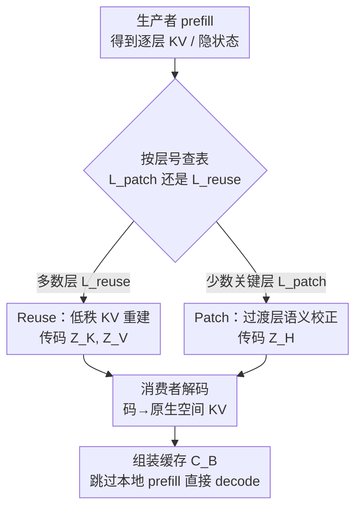

# Semantic Cache Distillation: Efficient State Transfer via Reuse and Selective Patching

**会议**: ICML2026  
**arXiv**: [2606.07684](https://arxiv.org/abs/2606.07684)  
**代码**: 待确认  
**领域**: 模型压缩 / LLM 高效推理  
**关键词**: KV Cache 压缩, 分离式推理, 跨模型缓存复用, 低秩重建, 语义对齐

## 一句话总结
针对"基座模型当生产者、微调模型当消费者"的分离式 LLM 服务场景，本文提出 SCD：把跨设备传输的原始 KV Cache 换成离线学好的低秩语义码，大多数层用 Reuse 做低秩重建省带宽、少数关键层用 Patch 重算前置归一化输入截断误差累积，在 200 Gbps 带宽下相对 Oracle 拿到 2.65× 的 TTFT 加速、F1 仅掉 3% 以内。

## 研究背景与动机
**领域现状**：现代 LLM 服务普遍把推理拆成"算力受限的 prefill 阶段"和"显存带宽受限的 decode 阶段"，分别放在不同设备上（disaggregated serving）。prefill 算完后要把每层的 KV Cache 传给 decode 端，decode 端才能开始出第一个 token。

**现有痛点**：KV Cache 的体量随上下文长度 $T$ 和层数 $L$ 线性增长，在慢速互联（slow interconnect）下，这份原始缓存的传输时间往往直接主导 time-to-first-token（TTFT）。已有工作（量化 KIVI/KVQuant、token 驱逐 H2O/SnapKV、流式传输 CacheGen）几乎都假设生产者和消费者**共享同一套权重、同一个隐空间**，因此只压缩"体积"。

**核心矛盾**：真实部署里有一类很实用的场景——生产者和消费者**架构相同但权重不同**（base 模型 vs 微调专家、draft vs verifier）。一旦权重不同，生产者的 KV 状态落在和消费者不同的特征空间里，直接拿来用会产生**语义漂移（semantic drift）**，且这种 mismatch 会**逐层累积放大**。已有的 DroidSpeak 用"选择性重算关键层、其余层复用原始 KV"来缓解，但它把问题逼成一个二选一的死板权衡：偏向复用就掉质量，偏向重算就丢掉分离式推理省下来的延迟。

**本文目标**：在一条**固定的在线执行路径**上（不做 per-request 的层搜索），同时压住传输开销和语义漂移——既要 payload 小，又要消费者的输出分布贴近 Oracle。

**切入角度**：作者观察到两件事——① Transformer 各层的 KV 张量本身低秩、且对应层在两个模型之间子空间高度重合，所以"大多数层"可以廉价地跨模型重建；② 真正引发严重漂移的只是少数"过渡层"，把误差集中在这几层处理就够了。

**核心 idea**：把"传原始 KV"升级成"传紧凑语义码"——大多数层用低秩投影做跨模型重建（Reuse 省带宽），少数关键层预测消费者的归一化前置输入、再用消费者自己的权重重新生成 KV（Patch 截断误差），从"二选一的选择"进化为"可学习的变换"。

## 方法详解

### 整体框架
SCD 把跨设备的状态传输看成一个**率失真（rate-distortion）问题**：在满足"消费者输出分布与 Oracle 的 KL 散度 $\le \epsilon$"的约束下，最小化总传输延迟 $\mathcal{T}_{\mathrm{transfer}} = |\mathbf{Z}|/\mathrm{BW} + \mathcal{T}_{\mathrm{recon}} + \mathcal{T}_{\mathrm{fill}}$。整个系统分**离线标定**和**在线服务**两段：离线时在同一批标定前缀 $\mathcal{D}_{\mathrm{cal}}$（100–500 条）上分别跑生产者 $\mathcal{M}_A$ 和消费者 $\mathcal{M}_B$ 的完整 prefill，记录成对的逐层 KV 张量和归一化隐状态，据此拟合两套"翻译器"并冻结；在线时生产者只跑 prefill、编码、把低维码传给消费者，消费者解码成自己原生空间的 KV、**直接跳过本地 prefill** 进入 decode。

层被划成两个固定集合：$\mathcal{L}_{\mathrm{patch}}$（用 Patch 的少数关键层，默认 $k=6$）和 $\mathcal{L}_{\mathrm{reuse}}$（其余全部用 Reuse）。这个划分在离线标定时一次选定、对所有在线请求固定不变，所以在线的分支选择退化成"按层号查表"的常数时间判断，延迟波动只来自前缀长度和模型本身，不来自任何在线策略搜索（$\mathcal{T}_{\mathrm{fill}}=0$，因为 Reuse 和 Patch 联合覆盖了所有层，没有需要显式重算的"漏网层"）。

### 关键设计

**1. 跨模型低秩 KV 重建（Reuse）：让大多数层的传输从 $O(Td)$ 降到 $O(Tr)$**

Reuse 针对"传输开销"这个痛点，利用 KV 张量的低秩结构和两模型对应层的子空间重合。离线阶段，对 Key 先去掉旋转位置编码（$\tilde{\mathbf{K}}_A^\ell=\operatorname{deRoPE}(\mathbf{K}_A^\ell)$）在内容空间操作，Value 直接处理；然后把生产者、消费者两边同一层的样本拼成联合矩阵 $\mathbf{X}_K^\ell=[\mathbf{A}_K^\ell\;\mathbf{B}_K^\ell]$，做秩 $r_K$ 分解得到**共享潜码** $\mathbf{Z}_K^\ell$ 和两个模型各自的解码器 $\mathbf{W}_{\mathrm{dec},A}^\ell,\mathbf{W}_{\mathrm{dec},B}^\ell$，使得 $\mathbf{A}_K^\ell\approx\mathbf{Z}_K^\ell\mathbf{W}_{\mathrm{dec},A}^\ell$、$\mathbf{B}_K^\ell\approx\mathbf{Z}_K^\ell\mathbf{W}_{\mathrm{dec},B}^\ell$。生产者侧再用岭回归学一个编码器 $\mathbf{W}_{\mathrm{enc}}^\ell=\arg\min_{\mathbf{W}}\|\mathbf{A}_K^\ell\mathbf{W}-\mathbf{Z}_K^\ell\|_F^2+\lambda\|\mathbf{W}\|_F^2$，把新观测映到共享潜空间。

在线时生产者只算 $\mathbf{Z}_K^\ell=\tilde{\mathbf{K}}_A^\ell\mathbf{W}_{\mathrm{enc},K}^\ell$（Value 同理），消费者解码 $\tilde{\mathbf{K}}_B^\ell=\mathbf{Z}_K^\ell\mathbf{W}_{\mathrm{dec},B}^\ell$ 再重新加回 RoPE。因为 $r\ll d$，传输复杂度从原始的 $O(Td)$ 降到 $O(Tr)$。关键的工程细节是 **K/V/H 三路各用独立的秩** $r_K, r_V, r_H$——实验发现 $r_K$ 可以比 $r_V$ 压得更狠而几乎不掉质量，说明 Value 携带的细粒度生成语义更多。

**2. 过渡层语义校正（Patch）：在少数关键层用重算截断误差累积**

低秩重建对那些"特征 mismatch 会被放大"的关键层不够用，Patch 就专治这几层。它不传也不重建 KV，而是拦截消费者的**前置归一化输入**（post-norm、送进 attention block 之前的状态 $\mathbf{H}_{\mathrm{in}}^\ell$）。生产者把自己的 $\mathbf{H}_{\mathrm{in},A}^\ell$ 压成码 $\mathbf{Z}_H^\ell=\mathbf{H}_{\mathrm{in},A}^\ell\mathbf{W}_{\mathrm{enc},H}^\ell$ 传过去；消费者用一个非线性对齐器 $g_\theta^\ell$（一个 MLP）把码映回自己原生空间 $\hat{\mathbf{H}}_{\mathrm{in},B}^\ell=g_\theta^\ell(\mathbf{Z}_H^\ell)$，再用**消费者自己的权重** $\mathbf{W}_{k,B}^\ell,\mathbf{W}_{v,B}^\ell$ 重新生成这一层的 KV。对齐器以 L2 重建误差 $\|g_\theta^\ell(\mathbf{Z}_H^\ell)-\mathbf{H}_{\mathrm{in},B}^\ell\|_2^2$ 训练。

为什么这样有效？因为用消费者原生权重重算这一层，相当于**显式 reset** 了该层状态，把误差锁死在 Patch 自身的重建质量上，而不让前面层累积的漂移继续往后传。这正好对应了"用很少的重算换很大的质量恢复"，而不是 DroidSpeak 那种整层重算。

**3. 分段误差界：从理论上解释"Reuse 多、Patch 少"为什么够用**

作者把逐层重建误差和消费者输出分布的偏差连起来分析。假设 Transformer 层映射 Lipschitz 连续，Reuse 层的误差满足递推 $\|\hat{\mathbf{h}}_B^{\ell+1}-\mathbf{h}_B^{\ell+1}\|\le\alpha_\ell\|\hat{\mathbf{h}}_B^\ell-\mathbf{h}_B^\ell\|+\beta_\ell\varepsilon_{\mathrm{reuse}}^\ell$，展开后误差**乘性累积**；而 Patch 层直接把误差界压成局部项 $\|\hat{\mathbf{h}}_B^\ell-\mathbf{h}_B^\ell\|\le\varepsilon_{\mathrm{patch}}^\ell$，等于一次"重置"。

由此得到分段误差界（Lemma 5.1）：对落在某段 $(s_j,s_{j+1}]$ 的层 $\ell$，累积误差 $\le(\prod_{i=s_j}^{\ell-1}\alpha_i)\varepsilon_{\mathrm{patch}}^{s_j}+\sum_{k=s_j}^{\ell-1}(\prod_{m=k+1}^{\ell-1}\alpha_m)\beta_k\varepsilon_{\mathrm{reuse}}^k$。再叠上输出头 Lipschitz 性，得到 NLL 偏差界 $|\log p(y_t)-\log\hat{p}(y_t)|\le C_{\mathrm{sm}}L_{\mathrm{out}}\|\hat{\mathbf{h}}_B^L-\mathbf{h}_B^L\|$。直觉是：没有 Patch 时误差被 $\prod_{i=1}^L\alpha_i$ 主导，而残差连接让 $\alpha_i\gtrsim 1$，深层栈下小放大也会滚成大漂移；在过渡点 $s_j$ 插一个 Patch，就把累积项换成小的局部项 $\varepsilon_{\mathrm{patch}}^{s_j}$，从而截断漂移。

## 实验关键数据

### 主实验
评测覆盖 QA（CMRC2018 中文抽取式、HotpotQA 英文多跳）的 F1、WikiText-2 的 PPL，以及与 Oracle 分布的 token 级 KL / TV 距离；延迟在 100 Gbps–1 Tbps 的受控带宽下测 TTFT。基线包括 Raw KV（BF16 全量）、4-bit 量化、DroidSpeak 式选择性重算，以及 SCD 的 Reuse-only 消融。

下表为 MistralLite→Mistral-7B 在 $B_{\mathrm{net}}=200$ Gbps 下的质量–效率主结果：

| 方法 | Payload(MB/req) | TTFT(ms) | 加速(vs Oracle) | F1(CMRC) | KL散度 | PPL(WikiText) |
|------|------|------|------|------|------|------|
| Oracle | 0.00 | 331.9 | 1.00× | 0.8105 | 0.0000 | 4.15 |
| Raw KV (BF16) | 115.02 | 145.5 | 2.28× | 0.2725 | 3.1209 | >100 |
| Quantized (4-bit) | 28.76 | 59.2 | 5.60× | 0.1289 | 6.1887 | >100 |
| DroidSpeak 式 | 127.34 | 198.7 | 1.67× | 0.7052 | 0.1459 | 5.33 |
| SCD (Reuse-only) | 69.02 | 118.2 | 2.81× | 0.6421 | 0.1661 | 6.11 |
| **SCD** | 87.31 | 125.2 | **2.65×** | **0.7850** | **0.1105** | **4.65** |

关键对比：4-bit 量化虽然 payload 最小、TTFT 最低，但 F1 直接崩到 0.13，证明标准压缩**根本无法弥合跨模型权重 mismatch 带来的语义鸿沟**；Reuse-only 把 F1 拉到 0.64 但仍明显落后 Oracle；加上 Patch 后 SCD 几乎恢复全部 Oracle 质量（F1 0.785 vs 0.81），代价只是多 +7.0 ms 延迟。这个优势在更大的 Qwen-32B pair 上同样成立（SCD 2.07× 加速、F1 0.847 vs Oracle 0.876），验证了可扩展性。

### 消融实验
Patch 预算 $k$ 在 WikiText-2 上的影响（从 Reuse-only 起逐步加 Patch 层）：

| 配置 | Patch层数 | TTFT(ms) | PPL | ΔPPL |
|------|------|------|------|------|
| Reuse-only | 0 | 112.3 | 6.788 | 0.00 |
| + Patch ℓ₀ | 1 | 115.9 | 5.971 | -0.82 |
| + Patch Top-3 | 3 | 125.7 | 5.326 | -1.46 |
| + Patch Top-5 | 5 | 136.4 | 5.017 | -1.77 |
| + Patch Top-8 | 8 | 145.9 | 4.816 | -1.97 |

### 关键发现
- **Patch 不是装饰**：仅加 5 个 Patch 层就把 PPL 从 6.788 降到 5.017，逼近 Oracle，印证"误差集中在少数关键层"的假设——补这几层就能稳住整条生成链。
- **默认 $k=6$ 的来历**：不是从这张 PPL 表选的，而是从 F1 维度的累积效率曲线 $\Delta F(\mathcal{S}_k)/(c\cdot k)$ 的 argmax 选出来的；$k$ 太小留下质量空间，太大则成本涨得比质量快。
- **K 比 V 更可压**：Pareto 前沿显示 $r_K$ 可以比 $r_V$ 压得更激进而几乎不掉质量，说明 Value 状态携带更多生成所需的细粒度语义信息。

## 亮点与洞察
- **把"选择"升级成"变换"**：相比 DroidSpeak 的二值决策（原样复用 vs 整层重算），SCD 用可学习的低秩重建 + 定向校正抹平了延迟–质量权衡曲线，既比原样复用压得更狠、又比重算延迟更低。
- **传"语义码"而非"原始状态"这一抽象很值得迁移**：把跨设备/跨模型的状态交接形式化为率失真问题，再用离线标定 + 在线查表把策略搜索从关键路径上彻底移除，是个干净的系统-学习联合设计。
- **Patch 的物理意义清晰**：拦截"前置归一化输入"再用消费者原生权重重生 KV，等价于一次状态 reset，理论上对应分段误差界里的"截断项"，工程上只多一个轻量 MLP。
- **和正交加速方法兼容**：缓存传完重建好后，消费者照样能用 speculative decoding（Medusa/EAGLE）或优化 kernel，SCD 只管"状态交接"这一段。

## 局限与展望
- **适用面窄**：SCD 明确只针对"架构相同、权重不同"的 producer-consumer，不替代同模型 KV 复用；架构都不同时不适用。
- **离线标定有成本**：每个固定模型对都要采集成对 traces、拟合并冻结翻译器，模型对一变就得重标定，难以应对频繁更换/大量微调专家的场景。
- **$\mathcal{L}_{\mathrm{patch}}$ 离线一次选定**：对所有在线请求固定，面对分布差异很大的前缀时，固定的关键层集合是否始终最优值得验证。
- **理论依赖 Lipschitz 假设**：误差界建立在层映射 Lipschitz 连续、$\alpha_\ell$ 等稳定常数存在之上，实际网络的常数估计与界的紧致度仍是经验性的。

## 相关工作与启发
- **vs DroidSpeak（Liu et al., 2024a）**：都处理 base↔微调的跨模型缓存复用，但 DroidSpeak 做"复用原始 KV vs 重算"的二值选择，SCD 做可学习的低秩重建 + 过渡层校正，压缩比更高、延迟更低，平滑了权衡前沿。
- **vs 内模量化/驱逐（KIVI、KVQuant、H2O、SnapKV、CacheGen）**：这些是 intra-model 方法，假设两端共享权重和特征空间，直接套到异构对上无法跨越语义鸿沟；SCD 专为 inter-model 设计，用可学习码把生产者状态映进消费者原生空间。
- **vs Cache-to-Cache / 语义通信（Fu et al., 2026）**：C2C 是把多 agent 的 KV 融合进自身上下文做协作生成，需要接收方先算本地缓存；SCD 的目标是**加速**——让消费者完全跳过 prefill，是面向延迟敏感服务的专用传输协议而非协作机制。

## 评分
- 新颖性: ⭐⭐⭐⭐ 把跨模型缓存复用从"选择"推进到"低秩重建 + 定向校正"，并配了分段误差界的理论支撑。
- 实验充分度: ⭐⭐⭐⭐ 覆盖两个模型规模、多基准、带宽扫描和秩/Patch 预算消融，但仅 base→微调一类异构对。
- 写作质量: ⭐⭐⭐⭐ 问题形式化、方法、理论、实验衔接清晰，图表自洽。
- 价值: ⭐⭐⭐⭐ 直击分离式服务的传输瓶颈，对"共享前缀、专家化解码"这类实际部署有直接意义。

<!-- RELATED:START -->

## 相关论文

- [\[CVPR 2026\] SelecTKD: Selective Token-Weighted Knowledge Distillation for LLMs](../../CVPR2026/model_compression/selectkd_selective_token-weighted_knowledge_distillation_for_llms.md)
- [\[ICML 2026\] Semantic Integrity Matters: Benchmarking and Preserving High-Density Reasoning in KV Cache Compression](semantic_integrity_matters_benchmarking_and_preserving_high-density_reasoning_in.md)
- [\[CVPR 2026\] Memory-Efficient Transfer Learning with Fading Side Networks via Masked Dual Path Distillation](../../CVPR2026/model_compression/memory_efficient_transfer_learning_with_fading_side_networks.md)
- [\[ACL 2025\] State-offset Tuning: State-based Parameter-Efficient Fine-Tuning for State Space Models](../../ACL2025/model_compression/state_offset_tuning_ssm_peft.md)
- [\[NeurIPS 2025\] ChunkKV: Semantic-Preserving KV Cache Compression for Efficient Long-Context LLM Inference](../../NeurIPS2025/model_compression/chunkkv_semanticpreserving_kv_cache_compression_for_efficien.md)

<!-- RELATED:END -->
