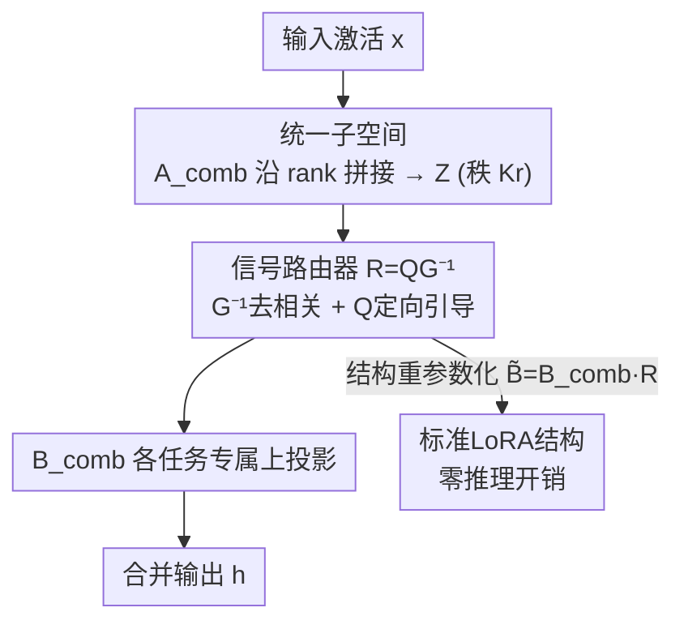

# SSR-Merge: Subspace Signal Routing for Training-Free LoRA Merging in Diffusion Models

**会议**: ICML 2026  
**arXiv**: [2606.10617](https://arxiv.org/abs/2606.10617)  
**代码**: https://github.com/nagara214/SSR-Merge  
**领域**: 模型压缩 / LoRA 合并 / 扩散模型  
**关键词**: LoRA合并, 免训练, 信号路由, 子空间, 最小二乘

## 一句话总结
把多个 LoRA 合并这件事从"参数空间做算术"改成"在统一子空间里路由内部信号"：先沿 rank 维拼出统一子空间，再用一个由二阶统计闭式构造的路由器 $R=\mathbf{Q}\mathbf{G}^{-1}$（去相关 + 定向引导）把混叠信号导向各自任务，理论上等价于最小二乘最优解，免训练、流式更新、零推理开销，在 FLUX.1-dev 上显著超过 TIES/DARE 等 SOTA。

## 研究背景与动机
**领域现状**：扩散模型靠 LoRA 这种 PEFT 方式低成本适配下游，催生了海量风格/角色/指令 LoRA。用户自然想把多个 LoRA 合进一个模型，同时拥有多种能力——这就是 LoRA 合并（merging）。

**现有痛点**：现有合并方法几乎都在**参数空间做算术**。最朴素的线性平均、Task Arithmetic 直接叠加参数，必然引入参数干扰；TIES、DARE 这类启发式靠剪枝/符号选举/随机稀疏化去缓解冲突，但任务数一多就挡不住"破坏性碰撞"——论文 Figure 1 里 DARE 的激活图呈现严重 crosstalk，一条指令会乱激活无关模块。动态方法要么学标量系数（仍困在共享参数空间里解不开冲突），要么用非线性门控（破坏了重参数化性质，没法合并权重、还带推理延迟）。

**核心矛盾**：冲突的根源是**所有任务被塞进同一块共享参数空间**。在这块空间里做加减、剪枝、加权，本质都是在挤压一个容量固定的容器，任务一多必然互相踩。

**本文目标**：在不训练、不加推理开销、保持标准 LoRA 结构的前提下，干净地消除多任务间干扰，且要有可证明的最优性而非又一个启发式。

**切入角度**：作者跳出"参数算术"框架——既然冲突发生在信号混叠，那就别在参数空间合并，而是在 LoRA 的子空间内部**路由信号**，让每个任务的信号被精确导向自己的任务子空间。

**核心 idea**：把合并重新定义为信号路由——构造一个统一子空间，插入一个由二阶统计闭式算出的路由器，去相关后再定向引导，使多任务在线性结构下互不冲突地共存。

## 方法详解

### 整体框架
SSR（Subspace Signal Routing）要合并 $K$ 个在不同任务上训练的 LoRA $\{A_k,B_k\}_{k=1}^K$（$A_k\in\mathbb{R}^{r\times d}$ 下投影、$B_k\in\mathbb{R}^{d\times r}$ 上投影，秩 $r\ll d$）。它分三步：先把各任务子空间拼成一个**统一子空间**（沿 rank 维竖着堆下投影、横着拼上投影，秩从 $r$ 扩到 $Kr$）；再在统一下投影 $\mathbf{A}_{\text{comb}}$ 和统一上投影 $\mathbf{B}_{\text{comb}}$ 之间插入一个**免训练路由器** $R\in\mathbb{R}^{Kr\times Kr}$ 控制信号流向，路由器用去相关算子 $\mathbf{G}^{-1}$ 把混叠的中间信号解相关、再用定向引导 $\mathbf{Q}$ 把净化后的信号精确推向各任务专属的上投影基 $B_k$；最后通过结构重参数化把 $R$ 吸收进上投影，得到一个和标准 LoRA 结构完全相同、零推理开销的合并模块。

### 关键设计

**1. 统一子空间 + 信号路由：把合并从参数算术换成子空间内的信号引导**

针对"参数空间挤不下多任务"的痛点，SSR 不在参数空间做加减。它先构造统一下投影 $\mathbf{A}_{\text{comb}}=[A_1;\dots;A_K]\in\mathbb{R}^{Kr\times d}$ 和统一上投影 $\mathbf{B}_{\text{comb}}=[B_1,\dots,B_K]\in\mathbb{R}^{d\times Kr}$，把秩从 $r$ 扩到 $Kr$。关键洞察是：直接把 $K$ 个 LoRA 更新相加，等价于 $\sum_k B_kA_k=\mathbf{B}_{\text{comb}}\mathbf{A}_{\text{comb}}$，也就是路由器取单位阵 $R=\mathbf{I}_{Kr}$ 的特例（这正是 Task Arithmetic）。所以 SSR 和 TIES/DARE 用的是**同一批低秩更新、同样的子空间容量**（不占额外预算），区别只在于把单位路由换成一个由统计导出的路由器 $R$——干扰不是靠剪枝硬删，而是靠在统一空间里把信号导开。

**2. 二阶统计闭式路由器 $R=\mathbf{Q}\mathbf{G}^{-1}$：去相关 + 定向引导，且可证明等价于 OLS 最优**

路由器由校准数据的二阶统计闭式构造。设第 $k$ 个任务的输入特征 $X_k$ 在统一空间的投影为 $Z_k=\mathbf{A}_{\text{comb}}X_k$。**相关矩阵** $\mathbf{G}:=\sum_{k=1}^K Z_kZ_k^\top$ 度量统一空间里的总相关结构；**定向引导** $\mathbf{Q}:=[\mathbf{Q}_1;\dots;\mathbf{Q}_K]$ 由各任务块 $\mathbf{Q}_k=(A_kX_k)Z_k^\top$ 堆成，捕捉统一投影与任务专属目标的互协方差。路由器即

$$R:=\mathbf{Q}\mathbf{G}^{-1},$$

其中 $\mathbf{G}^{-1}$ 当白化/去相关算子，把共享信号空间里的相关性抹掉；$\mathbf{Q}$ 则把净化后的信号引向各任务的上投影基 $B_k$。这不是拍脑袋的设计：作者用 Moore–Penrose 伪逆性质 $\mathbf{B}_{\text{comb}}^\dagger B_k=\mathbf{E}_k$ 把 $\mathbf{Q}$ 改写成 $\mathbf{Q}=\mathbf{B}_{\text{comb}}^\dagger(\sum_k Y_kZ_k^\top)$（$Y_k=B_kA_kX_k$ 是目标信号），代回得

$$R=\mathbf{B}_{\text{comb}}^\dagger\underbrace{\Big(\sum_k Y_kZ_k^\top\Big)\Big(\sum_k Z_kZ_k^\top\Big)^{-1}}_{\hat\beta_{\text{OLS}}}=\mathbf{B}_{\text{comb}}^\dagger\hat\beta_{\text{OLS}}.$$

由于目标 $Y_k$ 落在 $\mathbf{B}_{\text{comb}}$ 的值域里，投影算子 $\mathbf{B}_{\text{comb}}\mathbf{B}_{\text{comb}}^\dagger$ 退化为恒等，于是合并输出 $\hat Y=\hat\beta_{\text{OLS}}Z$。**Theorem 3.1** 据此保证 $R$ 严格最小化重建目标 $\mathcal{L}(R)=\sum_k\|\mathbf{B}_{\text{comb}}RZ_k-Y_k\|_F^2$——即它是唯一解析最优解，而非启发式调参。

**3. 流式算法 + 结构重参数化 + one-shot 标定：让"最优解"真正能部署**

纯靠理论会卡在工程上：朴素离线构造要缓存所有任务全模型的激活图，内存复杂度 $\mathcal{O}(K\cdot N_{\text{layer}}\cdot T\cdot D_{\text{feat}})$ 不可接受。作者利用充分统计量的可加性设计**流式算法**：对每批特征 $x_t$ 在线更新 $\mathbf{G}\leftarrow\mathbf{G}+(\mathbf{A}_{\text{comb}}x_t)(\mathbf{A}_{\text{comb}}x_t)^\top$ 与 $\mathbf{Q}\leftarrow\mathbf{Q}+\mathbf{E}_k(A_kx_t)(\mathbf{A}_{\text{comb}}x_t)^\top$，更新完即丢弃原始特征，空间复杂度降到常数 $\mathcal{O}((Kr)^2)$ 且与离线解数值等价。**结构重参数化**把路由器吸收进上投影 $\tilde{\mathbf{B}}_{\text{comb}}=\mathbf{B}_{\text{comb}}R$，得到的 $(\mathbf{A}_{\text{comb}},\tilde{\mathbf{B}}_{\text{comb}})$ 与标准 LoRA 结构完全相同，可整体并进骨干权重，严格零推理延迟。**one-shot 标定**则进一步省掉数据集：每个任务只给一条代表性文本提示（如 "A [V] dog"，无需真值图像），且只前向传播单个时间步即可构造 $R$；聚合后的有效样本数 $N$（总 token 数）约 $10^3$，远超子空间维度 $Kr$，保证 $\mathbf{G}$ 良态可逆，估计误差被界在 $\mathcal{O}(\sqrt{Kr/N})$。

## 实验关键数据

实验在 FLUX.1-dev 上进行，从 DreamBooth 选 10 个结构/纹理多样的物体各训一个 rank-32 LoRA，按任务数 $K\in\{1,3,5,7,9\}$ 做变规模合并（$K=1$ 即单 LoRA 上界 Oracle）。对比 Task Arithmetic、TIES、DARE、RobustMerge、IterIS 等免训练 SOTA。

### 主实验：单任务能力保持（FLUX.1-dev，DINOv2 / CLIP）

| 方法 | $K=3$ DINO | $K=5$ DINO | $K=7$ DINO | $K=9$ DINO | $K=9$ CLIP |
|------|------|------|------|------|------|
| Task Arithmetic | 0.5814 | 0.4935 | 0.5165 | 0.5356 | 0.6831 |
| TIES | 0.6264 | 0.5058 | 0.5095 | 0.4723 | 0.6839 |
| DARE | 0.7171 | 0.6584 | 0.6087 | 0.5837 | 0.7376 |
| IterIS | 0.7030 | 0.6720 | 0.6420 | 0.6240 | 0.7520 |
| **SSR (本文)** | **0.7342** | **0.7059** | **0.6868** | **0.6713** | **0.7850** |
| Recovery Rate | 98.6% | 94.8% | 92.3% | 90.2% | — |
| Upper Bound (Oracle) | 0.7443 | 0.7443 | 0.7443 | 0.7443 | 0.8452 |

随任务数增长，baseline 急剧退化而 SSR 全程稳定：在最强干扰 $K=9$ 下仍超过最强 baseline IterIS 0.0473 DINO / 0.0330 CLIP，且始终恢复 90% 以上的单任务 Oracle 性能。

### 多任务执行与编辑泛化

| 实验 | 指标 | DARE | TIES | **SSR** |
|------|------|------|------|------|
| 多概念合成 | DINOv2 ↑ | 0.5050 | 0.4475 | **0.5704** |
| 多概念合成 | CLIP ↑ | 0.6485 | 0.6498 | **0.7357** |
| 多概念合成 | Success Rate ↑ | 0.62 | 0.69 | **0.91** |
| 人脸编辑 | ArcFace ↑ | 0.9471 | 0.9430 | **0.9610** |
| 人脸编辑 | CLIP ↑ | 0.9464 | 0.9529 | **0.9625** |

多概念合成（同图生成多个主体）上 SSR 把 Success Rate 拉到 91%，比 DARE 高 29 个百分点——baseline 靠稀疏化缓解冲突，代价是大量任务直接丢失（掉到 62%–69%）。人脸密集编辑（口红/腮红/眼影同时上）SSR 在身份保持和编辑保真上双双领先。

### 关键发现
- **路由是核心**：Figure 1 的激活图从 baseline 的严重 crosstalk 变成 SSR 干净的对角结构，每个任务只激活自己的目标 LoRA，直观印证了"信号被精确导开"。
- **效率与 DARE 同量级**：$K=9$ 时合并耗时 34.26 s，比优化型 TIES（88.93 s）快约 $2.6\times$，比 DARE（20.95 s）只多 13.31 s——one-shot 单步标定省下大量计算。
- **稀疏化是把双刃剑**：TIES/DARE 用稀疏化压冲突，能勉强保单任务保真，但多任务时严重漏任务；SSR 不靠抑制，靠路由，因而既保真又不漏。

## 亮点与洞察
- **"换坐标系而非挤容器"**：把单位路由的参数相加 $\mathbf{B}_{\text{comb}}\mathbf{A}_{\text{comb}}$ 看成特例，再用统计路由器替换单位阵——一句"rank 预算公平"就堵住了"你是不是靠更大容量赢"的质疑，论证非常干净。
- **启发式变闭式最优**：把一个看似工程化的路由设计证明成 OLS 投影最优，给了免训练合并一个少见的理论保证。
- **充分统计量可加性 → 流式**：用二阶统计的可加性把内存从随特征量线性增长压到常数 $\mathcal{O}((Kr)^2)$，这个 trick 可迁移到任何"需要累积协方差/互相关"的免训练校准场景。
- **结构重参数化保零开销**：吸收进上投影后与标准 LoRA 同构，生态兼容性和推理效率都不损失，工程落地性极强。

## 局限与展望
- **局部线性重建 ≠ 全局最优**：SSR 优化的是局部线性特征重建目标，对完整非线性扩散过程不保证全局最优；极端条件下与上界的差距可能扩大（作者自承）。
- **强冲突/高重叠任务退化**：当任务间存在严重域冲突或高语义重叠时，参数干扰更强、路由更难，性能可能下降。
- **依赖单步标定的充分性**：one-shot 单时间步标定靠"有效样本数远超子空间维"成立，更深/更宽的子空间（$Kr$ 很大）或 token 很少的任务下是否仍良态，值得进一步验证。
- **潜在滥用**：高保真多概念合成可能被用于生成欺骗性内容，作者呼吁负责任使用。

## 相关工作与启发
- **vs Task Arithmetic / 线性平均**：它们直接在参数空间叠加（等价于 SSR 的单位路由 $R=\mathbf{I}$），必然干扰；SSR 用统计路由器替换单位阵，干掉相关性再定向引导。
- **vs TIES / DARE**：靠剪枝/符号选举/随机稀疏化删冲突权重，任务一多就漏任务、掉 Success Rate；SSR 不删信号、不靠抑制，而是把信号路由开，多任务保持显著更稳。
- **vs 非线性门控的动态合并（如 MoE 式 gating）**：那类方法破坏重参数化、带推理延迟、无法合并权重；SSR 保持线性结构、可整体并进骨干，零推理开销。
- **vs RegMean 等解析合并**：作者发现 RegMean 在此设定下数值严重不稳定；SSR 显式利用低秩子空间的内在几何，配合良态的 $\mathbf{G}$ 求逆更稳。

## 评分
- 新颖性: ⭐⭐⭐⭐⭐ "合并即信号路由"的重构 + OLS 最优性证明，视角和理论都新
- 实验充分度: ⭐⭐⭐⭐ 单任务/多任务/编辑三类任务、$K$ 扫描、效率对比齐全，主要限于扩散图像域
- 写作质量: ⭐⭐⭐⭐⭐ 从动机到理论到工程实现逻辑闭环，公式推导清晰
- 价值: ⭐⭐⭐⭐⭐ 免训练、零推理开销、生态兼容，对 LoRA 合并落地有直接价值

<!-- RELATED:START -->

## 相关论文

- [\[CVPR 2026\] Preference-Aligned LoRA Merging: Preserving Subspace Coverage and Addressing Directional Anisotropy](../../CVPR2026/model_compression/preference-aligned_lora_merging_preserving_subspace_coverage_and_addressing_dire.md)
- [\[ICML 2026\] FRISM: Fine-Grained Reasoning Injection via Subspace-Level Model Merging for Vision–Language Models](frism_fine-grained_reasoning_injection_via_subspace-level_model_merging_for_visi.md)
- [\[CVPR 2026\] ManifoldGD: Training-Free Hierarchical Manifold Guidance for Diffusion-Based Dataset Distillation](../../CVPR2026/model_compression/manifoldgd_training-free_hierarchical_manifold_guidance_for_diffusion-based_data.md)
- [\[ACL 2026\] CadLLM: Improving the Throughput of Diffusion-based LLMs via Training-Free Confidence-Aware Calibration](../../ACL2026/model_compression/improving_the_throughput_of_diffusion-based_large_language_models_via_a_training.md)
- [\[ICML 2026\] Task-Driven Subspace Decomposition for Knowledge Sharing and Isolation in LoRA-based Continual Learning](task-driven_subspace_decomposition_for_knowledge_sharing_and_isolation_in_lora-b.md)

<!-- RELATED:END -->
