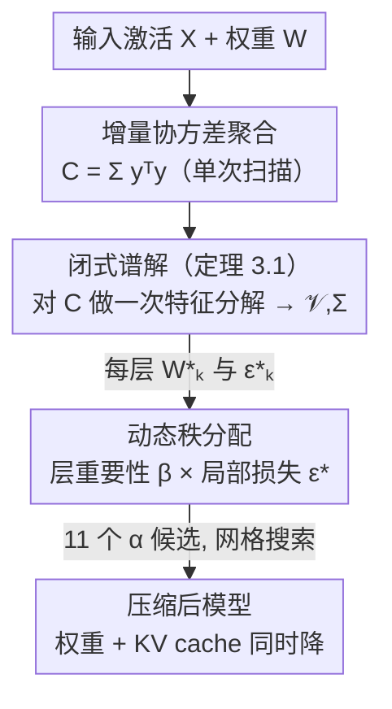

# Swift-SVD: Theoretical Optimality Meets Practical Efficiency in Low-Rank LLM Compression

**会议**: ICML 2026  
**arXiv**: [2604.01609](https://arxiv.org/abs/2604.01609)  
**代码**: https://github.com/hiahei/Swift-SVD  
**领域**: 模型压缩 / 低秩压缩 / LLM 推理加速  
**关键词**: SVD 压缩、激活感知、闭式谱解、KV cache、动态秩分配

## 一句话总结
针对「现有 SVD 低秩压缩要么重构误差次优、要么虽最优但要 Cholesky + 多次 SVD 导致慢且数值不稳」的两难，本文证明了一个闭式谱解定理——对 $Y=XW$ 做一次特征分解即得最优激活感知压缩——并配上增量协方差聚合和「层重要性 ↔ 局部可压缩性负相关」驱动的动态秩分配，在 6 个 LLM、8 个数据集上达到最优压缩精度的同时把端到端压缩耗时加速 3–70×。

## 研究背景与动机
**领域现状**：LLM 部署受内存和带宽掣肘，压力来自两处——海量静态权重必须常驻显存，以及自回归解码维护的 KV cache 会随序列长度不断增长。在量化、剪枝之外，**低秩压缩**把线性层的内在维度降下来，是一个对硬件友好（保留稠密算子、兼容现有软硬件栈）且与量化/剪枝正交的方案，通常靠 SVD 求最优投影。

**现有痛点**：低秩压缩有两条路都不令人满意。一条是**早期直接对权重 $W$ 做 SVD 截断**，完全忽略输入激活 $X$ 的分布，实践中性能掉得厉害。另一条是**激活感知方法**（如 ASVD、SVD-LLM 系列），它们考虑了数据依赖，但往往需要 Cholesky 分解和/或多次 SVD，既引入数值不稳定，又在数据规模变大时效率骤降。此外，跨层**非均匀压缩**虽被探索过，但缺乏高效的层级损失估计，只能用启发式分配秩，结果有时还不如均匀分配。

**核心矛盾**：「理论最优」与「实际高效 + 数值稳定」之间存在张力——已有方法要么牺牲最优性换效率，要么为了最优性付出 Cholesky/多次 SVD 的代价。

**本文目标**：拆成三个子问题——(1) 能否用一次分解就拿到激活感知的**最优**低秩投影；(2) 能否让层级压缩损失算得足够快，使非均匀秩分配的网格搜索可行；(3) 如何决定每层该分多少秩。

**切入角度**：作者注意到激活感知压缩的目标 $\min_{W_k}\|XW - XW_k\|_F$ 本质上是在逼近输出 $Y=XW$，那么最优解应该由 $Y$ 的谱结构（而非 $W$ 的谱结构）决定。顺着这条线就能避开对 $W$ 反复做带白化的 SVD。

**核心 idea**：用 $Y=XW$ 的协方差 $Y^TY$ 的**单次特征分解**直接给出闭式最优投影，再用由此免费得到的谱信息支撑快速的动态秩分配。

## 方法详解

### 整体框架
Swift-SVD 是一个 training-free、激活感知的低秩压缩框架，同时压缩静态权重和 KV cache，分两阶段：**阶段 a（最优激活感知低秩压缩）**——在每个 Transformer 层 hook 输出激活 $Y=XW$，增量聚合协方差 $Y^TY$，对它做**一次特征分解**得到奇异值 $\Sigma$ 和右奇异向量 $\mathcal V$，由闭式公式直接给出最优压缩矩阵 $W_k^*$ 和最小重构损失 $\epsilon_k^*$；**阶段 b（动态压缩）**——利用上一步免费得到的 $\epsilon^*$ 和端到端层重要性 $\beta$ 生成一组候选秩分配方案，再做轻量网格搜索选出端到端表现最好的配置。

### 关键设计

**1. 闭式谱解：最优解由 $Y=XW$ 的谱决定，而非 $W$ 的谱**

痛点是直接对 $W$ 做 SVD 截断忽略了激活分布，而激活感知方法又得绕一大圈。本文的定理 3.1 给出干净的答案：设 $\mathcal V$、$\Sigma$ 是 $Y=XW$ 的右奇异向量与奇异值，则对任意 $k<\text{rank}(Y)$，激活感知压缩问题 $\min_{W_k}\|XW-XW_k\|_F$ 的最优解是

$$W_k^* = W\mathcal V_k \mathcal V_k^T, \qquad \epsilon_k^* = \Big(\sum_{j=k+1}^{\text{rank}(Y)}\sigma_j^2\Big)^{1/2}$$

其中 $\mathcal V_k$ 是前 $k$ 个右奇异向量。证明的关键在于 $XW_k^* = XW\mathcal V_k\mathcal V_k^T = \mathcal U_k\Sigma_k\mathcal V_k^T$ 恰好是 $Y$ 的秩-$k$ 截断 SVD，由 Eckart–Young–Mirsky 定理它就是所有秩 $\le k$ 逼近里 Frobenius 误差最小的；同时可证 $\text{rank}(W_k^*)=k$，满足秩约束。也就是说，**激活感知的最优投影完全由输出 $Y$ 的右奇异子空间刻画**，不需要对 $W$ 做白化或反复分解。

**2. 增量协方差聚合 + 单次特征分解：避开 Cholesky 与多次 SVD**

定理 3.1 把问题归约到「求 $Y$ 的 $\mathcal V$ 和 $\Sigma$」，但直接对可能很大的 $Y\in\mathbb R^{l\times n}$ 做 SVD 既慢又占内存。Swift-SVD 转而计算协方差 $C=Y^TY$，因为

$$Y^TY = (\mathcal U\Sigma\mathcal V^T)^T\mathcal U\Sigma\mathcal V^T = \mathcal V\Sigma^2\mathcal V^T$$

（用到 $\mathcal U^T\mathcal U=I$），所以对 $C$ 做**一次特征分解**就能同时拿到 $\mathcal V$ 和 $\Sigma$。算法上（Algorithm 1）逐个输入向量累加 $\mathbf y_t^T\mathbf y_t$ 来增量构建 $C$，只需额外存一个 $n\times n$ 的协方差矩阵。这样既绕开了 Cholesky 分解，也不用多次 SVD，因此**又快又数值稳定，且开销与数据规模、序列长度无关**——这正是它相对 SVD-LLM 系列「理论最优但实际低效」方法的核心优势。

**3. 动态秩分配：用「层重要性 ↔ 局部可压缩性负相关」指导每层分秩**

均匀分配秩往往次优，因为各层冗余度不同；但非均匀分配以前缺高效的层级损失估计，只能靠启发式。Swift-SVD 先做了一个关键观察：**局部可压缩性**（某层能多好地被低秩逼近，用 effective rank $\text{erank}(\Sigma)=\exp(-\sum_i p_i\ln p_i)$ 衡量，$p_i=\sigma_i/\sum_j\sigma_j$，越低越可压）和**端到端可压缩性**（压它对整体性能伤害多大，用层重要性 $\beta$ 衡量，越低越可压）之间呈**负相关**——重要的层往往 effective rank 反而更低。这意味着不能只看任一信号。

于是它为每层算一个可压缩性分数，把全局重要性和局部损失用超参 $\alpha$ 加权融合：

$$\boldsymbol s_i = (\boldsymbol\beta_i)^\alpha \cdot \big(\log(e+\epsilon^*_{\bar k,i})\big)^{1-\alpha}$$

其中 $\beta_i$ 是 min-max 归一化并平移到 $[1,2]$ 的层重要性，$\epsilon^*_{\bar k,i}$ 是该层在均匀秩 $\bar k$ 下由公式 (4) 算出的最小重构损失。先给每层保底分配 $\bar k\cdot\delta$（$\delta=0.5$）的秩，剩余「弹性秩池」按 $\boldsymbol s_i$ 比例分配。由于闭式解让每个候选的压缩+评测都无需重训，作者用 $\delta=0.5$ 配 11 个 $\alpha=[0,0.1,\dots,1]$ 生成 11 个候选分配，在验证集上轻量网格搜索选最优——这正是阶段 a 的高效闭式解才让这种搜索变得可行。

### 损失函数 / 训练策略
全程 **training-free**，无任何反向传播或微调：压缩损失即激活感知 Frobenius 重构损失 $\epsilon_k^* = \|XW - XW_k^*\|_F$，由定理 3.1 闭式给出；动态秩分配只做前向的网格搜索（每个候选用闭式解压缩后在验证集评测），可并行。所有实验在单张 RTX 5090（32GB）上以推理模式完成。

## 实验关键数据

### 主实验
在 6 个 LLM（LLaMA-7B、LLaMA2-7B、OPT-6.7B、Mistral-7B、Qwen3-4B/8B）和 8–9 个数据集（WikiText-2 / C4 / Alpaca 测困惑度，OpenBookQA / WinoGrande / HellaSwag / ARC-Easy / PIQA / MathQA 测零样本准确率）上评测，基线为 FWSVD、ASVD、SVD-LLM、SVD-LLM v2、Dobi-SVD。下表对比各方法的核心特性（从论文方法与相关工作梳理）：

| 方法 | 激活感知 | 闭式最优 | 计算方式 | 秩分配 |
|------|---------|---------|---------|--------|
| 直接 SVD（截断 $W$） | ✗ | ✗（忽略激活） | 单次 SVD | 均匀 |
| ASVD / SVD-LLM | ✓ | 近似 | Cholesky/白化 + SVD | 启发式/均匀 |
| SVD-LLM v2 | ✓ | 近似 | 多次 SVD | 重构损失启发式 |
| Dobi-SVD | ✓ | 端到端训练得到 | 需训练 | 训练得到 |
| **Swift-SVD** | ✓ | ✓（定理 3.1） | 协方差 + **单次特征分解** | 动态网格搜索（$\alpha$） |

LLaMA-7B 未压缩基线为 WikiText-2 PPL 5.68、C4 PPL 7.34、6 项零样本平均准确率 0.57（显存 12.6GB）；Swift-SVD 在各压缩比下一致超过上述低秩压缩基线（含基于梯度的 Dobi-SVD）。

### 消融 / 效率分析

| 维度 | Swift-SVD 的表现 | 来源 |
|------|------------------|------|
| 压缩精度 | 困惑度 / QA 上达到最优低秩压缩精度，超 SOTA 基线 | 主实验 |
| 端到端压缩耗时 | 相比基线加速 **3–70×** | 摘要 / §4.2 |
| 数值稳定性 | 优于依赖重复 SVD 的方法，且与数据规模无关 | §4.3 |
| 均匀（Swift-SVD）vs 动态（Swift-SVD\*） | 动态秩分配在相同压缩比下端到端表现更好 | Table 1 |

### 关键发现
- **闭式 + 单次特征分解是提速主力**：避开 Cholesky 和多次 SVD，让端到端压缩耗时快 3–70×，且开销不随数据集规模/序列长度膨胀。
- **层可压缩性不能只看重构损失**：端到端层重要性与局部可压缩性呈负相关，这一观察直接驱动了动态秩分配的设计（消融显示动态优于均匀）。
- **闭式解让网格搜索变可行**：因为每个候选秩分配都能免训练、快速地压缩+评测，11 个 $\alpha$ 候选的搜索代价很低，这是非均匀分配此前难以做对的瓶颈所在。

## 亮点与洞察
- **「对 $Y$ 而非 $W$ 做谱分解」是关键转念**：把激活感知最优解归到输出 $Y$ 的右奇异子空间，再用协方差把 $l\times n$ 的 SVD 降成 $n\times n$ 的单次特征分解——一步同时拿下最优性、效率和数值稳定，非常优雅。
- **免费的谱信息一物两用**：阶段 a 算出的 $\epsilon^*$ 和奇异值直接喂给阶段 b 的动态分配（effective rank、层级损失），没有额外开销，体现了「让一次计算服务多个目标」的设计哲学。
- **负相关观察可迁移**：「重要的层反而局部更低秩」这一发现对剪枝、量化的逐层预算分配同样有启发——不能只用单一可压缩性信号决定每层预算。
- **同时压权重和 KV cache**：缓存中间潜变量 $XA_k$（$k<n$）而非输出激活 $XW$，把低秩压缩的收益从静态权重延伸到动态 KV cache。

## 局限与展望
- **依赖验证集做网格搜索**：动态秩分配需要在验证集上评测 11 个候选，虽轻量但仍引入对验证集的依赖，分布偏移时最优 $\alpha$ 可能漂移。
- **协方差需存 $n\times n$ 矩阵**：对超大隐藏维度的层，$C=Y^TY$ 的存储和特征分解成本随 $n$ 增长，论文未深入讨论极大维度下的开销。
- **与量化/剪枝的联合压缩未展开**：作者强调低秩与量化/剪枝正交，但三者叠加时的相互作用与最优配比仍是开放问题。
- **效率提升幅度区间大（3–70×）**：加速比依赖具体模型/数据规模与对照基线，单一数字不可直接外推，需结合具体设置看。

## 相关工作与启发
- **vs SVD-LLM / SVD-LLM v2**：同为激活感知，但它们靠白化 + Cholesky/多次 SVD，数值不稳且数据规模大时低效；Swift-SVD 用协方差单次特征分解给出闭式最优解，又快又稳。
- **vs Dobi-SVD**：Dobi-SVD 靠端到端训练决定每层秩，开销大；Swift-SVD 全程 training-free，用闭式损失支撑网格搜索找动态分配。
- **vs 直接 SVD 截断 $W$**：后者忽略激活分布、实测掉点严重；本文证明激活感知最优解由 $Y=XW$ 的谱决定，从根本上修正了目标。

## 评分
- 新颖性: ⭐⭐⭐⭐⭐ 用定理把激活感知最优解归约到 $Y$ 的协方差单次特征分解，兼得最优性、效率与稳定
- 实验充分度: ⭐⭐⭐⭐ 6 个 LLM × 8–9 数据集 × 5 个 SVD 基线，含效率/稳定性/动态分配消融
- 写作质量: ⭐⭐⭐⭐ 定理证明与算法清晰，记号规范；部分压缩比的具体数表需查正文/附录
- 价值: ⭐⭐⭐⭐⭐ training-free、即插即用、同压权重与 KV cache，对实际部署很实用

<!-- RELATED:START -->

## 相关论文

- [\[CVPR 2026\] What Matters in Practical Learned Image Compression](../../CVPR2026/model_compression/what_matters_in_practical_learned_image_compression.md)
- [\[CVPR 2025\] Towards Practical Real-Time Neural Video Compression](../../CVPR2025/model_compression/towards_practical_real-time_neural_video_compression.md)
- [\[AAAI 2026\] SkipCat: Rank-Maximized Low-Rank Compression of Large Language Models via Shared Projection and Block Skipping](../../AAAI2026/model_compression/skipcat_rank-maximized_low-rank_compression_of_large_language_models_via_shared_.md)
- [\[ICML 2026\] ScaLoRA: Optimally Scaled Low-Rank Adaptation for Efficient High-Rank Fine-Tuning](scalora_optimally_scaled_low-rank_adaptation_for_efficient_high-rank_fine-tuning.md)
- [\[ICML 2026\] Energy-Structured Low-Rank Adaptation for Continual Learning](energy-structured_low-rank_adaptation_for_continual_learning.md)

<!-- RELATED:END -->
