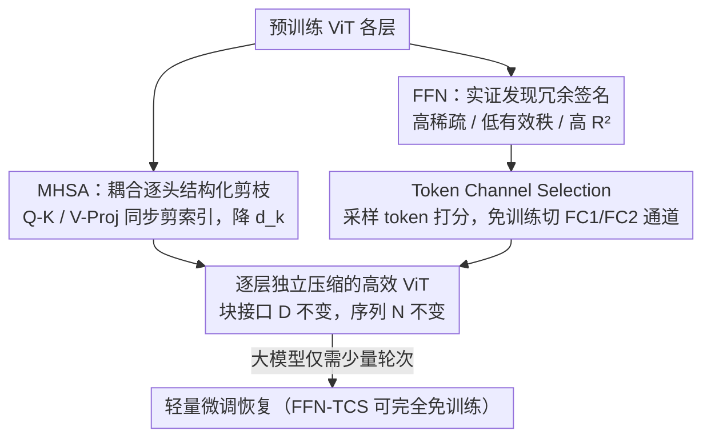

# ToaSt: Token Channel Selection and Structured Pruning for Efficient ViT

**会议**: ICML 2026  
**arXiv**: [2602.15720](https://arxiv.org/abs/2602.15720)  
**代码**: https://github.com/SHANNonLab-HUFS/ToaSt  
**领域**: 模型压缩 / 高效 ViT  
**关键词**: ViT 压缩、结构化剪枝、通道选择、免训练、逐层独立压缩

## 一句话总结
ToaSt 把 ViT 的压缩"解耦"成两套针对性策略：对占不到 40% FLOPs 的多头自注意力 (MHSA) 用耦合的逐头结构化权重剪枝、保住注意力的数学完整性；对占 60%+ FLOPs 的前馈网络 (FFN) 用免训练、推理时即插即用的"Token Channel Selection (TCS)"过滤冗余噪声通道，在九个 ViT 模型上拿到更优的精度–效率折中，例如 ViT-MAE-Huge 上 88.52% Top-1（+1.64%p）同时砍掉 39.4% FLOPs。

## 研究背景与动机
**领域现状**：ViT 凭自注意力捕获全局依赖，在分类/检测/分割上全面开花，也成了多模态基座，但代价是计算量远大于同精度 CNN，部署到移动端/边缘很吃力。为压缩 ViT，主流是两条路：结构化权重剪枝（移掉通道/头/块）和 token 压缩（减少序列长度 $N$）。

**现有痛点**：两条路各有硬伤。结构化剪枝靠 magnitude/gradient 准则移除结构，但大刀阔斧砍掉整块结构通常带来明显掉点，必须靠**昂贵的全模型重训练**恢复，这对大基座模型几乎不可承受；而且它不针对 ViT 真正的计算大头。token 压缩直接削序列长度 $N$，瞄准注意力的二次复杂度 $\mathcal{O}(N^2)$，但它只在序列维做文章——FFN 的计算随 $N$ 只线性下降，**主导的隐藏维 $\mathcal{O}(D^2)$ 复杂度它根本碰不到**；更糟的是 token 级决策会传播到后续层，制造跨层依赖，让优化地形变复杂。

**核心矛盾**：FFN 才是 FLOPs 大头（标准 ViT 中约 61%，MHSA 不到 40%），但两类主流方法要么去重训、要么只削序列维，都没能高效、免训练地吃掉 FFN 的通道冗余；同时 token 压缩的跨层传播让逐层独立优化变得困难。

**本文目标 + 切入角度**：作者主张一种**逐层独立压缩 (Layer-Independent Compression)** 哲学——每层独立压、不让压缩效应跨层扩散，并对 ViT 的两个性质迥异的组件分别用最合适的策略。关键观察是：MHSA 是耦合的线性变换、剪错会塌；FFN 在深层呈现高稀疏、低有效秩、高线性重建保真度的冗余"签名"，可以免训练地挑通道。

**核心 idea**：解耦——MHSA 用耦合逐头结构化剪枝（动内部头维 $d_k$、不动块接口 $D$），FFN 用免训练、逐层自适应的通道选择 (TCS) 直接削 $D^2$；两者都只动通道维、保留 token 序列，从而把跨层依赖斩断、把优化地形简化。

## 方法详解

### 整体框架
输入是预训练好的 ViT，输出是逐层独立压缩后的高效 ViT。ToaSt 分两个解耦阶段：(1) **MHSA 压缩**——对每个头，把 Q/K/V/Proj 四个权重矩阵按耦合约束同步剪掉相同的内部维索引，用几何中位数 (GM) 打分挑最冗余的维，逐头统一剪枝率（跳过第一层、其余约 90%），从而压低头内维 $d_k$ 而保持块对外的嵌入维 $D$ 不变；(2) **FFN 压缩**——先实证分析 FFN 深层的冗余签名，再用免训练的 TCS：基于少量采样 token 算每个通道的重要度，对 FC1/FC2 各自独立地切掉低重要度通道，形成稠密子矩阵做高效 GEMM。因为两阶段都只动通道维、不动 token 序列，且保持块接口 $D$ 不变，压缩效应不会跨层传播。

### 关键设计

**1. MHSA 耦合逐头结构化剪枝：靠同步索引保住注意力的数学完整性**

注意力是耦合线性变换：$\mathbf{Q}^h=\mathbf{X}\mathbf{W}_Q^h$、$\mathbf{K}^h=\mathbf{X}\mathbf{W}_K^h$、$\mathbf{A}^h=\mathrm{softmax}(\mathbf{Q}^h(\mathbf{K}^h)^\top/\sqrt{d_k})$、$\mathbf{O}^h=\mathbf{A}^h(\mathbf{X}\mathbf{W}_V^h)\mathbf{W}_{\text{proj}}^h$。如果对 Q/K/V/Proj 各自独立挑索引剪，会破坏点积和输出投影的内维对齐，导致灾难性塌陷（图 3 的 Non-Align）。ToaSt 因此选择压**头内维 $d_k$** 而非全局 $D$（这样天然兼容残差、保住下游特征地形），并强制两条同步约束：剪 $\mathbf{W}_Q^h$ 第 $j$ 列必须同时剪 $\mathbf{W}_K^h$ 第 $j$ 列（保点积有效），剪 $\mathbf{W}_V^h$ 第 $j$ 列必须同时去掉 $\mathbf{W}_{\text{proj}}^h$ 第 $j$ 行（保输出投影内维）。重要度用**几何中位数 (GM)** 静态打分：离权重分布中心最近的维冗余度最高（信息最易被其余维近似），对耦合对 $\mathbf{W}_{QK}^h$、$\mathbf{W}_{VO}^h$ 分别算 $I^h[j]=\|\mathbf{w}_j^h-\mathrm{GM}(\cdot)\|_2$，剪掉分数最低的维。再用**逐头统一**策略让所有头剪到同一 $d_k'$，保证可批量矩阵乘、无 padding 开销；按"跳过第一层、其余约 90%"的逐层调度，MHSA FLOPs 砍约 90%。

**2. FFN 冗余签名的实证刻画：用四个度量证明深层 FFN 该剪、且剪了反而去噪**

TCS 的合法性建立在对预训练 ViT（如 Swin-Base）FFN 激活的实证分析上，作者用四个度量刻画深层冗余：① **高线性重建保真度 $R^2$**——把某通道用同层其余通道做最小二乘线性重建，$R^2=1-\frac{\sum_i(y_i-\hat y_i)^2}{\sum_i(y_i-\bar y)^2}$ 在多数层稳定 >0.9，说明高维通道彼此线性相关，全局重要度分布可由极小通道子集准确估计；② **有效秩坍塌**——用基于 PCA 的有效秩比（覆盖 90% 方差所需奇异值占比 $\min_k k/C$）衡量内在维度，深层显著坍塌，证明 $4D$ 扩张里藏着大量冗余；③ **稀疏度上升**——深层"死神经元"（$|x_c|<0.1\cdot\overline{|x|}$）比例显著增加，由 GELU 驱动；④ **通道 SNR gap**——FC2-pruned 块里保留通道的信噪比是被剪通道的 $3$–$5.5\times$，证明被剪的是噪声主导、低判别力的通道。正是这第四点解释了 TCS 不仅不掉点、反而常涨点——它实质是个**隐式噪声滤波器**。

**3. Token Channel Selection (TCS)：免训练、采样 + 自适应地切 FFN 通道**

基于上面的签名，TCS 分三步免训练地压 FFN。**采样估重要度**：算重要度本需聚合全部 $N$ 个 token 的特征幅值，代价 $O(N\cdot C)$（$C=D$ 于 FC1 输入、$C=4D$ 于 FC2 输入）；因 $R^2\approx1$ 保证通道强线性相关，只需随机采 $2\%$–$20\%$（随层深自适应）的 token 子集 $\mathcal{S}$ 就能准确估计全局重要度分布，把开销降几个数量级。**重要度打分**（架构相关）：对 CLS 蒸馏模型（如 DeiT），$I_c=\lambda_{cls}|x_{cls}^{(c)}|+\lambda_{patch}\frac{1}{|\mathcal{S}|}\sum_{i\in\mathcal{S}}(A_{cls,i}\cdot|x_i^{(c)}|)$，用 $\lambda_{cls}=2.0,\lambda_{patch}=1.0$ 偏重编码全局语义的通道；对无 CLS 对齐信号的模型（ViT-MAE、Swin）退化为 $I_c=\frac{1}{|\mathcal{S}|}\sum_{i\in\mathcal{S}}|x_i^{(c)}|$ 的幅值选择。**硬件友好的结构化裁剪 + 逐层自适应策略**：对 FC1/FC2 各自沿输入维切掉整列、形成稠密子矩阵直接上 GPU GEMM，无需稀疏库；调度上 FC1（扩张、早层有效秩高）保守剪以保特征多样性，FC2（缩减、深层稀疏高秩低）激进剪（最高 90%），把"秩坍塌"观察直接转成算力节省。消融（附录 16）显示注意力加权对 CLS 蒸馏模型有益（+2.2 到 +8.0%p）、对 MAE/Swin 中性，验证了这种架构相关设计。

### 损失函数 / 训练策略
FFN 的 TCS 完全免训练、推理时即插即用。MHSA 结构化剪枝后做轻量微调恢复，且大模型恢复成本反而更低：ViT-MAE-Huge 仅约 15 epoch（4×H100 约 15 小时）即可超过基线，而 DeiT-Small 需 290 epoch；远低于传统剪枝动辄 300 epoch 的全模型重训。

## 实验关键数据

### 主实验
ImageNet-1K，H100 batch 128 测吞吐，与 token 压缩 SOTA（ToMe、DiffRate）对比。ToaSt 在精度、FLOPs 缩减、吞吐上普遍占优，尤其大模型获益更大。

| 模型 | 方法 | Top-1 (%) | FLOPs↓ (%) | Speedup |
|------|------|------|------|------|
| DeiT-Tiny | Baseline | 72.20 | – | 1.00× |
| DeiT-Tiny | ToMe | 71.25 | 46.2 | 1.19× |
| DeiT-Tiny | **ToaSt** | **74.25** | 41.5 | **2.03×** |
| DeiT-Small | **ToaSt** | **83.40** | 45.7 | **2.07×** |
| ViT-MAE-Large | Baseline | 85.96 | – | 1.00× |
| ViT-MAE-Large | DiffRate | 85.66 | 31.3 | 1.36× |
| ViT-MAE-Large | **ToaSt** | **88.94** | 37.5 | 1.51× |
| ViT-MAE-Huge | Baseline | 86.88 | – | 1.00× |
| ViT-MAE-Huge | **ToaSt** | **88.52 (+1.64%p)** | 39.4 | 1.51× |

值得注意的是 ToaSt 在多数大模型上**不掉反涨**（DeiT-Tiny +2.05、ViT-MAE-Large +2.98%p），印证 TCS 的隐式去噪效应。

### 消融实验

| 配置 | 效果 | 说明 |
|------|------|------|
| 耦合同步剪枝 (Align) | 高剪枝率仍稳 | 去掉同步 (Non-Align) → 高比率灾难性塌陷（图 3） |
| GM 重要度准则 | 优于 $L_1$/$L_2$ | 几何中位数更准识别可替代维（附录 C） |
| TCS 注意力加权 | CLS 模型 +2.2~+8.0%p | 对 MAE/Swin 中性，故按架构选公式 |
| 采样率 2–20% | 精度几乎无损 | $R^2\approx1$ 保证小子集足够估计全局重要度 |

### 关键发现
- 同步约束是 MHSA 剪枝的命门：不同步则高剪枝率直接崩，耦合后即便激进剪也保住功能完整性。
- 模型越大越好压：ViT-MAE-Huge 仅 15 epoch 恢复且超基线，DeiT-Small 要 290 epoch——大模型 FFN 冗余更重、获益更大。
- TCS 是"压缩 + 去噪"二合一：被剪通道 SNR 低 $3$–$5.5\times$，剪掉它们反而提升精度。
- 下游迁移有效：COCO 检测 52.2 vs 51.9 mAP（Cascade R-CNN, Swin-Base），ADE20K 分割、CIFAR-100 分类同样可迁。

## 亮点与洞察
- "解耦"抓得准：把 ViT 拆成性质迥异的 MHSA（耦合、易塌、需谨慎剪）和 FFN（冗余、可免训练挑通道），分而治之，比一刀切的统一剪枝/token 压缩更贴合结构。
- 用"只动通道维、不动 token 序列 + 保持块接口 $D$"把跨层依赖彻底切断，逐层独立压缩，优化地形大大简化——这是它能免重训的关键工程洞察。
- TCS 把"剪枝"重新理解为"噪声滤波"：通过 SNR gap 实证被剪的是噪声通道，于是压缩与提精度不再矛盾，这个视角可迁移到 CNN/LLM 的 FFN/MLP 模块。

## 局限与展望
- TCS 的免训练依赖"深层 FFN 高 $R^2$、低有效秩"的冗余签名，对训练范式不同、激活不那么稀疏的 ViT 变体是否仍成立需验证。
- 重要度打分按架构手工分两套公式（CLS vs 非 CLS），并带超参 $\lambda_{cls},\lambda_{patch}$，迁移到新架构时需要重新判定/调参。
- MHSA 仍需轻量微调恢复，并非完全免训练；逐头统一剪枝率（约 90% + 跳首层）是较粗的全局调度，未做逐层/逐头精细搜索。
- 主战场是分类 + 部分检测/分割，缺对生成式/多模态大 ViT 与极端压缩比下的系统评估。

## 相关工作与启发
- **vs token 压缩 (ToMe / DiffRate / PiToMe)**：它们削序列长度 $N$、瞄注意力二次复杂度，但 FFN 计算只随 $N$ 线性降，碰不到主导的 $D^2$，且 token 决策跨层传播；ToaSt 正交地直接削 FFN 通道维、保留序列，可与之互补叠加。
- **vs 传统结构化剪枝 (Yu 2022 / DepGraph)**：用 magnitude/gradient 砍结构后需昂贵全模型重训；ToaSt 用激活统计 + GM 做结构化移除，免去重训重担、对大基座更友好。
- **vs 联合/混合方法（剪枝+token / 剪枝+量化）**：联合剪枝常陷复杂耦合优化、量化方案受硬件依赖（超低比特要专用加速器/核），ToaSt 解耦两组件、都只动通道维，简化地形、最小恢复开销。

## 评分
- 新颖性: ⭐⭐⭐⭐ "解耦 + 逐层独立 + FFN 免训练通道选择"组合新，TCS 当噪声滤波器视角巧。
- 实验充分度: ⭐⭐⭐⭐⭐ 九个模型 + 下游检测/分割/分类 + 多组消融，覆盖全面。
- 写作质量: ⭐⭐⭐⭐ 冗余签名四度量讲得扎实，但两套打分公式略增理解成本。
- 价值: ⭐⭐⭐⭐⭐ 大模型免重训涨点 + 大幅省 FLOPs，部署导向强、即插即用。

<!-- RELATED:START -->

## 相关论文

- [\[ICML 2026\] Token Sparse Attention: Efficient Long-Context Inference with Interleaved Token Selection](token_sparse_attention_efficient_long-context_inference_with_interleaved_token_s.md)
- [\[ACL 2026\] Adaptive Layer Selection for Layer-Wise Token Pruning in LLM Inference](../../ACL2026/model_compression/adaptive_layer_selection_for_layer-wise_token_pruning_in_llm_inference.md)
- [\[ICML 2025\] OrthoRank: Token Selection via Sink Token Orthogonality for Efficient LLM Inference](../../ICML2025/model_compression/orthorank_token_selection_via_sink_token_orthogonality_for_efficient_llm_inferen.md)
- [\[ACL 2026\] Two-Stage Regularization-Based Structured Pruning for LLMs](../../ACL2026/model_compression/two-stage_regularization-based_structured_pruning_for_llms.md)
- [\[NeurIPS 2025\] Recurrent Attention-based Token Selection for Efficient Streaming Video-LLMs](../../NeurIPS2025/model_compression/recurrent_attention-based_token_selection_for_efficient_streaming_video-llms.md)

<!-- RELATED:END -->
