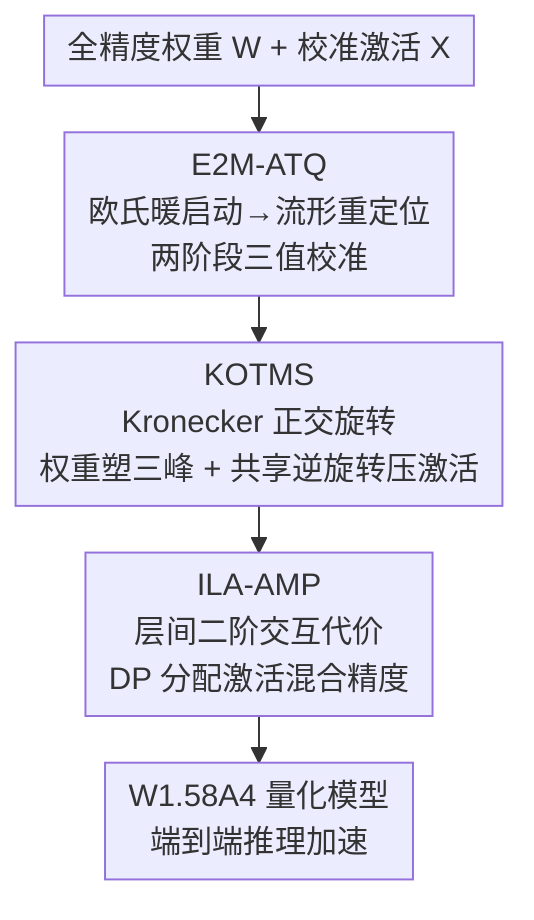

# TWLA: Achieving Ternary Weights and Low-Bit Activations for LLMs via Post-Training Quantization

**会议**: ICML 2026  
**arXiv**: [2606.13054](https://arxiv.org/abs/2606.13054)  
**代码**: https://github.com/（论文标注为 TWLA，⚠️ 具体仓库地址以原文为准）  
**领域**: 模型压缩 / 后训练量化 / 大语言模型  
**关键词**: 三值量化, 后训练量化, 激活量化, 正交旋转, 混合精度

## 一句话总结
TWLA 是首个能同时把权重压到 1.58-bit（三值）、激活压到 4-bit 的**后训练量化**框架——靠"欧氏→流形两阶段三值校准 + Kronecker 正交旋转把权重塑成三峰分布并顺手压激活离群值 + 层间感知的激活混合精度分配"三件套，在 W1.58A4 下仍保住高精度并真正实现端到端推理加速。

## 研究背景与动机
**领域现状**：LLM 靠堆参数换能力，但动辄数十上百亿参数让显存和算力成为部署瓶颈（DeepSeek-R1-671B 光 FP16 权重就要 ≥1TB）。量化是核心压缩手段，其中**三值化**（ternarization）把权重约束到 $\{-1,0,+1\}$，压缩率高、还能把大部分浮点乘法换成加法和分支，是很有代表性的极端压缩方案。

**现有痛点**：现有三值方法（TernaryLLM、PT2-LLM 等）几乎都是**只量化权重**：它们缺乏对激活量化的系统建模，低 bit 下激活一压精度就崩，于是干脆把激活留在全精度、推理时再把三值权重反量化回来。结果是**端到端加速被根本性地堵死**——权重再小，激活和反量化的开销还在。少数方案（BitNet v2）能做三值权重 + 4-bit 激活，但靠昂贵的量化感知训练（QAT），报告训练成本超 $10^4$ GPU 小时，对任意预训练模型不可迁移。

**核心矛盾**：作者重新审视权重/激活的统计性质，发现两个错配。其一，预训练 LLM 的逐通道权重往往近似**单峰高斯**，而三值码本 $\{-1,0,+1\}$ 天然对应**三峰**结构——单峰投到三值空间量化误差极大。其二，激活呈**重尾 + 极端离群值**，低 bit 下这些离群值主导失真。

**本文目标**：在 PTQ（免重训）框架内，同时 ❶ 把权重分布**重塑成对三值友好的三峰形态**、❷ **压住激活离群值削弱重尾**，让三值权重和低 bit 激活能协同工作。

**核心 idea**：用一组共享的 Kronecker 正交旋转，一边把权重坐标系旋转到三峰友好的方向、一边用同一旋转的逆变换搅匀激活、统计地缩小离群值——再配两阶段三值校准和层间感知的混合精度分配补齐短板。

## 方法详解

### 整体框架
TWLA（Ternarized Weights and Low-bit Activations）是一个免重训的 PTQ 框架，由三个紧耦合模块串成。给定全精度权重矩阵 $\mathbf{W}\in\mathbb{R}^{n\times m}$，先用 **E2M-ATQ** 做两阶段三值校准，拿到稳定的三值模式与连续 shift/scale 参数；再用 **KOTMS** 学一个 Kronecker 结构正交旋转 $\mathbf{R}$，把权重坐标旋到对称三峰分布、同时用 $\mathbf{R}$ 的逆旋转搅匀激活压离群值；最后用 **ILA-AMP** 在全局 bit 预算下，把"层间二阶交互代价"也算进去给各层分配激活 bit，防止个别弱层引发精度级联崩塌。最终在 W1.58A4 下做端到端推理。

### 关键设计

**1. E2M-ATQ：从欧氏到流形的两阶段三值校准，让三值参数真正对齐"层输出"**

预训练权重常带非零行均值，违反低 bit 量化的对称假设，所以先采用**非对称三值参数化** $\bar{\mathbf{W}}=\bm\mu\mathbf{1}^\top+\mathrm{diag}(\bm\alpha)\mathbf{T}$，其中 $\bm\mu,\bm\alpha$ 是逐行 shift/scale、$\mathbf{T}\in\{-1,0,1\}^{n\times m}$。痛点在于：直接按"层输出对齐"目标去优化 $\mathbf{T}$ 会因为校准引入的列间相关性而把逐元素阈值化变成困难的组合优化。作者的解法是两阶段。**第一阶段（欧氏暖启动）**在权重域最小化 Frobenius 重构误差 $L_1=\lVert\mathbf{W}-\bm\mu\mathbf{1}^\top-\mathrm{diag}(\bm\alpha)\mathbf{T}\rVert_F^2$，交替更新 $\bm\mu$（残差均值校正 $\bm\mu\leftarrow\bm\mu+\frac1m\mathbf{E}\mathbf{1}$）、$\bm\alpha$、$\mathbf{T}$ 直到收敛，得到稳定三值模式 $\mathbf{T}^{(0)}$。**第二阶段（流形重定位）**则冻结 $\mathbf{T}=\mathbf{T}^{(0)}$，在校准激活诱导的度量流形上最小化**层输出误差** $L_2=\mathrm{Tr}(\mathbf{E}\mathbf{S}\mathbf{E}^\top)$（$\mathbf{S}=\sum_b\mathbf{X}_b^\top\mathbf{X}_b$ 是激活二阶矩）。由于 $\mathbf{T}$ 固定，目标按行解耦，每行 $(\mu_i,\alpha_i)$ 由一个 $2\times2$ 线性方程组得到**闭式解**。这样既绕开了对 $\mathbf{T}$ 的组合搜索，又让校准目标从"权重像不像"升级为"层输出像不像"。

**2. KOTMS：Kronecker 正交旋转，一手把权重塑成三峰、一手压激活离群值**

E2M-ATQ 只调连续参数，没改变"权重单峰 vs 码本三峰"的几何错配——很多权重项卡在三值决策边界附近，硬投影对扰动极敏感。KOTMS 引入一个可学正交变换 $\mathbf{z}_i=\mathbf{w}_i\mathbf{R}$ 来重塑坐标系，并用**三峰高斯混合**作为对三值码本对齐的可微代理：

$$\mathcal{L}_{\mathrm{TriGMM}}=-\frac{1}{nm}\sum_{i,j}\log\big[\pi_+\phi(z_{ij};+c_i,\sigma_i^2)+\pi_0\phi(z_{ij};0,\sigma_i^2)+\pi_-\phi(z_{ij};-c_i,\sigma_i^2)\big],$$

三个锚点 $\{-c_i,0,+c_i\}$ 分别对应负/零/正三值区，最小化它就是把变换后权重往三值锚点推（再加 $\mathcal{L}_{\text{zero}}$ 正则防止塌到零模或 $c_i\to0$）。为避免稠密 $\mathbf{R}\in\mathbb{R}^{m\times m}$ 的存储/算力爆炸，作者把它限制成 **Kronecker 结构** $\mathbf{R}=\mathbf{R}_1\otimes\mathbf{R}_2$（$n_1n_2=m$），这样既严格可逆（$\mathbf{R}^{-1}=\mathbf{R}^\top=\mathbf{R}_1^\top\otimes\mathbf{R}_2^\top$）、又只需存两个小正交因子，计算退化为两次紧凑矩阵乘 $\mathbf{v}\mathbf{R}=\mathrm{vec}(\mathbf{R}_2^\top\mathbf{V}_{\text{mat}}\mathbf{R}_1)^\top$。**关键巧思**在于正交等价性：同一个旋转的逆变换可以一致地搬到激活侧，共享旋转会把集中的激活方向打散、统计地缩小重尾离群值，从而让低 bit 激活量化更稳——也就是"塑权重"和"压激活"一举两得。优化时每个因子用 **Cayley 参数化** $\mathbf{R}_k=(\mathbf{I}+\mathbf{A}_k)^{-1}(\mathbf{I}-\mathbf{A}_k)$（$\mathbf{A}_k=\mathbf{S}_k-\mathbf{S}_k^\top$ 反对称）保证全程严格正交，免去显式投影步。

**3. ILA-AMP：把"层间二阶交互"算进激活 bit 分配，挡住弱层引发的级联崩塌**

KOTMS 压激活的收益是"共享旋转"的间接副产品，因而**跨层高度不均**——少数受益小的层会成为低 bit 激活量化的瓶颈。痛点是大多数混合精度方法（MPQ）假设**层间敏感度独立**（量化效应近似可加），但 LLM 里量化第 $\ell$ 层会改其输出分布、扰动第 $\ell{+}1$ 层的输入统计，误差跨层累积放大，在 2–4 bit 尤其容易触发精度崩塌。ILA-AMP 首次把**相邻层二阶交互代价**显式建进目标：以全 8-bit 为参考基线，定义一阶层代价 $C_\ell(b)=v_{\text{NLL}}(b_\ell{=}b,\ \text{其余}{=}b_{\max})-v_{\text{NLL}}(\mathbf{b}_{\max})$ 和相邻交互代价 $K_{\ell-1,\ell}(b',b)$（即把相邻两层一起降 bit 的 NLL 变化减去各自一阶代价，$>0$ 表示误差传播放大）。于是激活 bit 分配写成预算约束下的链式二阶优化：

$$\min_{\{b_\ell\}}\sum_{\ell=1}^{L}C_\ell(b_\ell)+\sum_{\ell=2}^{L}K_{\ell-1,\ell}(b_{\ell-1},b_\ell),\quad \text{s.t. }\sum_\ell b_\ell\le B.$$

因为交互只在相邻层间、目标具有链结构，可用**动态规划**在预算约束下精确求全局最优分配并回溯出 $\{b_\ell^*\}$（候选 bit $\{2,4,6,8\}$）。这就把"个别弱层拖垮整体"的级联风险显式纳入了优化。

### 损失函数 / 训练策略
全程免重训：E2M-ATQ 迭代 15 次保证三值参数收敛；从 WikiText2 选 128 条校准样本（序列长 2048），KOTMS 的正交因子用学习率 0.01 优化 100 步；同一组样本也作 ILA-AMP 的校准数据。实验在 NVIDIA A6000 上完成。

## 实验关键数据

### 主实验
在 LLaMA-2/3、Qwen3 系列上，对比 2-bit 及 sub-2-bit 的 PTQ 基线（GPTQ、QuaRot、SliM-LLM、PB-LLM、ResQ、PT2-LLM）。下表为 LLaMA2-13B 在 7 项零样本任务均值（0-shot7，↑）与 WikiText2 困惑度（Wiki，↓）的代表性结果：

| 方法 | #Bits(W) | #Bits(A) | 0-shot7↑ | Wiki↓ |
|------|------|------|------|------|
| FP16 | 16 | 16 | 72.19 | 4.88 |
| PB-LLM | 1.7 | 16 | 26.29 | 335.22 |
| PT2-LLM | 1.58 | 16 | 56.54 | 9.19 |
| **TWLA** | **1.58** | **16** | **67.70** | **5.79** |
| PT2-LLM | 1.58 | 4 | 29.07 | ~2e3 |
| SliM-LLM | 2MP | 4 | 26.44 | ~1e3 |
| **TWLA** | **1.58** | **4MP** | **64.30** | **6.68** |

关键观察：在 W1.58A4（4-bit 激活）下，所有其它方法几乎全线崩塌（0-shot 接近随机、困惑度爆到千级），**TWLA 仍保住 64.30 的均值精度、困惑度 6.68**，把 LLM 首次推进到 W1.58A4 的 PTQ 区间。Qwen3-32B-Instruct 上的高难推理基准同样稳：W1.58A4 时 MMLU 70.21 / HumanEval 37.58 / GSM8K 48.67，而 GPTQ/SliM-LLM/PB-LLM 在 4-bit 激活下 HumanEval 全为 0、GSM8K ≈1。

### 消融实验

| 配置 | 作用 | 说明 |
|------|------|------|
| E2M-ATQ | 三值校准 | 两阶段把校准目标对齐到层输出 |
| + KOTMS | 塑三峰 + 压激活 | 修复单峰↔三值码本几何错配、共享旋转削重尾 |
| + ILA-AMP | 激活混合精度 | 层间二阶代价防弱层级联崩塌 |

（论文 Table 3 在 LLaMA2-13B / Qwen3-14B 上逐组件叠加，验证三者缺一不可；完整数值见原文。）

### 关键发现
- **激活才是端到端加速的真瓶颈**：只量权重的三值方法把激活留全精度，根本省不下推理成本；TWLA 的价值在于把激活也压到 4-bit 还不崩。
- **共享旋转的副作用要专门治**：KOTMS 压激活的收益跨层不均，必须靠 ILA-AMP 的层间感知分配兜底，否则少数弱层会拖垮整体——这是把"独立层敏感度"假设打破后的必然代价。
- **PTQ 也能做到 QAT 级压缩**：相比 BitNet v2 的 $>10^4$ GPU 小时 QAT，TWLA 免重训、对任意预训练模型可迁移，工程成本量级更低。

## 亮点与洞察
- **一个旋转干两件事**：用正交变换的等价性，让"把权重塑成三峰"和"把激活离群值搅匀"共享同一个 $\mathbf{R}$，是整篇最优雅的设计——压激活几乎是塑权重的"免费"副产品。
- **Kronecker + Cayley 的工程化**：Kronecker 结构把 $m\times m$ 旋转降到两个小因子、Cayley 参数化保证优化全程严格正交，让"学一个正交旋转"在 LLM 尺度上真正可行，这套手法可复用到其他需要正交变换的量化/旋转方法。
- **首次把层间二阶交互写进 bit 分配**：跳出"层敏感度独立"的旧假设，用相邻层交互代价 + 链式 DP 精确求解，思路可迁移到任意"误差跨层传播"的混合精度场景。
- **两阶段校准的视角升级**：从"权重重构误差"到"层输出误差"，并用激活二阶矩 $\mathbf{S}$ 把目标改写成可闭式求解的二次型，避免对离散 $\mathbf{T}$ 做组合搜索。

## 局限与展望
- **依赖校准数据**：E2M-ATQ/KOTMS/ILA-AMP 都用 128 条 WikiText2 样本校准，分布偏移大的下游任务上校准代表性可能不足，论文未充分测校准集敏感性。
- **真实加速以核函数实现为准**：论文强调端到端加速，但三值权重 + 混合精度激活的实际吞吐高度依赖底层 kernel 支持，⚠️ 具体加速比/硬件实现细节以原文附录为准。
- **仍有精度缺口**：W1.58A4 下相对 FP16 仍有可见差距（如 LLaMA2-13B 0-shot 72.19→64.30），极端压缩与精度间的权衡未完全闭合。
- **改进思路**：可探索学习型/任务自适应校准集，或把层间交互建模扩展到非相邻层、把权重 bit 也纳入联合混合精度分配。

## 相关工作与启发
- **vs PT2-LLM（PTQ 三值，同权重 bit）**：对方仅量权重、激活留全精度，4-bit 激活下崩塌；TWLA 在相同 1.58-bit 权重下把激活也压到 4-bit 仍稳，差距来自三峰塑形 + 激活压制 + 混合精度。
- **vs BitNet v2（QAT 三值 + 4-bit 激活）**：对方靠 $>10^4$ GPU 小时 QAT；TWLA 免重训、可迁移，工程成本低一个量级。
- **vs ResQ（旋转 + 激活混合精度）**：对方给高方差激活子空间分高精度并用旋转压离群值，但仍假设层独立敏感度；TWLA 额外建模相邻层二阶交互，且把旋转和三值权重塑形耦合在一起。
- **vs SliM-LLM / PB-LLM（2-bit/sub-2-bit 权重）**：它们主要是权重侧混合精度/部分二值化，未系统解决激活量化；TWLA 把权重三值与低 bit 激活打通，瞄准真正的端到端加速。

## 评分
- 新颖性: ⭐⭐⭐⭐⭐ 首个 W1.58A4 的 PTQ 框架，"共享正交旋转一手塑权重一手压激活"很巧
- 实验充分度: ⭐⭐⭐⭐ LLaMA/Qwen 多规模 + 零样本/MMLU/GSM8K/HumanEval，覆盖广；实测加速以 kernel 实现为准
- 写作质量: ⭐⭐⭐⭐ 三模块动机—公式—互补关系交代清晰，Fig 2 的"前后分布对比"叙事到位
- 价值: ⭐⭐⭐⭐⭐ 把三值权重 + 低 bit 激活推进到 PTQ 可用区间，对边缘部署意义大

<!-- RELATED:START -->

## 相关论文

- [\[ICML 2026\] ReQAT: Achieving Full-Precision Reasoning Accuracy with 4-bit Floating-Point Quantization-Aware Training](reqat_achieving_full-precision_reasoning_accuracy_with_4-bit_floating-point_quan.md)
- [\[ICLR 2026\] Achieving low-bit Muon through subspace preservation and grid quantization](../../ICLR2026/model_compression/achieving_low-bit_muon_through_subspace_preservation_and_grid_quantization.md)
- [\[AAAI 2026\] QuantVSR: Low-Bit Post-Training Quantization for Real-World Video Super-Resolution](../../AAAI2026/model_compression/quantvsr_low-bit_post-training_quantization_for_real-world_video_super-resolutio.md)
- [\[ICML 2026\] NeUQI: Near-Optimal Uniform Quantization Parameter Initialization for Low-Bit LLMs](neuqi_near-optimal_uniform_quantization_parameter_initialization_for_low-bit_llm.md)
- [\[ICML 2026\] LFQ: Logit-aware Final-block Quantization for Boosting the Generation Quality of Low-Bit Quantized LLMs](lfq_logit-aware_final-block_quantization_for_boosting_the_generation_quality_of_.md)

<!-- RELATED:END -->
