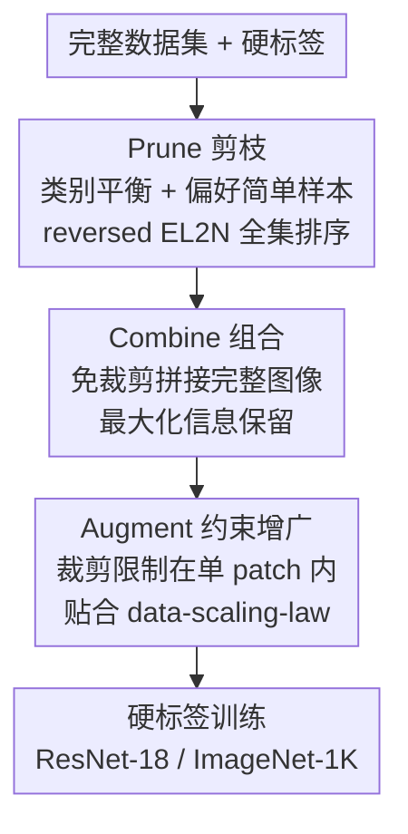

# Unifying Dataset Pruning and Distillation for Efficient Large-scale Compression

**会议**: ICML 2026  
**arXiv**: [2502.06434](https://arxiv.org/abs/2502.06434)  
**代码**: 有（论文称已开源于 GitHub）  
**领域**: 模型压缩 / 数据集压缩  
**关键词**: 数据集蒸馏, 数据集剪枝, 软标签, 硬标签, ImageNet 压缩

## 一句话总结
本文先用一个统一的数据集压缩基准戳破"数据集蒸馏（DD）优于剪枝"的假象——DD 的增益主要来自软标签而非合成图像，然后提出**只用硬标签**的 PCA（Prune-Combine-Augment）框架，在 ImageNet-1K 的极限压缩比下大幅超越现有 DD 与 DP 方法，同时省掉占图像存储 40 倍的软标签。

## 研究背景与动机

**领域现状**：把大数据集压小有两条主线。数据集剪枝（Dataset Pruning, DP）从原图里挑一个代表性子集，通常只删掉 <50% 的样本；数据集蒸馏（Dataset Distillation, DD）则合成新图像，把每类压到 10–100 张（IPC），压缩比超过 90%。两者长期被当成不同任务、在不同压缩比下各玩各的。

**现有痛点**：近年的 DD 越来越依赖真实图像——早期方法从噪声优化出合成图，后来 DWA 用真实图初始化、RDED 干脆直接拼真实图块。DD 和 DP 在"用原图"这件事上正在收敛，但学界一直没有把两者放在同一标准下公平比较，原因有二：（1）DD 普遍依赖**软标签**（教师网络输出的软概率），而 DP 只用硬标签，软标签的存储高达图像的 40 倍（ImageNet-10 IPC10 软标签 5.8GB vs 图像 157MB）；（2）DD/DP 各自的 batch size、loss、增广、迭代数都不一致，性能无法直接比。

**核心矛盾**：现有 DD 的"亮眼性能"到底来自蒸馏出的图像，还是来自软标签里偷带的教师知识？没人验证过。

**切入角度**：作者搭了一个统一的数据集压缩（DC）基准，把所有方法放在同一评测协议（沿用 CDA 设置）下，唯一变量是输入数据集，并补上一个被所有 DD 工作忽略的关键基线——**随机子集**。

**核心 idea**：基准揭示出 `DD < 随机 < 剪枝` 的稳定序关系，说明 DD 的优势是软标签的幻觉；据此作者主张回到**硬标签 + 高质量图像**，提出 PCA 框架，把焦点从"标签"搬回"图像"。

## 方法详解

### 整体框架
本文分两步：先用 DC 基准把问题诊断清楚，再给出 PCA 解法。

**诊断（DC 基准）**：在统一协议下，作者得到三条观察——（1）软标签下，多数 DD 方法连随机子集都打不过，IPC 越大越明显；（2）软标签下，剪枝子集稳定优于随机子集，解释了为什么近期 DD 越来越爱用原图；（3）换成硬标签后，`DD < 随机 < 剪枝` 的趋势不仅保持还被放大。结论：DD 的增益主要来自软标签而非合成图像，大规模压缩应当优先保证图像质量。

**解法（PCA）**：在只有硬标签的设定下，PCA 把"压缩"拆成三个串行阶段——先在全集上做**类别平衡的简单样本剪枝**（P），再用**免裁剪的方式拼接**这些图像（C），最后用**约束增广**在训练时释放小数据集的潜力（A）。整条管线不生成任何合成图、不调用教师网络。

### 关键设计

**1. 平衡 + 偏简单的全集剪枝：让小数据也别丢类、别留难图**

PCA 的第一步针对极限压缩比下剪枝的两个老问题。其一，传统剪枝按重要性删图，会让不重要的类被删得更狠，极端压缩比下甚至整类消失；PCA 借鉴 DD 的做法，强制**每类保留相同数量（IPC）**，维持完美类别平衡。其二，数据越小越要"简单图"——作者用预训练 EfficientNet-B0 做熵分析（图像预测分布的熵 $H(p_\theta(\cdot|x)) = -\sum_{y} p_\theta(y|x)\log p_\theta(y|x)$），发现剪枝保留的图平均熵最低、即最"简单"，这正是剪枝能赢蒸馏的直觉解释。因此 PCA 用**反向 EL2N**（reversed EL2N，优先选误差小、即容易学的样本）排序选图。其三，软标签缺席时信息更金贵，剪枝必须在**完整数据集**上做，而非像 RDED 那样从随机子集里抠图块，确保后续每步都只跟最有信息量的样本打交道。

**2. 免裁剪图像组合：拼整图而不是抠图块，保住硬标签救不回的信息**

RDED 等方法靠裁剪/拼图块来进一步压缩，但在只有硬标签的设定下，裁剪丢掉的内容硬标签监督**无法补回**。作者用理论把这点钉死：命题 4.1 证明"裁剪让评测损失（NLL）变低，并不保证熵也变低"（$\mathrm{NLL}(\mathcal{D}') < \mathrm{NLL}(\mathcal{D}) \nRightarrow H(\mathcal{D}') < H(\mathcal{D})$），而真正影响下游性能的是熵；定理 4.2 进一步证明，即便选择性裁剪一开始降了熵，存在某个裁剪比例 $r^*$ 使得**训练时随机增广一上，这点熵优势就被抹平甚至反转**（$H(\mathcal{D}') < H(\mathcal{D})$ 但 $H(\mathcal{A}_{r^*}(\mathcal{D}')) \ge H(\mathcal{A}_{r^*}(\mathcal{D}))$）。既然裁剪既不可靠又会被增广反噬，PCA 干脆拼接**完整的、已剪枝的整图**，把信息保留拉满。

**3. 约束增广贴合 data-scaling-law：别把简单图增广成难图**

小数据集要靠增广释放潜力，但增广必须服从作者所说的 data-scaling-law（缩小数据时的尺度规律）。问题在于 RDED 训练时直接对拼好的图做 Random Resized Crop，会把精心挑出的简单图又搅成复杂图，违背"小数据要简单"的原则。PCA 提出**约束增广**：把随机裁剪区域限制在**单个图像 patch 之内**，且每个 epoch 只用一张增广图（而非 RDED 的四张），因此相比 RDED **没有额外训练开销**，却能让增广结果继续贴合数据尺度规律，把小数据集的潜力真正发挥出来。

### 损失函数 / 训练策略
全程只用硬标签的标准交叉熵监督，不引入任何教师网络软标签。评测统一采用 CDA 协议（ResNet-18 / ImageNet-1K），训练设置在所有方法间保持一致，只换输入数据集，以保证可比性。

## 实验关键数据

### 主实验
ImageNet-1K、ResNet-18、硬标签设定下，PCA 在各 IPC 上相对随机基线的提升远超所有 DD/DP 对手（数值为 Top-1 准确率，括号为相对随机基线增量）：

| IPC（压缩比） | Random | SRe2L（DD） | RDED（DD†） | EL2N（DP） | PCA（本文） |
|------|------|------|------|------|------|
| 10 | 4.6 | 1.5 (↓3.1) | 11.5 (↑6.9) | 12.2 (↑7.6) | **22.8 (↑18.2)** |
| 50 | 20.6 | 3.8 (↓16.8) | 30.8 (↑10.2) | 31.1 (↑10.5) | **39.1 (↑18.5)** |
| 100 | 31.7 | 4.9 (↓26.8) | 39.2 (↑7.5) | 38.7 (↑7.0) | **45.5 (↑13.8)** |

可见硬标签下经典 DD（SRe2L/CDA）几乎崩溃（IPC100 掉 26.8 个点），而 PCA 在 IPC10 直接把随机基线从 4.6 拉到 22.8。

### 基准观察（软标签 vs 硬标签）
统一基准本身就是核心实验，揭示了 DD 性能的来源：

| 设定 | 序关系 | 含义 |
|------|--------|------|
| 软标签 | DD ≲ 随机 < 剪枝 | DD 多数打不过随机子集，剪枝最强 |
| 硬标签 | DD ≪ 随机 < 剪枝 | 去掉软标签后 DD 直接崩，差距被放大 |

软标签下随机子集（IPC10）达 35.8，多数 DD 方法（SRe2L 33.5、CDA 33.5）反而更低；这印证了"DD 的增益来自软标签"。软标签存储约为图像的 40×，时间开销也多 1.6–1.7×。

### 关键发现
- **软标签是幻觉之源**：连纯噪声配上预训练教师的软标签都能学出结果，说明软标签把"压缩数据集之外的知识"偷带进了评测，使 DD 的优势被高估。
- **简单 = 好**：熵分析显示剪枝子集平均熵最低，反向 EL2N 选简单样本是 PCA 制胜关键。
- **裁剪有害且不可逆**：理论（命题 4.1 / 定理 4.2）+ 实验共同支持"拼整图优于抠图块"，尤其在硬标签下。

## 亮点与洞察
- **基准先于方法**：先证明"皇帝没穿衣服"（DD 输给随机基线），再顺理成章地导出硬标签解法，论证链条非常扎实，是难得的"先批判后建设"型工作。
- **把一个被全行业忽略的基线（随机子集）摆上台面**，直接改写了对 DD/DP 优劣的认知，这种"补基线"的贡献往往比新方法更有杀伤力。
- **约束增广的洞察可迁移**："增广不能把简单样本搅复杂，要贴合数据尺度规律"这一点，对任何小样本/数据高效训练场景都有启发。
- **零教师、零软标签**：PCA 特别适合内存/存储受限、或拿不到大教师模型的部署场景。

## 局限与展望
- 基准与方法主要在 ImageNet-1K 分类 + ResNet-18 上验证，跨架构、跨任务（检测/分割/多模态）的泛化性待考。
- 反向 EL2N 偏好简单样本，在类内多样性高、长尾或细粒度数据上是否仍最优值得怀疑——"简单"未必等于"有代表性"。
- 完全放弃软标签换来了存储与部署友好，但也放弃了软标签可能携带的有用暗知识；硬标签上限是否真的更高，可能因数据集而异。
- 约束增广把裁剪限制在单 patch，调参空间（patch 大小、约束强度）对结果的敏感性论文着墨不多。

## 相关工作与启发
- **vs SRe2L / CDA（噪声初始化 DD）**：它们靠"squeeze-recover-relabel"三阶段优化合成图并重度依赖软标签；本文证明其增益主要来自软标签，硬标签下几乎崩溃，PCA 改用真实图 + 硬标签反超。
- **vs RDED（免优化 DD）**：RDED 从随机子集抠图块再拼接、训练时 Random Resized Crop；PCA 改为在全集上剪枝、拼整图、约束增广，理论与实验都表明"不裁剪"更稳，IPC10 从 11.5 提到 22.8。
- **vs 传统剪枝（EL2N / Forgetting / CCS）**：传统剪枝按重要性删图会破坏类别平衡且常用难样本；PCA 强制类别平衡 + 反向 EL2N 选简单样本 + 全集剪枝，在硬标签极限压缩比下显著更强。

## 评分
- 新颖性: ⭐⭐⭐⭐⭐ 用统一基准戳破 DD 的软标签幻觉，再给出硬标签解法，视角新且有冲击力
- 实验充分度: ⭐⭐⭐⭐ ImageNet 大规模、多 IPC、软/硬标签全覆盖，但任务与架构略单一
- 写作质量: ⭐⭐⭐⭐⭐ 诊断→解法逻辑清晰，理论命题支撑到位
- 价值: ⭐⭐⭐⭐⭐ 重新定义了 DD/DP 的比较框架，对数据高效训练社区影响大

<!-- RELATED:START -->

## 相关论文

- [\[ICLR 2026\] S2R-HDR: A Large-Scale Rendered Dataset for HDR Fusion](../../ICLR2026/model_compression/s2r-hdr_a_large-scale_rendered_dataset_for_hdr_fusion.md)
- [\[AAAI 2026\] EEG-DLite: Dataset Distillation for Efficient Large EEG Model Training](../../AAAI2026/model_compression/eeg-dlite_dataset_distillation_for_efficient_large_eeg_model_training.md)
- [\[ACL 2025\] UniICL: An Efficient ICL Framework Unifying Compression, Selection, and Generation](../../ACL2025/model_compression/uniicl_icl_framework.md)
- [\[AAAI 2026\] InfoCom: Kilobyte-Scale Communication-Efficient Collaborative Perception with Information-Aware Feature Compression](../../AAAI2026/model_compression/infocom_kilobyte-scale_communication-efficient_collaborative_perception_with_inf.md)
- [\[ACL 2025\] UniQuanF: Unifying Uniform and Binary-coding Quantization for Accurate Compression of Large Language Models](../../ACL2025/model_compression/uniquanf_unified_quantization.md)

<!-- RELATED:END -->
