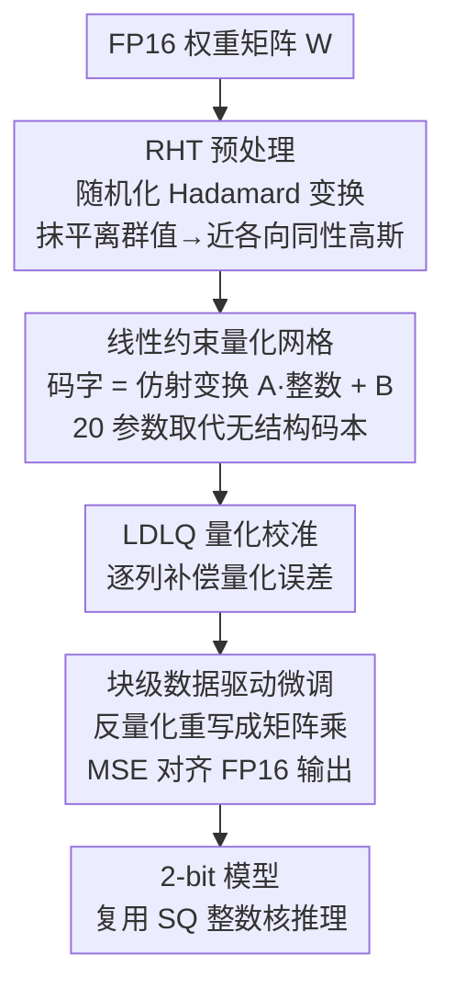

# UniSVQ: 2-bit Unified Scalar-Vector Quantization

**会议**: ICML 2026  
**arXiv**: [2606.10520](https://arxiv.org/abs/2606.10520)  
**代码**: 待确认  
**领域**: 模型压缩 / LLM 量化  
**关键词**: 2-bit 量化, 标量量化, 向量量化, 仿射格点, 后训练量化

## 一句话总结
UniSVQ 用"整数格点的仿射变换"把标量量化（SQ）和向量量化（VQ）统一起来，得到一种 2-bit 后训练量化方案：每个权重矩阵只需 20 个额外参数就拿到接近 VQ 的精度，却保持 SQ 的整数算子结构与推理吞吐。

## 研究背景与动机

**领域现状**：大模型推理贵，后训练量化（PTQ）是主流压缩手段。4-bit 及以上已基本无损，研究前沿转向 2-bit 及以下，主要分两派——标量量化（SQ，逐权重映射到离散值）和向量量化（VQ，把一组连续权重整体映射到码本中的码字）。

**现有痛点**：两派各有死穴。SQ 的反量化简单、能直接复用高度优化的整数张量核，但每个维度独立处理、min-max 投影对离群值极度敏感，2-bit 下 SOTA 模型在零样本任务上的性能下降可超 30%、难题上甚至 >50%。VQ 在 2-bit 下精度明显更高，但码本需要额外存储，一旦码本超过 GPU L1 缓存，频繁在显存和缓存间搬运码本会严重拖慢推理；为压码本又往往牺牲精度或引入更复杂的解码。

**核心矛盾**：精度（要 VQ 那样贴合权重分布的灵活格点）与效率（要 SQ 那样规整、可复用整数核、无码本搬运）之间存在结构性 trade-off。

**切入角度**：作者指出 VQ 的开销根源是**无结构的码本**。如果让量化网格（量化后权重矩阵所有可能取值构成的集合）满足某种线性约束——所有离散值都能由一组整数坐标向量经**仿射变换**得到——就能造出一种介于 SQ 与 VQ 之间的结构。

**核心 idea**：用"仿射变换 + 整数格点"参数化码字，量化时等价于"线性约束码本的 VQ"（拿到 VQ 级精度），推理时仿射变换可与线性层矩阵乘交换、退化成 SQ 式计算（复用 SQ 整数核、几乎不增存储）。

## 方法详解

### 整体框架
UniSVQ 把"统一表示"落到一个核心公式上：一组 $d$ 个连续权重被量化为

$$\Phi([w_1, w_2, \ldots, w_d]^T) = A[\bar{w}_1, \bar{w}_2, \ldots, \bar{w}_d]^T + B,\quad \bar{w}_i \in \mathbb{Z}$$

其中 $A$ 是仿射矩阵、$B$ 是偏置、$\bar{w}_i$ 是整数坐标。它既可解读为"自由度更高的 SQ"，也可解读为"码字受线性约束的 VQ"。以 $d=4$、2-bit 为例，VQ 码本需 $2^{4\times2}\times4\times2 = 2048$ 字节，而 UniSVQ 只需 $(4\times4+4)\times2 = 40$ 字节（仅 20 个参数：$4\times4$ 仿射矩阵 + 4 维偏置），额外存储降到约 $1/64$。

整个流程是三阶段串行：先用随机化 Hadamard 变换（RHT）压平离群值，再初始化线性约束格点并用 LDLQ 做量化校准，最后块级数据驱动微调仿射参数以进一步压低重构误差。

### 关键设计

**1. 线性约束量化网格：用仿射变换取代无结构码本，把 SQ 和 VQ 焊在一起**

这是全文的发动机，直接针对"VQ 灵活但无结构、SQ 规整但不灵活"的核心矛盾。作者不再像 VQ 那样存一张任意码本，而是规定所有码字都由整数向量经同一个仿射变换 $C_i = A\bar{W}_i + B$ 生成。相比 SQ，它把多个权重当作一个整体、用仿射变换替代逐整数的缩放平移，因此能把量化网格摆到权重分布的高密度区、误差更低；相比 VQ，它的网格高度规整，只需存一个 $A$ 和 $B$ 而非整张码本，存储骤降到 $1/64$。更关键的是，引入的仿射变换与线性层的矩阵乘**可交换**——推理时把仿射变换预先作用到激活上，主体计算就退化成 SQ 式的整数矩阵乘，从而复用已被极致优化的 SQ 算子、避免 VQ 的码本搬运瓶颈。

**2. RHT 预处理 + LDLQ 量化：先把离群值打平，再逐列补偿误差**

线性约束格点要想准，前提是权重分布足够规整。作者先用随机化 Hadamard 变换（RHT）$R(W) = US_U W S_V V$ 预处理（$S_U, S_V$ 是 $\{1,-1\}$ 随机对角阵，$U,V$ 是 Hadamard 矩阵）。直觉上离群值是"在某个坐标轴上投影特别大的向量"，RHT 相当于随机旋转，把这种大投影摊到所有轴上、抹平离群值；因 Hadamard 阵正交，RHT 完全可逆，推理时可逆变换回去，且用快速 Walsh–Hadamard 变换只需 $O(n\log_2 n)$。RHT 后权重近似服从标准多维高斯，最优码本恰好可由规整结构（即线性约束格点）逼近。网格初始化为中心对称、码字贴合高斯的形式 $C_i = sG\bar{W}_i - sGb\mathbf{1}$（$G$ 随机正交阵，$b=(2^b-1)/2$ 居中常数，$s=\sqrt{12/(2^{2b}-1)}$ 缩放因子）。随后用 LDLQ 做校准——对 Hessian 做 LDL 分解 $H=LDL^T$，逐列量化时用待量化权重的误差去补偿后续列：$\hat{W}_j = \Phi(W_j + \sum_{k=1}^{j-1}(W_k-\hat{W}_k)a_{kj})$，因为量化阶段 UniSVQ 等价于"线性约束码本的 VQ"，LDLQ 这套在 VQ 里验证过的强校准方法可直接拿来用。

**3. 块级数据驱动微调：把反量化重写成矩阵乘，用 MSE 反传校正格点**

随机正交初始化的格点未必最优——权重重要性不一、激活分布、RHT 结果的非平坦性都会影响最佳格点配置。作者的巧思是把反量化重写成可微的矩阵乘：对整数矩阵 $W_{\text{int}}$，反量化权重每块都是 $A W_{\text{int},i}^T + B\mathbf{1}^T$，于是线性运算 $Y=X\hat{W}^T$ 可拆成 $\sum_i (X_i A)W_{\text{int},i}^T + \sum_i (X_i B)\mathbf{1}^T$，其中 $X_i A$ 是浮点激活、$W_{\text{int},i}$ 保持整数。由于 $d$ 通常取 4 或 8，这步额外复杂度 $O(Nnd)+O(Nn)$ 远小于主体 $O(Nnm)$ 的矩阵乘。这样就能对 $A,B$ 做**逐块（block-wise）**微调：量化完一个 Transformer block 内全部矩阵后，以前一量化层的激活为输入、原 FP16 模型的输出为目标，用 MSE loss 让仿射参数自适应补偿量化误差，直接最小化重构误差而非间接代理目标。

### 损失函数 / 训练策略
微调目标是逐块的均方误差（MSE）重构损失：给定相同输入，让量化块输出尽量逼近 FP16 块输出。只微调浮点仿射参数 $A,B$，整数权重 $W_{\text{int}}$ 固定，因此优化代价小、可逐块顺序进行。

## 实验关键数据

### 主实验
在 Qwen-3 系列多个规模上对比 SQ / VQ 基线（Wiki/C4 为困惑度越低越好，Avg 为 6 个零样本 QA 平均准确率，Per. 为相对 FP16 的保留比例）：

| 模型 | 类型 | 方法 | Wiki↓ | Avg.↑ | Per.↑ |
|------|------|------|------|------|------|
| Qwen-3-32B | — | FP16 | 7.61 | 78.01 | 1.00 |
| | SQ | OSTQuant | 14.79 | 68.29 | 0.88 |
| | VQ | Quip# | 9.04 | 76.30 | 0.98 |
| | VQ | AQLM | 10.56 | 75.37 | 0.97 |
| | 本文 | **UniSVQ** | 9.26 | **76.15** | **0.98** |
| Qwen-3-8B | — | FP16 | 9.72 | 74.12 | 1.00 |
| | SQ | OSTQuant | 26.08 | 57.47 | 0.78 |
| | VQ | Quip# | 12.37 | 67.55 | 0.91 |
| | 本文 | **UniSVQ** | 14.82 | **67.95** | **0.92** |

UniSVQ 稳定碾压最强 SQ 基线（32B 上 Avg 比 OSTQuant 高约 8 个点），并与最强 VQ（Quip#/AQLM）持平甚至略优（8B 上 Avg 67.95 > Quip# 67.55）。

### 存储 / 效率对比

| 方案 | 额外存储（$d{=}4$, 2-bit） | 整数核复用 | 码本搬运瓶颈 |
|------|------|------|------|
| 标量量化 SQ | ~0 | 是 | 无 |
| 向量量化 VQ | 2048 字节/组 | 否 | 有 |
| **UniSVQ** | **40 字节/组（20 参数）** | **是** | **无** |

UniSVQ 额外存储仅为 VQ 的约 $1/64$，且仿射变换可预作用到激活、复用 SQ 的 Matmul 核，因此推理吞吐高于 VQ。

### 关键发现
- **无结构码本才是 VQ 的真正负担**：把码本换成仿射变换后，存储和解码复杂度大降，精度却几乎不掉——验证了作者的核心论断。
- **RHT 是精度前提**：RHT 把权重压成近高斯，规整的线性约束格点才能逼近最优码本；没有它，结构化网格难以贴合分布。
- **块级微调直接最小化重构误差**：把反量化写成矩阵乘使其可微，是 UniSVQ 能逼近 VQ 精度的关键一步。

## 亮点与洞察
- **一个公式统一两派**：$\Phi = A\bar{W} + B$ 同时是"高自由度 SQ"和"约束码本 VQ"，把长期对立的两条量化路线收进同一框架，理论上很优雅。
- **可交换性是落地关键**：仿射变换与矩阵乘可交换，使其推理退化成 SQ、复用现成整数核——这才是它既快又省的根本，而非单纯堆精度。
- **20 个参数换 VQ 级精度**：每个权重矩阵只加 20 个浮点参数，工程上几乎零负担，存储友好到极致。
- **可迁移思路**：用"低维结构 + 仿射/线性约束"逼近高自由度查表，这一招对 KV cache 量化、激活量化等同样可能适用。

## 局限与展望
- 主实验集中在 Qwen-3 系列，跨模型族（LLaMA/Mistral 等）虽有提及但深度有限，泛化性仍需更广验证。
- 精度仍略低于 FP16（如 8B 保留 0.92），2-bit 下与 FP16 的差距对极敏感任务可能仍不可忽略。
- 线性约束格点本质是对最优码本的低维近似，当 RHT 后权重偏离高斯（重尾/强相关）时，近似误差可能放大。
- 论文强调吞吐更高，但缺少与 VQ 在真实硬件上端到端延迟/吞吐的细粒度数字对照（笔记中效率优势主要来自结构分析与存储比，⚠️ 具体吞吐数值以原文为准）。

## 相关工作与启发
- **vs SQ（GPTQ / OmniQuant / OSTQuant 等）**：SQ 逐维独立、对离群值敏感，2-bit 下大幅掉点；UniSVQ 把多权重打包做仿射变换、贴合分布，精度高出一截，却仍复用 SQ 整数核。
- **vs 聚类型 VQ（AQLM / GPTVQ）**：它们用 K-means 学无结构码本、靠多级码本压存储；UniSVQ 用仿射变换替代码本，存储降到 $1/64$ 且无需多级解码。
- **vs 格点型 VQ（QuIP# / Qtip / NestQuant）**：这些方法用高对称码本或网格/卷积码压缩码字，推理需解压步骤；UniSVQ 的线性约束格点直接可逆、无解压开销，吞吐更友好。

## 评分
- 新颖性: ⭐⭐⭐⭐⭐ 用仿射格点把 SQ 与 VQ 统一，视角干净且有理论支撑
- 实验充分度: ⭐⭐⭐⭐ 多规模 + SQ/VQ 双线对比扎实，但硬件吞吐数字与跨模型族覆盖可更全
- 写作质量: ⭐⭐⭐⭐⭐ 矛盾→洞察→公式→落地的链条清晰，公式推导完整
- 价值: ⭐⭐⭐⭐⭐ 兼顾 VQ 精度与 SQ 效率，对 2-bit LLM 部署很有实用价值

<!-- RELATED:START -->

## 相关论文

- [\[ICML 2026\] ArcVQ-VAE: A Spherical Vector Quantization Framework with ArcCosine Additive Margin](arcvq-vae_a_spherical_vector_quantization_framework_with_arccosine_additive_marg.md)
- [\[ICML 2026\] NanoQuant: Efficient Sub-1-Bit Quantization of Large Language Models](nanoquant_efficient_sub-1-bit_quantization_of_large_language_models.md)
- [\[ICML 2026\] OSAQ: Outlier Self-Absorption for Accurate Low-bit LLM Quantization](osaq_outlier_self-absorption_for_accurate_low-bit_llm_quantization.md)
- [\[ICML 2026\] RQ-MoE: Residual Quantization via Mixture of Experts for Efficient Input-Dependent Vector Compression](rq-moe_residual_quantization_via_mixture_of_experts_for_efficient_input-dependen.md)
- [\[ICML 2026\] NeUQI: Near-Optimal Uniform Quantization Parameter Initialization for Low-Bit LLMs](neuqi_near-optimal_uniform_quantization_parameter_initialization_for_low-bit_llm.md)

<!-- RELATED:END -->
