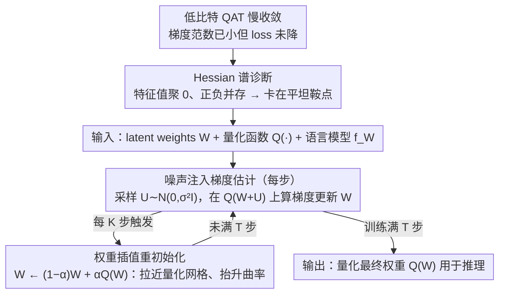

# WinQ: Accelerating Quantization-Aware Training of Language Models Around Saddle Points

**会议**: ICML2026  
**arXiv**: [2605.17471](https://arxiv.org/abs/2605.17471)  
**代码**: https://github.com/facebookresearch/WinQ  
**领域**: 模型压缩 / 低比特量化 / LLM效率  
**关键词**: 量化感知训练, 低比特LLM, Hessian谱, 鞍点优化, 噪声注入  

## 一句话总结
WinQ 把低比特语言模型 QAT 的慢收敛解释为权重陷在低曲率鞍点附近，并用周期性权重量化插值重初始化加噪声扰动梯度，在几乎不增加训练开销的情况下把 1-2 bit QAT 加速到 1.5-4 倍，并在相同训练预算下提升多种 LLaMA/Qwen 量化配置的困惑度和零样本准确率。

## 研究背景与动机
**领域现状**：大语言模型部署越来越依赖低比特量化。后训练量化在 4 bit 以上通常还能维持性能，但在 1-2 bit 甚至 1.58 bit 这类极低精度下会明显崩掉，因此主流方案会转向 quantization-aware training（QAT）：训练时仍维护全精度 latent weights，但前向和梯度估计围绕量化权重进行。

**现有痛点**：QAT 的效果好，代价也高。论文指出，即使是 4 bit QAT，训练成本也可接近全精度预训练的 10%；1 bit QAT 更慢，常常要在数十亿 token 上训练才有可用性能。已有 ParetoQ、QuEST 等方法主要改量化函数、Hadamard 变换或梯度估计，却没有真正解释为什么低比特 QAT 会在训练早期之后快速进入平台期。

**核心矛盾**：低比特量化一方面要求 latent weights 靠近离散量化网格，另一方面训练优化仍在连续权重空间中进行。作者的关键观察是：训练中的相对梯度范数很快变小，但 loss 还没有充分下降，这意味着模型不是简单缺少学习率，而是可能卡在局部曲率很弱的区域。Hessian 谱分析显示，低比特 QAT 的大量特征值集中在 0 附近，并且正负特征值同时存在，典型地对应平坦鞍点附近的停滞。

**本文目标**：论文想同时回答两个问题：第一，低比特 QAT 慢收敛的优化原因是什么；第二，能否设计一个不依赖具体量化器、额外成本很小的训练技巧，直接把模型从这种低曲率停滞区拉出来。

**切入角度**：作者没有从量化误差本身再做一个复杂量化器，而是把 QAT 看成非凸优化问题，测量 loss Hessian 的谱分布。这个角度有意思之处在于，它把“量化越低越难训”转化成可测量的曲率问题：比特数越低，最大 Hessian 特征值幅度越小，0 附近特征值比例越高，收敛越慢。

**核心 idea**：用周期性 $W \leftarrow (1-\alpha)W+\alpha Q(W)$ 把 latent weights 拉近量化权重、提升局部曲率，再在每步用 $Q(W+U)$ 的噪声扰动梯度帮助逃离鞍点。

## 方法详解
WinQ 的方法可以分成“诊断”和“干预”两层。诊断层用 Hessian 谱证明低比特 QAT 的慢收敛不是偶然现象；干预层则把这个诊断转化成两个非常轻量的训练操作：周期性权重插值重初始化，以及每步噪声注入。

### 整体框架
输入是一套已有 QAT 训练流程：给定全精度 latent weights $W$、量化函数 $Q(\cdot)$、语言模型 $f_W$ 和训练数据。普通 QAT 每一步会用量化后的 $Q(W)$ 做前向，并通过 STE 或相关梯度估计更新 $W$。WinQ 不替换这些量化函数，而是在训练循环外面套两件事。

第一，每个训练 step 先采样高斯噪声 $U \sim \mathcal{N}(0, \sigma^2 I)$，用带噪 latent weights 的量化结果 $Q(W+U)$ 来计算梯度，再更新原始 $W$。第二，每隔 $K$ 步，把当前 latent weights 重置为它和量化权重之间的线性插值 $W \leftarrow (1-\alpha)W+\alpha Q(W)$。训练结束后，和普通 QAT 一样，把最终 latent weights 量化成推理权重。

作者还给了 Hadamard 变换版本。若某些方法先做 $HW$ 再量化，那么插值发生在 Hadamard 空间中，再通过 $H^\top$ 映回权重空间，即 $W \leftarrow H^\top((1-\alpha)HW+\alpha Q(HW))$。这使 WinQ 可以叠加到 QuEST 这类带旋转/变换的 QAT 方法上。

### 关键设计
**1. Hessian 谱诊断：把"低比特越难训"变成可测的曲率问题**

作者没有急着再造一个量化器，而是先回答"为什么慢"。他们用 stochastic Lanczos quadrature 配合 Hessian-vector product 估计 loss Hessian 的特征值分布，发现 1-4 bit QAT 训练后期大量特征值聚集在 0 附近、且正负特征值同时存在——这正是平坦鞍点附近的典型特征。此时梯度范数已经很小，说明收敛速度主要由局部曲率（最大特征值幅度）决定。比特越低，0 附近特征值占比越高、最大特征值幅度越小（低精度下超过 40% 的特征值贴近 0），直接解释了"越低比特收敛越慢"。这个诊断不是事后配的解释图，而是后面两个干预操作的设计依据：既然瓶颈是曲率太弱、卡在鞍点，那就分别从"注入扰动逃离鞍点"和"抬升曲率"两个方向下手——也就是下面的噪声注入与权重插值。

**2. 噪声注入梯度估计：每步轻量扰动帮助逃离鞍点**

第一个干预对应训练循环里的每一步。普通 QAT 直接在 $Q(W)$ 上算梯度；WinQ 改成每步先采样高斯噪声 $U \sim \mathcal{N}(0,\sigma^2 I)$，在带噪量化权重 $Q(W+U)$ 上计算梯度再更新 $W$。这借鉴了非凸优化中"带噪 SGD 更容易逃离 saddle point"的结论（Jin et al., 2017）：Hessian 分析显示合适的噪声会让负曲率幅度更大、梯度范数略增，从而把模型推离低曲率停滞区；2 bit QAT 中 $\sigma=0.001$、$\alpha=0.6$ 时最大特征值幅度可达 3.96，明显高于无噪声的 2.65。它的好处是几乎零成本——不增加额外的 forward/backward，只多采样一个噪声向量。

**3. 权重插值重初始化：周期性把权重拉回量化网格、抬升曲率**

第二个干预每隔 $K$ 步触发一次，把 latent weights 重置为它与量化权重的线性插值 $W \leftarrow (1-\alpha)W+\alpha Q(W)$。它直接缩短 latent weights 与量化网格的距离（低比特时这个距离本就更大），同时抬升后续优化的局部曲率。论文给了一个漂亮的解释：在量化格点局部不变的假设下，这一步等价于在 $\ell_2$ 正则目标 $\Phi(W)=L_Q(W)+\frac{\gamma}{2}\|W-q\|^2$（$q=Q(W)$）上做一步近似 proximal update，且 $\alpha=\eta\gamma/(1+\eta\gamma)$，对应 Hessian 变成 $\nabla^2 L_Q(W)+\gamma I$——正则项把所有特征值整体抬高 $\gamma$，自然增大曲率。实验上，2 bit QAT 取 $\alpha=0.4$ 能把最大特征值幅度提升约 84%、把 0 附近特征值占比降低约 21%；又因为量化权重 $Q(W)$ 基本不变，这一步几乎不改变当前量化 loss，只改变后续的优化轨迹。它还不动 AdamW 的优化器状态，并支持上面的 Hadamard 变换版本，因而能直接叠加到 ParetoQ、QuEST 这类已有 QAT 方法上。

### 损失函数 / 训练策略
WinQ 不改变原始语言模型训练目标，仍是在 FineWebEdu 等语料上做自回归语言建模，并沿用底层 QAT 方法的量化函数。实验主要训练到 20B tokens，约 240K steps；超参数包括重初始化间隔 $K \in \{40K,60K,80K\}$、插值系数 $\alpha$ 大致在 0.1-0.6、噪声标准差 $\sigma$ 大致在 0.0002-0.002。优化器使用 AdamW，学习率约 $1\times10^{-5}$ 到 $4\times10^{-5}$。作者强调两个组件的额外 wall-clock 开销都低于基础 QAT 的 1%。

## 实验关键数据

### 主实验
论文在 LLaMA-3-1B/3B、Qwen-3-0.6B/1.7B 上评估 1、1.58、2、3、4 bit 权重量化，并组合 16/8/4 bit 激活。指标主要是 WikiText2 困惑度和 8 个 QA 数据集平均零样本准确率。

| 模型与量化设置 | 基线 | PPL ↓ | 平均QA Acc ↑ | WinQ PPL ↓ | WinQ Acc ↑ | 主要变化 |
|--------|------|------|------|------|------|------|
| LLaMA-1B W1A16 | ParetoQ | 16.9 | 51.9 | 15.3 | 52.6 | 1 bit 下困惑度明显下降，准确率提升 0.7 |
| LLaMA-1B W1.58A16 | ParetoQ | 14.0 | 54.7 | 12.9 | 55.6 | ternary 设置下 PPL 降 1.1，Acc +0.9 |
| LLaMA-1B W2A16 | ParetoQ | 12.5 | 56.7 | 11.9 | 56.6 | PPL 更低，准确率基本持平 |
| LLaMA-1B W1A8 | ParetoQ | 23.3 | 48.2 | 21.9 | 49.0 | 激活也量化到 8 bit 时仍有收益 |
| LLaMA-3B W1.58A8 | ParetoQ | 13.1 | 55.9 | 12.2 | 58.6 | 大模型低比特下 Acc +2.7 |

与 PTQ 方法相比，RTN/GPTQ/AWQ/SpinQuant 在 1-2 bit 下经常出现极高 PPL，例如 LLaMA-1B W1A16 下 RTN 和 GPTQ 的 PPL 达到 $10^8$ 量级；QAT 本身是必要的，而 WinQ 进一步改善 QAT 的收敛效率。论文还报告低于 4 bit 时相对 SoTA QAT 有 1.5-4 倍收敛加速，在相同计算预算下 sub-4-bit 性能最多提升 8.8%。

### 消融实验

| 配置 | 关键指标 | 说明 |
|------|---------|------|
| $\alpha=0.0$，无权重插值 | W1A16 LLaMA-1B PPL 16.5 | 只靠原始训练会停在较差困惑度 |
| $\alpha=0.2$，$K=60K$ | PPL 15.5 | 温和插值明显改善 |
| $\alpha=0.4$，$K=60K$ | PPL 15.3 | 主设置附近效果最好 |
| $\alpha=0.8$，$K=60K$ | PPL 16.0 | 插值太强会破坏训练状态 |
| $\sigma=0$ | PPL 16.0 | 无噪声注入时效果较弱 |
| $\sigma=0.001$ | PPL 15.3 | 合适噪声帮助逃离鞍点 |
| $\sigma=0.004$ | PPL 18.5 | 噪声过大反而扰乱优化 |

### 关键发现
- 最重要的发现不是“又调了一个量化器”，而是低比特 QAT 的慢收敛可以被 Hessian 谱解释：比特越低，0 附近特征值越多，最大特征值幅度越小，训练越容易陷入平坦鞍点。
- 权重插值和噪声注入缺一不可。插值主要改变 latent weights 相对量化网格的位置和曲率，噪声注入则提升局部扰动能力；二者都过强时会损害训练。
- WinQ 的泛化性较好：它能叠加到 ParetoQ，也能扩展到 Hadamard Transform 类方法，在 LLaMA 和 Qwen、不同参数规模、不同权重/激活位宽上都有一致收益。

## 亮点与洞察
- 这篇论文最有价值的地方在于把 QAT 慢收敛从“工程上就是难训”变成了一个可测的优化几何问题。Hessian 谱不是只作为解释图，而是直接导出了权重插值和噪声注入两个训练操作。
- 权重插值的设计很克制：它不要求改量化函数、不改优化器状态，也不需要额外模型结构。这个性质让它更像一个可插拔 QAT optimizer trick，而不是绑定某个量化方案的一次性方法。
- 近似 proximal update 的解释很有启发。低比特训练中 latent weights 与量化权重的距离本身就是优化难点，显式把这个距离纳入几何解释，比单纯惩罚量化误差更清楚地说明了为什么插值能提升曲率。
- 对其他方向的启发是：当训练因为离散化、剪枝、稀疏化等约束出现平台期时，未必只该改 surrogate gradient，也可以检查约束后的 loss landscape 是否出现低曲率 saddle，再设计轻量的重定位操作。

## 局限与展望
- 论文主要在 0.6B-3B 量级模型上验证，虽然覆盖 LLaMA 和 Qwen，但距离最常部署的 7B、13B、70B 仍有尺度差距。极大模型下 Hessian 谱现象是否同样可测、超参数是否稳定，还需要进一步验证。
- 方法需要调 $K$、$\alpha$、$\sigma$ 三个超参数。消融显示过大插值或过大噪声会显著变差，因此自动调参或基于曲率的自适应策略会更实用。
- Hessian 分析本身成本不低，虽然训练时 WinQ 便宜，但论文中的诊断流程不一定能成为常规工程监控手段。后续可以探索用梯度范数、量化误差、loss plateau 等廉价信号近似判断何时重初始化。
- 实验重点是语言模型 QAT。类似思想能否迁移到视觉模型、MoE、KV cache 量化、训练中激活量化，仍然是开放问题。

## 相关工作与启发
- **vs ParetoQ**: ParetoQ 关注 stretched elastic quantization 和 learnable step size，主要减少量化误差；WinQ 直接处理 QAT 的慢收敛问题，可以叠加在 ParetoQ 上获得额外收益。
- **vs QuEST**: QuEST 通过 Hadamard Transform 和 trust gradient estimator 改善极低比特量化；WinQ 把插值定义到 Hadamard 空间后可与其兼容，说明两者解决的是不同层面的瓶颈。
- **vs GPTQ/AWQ/SpinQuant 等 PTQ**: PTQ 在 1-2 bit 下常出现灾难性 PPL，说明极低比特必须经过训练适配；WinQ 的贡献是在 QAT 已经必要的前提下进一步降低训练成本。
- **vs ProxQuant/LOTION/CAGE**: 这些方法也把量化训练写成正则化或平滑目标；WinQ 的不同点是先用 Hessian 谱观察锁定 saddle-point 停滞，再把插值解释成 proximal-like 更新，优化解释更直接。

## 评分
- 新颖性: ⭐⭐⭐⭐☆ 从 Hessian 鞍点角度解释 QAT 慢收敛并导出轻量算法，视角很清晰；组件本身借鉴了插值和噪声优化思想。
- 实验充分度: ⭐⭐⭐⭐☆ 覆盖多个模型、位宽、激活精度和消融，主结论可信；但更大模型和真实部署吞吐还可以补强。
- 写作质量: ⭐⭐⭐⭐☆ 动机、谱分析、算法和实验闭环完整，附录表格丰富；部分 Hessian 细节对工程读者略重。
- 价值: ⭐⭐⭐⭐⭐ 对低比特 LLM QAT 很实用，尤其适合作为已有 QAT 方法的低成本加速插件。

<!-- RELATED:START -->

## 相关论文

- [\[ICLR 2026\] Compute-Optimal Quantization-Aware Training](../../ICLR2026/model_compression/compute-optimal_quantization-aware_training.md)
- [\[ACL 2025\] EfficientQAT: Efficient Quantization-Aware Training for Large Language Models](../../ACL2025/model_compression/efficientqat.md)
- [\[ICML 2026\] Entropy-Aware On-Policy Distillation of Language Models](entropy-aware_on-policy_distillation_of_language_models.md)
- [\[ICML 2026\] FAIR-Calib: Frontier-Aware Instability-Reweighted Calibration for Post-Training Quantization of Diffusion Large Language Models](fair-calib_frontier-aware_instability-reweighted_calibration_for_post-training_q.md)
- [\[ICCV 2025\] Scheduling Weight Transitions for Quantization-Aware Training](../../ICCV2025/model_compression/scheduling_weight_transitions_for_quantization-aware_training.md)

<!-- RELATED:END -->
